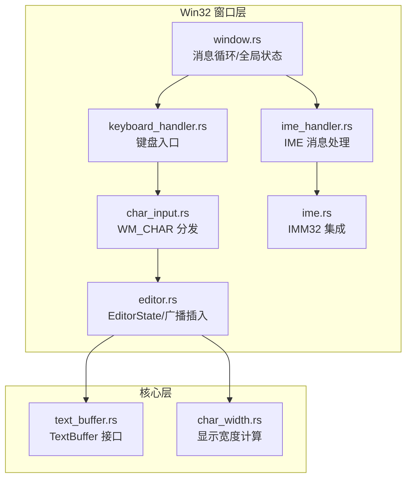
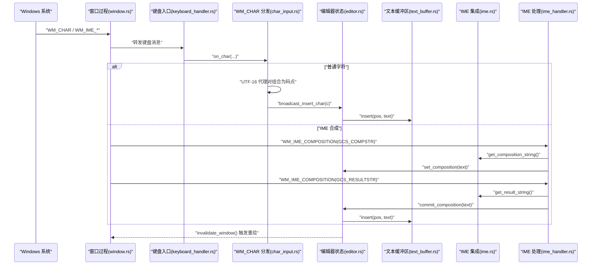
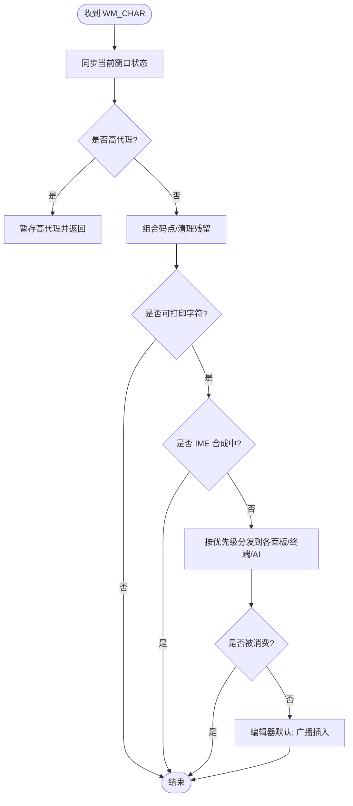
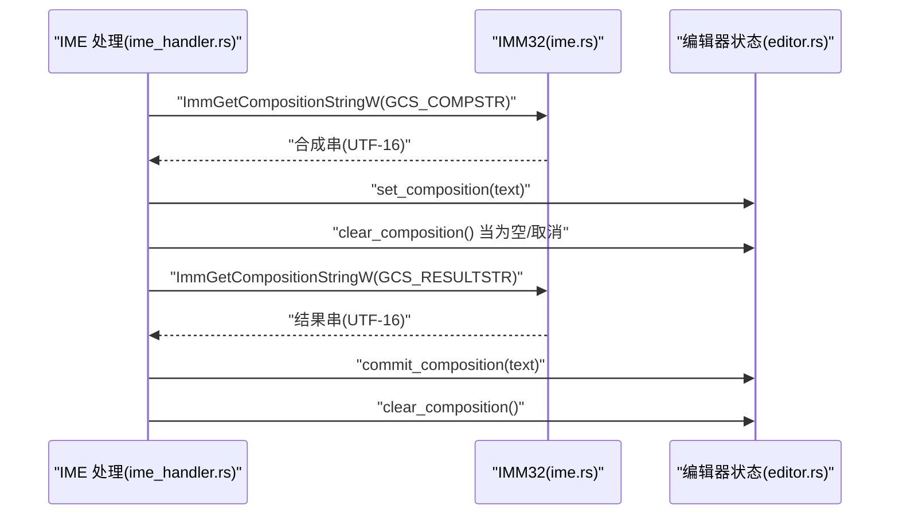
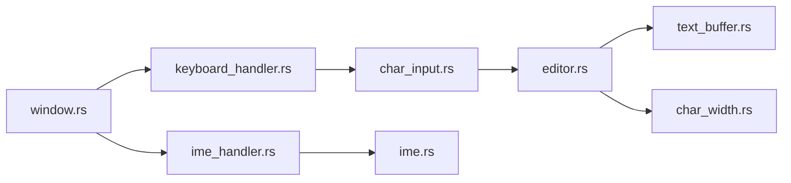

# 字符输入处理

<cite>
**本文引用的文件**   
- [crates/aether-win32/src/window.rs](file://crates/aether-win32/src/window.rs)
- [crates/aether-win32/src/window/keyboard_handler.rs](file://crates/aether-win32/src/window/keyboard_handler.rs)
- [crates/aether-win32/src/window/keyboard_handler/char_input.rs](file://crates/aether-win32/src/window/keyboard_handler/char_input.rs)
- [crates/aether-win32/src/window/ime_handler.rs](file://crates/aether-win32/src/window/ime_handler.rs)
- [crates/aether-win32/src/ime.rs](file://crates/aether-win32/src/ime.rs)
- [crates/aether-core/src/buffer/text_buffer.rs](file://crates/aether-core/src/buffer/text_buffer.rs)
- [crates/aether-core/src/char_width.rs](file://crates/aether-core/src/char_width.rs)
- [crates/aether-win32/src/editor.rs](file://crates/aether-win32/src/editor.rs)
</cite>

## 目录
1. [引言](#引言)
2. [项目结构](#项目结构)
3. [核心组件](#核心组件)
4. [架构总览](#架构总览)
5. [详细组件分析](#详细组件分析)
6. [依赖关系分析](#依赖关系分析)
7. [性能考量](#性能考量)
8. [故障排查指南](#故障排查指南)
9. [结论](#结论)
10. [附录](#附录)

## 引言
本技术文档聚焦于字符输入处理系统，围绕 Windows 消息循环中的 WM_CHAR 与 IME 合成流程展开，详细说明：
- ANSI/UTF-16 代理对到 Unicode 码点的转换机制
- 文本输入的验证、过滤与格式化规则
- 字符编码处理、多字节字符支持与国际化输入（IME）
- 文本插入、删除与替换的实现细节
- 批量输入与输入法兼容性策略
- 错误恢复机制与用户体验优化

## 项目结构
字符输入相关代码主要分布在 Win32 窗口层与核心缓冲区层之间：
- 窗口层负责接收 Windows 消息（WM_CHAR、WM_IME_*），进行路由与状态同步
- 输入法集成模块提供候选/合成窗口定位与字符串读取
- 编辑器状态承载多光标、查找替换、面板焦点等上下文
- 核心缓冲区抽象定义插入/删除/替换接口，供上层调用



图表来源
- [crates/aether-win32/src/window.rs:57-110](file://crates/aether-win32/src/window.rs#L57-L110)
- [crates/aether-win32/src/window/keyboard_handler.rs:1-13](file://crates/aether-win32/src/window/keyboard_handler.rs#L1-L13)
- [crates/aether-win32/src/window/keyboard_handler/char_input.rs:1-90](file://crates/aether-win32/src/window/keyboard_handler/char_input.rs#L1-L90)
- [crates/aether-win32/src/window/ime_handler.rs:1-132](file://crates/aether-win32/src/window/ime_handler.rs#L1-L132)
- [crates/aether-win32/src/ime.rs:25-196](file://crates/aether-win32/src/ime.rs#L25-L196)
- [crates/aether-win32/src/editor.rs:4733-4828](file://crates/aether-win32/src/editor.rs#L4733-L4828)
- [crates/aether-core/src/buffer/text_buffer.rs:1-49](file://crates/aether-core/src/buffer/text_buffer.rs#L1-L49)
- [crates/aether-core/src/char_width.rs:1-32](file://crates/aether-core/src/char_width.rs#L1-L32)

章节来源
- [crates/aether-win32/src/window.rs:57-110](file://crates/aether-win32/src/window.rs#L57-L110)
- [crates/aether-win32/src/window/keyboard_handler.rs:1-13](file://crates/aether-win32/src/window/keyboard_handler.rs#L1-L13)

## 核心组件
- WM_CHAR 分发器：解析 UTF-16 代理对，按优先级将可打印字符路由至各 UI 面板或编辑器默认插入逻辑
- IME 集成：通过 IMM32 获取合成串/结果串，设置候选/合成窗口位置，控制 IME 开关状态
- EditorState：维护当前焦点、多光标、查找替换、面板状态；提供 set_composition/commit_composition/clear_composition 与 broadcast_insert_char
- TextBuffer 接口：以字节偏移为单位的插入/删除/切片/行操作，支持快照与编辑结果合并
- 字符宽度：基于 East Asian Width 的零宽/宽/窄判定，用于渲染与布局

章节来源
- [crates/aether-win32/src/window/keyboard_handler/char_input.rs:1-90](file://crates/aether-win32/src/window/keyboard_handler/char_input.rs#L1-L90)
- [crates/aether-win32/src/window/ime_handler.rs:1-132](file://crates/aether-win32/src/window/ime_handler.rs#L1-L132)
- [crates/aether-win32/src/ime.rs:25-196](file://crates/aether-win32/src/ime.rs#L25-L196)
- [crates/aether-win32/src/editor.rs:4733-4828](file://crates/aether-win32/src/editor.rs#L4733-L4828)
- [crates/aether-core/src/buffer/text_buffer.rs:1-49](file://crates/aether-core/src/buffer/text_buffer.rs#L1-L49)
- [crates/aether-core/src/char_width.rs:1-32](file://crates/aether-core/src/char_width.rs#L1-L32)

## 架构总览
下图展示从 Windows 消息到编辑器缓冲区的端到端路径，包括 IME 合成与提交。



图表来源
- [crates/aether-win32/src/window.rs:57-110](file://crates/aether-win32/src/window.rs#L57-L110)
- [crates/aether-win32/src/window/keyboard_handler.rs:1-13](file://crates/aether-win32/src/window/keyboard_handler.rs#L1-L13)
- [crates/aether-win32/src/window/keyboard_handler/char_input.rs:1-90](file://crates/aether-win32/src/window/keyboard_handler/char_input.rs#L1-L90)
- [crates/aether-win32/src/window/ime_handler.rs:1-132](file://crates/aether-win32/src/window/ime_handler.rs#L1-L132)
- [crates/aether-win32/src/ime.rs:25-196](file://crates/aether-win32/src/ime.rs#L25-L196)
- [crates/aether-win32/src/editor.rs:4733-4828](file://crates/aether-win32/src/editor.rs#L4733-L4828)
- [crates/aether-core/src/buffer/text_buffer.rs:1-49](file://crates/aether-core/src/buffer/text_buffer.rs#L1-L49)

## 详细组件分析

### WM_CHAR 处理流程与 UTF-16 代理对
- 进入 on_char 后先同步 thread_local 活跃窗口状态，避免 Alt+Tab 导致状态错配
- 检测高代理（0xD800-0xDBFF）暂存并返回；收到低代理（0xDC00-0xDFFF）时组合为完整码点；非代理字符清除残留高代理
- 仅处理可打印字符（ch >= 32 且 ch != 127），并通过 char::from_u32 校验有效性
- 若处于 IME 合成期，则跳过分发，避免重复插入
- 按优先级依次尝试各输入目标（文件树、设置、搜索、SSH/克隆对话框、命令面板、查找替换、终端、AI 面板），首个匹配者消费字符
- 未命中任何面板时，走编辑器默认逻辑：广播插入字符到所有光标



图表来源
- [crates/aether-win32/src/window/keyboard_handler/char_input.rs:1-90](file://crates/aether-win32/src/window/keyboard_handler/char_input.rs#L1-L90)

章节来源
- [crates/aether-win32/src/window/keyboard_handler/char_input.rs:1-90](file://crates/aether-win32/src/window/keyboard_handler/char_input.rs#L1-L90)

### IME 合成与提交
- WM_IME_STARTCOMPOSITION：初始化位置（实际位置由渲染阶段更新）
- WM_IME_COMPOSITION：
  - GCS_RESULTSTR：优先处理已提交文本，读取结果串并 commit_composition，随后重置合成标志，使 Backspace 立即可达终端
  - GCS_COMPSTR：读取合成串并 set_composition，通知钩子进入合成期；空串表示取消合成，clear_composition
- WM_IME_ENDCOMPOSITION：清除合成显示；若终端聚焦则关闭 IME，便于立即删除
- WM_IME_CHAR：阻止 TranslateMessage 产生 WM_CHAR，避免中文重复插入



图表来源
- [crates/aether-win32/src/window/ime_handler.rs:1-132](file://crates/aether-win32/src/window/ime_handler.rs#L1-L132)
- [crates/aether-win32/src/ime.rs:25-196](file://crates/aether-win32/src/ime.rs#L25-L196)
- [crates/aether-win32/src/editor.rs:4733-4828](file://crates/aether-win32/src/editor.rs#L4733-L4828)

章节来源
- [crates/aether-win32/src/window/ime_handler.rs:1-132](file://crates/aether-win32/src/window/ime_handler.rs#L1-L132)
- [crates/aether-win32/src/ime.rs:25-196](file://crates/aether-win32/src/ime.rs#L25-L196)

### 文本插入、删除与替换
- 插入：broadcast_insert_char 将字符广播到多光标位置，最终调用 TextBuffer.insert(pos, text)
- 删除/替换：通过 EditOp::Delete/Replace 语义在缓冲区上执行，受影响的行范围由 EditResult 记录，用于缓存失效与增量渲染
- 行/列与字节偏移互转：line_col_to_byte 与 byte_to_line_col 保证以字节偏移为核心的操作一致性

```mermaid
classDiagram
class TextBuffer {
+insert(pos, text) void
+delete(start, end) void
+slice(start, end) String
+full_text() String
+line_count() usize
+byte_len() usize
+line_text(line_idx) Option<String>
+line_byte_range(line_idx) Option<(usize, usize)>
+line_col_to_byte(line, col) usize
+byte_to_line_col(byte) (usize, usize)
+create_snapshot() Box<dyn TextBufferSnapshot>
+save_state() BufferState
+restore_state(state) void
}
class EditOp {
<<enum>>
Insert{pos, text}
Delete{start, end}
Replace{start, end, text}
}
class EditResult {
+start_line : usize
+end_line : usize
+line_delta : isize
+merge(other) EditResult
}
class MultiCursorState {
+cursors : Vec<Cursor>
+selections : Vec<Option<Selection>>
+primary_cursor : usize
+add_cursor(cursor)
+clear_secondary_cursors()
+cursor_count() usize
+add_column_cursors(...)
+is_column_mode() bool
}
TextBuffer <.. EditOp : "使用"
TextBuffer <.. EditResult : "影响范围"
MultiCursorState <.. TextBuffer : "多光标插入"
```

图表来源
- [crates/aether-core/src/buffer/text_buffer.rs:1-171](file://crates/aether-core/src/buffer/text_buffer.rs#L1-L171)
- [crates/aether-core/src/buffer/text_buffer.rs:173-258](file://crates/aether-core/src/buffer/text_buffer.rs#L173-L258)

章节来源
- [crates/aether-core/src/buffer/text_buffer.rs:1-171](file://crates/aether-core/src/buffer/text_buffer.rs#L1-L171)
- [crates/aether-core/src/buffer/text_buffer.rs:173-258](file://crates/aether-core/src/buffer/text_buffer.rs#L173-L258)

### 字符编码与国际化
- UTF-16 代理对：在 WM_CHAR 中组合高/低代理为完整码点，确保 BMP 外字符（如 Emoji、CJK 扩展区）正确输入
- IME 集成：通过 IMM32 读取 UTF-16 合成串/结果串，转换为 Rust String；支持中日韩输入法候选窗口定位与 DPI 缩放
- 显示宽度：实现 East Asian Width 精简版，区分零宽/宽/窄字符，覆盖重音拉丁、CJK、Emoji、组合标记等

章节来源
- [crates/aether-win32/src/window/keyboard_handler/char_input.rs:18-37](file://crates/aether-win32/src/window/keyboard_handler/char_input.rs#L18-L37)
- [crates/aether-win32/src/ime.rs:25-196](file://crates/aether-win32/src/ime.rs#L25-L196)
- [crates/aether-core/src/char_width.rs:1-32](file://crates/aether-core/src/char_width.rs#L1-L32)

### 文本输入验证、过滤与格式化
- 可打印性过滤：仅接受 ch >= 32 且 ch != 127 的字符，无效码点丢弃
- IME 合成期保护：合成期间不向终端/编辑器重复插入原始字符
- 面板级输入：文件树、设置、搜索、SSH/克隆对话框、命令面板、查找替换、终端、AI 面板各自维护输入状态与焦点
- 查找替换联动：输入查询时自动刷新结果并滚动到首个匹配项

章节来源
- [crates/aether-win32/src/window/keyboard_handler/char_input.rs:39-88](file://crates/aether-win32/src/window/keyboard_handler/char_input.rs#L39-L88)
- [crates/aether-win32/src/window/keyboard_handler/char_input.rs:314-354](file://crates/aether-win32/src/window/keyboard_handler/char_input.rs#L314-L354)

### 批量输入与输入法兼容性
- 批量输入：多光标模式下 broadcast_insert_char 将同一字符插入到所有光标位置，提升批量编辑效率
- 输入法兼容：
  - 合成期通过 set_composition 预览，提交后 commit_composition 写入缓冲区
  - 终端聚焦场景下，结束合成后立即关闭 IME，避免 Backspace 无法直达终端的问题
  - 阻止 WM_IME_CHAR 产生 WM_CHAR，防止重复插入

章节来源
- [crates/aether-win32/src/window/keyboard_handler/char_input.rs:399-412](file://crates/aether-win32/src/window/keyboard_handler/char_input.rs#L399-L412)
- [crates/aether-win32/src/window/ime_handler.rs:95-132](file://crates/aether-win32/src/window/ime_handler.rs#L95-L132)

### 错误恢复与用户体验优化
- 孤立代理对防护：非代理字符时清除残留高代理，避免污染后续低代理输入
- 脏区域与重绘：事件处理后统一调用 invalidate_window，由 WM_PAINT 驱动渲染，避免双重绘制
- 终端即时删除：提交汉字后关闭 IME，用户可立即用 Backspace 删除
- 查找替换反馈：实时高亮首个匹配项并移动光标，提升交互体验

章节来源
- [crates/aether-win32/src/window/keyboard_handler/char_input.rs:33-37](file://crates/aether-win32/src/window/keyboard_handler/char_input.rs#L33-L37)
- [crates/aether-win32/src/window.rs:66-75](file://crates/aether-win32/src/window.rs#L66-L75)
- [crates/aether-win32/src/window/ime_handler.rs:95-118](file://crates/aether-win32/src/window/ime_handler.rs#L95-L118)
- [crates/aether-win32/src/window/keyboard_handler/char_input.rs:314-354](file://crates/aether-win32/src/window/keyboard_handler/char_input.rs#L314-L354)

## 依赖关系分析
- 窗口层依赖键盘与 IME 子模块，键盘子模块再依赖具体分发器
- 分发器依赖 EditorState 与各面板状态，最终落到 TextBuffer 接口
- IME 集成依赖 IMM32 API，EditorState 负责合成状态与提交逻辑
- 字符宽度工具被编辑器渲染与布局使用



图表来源
- [crates/aether-win32/src/window.rs:1-20](file://crates/aether-win32/src/window.rs#L1-L20)
- [crates/aether-win32/src/window/keyboard_handler.rs:1-13](file://crates/aether-win32/src/window/keyboard_handler.rs#L1-L13)
- [crates/aether-win32/src/window/keyboard_handler/char_input.rs:1-90](file://crates/aether-win32/src/window/keyboard_handler/char_input.rs#L1-L90)
- [crates/aether-win32/src/window/ime_handler.rs:1-132](file://crates/aether-win32/src/window/ime_handler.rs#L1-L132)
- [crates/aether-win32/src/ime.rs:25-196](file://crates/aether-win32/src/ime.rs#L25-L196)
- [crates/aether-core/src/buffer/text_buffer.rs:1-49](file://crates/aether-core/src/buffer/text_buffer.rs#L1-L49)
- [crates/aether-core/src/char_width.rs:1-32](file://crates/aether-core/src/char_width.rs#L1-L32)

章节来源
- [crates/aether-win32/src/window.rs:1-20](file://crates/aether-win32/src/window.rs#L1-L20)
- [crates/aether-win32/src/window/keyboard_handler.rs:1-13](file://crates/aether-win32/src/window/keyboard_handler.rs#L1-L13)

## 性能考量
- 代理对组合与字符校验在消息处理路径上开销极低，但应避免在高频路径中进行昂贵分配
- 使用 invalidate_window 合并多次重绘请求，减少 WM_PAINT 次数
- 多光标广播插入可减少重复逻辑，但需注意大量光标时的插入成本
- 字符宽度计算采用范围判断，避免外部库依赖，利于编译速度与运行性能
- 建议：
  - 对超大文本批量粘贴，考虑分块插入与延迟重绘
  - 在 IME 合成期仅更新预览，避免频繁修改缓冲区
  - 对查找替换结果进行节流，避免每次按键都全量重算

[本节为通用指导，无需源码引用]

## 故障排查指南
- 中文输入重复插入：检查 WM_IME_CHAR 是否被拦截，确认 IME 合成期未分发原始字符
- 代理对异常字符：确认高代理暂存与清理逻辑，避免孤立高代理污染后续输入
- 终端无法删除汉字：确认提交后是否关闭 IME，以及合成结束后是否重置合成标志
- 重绘闪烁或卡顿：确认是否频繁直接调用 render，应改为 invalidate_window 并由 WM_PAINT 驱动

章节来源
- [crates/aether-win32/src/window/ime_handler.rs:120-132](file://crates/aether-win32/src/window/ime_handler.rs#L120-L132)
- [crates/aether-win32/src/window/keyboard_handler/char_input.rs:33-37](file://crates/aether-win32/src/window/keyboard_handler/char_input.rs#L33-L37)
- [crates/aether-win32/src/window.rs:66-75](file://crates/aether-win32/src/window.rs#L66-L75)

## 结论
本系统通过清晰的层次划分与严格的输入路径控制，实现了稳健的字符输入处理：
- 正确处理 UTF-16 代理对与 IME 合成/提交
- 提供多光标批量输入与面板级输入路由
- 以字节偏移为核心，结合 EditResult 精确管理行级缓存失效
- 兼顾性能与用户体验，支持国际化与高 DPI 环境

[本节为总结，无需源码引用]

## 附录
- 关键函数路径参考：
  - WM_CHAR 分发入口：[crates/aether-win32/src/window/keyboard_handler/char_input.rs:11-90](file://crates/aether-win32/src/window/keyboard_handler/char_input.rs#L11-L90)
  - IME 合成/提交：[crates/aether-win32/src/window/ime_handler.rs:22-93](file://crates/aether-win32/src/window/ime_handler.rs#L22-L93)
  - EditorState 合成方法：[crates/aether-win32/src/editor.rs:4733-4828](file://crates/aether-win32/src/editor.rs#L4733-L4828)
  - TextBuffer 接口：[crates/aether-core/src/buffer/text_buffer.rs:1-49](file://crates/aether-core/src/buffer/text_buffer.rs#L1-L49)
  - 字符宽度计算：[crates/aether-core/src/char_width.rs:1-32](file://crates/aether-core/src/char_width.rs#L1-L32)

[本节为索引，无需源码引用]