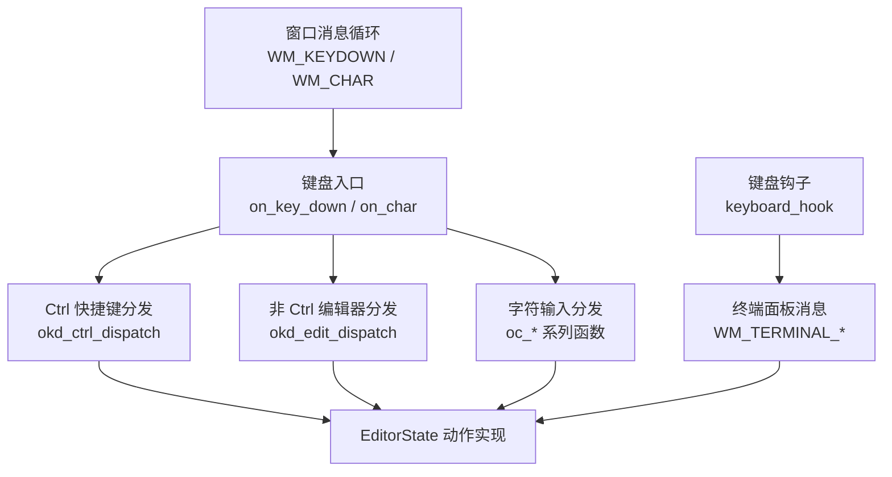
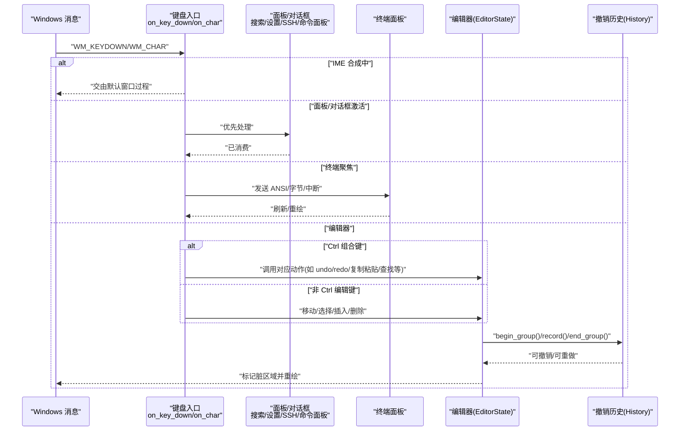
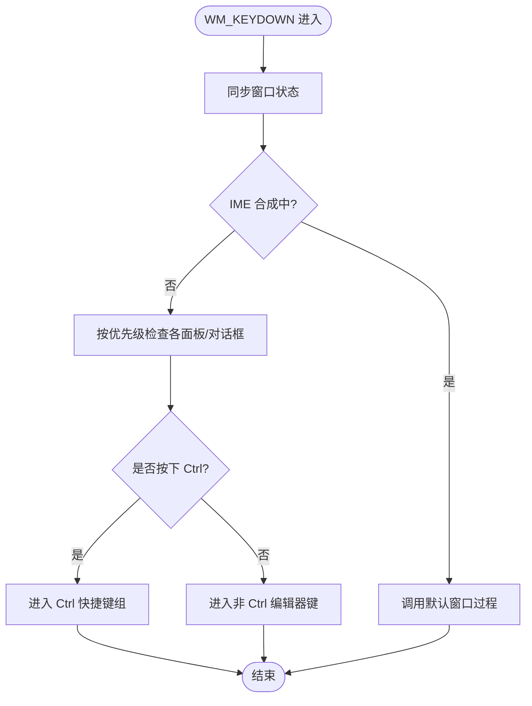
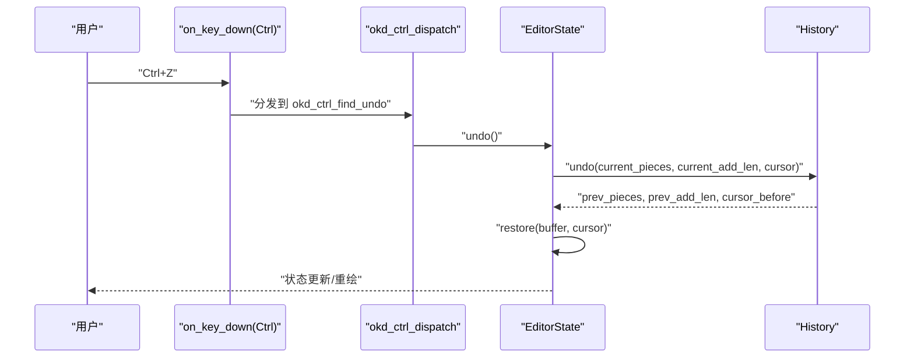
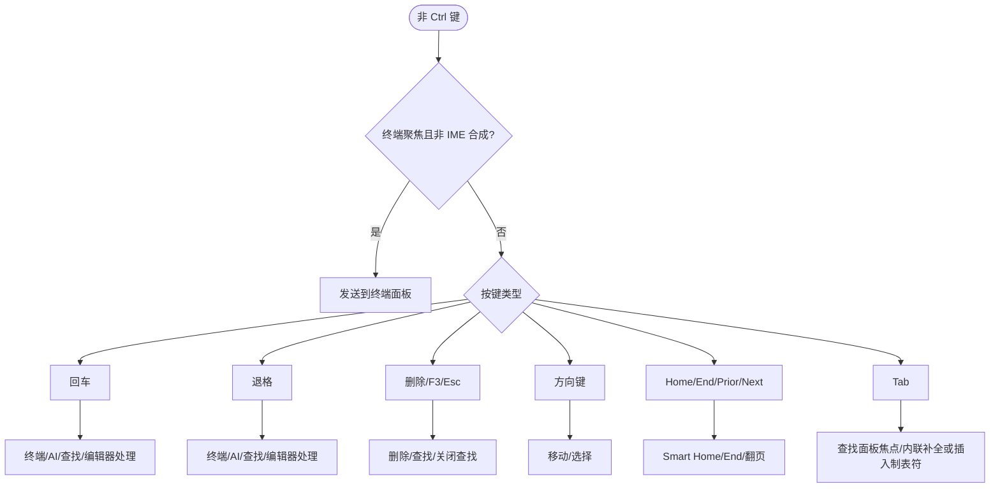
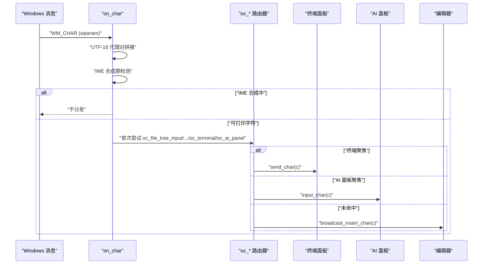
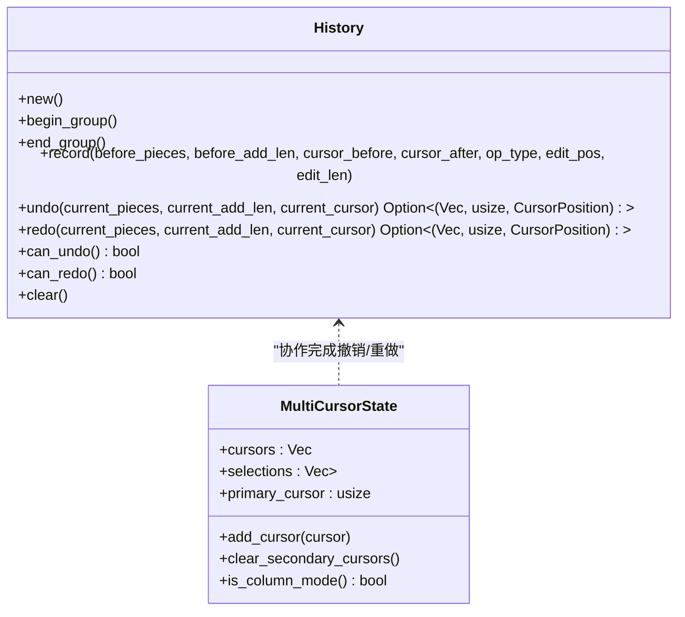
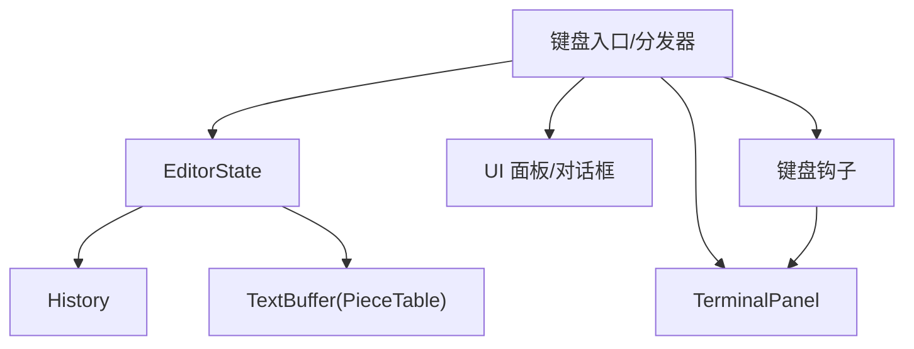

# 编辑模式键盘支持

<cite>
**本文引用的文件**   
- [keyboard_handler.rs](file://crates/aether-win32/src/window/keyboard_handler.rs)
- [key_down.rs](file://crates/aether-win32/src/window/keyboard_handler/key_down.rs)
- [key_down_ctrl.rs](file://crates/aether-win32/src/window/keyboard_handler/key_down_ctrl.rs)
- [key_down_edit.rs](file://crates/aether-win32/src/window/keyboard_handler/key_down_edit.rs)
- [char_input.rs](file://crates/aether-win32/src/window/keyboard_handler/char_input.rs)
- [input.rs](file://crates/aether-win32/src/input.rs)
- [editor.rs](file://crates/aether-win32/src/editor.rs)
- [text_buffer.rs](file://crates/aether-core/src/buffer/text_buffer.rs)
- [history.rs](file://crates/aether-core/src/buffer/history.rs)
- [keyboard_hook.rs](file://crates/aether-win32/src/keyboard_hook.rs)
</cite>

## 目录
1. [简介](#简介)
2. [项目结构](#项目结构)
3. [核心组件](#核心组件)
4. [架构总览](#架构总览)
5. [详细组件分析](#详细组件分析)
6. [依赖关系分析](#依赖关系分析)
7. [性能考量](#性能考量)
8. [故障排查指南](#故障排查指南)
9. [结论](#结论)
10. [附录](#附录)

## 简介
本技术文档聚焦于“编辑模式键盘支持系统”，围绕 Windows 消息循环中的 WM_KEYDOWN 与 WM_CHAR 处理，梳理从按键到命令执行、状态切换、多光标与撤销重做等关键路径。同时说明快捷键映射与动作分发机制、终端/AI/查找面板的输入路由差异、以及可配置化与扩展点设计。文末提供调试与性能监控建议，帮助定位问题并优化体验。

## 项目结构
键盘子系统位于 aether-win32 窗体模块中，采用“入口 + 按职责拆分”的组织方式：
- 入口层：统一接收 WM_KEYDOWN/WM_CHAR，提取修饰键（Ctrl/Shift/Alt），并按优先级分发给各子处理器。
- Ctrl 快捷键组：集中处理 Ctrl+ 组合键（文件操作、视图切换、剪贴板、查找/替换、标签页、词级移动、列选择等）。
- 非 Ctrl 编辑器键：处理回车、退格、删除、方向键、Home/End/PageUp/Down、Tab 等基础编辑行为。
- 字符输入：WM_CHAR 负责 UTF-16 代理对拼接、IME 合成期避让、以及按优先级将字符路由到各 UI 面板或编辑器。
- 全局钩子：在特定场景下拦截方向键/删除/退格，转发给终端面板。

图表来源
- [keyboard_handler.rs:1-13](file://crates/aether-win32/src/window/keyboard_handler.rs#L1-L13)
- [key_down.rs:17-117](file://crates/aether-win32/src/window/keyboard_handler/key_down.rs#L17-L117)
- [key_down_ctrl.rs:14-28](file://crates/aether-win32/src/window/keyboard_handler/key_down_ctrl.rs#L14-L28)
- [key_down_edit.rs:14-55](file://crates/aether-win32/src/window/keyboard_handler/key_down_edit.rs#L14-L55)
- [char_input.rs:10-90](file://crates/aether-win32/src/window/keyboard_handler/char_input.rs#L10-L90)
- [keyboard_hook.rs:213-246](file://crates/aether-win32/src/keyboard_hook.rs#L213-L246)

章节来源
- [keyboard_handler.rs:1-13](file://crates/aether-win32/src/window/keyboard_handler.rs#L1-L13)
- [key_down.rs:17-117](file://crates/aether-win32/src/window/keyboard_handler/key_down.rs#L17-L117)
- [key_down_ctrl.rs:14-28](file://crates/aether-win32/src/window/keyboard_handler/key_down_ctrl.rs#L14-L28)
- [key_down_edit.rs:14-55](file://crates/aether-win32/src/window/keyboard_handler/key_down_edit.rs#L14-L55)
- [char_input.rs:10-90](file://crates/aether-win32/src/window/keyboard_handler/char_input.rs#L10-L90)
- [keyboard_hook.rs:213-246](file://crates/aether-win32/src/keyboard_hook.rs#L213-L246)

## 核心组件
- 键盘入口与分发器
  - WM_KEYDOWN：解析虚拟键码与修饰键，按优先级检查各类面板焦点（搜索、欢迎页、补全、设置、SSH/克隆对话框、命令面板等），再进入 Ctrl 或非 Ctrl 分支。
  - WM_CHAR：UTF-16 代理对拼接、IME 合成期避让、按优先级将字符投递到目标面板或编辑器默认插入。
- Ctrl 快捷键组
  - 文件操作（打开/保存/新建）、视图切换（侧栏/终端/命令面板）、字体缩放、剪贴板、查找/替换、标签页导航、词级移动、行注释、列选择、内联补全触发等。
- 非 Ctrl 编辑器键
  - 回车、退格、删除、方向键、Home/End/PageUp/Down、Tab；含智能 Home、选择联动、查找面板交互、终端转发等。
- 文本与历史
  - 基于 PieceTable 的缓冲区抽象与多光标状态；高效撤销/重做（合并策略与撤销组）。
- 全局钩子
  - 在终端模式下拦截方向键/删除/退格，通过自定义消息转发至终端面板。

章节来源
- [key_down.rs:17-117](file://crates/aether-win32/src/window/keyboard_handler/key_down.rs#L17-L117)
- [char_input.rs:10-90](file://crates/aether-win32/src/window/keyboard_handler/char_input.rs#L10-L90)
- [key_down_ctrl.rs:14-28](file://crates/aether-win32/src/window/keyboard_handler/key_down_ctrl.rs#L14-L28)
- [key_down_edit.rs:14-55](file://crates/aether-win32/src/window/keyboard_handler/key_down_edit.rs#L14-L55)
- [text_buffer.rs:1-49](file://crates/aether-core/src/buffer/text_buffer.rs#L1-L49)
- [history.rs:1-100](file://crates/aether-core/src/buffer/history.rs#L1-L100)
- [keyboard_hook.rs:213-246](file://crates/aether-win32/src/keyboard_hook.rs#L213-L246)

## 架构总览
下图展示从 Windows 消息到 EditorState 动作执行的完整链路，包括 IME 合成期、终端/面板优先路由、以及撤销历史的记录时机。

图表来源
- [key_down.rs:17-117](file://crates/aether-win32/src/window/keyboard_handler/key_down.rs#L17-L117)
- [char_input.rs:10-90](file://crates/aether-win32/src/window/keyboard_handler/char_input.rs#L10-L90)
- [key_down_ctrl.rs:14-28](file://crates/aether-win32/src/window/keyboard_handler/key_down_ctrl.rs#L14-L28)
- [key_down_edit.rs:14-55](file://crates/aether-win32/src/window/keyboard_handler/key_down_edit.rs#L14-L55)
- [history.rs:78-100](file://crates/aether-core/src/buffer/history.rs#L78-L100)

## 详细组件分析

### 键盘入口与分发器（WM_KEYDOWN）
- 功能要点
  - 同步当前窗口状态，避免 Alt+Tab 后消息路由错误。
  - IME 合成期间直接交给默认窗口过程，确保输入法能正确处理退格/字母/方向键。
  - 按优先级检查：文件树输入框、资源管理器上下文菜单、标签右键菜单、活动栏右键菜单、自定义模式退出、全局搜索、欢迎页、补全弹窗、设置字段、SSH/克隆对话框、命令面板。
  - Ctrl 分支：进入快捷键组；否则进入非 Ctrl 编辑器键分支。
  - 特殊导航：Alt+Left/Right 返回/前进（占位提示）。
- 关键流程
  - 若文件树输入框激活：吞掉非 Ctrl 编辑器按键，字符由 WM_CHAR 处理。
  - 最终调用非 Ctrl 编辑器分发器。

图表来源
- [key_down.rs:17-117](file://crates/aether-win32/src/window/keyboard_handler/key_down.rs#L17-L117)

章节来源
- [key_down.rs:17-117](file://crates/aether-win32/src/window/keyboard_handler/key_down.rs#L17-L117)

### Ctrl 快捷键组（WM_KEYDOWN + Ctrl）
- 分组与覆盖范围
  - 文件操作：打开文件/文件夹、保存/另存为、新建项目。
  - 视图操作：侧栏开关、底部面板/终端切换、命令面板、字体缩放。
  - 剪贴板：复制/剪切/粘贴/全选；终端聚焦时 Ctrl+C 中断进程。
  - 查找/替换：Ctrl+F/H，自动填充选中文本。
  - 标签页：前后切换、关闭、恢复最后关闭标签、数字跳转。
  - 词级移动：Ctrl+左/右，支持 Shift 选择。
  - 文件首末/添加下一个相同单词光标/行注释。
  - 列选择：Ctrl+Alt+上/下。
  - 内联补全：Ctrl+Shift+I（占位 AI）。
- 典型调用链
  - Ctrl+S → 保存文件 → 更新 dirty 标记 → 触发事件与重绘。
  - Ctrl+F → 打开查找面板 → 若有选中则预填查询 → 高亮匹配。
  - Ctrl+Z/Y → 撤销/重做 → 调用 History.undo/redo → 恢复 buffer 与光标。

图表来源
- [key_down_ctrl.rs:405-458](file://crates/aether-win32/src/window/keyboard_handler/key_down_ctrl.rs#L405-L458)
- [editor.rs:5239-5281](file://crates/aether-win32/src/editor.rs#L5239-L5281)
- [history.rs:206-284](file://crates/aether-core/src/buffer/history.rs#L206-L284)

章节来源
- [key_down_ctrl.rs:14-28](file://crates/aether-win32/src/window/keyboard_handler/key_down_ctrl.rs#L14-L28)
- [key_down_ctrl.rs:52-122](file://crates/aether-win32/src/window/keyboard_handler/key_down_ctrl.rs#L52-L122)
- [key_down_ctrl.rs:124-198](file://crates/aether-win32/src/window/keyboard_handler/key_down_ctrl.rs#L124-L198)
- [key_down_ctrl.rs:200-260](file://crates/aether-win32/src/window/keyboard_handler/key_down_ctrl.rs#L200-L260)
- [key_down_ctrl.rs:262-323](file://crates/aether-win32/src/window/keyboard_handler/key_down_ctrl.rs#L262-L323)
- [key_down_ctrl.rs:325-403](file://crates/aether-win32/src/window/keyboard_handler/key_down_ctrl.rs#L325-L403)
- [key_down_ctrl.rs:405-458](file://crates/aether-win32/src/window/keyboard_handler/key_down_ctrl.rs#L405-L458)
- [key_down_ctrl.rs:460-495](file://crates/aether-win32/src/window/keyboard_handler/key_down_ctrl.rs#L460-L495)
- [key_down_ctrl.rs:497-575](file://crates/aether-win32/src/window/keyboard_handler/key_down_ctrl.rs#L497-L575)
- [key_down_ctrl.rs:577-625](file://crates/aether-win32/src/window/keyboard_handler/key_down_ctrl.rs#L577-L625)
- [key_down_ctrl.rs:627-667](file://crates/aether-win32/src/window/keyboard_handler/key_down_ctrl.rs#L627-L667)
- [key_down_ctrl.rs:669-709](file://crates/aether-win32/src/window/keyboard_handler/key_down_ctrl.rs#L669-L709)

### 非 Ctrl 编辑器键（WM_KEYDOWN）
- 功能要点
  - 终端聚焦时：将按键转换为 ANSI/控制序列发送给 ConPTY（Enter/Backspace/Delete/Tab/方向/Home/End）。
  - 回车：根据焦点决定终端/AI/查找/编辑器行为；编辑器中若有选区先删除，再广播换行到所有光标。
  - 退格：终端/AI/查找/编辑器各自处理；编辑器中若有选区删除，否则广播退格。
  - 删除/F3/Esc：删除选区或向前删除；F3 查找下一个/上一个；Esc 关闭查找。
  - 方向键：支持 Shift 选择；Smart Home 逻辑（已在首个非空白位置时跳到行首）。
  - Tab：查找面板焦点切换；编辑器中接受内联补全或插入制表符。
- 关键流程
  - 终端优先：若 terminal_panel.focused 且非 IME 合成，则转发按键。
  - 编辑器：维护 selection_start/end，start_selection/update_selection/clear_selection 等。

图表来源
- [key_down_edit.rs:14-55](file://crates/aether-win32/src/window/keyboard_handler/key_down_edit.rs#L14-L55)
- [key_down_edit.rs:57-151](file://crates/aether-win32/src/window/keyboard_handler/key_down_edit.rs#L57-L151)
- [key_down_edit.rs:159-218](file://crates/aether-win32/src/window/keyboard_handler/key_down_edit.rs#L159-L218)
- [key_down_edit.rs:240-288](file://crates/aether-win32/src/window/keyboard_handler/key_down_edit.rs#L240-L288)
- [key_down_edit.rs:310-348](file://crates/aether-win32/src/window/keyboard_handler/key_down_edit.rs#L310-L348)
- [key_down_edit.rs:350-446](file://crates/aether-win32/src/window/keyboard_handler/key_down_edit.rs#L350-L446)
- [key_down_edit.rs:448-534](file://crates/aether-win32/src/window/keyboard_handler/key_down_edit.rs#L448-L534)
- [key_down_edit.rs:536-591](file://crates/aether-win32/src/window/keyboard_handler/key_down_edit.rs#L536-L591)

章节来源
- [key_down_edit.rs:14-55](file://crates/aether-win32/src/window/keyboard_handler/key_down_edit.rs#L14-L55)
- [key_down_edit.rs:57-151](file://crates/aether-win32/src/window/keyboard_handler/key_down_edit.rs#L57-L151)
- [key_down_edit.rs:159-218](file://crates/aether-win32/src/window/keyboard_handler/key_down_edit.rs#L159-L218)
- [key_down_edit.rs:240-288](file://crates/aether-win32/src/window/keyboard_handler/key_down_edit.rs#L240-L288)
- [key_down_edit.rs:310-348](file://crates/aether-win32/src/window/keyboard_handler/key_down_edit.rs#L310-L348)
- [key_down_edit.rs:350-446](file://crates/aether-win32/src/window/keyboard_handler/key_down_edit.rs#L350-L446)
- [key_down_edit.rs:448-534](file://crates/aether-win32/src/window/keyboard_handler/key_down_edit.rs#L448-L534)
- [key_down_edit.rs:536-591](file://crates/aether-win32/src/window/keyboard_handler/key_down_edit.rs#L536-L591)

### 字符输入（WM_CHAR）
- 功能要点
  - UTF-16 代理对拼接：高代理暂存，低代理组合为完整码点；孤立低代理丢弃。
  - IME 合成期：跳过原始字符分发，避免重复插入。
  - 按优先级路由：文件树输入框、设置字段、搜索面板、SSH/克隆对话框、新建项目、SSH 管理、命令面板、查找替换、终端、AI 面板，最后回落到编辑器默认插入。
  - 编辑器默认：若无标签页则忽略；否则广播字符到所有光标。
- 关键流程
  - 获取当前窗口状态，避免跨窗口误路由。
  - 终端聚焦时直接 send_char；AI 面板 input_focused 时进入 AI 输入。

图表来源
- [char_input.rs:10-90](file://crates/aether-win32/src/window/keyboard_handler/char_input.rs#L10-L90)
- [char_input.rs:356-397](file://crates/aether-win32/src/window/keyboard_handler/char_input.rs#L356-L397)
- [char_input.rs:399-413](file://crates/aether-win32/src/window/keyboard_handler/char_input.rs#L399-L413)

章节来源
- [char_input.rs:10-90](file://crates/aether-win32/src/window/keyboard_handler/char_input.rs#L10-L90)
- [char_input.rs:92-124](file://crates/aether-win32/src/window/keyboard_handler/char_input.rs#L92-L124)
- [char_input.rs:126-170](file://crates/aether-win32/src/window/keyboard_handler/char_input.rs#L126-L170)
- [char_input.rs:172-191](file://crates/aether-win32/src/window/keyboard_handler/char_input.rs#L172-L191)
- [char_input.rs:193-212](file://crates/aether-win32/src/window/keyboard_handler/char_input.rs#L193-L212)
- [char_input.rs:214-233](file://crates/aether-win32/src/window/keyboard_handler/char_input.rs#L214-L233)
- [char_input.rs:235-255](file://crates/aether-win32/src/window/keyboard_handler/char_input.rs#L235-L255)
- [char_input.rs:257-290](file://crates/aether-win32/src/window/keyboard_handler/char_input.rs#L257-L290)
- [char_input.rs:292-311](file://crates/aether-win32/src/window/keyboard_handler/char_input.rs#L292-L311)
- [char_input.rs:313-354](file://crates/aether-win32/src/window/keyboard_handler/char_input.rs#L313-L354)
- [char_input.rs:356-397](file://crates/aether-win32/src/window/keyboard_handler/char_input.rs#L356-L397)
- [char_input.rs:399-413](file://crates/aether-win32/src/window/keyboard_handler/char_input.rs#L399-L413)

### 全局键盘钩子（终端场景）
- 功能要点
  - 在终端模式下拦截 Backspace/Delete/方向键，通过 PostMessageW 发送自定义消息到窗口，再由终端面板处理。
  - 抑制原事件，防止传递给其他钩子或目标窗口。
- 适用场景
  - 解决某些输入法或系统层对方向键/删除的拦截导致终端无法正确响应的问题。

章节来源
- [keyboard_hook.rs:213-246](file://crates/aether-win32/src/keyboard_hook.rs#L213-L246)

### 文本缓冲区与多光标
- 文本缓冲区抽象
  - 以字节偏移为核心，提供 insert/delete/slice/full_text/line_count/byte_len/line_text/line_byte_range/line_col_to_byte/byte_to_line_col 等操作。
  - 支持不可变快照用于后台线程安全访问。
- 多光标状态
  - 维护多个光标与选择区域，主光标索引钳位保护，支持列选择模式。
- 与键盘处理的集成
  - 键盘层通过 EditorState 调用缓冲区操作，并在必要时广播到所有光标。

章节来源
- [text_buffer.rs:1-49](file://crates/aether-core/src/buffer/text_buffer.rs#L1-L49)
- [text_buffer.rs:174-258](file://crates/aether-core/src/buffer/text_buffer.rs#L174-L258)
- [editor.rs:5283-5298](file://crates/aether-win32/src/editor.rs#L5283-L5298)

### 撤销/重做与撤销组
- 高效撤销/重做
  - 基于 PieceTable 元数据快照，使用 VecDeque 存储 undos/redos，O(1) 淘汰旧记录。
  - 合并策略：连续插入/删除在同一位置且在时间窗口内会合并为一条记录。
  - 撤销组：begin_group/end_group 包裹的操作不会合并，一次 undo 撤销整个组。
- 与键盘操作的集成
  - 编辑器在批量操作（如多光标换行）时使用 begin_group/end_group 包裹，保证用户体验一致。

图表来源
- [history.rs:1-100](file://crates/aether-core/src/buffer/history.rs#L1-L100)
- [history.rs:206-284](file://crates/aether-core/src/buffer/history.rs#L206-L284)
- [text_buffer.rs:174-258](file://crates/aether-core/src/buffer/text_buffer.rs#L174-L258)

章节来源
- [history.rs:78-100](file://crates/aether-core/src/buffer/history.rs#L78-L100)
- [history.rs:206-284](file://crates/aether-core/src/buffer/history.rs#L206-L284)
- [history.rs:286-312](file://crates/aether-core/src/buffer/history.rs#L286-L312)
- [text_buffer.rs:174-258](file://crates/aether-core/src/buffer/text_buffer.rs#L174-L258)

### 快捷键映射与动作定义（KeyMap）
- 设计要点
  - 统一的 Key 枚举与 KeyBinding 结构，支持 Ctrl/Shift/Alt 修饰键。
  - 内置默认绑定（文件/编辑/视图/代码/多光标/AI 等），并提供 lookup 与 from_vk 转换。
  - 当前快捷键硬编码在 window 相关处理器中，接入 KeyMap 后可支持用户自定义映射。
- 扩展建议
  - 将 key_down_ctrl/key_down_edit 中的硬编码逻辑迁移到 KeyMap 驱动的动作分发。
  - 提供配置文件加载与热重载能力，便于用户自定义。

章节来源
- [input.rs:16-48](file://crates/aether-win32/src/input.rs#L16-L48)
- [input.rs:50-117](file://crates/aether-win32/src/input.rs#L50-L117)
- [input.rs:127-203](file://crates/aether-win32/src/input.rs#L127-L203)
- [input.rs:205-244](file://crates/aether-win32/src/input.rs#L205-L244)

## 依赖关系分析
- 组件耦合
  - 键盘入口与分发器强依赖 EditorState 的状态与动作方法。
  - Ctrl 与非 Ctrl 分发器分别调用 EditorState 的不同动作集合，职责清晰。
  - 字符输入路由器与各 UI 面板解耦，通过状态标志判断焦点。
- 外部依赖
  - Windows API：GetKeyState、ToUnicode、PostMessageW、SetTimer/KillTimer 等。
  - 终端面板：ANSI 序列与字节发送、中断信号。
  - LSP/补全：请求补全与内联补全，异步结果回调触发重绘。
- 潜在循环依赖
  - 键盘层仅读取/修改 EditorState，不反向依赖具体面板实现，降低耦合风险。

图表来源
- [key_down.rs:17-117](file://crates/aether-win32/src/window/keyboard_handler/key_down.rs#L17-L117)
- [char_input.rs:10-90](file://crates/aether-win32/src/window/keyboard_handler/char_input.rs#L10-L90)
- [history.rs:1-100](file://crates/aether-core/src/buffer/history.rs#L1-L100)
- [text_buffer.rs:1-49](file://crates/aether-core/src/buffer/text_buffer.rs#L1-L49)
- [keyboard_hook.rs:213-246](file://crates/aether-win32/src/keyboard_hook.rs#L213-L246)

章节来源
- [key_down.rs:17-117](file://crates/aether-win32/src/window/keyboard_handler/key_down.rs#L17-L117)
- [char_input.rs:10-90](file://crates/aether-win32/src/window/keyboard_handler/char_input.rs#L10-L90)
- [history.rs:1-100](file://crates/aether-core/src/buffer/history.rs#L1-L100)
- [text_buffer.rs:1-49](file://crates/aether-core/src/buffer/text_buffer.rs#L1-L49)
- [keyboard_hook.rs:213-246](file://crates/aether-win32/src/keyboard_hook.rs#L213-L246)

## 性能考量
- 局部重绘
  - 键盘处理后通过 dirty_tracker 标记脏区域（编辑器内容、标签栏、状态栏、侧边栏），避免全窗口重绘。
- 撤销历史合并
  - 快速连续输入合并为单条记录，减少 undos/redos 栈增长与内存占用。
- 定时器刷新
  - 终端面板打开时启用周期刷新定时器，关闭时停止，避免无效渲染。
- 异步操作
  - SSH 连接、Git 克隆、LSP 事件等通过后台线程与消息队列解耦 UI 线程，提升响应性。

[本节为通用指导，无需引用具体文件]

## 故障排查指南
- IME 合成期异常
  - 现象：中文输入过程中退格/方向键无效或重复插入。
  - 排查：确认 WM_KEYDOWN/WM_CHAR 在 composition.is_some() 时走默认窗口过程或跳过分发。
- 终端方向键失效
  - 现象：终端中方向键被输入法或系统拦截。
  - 排查：检查键盘钩子是否成功拦截并发送 WM_TERMINAL_* 消息；确认终端面板 focused 状态。
- 查找面板交互异常
  - 现象：回车/退格未按预期工作。
  - 排查：确认 find_visible 与 find_focus 状态；检查 okd_edit_return_find/okd_edit_back_find 分支。
- 撤销/重做不一致
  - 现象：批量操作撤销粒度不符合预期。
  - 排查：确认 begin_group/end_group 包裹范围；检查 record 的 edit_pos/edit_len 与合并策略。

章节来源
- [key_down.rs:25-36](file://crates/aether-win32/src/window/keyboard_handler/key_down.rs#L25-L36)
- [char_input.rs:41-51](file://crates/aether-win32/src/window/keyboard_handler/char_input.rs#L41-L51)
- [key_down_edit.rs:220-238](file://crates/aether-win32/src/window/keyboard_handler/key_down_edit.rs#L220-L238)
- [key_down_edit.rs:290-308](file://crates/aether-win32/src/window/keyboard_handler/key_down_edit.rs#L290-L308)
- [history.rs:104-200](file://crates/aether-core/src/buffer/history.rs#L104-L200)

## 结论
该键盘支持系统以清晰的入口与分发器为核心，结合优先级路由与状态机式的面板/终端/编辑器处理，实现了稳定高效的编辑体验。通过撤销历史的高效实现与局部重绘优化，保证了大规模文本编辑的性能。未来可通过 KeyMap 驱动的动作分发进一步实现用户自定义快捷键与插件扩展，增强可配置性与生态兼容性。

[本节为总结，无需引用具体文件]

## 附录
- 常用快捷键速查（示例）
  - Ctrl+O/K/S/N：打开文件/文件夹/保存/新建项目
  - Ctrl+B/`/P/Shift+P：侧栏/终端/命令面板
  - Ctrl+=/-/0：放大/缩小/重置字体
  - Ctrl+C/X/V/A：复制/剪切/粘贴/全选
  - Ctrl+F/H：查找/替换
  - Ctrl+Z/Y：撤销/重做
  - Ctrl+Tab/Shift+Tab：切换标签页
  - Ctrl+1-9：跳转到指定标签页
  - Ctrl+左/右：词级移动（Shift 选择）
  - Ctrl+Home/End：文件首末
  - Ctrl+D：添加下一个相同单词光标
  - Ctrl+/：行注释
  - Ctrl+Alt+上/下：列选择
  - Ctrl+Shift+I：内联补全（占位）

章节来源
- [key_down_ctrl.rs:52-122](file://crates/aether-win32/src/window/keyboard_handler/key_down_ctrl.rs#L52-L122)
- [key_down_ctrl.rs:124-198](file://crates/aether-win32/src/window/keyboard_handler/key_down_ctrl.rs#L124-L198)
- [key_down_ctrl.rs:200-260](file://crates/aether-win32/src/window/keyboard_handler/key_down_ctrl.rs#L200-L260)
- [key_down_ctrl.rs:262-323](file://crates/aether-win32/src/window/keyboard_handler/key_down_ctrl.rs#L262-L323)
- [key_down_ctrl.rs:325-403](file://crates/aether-win32/src/window/keyboard_handler/key_down_ctrl.rs#L325-L403)
- [key_down_ctrl.rs:405-458](file://crates/aether-win32/src/window/keyboard_handler/key_down_ctrl.rs#L405-L458)
- [key_down_ctrl.rs:460-495](file://crates/aether-win32/src/window/keyboard_handler/key_down_ctrl.rs#L460-L495)
- [key_down_ctrl.rs:497-575](file://crates/aether-win32/src/window/keyboard_handler/key_down_ctrl.rs#L497-L575)
- [key_down_ctrl.rs:577-625](file://crates/aether-win32/src/window/keyboard_handler/key_down_ctrl.rs#L577-L625)
- [key_down_ctrl.rs:627-667](file://crates/aether-win32/src/window/keyboard_handler/key_down_ctrl.rs#L627-L667)
- [key_down_ctrl.rs:669-709](file://crates/aether-win32/src/window/keyboard_handler/key_down_ctrl.rs#L669-L709)