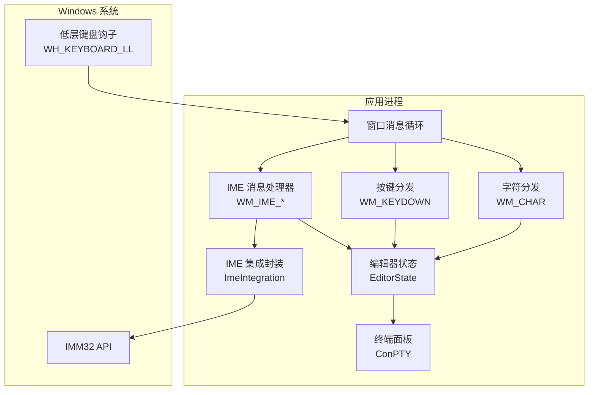
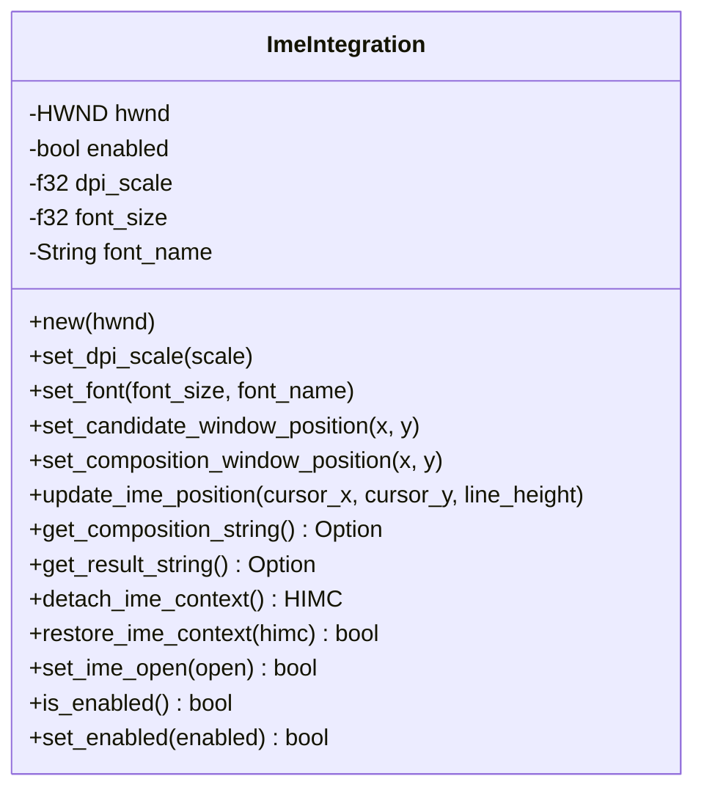
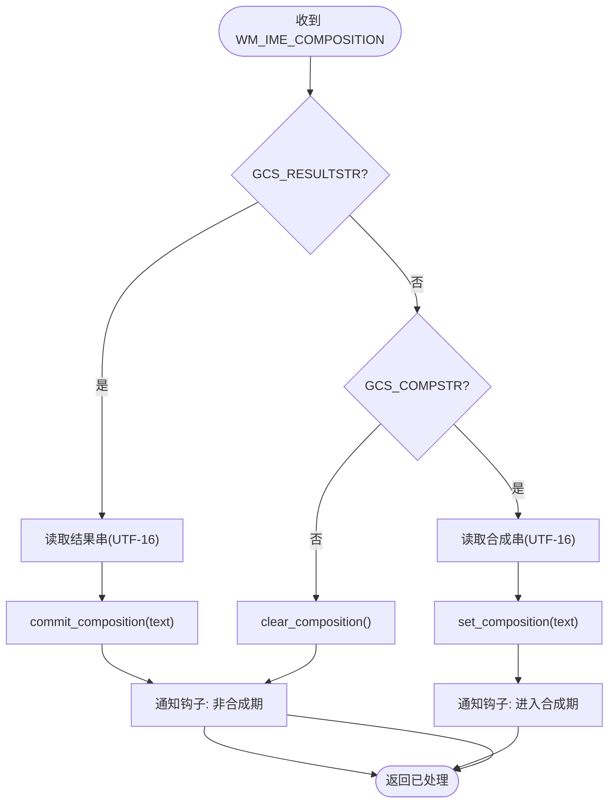
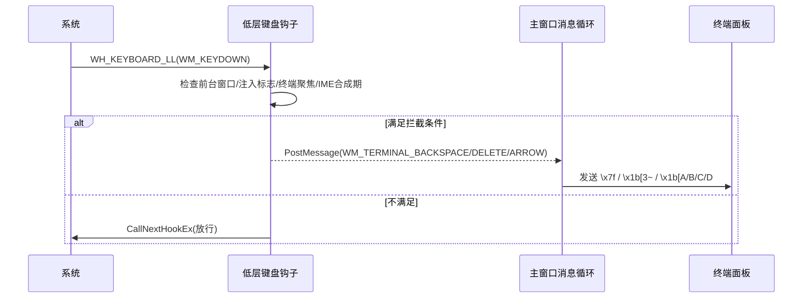
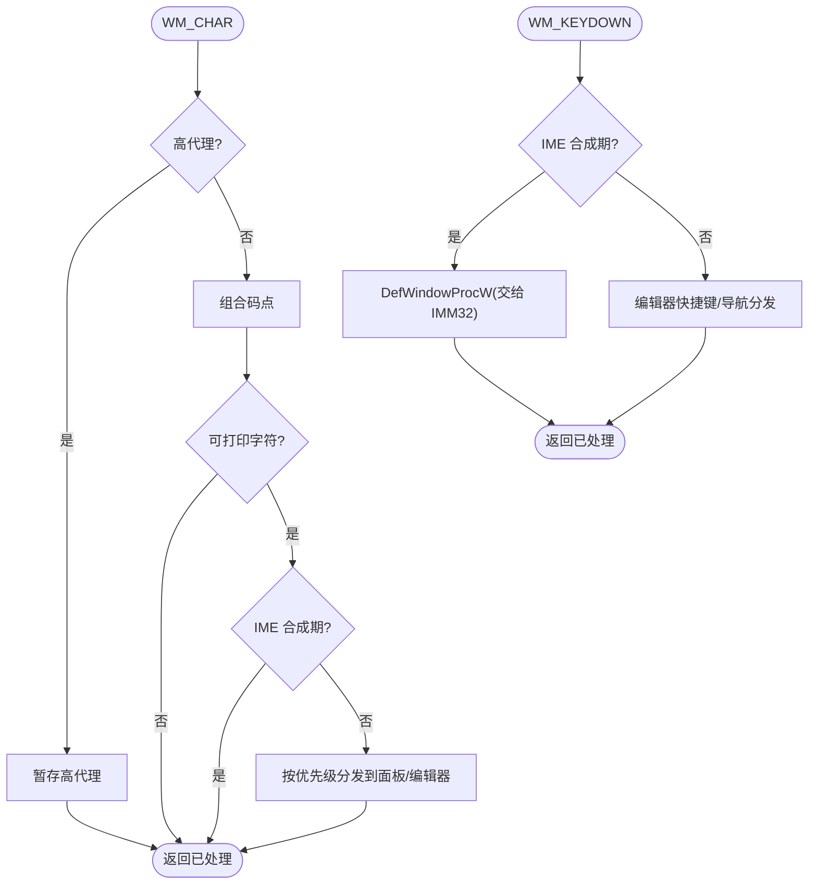
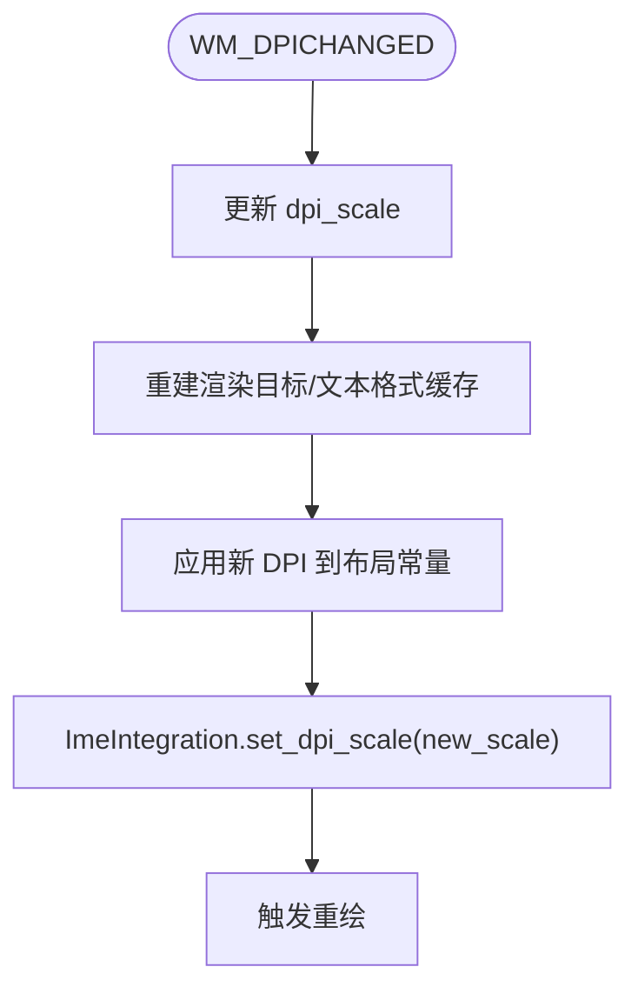
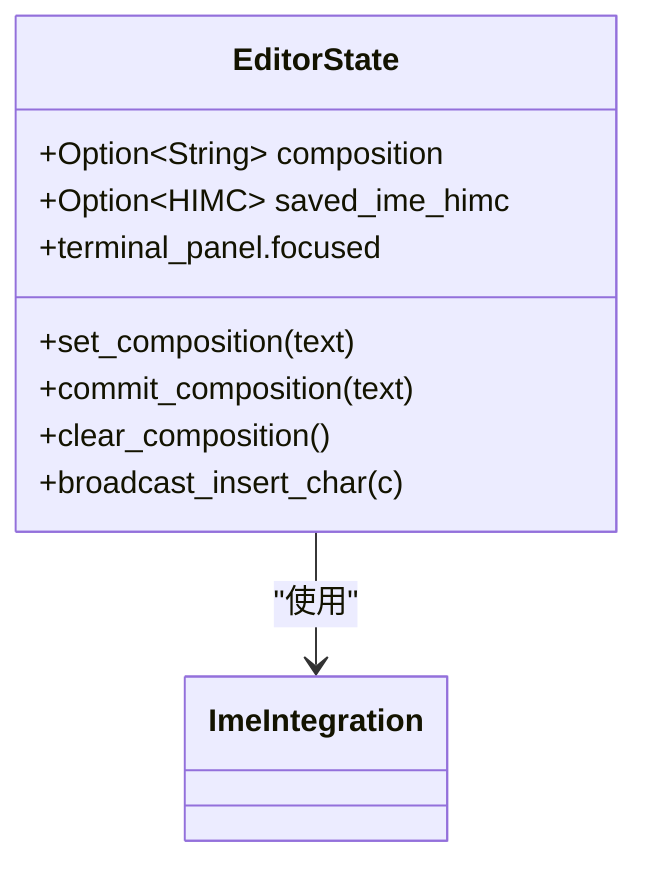
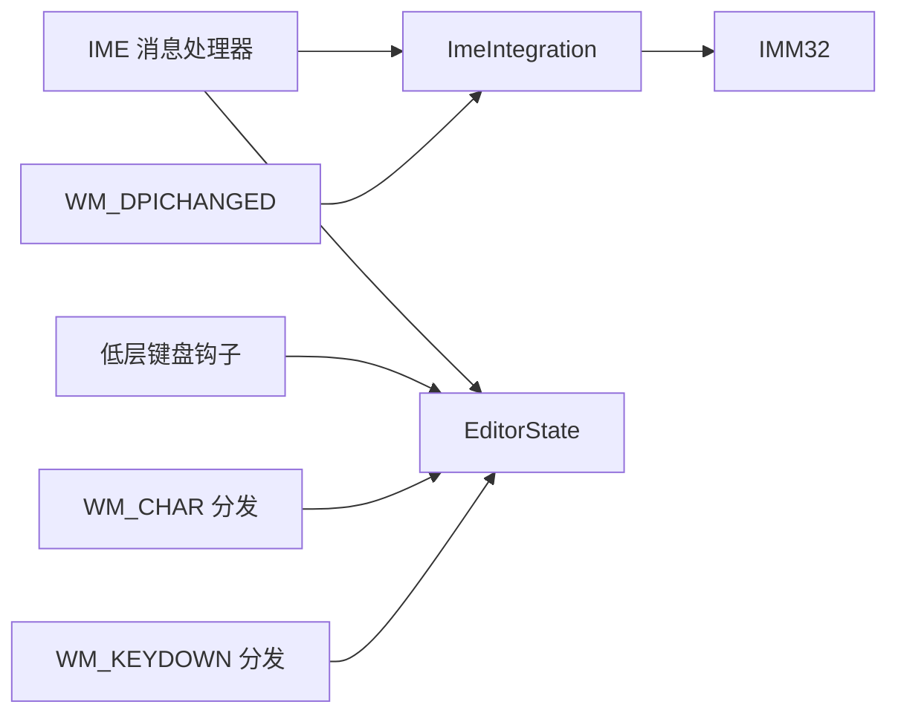

# 输入法集成

<cite>
**本文引用的文件**   
- [ime.rs](file://crates/aether-win32/src/ime.rs)
- [ime_handler.rs](file://crates/aether-win32/src/window/ime_handler.rs)
- [keyboard_hook.rs](file://crates/aether-win32/src/keyboard_hook.rs)
- [char_input.rs](file://crates/aether-win32/src/window/keyboard_handler/char_input.rs)
- [key_down.rs](file://crates/aether-win32/src/window/keyboard_handler/key_down.rs)
- [window_messages.rs](file://crates/aether-win32/src/window/window_messages.rs)
- [editor.rs](file://crates/aether-win32/src/editor.rs)
</cite>

## 目录
1. [简介](#简介)
2. [项目结构](#项目结构)
3. [核心组件](#核心组件)
4. [架构总览](#架构总览)
5. [详细组件分析](#详细组件分析)
6. [依赖关系分析](#依赖关系分析)
7. [性能考量](#性能考量)
8. [故障排查指南](#故障排查指南)
9. [结论](#结论)
10. [附录](#附录)

## 简介
本技术文档聚焦于 Windows IME（输入法）在编辑器中的集成实现，覆盖中文拼音、日文假名、韩文谚文等多语言输入场景。文档深入说明：
- 输入法上下文管理与候选窗口定位
- 合成串（pre-edit）与结果串（提交文本）的处理流程
- 输入法与文本缓冲区交互协议及数据交换格式
- 错误处理、回退机制与兼容性策略
- 动态 DPI 缩放下的候选/合成窗口适配
- 终端面板下 Backspace/Delete/方向键的可靠路由
- 测试方法与常见问题诊断

## 项目结构
IME 相关代码主要分布在以下模块：
- 底层 IMM32 封装与位置同步：ime.rs
- 窗口消息处理（WM_IME_*）：window/ime_handler.rs
- 低层键盘钩子（WH_KEYBOARD_LL）：keyboard_hook.rs
- 字符输入分发（WM_CHAR）：window/keyboard_handler/char_input.rs
- 按键分发（WM_KEYDOWN）：window/keyboard_handler/key_down.rs
- DPI 变化处理（WM_DPICHANGED）：window/window_messages.rs
- 编辑器状态与合成串管理：editor.rs



**图示来源** 
- [ime.rs:1-135](file://crates/aether-win32/src/ime.rs#L1-L135)
- [ime_handler.rs:1-132](file://crates/aether-win32/src/window/ime_handler.rs#L1-L132)
- [keyboard_hook.rs:1-315](file://crates/aether-win32/src/keyboard_hook.rs#L1-L315)
- [char_input.rs:1-413](file://crates/aether-win32/src/window/keyboard_handler/char_input.rs#L1-L413)
- [key_down.rs:1-800](file://crates/aether-win32/src/window/keyboard_handler/key_down.rs#L1-L800)
- [window_messages.rs:1-200](file://crates/aether-win32/src/window/window_messages.rs#L1-L200)
- [editor.rs:4731-4828](file://crates/aether-win32/src/editor.rs#L4731-L4828)

**章节来源**
- [ime.rs:1-135](file://crates/aether-win32/src/ime.rs#L1-L135)
- [ime_handler.rs:1-132](file://crates/aether-win32/src/window/ime_handler.rs#L1-L132)
- [keyboard_hook.rs:1-315](file://crates/aether-win32/src/keyboard_hook.rs#L1-L315)
- [char_input.rs:1-413](file://crates/aether-win32/src/window/keyboard_handler/char_input.rs#L1-L413)
- [key_down.rs:1-800](file://crates/aether-win32/src/window/keyboard_handler/key_down.rs#L1-L800)
- [window_messages.rs:1-200](file://crates/aether-win32/src/window/window_messages.rs#L1-L200)
- [editor.rs:4731-4828](file://crates/aether-win32/src/editor.rs#L4731-L4828)

## 核心组件
- ImeIntegration：封装 IMM32 调用，负责候选窗口与合成窗口的位置设置、DPI 缩放、字体信息、HIMC 关联/断开、IME 开关状态控制。
- IME 消息处理器：处理 WM_IME_STARTCOMPOSITION、WM_IME_COMPOSITION、WM_IME_ENDCOMPOSITION、WM_IME_CHAR，协调合成串与结果串，更新编辑器状态并触发重绘。
- 低层键盘钩子：全局拦截 Backspace/Delete/方向键，当终端聚焦且未处于 IME 合成期时，将按键转译为 ANSI 序列或字节写入 ConPTY，避免被 IME 系统级拦截。
- 字符/按键分发：WM_CHAR 与 WM_KEYDOWN 在 IME 合成期间跳过常规编辑逻辑，确保 IME 优先处理；非合成期按优先级路由到各 UI 面板或编辑器。
- 编辑器状态：维护 composition（预编辑文本）、saved_ime_himc（终端聚焦时的 HIMC 缓存）、terminal_panel 焦点等，提供 set_composition/commit_composition/clear_composition 等方法。

**章节来源**
- [ime.rs:25-243](file://crates/aether-win32/src/ime.rs#L25-L243)
- [ime_handler.rs:9-132](file://crates/aether-win32/src/window/ime_handler.rs#L9-L132)
- [keyboard_hook.rs:56-315](file://crates/aether-win32/src/keyboard_hook.rs#L56-L315)
- [char_input.rs:10-90](file://crates/aether-win32/src/window/keyboard_handler/char_input.rs#L10-L90)
- [key_down.rs:17-117](file://crates/aether-win32/src/window/keyboard_handler/key_down.rs#L17-L117)
- [editor.rs:4731-4828](file://crates/aether-win32/src/editor.rs#L4731-L4828)

## 架构总览
下图展示从用户按键到最终落盘的关键路径，包括 IME 合成期与非合成期的分流、终端面板的特殊处理以及 DPI 变化对候选/合成窗口的影响。

```mermaid
sequenceDiagram
participant User as 用户
participant Win as 窗口过程
participant Hook as 低层键盘钩子
participant IME as IME 消息处理器
participant ES as 编辑器状态
participant Imm as IMM32
term as 终端面板(ConPTY)
User->>Win : 按键/字符输入
alt 终端聚焦 + 非 IME 合成期
Hook->>Hook : 拦截 Backspace/Delete/方向键
Hook-->>Win : PostMessage(自定义消息)
Win->>term : 发送 ANSI 序列或字节
else IME 合成期
Win->>IME : WM_IME_COMPOSITION(GCS_COMPSTR/GCS_RESULTSTR)
IME->>Imm : 读取合成串/结果串
Imm-->>IME : UTF-16 字符串
IME->>ES : set_composition()/commit_composition()
ES-->>Win : 标记脏区域并重绘
else 普通字符
Win->>Win : WM_CHAR 分发
Win->>ES : 插入字符到目标(编辑器/面板)
end
Note over Win,Imm : DPI 变化时更新 ImeIntegration.dpi_scale
```

**图示来源** 
- [ime_handler.rs:21-118](file://crates/aether-win32/src/window/ime_handler.rs#L21-L118)
- [keyboard_hook.rs:151-245](file://crates/aether-win32/src/keyboard_hook.rs#L151-L245)
- [char_input.rs:10-90](file://crates/aether-win32/src/window/keyboard_handler/char_input.rs#L10-L90)
- [window_messages.rs:369-393](file://crates/aether-win32/src/window/window_messages.rs#L369-L393)
- [ime.rs:63-135](file://crates/aether-win32/src/ime.rs#L63-L135)

## 详细组件分析

### 组件 A：ImeIntegration（IMM32 封装）
职责：
- 获取/释放 HIMC 上下文，安全 RAII 守卫
- 设置候选窗口与合成窗口位置（跟随光标）
- 支持 DPI 缩放与字体信息匹配
- 读取合成串与结果串（UTF-16）
- 解除/恢复窗口与 IME 的关联（用于终端旁路）
- 切换 IME 开启/关闭状态（不影响关联）



**图示来源** 
- [ime.rs:25-243](file://crates/aether-win32/src/ime.rs#L25-L243)

**章节来源**
- [ime.rs:25-243](file://crates/aether-win32/src/ime.rs#L25-L243)

### 组件 B：IME 消息处理器（WM_IME_*）
职责：
- 开始合成：初始化位置（实际位置由渲染阶段同步）
- 合成中：根据 GCS_COMPSTR/GCS_RESULTSTR 标志分别处理预编辑与提交文本
- 结束合成：清理本地合成串，必要时关闭 IME（终端聚焦场景）
- 阻止 WM_IME_CHAR 重复插入



**图示来源** 
- [ime_handler.rs:21-118](file://crates/aether-win32/src/window/ime_handler.rs#L21-L118)
- [editor.rs:4731-4828](file://crates/aether-win32/src/editor.rs#L4731-L4828)

**章节来源**
- [ime_handler.rs:9-132](file://crates/aether-win32/src/window/ime_handler.rs#L9-L132)
- [editor.rs:4731-4828](file://crates/aether-win32/src/editor.rs#L4731-L4828)

### 组件 C：低层键盘钩子（WH_KEYBOARD_LL）
职责：
- 全局安装 WH_KEYBOARD_LL，在所有 IME 钩子之前看到按键
- 仅在前台窗口为本窗口、终端聚焦且非 IME 合成期时拦截
- 将 Backspace/Delete/方向键转换为 ANSI 序列或字节，PostMessage 到主窗口处理
- 通过 AtomicBool 与主线程共享 TERMINAL_FOCUSED_FLAG 与 IME_COMPOSING_FLAG



**图示来源** 
- [keyboard_hook.rs:151-245](file://crates/aether-win32/src/keyboard_hook.rs#L151-L245)
- [keyboard_hook.rs:256-297](file://crates/aether-win32/src/keyboard_hook.rs#L256-L297)

**章节来源**
- [keyboard_hook.rs:56-315](file://crates/aether-win32/src/keyboard_hook.rs#L56-L315)

### 组件 D：字符与按键分发（WM_CHAR / WM_KEYDOWN）
职责：
- WM_CHAR：处理 UTF-16 代理对，合成期跳过分发，否则按优先级路由到各面板或编辑器
- WM_KEYDOWN：合成期直接交给默认窗口过程让 IMM32 处理；非合成期执行编辑器快捷键与导航



**图示来源** 
- [char_input.rs:10-90](file://crates/aether-win32/src/window/keyboard_handler/char_input.rs#L10-L90)
- [key_down.rs:17-117](file://crates/aether-win32/src/window/keyboard_handler/key_down.rs#L17-L117)

**章节来源**
- [char_input.rs:10-90](file://crates/aether-win32/src/window/keyboard_handler/char_input.rs#L10-L90)
- [key_down.rs:17-117](file://crates/aether-win32/src/window/keyboard_handler/key_down.rs#L17-L117)

### 组件 E：DPI 变化与布局适配（WM_DPICHANGED）
职责：
- 更新 DPI 缩放因子
- 重建渲染资源与文本格式缓存
- 重新应用布局常量
- 同步 ImeIntegration.dpi_scale，确保候选/合成窗口尺寸正确



**图示来源** 
- [window_messages.rs:369-393](file://crates/aether-win32/src/window/window_messages.rs#L369-L393)
- [ime.rs:51-61](file://crates/aether-win32/src/ime.rs#L51-L61)

**章节来源**
- [window_messages.rs:369-393](file://crates/aether-win32/src/window/window_messages.rs#L369-L393)
- [ime.rs:51-61](file://crates/aether-win32/src/ime.rs#L51-L61)

### 组件 F：编辑器状态与合成串管理
职责：
- 维护 composition（预编辑文本）
- 提供 set_composition/commit_composition/clear_composition
- 终端聚焦时保存 HIMC，离开时恢复以彻底旁路 IME 系统级拦截
- 与 IME 消息处理器协作，保证状态一致性与渲染刷新



**图示来源** 
- [editor.rs:4731-4828](file://crates/aether-win32/src/editor.rs#L4731-L4828)
- [ime.rs:208-243](file://crates/aether-win32/src/ime.rs#L208-L243)

**章节来源**
- [editor.rs:4731-4828](file://crates/aether-win32/src/editor.rs#L4731-L4828)
- [ime.rs:208-243](file://crates/aether-win32/src/ime.rs#L208-L243)

## 依赖关系分析
- ImeIntegration 依赖 IMM32 API（ImmGetContext/ImmSetCandidateWindow/ImmSetCompositionWindow/ImmAssociateContext/ImmSetOpenStatus/ImmReleaseContext）
- IME 消息处理器依赖 ImeIntegration 与 EditorState
- 低层键盘钩子通过 AtomicBool 与主线程共享终端聚焦与 IME 合成期状态
- WM_CHAR/WM_KEYDOWN 在合成期绕过编辑器逻辑，确保 IME 优先
- DPI 变化时，窗口消息处理器同步更新 ImeIntegration 的缩放因子



**图示来源** 
- [ime.rs:1-135](file://crates/aether-win32/src/ime.rs#L1-L135)
- [ime_handler.rs:1-132](file://crates/aether-win32/src/window/ime_handler.rs#L1-L132)
- [keyboard_hook.rs:1-315](file://crates/aether-win32/src/keyboard_hook.rs#L1-L315)
- [char_input.rs:1-413](file://crates/aether-win32/src/window/keyboard_handler/char_input.rs#L1-L413)
- [key_down.rs:1-800](file://crates/aether-win32/src/window/keyboard_handler/key_down.rs#L1-L800)
- [window_messages.rs:1-200](file://crates/aether-win32/src/window/window_messages.rs#L1-L200)

**章节来源**
- [ime.rs:1-135](file://crates/aether-win32/src/ime.rs#L1-L135)
- [ime_handler.rs:1-132](file://crates/aether-win32/src/window/ime_handler.rs#L1-L132)
- [keyboard_hook.rs:1-315](file://crates/aether-win32/src/keyboard_hook.rs#L1-L315)
- [char_input.rs:1-413](file://crates/aether-win32/src/window/keyboard_handler/char_input.rs#L1-L413)
- [key_down.rs:1-800](file://crates/aether-win32/src/window/keyboard_handler/key_down.rs#L1-L800)
- [window_messages.rs:1-200](file://crates/aether-win32/src/window/window_messages.rs#L1-L200)

## 性能考量
- 合成串与结果串读取采用两次调用（先长度后填充），避免过大分配；RAII 守卫确保 HIMC 及时释放
- 仅在必要时机更新候选/合成窗口位置（光标移动、IME 合成期），减少不必要的 IMM32 调用
- DPI 变化时统一重建渲染资源与文本格式缓存，避免多次不一致导致的额外重绘
- 低层键盘钩子仅在前台窗口为本窗口时拦截，降低全局钩子的开销

[本节为通用指导，无需具体文件引用]

## 故障排查指南
- 现象：中文 IME 在“开启未合成”状态下拦截 Backspace，导致终端无法删除汉字
  - 原因：IMM32 在系统级拦截按键，WM_KEYDOWN 未到达窗口过程
  - 解决：安装 WH_KEYBOARD_LL 全局钩子，终端聚焦且非合成期时拦截并转发至 ConPTY
  - 参考实现：[keyboard_hook.rs:151-245](file://crates/aether-win32/src/keyboard_hook.rs#L151-L245)
- 现象：提交汉字后无法立即用 Backspace 删除
  - 原因：IME 仍在合成期，Backspace 被 IME 处理
  - 解决：在 GCS_RESULTSTR 处理后提前重置合成期标志，并在 WM_IME_ENDCOMPOSITION 时关闭 IME（终端聚焦场景）
  - 参考实现：[ime_handler.rs:34-118](file://crates/aether-win32/src/window/ime_handler.rs#L34-L118)
- 现象：高 DPI 显示器上候选窗口过小或错位
  - 原因：未随 DPI 变化更新 ImeIntegration.dpi_scale
  - 解决：在 WM_DPICHANGED 中更新 dpi_scale 并重建渲染资源
  - 参考实现：[window_messages.rs:369-393](file://crates/aether-win32/src/window/window_messages.rs#L369-L393), [ime.rs:51-61](file://crates/aether-win32/src/ime.rs#L51-L61)
- 现象：IME 合成串显示异常或重复插入字符
  - 原因：WM_IME_CHAR 未被阻止，导致与 GCS_RESULTSTR 重复
  - 解决：在 WM_IME_CHAR 处理器中返回已处理，避免 TranslateMessage 产生 WM_CHAR
  - 参考实现：[ime_handler.rs:120-132](file://crates/aether-win32/src/window/ime_handler.rs#L120-L132)

**章节来源**
- [keyboard_hook.rs:151-245](file://crates/aether-win32/src/keyboard_hook.rs#L151-L245)
- [ime_handler.rs:34-132](file://crates/aether-win32/src/window/ime_handler.rs#L34-L132)
- [window_messages.rs:369-393](file://crates/aether-win32/src/window/window_messages.rs#L369-L393)
- [ime.rs:51-61](file://crates/aether-win32/src/ime.rs#L51-L61)

## 结论
本项目通过分层设计实现了稳健的 Windows IME 集成：
- 使用 IMM32 封装精确控制候选/合成窗口位置与 DPI 适配
- 通过 WM_IME_* 消息处理合成期与提交期，确保多语言输入体验一致
- 借助 WH_KEYBOARD_LL 解决终端面板下 Backspace/Delete/方向键的系统级拦截问题
- 在 WM_CHAR/WM_KEYDOWN 中正确处理合成期分流，避免重复插入与误响应
- 结合 DPI 变化处理与渲染资源重建，保障高 DPI 环境下的可读性与一致性

[本节为总结性内容，无需具体文件引用]

## 附录

### 输入法与文本缓冲区的交互协议
- 合成期（pre-edit）：
  - 事件：WM_IME_COMPOSITION 带 GCS_COMPSTR
  - 动作：读取 UTF-16 合成串，调用 set_composition(text)，仅更新显示，不修改缓冲区
- 提交期（commit）：
  - 事件：WM_IME_COMPOSITION 带 GCS_RESULTSTR
  - 动作：读取 UTF-16 结果串，调用 commit_composition(text)，将文本插入目标（编辑器/终端）
- 结束期（end）：
  - 事件：WM_IME_ENDCOMPOSITION
  - 动作：clear_composition()，必要时关闭 IME（终端聚焦场景）

**章节来源**
- [ime_handler.rs:21-118](file://crates/aether-win32/src/window/ime_handler.rs#L21-L118)
- [editor.rs:4731-4828](file://crates/aether-win32/src/editor.rs#L4731-L4828)

### 测试方法建议
- 单元测试（逻辑）：
  - 验证 set_composition/commit_composition/clear_composition 的状态转换与边界条件
  - 验证 DPI 缩放因子的最小值保护与字体大小下限
- 集成测试（UI）：
  - 模拟 WM_IME_COMPOSITION 消息，检查合成串显示与提交行为
  - 在高 DPI 环境下拖动窗口，验证候选/合成窗口尺寸与位置
  - 在终端聚焦场景下，验证 Backspace/Delete/方向键是否成功路由到 ConPTY
- 回归测试（兼容性）：
  - 中文/日文/韩文输入法切换，验证合成期与提交期行为一致
  - Alt+Tab 切换焦点后，验证键盘输入路由到当前活动窗口

[本节为通用指导，无需具体文件引用]