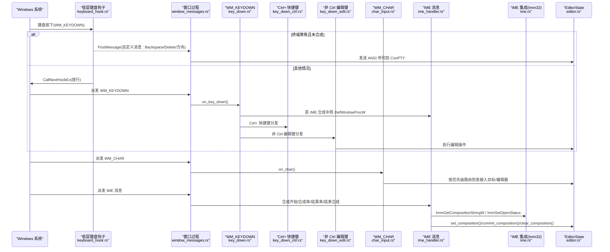
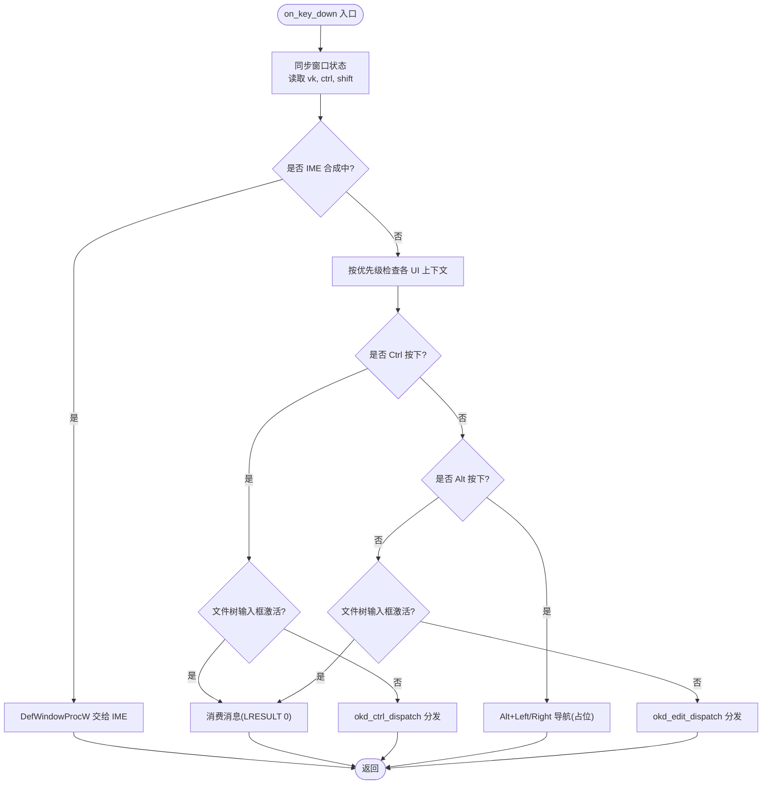
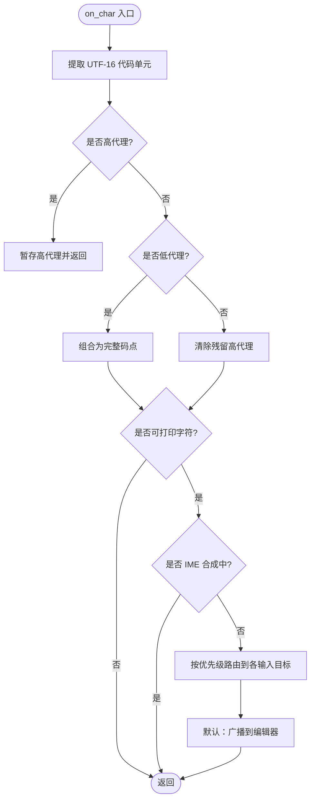
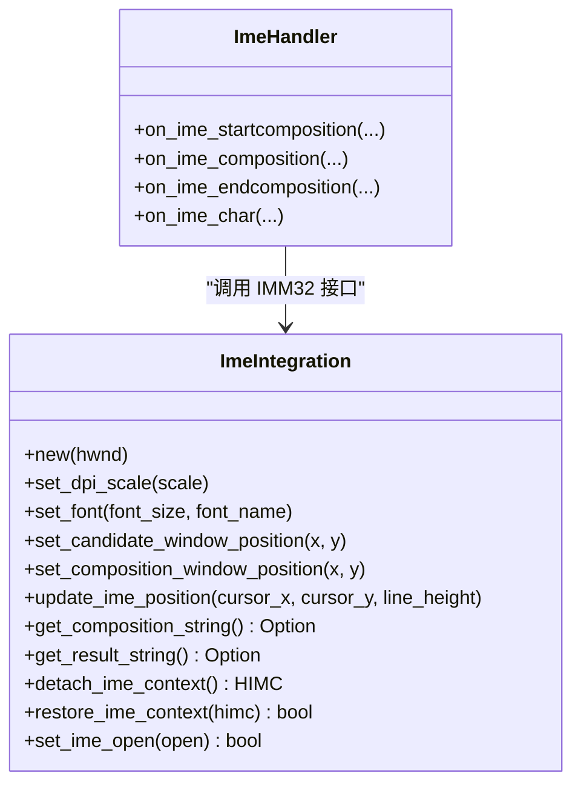
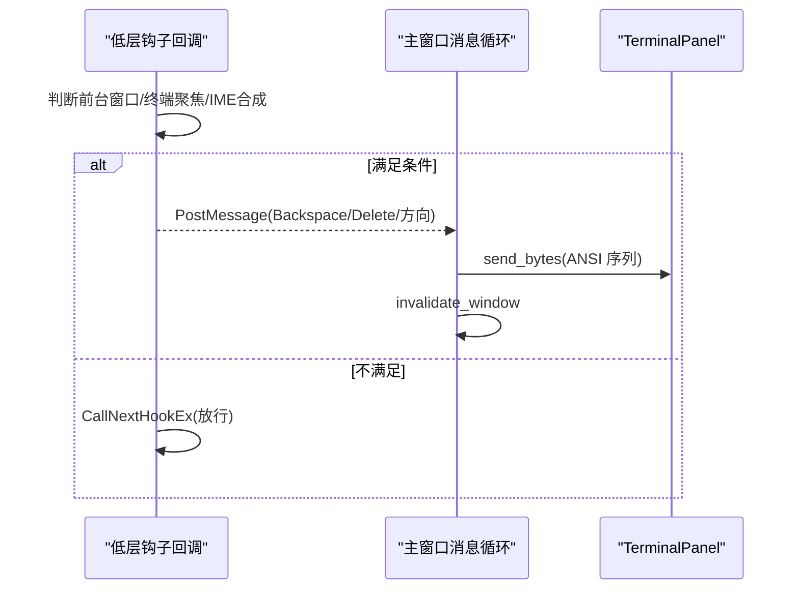
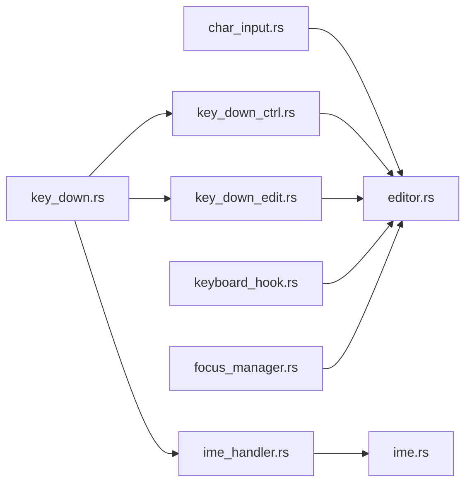

# 键盘事件处理

<cite>
**本文引用的文件**   
- [crates/aether-win32/src/window/keyboard_handler.rs](file://crates/aether-win32/src/window/keyboard_handler.rs)
- [crates/aether-win32/src/window/keyboard_handler/key_down.rs](file://crates/aether-win32/src/window/keyboard_handler/key_down.rs)
- [crates/aether-win32/src/window/keyboard_handler/key_down_ctrl.rs](file://crates/aether-win32/src/window/keyboard_handler/key_down_ctrl.rs)
- [crates/aether-win32/src/window/keyboard_handler/key_down_edit.rs](file://crates/aether-win32/src/window/keyboard_handler/key_down_edit.rs)
- [crates/aether-win32/src/window/keyboard_handler/char_input.rs](file://crates/aether-win32/src/window/keyboard_handler/char_input.rs)
- [crates/aether-win32/src/window/ime_handler.rs](file://crates/aether-win32/src/window/ime_handler.rs)
- [crates/aether-win32/src/ime.rs](file://crates/aether-win32/src/ime.rs)
- [crates/aether-win32/src/keyboard_hook.rs](file://crates/aether-win32/src/keyboard_hook.rs)
- [crates/aether-win32/src/focus_manager.rs](file://crates/aether-win32/src/focus_manager.rs)
- [crates/aether-win32/src/window/window_messages.rs](file://crates/aether-win32/src/window/window_messages.rs)
- [crates/aether-win32/src/editor.rs](file://crates/aether-win32/src/editor.rs)
</cite>

## 目录
1. [简介](#简介)
2. [项目结构](#项目结构)
3. [核心组件](#核心组件)
4. [架构总览](#架构总览)
5. [详细组件分析](#详细组件分析)
6. [依赖关系分析](#依赖关系分析)
7. [性能考量](#性能考量)
8. [故障排查指南](#故障排查指南)
9. [结论](#结论)
10. [附录](#附录)

## 简介
本技术文档聚焦于 Windows 平台下的键盘事件处理系统，覆盖以下关键主题：
- WM_KEYDOWN、WM_CHAR 的处理流程与虚拟键码到字符的转换机制
- 组合键（Ctrl、Alt、Shift）检测与快捷键分发
- 输入法（IME）支持：中文、日文等多语言输入场景
- 快捷键绑定系统与命令分发机制
- 键盘焦点管理、事件冒泡与阻止传播
- 终端面板下 Backspace/Delete/方向键在 IME 环境中的正确路由
- 性能优化策略与常见问题解决方案

## 项目结构
键盘事件处理位于 aether-win32 模块中，采用“窗口消息 -> 键盘处理器 -> 业务状态”的分层组织方式：
- 窗口消息入口：window_messages.rs 负责统一调度各类 WM_* 消息
- 键盘处理模块：keyboard_handler.rs 将 WM_KEYDOWN/WM_CHAR 拆分到子模块
- 编辑器与状态：editor.rs 维护全局 EditorState，承载所有 UI 状态与操作
- IME 集成：ime.rs 提供 IMM32 调用封装；ime_handler.rs 处理 IME 相关消息
- 低层钩子：keyboard_hook.rs 通过 WH_KEYBOARD_LL 拦截系统级按键，解决 IME 对编辑键的拦截问题
- 焦点管理：focus_manager.rs 统一管理当前焦点目标

```mermaid
graph TB
subgraph "窗口消息"
WM["窗口过程<br/>window_messages.rs"]
end
subgraph "键盘处理"
KD["WM_KEYDOWN<br/>key_down.rs"]
KC["Ctrl+ 快捷键<br/>key_down_ctrl.rs"]
KE["非 Ctrl 编辑键<br/>key_down_edit.rs"]
CH["WM_CHAR<br/>char_input.rs"]
end
subgraph "IME"
IMH["IME 消息处理<br/>ime_handler.rs"]
IME["IME 集成(Imm32)<br/>ime.rs"]
end
subgraph "系统钩子"
KH["WH_KEYBOARD_LL<br/>keyboard_hook.rs"]
end
subgraph "应用状态"
ES["EditorState<br/>editor.rs"]
FM["FocusManager<br/>focus_manager.rs"]
end
WM --> KD
WM --> CH
WM --> IMH
KD --> KC
KD --> KE
KD --> IMH
CH --> ES
KC --> ES
KE --> ES
IMH --> IME
KH --> WM
ES --> FM
```

图表来源
- [crates/aether-win32/src/window/window_messages.rs:1-120](file://crates/aether-win32/src/window/window_messages.rs#L1-L120)
- [crates/aether-win32/src/window/keyboard_handler.rs:1-13](file://crates/aether-win32/src/window/keyboard_handler.rs#L1-L13)
- [crates/aether-win32/src/window/keyboard_handler/key_down.rs:1-120](file://crates/aether-win32/src/window/keyboard_handler/key_down.rs#L1-L120)
- [crates/aether-win32/src/window/keyboard_handler/key_down_ctrl.rs:1-60](file://crates/aether-win32/src/window/keyboard_handler/key_down_ctrl.rs#L1-L60)
- [crates/aether-win32/src/window/keyboard_handler/key_down_edit.rs:1-60](file://crates/aether-win32/src/window/keyboard_handler/key_down_edit.rs#L1-L60)
- [crates/aether-win32/src/window/keyboard_handler/char_input.rs:1-90](file://crates/aether-win32/src/window/keyboard_handler/char_input.rs#L1-L90)
- [crates/aether-win32/src/window/ime_handler.rs:1-132](file://crates/aether-win32/src/window/ime_handler.rs#L1-L132)
- [crates/aether-win32/src/ime.rs:1-120](file://crates/aether-win32/src/ime.rs#L1-L120)
- [crates/aether-win32/src/keyboard_hook.rs:1-120](file://crates/aether-win32/src/keyboard_hook.rs#L1-L120)
- [crates/aether-win32/src/focus_manager.rs:1-120](file://crates/aether-win32/src/focus_manager.rs#L1-L120)
- [crates/aether-win32/src/editor.rs:1-200](file://crates/aether-win32/src/editor.rs#L1-L200)

章节来源
- [crates/aether-win32/src/window/keyboard_handler.rs:1-13](file://crates/aether-win32/src/window/keyboard_handler.rs#L1-L13)
- [crates/aether-win32/src/window/window_messages.rs:1-120](file://crates/aether-win32/src/window/window_messages.rs#L1-L120)

## 核心组件
- WM_KEYDOWN 分发器：解析 VK、修饰键状态，按优先级分派到各子系统（搜索面板、欢迎页、补全、设置、SSH/克隆对话框、命令面板等），再进入 Ctrl 或编辑键分支。
- Ctrl+ 快捷键总线：集中处理 Ctrl 组合键，包括文件操作、视图切换、缩放、剪贴板、查找/撤销重做、标签页导航、词级移动、列光标等。
- 非 Ctrl 编辑键：处理回车、退格、删除、方向键、Home/End/PageUp/Down、Tab 等，并在终端聚焦时优先转发至 ConPTY。
- WM_CHAR 字符分发：处理 UTF-16 代理对，过滤可打印字符，按优先级路由到各输入目标（文件树、设置、搜索、SSH/克隆、命令面板、查找替换、终端、AI 面板），最终广播到编辑器。
- IME 集成：处理合成开始、合成串更新、结果串提交、结束合成；屏蔽 WM_IME_CHAR 避免重复插入；根据 DPI 调整候选/合成窗口位置。
- 低层键盘钩子：在系统级拦截 Backspace/Delete/方向键，当终端聚焦且不在 IME 合成期时，向主窗口投递自定义消息并发送 ANSI 序列到 ConPTY。
- 焦点管理：维护当前焦点目标（编辑器、终端、AI 面板、查找替换、命令面板、设置、对话框），支持 push/pop 历史栈和窗口级焦点同步。

章节来源
- [crates/aether-win32/src/window/keyboard_handler/key_down.rs:1-120](file://crates/aether-win32/src/window/keyboard_handler/key_down.rs#L1-L120)
- [crates/aether-win32/src/window/keyboard_handler/key_down_ctrl.rs:1-120](file://crates/aether-win32/src/window/keyboard_handler/key_down_ctrl.rs#L1-L120)
- [crates/aether-win32/src/window/keyboard_handler/key_down_edit.rs:1-120](file://crates/aether-win32/src/window/keyboard_handler/key_down_edit.rs#L1-L120)
- [crates/aether-win32/src/window/keyboard_handler/char_input.rs:1-120](file://crates/aether-win32/src/window/keyboard_handler/char_input.rs#L1-L120)
- [crates/aether-win32/src/window/ime_handler.rs:1-132](file://crates/aether-win32/src/window/ime_handler.rs#L1-L132)
- [crates/aether-win32/src/ime.rs:1-120](file://crates/aether-win32/src/ime.rs#L1-L120)
- [crates/aether-win32/src/keyboard_hook.rs:1-120](file://crates/aether-win32/src/keyboard_hook.rs#L1-L120)
- [crates/aether-win32/src/focus_manager.rs:1-120](file://crates/aether-win32/src/focus_manager.rs#L1-L120)

## 架构总览
下图展示了从系统键盘消息到应用内部处理的完整链路，包括 IME 与低层钩子的协作。



图表来源
- [crates/aether-win32/src/keyboard_hook.rs:150-245](file://crates/aether-win32/src/keyboard_hook.rs#L150-L245)
- [crates/aether-win32/src/window/window_messages.rs:1-120](file://crates/aether-win32/src/window/window_messages.rs#L1-L120)
- [crates/aether-win32/src/window/keyboard_handler/key_down.rs:18-117](file://crates/aether-win32/src/window/keyboard_handler/key_down.rs#L18-L117)
- [crates/aether-win32/src/window/keyboard_handler/key_down_ctrl.rs:14-28](file://crates/aether-win32/src/window/keyboard_handler/key_down_ctrl.rs#L14-L28)
- [crates/aether-win32/src/window/keyboard_handler/key_down_edit.rs:14-55](file://crates/aether-win32/src/window/keyboard_handler/key_down_edit.rs#L14-L55)
- [crates/aether-win32/src/window/keyboard_handler/char_input.rs:11-90](file://crates/aether-win32/src/window/keyboard_handler/char_input.rs#L11-L90)
- [crates/aether-win32/src/window/ime_handler.rs:10-132](file://crates/aether-win32/src/window/ime_handler.rs#L10-L132)
- [crates/aether-win32/src/ime.rs:136-243](file://crates/aether-win32/src/ime.rs#L136-L243)

## 详细组件分析

### WM_KEYDOWN 处理流程与组合键逻辑
- 入口函数 on_key_down 首先同步线程局部窗口状态，读取 VK 与修饰键状态（Ctrl、Shift）。
- 若处于 IME 合成期，直接交由默认窗口过程，让 IMM32 处理按键以更新或取消合成串。
- 按优先级检查各 UI 上下文（文件树输入、资源管理器右键菜单、标签右键菜单、活动栏右键菜单、自定义模式、搜索面板、欢迎页、补全弹窗、设置字段、SSH/克隆对话框、命令面板），命中则消费消息。
- 若 Ctrl 按下：
  - 若文件树输入框激活，吞掉所有 Ctrl 快捷键防止误响应。
  - 否则进入 Ctrl+ 快捷键总线 okd_ctrl_dispatch，按功能分组处理。
- 若 Alt 按下：处理返回/前进导航（占位实现）。
- 若文件树输入框激活：吞掉非 Ctrl 编辑器按键，字符输入由 WM_CHAR 处理。
- 否则进入非 Ctrl 编辑键分发 okd_edit_dispatch。



图表来源
- [crates/aether-win32/src/window/keyboard_handler/key_down.rs:18-117](file://crates/aether-win32/src/window/keyboard_handler/key_down.rs#L18-L117)

章节来源
- [crates/aether-win32/src/window/keyboard_handler/key_down.rs:18-117](file://crates/aether-win32/src/window/keyboard_handler/key_down.rs#L18-L117)

### Ctrl+ 快捷键绑定与命令分发
- 快捷键总线 okd_ctrl_dispatch 将 Ctrl+ 组合键按功能分组：
  - 文件操作：打开文件/文件夹、保存/另存为、新建项目
  - 视图切换：侧边栏、命令面板、底部终端面板、资源管理器视图、源代码管理视图
  - 字体缩放：放大/缩小/重置
  - 剪贴板：复制/剪切/粘贴/全选（终端聚焦时 Ctrl+C 中断进程）
  - 查找/替换/撤销/重做：Ctrl+F/H/Z/Y
  - 标签页：切换/关闭/恢复最后关闭的标签
  - 数字跳转：Ctrl+1-9 跳转到指定标签
  - 词级移动：Ctrl+Left/Right（含 Shift 选择）
  - 文件首末/添加光标/行注释：Ctrl+Home/End/D/OEM_2
  - 内联补全/列光标：Ctrl+Shift+I、Ctrl+Alt+Up/Down
- 每个分组函数内部访问 EDITOR_STATE 执行具体操作，并通过 invalidate_window 触发重绘。

章节来源
- [crates/aether-win32/src/window/keyboard_handler/key_down_ctrl.rs:14-709](file://crates/aether-win32/src/window/keyboard_handler/key_down_ctrl.rs#L14-L709)

### 非 Ctrl 编辑键与终端转发
- okd_edit_dispatch 在非 Ctrl 情况下处理：
  - 若标签页为空，吞掉所有编辑键（防止空白页可编辑）
  - 若终端聚焦且不在 IME 合成期，优先将编辑键转换为 ANSI 序列发送到 ConPTY
  - 否则按类型分发：回车、退格、删除/F3/Esc、左右/上下移动、Home/End/PageUp/Down、Tab
- 终端转发 okd_edit_terminal 将常见编辑键映射到 TerminalPanel 的 send_* 方法，并刷新界面。

章节来源
- [crates/aether-win32/src/window/keyboard_handler/key_down_edit.rs:14-151](file://crates/aether-win32/src/window/keyboard_handler/key_down_edit.rs#L14-L151)

### WM_CHAR 字符输入与 UTF-16 代理对处理
- on_char 入口先同步窗口状态，提取 wparam 为 UTF-16 代码单元。
- 处理 BMP 外字符：
  - 高代理（0xD800-0xDBFF）暂存，等待配对的低代理
  - 低代理（0xDC00-0xDFFF）组合为完整 Unicode 码点
  - 非代理字符时清除残留高代理，避免污染后续输入
- 仅处理可打印字符（ch >= 32 且 ch != 127），若 IME 合成中则跳过以避免重复插入。
- 按优先级分发到各输入目标：文件树输入、设置字段、搜索面板、SSH/克隆对话框、新建项目、SSH 管理、命令面板、查找替换、终端、AI 面板，最后广播到编辑器。



图表来源
- [crates/aether-win32/src/window/keyboard_handler/char_input.rs:11-90](file://crates/aether-win32/src/window/keyboard_handler/char_input.rs#L11-L90)

章节来源
- [crates/aether-win32/src/window/keyboard_handler/char_input.rs:11-90](file://crates/aether-win32/src/window/keyboard_handler/char_input.rs#L11-L90)

### 输入法（IME）支持与多语言输入
- IME 消息处理 ime_handler.rs：
  - WM_IME_STARTCOMPOSITION：初始化合成位置（实际位置由渲染阶段同步）
  - WM_IME_COMPOSITION：
    - GCS_RESULTSTR：获取已提交文本，清空合成串并插入提交字符，提前重置合成标志以便 Backspace 立即可达终端
    - GCS_COMPSTR：更新预编辑文本显示，通知低层钩子进入合成期
    - 无标志：清理合成状态
  - WM_IME_ENDCOMPOSITION：清理合成串显示，终端聚焦时关闭 IME 让用户能立即删除
  - WM_IME_CHAR：阻止 TranslateMessage 产生 WM_CHAR，避免重复插入
- IME 集成 ime.rs：
  - 使用 IMM32 API 查询合成串/结果串
  - 根据 DPI 缩放因子调整候选窗口与合成窗口尺寸
  - 提供 detach/restore IME 上下文与开关 IME 状态的方法，用于终端聚焦时的旁路策略



图表来源
- [crates/aether-win32/src/ime.rs:29-243](file://crates/aether-win32/src/ime.rs#L29-L243)
- [crates/aether-win32/src/window/ime_handler.rs:10-132](file://crates/aether-win32/src/window/ime_handler.rs#L10-L132)

章节来源
- [crates/aether-win32/src/window/ime_handler.rs:10-132](file://crates/aether-win32/src/window/ime_handler.rs#L10-L132)
- [crates/aether-win32/src/ime.rs:29-243](file://crates/aether-win32/src/ime.rs#L29-L243)

### 低层键盘钩子与终端编辑键路由
- keyboard_hook.rs 安装 WH_KEYBOARD_LL 全局钩子，在所有 IME 钩子链之前看到按键。
- 仅在前台窗口为本窗口、终端聚焦且不在 IME 合成期时拦截 Backspace/Delete/方向键。
- 拦截后抑制原事件，PostMessage 到主窗口自定义消息，主窗口将对应字节序列发送到 ConPTY。
- 主线程通过 set_terminal_focused/set_ime_composing 更新共享状态供钩子线程读取。



图表来源
- [crates/aether-win32/src/keyboard_hook.rs:150-245](file://crates/aether-win32/src/keyboard_hook.rs#L150-L245)

章节来源
- [crates/aether-win32/src/keyboard_hook.rs:150-245](file://crates/aether-win32/src/keyboard_hook.rs#L150-L245)

### 焦点管理与事件冒泡/阻止传播
- focus_manager.rs 维护当前焦点目标与历史栈，支持 push/pop 回退。
- window_messages.rs 处理 WM_SETFOCUS/WM_KILLFOCUS，同步窗口级焦点状态。
- 键盘处理中通过返回 LRESULT(0) 消费消息来阻止传播，或通过 DefWindowProcW 交由系统/IME 处理。
- 终端聚焦时，非 Ctrl 编辑键优先转发到 ConPTY；IME 合成期间，WM_KEYDOWN 直接交给默认窗口过程，确保 IME 能正确处理退格/字母/方向键。

章节来源
- [crates/aether-win32/src/focus_manager.rs:40-120](file://crates/aether-win32/src/focus_manager.rs#L40-L120)
- [crates/aether-win32/src/window/window_messages.rs:516-564](file://crates/aether-win32/src/window/window_messages.rs#L516-L564)
- [crates/aether-win32/src/window/keyboard_handler/key_down.rs:25-36](file://crates/aether-win32/src/window/keyboard_handler/key_down.rs#L25-L36)

## 依赖关系分析
- 键盘处理模块依赖全局 EDITOR_STATE 进行状态读写与重绘触发。
- Ctrl+ 快捷键与非 Ctrl 编辑键均通过 EDITOR_STATE 访问具体功能（如终端面板、命令面板、查找替换、标签页管理等）。
- IME 处理依赖 IMM32 API 与渲染阶段的坐标同步。
- 低层钩子通过原子变量与主线程通信，避免跨线程直接访问 EditorState。



图表来源
- [crates/aether-win32/src/window/keyboard_handler/key_down.rs:1-120](file://crates/aether-win32/src/window/keyboard_handler/key_down.rs#L1-L120)
- [crates/aether-win32/src/window/keyboard_handler/key_down_ctrl.rs:1-120](file://crates/aether-win32/src/window/keyboard_handler/key_down_ctrl.rs#L1-L120)
- [crates/aether-win32/src/window/keyboard_handler/key_down_edit.rs:1-120](file://crates/aether-win32/src/window/keyboard_handler/key_down_edit.rs#L1-L120)
- [crates/aether-win32/src/window/keyboard_handler/char_input.rs:1-120](file://crates/aether-win32/src/window/keyboard_handler/char_input.rs#L1-L120)
- [crates/aether-win32/src/window/ime_handler.rs:1-132](file://crates/aether-win32/src/window/ime_handler.rs#L1-L132)
- [crates/aether-win32/src/ime.rs:1-120](file://crates/aether-win32/src/ime.rs#L1-L120)
- [crates/aether-win32/src/keyboard_hook.rs:1-120](file://crates/aether-win32/src/keyboard_hook.rs#L1-L120)
- [crates/aether-win32/src/focus_manager.rs:1-120](file://crates/aether-win32/src/focus_manager.rs#L1-L120)
- [crates/aether-win32/src/editor.rs:1-200](file://crates/aether-win32/src/editor.rs#L1-L200)

章节来源
- [crates/aether-win32/src/window/keyboard_handler/key_down.rs:1-120](file://crates/aether-win32/src/window/keyboard_handler/key_down.rs#L1-L120)
- [crates/aether-win32/src/window/keyboard_handler/key_down_ctrl.rs:1-120](file://crates/aether-win32/src/window/keyboard_handler/key_down_ctrl.rs#L1-L120)
- [crates/aether-win32/src/window/keyboard_handler/key_down_edit.rs:1-120](file://crates/aether-win32/src/window/keyboard_handler/key_down_edit.rs#L1-L120)
- [crates/aether-win32/src/window/keyboard_handler/char_input.rs:1-120](file://crates/aether-win32/src/window/keyboard_handler/char_input.rs#L1-L120)
- [crates/aether-win32/src/window/ime_handler.rs:1-132](file://crates/aether-win32/src/window/ime_handler.rs#L1-L132)
- [crates/aether-win32/src/ime.rs:1-120](file://crates/aether-win32/src/ime.rs#L1-L120)
- [crates/aether-win32/src/keyboard_hook.rs:1-120](file://crates/aether-win32/src/keyboard_hook.rs#L1-L120)
- [crates/aether-win32/src/focus_manager.rs:1-120](file://crates/aether-win32/src/focus_manager.rs#L1-L120)
- [crates/aether-win32/src/editor.rs:1-200](file://crates/aether-win32/src/editor.rs#L1-L200)

## 性能考量
- 键盘消息处理路径尽量短小，避免阻塞 UI 线程；异步任务（如 SSH/Git/LSP）通过 PostMessage 回传结果。
- 定时器驱动的重绘（如终端刷新、悬停提示、自动保存）按需启停，减少空转。
- IME 合成期间避免重复插入字符，降低不必要的渲染开销。
- 低层钩子仅在必要时拦截按键，其余情况快速放行，减少系统级开销。

[本节为通用指导，无需特定文件引用]

## 故障排查指南
- 中文输入无法删除：确认 IME 合成标志是否正确设置与清除；检查低层钩子是否在终端聚焦且非合成期拦截 Backspace。
- 字符重复插入：确认 WM_IME_CHAR 被阻止，且 IME 结果串已通过 GCS_RESULTSTR 处理。
- 终端方向键无效：检查 TERMINAL_FOCUSED_FLAG 与 IME_COMPOSING_FLAG 的状态；确认钩子已安装且前台窗口匹配。
- 快捷键冲突：审查 Ctrl+ 快捷键分组函数，确保特定场景（如文件树输入框激活）吞掉快捷键。
- 焦点丢失导致输入错误：确认 WM_SETFOCUS/WM_KILLFOCUS 同步了 FocusManager 状态。

章节来源
- [crates/aether-win32/src/keyboard_hook.rs:150-245](file://crates/aether-win32/src/keyboard_hook.rs#L150-L245)
- [crates/aether-win32/src/window/ime_handler.rs:10-132](file://crates/aether-win32/src/window/ime_handler.rs#L10-L132)
- [crates/aether-win32/src/window/keyboard_handler/key_down.rs:25-36](file://crates/aether-win32/src/window/keyboard_handler/key_down.rs#L25-L36)
- [crates/aether-win32/src/window/window_messages.rs:516-564](file://crates/aether-win32/src/window/window_messages.rs#L516-L564)

## 结论
本键盘事件处理系统通过分层设计与精细的消息路由，实现了：
- 可靠的 WM_KEYDOWN/WM_CHAR 处理与 UTF-16 代理对支持
- 完善的组合键与快捷键分发机制
- 全面的 IME 集成与多语言输入支持
- 终端面板在 IME 环境下的正确编辑键路由
- 统一的焦点管理与事件冒泡控制
- 面向性能的轻量处理路径与异步任务协调

该架构具备良好的扩展性与可维护性，便于后续增加新的快捷键、UI 面板与输入法特性。

[本节为总结，无需特定文件引用]

## 附录
- 常用快捷键参考（部分）：
  - Ctrl+O/K/S/N：打开文件/文件夹、保存/另存为、新建项目
  - Ctrl+B/P/`：切换侧边栏/命令面板/终端面板
  - Ctrl+=/-/0：字体缩放/重置
  - Ctrl+C/X/V/A：复制/剪切/粘贴/全选（终端聚焦时 Ctrl+C 中断）
  - Ctrl+F/H/Z/Y：查找/替换/撤销/重做
  - Ctrl+Tab/W/F4/T：标签页切换/关闭/恢复
  - Ctrl+1-9：跳转到指定标签
  - Ctrl+Left/Right：词级移动（Shift 选择）
  - Ctrl+Home/End/D/OEM_2：文件首末/添加光标/行注释
  - Ctrl+Shift+I：手动触发内联补全
  - Ctrl+Alt+Up/Down：列光标

章节来源
- [crates/aether-win32/src/window/keyboard_handler/key_down_ctrl.rs:124-709](file://crates/aether-win32/src/window/keyboard_handler/key_down_ctrl.rs#L124-L709)