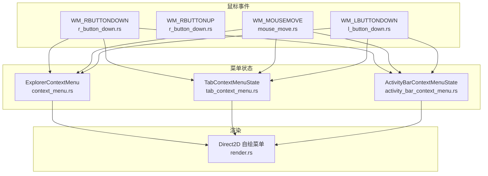
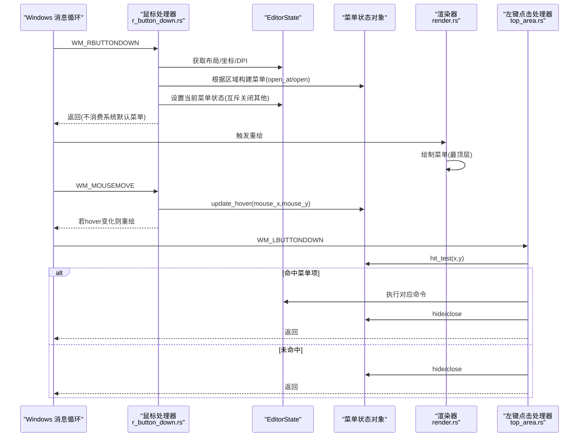
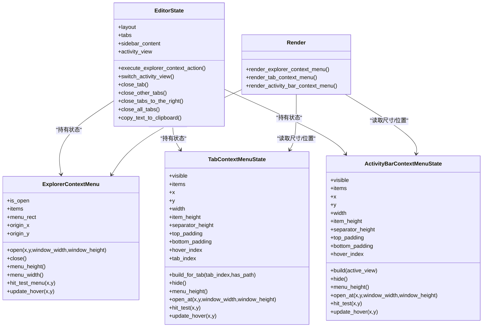

# 右键操作处理

<cite>
**本文引用的文件列表**
- [r_button_down.rs](file://crates/aether-win32/src/window/mouse_handler/r_button_down.rs)
- [mouse_handler.rs](file://crates/aether-win32/src/window/mouse_handler.rs)
- [mouse_move.rs](file://crates/aether-win32/src/window/mouse_handler/mouse_move.rs)
- [l_button_down.rs](file://crates/aether-win32/src/window/mouse_handler/l_button_down.rs)
- [top_area.rs](file://crates/aether-win32/src/window/mouse_handler/l_button_down/top_area.rs)
- [context_menu.rs](file://crates/aether-win32/src/context_menu.rs)
- [tab_context_menu.rs](file://crates/aether-win32/src/tab_context_menu.rs)
- [activity_bar_context_menu.rs](file://crates/aether-win32/src/activity_bar_context_menu.rs)
- [render.rs](file://crates/aether-win32/src/render.rs)
</cite>

## 目录
1. [简介](#简介)
2. [项目结构](#项目结构)
3. [核心组件](#核心组件)
4. [架构总览](#架构总览)
5. [详细组件分析](#详细组件分析)
6. [依赖关系分析](#依赖关系分析)
7. [性能考虑](#性能考虑)
8. [故障排查指南](#故障排查指南)
9. [结论](#结论)

## 简介
本技术文档聚焦于右键操作处理系统，围绕 WM_RBUTTONDOWN 与 WM_RBUTTONUP 消息的处理机制展开，详细说明右键菜单的触发逻辑、上下文菜单的定位与显示策略，以及不同区域（编辑器区域、文件树区域、标签页区域）的右键行为差异。同时阐述右键菜单项的动态生成与用户交互响应流程，并给出右键快捷操作的性能优化建议与用户体验设计原则。

## 项目结构
右键操作处理位于 Windows 鼠标事件处理模块中，按区域拆分到子模块，并通过状态机驱动菜单的打开、悬停与关闭。渲染层使用 Direct2D 自绘菜单，命中测试由菜单状态对象提供。

图表来源
- [r_button_down.rs:1-216](file://crates/aether-win32/src/window/mouse_handler/r_button_down.rs#L1-L216)
- [mouse_move.rs:1-180](file://crates/aether-win32/src/window/mouse_handler/mouse_move.rs#L1-L180)
- [l_button_down.rs:1-101](file://crates/aether-win32/src/window/mouse_handler/l_button_down.rs#L1-L101)
- [context_menu.rs:1-178](file://crates/aether-win32/src/context_menu.rs#L1-L178)
- [tab_context_menu.rs:1-219](file://crates/aether-win32/src/tab_context_menu.rs#L1-L219)
- [activity_bar_context_menu.rs:1-245](file://crates/aether-win32/src/activity_bar_context_menu.rs#L1-L245)
- [render.rs:680-700](file://crates/aether-win32/src/render.rs#L680-L700)

章节来源
- [r_button_down.rs:1-216](file://crates/aether-win32/src/window/mouse_handler/r_button_down.rs#L1-L216)
- [mouse_handler.rs:1-277](file://crates/aether-win32/src/window/mouse_handler.rs#L1-L277)

## 核心组件
- 右键按下处理器：负责区域判定、菜单构建与定位、互斥关闭其他菜单、清理内联输入等。
- 右键抬起处理器：空实现以阻止系统默认菜单弹出。
- 鼠标移动处理器：在菜单可见时更新 hover 状态并触发重绘。
- 左键点击处理器：拦截菜单点击，执行命令或关闭菜单。
- 菜单状态对象：提供菜单项集合、尺寸计算、边界校正、命中测试与悬停更新。
- 渲染器：使用 Direct2D 绘制菜单背景、边框、阴影与文本，并在最顶层覆盖绘制。

章节来源
- [r_button_down.rs:16-216](file://crates/aether-win32/src/window/mouse_handler/r_button_down.rs#L16-L216)
- [mouse_move.rs:80-188](file://crates/aether-win32/src/window/mouse_handler/mouse_move.rs#L80-L188)
- [l_button_down.rs:17-101](file://crates/aether-win32/src/window/mouse_handler/l_button_down.rs#L17-L101)
- [top_area.rs:386-579](file://crates/aether-win32/src/window/mouse_handler/l_button_down/top_area.rs#L386-L579)
- [context_menu.rs:48-178](file://crates/aether-win32/src/context_menu.rs#L48-L178)
- [tab_context_menu.rs:59-219](file://crates/aether-win32/src/tab_context_menu.rs#L59-L219)
- [activity_bar_context_menu.rs:68-245](file://crates/aether-win32/src/activity_bar_context_menu.rs#L68-L245)
- [render.rs:680-700](file://crates/aether-win32/src/render.rs#L680-L700)

## 架构总览
右键操作的完整流程包括：消息分发 → 区域判定 → 菜单构建与定位 → 互斥管理 → 渲染 → 悬停更新 → 左键点击执行命令。

图表来源
- [r_button_down.rs:16-216](file://crates/aether-win32/src/window/mouse_handler/r_button_down.rs#L16-L216)
- [mouse_move.rs:80-188](file://crates/aether-win32/src/window/mouse_handler/mouse_move.rs#L80-L188)
- [top_area.rs:386-579](file://crates/aether-win32/src/window/mouse_handler/l_button_down/top_area.rs#L386-L579)
- [render.rs:680-700](file://crates/aether-win32/src/render.rs#L680-L700)

## 详细组件分析

### 右键按下处理（WM_RBUTTONDOWN）
- 坐标转换与 DPI 缩放：将物理像素转换为逻辑像素，用于后续区域判定。
- 取消内联输入：若文件树处于内联输入状态，先取消输入以保证右键语义一致。
- 区域判定与菜单选择：
  - 标签栏区域：检测是否命中标签，构建标签上下文菜单，记录 has_path 控制“复制路径/在资源管理器中打开”可用性；打开后关闭资源管理器空白菜单与活动栏菜单。
  - 活动栏区域：构建活动栏上下文菜单，根据当前活动视图勾选对应项；打开后关闭标签菜单与资源管理器菜单。
  - 侧边栏文件树空白区域：仅当侧边栏可见且为文件树视图时，排除新建按钮命中后，弹出资源管理器空白区域菜单；同时清除选中节点并广播侧边栏变更事件。
  - 其他区域：关闭已打开的任意菜单，避免重叠。
- 边界校正：菜单 open/open_at 方法会将弹出位置钳制到窗口范围内，保证不超出右下边界。
- 互斥管理：同一时间只允许一个菜单可见，新菜单打开前会主动隐藏/关闭其他菜单。

章节来源
- [r_button_down.rs:16-202](file://crates/aether-win32/src/window/mouse_handler/r_button_down.rs#L16-L202)

### 右键抬起处理（WM_RBUTTONUP）
- 空实现：直接返回，阻止 DefWindowProc 弹出系统默认菜单。

章节来源
- [r_button_down.rs:204-216](file://crates/aether-win32/src/window/mouse_handler/r_button_down.rs#L204-L216)

### 鼠标移动处理（WM_MOUSEMOVE）
- 菜单悬停更新：当任一菜单可见时，优先调用对应菜单的 update_hover 方法，仅在 hover_index 变化时触发重绘。
- 早期返回：一旦进入菜单悬停分支，立即返回，避免与其他区域逻辑冲突。

章节来源
- [mouse_move.rs:80-188](file://crates/aether-win32/src/window/mouse_handler/mouse_move.rs#L80-L188)

### 左键点击处理（WM_LBUTTONDOWN）
- 优先级调度：对话框 → 标题栏 → 用户菜单 → 资源管理器空白菜单 → 活动栏菜单 → 标签菜单 → 子菜单 → 活动栏 → 面板拖拽 → 侧边栏 → 右侧面板 → 标签栏 → 查找面板 → 底部面板 → 设置面板 → 欢迎页/编辑器。
- 资源管理器空白菜单点击：
  - 命中菜单项：关闭菜单，标记侧边栏脏区域，执行动作（如新建文件/文件夹、刷新、在资源管理器中打开、复制路径）。
  - 未命中：关闭菜单并重绘。
- 标签菜单点击：
  - 检查 enabled 状态，禁用项不响应。
  - 执行关闭类命令（关闭/关闭其他/关闭右侧/关闭所有）、复制路径、在资源管理器中打开。
- 活动栏菜单点击：
  - 隐藏活动栏、自定义排序（占位提示）、切换活动视图（资源管理器/源代码管理/终端/远程管理/AI助手），AI助手会强制显示右侧面板并调整宽度。

章节来源
- [l_button_down.rs:17-101](file://crates/aether-win32/src/window/mouse_handler/l_button_down.rs#L17-L101)
- [top_area.rs:386-579](file://crates/aether-win32/src/window/mouse_handler/l_button_down/top_area.rs#L386-L579)

### 菜单状态对象与动态生成
- 资源管理器空白菜单：
  - 菜单项：新建文件、新建文件夹、分隔符、刷新、分隔符、在文件资源管理器中打开、分隔符、复制路径。
  - 尺寸常量：固定宽度、单项高度、分隔符高度、上下 padding。
  - 边界校正：open 方法根据窗口宽高计算最大可显示范围，确保菜单不越界。
  - 命中测试：hit_test_menu 遍历项行高，跳过分隔符，返回命中索引。
  - 悬停更新：update_hover 基于命中结果更新 hover_index。
- 标签菜单：
  - 菜单项：关闭、关闭其他、关闭右侧、关闭所有、分隔符、复制路径、在文件资源管理器中打开。
  - 动态启用：has_path 控制路径相关项可用。
  - 尺寸与命中：menu_height/hit_test/update_hover 与资源管理器菜单类似。
- 活动栏菜单：
  - 菜单项：隐藏活动栏、自定义排序、分隔符、资源管理器、源代码管理、终端、远程管理、AI 助手。
  - 勾选标记：根据当前活动视图设置 checked。
  - 尺寸与命中：同标签菜单模式。

章节来源
- [context_menu.rs:11-178](file://crates/aether-win32/src/context_menu.rs#L11-L178)
- [tab_context_menu.rs:11-219](file://crates/aether-win32/src/tab_context_menu.rs#L11-L219)
- [activity_bar_context_menu.rs:15-245](file://crates/aether-win32/src/activity_bar_context_menu.rs#L15-L245)

### 渲染与层级
- 渲染顺序：用户菜单 → 资源管理器空白菜单 → 标签菜单 → 活动栏菜单，均在最顶层绘制，确保覆盖所有内容。
- 视觉样式：圆角矩形背景、细边框、阴影效果，颜色与主题联动。
- 命中测试与渲染一致性：渲染阶段写入 menu_rect（资源管理器菜单），供命中测试使用。

章节来源
- [render.rs:680-700](file://crates/aether-win32/src/render.rs#L680-L700)
- [context_menu.rs:117-178](file://crates/aether-win32/src/context_menu.rs#L117-L178)

### 区域右键行为差异
- 编辑器区域：右键不触发任何菜单，保持编辑焦点与输入状态。
- 文件树区域：
  - 空白区域：弹出资源管理器空白菜单。
  - 节点命中：选中节点但不弹出空白菜单（节点级上下文菜单不在本次需求范围）。
  - 新建按钮命中：不弹出空白菜单，交由左键处理。
- 标签页区域：
  - 标签命中：弹出标签菜单，包含关闭与路径操作。
  - 无路径标签：路径相关项禁用。
- 活动栏区域：
  - 弹出活动栏菜单，支持隐藏活动栏与切换视图，当前活动视图带勾选标记。

章节来源
- [r_button_down.rs:45-202](file://crates/aether-win32/src/window/mouse_handler/r_button_down.rs#L45-L202)

## 依赖关系分析
- 鼠标事件模块依赖 EditorState 提供的布局、标签、侧边栏、活动栏等状态。
- 菜单状态对象独立维护自身数据与行为，通过 open/open_at/hit_test/update_hover 暴露接口。
- 渲染器依赖菜单状态对象的尺寸与位置信息，进行最终绘制。
- 左键点击处理器依赖菜单状态对象执行命令，并回调 EditorState 的业务方法。

图表来源
- [context_menu.rs:48-178](file://crates/aether-win32/src/context_menu.rs#L48-L178)
- [tab_context_menu.rs:59-219](file://crates/aether-win32/src/tab_context_menu.rs#L59-L219)
- [activity_bar_context_menu.rs:68-245](file://crates/aether-win32/src/activity_bar_context_menu.rs#L68-L245)
- [render.rs:680-700](file://crates/aether-win32/src/render.rs#L680-L700)

## 性能考虑
- 最小化重绘：
  - 仅在 hover_index 变化时触发 invalidate_window，避免频繁重绘。
  - 菜单命中测试采用线性扫描，但菜单项数量固定且较小，开销可控。
- 边界校正前置：
  - open/open_at 在打开时即完成边界钳制，减少后续计算。
- 互斥关闭：
  - 新菜单打开前主动关闭其他菜单，避免多层叠加导致的额外渲染与命中计算。
- 延迟与容差：
  - 悬停 tooltip 使用定时器与移动容差，降低高频事件带来的抖动与重绘压力。
- 脏区域标记：
  - 资源管理器菜单动作触发侧边栏脏区域标记，局部重绘而非全窗重绘。

[本节为通用指导，无需具体文件引用]

## 故障排查指南
- 菜单未弹出：
  - 检查区域判定是否正确（标签/活动栏/侧边栏空白区域）。
  - 确认菜单互斥逻辑未意外关闭目标菜单。
- 菜单位置异常：
  - 验证 open/open_at 的边界校正逻辑，确保窗口宽高传入正确。
- 命中测试失败：
  - 确认渲染阶段已写入 menu_rect（资源管理器菜单），且坐标转换一致（逻辑像素）。
- 命令未执行：
  - 检查 left click 处理器是否命中菜单项，enabled 状态是否为真。
  - 确认 execute_* 方法存在且副作用（如 close_tab/copy_text_to_clipboard）正常。

章节来源
- [r_button_down.rs:45-202](file://crates/aether-win32/src/window/mouse_handler/r_button_down.rs#L45-L202)
- [top_area.rs:386-579](file://crates/aether-win32/src/window/mouse_handler/l_button_down/top_area.rs#L386-L579)
- [context_menu.rs:117-178](file://crates/aether-win32/src/context_menu.rs#L117-L178)

## 结论
右键操作处理系统通过清晰的区域判定、菜单状态管理与 Direct2D 自绘渲染，实现了多场景下的右键菜单体验。标签、活动栏与文件树空白区域的差异化行为确保了用户意图的准确表达。悬停更新与互斥关闭提升了交互流畅性，边界校正保证了菜单始终可见。整体架构模块化良好，易于扩展与维护。