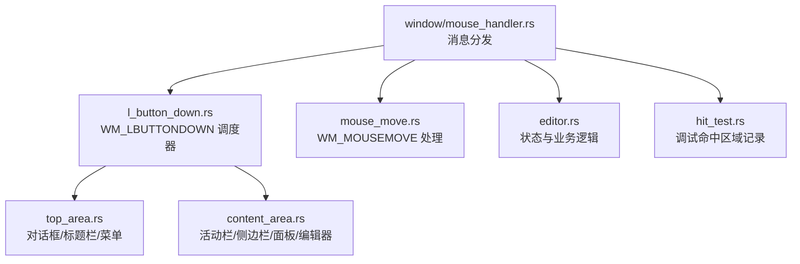
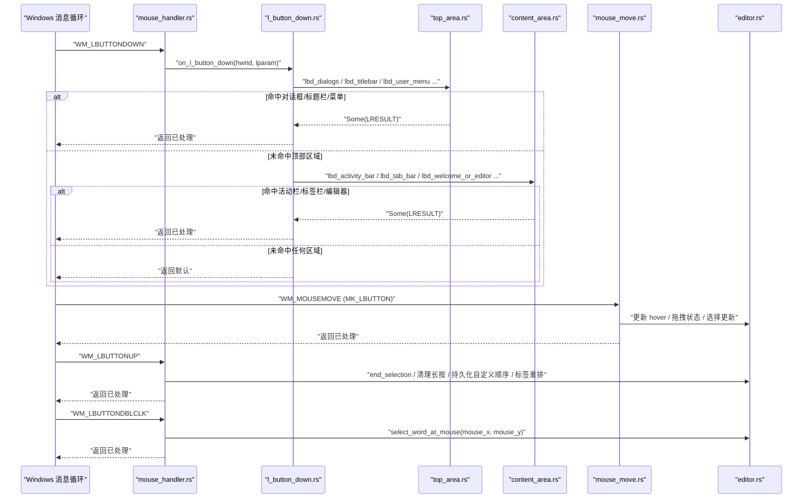
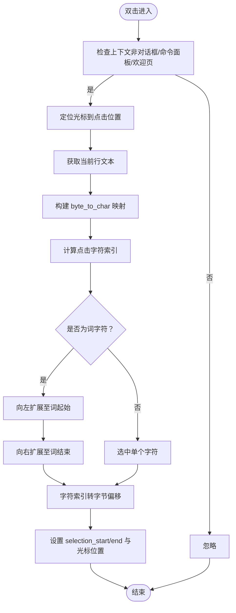
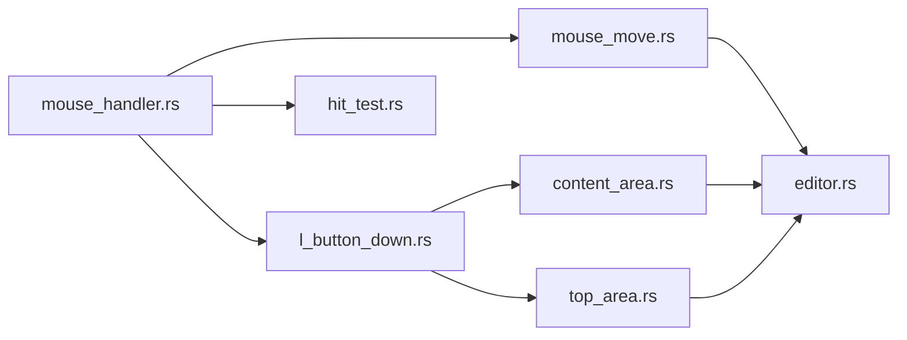

# 左键点击处理

<cite>
**本文引用的文件**   
- [mouse_handler.rs](file://crates/aether-win32/src/window/mouse_handler.rs)
- [l_button_down.rs](file://crates/aether-win32/src/window/mouse_handler/l_button_down.rs)
- [content_area.rs](file://crates/aether-win32/src/window/mouse_handler/l_button_down/content_area.rs)
- [top_area.rs](file://crates/aether-win32/src/window/mouse_handler/l_button_down/top_area.rs)
- [mouse_move.rs](file://crates/aether-win32/src/window/mouse_handler/mouse_move.rs)
- [editor.rs](file://crates/aether-win32/src/editor.rs)
- [hit_test.rs](file://crates/aether-win32/src/hit_test.rs)
</cite>

## 目录
1. [简介](#简介)
2. [项目结构](#项目结构)
3. [核心组件](#核心组件)
4. [架构总览](#架构总览)
5. [详细组件分析](#详细组件分析)
6. [依赖关系分析](#依赖关系分析)
7. [性能考量](#性能考量)
8. [故障排查指南](#故障排查指南)
9. [结论](#结论)

## 简介
本技术文档聚焦于“左键点击处理系统”，覆盖以下关键主题：
- WM_LBUTTONDOWN、WM_LBUTTONUP、WM_LBUTTONDBLCLK 消息的处理机制与调度流程
- 点击检测算法：坐标转换、区域命中测试、控件识别
- 拖拽操作实现：开始、移动、结束的状态管理与交互反馈
- 双击选词功能原理
- 标签页拖拽重排、活动栏自定义模式下的拖拽
- 性能优化技巧与用户体验改进方案

## 项目结构
左键点击处理位于 Windows 窗口消息处理层，采用“主调度器 + 按区域拆分”的模块化设计。鼠标事件统一入口在 mouse_handler 模块中，WM_LBUTTONDOWN 进一步拆分为 top_area（对话框/标题栏/菜单）和 content_area（活动栏/侧边栏/面板/编辑器）两个子模块，便于控制单文件行数与维护性。

图表来源
- [mouse_handler.rs:1-100](file://crates/aether-win32/src/window/mouse_handler.rs#L1-L100)
- [l_button_down.rs:17-100](file://crates/aether-win32/src/window/mouse_handler/l_button_down.rs#L17-L100)
- [top_area.rs:18-170](file://crates/aether-win32/src/window/mouse_handler/l_button_down/top_area.rs#L18-L170)
- [content_area.rs:18-120](file://crates/aether-win32/src/window/mouse_handler/l_button_down/content_area.rs#L18-L120)
- [mouse_move.rs:20-78](file://crates/aether-win32/src/window/mouse_handler/mouse_move.rs#L20-L78)
- [editor.rs:260-270](file://crates/aether-win32/src/editor.rs#L260-L270)
- [hit_test.rs:1-55](file://crates/aether-win32/src/hit_test.rs#L1-L55)

章节来源
- [mouse_handler.rs:1-100](file://crates/aether-win32/src/window/mouse_handler.rs#L1-L100)
- [l_button_down.rs:17-100](file://crates/aether-win32/src/window/mouse_handler/l_button_down.rs#L17-L100)

## 核心组件
- 消息分发器：负责解析 LPARAM/WPARAM、DPI 缩放、布局克隆、退出自定义模式等公共初始化，然后按优先级调用各区域处理器。
- 顶部区域处理器：对话框拦截、标题栏按钮/菜单项、标题栏拖动。
- 内容区域处理器：活动栏、侧边栏、右侧 AI 面板、底部终端面板、设置面板、标签栏、欢迎页/编辑器。
- 移动处理：悬停更新、拖拽光标、面板尺寸调整、标签拖拽阈值判定与 drop_index 更新。
- 编辑器状态：选择状态机、双击选词、标签拖拽重排、滚动与布局计算。

章节来源
- [mouse_handler.rs:23-152](file://crates/aether-win32/src/window/mouse_handler.rs#L23-L152)
- [l_button_down.rs:17-100](file://crates/aether-win32/src/window/mouse_handler/l_button_down.rs#L17-L100)
- [content_area.rs:282-465](file://crates/aether-win32/src/window/mouse_handler/l_button_down/content_area.rs#L282-L465)
- [mouse_move.rs:80-188](file://crates/aether-win32/src/window/mouse_handler/mouse_move.rs#L80-L188)
- [editor.rs:5708-5797](file://crates/aether-win32/src/editor.rs#L5708-L5797)

## 架构总览
下图展示了左键点击从消息到具体处理的完整时序，包括长按检测、自定义模式拖拽、标签拖拽阈值进入拖拽模式、以及最终落地的 UI 刷新。

图表来源
- [mouse_handler.rs:23-152](file://crates/aether-win32/src/window/mouse_handler.rs#L23-L152)
- [l_button_down.rs:17-100](file://crates/aether-win32/src/window/mouse_handler/l_button_down.rs#L17-L100)
- [top_area.rs:141-318](file://crates/aether-win32/src/window/mouse_handler/l_button_down/top_area.rs#L141-L318)
- [content_area.rs:282-465](file://crates/aether-win32/src/window/mouse_handler/l_button_down/content_area.rs#L282-L465)
- [mouse_move.rs:80-188](file://crates/aether-win32/src/window/mouse_handler/mouse_move.rs#L80-L188)
- [editor.rs:5708-5797](file://crates/aether-win32/src/editor.rs#L5708-L5797)

## 详细组件分析

### WM_LBUTTONDOWN 处理机制与调度
- 坐标转换：将 LPARAM 中的物理像素转换为逻辑像素（除以 DPI 缩放）。
- 布局克隆：避免在借用期间修改布局导致不一致。
- 自定义模式退出：若点击不在活动栏或菜单栏区域内，则退出对应自定义排序模式。
- 优先级调度：依次尝试对话框 → 标题栏 → 用户菜单 → 资源管理器上下文菜单 → 活动栏上下文菜单 → 标签上下文菜单 → 子菜单 → 活动栏 → 面板拖拽区 → 侧边栏 → 右侧面板 → 标签栏 → 查找替换面板 → 底部面板 → 设置面板 → 欢迎页/编辑器。首个返回 Some 的处理器即视为已处理。

章节来源
- [l_button_down.rs:17-100](file://crates/aether-win32/src/window/mouse_handler/l_button_down.rs#L17-L100)
- [top_area.rs:18-170](file://crates/aether-win32/src/window/mouse_handler/l_button_down/top_area.rs#L18-L170)
- [content_area.rs:18-120](file://crates/aether-win32/src/window/mouse_handler/l_button_down/content_area.rs#L18-L120)

### 点击检测算法：坐标转换、区域命中测试、控件识别
- 坐标转换：所有处理器均先进行 DPI 缩放转换，确保命中测试基于逻辑像素。
- 区域命中测试：使用布局管理器提供的 Region.contains 方法判断点是否在目标区域内部；对于复杂控件（如标签栏），通过遍历 tab_layouts 并比较 rel_x 与 layout_entry.x/width/close_x/close_width 精确命中关闭按钮或标签体。
- 控件识别：根据命中结果区分不同控件行为，例如标签关闭按钮触发保存确认弹窗，标签体触发切换，活动栏图标触发视图切换或自定义拖拽。

章节来源
- [content_area.rs:282-465](file://crates/aether-win32/src/window/mouse_handler/l_button_down/content_area.rs#L282-L465)
- [top_area.rs:172-318](file://crates/aether-win32/src/window/mouse_handler/l_button_down/top_area.rs#L172-L318)

### 拖拽操作的实现：开始、移动、结束
- 开始：
  - 活动栏自定义模式：按下时 begin_drag(idx)，随后在移动中更新 drop_index。
  - 菜单栏自定义模式：按下时 begin_drag(idx)，移动中更新 drop_index。
  - 标签拖拽：按下标签体时记录 tab_drag_start，并在移动中超过阈值（dx*dx + dy*dy > 9）后进入 dragging_tab 状态，同时设置 tab_drop_index。
- 移动：
  - 更新 hover 状态与拖拽光标（SizeWE/SizeNS/Hand/IBeam）。
  - 面板拖拽：右侧面板、底部面板、侧边栏、设置面板导航栏宽度调整。
  - 标签拖拽：根据鼠标位置计算新的 drop_index，仅当变化时触发重绘。
- 结束：
  - 清理长按检测状态（KillTimer、重置 lpress_*）。
  - 自定义模式持久化：活动栏/菜单栏 reorder() 并保存到 AppSettings。
  - 标签重排：reorder_tabs(drag_idx, drop_idx)，更新 active_tab 跟随移动标签。

章节来源
- [content_area.rs:18-74](file://crates/aether-win32/src/window/mouse_handler/l_button_down/content_area.rs#L18-L74)
- [mouse_move.rs:140-188](file://crates/aether-win32/src/window/mouse_handler/mouse_move.rs#L140-L188)
- [mouse_handler.rs:23-111](file://crates/aether-win32/src/window/mouse_handler.rs#L23-L111)
- [editor.rs:1090-1110](file://crates/aether-win32/src/editor.rs#L1090-L1110)

### 双击选词功能的实现原理
- 触发条件：WM_LBUTTONDBLCLK，且当前不在对话框/命令面板/欢迎页。
- 定位光标：先将光标移动到点击位置（set_cursor_from_mouse）。
- 词边界扩展：在当前行内，以字母/数字/下划线为词字符，向左/右扩展至非词字符边界；若非词字符则选中该单个字符。
- 选择范围：将字符索引转回字节偏移，设置 selection_start/end，并将光标置于末尾，结束选择状态。

图表来源
- [mouse_handler.rs:113-152](file://crates/aether-win32/src/window/mouse_handler.rs#L113-L152)
- [editor.rs:5730-5797](file://crates/aether-win32/src/editor.rs#L5730-L5797)

章节来源
- [mouse_handler.rs:113-152](file://crates/aether-win32/src/window/mouse_handler.rs#L113-L152)
- [editor.rs:5730-5797](file://crates/aether-win32/src/editor.rs#L5730-L5797)

### 标签页拖拽重排
- 进入拖拽：按下标签体时记录 tab_drag_start 与 hover_tab；移动超过阈值后设置 dragging_tab 与初始 tab_drop_index。
- 拖拽中：根据鼠标相对 x 与 tab_layouts 的中点计算插入位置（drop_idx 语义为“插入到该索引之前”）。
- 释放：若存在 drag_idx 与 drop_idx 且不等，执行 reorder_tabs，更新 active_tab 跟随移动标签，并显示状态消息。

章节来源
- [content_area.rs:282-465](file://crates/aether-win32/src/window/mouse_handler/l_button_down/content_area.rs#L282-L465)
- [mouse_move.rs:156-188](file://crates/aether-win32/src/window/mouse_handler/mouse_move.rs#L156-L188)
- [editor.rs:1090-1110](file://crates/aether-win32/src/editor.rs#L1090-L1110)
- [mouse_handler.rs:76-111](file://crates/aether-win32/src/window/mouse_handler.rs#L76-L111)

### 活动栏自定义模式下的拖拽操作
- 按下活动栏图标：记录 lpress_* 并启动长按定时器；若处于 customize_mode，则 begin_drag(idx)。
- 移动：更新 drop_index 为鼠标 y 对应的活动栏条目位置。
- 释放：reorder() 并持久化 activity_bar_order 到 AppSettings，提示“活动栏顺序已保存”。

章节来源
- [content_area.rs:18-74](file://crates/aether-win32/src/window/mouse_handler/l_button_down/content_area.rs#L18-L74)
- [mouse_move.rs:140-155](file://crates/aether-win32/src/window/mouse_handler/mouse_move.rs#L140-L155)
- [mouse_handler.rs:60-75](file://crates/aether-win32/src/window/mouse_handler.rs#L60-L75)

### 其他重要点击场景
- 标题栏按钮与工具栏：最小化/最大化/关闭、用户菜单、设置、右侧面板、底部面板、侧边栏开关。
- 标签栏关闭按钮：在 borrow_mut 持有期间不弹出模态对话框，先在 borrow 下收集 dirty 信息，drop 后再弹窗确认，最后重新 borrow_mut 执行关闭，避免 RefCell panic。
- 底部面板：点击标签切换 Terminal/Problems；点击关闭按钮隐藏面板；点击终端区域自动聚焦并启动终端。
- 设置面板：导航栏宽度拖拽、标签/字段/按钮/模型列表/下拉框命中与交互。

章节来源
- [top_area.rs:172-318](file://crates/aether-win32/src/window/mouse_handler/l_button_down/top_area.rs#L172-L318)
- [content_area.rs:531-638](file://crates/aether-win32/src/window/mouse_handler/l_button_down/content_area.rs#L531-L638)
- [content_area.rs:640-891](file://crates/aether-win32/src/window/mouse_handler/l_button_down/content_area.rs#L640-L891)

## 依赖关系分析
- 模块耦合：
  - mouse_handler.rs 作为入口，依赖 window 层的 get_and_set_state、invalidate_window、常量（LP_TIMER_ID、TERM_TIMER_ID 等）。
  - l_button_down.rs 依赖 top_area.rs 与 content_area.rs 的区域处理器。
  - mouse_move.rs 依赖 editor.rs 的 hover 与选择更新、cursor 类型计算。
  - editor.rs 提供核心状态与方法（start_selection、end_selection、select_word_at_mouse、tab_drop_index_at、reorder_tabs）。
- 外部依赖：
  - Windows API：SetTimer/KillTimer、SendMessageW、ReleaseCapture、LoadCursorW、ShowWindow、DestroyWindow 等。
  - 渲染与布局：LayoutManager、Region、TextRenderer、D2DFactory。
  - 配置与持久化：AppSettings.save()。

图表来源
- [mouse_handler.rs:1-100](file://crates/aether-win32/src/window/mouse_handler.rs#L1-L100)
- [l_button_down.rs:17-100](file://crates/aether-win32/src/window/mouse_handler/l_button_down.rs#L17-L100)
- [top_area.rs:18-170](file://crates/aether-win32/src/window/mouse_handler/l_button_down/top_area.rs#L18-L170)
- [content_area.rs:18-120](file://crates/aether-win32/src/window/mouse_handler/l_button_down/content_area.rs#L18-L120)
- [mouse_move.rs:20-78](file://crates/aether-win32/src/window/mouse_handler/mouse_move.rs#L20-L78)
- [editor.rs:260-270](file://crates/aether-win32/src/editor.rs#L260-L270)
- [hit_test.rs:1-55](file://crates/aether-win32/src/hit_test.rs#L1-L55)

章节来源
- [mouse_handler.rs:1-100](file://crates/aether-win32/src/window/mouse_handler.rs#L1-L100)
- [l_button_down.rs:17-100](file://crates/aether-win32/src/window/mouse_handler/l_button_down.rs#L17-L100)
- [mouse_move.rs:20-78](file://crates/aether-win32/src/window/mouse_handler/mouse_move.rs#L20-L78)
- [editor.rs:260-270](file://crates/aether-win32/src/editor.rs#L260-L270)
- [hit_test.rs:1-55](file://crates/aether-win32/src/hit_test.rs#L1-L55)

## 性能考量
- 减少不必要的重绘：仅在 hover 状态或 tooltip 可见性发生变化时 invalidate_window；拖拽过程中仅当 drop_index 变化才重绘。
- 尽早返回：对话框/上下文菜单打开时优先处理，避免后续区域处理器重复计算。
- 借用策略：在可能触发模态对话框的路径（如标签关闭）中，先在只读 borrow 下完成命中检测，drop 后再执行动作，避免 RefCell panic 导致的阻塞。
- 命中区域记录：debug 构建下记录可点击区域用于自动化测试，release 构建零开销。

章节来源
- [mouse_move.rs:60-78](file://crates/aether-win32/src/window/mouse_handler/mouse_move.rs#L60-L78)
- [content_area.rs:282-465](file://crates/aether-win32/src/window/mouse_handler/l_button_down/content_area.rs#L282-L465)
- [hit_test.rs:59-179](file://crates/aether-win32/src/hit_test.rs#L59-L179)

## 故障排查指南
- 标签关闭弹窗导致卡死：
  - 现象：RefCell already borrowed panic。
  - 原因：在 borrow_mut 持有期间弹出 MessageBox/TaskDialog 会再次触发消息派发，导致二次借用。
  - 解决：在 borrow 下完成点击检测与脏信息收集，drop 后再弹窗，确认后重新 borrow_mut 执行关闭。
- 自定义模式拖拽无响应：
  - 检查是否点击在正确区域（活动栏/菜单栏），否则会自动退出自定义模式。
  - 确认 move 中 drop_index 更新逻辑是否被触发。
- 双击选词无效：
  - 确认当前不在对话框/命令面板/欢迎页。
  - 检查 DPI 缩放是否正确转换，确保 set_cursor_from_mouse 能定位到正确字符。

章节来源
- [content_area.rs:282-465](file://crates/aether-win32/src/window/mouse_handler/l_button_down/content_area.rs#L282-L465)
- [mouse_handler.rs:113-152](file://crates/aether-win32/src/window/mouse_handler.rs#L113-L152)
- [top_area.rs:141-170](file://crates/aether-win32/src/window/mouse_handler/l_button_down/top_area.rs#L141-L170)

## 结论
左键点击处理系统通过清晰的调度与区域划分，实现了高内聚低耦合的交互逻辑。长按检测、自定义模式拖拽、标签拖拽重排与双击选词等功能均在统一的 DPI 感知与布局体系下工作。通过合理的借用策略与增量重绘，系统在保持流畅体验的同时避免了常见并发与性能问题。未来可考虑进一步优化命中测试缓存与拖拽路径的动画反馈，以提升整体用户体验。