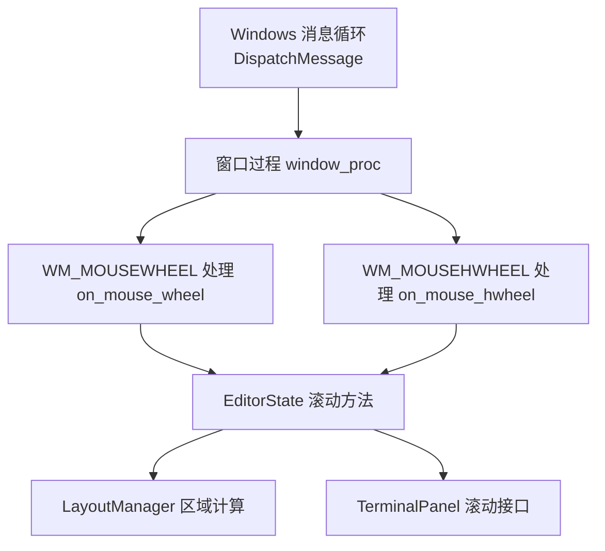
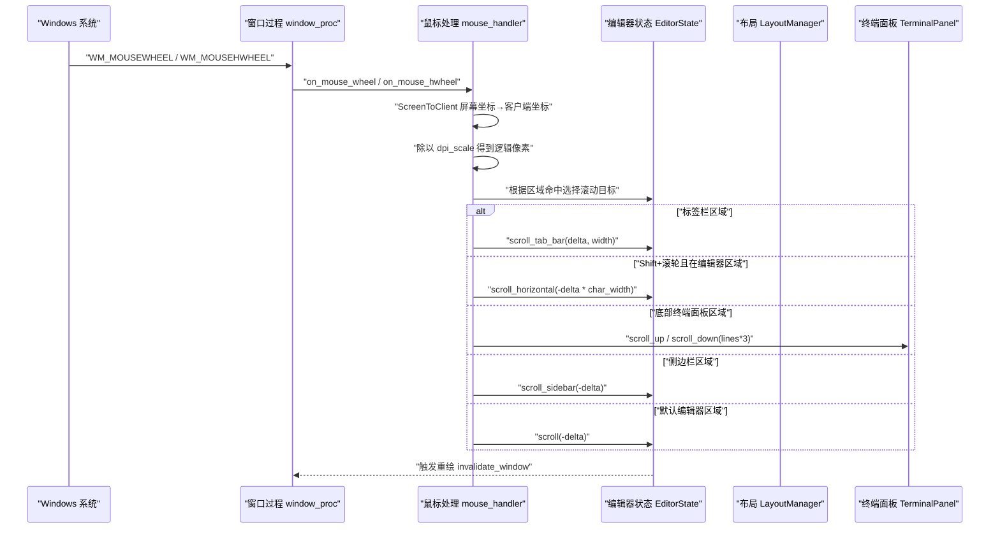
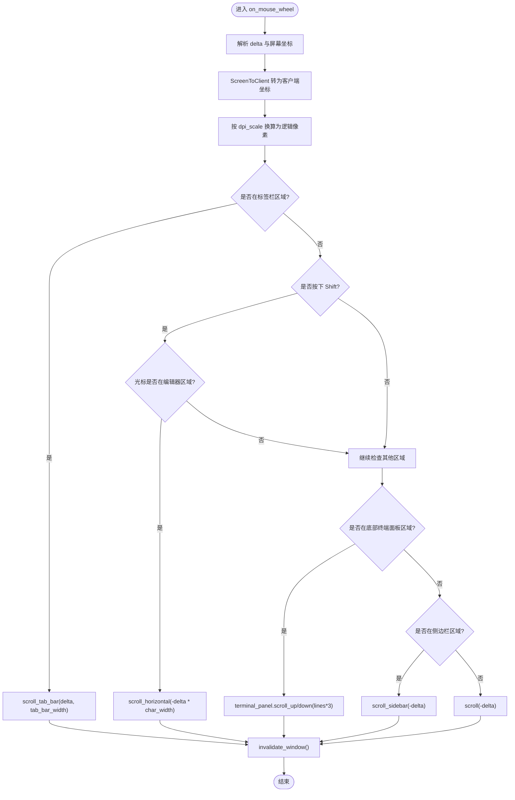
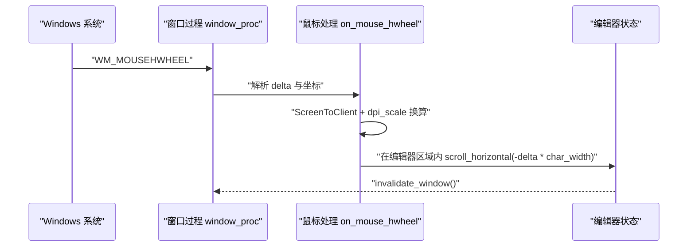
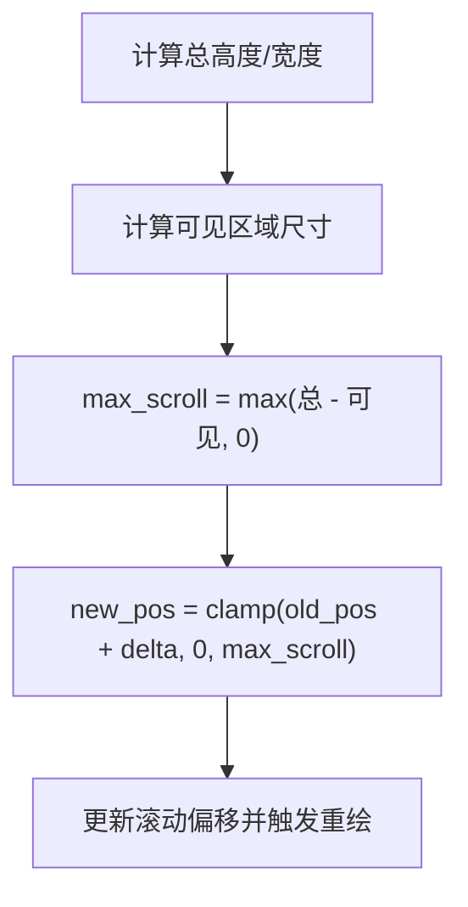
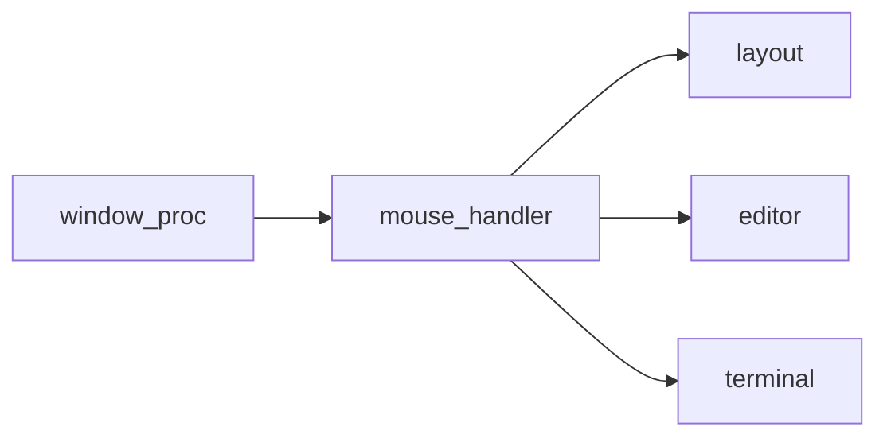

# 滚轮滚动处理

<cite>
**本文引用的文件**   
- [window.rs](file://crates/aether-win32/src/window.rs)
- [mouse_handler.rs](file://crates/aether-win32/src/window/mouse_handler.rs)
- [editor.rs](file://crates/aether-win32/src/editor.rs)
- [terminal.rs](file://crates/aether-win32/src/terminal.rs)
- [layout.rs](file://crates/aether-win32/src/layout.rs)
</cite>

## 目录
1. [简介](#简介)
2. [项目结构](#项目结构)
3. [核心组件](#核心组件)
4. [架构总览](#架构总览)
5. [详细组件分析](#详细组件分析)
6. [依赖分析](#依赖分析)
7. [性能考虑](#性能考虑)
8. [故障排查指南](#故障排查指南)
9. [结论](#结论)
10. [附录](#附录)

## 简介
本技术文档聚焦于 Windows 平台的滚轮滚动处理系统，覆盖以下关键主题：
- WM_MOUSEWHEEL 与 WM_MOUSEHWHEEL 消息的处理机制
- 垂直滚动与水平滚动的实现逻辑
- Shift+滚轮的横向滚动功能
- 不同区域的差异化滚动行为（编辑器区域、侧边栏、底部终端面板、标签栏）
- DPI 感知与坐标转换方案
- 平滑滚动优化与多点触控支持建议

## 项目结构
滚轮事件从 Windows 消息循环进入窗口过程，再路由到鼠标处理模块，最终由编辑器状态执行具体滚动逻辑。布局模块提供区域计算，终端模块提供独立滚动能力。

图表来源
- [window.rs:340-373](file://crates/aether-win32/src/window.rs#L340-L373)
- [mouse_handler.rs:154-277](file://crates/aether-win32/src/window/mouse_handler.rs#L154-L277)
- [editor.rs:2523-2750](file://crates/aether-win32/src/editor.rs#L2523-L2750)
- [terminal.rs:463-472](file://crates/aether-win32/src/terminal.rs#L463-L472)
- [layout.rs:1-200](file://crates/aether-win32/src/layout.rs#L1-L200)

章节来源
- [window.rs:340-373](file://crates/aether-win32/src/window.rs#L340-L373)
- [mouse_handler.rs:154-277](file://crates/aether-win32/src/window/mouse_handler.rs#L154-L277)

## 核心组件
- 窗口消息分发：将 WM_MOUSEWHEEL 与 WM_MOUSEHWHEEL 分派到对应处理函数
- 鼠标处理模块：解析 delta、屏幕坐标转客户端坐标、DPI 缩放、按键状态判断、区域命中测试
- 编辑器状态：提供垂直滚动、水平滚动、侧边栏滚动、标签栏滚动等 API
- 终端面板：提供独立的上下滚动接口
- 布局管理器：提供各 UI 区域几何信息（包含判定）

章节来源
- [window.rs:340-373](file://crates/aether-win32/src/window.rs#L340-L373)
- [mouse_handler.rs:154-277](file://crates/aether-win32/src/window/mouse_handler.rs#L154-L277)
- [editor.rs:2523-2750](file://crates/aether-win32/src/editor.rs#L2523-L2750)
- [terminal.rs:463-472](file://crates/aether-win32/src/terminal.rs#L463-L472)
- [layout.rs:1-200](file://crates/aether-win32/src/layout.rs#L1-L200)

## 架构总览
下图展示了从消息到达至滚动生效的完整调用链，并标注了 DPI 与坐标转换的关键点。

图表来源
- [window.rs:340-373](file://crates/aether-win32/src/window.rs#L340-L373)
- [mouse_handler.rs:154-277](file://crates/aether-win32/src/window/mouse_handler.rs#L154-L277)
- [editor.rs:2523-2750](file://crates/aether-win32/src/editor.rs#L2523-L2750)
- [terminal.rs:463-472](file://crates/aether-win32/src/terminal.rs#L463-L472)

## 详细组件分析

### WM_MOUSEWHEEL 处理流程
- 输入解析
  - 从 wParam 提取 delta（通常为 120 的倍数）
  - 从 lParam 获取光标屏幕坐标，使用 ScreenToClient 转换为客户端坐标
  - 读取 VK_SHIFT 键状态以启用横向滚动模式
- DPI 与坐标转换
  - 将客户端物理像素坐标除以 dpi_scale，得到逻辑像素坐标
- 区域命中与分流
  - 标签栏区域：优先处理标签栏横向滚动
  - Shift+滚轮且光标位于编辑器区域：执行编辑器横向滚动
  - 底部终端面板区域：向上/向下滚动固定行数
  - 侧边栏区域：侧边栏纵向滚动
  - 其他情况：编辑器纵向滚动
- 渲染更新
  - 每次滚动后调用 invalidate_window 标记失效区域，等待 WM_PAINT 统一重绘

图表来源
- [mouse_handler.rs:154-237](file://crates/aether-win32/src/window/mouse_handler.rs#L154-L237)
- [editor.rs:1133-1145](file://crates/aether-win32/src/editor.rs#L1133-L1145)
- [editor.rs:2523-2533](file://crates/aether-win32/src/editor.rs#L2523-L2533)
- [editor.rs:2582-2611](file://crates/aether-win32/src/editor.rs#L2582-L2611)
- [terminal.rs:463-472](file://crates/aether-win32/src/terminal.rs#L463-L472)
- [layout.rs:1-200](file://crates/aether-win32/src/layout.rs#L1-L200)

章节来源
- [mouse_handler.rs:154-237](file://crates/aether-win32/src/window/mouse_handler.rs#L154-L237)
- [editor.rs:2523-2611](file://crates/aether-win32/src/editor.rs#L2523-L2611)
- [terminal.rs:463-472](file://crates/aether-win32/src/terminal.rs#L463-L472)
- [layout.rs:1-200](file://crates/aether-win32/src/layout.rs#L1-L200)

### WM_MOUSEHWHEEL 处理流程
- 输入解析
  - 从 wParam 提取横向滚轮 delta
  - 从 lParam 获取屏幕坐标，转换为客户端坐标并进行 DPI 换算
- 区域限制
  - 仅在编辑器区域内响应横向滚轮
- 滚动方向与步长
  - 使用字符宽度将 delta 转换为像素偏移，调用水平滚动接口
- 渲染更新
  - 滚动后标记失效区域

图表来源
- [window.rs:340-373](file://crates/aether-win32/src/window.rs#L340-L373)
- [mouse_handler.rs:239-277](file://crates/aether-win32/src/window/mouse_handler.rs#L239-L277)
- [editor.rs:2582-2611](file://crates/aether-win32/src/editor.rs#L2582-L2611)

章节来源
- [mouse_handler.rs:239-277](file://crates/aether-win32/src/window/mouse_handler.rs#L239-L277)
- [editor.rs:2582-2611](file://crates/aether-win32/src/editor.rs#L2582-L2611)

### 区域差异与特殊处理
- 标签栏区域
  - 当光标位于标签栏时，优先对标签进行横向滚动，避免误触编辑器滚动
- Shift+滚轮横向滚动
  - 当按下 Shift 且光标位于编辑器区域时，将垂直滚轮事件转换为水平滚动，便于查看超长行内容
- 底部终端面板
  - 在终端面板区域内，滚轮直接控制终端输出历史滚动，步长按行计数（乘以系数）
- 侧边栏
  - 在侧边栏区域内，执行侧边栏内容的纵向滚动（如文件树、远程文件树、源代码管理面板等）
- 编辑器区域
  - 默认情况下，滚轮驱动编辑器文本的纵向滚动；配合 Shift 或横向滚轮驱动横向滚动

章节来源
- [mouse_handler.rs:154-237](file://crates/aether-win32/src/window/mouse_handler.rs#L154-L237)
- [editor.rs:2523-2750](file://crates/aether-win32/src/editor.rs#L2523-L2750)
- [terminal.rs:463-472](file://crates/aether-win32/src/terminal.rs#L463-L472)
- [layout.rs:1-200](file://crates/aether-win32/src/layout.rs#L1-L200)

### DPI 感知与坐标转换
- DPI 感知设置
  - 应用启动时设置 Per-Monitor V2 DPI 感知，确保多显示器环境下正确缩放
- 坐标转换
  - 使用 ScreenToClient 将屏幕坐标转换为客户端坐标
  - 将客户端物理像素坐标除以 dpi_scale，得到逻辑像素坐标用于命中测试与滚动计算
- 字体与度量
  - 文本渲染器内部维护 dpi_scale，用于计算字符宽度与行高，保证在不同 DPI 下滚动步长一致

章节来源
- [window.rs:134-136](file://crates/aether-win32/src/window.rs#L134-L136)
- [mouse_handler.rs:169-178](file://crates/aether-win32/src/window/mouse_handler.rs#L169-L178)
- [editor.rs:290-290](file://crates/aether-win32/src/editor.rs#L290-L290)

### 滚动算法与边界约束
- 垂直滚动
  - 基于当前可见编辑器高度与内容总高度计算最大可滚动范围，并对新位置进行钳制
- 水平滚动
  - 基于可见行中最长行的字符宽度与文本可视宽度计算最大可滚动范围，并对新位置进行钳制
- 侧边栏滚动
  - 根据不同侧边栏内容类型估算总高度，结合可见高度计算最大滚动范围并钳制
- 终端面板滚动
  - 通过 scroll_offset 控制历史输出显示，向上滚动增加偏移，向下滚动减少偏移

图表来源
- [editor.rs:2523-2533](file://crates/aether-win32/src/editor.rs#L2523-L2533)
- [editor.rs:2582-2611](file://crates/aether-win32/src/editor.rs#L2582-L2611)
- [editor.rs:2716-2750](file://crates/aether-win32/src/editor.rs#L2716-L2750)
- [terminal.rs:463-472](file://crates/aether-win32/src/terminal.rs#L463-L472)

章节来源
- [editor.rs:2523-2750](file://crates/aether-win32/src/editor.rs#L2523-L2750)
- [terminal.rs:463-472](file://crates/aether-win32/src/terminal.rs#L463-L472)

## 依赖分析
- 窗口过程依赖鼠标处理模块进行事件分发
- 鼠标处理模块依赖布局管理器进行区域命中测试
- 鼠标处理模块依赖编辑器状态执行滚动逻辑
- 终端面板提供独立滚动接口供鼠标处理模块调用

图表来源
- [window.rs:340-373](file://crates/aether-win32/src/window.rs#L340-L373)
- [mouse_handler.rs:154-277](file://crates/aether-win32/src/window/mouse_handler.rs#L154-L277)
- [layout.rs:1-200](file://crates/aether-win32/src/layout.rs#L1-L200)
- [editor.rs:2523-2750](file://crates/aether-win32/src/editor.rs#L2523-L2750)
- [terminal.rs:463-472](file://crates/aether-win32/src/terminal.rs#L463-L472)

章节来源
- [window.rs:340-373](file://crates/aether-win32/src/window.rs#L340-L373)
- [mouse_handler.rs:154-277](file://crates/aether-win32/src/window/mouse_handler.rs#L154-L277)

## 性能考虑
- 批量重绘
  - 事件处理仅标记失效区域，实际渲染由 WM_PAINT 统一驱动，避免重复绘制
- 大文件优化
  - 编辑器针对大文件阈值进行缓存重建与可见行范围计算，降低滚动时的开销
- 滚动步长
  - 终端面板按行滚动，避免逐像素滚动带来的频繁重绘
- 建议
  - 引入平滑滚动：使用定时器或动画插值逐步更新滚动偏移，提升用户体验
  - 多点触控支持：捕获触摸滚动手势，映射为等效的 WM_MOUSEWHEEL/WM_MOUSEHWHEEL 或直接调用滚动接口

[本节为通用指导，不直接分析具体文件]

## 故障排查指南
- 症状：滚轮无效
  - 检查 DPI 设置是否正确，确认 dpi_scale 非零
  - 验证区域命中逻辑，确认光标坐标落在预期区域
  - 确认 invalidate_window 被调用，WM_PAINT 能触发重绘
- 症状：横向滚动异常
  - 检查 Shift 键状态读取是否正确
  - 确认字符宽度计算与文本可视宽度扣除逻辑
- 症状：终端面板滚动错位
  - 检查 scroll_offset 边界钳制与行数计算
  - 确认终端面板可见性标志与区域计算

章节来源
- [mouse_handler.rs:154-277](file://crates/aether-win32/src/window/mouse_handler.rs#L154-L277)
- [editor.rs:2523-2750](file://crates/aether-win32/src/editor.rs#L2523-L2750)
- [terminal.rs:463-472](file://crates/aether-win32/src/terminal.rs#L463-L472)

## 结论
本项目实现了完善的滚轮滚动处理体系，涵盖垂直与水平滚动、区域差异化处理、DPI 感知与坐标转换，并通过统一的失效区域标记机制保障渲染一致性。建议在后续迭代中引入平滑滚动与多点触控支持，进一步提升交互体验。

[本节为总结性内容，不直接分析具体文件]

## 附录
- 相关常量与区域定义
  - 标题栏、菜单栏、活动栏、侧边栏、状态栏、标签栏的高度/宽度常量
  - 底部面板与右侧面板的最小尺寸约束
- 布局区域计算方法
  - 提供 editor_region、tab_bar_region、sidebar_region、bottom_panel_region 等区域计算接口，用于命中测试与滚动目标选择

章节来源
- [layout.rs:125-200](file://crates/aether-win32/src/layout.rs#L125-L200)