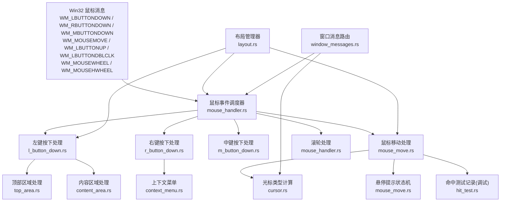
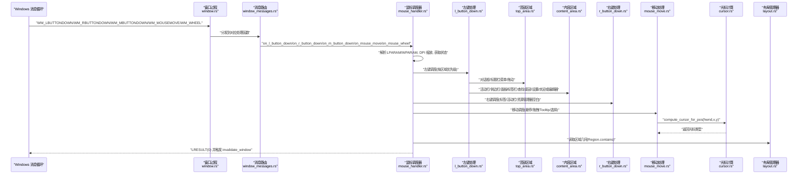
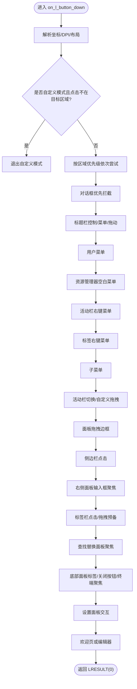
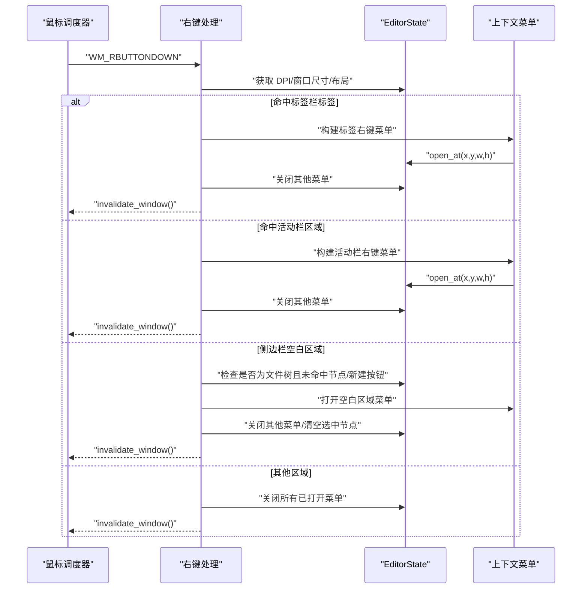
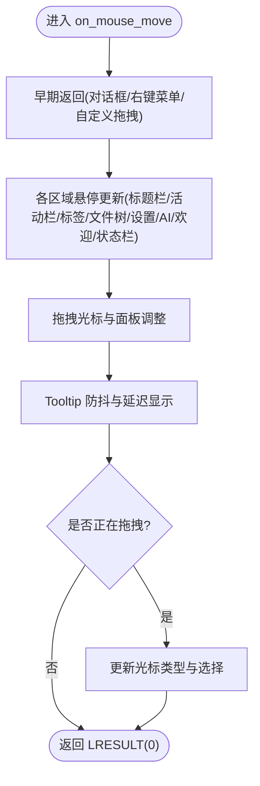
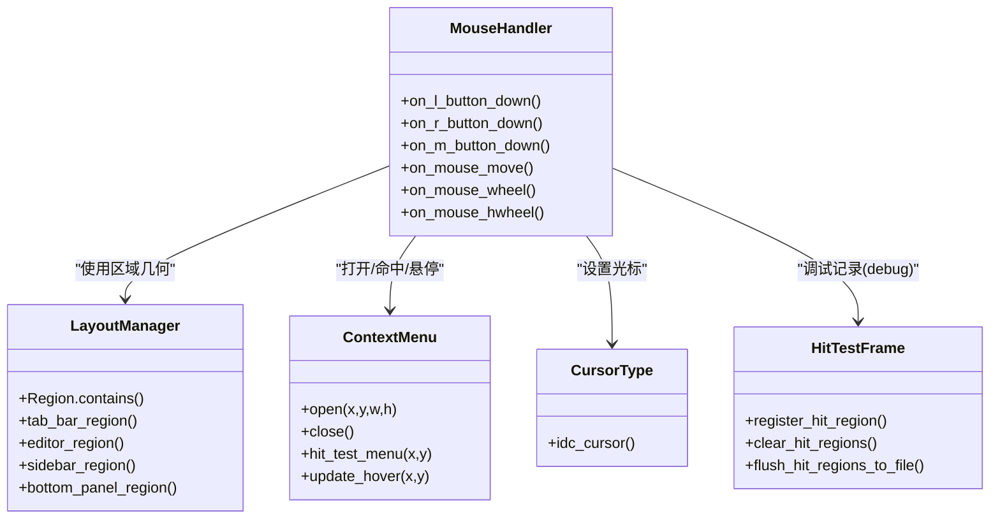

# 鼠标事件处理

<cite>
**本文引用的文件**   
- [mouse_handler.rs](file://crates/aether-win32/src/window/mouse_handler.rs)
- [l_button_down.rs](file://crates/aether-win32/src/window/mouse_handler/l_button_down.rs)
- [content_area.rs](file://crates/aether-win32/src/window/mouse_handler/l_button_down/content_area.rs)
- [top_area.rs](file://crates/aether-win32/src/window/mouse_handler/l_button_down/top_area.rs)
- [m_button_down.rs](file://crates/aether-win32/src/window/mouse_handler/m_button_down.rs)
- [r_button_down.rs](file://crates/aether-win32/src/window/mouse_handler/r_button_down.rs)
- [mouse_move.rs](file://crates/aether-win32/src/window/mouse_handler/mouse_move.rs)
- [cursor.rs](file://crates/aether-win32/src/cursor.rs)
- [context_menu.rs](file://crates/aether-win32/src/context_menu.rs)
- [hit_test.rs](file://crates/aether-win32/src/hit_test.rs)
- [layout.rs](file://crates/aether-win32/src/layout.rs)
- [window_messages.rs](file://crates/aether-win32/src/window/window_messages.rs)
- [window.rs](file://crates/aether-win32/src/window.rs)
</cite>

## 目录
1. [简介](#简介)
2. [项目结构](#项目结构)
3. [核心组件](#核心组件)
4. [架构总览](#架构总览)
5. [详细组件分析](#详细组件分析)
6. [依赖关系分析](#依赖关系分析)
7. [性能考虑](#性能考虑)
8. [故障排查指南](#故障排查指南)
9. [结论](#结论)
10. [附录](#附录)

## 简介
本技术文档聚焦于 Win32 鼠标事件处理系统，覆盖左键、右键、中键、滚轮与横向滚轮消息的处理机制；详述点击检测算法（坐标转换、区域命中测试、控件识别）、拖拽状态管理（开始/移动/结束）、双击选词、右键菜单触发、悬停效果与光标变化；并提供性能优化技巧与多点触控支持方案。

## 项目结构
鼠标事件处理位于窗口子模块下，采用“调度器 + 按区域拆分”的模块化设计：
- 顶层调度器负责消息分发与公共初始化（DPI 缩放、布局克隆、自定义模式退出等）
- 各区域处理器按优先级依次尝试命中并返回结果
- 光标计算与悬停提示独立实现，避免在事件处理中直接调用 SetCursor

**图表来源**
- [mouse_handler.rs:1-277](file://crates/aether-win32/src/window/mouse_handler.rs#L1-L277)
- [l_button_down.rs:1-101](file://crates/aether-win32/src/window/mouse_handler/l_button_down.rs#L1-L101)
- [content_area.rs:1-800](file://crates/aether-win32/src/window/mouse_handler/l_button_down/content_area.rs#L1-L800)
- [top_area.rs:1-612](file://crates/aether-win32/src/window/mouse_handler/l_button_down/top_area.rs#L1-L612)
- [m_button_down.rs:1-58](file://crates/aether-win32/src/window/mouse_handler/m_button_down.rs#L1-L58)
- [r_button_down.rs:1-216](file://crates/aether-win32/src/window/mouse_handler/r_button_down.rs#L1-L216)
- [mouse_move.rs:1-800](file://crates/aether-win32/src/window/mouse_handler/mouse_move.rs#L1-L800)
- [cursor.rs:1-61](file://crates/aether-win32/src/cursor.rs#L1-L61)
- [context_menu.rs:1-340](file://crates/aether-win32/src/context_menu.rs#L1-L340)
- [hit_test.rs:1-245](file://crates/aether-win32/src/hit_test.rs#L1-L245)
- [layout.rs:1-200](file://crates/aether-win32/src/layout.rs#L1-L200)
- [window_messages.rs:566-592](file://crates/aether-win32/src/window/window_messages.rs#L566-L592)

**章节来源**
- [mouse_handler.rs:1-277](file://crates/aether-win32/src/window/mouse_handler.rs#L1-L277)
- [window.rs:335-358](file://crates/aether-win32/src/window.rs#L335-L358)

## 核心组件
- 鼠标事件调度器：统一解析 LPARAM/WPARAM、进行 DPI 坐标转换、获取全局状态、按区域优先级派发处理
- 左键按下处理器：对话框优先拦截 → 标题栏控制/菜单/拖动 → 用户菜单/上下文菜单 → 活动栏/侧边栏/面板/标签栏/查找替换/底部面板/设置面板/欢迎页或编辑器
- 右键按下处理器：标签右键菜单、活动栏右键菜单、资源管理器空白区域菜单；其他区域关闭已打开菜单
- 中键按下处理器：标签栏中键关闭标签
- 鼠标移动处理器：悬停更新、拖拽光标与面板调整、Tooltip 防抖与延迟显示、编辑区选择更新
- 滚轮/横向滚轮处理器：标签栏滚动、Shift+滚轮横向滚动、终端面板滚动、侧边栏滚动、默认编辑器滚动
- 光标计算：根据 hover 状态与拖拽区域返回 IDC_* 光标常量
- 上下文菜单：资源管理器空白区域菜单项定义、边界校正、命中测试与悬停更新
- 命中测试记录（调试）：仅在 debug 构建生效，输出可点击区域 JSONL 供自动化测试使用

**章节来源**
- [l_button_down.rs:1-101](file://crates/aether-win32/src/window/mouse_handler/l_button_down.rs#L1-L101)
- [top_area.rs:141-318](file://crates/aether-win32/src/window/mouse_handler/l_button_down/top_area.rs#L141-L318)
- [content_area.rs:18-142](file://crates/aether-win32/src/window/mouse_handler/l_button_down/content_area.rs#L18-L142)
- [r_button_down.rs:17-202](file://crates/aether-win32/src/window/mouse_handler/r_button_down.rs#L17-L202)
- [m_button_down.rs:15-57](file://crates/aether-win32/src/window/mouse_handler/m_button_down.rs#L15-L57)
- [mouse_move.rs:21-78](file://crates/aether-win32/src/window/mouse_handler/mouse_move.rs#L21-L78)
- [mouse_handler.rs:154-276](file://crates/aether-win32/src/window/mouse_handler.rs#L154-L276)
- [cursor.rs:1-61](file://crates/aether-win32/src/cursor.rs#L1-L61)
- [context_menu.rs:48-172](file://crates/aether-win32/src/context_menu.rs#L48-L172)
- [hit_test.rs:1-179](file://crates/aether-win32/src/hit_test.rs#L1-L179)

## 架构总览
下图展示从 Win32 消息到具体处理的完整链路，包括坐标转换、区域命中、状态变更与重绘触发。

**图表来源**
- [window.rs:335-358](file://crates/aether-win32/src/window.rs#L335-L358)
- [window_messages.rs:566-592](file://crates/aether-win32/src/window/window_messages.rs#L566-L592)
- [mouse_handler.rs:1-277](file://crates/aether-win32/src/window/mouse_handler.rs#L1-L277)
- [l_button_down.rs:1-101](file://crates/aether-win32/src/window/mouse_handler/l_button_down.rs#L1-L101)
- [top_area.rs:141-318](file://crates/aether-win32/src/window/mouse_handler/l_button_down/top_area.rs#L141-L318)
- [content_area.rs:18-142](file://crates/aether-win32/src/window/mouse_handler/l_button_down/content_area.rs#L18-L142)
- [r_button_down.rs:17-202](file://crates/aether-win32/src/window/mouse_handler/r_button_down.rs#L17-L202)
- [mouse_move.rs:21-78](file://crates/aether-win32/src/window/mouse_handler/mouse_move.rs#L21-L78)
- [cursor.rs:1-61](file://crates/aether-win32/src/cursor.rs#L1-L61)
- [layout.rs:1-200](file://crates/aether-win32/src/layout.rs#L1-L200)

## 详细组件分析

### 左键按下（WM_LBUTTONDOWN）
- 公共初始化：提取 raw_x/raw_y，除以 dpi_scale 得到逻辑像素；克隆布局；若处于自定义模式且点击不在目标区域则退出自定义模式
- 区域优先级：对话框 → 标题栏 → 用户菜单 → 资源管理器空白菜单 → 活动栏右键菜单 → 标签右键菜单 → 子菜单 → 活动栏 → 面板拖拽边框 → 侧边栏 → 右侧面板 → 标签栏 → 查找替换面板 → 底部面板 → 设置面板 → 欢迎页或编辑器
- 长按检测：为活动栏和菜单栏启动定时器，超过阈值进入自定义拖拽排序
- 标签栏：体部点击进入拖拽预备（tab_drag_start），关闭按钮需弹出确认对话框（在释放 borrow_mut 后执行以避免 RefCell panic）

**图表来源**
- [l_button_down.rs:17-100](file://crates/aether-win32/src/window/mouse_handler/l_button_down.rs#L17-L100)
- [top_area.rs:141-318](file://crates/aether-win32/src/window/mouse_handler/l_button_down/top_area.rs#L141-L318)
- [content_area.rs:18-142](file://crates/aether-win32/src/window/mouse_handler/l_button_down/content_area.rs#L18-L142)

**章节来源**
- [l_button_down.rs:17-100](file://crates/aether-win32/src/window/mouse_handler/l_button_down.rs#L17-L100)
- [top_area.rs:141-318](file://crates/aether-win32/src/window/mouse_handler/l_button_down/top_area.rs#L141-L318)
- [content_area.rs:282-465](file://crates/aether-win32/src/window/mouse_handler/l_button_down/content_area.rs#L282-L465)

### 右键按下（WM_RBUTTONDOWN）
- 标签右键：命中标签栏某标签 → 构建并打开标签上下文菜单；同时关闭其他菜单
- 活动栏右键：命中活动栏区域 → 构建并打开活动栏右键菜单；互斥关闭其他菜单
- 资源管理器空白区域：仅当侧边栏可见且当前为文件树视图时，未命中任何节点且不在新建按钮上 → 打开空白区域菜单；否则关闭已打开菜单
- 空白区域右键会清除当前选中节点并触发侧边栏变更事件

**图表来源**
- [r_button_down.rs:17-202](file://crates/aether-win32/src/window/mouse_handler/r_button_down.rs#L17-L202)
- [context_menu.rs:97-172](file://crates/aether-win32/src/context_menu.rs#L97-L172)

**章节来源**
- [r_button_down.rs:17-202](file://crates/aether-win32/src/window/mouse_handler/r_button_down.rs#L17-L202)
- [context_menu.rs:48-172](file://crates/aether-win32/src/context_menu.rs#L48-L172)

### 中键按下（WM_MBUTTONDOWN）
- 仅响应标签栏区域内的中键点击
- 复用 close_tab 的 dirty 检查逻辑，与关闭按钮行为一致

**章节来源**
- [m_button_down.rs:15-57](file://crates/aether-win32/src/window/mouse_handler/m_button_down.rs#L15-L57)

### 鼠标移动（WM_MOUSEMOVE）
- 早期返回：对话框悬停、右键上下文菜单悬停、自定义模式拖拽跟随
- 悬停更新：标题栏按钮/菜单、活动栏/标签栏、文件树/SSH/源码管理、设置面板、AI 面板、欢迎页、状态栏分区
- 拖拽光标与面板调整：右侧面板/底部面板/设置导航栏/侧边栏分隔条
- Tooltip 防抖：基于 HOVER_DELAY_MS 与 HOVER_MOVE_TOLERANCE 的状态机
- 编辑区拖拽：设置光标类型并更新选择

**图表来源**
- [mouse_move.rs:21-78](file://crates/aether-win32/src/window/mouse_handler/mouse_move.rs#L21-L78)
- [mouse_move.rs:80-188](file://crates/aether-win32/src/window/mouse_handler/mouse_move.rs#L80-L188)
- [mouse_move.rs:575-668](file://crates/aether-win32/src/window/mouse_handler/mouse_move.rs#L575-L668)
- [mouse_move.rs:670-778](file://crates/aether-win32/src/window/mouse_handler/mouse_move.rs#L670-L778)

**章节来源**
- [mouse_move.rs:21-78](file://crates/aether-win32/src/window/mouse_handler/mouse_move.rs#L21-L78)
- [mouse_move.rs:80-188](file://crates/aether-win32/src/window/mouse_handler/mouse_move.rs#L80-L188)
- [mouse_move.rs:575-668](file://crates/aether-win32/src/window/mouse_handler/mouse_move.rs#L575-L668)
- [mouse_move.rs:670-778](file://crates/aether-win32/src/window/mouse_handler/mouse_move.rs#L670-L778)

### 滚轮与横向滚轮（WM_MOUSEWHEEL / WM_MOUSEHWHEEL）
- 坐标转换：ScreenToClient 获取客户区坐标，再除以 dpi_scale 转为逻辑像素
- 标签栏区域：横向滚动标签栏
- Shift+滚轮：在编辑器区域内横向滚动
- 底部终端面板：向上/向下滚动终端输出
- 侧边栏：滚动文件树
- 默认：编辑器纵向滚动
- 横向滚轮：仅在编辑器区域内响应

**章节来源**
- [mouse_handler.rs:154-276](file://crates/aether-win32/src/window/mouse_handler.rs#L154-L276)

### 双击检测（WM_LBUTTONDBLCLK）
- 非对话框/命令面板/欢迎页时，若双击落在编辑器内容区域，则执行“双击选词”

**章节来源**
- [mouse_handler.rs:113-152](file://crates/aether-win32/src/window/mouse_handler.rs#L113-L152)

### 悬停效果与光标变化
- 光标类型枚举映射到 IDC_* 常量，由 WM_SETCURSOR 调用 compute_cursor_for_pos 设置
- 悬停高亮由各区域 hover 状态驱动，hover 变化时触发 invalidate_window

**章节来源**
- [cursor.rs:1-61](file://crates/aether-win32/src/cursor.rs#L1-L61)
- [window_messages.rs:566-592](file://crates/aether-win32/src/window/window_messages.rs#L566-L592)
- [mouse_move.rs:780-800](file://crates/aether-win32/src/window/mouse_handler/mouse_move.rs#L780-L800)

### 拖拽操作状态管理
- 活动栏/菜单栏自定义模式：begin_drag → move 更新 drop_index → end 持久化顺序
- 标签拖拽：tab_drag_start 记录起始点，超过阈值进入 dragging_tab，move 更新 tab_drop_index，end 重排标签
- 面板拖拽：right_panel_resizing/bottom_panel_resizing/sidebar_resizing/nav_resizing 标志位控制调整

**章节来源**
- [mouse_handler.rs:24-111](file://crates/aether-win32/src/window/mouse_handler.rs#L24-L111)
- [mouse_move.rs:140-186](file://crates/aether-win32/src/window/mouse_handler/mouse_move.rs#L140-L186)
- [content_area.rs:18-115](file://crates/aether-win32/src/window/mouse_handler/l_button_down/content_area.rs#L18-L115)

### 点击检测算法（坐标转换、区域命中、控件识别）
- 坐标转换：raw_x/raw_y 除以 dpi_scale 得到逻辑像素；必要时 ScreenToClient 将屏幕坐标转为客户区坐标
- 区域命中：使用 layout.Region.contains 判断鼠标是否在目标区域
- 控件识别：通过各区域的 hit_test 方法（如 menu_bar.hit_test、activity_bar.hit_test、tab_body_hit_test 等）精确识别控件

**章节来源**
- [layout.rs:1-200](file://crates/aether-win32/src/layout.rs#L1-L200)
- [top_area.rs:269-303](file://crates/aether-win32/src/window/mouse_handler/l_button_down/top_area.rs#L269-L303)
- [content_area.rs:18-74](file://crates/aether-win32/src/window/mouse_handler/l_button_down/content_area.rs#L18-L74)

## 依赖关系分析
- 鼠标调度器依赖布局管理器提供区域几何信息
- 右键上下文菜单依赖 context_menu 模块进行边界校正与命中测试
- 光标计算依赖 cursor 模块的枚举映射
- 调试命中测试记录仅在 debug 构建启用，release 构建为空实现零开销

**图表来源**
- [mouse_handler.rs:1-277](file://crates/aether-win32/src/window/mouse_handler.rs#L1-L277)
- [layout.rs:1-200](file://crates/aether-win32/src/layout.rs#L1-L200)
- [context_menu.rs:48-172](file://crates/aether-win32/src/context_menu.rs#L48-L172)
- [cursor.rs:1-61](file://crates/aether-win32/src/cursor.rs#L1-L61)
- [hit_test.rs:1-179](file://crates/aether-win32/src/hit_test.rs#L1-L179)

**章节来源**
- [mouse_handler.rs:1-277](file://crates/aether-win32/src/window/mouse_handler.rs#L1-L277)
- [layout.rs:1-200](file://crates/aether-win32/src/layout.rs#L1-L200)
- [context_menu.rs:48-172](file://crates/aether-win32/src/context_menu.rs#L48-L172)
- [cursor.rs:1-61](file://crates/aether-win32/src/cursor.rs#L1-L61)
- [hit_test.rs:1-179](file://crates/aether-win32/src/hit_test.rs#L1-L179)

## 性能考虑
- 渲染合并：通过 invalidate_window 标记脏区域，由 WM_PAINT 统一渲染，避免重复绘制
- 悬停防抖：HOVER_DELAY_MS 与 HOVER_MOVE_TOLERANCE 减少频繁 Tooltip 显示与重绘
- 长按时机：LP_THRESHOLD_MS 与移动容差 LP_MOVE_TOLERANCE 避免误触
- 命中测试记录：debug 构建下使用 Mutex 与文件 I/O，release 构建空实现零开销
- 滚轮处理：仅在相关区域命中时执行滚动，减少不必要状态变更

[本节为通用指导，不直接分析具体文件]

## 故障排查指南
- 标签关闭弹窗导致 RefCell panic：确保在弹出模态对话框前释放 borrow_mut，参考标签栏关闭路径
- 右键菜单重叠：右键处理中显式关闭其他菜单，避免多个菜单同时显示
- 终端面板焦点与 IME：切换到底部面板时正确设置 terminal.focused 与 IME bypass
- 滚轮方向与字符宽度：横向滚轮使用 char_width 换算像素偏移，注意 delta 符号

**章节来源**
- [content_area.rs:282-465](file://crates/aether-win32/src/window/mouse_handler/l_button_down/content_area.rs#L282-L465)
- [r_button_down.rs:17-202](file://crates/aether-win32/src/window/mouse_handler/r_button_down.rs#L17-L202)
- [content_area.rs:531-638](file://crates/aether-win32/src/window/mouse_handler/l_button_down/content_area.rs#L531-L638)
- [mouse_handler.rs:154-276](file://crates/aether-win32/src/window/mouse_handler.rs#L154-L276)

## 结论
本系统以“调度器 + 区域处理器”的清晰分层实现了完整的 Win32 鼠标事件处理，涵盖点击、拖拽、滚轮、双击、右键菜单与悬停反馈。通过布局 Region 与 DPI 缩放保证跨分辨率一致性，结合防抖与延迟策略提升交互体验与性能。未来可在多点触控方面扩展手势识别与多指操作支持。

[本节为总结性内容，不直接分析具体文件]

## 附录
- 关键常量与定时器 ID：LP_TIMER_ID、TERM_TIMER_ID、HOVER_TIMER_ID、CARET_TIMER_ID、LP_THRESHOLD_MS、TERM_REFRESH_MS、HOVER_DELAY_MS、HOVER_MOVE_TOLERANCE、LP_MOVE_TOLERANCE
- 布局常量：TITLE_BAR_HEIGHT、ACTIVITY_BAR_WIDTH、SIDEBAR_WIDTH、STATUS_BAR_HEIGHT、TAB_BAR_HEIGHT、MIN_SIDEBAR_WIDTH、MAX_SIDEBAR_WIDTH、SIDEBAR_RESIZE_GRAB、SIDEBAR_AUTO_HIDE_THRESHOLD、MIN_BOTTOM_PANEL_HEIGHT、MIN_RIGHT_PANEL_WIDTH

**章节来源**
- [window.rs:33-53](file://crates/aether-win32/src/window.rs#L33-L53)
- [layout.rs:125-200](file://crates/aether-win32/src/layout.rs#L125-L200)