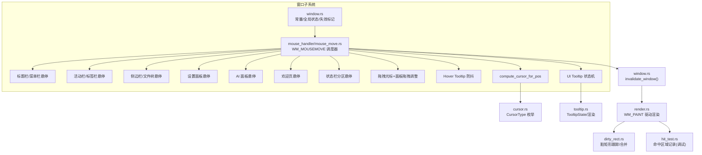
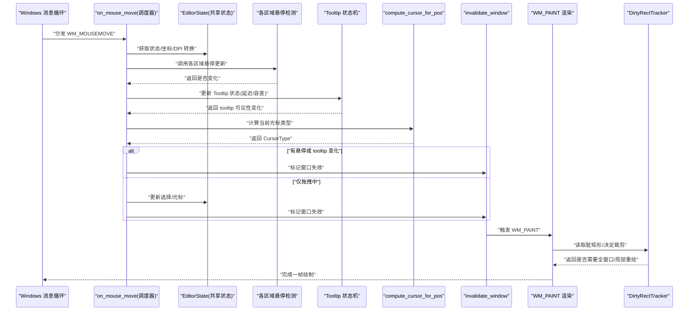
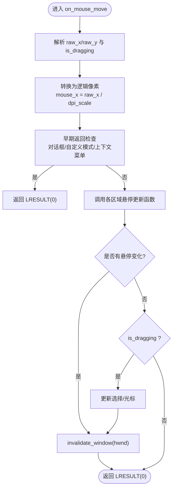
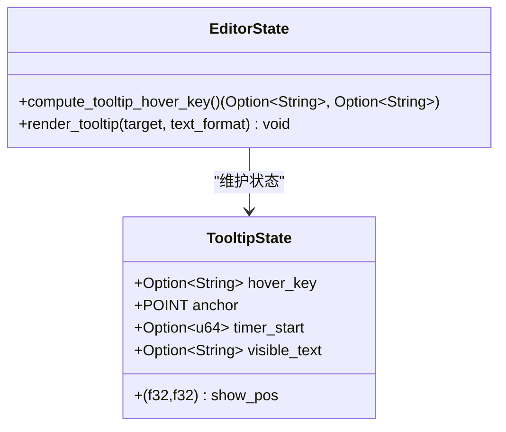
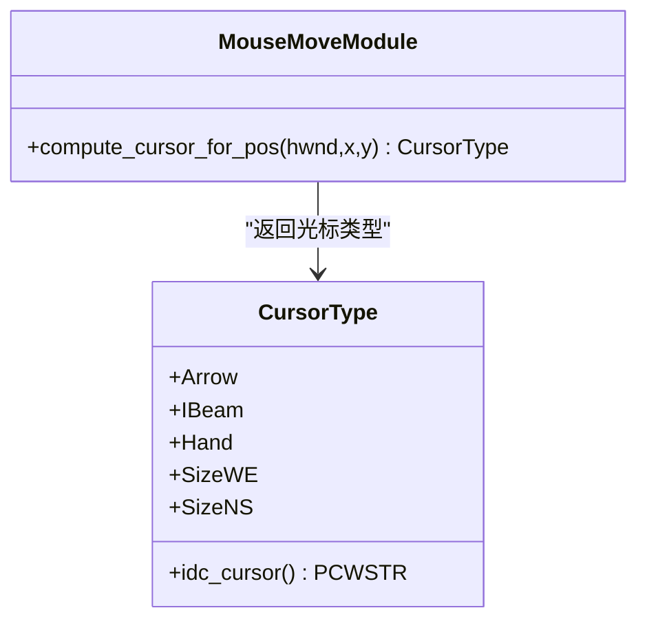
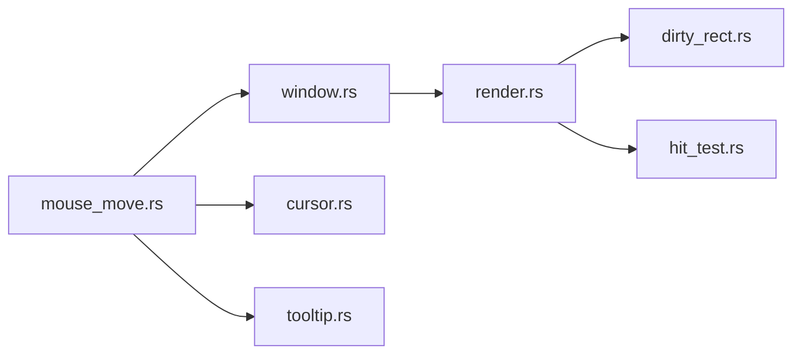

# 鼠标移动处理

<cite>
**本文引用的文件**
- [mouse_move.rs](file://crates/aether-win32/src/window/mouse_handler/mouse_move.rs)
- [cursor.rs](file://crates/aether-win32/src/cursor.rs)
- [tooltip.rs](file://crates/aether-win32/src/tooltip.rs)
- [window.rs](file://crates/aether-win32/src/window.rs)
- [dirty_rect.rs](file://crates/aether-win32/src/dirty_rect.rs)
- [render.rs](file://crates/aether-win32/src/render.rs)
- [hit_test.rs](file://crates/aether-win32/src/hit_test.rs)
</cite>

## 目录
1. [简介](#简介)
2. [项目结构](#项目结构)
3. [核心组件](#核心组件)
4. [架构总览](#架构总览)
5. [详细组件分析](#详细组件分析)
6. [依赖关系分析](#依赖关系分析)
7. [性能考量](#性能考量)
8. [故障排查指南](#故障排查指南)
9. [结论](#结论)
10. [附录](#附录)

## 简介
本技术文档聚焦于 Windows 平台下的鼠标移动处理系统，围绕 WM_MOUSEMOVE 消息的高效处理机制展开。内容涵盖：
- 光标位置计算与坐标转换（物理像素到逻辑像素）
- 悬停效果实现（工具提示、链接高亮、区域反馈）
- 性能优化策略（事件节流、增量更新、脏矩形合并）
- 光标形状动态变化、拖拽预览与实时反馈
- 调试技巧与性能监控方法

## 项目结构
鼠标移动处理位于 aether-win32 模块的窗口子系统内，采用“调度器 + 多辅助函数”的分层设计，将复杂逻辑拆分为多个职责单一的小函数，便于维护与测试。

图表来源
- [mouse_move.rs:21-78](file://crates/aether-win32/src/window/mouse_handler/mouse_move.rs#L21-L78)
- [cursor.rs:1-29](file://crates/aether-win32/src/cursor.rs#L1-L29)
- [tooltip.rs:1-25](file://crates/aether-win32/src/tooltip.rs#L1-L25)
- [window.rs:40-75](file://crates/aether-win32/src/window.rs#L40-L75)
- [render.rs:404-432](file://crates/aether-win32/src/render.rs#L404-L432)
- [dirty_rect.rs:92-118](file://crates/aether-win32/src/dirty_rect.rs#L92-L118)
- [hit_test.rs:1-25](file://crates/aether-win32/src/hit_test.rs#L1-L25)

章节来源
- [mouse_move.rs:1-78](file://crates/aether-win32/src/window/mouse_handler/mouse_move.rs#L1-L78)
- [window.rs:40-75](file://crates/aether-win32/src/window.rs#L40-L75)

## 核心组件
- WM_MOUSEMOVE 调度器：负责解析原始坐标、DPI 缩放、布局克隆、早期返回、各区域悬停更新、拖拽与面板调整、Tooltip 防抖与状态机、最终失效判定与增量重绘。
- 光标类型系统：抽象出 CursorType，统一映射到 Win32 光标资源 ID，供 WM_SETCURSOR 使用。
- Tooltip 系统：包含延迟显示、移动容差、可见文本与显示位置管理，并在主渲染流程末尾绘制。
- 失效与脏矩形：通过 invalidate_window 触发 WM_PAINT，结合 dirty_rect 进行局部/全窗口重绘决策。
- 命中区域记录：在 debug 构建下记录可点击区域，用于自动化测试与可视化调试。

章节来源
- [mouse_move.rs:21-78](file://crates/aether-win32/src/window/mouse_handler/mouse_move.rs#L21-L78)
- [cursor.rs:1-29](file://crates/aether-win32/src/cursor.rs#L1-L29)
- [tooltip.rs:1-25](file://crates/aether-win32/src/tooltip.rs#L1-L25)
- [window.rs:66-75](file://crates/aether-win32/src/window.rs#L66-L75)
- [dirty_rect.rs:92-118](file://crates/aether-win32/src/dirty_rect.rs#L92-L118)
- [hit_test.rs:1-25](file://crates/aether-win32/src/hit_test.rs#L1-L25)

## 架构总览
下图展示了从 WM_MOUSEMOVE 进入，到悬停状态更新、Tooltip 状态机、光标计算、失效标记与渲染驱动的完整链路。

图表来源
- [mouse_move.rs:21-78](file://crates/aether-win32/src/window/mouse_handler/mouse_move.rs#L21-L78)
- [tooltip.rs:26-168](file://crates/aether-win32/src/tooltip.rs#L26-L168)
- [cursor.rs:17-29](file://crates/aether-win32/src/cursor.rs#L17-L29)
- [window.rs:66-75](file://crates/aether-win32/src/window.rs#L66-L75)
- [render.rs:404-432](file://crates/aether-win32/src/render.rs#L404-L432)
- [dirty_rect.rs:92-118](file://crates/aether-win32/src/dirty_rect.rs#L92-L118)

## 详细组件分析

### 组件：WM_MOUSEMOVE 调度器
- 输入解析：从 LPARAM 提取原始 x/y，WPARAM 判断是否左键按下（拖拽）。
- DPI 转换：raw_x/raw_y 除以 st.dpi_scale 得到逻辑像素坐标。
- 早期返回：对话框悬停、自定义模式拖拽、上下文菜单 hover 等优先处理并提前返回。
- 悬停更新：按区域依次更新标题栏/菜单栏、活动栏/标签栏、文件树/SSH/源码管理、设置面板、AI 面板、欢迎页、状态栏分区。
- 拖拽与面板调整：根据边缘区域设置 SizeWE/SizeNS 光标，并在拖拽中实时更新布局尺寸。
- Tooltip 防抖：针对侧边栏节点悬停，基于 HOVER_DELAY_MS 与 HOVER_MOVE_TOLERANCE 控制定时器启停。
- UI Tooltip 状态机：hover_key 变化时重置计时；静止超过 TOOLTIP_DELAY_MS 且移动距离小于 TOOLTIP_MOVE_TOLERANCE 则显示；否则隐藏。
- 失效判定：若任何悬停或 tooltip 可见性发生变化，调用 invalidate_window 触发 WM_PAINT；仅在拖拽中时更新选择与光标并重绘。

图表来源
- [mouse_move.rs:21-78](file://crates/aether-win32/src/window/mouse_handler/mouse_move.rs#L21-L78)
- [window.rs:66-75](file://crates/aether-win32/src/window.rs#L66-L75)

章节来源
- [mouse_move.rs:21-78](file://crates/aether-win32/src/window/mouse_handler/mouse_move.rs#L21-L78)

### 组件：Tooltip 状态机与渲染
- 状态字段：hover_key、anchor、timer_start、visible_text、show_pos。
- 触发条件：
  - hover_key 变化：重置 anchor/timer_start，清空 visible_text。
  - 移动容差：当鼠标相对 anchor 移动超过 TOOLTIP_MOVE_TOLERANCE 时，重置计时并可能隐藏已显示的 tooltip。
  - 延迟显示：当 timer_start 存在且 now - start >= TOOLTIP_DELAY_MS，设置 visible_text 与 show_pos。
- 渲染流程：在主渲染末尾调用 render_tooltip，测量文本宽度/高度，计算圆角背景框，自动边界修正（右侧越界则放左侧），绘制半透明背景与文本。

图表来源
- [tooltip.rs:1-25](file://crates/aether-win32/src/tooltip.rs#L1-L25)
- [tooltip.rs:26-168](file://crates/aether-win32/src/tooltip.rs#L26-L168)

章节来源
- [tooltip.rs:1-25](file://crates/aether-win32/src/tooltip.rs#L1-L25)
- [tooltip.rs:26-168](file://crates/aether-win32/src/tooltip.rs#L26-L168)

### 组件：光标形状动态变化
- compute_cursor_for_pos 依据当前 hover 状态与布局区域返回 CursorType。
- 优先级顺序：对话框/命令面板 → 欢迎页 hover → 标题栏按钮/菜单项 → 活动栏 hover → 面板拖拽中 → 标签栏 hover → 分隔条（左右/底部）→ 编辑器内容区 → 状态栏 clickable 分区 → 默认箭头。
- CursorType 映射到 IDC_* 光标资源，由 WM_SETCURSOR 调用 SetCursor 应用。

图表来源
- [cursor.rs:1-29](file://crates/aether-win32/src/cursor.rs#L1-L29)
- [mouse_move.rs:798-914](file://crates/aether-win32/src/window/mouse_handler/mouse_move.rs#L798-L914)

章节来源
- [cursor.rs:1-29](file://crates/aether-win32/src/cursor.rs#L1-L29)
- [mouse_move.rs:798-914](file://crates/aether-win32/src/window/mouse_handler/mouse_move.rs#L798-L914)

### 组件：悬停效果与区域反馈
- 标题栏/菜单栏：根据按钮与菜单项 hit test 更新 titlebar_hover_button 与 menu_bar.hover_index。
- 活动栏/标签栏：更新 activity_bar.hover_index 与 hover_tab。
- 文件树/SSH/源码管理：分别更新 hover_file_node、ssh_manager_panel.hover_action、git.hover_button。
- 设置面板：更新 hover_tab、hover_button、hover_model_id、hover_dropdown 等。
- 欢迎页：更新 welcome_hover_action。
- 状态栏分区：根据 sections.clickable 决定是否高亮 hover_index。

章节来源
- [mouse_move.rs:190-264](file://crates/aether-win32/src/window/mouse_handler/mouse_move.rs#L190-L264)
- [mouse_move.rs:266-345](file://crates/aether-win32/src/window/mouse_handler/mouse_move.rs#L266-L345)
- [mouse_move.rs:347-488](file://crates/aether-win32/src/window/mouse_handler/mouse_move.rs#L347-L488)
- [mouse_move.rs:500-532](file://crates/aether-win32/src/window/mouse_handler/mouse_move.rs#L500-L532)
- [mouse_move.rs:534-573](file://crates/aether-win32/src/window/mouse_handler/mouse_move.rs#L534-L573)

### 组件：拖拽预览与实时反馈
- 拖拽光标设置：根据 resize 区域或拖拽状态设置 IDC_SIZEWE/IDC_SIZENS。
- 面板拖拽调整：右侧面板、底部面板、设置面板导航栏、侧边栏宽度在拖拽中实时更新。
- 标签拖拽：阈值判定进入拖拽模式，更新 tab_drop_index 以提供放置预览。

章节来源
- [mouse_move.rs:575-668](file://crates/aether-win32/src/window/mouse_handler/mouse_move.rs#L575-L668)
- [mouse_move.rs:156-186](file://crates/aether-win32/src/window/mouse_handler/mouse_move.rs#L156-L186)

### 组件：失效与增量更新
- invalidate_window 调用 InvalidateRect，由 Windows 合并多次失效为一次 WM_PAINT。
- render 阶段根据 dirty_tracker 决定全窗口清除或裁剪区域，避免不必要的绘制。
- dirty_rect 支持标记全窗口、局部区域、合并重叠矩形、阈值降级为全窗口重绘。

章节来源
- [window.rs:66-75](file://crates/aether-win32/src/window.rs#L66-L75)
- [render.rs:404-432](file://crates/aether-win32/src/render.rs#L404-L432)
- [dirty_rect.rs:92-118](file://crates/aether-win32/src/dirty_rect.rs#L92-L118)

## 依赖关系分析
- mouse_move.rs 依赖 window.rs 提供的常量（HOVER_DELAY_MS、HOVER_MOVE_TOLERANCE、LP_MOVE_TOLERANCE、HOVER_TIMER_ID）、状态访问 get_and_set_state 与失效标记 invalidate_window。
- cursor.rs 提供 CursorType 枚举及 IDC_* 映射，被 compute_cursor_for_pos 使用。
- tooltip.rs 提供 TooltipState 与渲染逻辑，被 mouse_move.rs 的状态机与 render 流程使用。
- render.rs 与 dirty_rect.rs 协作，确保 WM_PAINT 高效绘制。
- hit_test.rs 在 debug 构建下记录命中区域，辅助外部测试框架验证交互。

图表来源
- [mouse_move.rs:15-18](file://crates/aether-win32/src/window/mouse_handler/mouse_move.rs#L15-L18)
- [cursor.rs:17-29](file://crates/aether-win32/src/cursor.rs#L17-L29)
- [tooltip.rs:26-168](file://crates/aether-win32/src/tooltip.rs#L26-L168)
- [render.rs:404-432](file://crates/aether-win32/src/render.rs#L404-L432)
- [dirty_rect.rs:92-118](file://crates/aether-win32/src/dirty_rect.rs#L92-L118)
- [hit_test.rs:1-25](file://crates/aether-win32/src/hit_test.rs#L1-L25)

章节来源
- [mouse_move.rs:15-18](file://crates/aether-win32/src/window/mouse_handler/mouse_move.rs#L15-L18)
- [cursor.rs:17-29](file://crates/aether-win32/src/cursor.rs#L17-L29)
- [tooltip.rs:26-168](file://crates/aether-win32/src/tooltip.rs#L26-L168)
- [render.rs:404-432](file://crates/aether-win32/src/render.rs#L404-L432)
- [dirty_rect.rs:92-118](file://crates/aether-win32/src/dirty_rect.rs#L92-L118)
- [hit_test.rs:1-25](file://crates/aether-win32/src/hit_test.rs#L1-L25)

## 性能考量
- 事件节流与容差：
  - 侧边栏节点悬停 Tooltip 使用 HOVER_DELAY_MS 与 HOVER_MOVE_TOLERANCE 控制定时器启停，减少频繁显示/隐藏。
  - UI Tooltip 使用 TOOLTIP_DELAY_MS 与 TOOLTIP_MOVE_TOLERANCE 防止抖动与误触。
- 增量更新与脏矩形：
  - 通过 invalidate_window 触发 WM_PAINT，Windows 自动合并多次失效，避免重复渲染。
  - dirty_rect 支持局部区域标记与合并，降低绘制开销。
- 只读访问与最小化借用：
  - compute_cursor_for_pos 仅读取状态，不修改字段，减少锁竞争。
  - 悬停更新函数返回布尔值，仅在必要时触发重绘。
- 构建期优化：
  - hit_test.rs 在 release 构建下为空实现，零运行时开销。

[本节为通用性能指导，无需特定文件分析]

## 故障排查指南
- 悬停无响应或闪烁：
  - 检查 HOVER_DELAY_MS 与 HOVER_MOVE_TOLERANCE 配置是否合理。
  - 确认 omm_hover_tooltip 是否正确设置/销毁 HOVER_TIMER_ID。
- Tooltip 不显示或过早消失：
  - 核对 TOOLTIP_DELAY_MS 与 TOOLTIP_MOVE_TOLERANCE 常量。
  - 验证 compute_tooltip_hover_key 返回的 hover_key 是否与预期一致。
- 光标形状不正确：
  - 检查 compute_cursor_for_pos 的优先级分支与区域 hit test 逻辑。
  - 确认 CursorType.idc_cursor 映射到正确的 IDC_* 常量。
- 重绘过多或卡顿：
  - 观察 invalidate_window 调用频率，确认是否仅在必要路径触发。
  - 检查 dirty_rect 的合并阈值与 max_rects 参数，避免过度细分。
- 调试命中区域：
  - 在 debug 构建下启用 hit_test.rs 的全局记录，输出 gui_hit_regions.jsonl 供外部工具分析。

章节来源
- [mouse_move.rs:670-778](file://crates/aether-win32/src/window/mouse_handler/mouse_move.rs#L670-L778)
- [tooltip.rs:21-25](file://crates/aether-win32/src/tooltip.rs#L21-L25)
- [cursor.rs:17-29](file://crates/aether-win32/src/cursor.rs#L17-L29)
- [window.rs:66-75](file://crates/aether-win32/src/window.rs#L66-L75)
- [dirty_rect.rs:92-118](file://crates/aether-win32/src/dirty_rect.rs#L92-L118)
- [hit_test.rs:59-172](file://crates/aether-win32/src/hit_test.rs#L59-L172)

## 结论
本系统通过分层调度、严格的状态管理与高效的渲染管线，实现了高性能的鼠标移动处理。悬停效果与 Tooltip 采用延迟与容差策略，有效抑制抖动与多余绘制；光标形状与拖拽预览提供直观反馈；失效与脏矩形机制确保增量更新。配合调试工具与构建期优化，整体体验流畅且易于维护。

[本节为总结性内容，无需特定文件分析]

## 附录
- 关键常量参考：
  - HOVER_DELAY_MS、HOVER_MOVE_TOLERANCE、LP_MOVE_TOLERANCE、TOOLTIP_DELAY_MS、TOOLTIP_MOVE_TOLERANCE
- 相关 API 路径：
  - on_mouse_move、compute_cursor_for_pos、render_tooltip、invalidate_window、register_hit_region

章节来源
- [window.rs:40-53](file://crates/aether-win32/src/window.rs#L40-L53)
- [tooltip.rs:21-25](file://crates/aether-win32/src/tooltip.rs#L21-L25)
- [mouse_move.rs:21-78](file://crates/aether-win32/src/window/mouse_handler/mouse_move.rs#L21-L78)
- [cursor.rs:17-29](file://crates/aether-win32/src/cursor.rs#L17-L29)
- [tooltip.rs:26-168](file://crates/aether-win32/src/tooltip.rs#L26-L168)
- [window.rs:66-75](file://crates/aether-win32/src/window.rs#L66-L75)
- [hit_test.rs:59-172](file://crates/aether-win32/src/hit_test.rs#L59-L172)