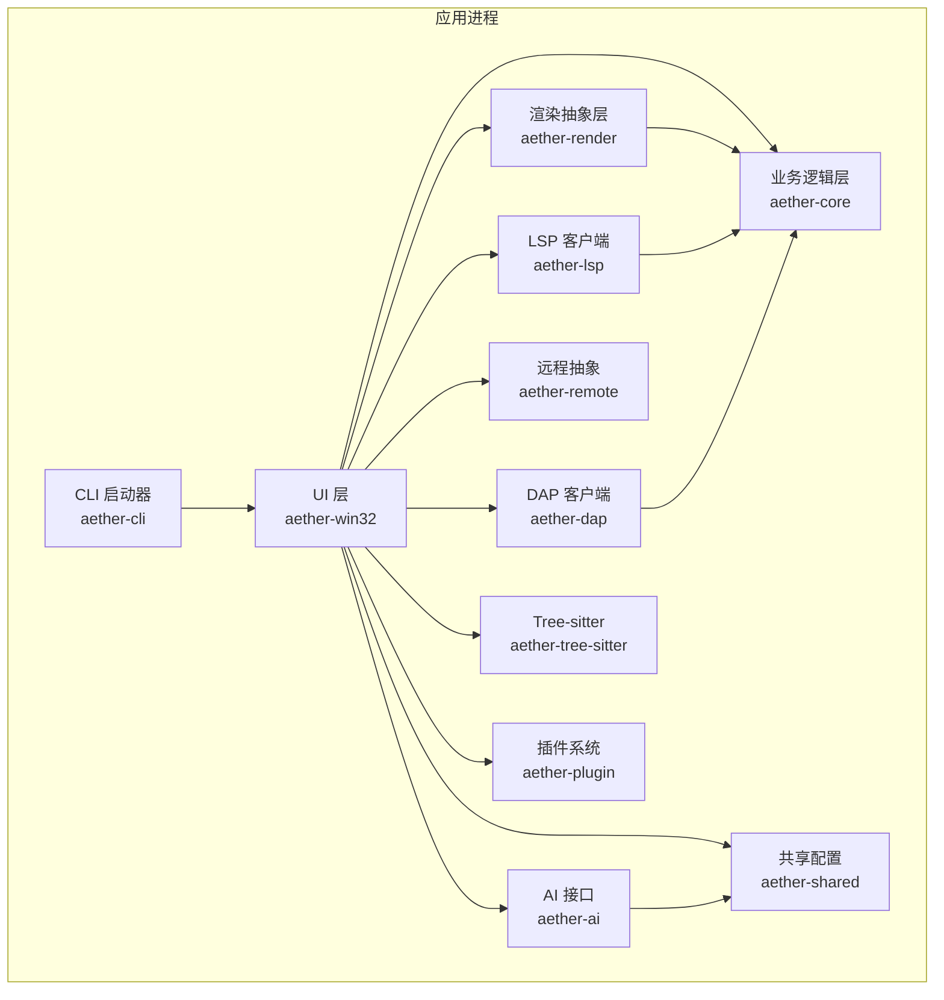
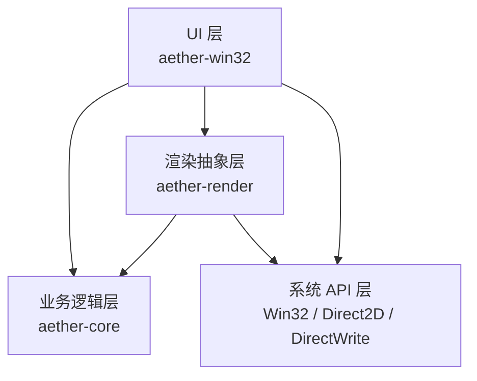
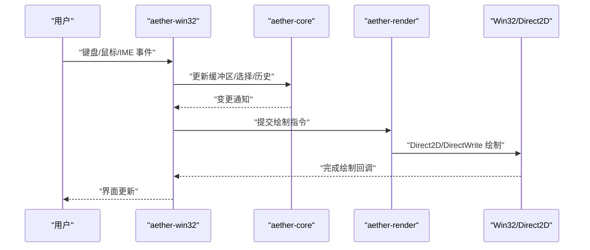
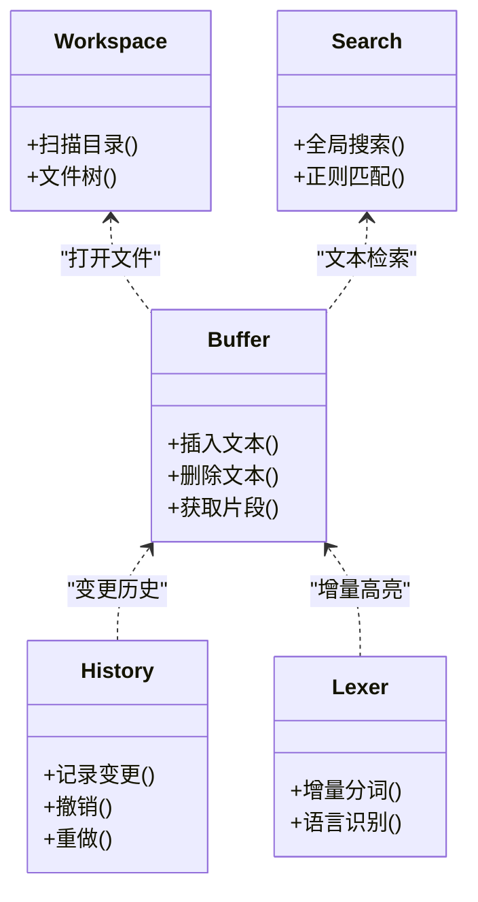
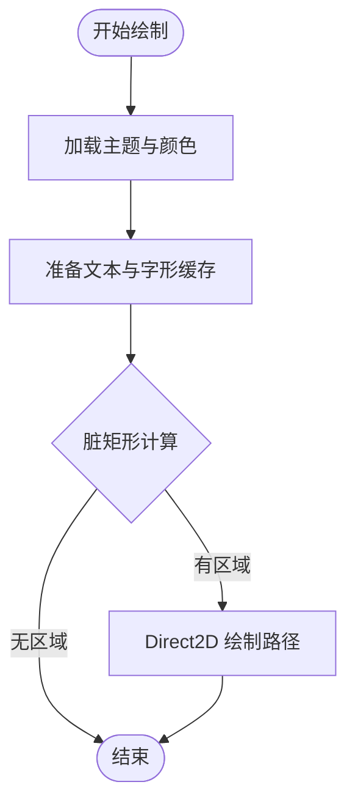
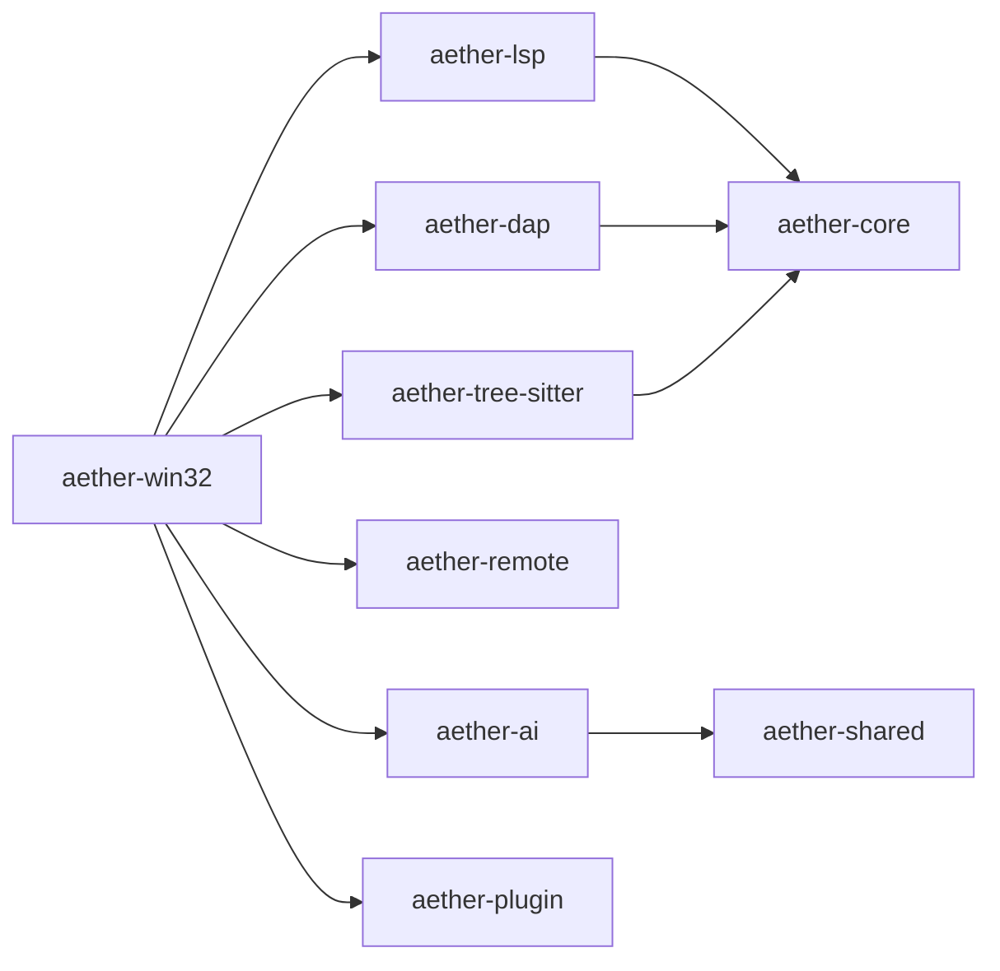
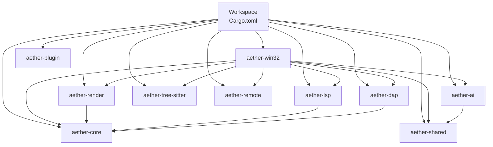

# 整体架构概览

<cite>
**本文引用的文件**   
- [Cargo.toml](file://Cargo.toml)
- [README.md](file://README.md)
- [aether-win32/Cargo.toml](file://crates/aether-win32/Cargo.toml)
- [aether-core/Cargo.toml](file://crates/aether-core/Cargo.toml)
- [aether-render/Cargo.toml](file://crates/aether-render/Cargo.toml)
- [aether-lsp/Cargo.toml](file://crates/aether-lsp/Cargo.toml)
- [aether-dap/Cargo.toml](file://crates/aether-dap/Cargo.toml)
- [aether-remote/Cargo.toml](file://crates/aether-remote/Cargo.toml)
- [aether-ai/Cargo.toml](file://crates/aether-ai/Cargo.toml)
- [aether-plugin/Cargo.toml](file://crates/aether-plugin/Cargo.toml)
- [aether-win32/src/main.rs](file://crates/aether-win32/src/main.rs)
- [aether-core/src/lib.rs](file://crates/aether-core/src/lib.rs)
- [aether-render/src/lib.rs](file://crates/aether-render/src/lib.rs)
- [aether-shared/src/lib.rs](file://crates/aether-shared/src/lib.rs)
- [aether-tree-sitter/src/lib.rs](file://crates/aether-tree-sitter/src/lib.rs)
</cite>

## 目录
1. [简介](#简介)
2. [项目结构](#项目结构)
3. [核心组件](#核心组件)
4. [架构总览](#架构总览)
5. [详细组件分析](#详细组件分析)
6. [依赖关系分析](#依赖关系分析)
7. [性能考量](#性能考量)
8. [故障排查指南](#故障排查指南)
9. [结论](#结论)
10. [附录](#附录)

## 简介
本文件为牧羊人编辑器的整体架构概览，聚焦于基于 Cargo Workspace 的模块化设计、分层架构模式（UI 层 → 业务逻辑层 → 渲染抽象层 → 系统 API 层）、模块职责与依赖关系、交互模式与数据流向。文档旨在为开发者提供清晰的全景视图，帮助快速理解系统设计与扩展点。

## 项目结构
仓库采用 Cargo Workspace 组织，按职责拆分为多个 Crate：
- aether-win32：Windows 原生 UI 层与应用入口
- aether-core：编辑器核心（文本缓冲、历史、词法、搜索、工作区数据结构）
- aether-render：Direct2D/DirectWrite 渲染抽象与主题系统
- aether-shared：共享配置与启动参数
- aether-lsp：语言服务器协议客户端
- aether-dap：调试适配器协议客户端基础
- aether-remote：SSH/Git/容器远程操作抽象
- aether-ai：AI 服务接口与请求处理
- aether-tree-sitter：语法解析、语言检测、主题映射与高亮
- aether-plugin：插件注册、权限与运行时
- aether-cli：命令行启动器（负责拉起 GUI）

图表来源
- [Cargo.toml:1-14](file://Cargo.toml#L1-L14)
- [aether-win32/Cargo.toml:14-22](file://crates/aether-win32/Cargo.toml#L14-L22)
- [aether-render/Cargo.toml:6-10](file://crates/aether-render/Cargo.toml#L6-L10)
- [aether-lsp/Cargo.toml:6-16](file://crates/aether-lsp/Cargo.toml#L6-L16)
- [aether-dap/Cargo.toml:6-15](file://crates/aether-dap/Cargo.toml#L6-L15)
- [aether-ai/Cargo.toml:6-11](file://crates/aether-ai/Cargo.toml#L6-L11)

章节来源
- [Cargo.toml:1-14](file://Cargo.toml#L1-L14)
- [README.md:29-46](file://README.md#L29-L46)

## 核心组件
- UI 层（aether-win32）
  - 窗口生命周期、消息循环、菜单、布局、事件分发、输入处理（键盘/鼠标/IME）
  - 作为应用入口，协调各子系统并驱动渲染
- 业务逻辑层（aether-core）
  - Piece Table 文本缓冲、撤销/重做历史、增量词法分析、查找替换、工作区与文件树数据结构
- 渲染抽象层（aether-render）
  - Direct2D/DirectWrite 封装、主题系统与画笔/文本格式缓存
- 系统 API 层（Win32 + Direct2D/DirectWrite）
  - 通过 windows crate 调用系统图形与窗口能力
- 辅助能力
  - LSP/DAP/Tree-sitter/Remote/AI/Plugin/Shared 等能力由 UI 层按需集成

章节来源
- [aether-win32/src/main.rs:1-26](file://crates/aether-win32/src/main.rs#L1-L26)
- [aether-core/src/lib.rs:1-12](file://crates/aether-core/src/lib.rs#L1-L12)
- [aether-render/src/lib.rs:1-4](file://crates/aether-render/src/lib.rs#L1-L4)
- [aether-shared/src/lib.rs:1-3](file://crates/aether-shared/src/lib.rs#L1-L3)
- [aether-tree-sitter/src/lib.rs:1-10](file://crates/aether-tree-sitter/src/lib.rs#L1-L10)

## 架构总览
分层架构模式：
- UI 层（aether-win32）：面向用户交互，负责窗口、事件与编排
- 业务逻辑层（aether-core）：纯 Rust 实现，无平台耦合，便于测试与复用
- 渲染抽象层（aether-render）：对 Direct2D/DirectWrite 的抽象，屏蔽底层细节
- 系统 API 层：Win32 与图形栈，提供窗口与绘制能力

优势：
- 解耦与可测试性：核心逻辑独立于平台，易于单元测试与基准测试
- 可扩展性：新增语言支持、主题、插件或远程能力时，只需在对应 crate 中扩展
- 性能可控：渲染与 IO 异步化，避免阻塞 UI 线程；渲染层使用缓存与脏矩形优化

图表来源
- [aether-win32/Cargo.toml:14-22](file://crates/aether-win32/Cargo.toml#L14-L22)
- [aether-render/Cargo.toml:6-10](file://crates/aether-render/Cargo.toml#L6-L10)

## 详细组件分析

### UI 层（aether-win32）
- 职责
  - 应用入口与单实例控制、窗口创建与消息循环、事件分发（键盘/鼠标/IME）、菜单与命令面板、布局与状态栏、标签页管理、终端面板、AI 面板、设置与主题切换
- 关键流程
  - 启动参数解析与单实例控制：若已有实例则转发参数并退出当前进程；否则初始化主窗口并进入消息循环
  - 事件到业务逻辑：将输入事件转换为编辑器命令，更新 core 中的缓冲区与选择状态
  - 渲染调度：根据脏矩形与主题变化触发 render 重绘

图表来源
- [aether-win32/src/main.rs:8-26](file://crates/aether-win32/src/main.rs#L8-L26)
- [aether-win32/Cargo.toml:14-22](file://crates/aether-win32/Cargo.toml#L14-L22)

章节来源
- [aether-win32/src/main.rs:1-26](file://crates/aether-win32/src/main.rs#L1-L26)
- [aether-win32/Cargo.toml:14-22](file://crates/aether-win32/Cargo.toml#L14-L22)

### 业务逻辑层（aether-core）
- 职责
  - 文本缓冲（Piece Table）、撤销/重做历史、增量词法分析、查找替换、工作区与文件树数据结构、SIMD 工具与基准测试
- 特点
  - 无平台依赖，纯算法与数据结构实现，适合单元测试与性能基准
  - 为 UI 层与渲染层提供稳定接口

图表来源
- [aether-core/src/lib.rs:1-12](file://crates/aether-core/src/lib.rs#L1-L12)
- [aether-core/Cargo.toml:6-12](file://crates/aether-core/Cargo.toml#L6-L12)

章节来源
- [aether-core/src/lib.rs:1-12](file://crates/aether-core/src/lib.rs#L1-L12)
- [aether-core/Cargo.toml:6-12](file://crates/aether-core/Cargo.toml#L6-L12)

### 渲染抽象层（aether-render）
- 职责
  - 对 Direct2D/DirectWrite 的封装，提供主题系统、画笔与文本格式缓存、VSCode 主题映射
- 依赖
  - 依赖 aether-core 以获取文本与高亮信息，依赖 Windows 图形 API 进行绘制

图表来源
- [aether-render/src/lib.rs:1-4](file://crates/aether-render/src/lib.rs#L1-L4)
- [aether-render/Cargo.toml:6-10](file://crates/aether-render/Cargo.toml#L6-L10)

章节来源
- [aether-render/src/lib.rs:1-4](file://crates/aether-render/src/lib.rs#L1-L4)
- [aether-render/Cargo.toml:6-10](file://crates/aether-render/Cargo.toml#L6-L10)

### 系统 API 层（Win32 + Direct2D/DirectWrite）
- 职责
  - 窗口创建与管理、消息循环、输入法、DWM 深色模式、高 DPI、Direct2D/DirectWrite 绘制
- 集成方式
  - UI 层直接调用系统 API，渲染层通过抽象接口间接使用

章节来源
- [aether-win32/Cargo.toml:22-34](file://crates/aether-win32/Cargo.toml#L22-L34)
- [aether-render/Cargo.toml:10-10](file://crates/aether-render/Cargo.toml#L10-L10)

### 辅助能力模块
- LSP（aether-lsp）
  - 语言服务器协议客户端，负责文档同步、语义 token、增量同步
  - 依赖 aether-core 与 tokio 生态
- DAP（aether-dap）
  - 调试适配器协议客户端基础实现
- Tree-sitter（aether-tree-sitter）
  - 语法解析、语言检测、主题映射与高亮
- Remote（aether-remote）
  - SSH/Git/容器远程操作抽象
- AI（aether-ai）
  - HTTP 接口与大模型交互，读取共享配置
- Plugin（aether-plugin）
  - 插件注册、权限与运行时
- Shared（aether-shared）
  - 启动参数、设置持久化

图表来源
- [aether-lsp/Cargo.toml:6-16](file://crates/aether-lsp/Cargo.toml#L6-L16)
- [aether-dap/Cargo.toml:6-15](file://crates/aether-dap/Cargo.toml#L6-L15)
- [aether-tree-sitter/src/lib.rs:1-10](file://crates/aether-tree-sitter/src/lib.rs#L1-L10)
- [aether-remote/Cargo.toml:6-10](file://crates/aether-remote/Cargo.toml#L6-L10)
- [aether-ai/Cargo.toml:6-11](file://crates/aether-ai/Cargo.toml#L6-L11)
- [aether-plugin/Cargo.toml:6-8](file://crates/aether-plugin/Cargo.toml#L6-L8)
- [aether-shared/src/lib.rs:1-3](file://crates/aether-shared/src/lib.rs#L1-L3)

章节来源
- [aether-lsp/Cargo.toml:6-16](file://crates/aether-lsp/Cargo.toml#L6-L16)
- [aether-dap/Cargo.toml:6-15](file://crates/aether-dap/Cargo.toml#L6-L15)
- [aether-tree-sitter/src/lib.rs:1-10](file://crates/aether-tree-sitter/src/lib.rs#L1-L10)
- [aether-remote/Cargo.toml:6-10](file://crates/aether-remote/Cargo.toml#L6-L10)
- [aether-ai/Cargo.toml:6-11](file://crates/aether-ai/Cargo.toml#L6-L11)
- [aether-plugin/Cargo.toml:6-8](file://crates/aether-plugin/Cargo.toml#L6-L8)
- [aether-shared/src/lib.rs:1-3](file://crates/aether-shared/src/lib.rs#L1-L3)

## 依赖关系分析
- 顶层 Workspace 声明了所有成员 crate，统一版本与构建配置
- UI 层（aether-win32）聚合多数能力，依赖 core、render、lsp、dap、tree-sitter、remote、ai、shared
- 渲染层（aether-render）依赖 core 与 Windows 图形 API
- LSP/DAP 依赖 core 与异步运行时
- AI 依赖 shared 与 HTTP 库
- Tree-sitter 提供高亮与语言检测能力给 UI 层

图表来源
- [Cargo.toml:1-14](file://Cargo.toml#L1-L14)
- [aether-win32/Cargo.toml:14-22](file://crates/aether-win32/Cargo.toml#L14-L22)
- [aether-render/Cargo.toml:6-10](file://crates/aether-render/Cargo.toml#L6-L10)
- [aether-lsp/Cargo.toml:6-16](file://crates/aether-lsp/Cargo.toml#L6-L16)
- [aether-dap/Cargo.toml:6-15](file://crates/aether-dap/Cargo.toml#L6-L15)
- [aether-ai/Cargo.toml:6-11](file://crates/aether-ai/Cargo.toml#L6-L11)

章节来源
- [Cargo.toml:1-14](file://Cargo.toml#L1-L14)
- [aether-win32/Cargo.toml:14-22](file://crates/aether-win32/Cargo.toml#L14-L22)
- [aether-render/Cargo.toml:6-10](file://crates/aether-render/Cargo.toml#L6-L10)
- [aether-lsp/Cargo.toml:6-16](file://crates/aether-lsp/Cargo.toml#L6-L16)
- [aether-dap/Cargo.toml:6-15](file://crates/aether-dap/Cargo.toml#L6-L15)
- [aether-ai/Cargo.toml:6-11](file://crates/aether-ai/Cargo.toml#L6-L11)

## 性能考量
- 文本处理
  - Piece Table 与增量词法分析减少全量重算成本
  - SIMD 工具与并行库（rayon）提升热点路径性能
- 渲染优化
  - 脏矩形与缓存机制降低重绘开销
  - 主题与画笔缓存减少对象创建
- I/O 与网络
  - 文件扫描、远程操作与 LSP/DAP 通信均异步化，避免阻塞 UI 线程
- 构建优化
  - Release 配置启用 LTO、单 codegen unit、strip 等，提升运行期性能

章节来源
- [aether-core/Cargo.toml:6-12](file://crates/aether-core/Cargo.toml#L6-L12)
- [aether-render/Cargo.toml:6-10](file://crates/aether-render/Cargo.toml#L6-L10)
- [Cargo.toml:24-31](file://Cargo.toml#L24-L31)

## 故障排查指南
- 启动与单实例
  - 检查单实例互斥与窗口发现逻辑，确认 --wait/--new-window 行为是否符合预期
- 渲染问题
  - 确认主题加载与 Direct2D/DirectWrite 初始化顺序，关注脏矩形计算是否覆盖变更区域
- LSP/DAP 连接
  - 检查进程启动、传输通道与消息编解码，查看 tracing 日志定位错误
- 远程与 AI
  - 验证 SSH/Git 命令执行与 HTTP 请求返回码，核对共享配置项

章节来源
- [aether-win32/src/main.rs:8-26](file://crates/aether-win32/src/main.rs#L8-L26)
- [aether-lsp/Cargo.toml:6-16](file://crates/aether-lsp/Cargo.toml#L6-L16)
- [aether-dap/Cargo.toml:6-15](file://crates/aether-dap/Cargo.toml#L6-L15)
- [aether-ai/Cargo.toml:6-11](file://crates/aether-ai/Cargo.toml#L6-L11)

## 结论
该编辑器采用清晰的 Cargo Workspace 与分层架构，将 UI、核心逻辑、渲染抽象与系统 API 解耦，既保证了高性能与原生体验，又具备良好的可扩展性与可维护性。通过事件驱动与异步 I/O，系统在复杂功能下仍能保持流畅响应。未来可在不破坏现有边界的前提下，持续扩展语言支持、插件生态与跨平台能力。

## 附录
- 构建与运行参考见 README
- 贡献与测试流程参见 CONTRIBUTING 与工作流脚本

章节来源
- [README.md:49-88](file://README.md#L49-L88)
- [README.md:92-122](file://README.md#L92-L122)