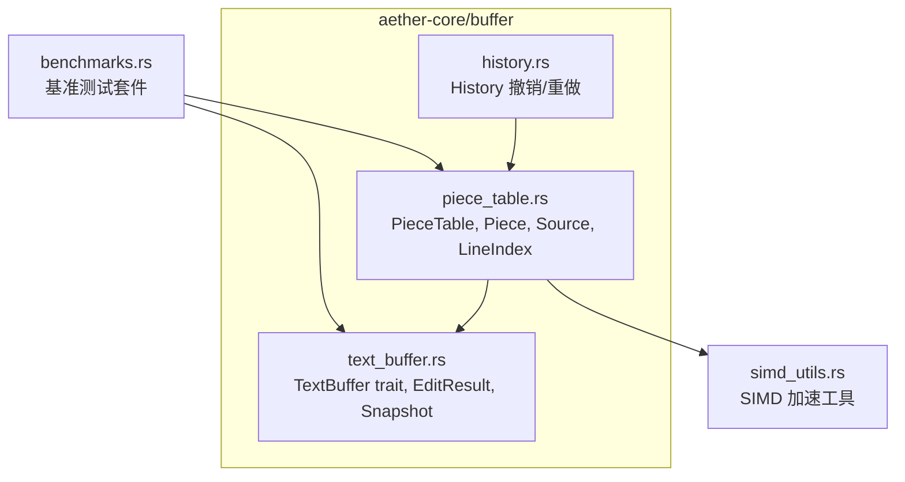
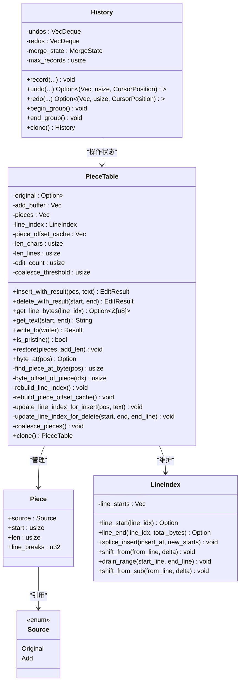
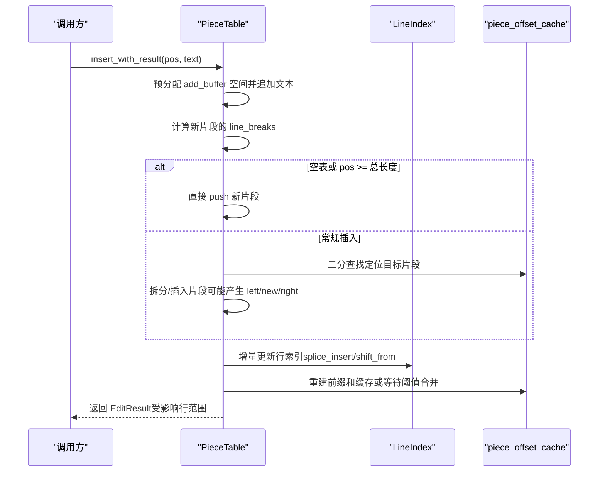
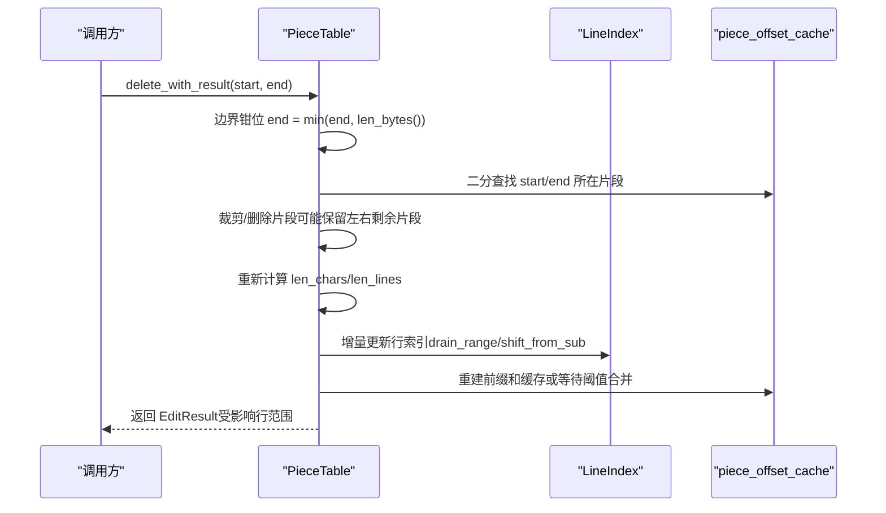
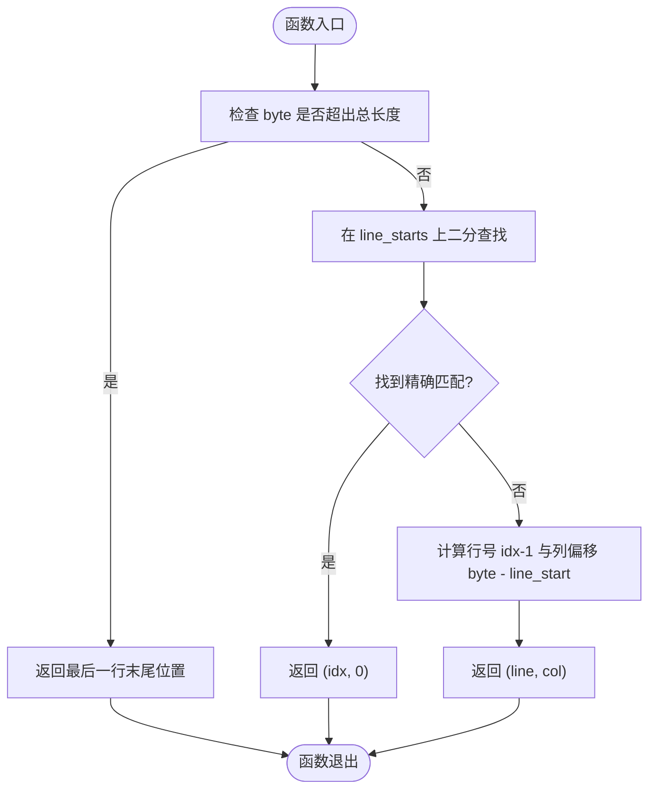
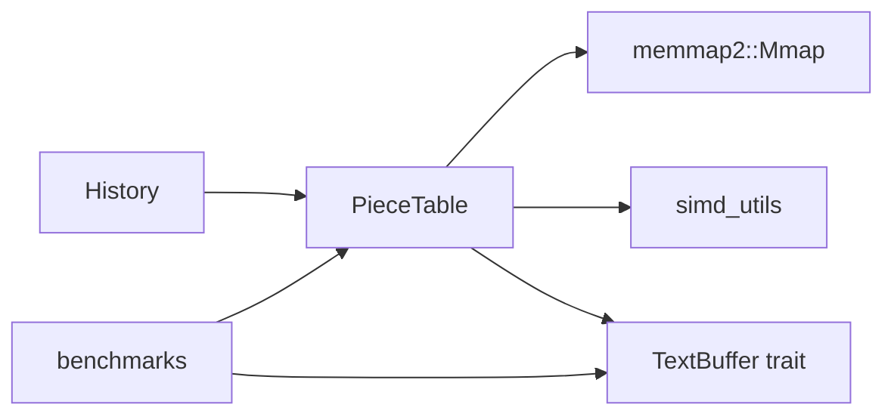

# Piece Table 数据结构

<cite>
**本文引用的文件**
- [crates/aether-core/src/buffer/piece_table.rs](file://crates/aether-core/src/buffer/piece_table.rs)
- [crates/aether-core/src/buffer/text_buffer.rs](file://crates/aether-core/src/buffer/text_buffer.rs)
- [crates/aether-core/src/buffer/history.rs](file://crates/aether-core/src/buffer/history.rs)
- [crates/aether-core/src/simd_utils.rs](file://crates/aether-core/src/simd_utils.rs)
- [crates/aether-core/src/benchmarks.rs](file://crates/aether-core/src/benchmarks.rs)
</cite>

## 更新摘要
**变更内容**
- 新增 Clone trait 实现章节，详细说明 PieceTable 和 History 的深度克隆机制
- 更新核心组件章节，反映 Clone 实现的内存管理优化
- 增强架构总览图，展示 Clone 操作的数据流
- 补充性能考量章节中关于克隆操作的内存效率分析
- 更新使用示例，展示 Clone 的实际应用场景

## 目录
1. [简介](#简介)
2. [项目结构](#项目结构)
3. [核心组件](#核心组件)
4. [Clone 特性实现](#clone-特性实现)
5. [架构总览](#架构总览)
6. [详细组件分析](#详细组件分析)
7. [依赖关系分析](#依赖关系分析)
8. [性能考量](#性能考量)
9. [故障排查指南](#故障排查指南)
10. [结论](#结论)
11. [附录：使用示例与最佳实践](#附录使用示例与最佳实践)

## 简介
本技术文档围绕 Piece Table 数据结构展开，系统性阐述其设计原理、关键算法与工程实现。Piece Table 通过"原始缓冲区 + 追加缓冲区"的双缓冲模型，结合有序片段表（pieces）与前缀和缓存，实现了高效的 O(1) 插入/删除语义（在片段层面），并借助内存映射与零拷贝路径优化大文件打开与读取。同时，行索引 LineIndex 提供 O(1)/O(log n) 的行号与字节偏移互转能力，配合增量更新策略，使编辑后的渲染与定位保持高性能。**最新改进**：PieceTable 和 History 结构体现在实现了 Clone trait，支持高效的深度克隆操作，在保持对原始文件映射共享引用的同时，大幅提升了内存管理和调试能力。

## 项目结构
本项目中，Piece Table 位于 aether-core 的 buffer 模块下，并与 TextBuffer trait、History 撤销栈以及 SIMD 工具紧密协作。



**图表来源**
- [crates/aether-core/src/buffer/piece_table.rs:1-120](file://crates/aether-core/src/buffer/piece_table.rs#L1-L120)
- [crates/aether-core/src/buffer/text_buffer.rs:1-60](file://crates/aether-core/src/buffer/text_buffer.rs#L1-L60)
- [crates/aether-core/src/buffer/history.rs:1-80](file://crates/aether-core/src/buffer/history.rs#L1-L80)
- [crates/aether-core/src/simd_utils.rs:1-20](file://crates/aether-core/src/simd_utils.rs#L1-L20)
- [crates/aether-core/src/benchmarks.rs:100-140](file://crates/aether-core/src/benchmarks.rs#L100-L140)

**章节来源**
- [crates/aether-core/src/buffer/mod.rs:1-9](file://crates/aether-core/src/buffer/mod.rs#L1-L9)

## 核心组件
- **PieceTable**：维护 original（可选，Arc<Mmap>）、add_buffer（Vec<u8>）、pieces（有序片段）、line_index（行索引）、piece_offset_cache（前缀和缓存）、len_chars/len_lines/edit_count/coalesce_threshold 等元数据。**现已实现 Clone trait，支持高效深度克隆**。
- **Piece**：描述一个连续字节区间，包含 source（Original/Add）、start、len、line_breaks。
- **Source**：枚举，标识片段来源是 Original 还是 Add。
- **LineIndex**：维护每行起始的全局字节偏移，支持 splice_insert/shift_from/drain_range 等增量操作。
- **TextBuffer trait**：抽象文本缓冲区接口，PieceTable 实现该 trait，并提供不可变快照。
- **History**：基于 Piece 元数据的轻量级撤销/重做，支持撤销组与合并策略。**已实现 Clone trait，支持历史状态的完整复制**。
- **SIMD 工具**：count_newlines_simd/find_byte_simd/skip_whitespace_simd 等，用于加速换行符计数与查找。

**章节来源**
- [crates/aether-core/src/buffer/piece_table.rs:11-56](file://crates/aether-core/src/buffer/piece_table.rs#L11-L56)
- [crates/aether-core/src/buffer/text_buffer.rs:1-49](file://crates/aether-core/src/buffer/text_buffer.rs#L1-L49)
- [crates/aether-core/src/buffer/history.rs:1-76](file://crates/aether-core/src/buffer/history.rs#L1-L76)
- [crates/aether-core/src/simd_utils.rs:6-82](file://crates/aether-core/src/simd_utils.rs#L6-L82)

## Clone 特性实现

### PieceTable Clone 实现
PieceTable 结构体现已实现自定义 Clone trait，提供高效的深度克隆机制：

```rust
impl Clone for PieceTable {
    fn clone(&self) -> Self {
        Self {
            original: self.original.clone(), // Arc<Mmap> 引用计数递增
            add_buffer: self.add_buffer.clone(), // Vec<u8> 深拷贝
            pieces: self.pieces.clone(), // Vec<Piece> 深拷贝
            line_index: LineIndex {
                line_starts: self.line_index.line_starts.clone(), // Vec<usize> 深拷贝
            },
            piece_offset_cache: self.piece_offset_cache.clone(), // Vec<usize> 深拷贝
            len_chars: self.len_chars,
            len_lines: self.len_lines,
            edit_count: self.edit_count,
            coalesce_threshold: self.coalesce_threshold,
        }
    }
}
```

**关键优化点**：
- **original 字段**：通过 Arc<Mmap> 的 clone() 仅增加引用计数，避免大文件内存映射的重复拷贝
- **add_buffer 字段**：执行深拷贝，确保克隆实例拥有独立的追加缓冲区
- **pieces 字段**：深拷贝片段列表，每个 Piece 包含 Copy trait，克隆开销极小
- **line_index 字段**：深拷贝行起始位置数组，保证克隆实例的独立行索引状态

### History Clone 实现
History 结构体使用 `#[derive(Clone, Debug)]` 自动派生 Clone trait：

```rust
#[derive(Clone, Debug)]
pub struct History {
    undos: VecDeque<EditRecord>,
    redos: VecDeque<EditRecord>,
    merge_state: MergeState,
    max_records: usize,
}
```

**继承的 Clone 行为**：
- **undos/redos 栈**：深拷贝整个操作记录队列
- **EditRecord**：包含 prev_pieces（完整的 Piece 列表副本）和 prev_add_len（添加缓冲区长度）
- **merge_state**：浅拷贝合并状态，因为它是 Copy trait 类型

### Clone 操作的内存管理优势

#### 共享引用 vs 深拷贝策略
| 字段 | 克隆策略 | 内存影响 | 性能特点 |
|------|----------|----------|----------|
| original (Arc<Mmap>) | 引用计数递增 | 零额外内存 | O(1) 时间复杂度 |
| add_buffer (Vec<u8>) | 深拷贝 | 线性增长 | O(n) 时间复杂度 |
| pieces (Vec<Piece>) | 深拷贝 | 常数增长 | O(k) 时间复杂度 |
| line_index (Vec<usize>) | 深拷贝 | 线性增长 | O(m) 时间复杂度 |

#### 典型使用场景
1. **调试支持**：创建当前状态的快照用于问题诊断
2. **并发访问**：多个线程安全地访问相同内容的不同版本
3. **撤销/重做**：保存编辑前的完整状态
4. **分支编辑**：支持实验性编辑而不影响主工作区

**章节来源**
- [crates/aether-core/src/buffer/piece_table.rs:37-53](file://crates/aether-core/src/buffer/piece_table.rs#L37-L53)
- [crates/aether-core/src/buffer/history.rs:8-17](file://crates/aether-core/src/buffer/history.rs#L8-L17)

## 架构总览
下图展示了 PieceTable 的核心结构与交互关系，包括双缓冲、片段表、行索引与前缀和缓存，以及新增的 Clone 操作支持。



**图表来源**
- [crates/aether-core/src/buffer/piece_table.rs:11-56](file://crates/aether-core/src/buffer/piece_table.rs#L11-L56)
- [crates/aether-core/src/buffer/piece_table.rs:52-115](file://crates/aether-core/src/buffer/piece_table.rs#L52-L115)
- [crates/aether-core/src/buffer/history.rs:8-17](file://crates/aether-core/src/buffer/history.rs#L8-L17)

## 详细组件分析

### 双缓冲与片段表设计
- **original**：可选 Arc<Mmap>，指向只读原始文件内容，避免大文件加载时的全量拷贝。
- **add_buffer**：只追加不收缩的 Vec<u8>，所有新增内容写入此处，保证 append 的摊销 O(1)。
- **pieces**：按全局字节序排列的片段列表，每个片段指向 original 或 add_buffer 的某段连续区域。
- **Source**：区分片段来源，便于零拷贝访问与保存判断（is_pristine）。

**章节来源**
- [crates/aether-core/src/buffer/piece_table.rs:11-49](file://crates/aether-core/src/buffer/piece_table.rs#L11-L49)

### 行索引 LineIndex 与 O(1)/O(log n) 转换
- **line_starts**：记录每行的起始全局字节偏移。
- **行号到字节范围**：line_start/line_end 提供 O(1) 查询；byte_to_line_col 使用二分查找 O(log n)。
- **增量更新**：insert/delete 后对 line_starts 进行 splice_insert/shift_from/drain_range，避免全量重建。

**章节来源**
- [crates/aether-core/src/buffer/piece_table.rs:52-115](file://crates/aether-core/src/buffer/piece_table.rs#L52-L115)
- [crates/aether-core/src/buffer/piece_table.rs:1469-1481](file://crates/aether-core/src/buffer/piece_table.rs#L1469-L1481)
- [crates/aether-core/src/buffer/piece_table.rs:1249-1266](file://crates/aether-core/src/buffer/piece_table.rs#L1249-L1266)

### 前缀和缓存 piece_offset_cache 与 find_piece_at_byte 优化
- **piece_offset_cache[i]** 表示第 i 个片段的起始全局字节偏移，末尾哨兵为总字节数。
- **len_bytes** 直接取最后一个元素，O(1)。
- **find_piece_at_byte** 优先使用前缀和缓存的二分查找 O(log n)，未构建时回退线性扫描 O(n)。
- **byte_offset_of_piece** 同样利用缓存 O(1) 获取片段起始偏移。

**章节来源**
- [crates/aether-core/src/buffer/piece_table.rs:420-428](file://crates/aether-core/src/buffer/piece_table.rs#L420-L428)
- [crates/aether-core/src/buffer/piece_table.rs:604-652](file://crates/aether-core/src/buffer/piece_table.rs#L604-L652)
- [crates/aether-core/src/buffer/piece_table.rs:698-710](file://crates/aether-core/src/buffer/piece_table.rs#L698-L710)

### O(1) 插入/删除的片段级实现
- **insert_with_result**：将新文本追加到 add_buffer，根据 pos 定位目标片段，必要时拆分片段并在片段表中插入/拼接新片段；随后增量更新行索引与前缀和缓存；达到阈值触发 coalesce_pieces 合并相邻同源片段。
- **delete_with_result**：定位起止片段与局部偏移，裁剪/删除片段，必要时生成左右剩余片段；重新计算 len_chars/len_lines；增量更新行索引与前缀和缓存。
- **注意**：严格意义上的"O(1)"体现在片段层面的插入/删除（片段数量通常远小于文本长度），整体复杂度受片段表规模影响，但通过 coalesce 与前缀和缓存控制常数开销。

**章节来源**
- [crates/aether-core/src/buffer/piece_table.rs:170-282](file://crates/aether-core/src/buffer/piece_table.rs#L170-L282)
- [crates/aether-core/src/buffer/piece_table.rs:289-408](file://crates/aether-core/src/buffer/piece_table.rs#L289-L408)
- [crates/aether-core/src/buffer/piece_table.rs:1483-1516](file://crates/aether-core/src/buffer/piece_table.rs#L1483-L1516)

### 零拷贝读取与 write_to
- **get_line_bytes**：若整行落在单个片段内，返回底层 buffer 切片，零拷贝；跨片段则返回 None，调用方回退到 get_text 拼接。
- **write_to**：遍历片段，直接写出对应 buffer 切片，避免中间 String 分配，适合保存未编辑的大文件。
- **is_pristine**：判断是否仅引用 original，可用于快速路径保存。

**章节来源**
- [crates/aether-core/src/buffer/piece_table.rs:430-514](file://crates/aether-core/src/buffer/piece_table.rs#L430-L514)

### 内存映射与快照
- **from_file**：使用 memmap2::Mmap 映射原始文件，original 字段为 Arc<Mmap>，多份快照共享同一映射，避免重复拷贝。
- **create_snapshot**：构造 PieceTableSnapshot，克隆 Arc<Mmap> 与 pieces，add_buffer 以 Arc<Vec<u8>> 共享（当前仍需克隆内容，注释指出后续可进一步优化）。

**章节来源**
- [crates/aether-core/src/buffer/piece_table.rs:143-168](file://crates/aether-core/src/buffer/piece_table.rs#L143-L168)
- [crates/aether-core/src/buffer/piece_table.rs:1062-1104](file://crates/aether-core/src/buffer/piece_table.rs#L1062-L1104)
- [crates/aether-core/src/buffer/piece_table.rs:1268-1279](file://crates/aether-core/src/buffer/piece_table.rs#L1268-L1279)

### 行索引重建与增量更新
- **rebuild_line_index**：遍历所有片段，使用 SIMD 加速查找换行符，构建 line_starts，并同步重建前缀和缓存。
- **update_line_index_for_insert/update_line_index_for_delete**：在插入/删除后，对 line_starts 执行增量调整（移位、插入、删除），避免全量重建。

**章节来源**
- [crates/aether-core/src/buffer/piece_table.rs:666-696](file://crates/aether-core/src/buffer/piece_table.rs#L666-L696)
- [crates/aether-core/src/buffer/piece_table.rs:712-780](file://crates/aether-core/src/buffer/piece_table.rs#L712-L780)
- [crates/aether-core/src/simd_utils.rs:84-171](file://crates/aether-core/src/simd_utils.rs#L84-L171)

### 撤销/重做 History 与 Piece 元数据
- **History** 记录每次编辑前的 pieces 状态与 add_buffer 长度，支持撤销组（begin_group/end_group）与合并策略（相同位置快速连续输入合并）。
- **undo/redo** 返回 prev_pieces 与光标位置，上层据此恢复 PieceTable 状态。
- **Clone 支持**：History 的 Clone 实现允许完整复制撤销/重做状态，便于调试和状态检查。

**章节来源**
- [crates/aether-core/src/buffer/history.rs:1-76](file://crates/aether-core/src/buffer/history.rs#L1-L76)
- [crates/aether-core/src/buffer/history.rs:101-200](file://crates/aether-core/src/buffer/history.rs#L101-L200)
- [crates/aether-core/src/buffer/history.rs:202-312](file://crates/aether-core/src/buffer/history.rs#L202-L312)

### TextBuffer trait 集成
- **PieceTable** 实现 TextBuffer trait，暴露统一的插入/删除/切片/行操作接口，并支持创建不可变快照。
- **行号与列号转换**使用 line_index 与二分查找，确保高效。

**章节来源**
- [crates/aether-core/src/buffer/text_buffer.rs:1-49](file://crates/aether-core/src/buffer/text_buffer.rs#L1-L49)
- [crates/aether-core/src/buffer/piece_table.rs:1179-1308](file://crates/aether-core/src/buffer/piece_table.rs#L1179-L1308)

### 关键流程时序图

#### 插入流程（insert_with_result）


**图表来源**
- [crates/aether-core/src/buffer/piece_table.rs:170-282](file://crates/aether-core/src/buffer/piece_table.rs#L170-L282)
- [crates/aether-core/src/buffer/piece_table.rs:604-652](file://crates/aether-core/src/buffer/piece_table.rs#L604-L652)
- [crates/aether-core/src/buffer/piece_table.rs:712-744](file://crates/aether-core/src/buffer/piece_table.rs#L712-L744)

#### 删除流程（delete_with_result）


**图表来源**
- [crates/aether-core/src/buffer/piece_table.rs:289-408](file://crates/aether-core/src/buffer/piece_table.rs#L289-L408)
- [crates/aether-core/src/buffer/piece_table.rs:746-780](file://crates/aether-core/src/buffer/piece_table.rs#L746-L780)

#### 行号与字节偏移转换（byte_to_line_col）


**图表来源**
- [crates/aether-core/src/buffer/piece_table.rs:1249-1266](file://crates/aether-core/src/buffer/piece_table.rs#L1249-L1266)

## 依赖关系分析
- **PieceTable** 依赖 memmap2::Mmap 实现内存映射，依赖 simd_utils 提供的 SIMD 工具加速换行符处理。
- **TextBuffer trait** 定义统一接口，History 依赖 Piece 元数据进行撤销/重做。
- **benchmarks** 模块对 PieceTable 的关键路径进行性能评估。



**图表来源**
- [crates/aether-core/src/buffer/piece_table.rs:1-10](file://crates/aether-core/src/buffer/piece_table.rs#L1-L10)
- [crates/aether-core/src/buffer/text_buffer.rs:1-49](file://crates/aether-core/src/buffer/text_buffer.rs#L1-L49)
- [crates/aether-core/src/buffer/history.rs:1-20](file://crates/aether-core/src/buffer/history.rs#L1-L20)
- [crates/aether-core/src/benchmarks.rs:100-140](file://crates/aether-core/src/benchmarks.rs#L100-L140)

**章节来源**
- [crates/aether-core/src/buffer/piece_table.rs:1-10](file://crates/aether-core/src/buffer/piece_table.rs#L1-L10)
- [crates/aether-core/src/buffer/text_buffer.rs:1-49](file://crates/aether-core/src/buffer/text_buffer.rs#L1-L49)
- [crates/aether-core/src/buffer/history.rs:1-20](file://crates/aether-core/src/buffer/history.rs#L1-L20)
- [crates/aether-core/src/benchmarks.rs:100-140](file://crates/aether-core/src/benchmarks.rs#L100-L140)

## 性能考量
- **插入/删除**：片段级操作接近 O(1)，实际成本受片段表规模与缓存命中影响；通过 coalesce_threshold 定期合并相邻同源片段，降低碎片数量。
- **行索引**：rebuild_line_index 使用 SIMD 加速换行符查找，增量更新避免全量重建；byte_to_line_col 使用二分查找 O(log n)。
- **前缀和缓存**：piece_offset_cache 使 len_bytes 与 find_piece_at_byte 达到 O(1)/O(log n)，显著减少线性扫描。
- **零拷贝**：get_line_bytes 与 write_to 在单片段命中时避免堆分配；from_file 使用内存映射避免大文件拷贝。
- **Clone 操作**：
  - **original 字段**：Arc<Mmap> 克隆为 O(1) 引用计数操作，无额外内存开销
  - **add_buffer 字段**：深拷贝为 O(n) 操作，但仅在需要独立副本时使用
  - **pieces 字段**：深拷贝为 O(k) 操作，k 为片段数量，通常远小于文本长度
  - **line_index 字段**：深拷贝为 O(m) 操作，m 为行数
- **基准测试**：benchmarks 提供了多项场景的性能测量，包括加载、插入、删除、行读取、全文读取、快照创建与编辑吞吐。

**章节来源**
- [crates/aether-core/src/buffer/piece_table.rs:420-428](file://crates/aether-core/src/buffer/piece_table.rs#L420-L428)
- [crates/aether-core/src/buffer/piece_table.rs:604-652](file://crates/aether-core/src/buffer/piece_table.rs#L604-L652)
- [crates/aether-core/src/buffer/piece_table.rs:666-696](file://crates/aether-core/src/buffer/piece_table.rs#L666-L696)
- [crates/aether-core/src/buffer/piece_table.rs:430-514](file://crates/aether-core/src/buffer/piece_table.rs#L430-L514)
- [crates/aether-core/src/benchmarks.rs:108-228](file://crates/aether-core/src/benchmarks.rs#L108-L228)

## 故障排查指南
- **行索引一致性**：删除跨行文本后，行索引应与重建结果一致；测试用例验证了这一点。
- **边界钳位**：delete_with_result 对 end 进行钳位，防止越界导致数据损坏。
- **跨片段读取**：get_line_bytes 返回 None 表示跨片段无法零拷贝，应回退到 get_text 拼接，避免静默返回空数据。
- **状态恢复校验**：restore_state_checked 对反序列化的 pieces 进行严格边界校验，任何非法值都会放弃恢复，避免后续访问越界 panic。
- **历史合并策略**：History 的合并窗口与撤销组行为会影响撤销粒度，需关注 begin_group/end_group 的使用。
- **Clone 操作内存泄漏**：确保正确释放克隆实例，特别是包含大文件的 Arc<Mmap> 引用。

**章节来源**
- [crates/aether-core/src/buffer/piece_table.rs:843-868](file://crates/aether-core/src/buffer/piece_table.rs#L843-L868)
- [crates/aether-core/src/buffer/piece_table.rs:289-298](file://crates/aether-core/src/buffer/piece_table.rs#L289-L298)
- [crates/aether-core/src/buffer/piece_table.rs:438-461](file://crates/aether-core/src/buffer/piece_table.rs#L438-L461)
- [crates/aether-core/src/buffer/piece_table.rs:1310-1467](file://crates/aether-core/src/buffer/piece_table.rs#L1310-L1467)
- [crates/aether-core/src/buffer/history.rs:88-99](file://crates/aether-core/src/buffer/history.rs#L88-L99)

## 结论
Piece Table 通过双缓冲与片段表的设计，结合行索引与前缀和缓存，实现了高效的文本编辑与读取。内存映射与零拷贝路径进一步提升了大文件处理的性能。**最新的 Clone trait 实现**为 PieceTable 和 History 结构体提供了强大的深度克隆能力，在保持对原始文件映射共享引用的同时，大幅改善了内存管理和调试体验。History 与 TextBuffer trait 的集成使得编辑器具备完整的撤销/重做与统一接口能力。通过合理的阈值合并与增量更新策略，系统在大规模编辑场景下仍能保持良好性能。

## 附录：使用示例与最佳实践

### 创建与基本操作
- **从字符串创建**：适用于新文件或测试场景。
- **从文件创建**：使用内存映射，适合大文件打开。
- **插入/删除**：使用 insert_with_result/delete_with_result 获取受影响行范围，便于 UI 增量刷新。
- **读取行/全文**：优先使用 get_line_bytes 零拷贝路径，跨片段时回退到 get_text。

**章节来源**
- [crates/aether-core/src/buffer/piece_table.rs:118-168](file://crates/aether-core/src/buffer/piece_table.rs#L118-L168)
- [crates/aether-core/src/buffer/piece_table.rs:170-282](file://crates/aether-core/src/buffer/piece_table.rs#L170-L282)
- [crates/aether-core/src/buffer/piece_table.rs:289-408](file://crates/aether-core/src/buffer/piece_table.rs#L289-L408)
- [crates/aether-core/src/buffer/piece_table.rs:430-514](file://crates/aether-core/src/buffer/piece_table.rs#L430-L514)

### Clone 操作的最佳实践

#### 调试与诊断
```rust
// 创建状态快照用于调试
let snapshot = pt.clone();
// 执行可能出错的编辑操作
pt.insert(100, "test");
// 比较快照与实际状态
assert_eq!(snapshot.get_all_text(), "original content");
```

#### 并发访问模式
```rust
// 多线程安全访问
let shared_pt = Arc::new(pt);
let cloned_for_thread = shared_pt.clone();
// 线程可以安全地读取克隆实例
```

#### 撤销/重做状态管理
```rust
// 保存编辑前的完整状态
let history_snapshot = history.clone();
// 执行编辑操作
pt.insert(0, "new content");
// 需要时可以恢复到历史状态
*history = history_snapshot;
```

**章节来源**
- [crates/aether-core/src/buffer/piece_table.rs:37-53](file://crates/aether-core/src/buffer/piece_table.rs#L37-L53)
- [crates/aether-core/src/buffer/history.rs:8-17](file://crates/aether-core/src/buffer/history.rs#L8-L17)

### 与 History 集成
- **在每次编辑完成后**，记录编辑前的 pieces 与 add_buffer 长度，以及光标前后位置。
- **使用 begin_group/end_group** 包裹一组相关操作，实现原子撤销。
- **undo/redo** 返回的状态可直接用于恢复 PieceTable。
- **Clone 支持**：History 的 Clone 实现允许完整复制撤销/重做状态。

**章节来源**
- [crates/aether-core/src/buffer/history.rs:101-200](file://crates/aether-core/src/buffer/history.rs#L101-L200)
- [crates/aether-core/src/buffer/history.rs:202-312](file://crates/aether-core/src/buffer/history.rs#L202-L312)

### 与 TextBuffer trait 集成
- **通过 TextBuffer trait** 统一接口，上层代码无需关心具体数据结构。
- **支持创建不可变快照**，供后台线程安全访问。

**章节来源**
- [crates/aether-core/src/buffer/text_buffer.rs:1-49](file://crates/aether-core/src/buffer/text_buffer.rs#L1-L49)
- [crates/aether-core/src/buffer/piece_table.rs:1179-1308](file://crates/aether-core/src/buffer/piece_table.rs#L1179-L1308)

### 性能调优建议
- **合理设置 coalesce_threshold**，平衡碎片数量与合并开销。
- **频繁批量编辑时**，尽量合并多次小操作，减少片段表膨胀。
- **使用 get_line_bytes 与 write_to** 的零拷贝路径，避免不必要的 String 分配。
- **对于大文件**，优先使用 from_file 与内存映射，减少初始加载时间。
- **谨慎使用 Clone 操作**：仅在必要时克隆，避免频繁的深拷贝操作。
- **利用 Arc<Mmap> 的优势**：克隆包含内存映射的 PieceTable 实例时，original 字段的克隆开销极小。

**章节来源**
- [crates/aether-core/src/buffer/piece_table.rs:1483-1516](file://crates/aether-core/src/buffer/piece_table.rs#L1483-L1516)
- [crates/aether-core/src/buffer/piece_table.rs:430-514](file://crates/aether-core/src/buffer/piece_table.rs#L430-L514)
- [crates/aether-core/src/buffer/piece_table.rs:143-168](file://crates/aether-core/src/buffer/piece_table.rs#L143-L168)
- [crates/aether-core/src/buffer/piece_table.rs:37-53](file://crates/aether-core/src/buffer/piece_table.rs#L37-L53)

### 常见问题解决方案
- **行索引不一致**：确认 delete_with_result 的 end_line 计算在修改 pieces 前完成，并使用增量更新而非全量重建。
- **跨片段读取为空**：检查 get_line_bytes 返回值，None 时应回退到 get_text。
- **状态恢复失败**：查看 restore_state_checked 的错误信息，确保 pieces_data 与 add_buffer_len 合法。
- **撤销组行为异常**：确认 begin_group/end_group 正确配对，且组内记录不被合并。
- **Clone 操作内存不足**：监控 add_buffer 和 line_index 的深拷贝开销，考虑使用更频繁的垃圾回收。
- **Arc<Mmap> 引用计数异常**：确保所有克隆实例都正确释放，避免内存映射长时间驻留内存。

**章节来源**
- [crates/aether-core/src/buffer/piece_table.rs:746-780](file://crates/aether-core/src/buffer/piece_table.rs#L746-L780)
- [crates/aether-core/src/buffer/piece_table.rs:438-461](file://crates/aether-core/src/buffer/piece_table.rs#L438-L461)
- [crates/aether-core/src/buffer/piece_table.rs:1310-1467](file://crates/aether-core/src/buffer/piece_table.rs#L1310-L1467)
- [crates/aether-core/src/buffer/history.rs:88-99](file://crates/aether-core/src/buffer/history.rs#L88-L99)
- [crates/aether-core/src/buffer/piece_table.rs:37-53](file://crates/aether-core/src/buffer/piece_table.rs#L37-L53)