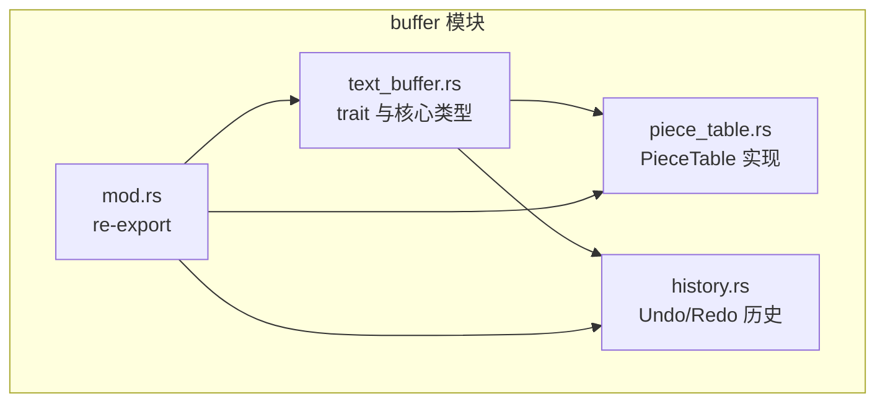
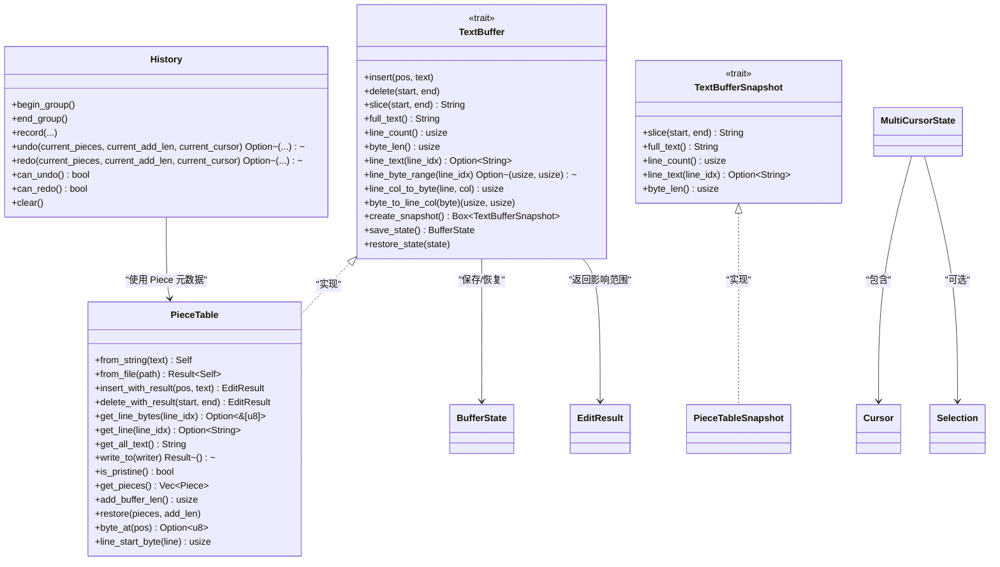
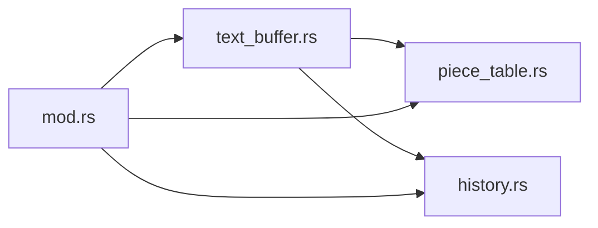

# TextBuffer 接口设计

<cite>
**本文引用的文件**   
- [text_buffer.rs](file://crates/aether-core/src/buffer/text_buffer.rs)
- [piece_table.rs](file://crates/aether-core/src/buffer/piece_table.rs)
- [mod.rs](file://crates/aether-core/src/buffer/mod.rs)
- [history.rs](file://crates/aether-core/src/buffer/history.rs)
</cite>

## 目录
1. [简介](#简介)
2. [项目结构](#项目结构)
3. [核心组件](#核心组件)
4. [架构总览](#架构总览)
5. [详细组件分析](#详细组件分析)
6. [依赖关系分析](#依赖关系分析)
7. [性能考量](#性能考量)
8. [故障排查指南](#故障排查指南)
9. [结论](#结论)
10. [附录：实现与使用示例路径](#附录实现与使用示例路径)

## 简介
本文件围绕 TextBuffer trait 的统一文本缓冲接口进行系统化技术文档化，重点覆盖以下方面：
- 统一抽象：基于字节偏移的编辑、读取、行列转换、快照与状态保存/恢复。
- 状态管理：BufferState 轻量元数据快照，用于 Undo/Redo 与持久化。
- 结果封装：EditResult 精确描述受影响的行范围与行数变化，驱动行级缓存失效。
- 多光标与选择：MultiCursorState、Selection、Cursor 的数据结构与算法约定。
- 并发安全：Send + Sync 约束与不可变快照机制。
- PieceTable 集成：具体实现细节、扩展点与优化策略（前缀和缓存、增量行索引、合并碎片）。
- 错误处理与边界保护：越界钳位、校验恢复、跨 piece 回退等。

## 项目结构
该模块位于 aether-core 的 buffer 子模块中，包含三个关键文件：
- text_buffer.rs：定义 TextBuffer、TextBufferSnapshot、BufferState、Cursor、Selection、EditResult、MultiCursorState 等核心类型与 trait。
- piece_table.rs：PieceTable 高性能文本缓冲区的具体实现，并实现 TextBuffer 与 TextBufferSnapshot。
- history.rs：基于 Piece 元数据的撤销/重做历史管理，支持撤销组与合并策略。
- mod.rs：对外重新导出公共类型。

图表来源
- [mod.rs:1-9](file://crates/aether-core/src/buffer/mod.rs#L1-L9)
- [text_buffer.rs:1-49](file://crates/aether-core/src/buffer/text_buffer.rs#L1-L49)
- [piece_table.rs:1059-1105](file://crates/aether-core/src/buffer/piece_table.rs#L1059-L1105)
- [history.rs:1-16](file://crates/aether-core/src/buffer/history.rs#L1-L16)

章节来源
- [mod.rs:1-9](file://crates/aether-core/src/buffer/mod.rs#L1-L9)

## 核心组件
本节概述 TextBuffer 接口及其相关类型的职责与设计要点。

- TextBuffer trait
  - 所有操作基于字节偏移；行号从 0 开始；提供插入、删除、切片、全量文本、行信息、行列转换、快照、状态保存/恢复等方法。
  - Send + Sync 约束确保可在多线程环境中共享。
- TextBufferSnapshot trait
  - 不可变快照接口，供后台线程安全读取，无需锁。
- BufferState
  - 轻量元数据快照，序列化 pieces 元数据与长度信息，用于 Undo/Redo 或持久化。
- Cursor / Selection
  - 光标位置与选择区域，支持规范化与空选判断。
- EditResult
  - 记录受影响的行范围与行数变化，便于行级缓存失效计算。
- MultiCursorState
  - 多光标与选择集合，维护主光标索引并提供列选择模式辅助方法。

章节来源
- [text_buffer.rs:1-172](file://crates/aether-core/src/buffer/text_buffer.rs#L1-L172)
- [text_buffer.rs:174-258](file://crates/aether-core/src/buffer/text_buffer.rs#L174-L258)

## 架构总览
TextBuffer 作为统一抽象层，上层 UI、LSP、渲染等通过 trait 访问文本内容，而不关心底层数据结构。当前采用 PieceTable 作为默认实现，具备 O(1) 插入/删除、零拷贝大文件打开、增量行索引与前缀和缓存等特性。History 模块在外部以 Piece 元数据为粒度记录撤销/重做，避免复制全文。

图表来源
- [text_buffer.rs:1-49](file://crates/aether-core/src/buffer/text_buffer.rs#L1-L49)
- [text_buffer.rs:51-70](file://crates/aether-core/src/buffer/text_buffer.rs#L51-L70)
- [text_buffer.rs:124-172](file://crates/aether-core/src/buffer/text_buffer.rs#L124-L172)
- [text_buffer.rs:174-258](file://crates/aether-core/src/buffer/text_buffer.rs#L174-L258)
- [piece_table.rs:1179-1308](file://crates/aether-core/src/buffer/piece_table.rs#L1179-L1308)
- [piece_table.rs:1062-1104](file://crates/aether-core/src/buffer/piece_table.rs#L1062-L1104)
- [history.rs:1-16](file://crates/aether-core/src/buffer/history.rs#L1-L16)

## 详细组件分析

### TextBuffer trait 语义约定与并发保证
- 语义约定
  - 所有位置参数均为字节偏移，非字符索引；行号从 0 开始。
  - insert/delete 不返回结果，但内部可结合 EditResult 用于行级缓存失效（见 PieceTable 的 with_result 系列方法）。
  - line_text 返回不含换行符的行文本；line_byte_range 返回 [start, end)。
  - line_col_to_byte 将行号+列号转换为字节偏移；byte_to_line_col 反向转换。
  - create_snapshot 返回不可变快照，供后台线程安全读取。
  - save_state/restore_state 用于 Undo/Redo 与持久化。
- 并发安全
  - trait 要求 Send + Sync，允许跨线程共享与并发访问。
  - 不可变快照无写操作，适合后台线程只读场景。

章节来源
- [text_buffer.rs:1-49](file://crates/aether-core/src/buffer/text_buffer.rs#L1-L49)

### BufferState 状态管理与恢复策略
- 设计目标
  - 仅保存 pieces 元数据与长度信息，避免复制全文，降低内存与时间开销。
- 恢复流程
  - 反序列化后严格校验每个 piece 的 source/start/len/line_breaks 与边界，任何异常均放弃恢复，保留当前状态。
  - 交叉校验 add_buffer_len 与 byte_len，防止损坏状态导致后续越界。
- 适用场景
  - Undo/Redo 快速切换；持久化时存储轻量状态。

章节来源
- [text_buffer.rs:61-81](file://crates/aether-core/src/buffer/text_buffer.rs#L61-L81)
- [piece_table.rs:1281-1308](file://crates/aether-core/src/buffer/piece_table.rs#L1281-L1308)
- [piece_table.rs:1310-1467](file://crates/aether-core/src/buffer/piece_table.rs#L1310-L1467)

### EditResult 编辑结果封装与行级失效
- 字段含义
  - start_line/end_line：受影响的最小行范围（闭区间）。
  - line_delta：行数变化（正增负减），用于更新行计数与滚动/布局。
- 合并策略
  - merge 对批量操作进行范围与 delta 的合并，减少多次失效计算。
- 使用建议
  - 在 UI 层根据 start_line/end_line 精准失效对应行缓存，提升渲染性能。

章节来源
- [text_buffer.rs:142-172](file://crates/aether-core/src/buffer/text_buffer.rs#L142-L172)

### 多光标与选择区域管理
- 数据结构
  - Cursor：行号与列号（字节列）。
  - Selection：起始与结束光标，支持 is_empty 与 normalized 规范化。
  - MultiCursorState：维护 cursors、selections 与 primary_cursor，提供添加光标、清除次光标、列选择模式等能力。
- 算法要点
  - primary_idx 钳位到合法范围，避免非法设置导致越界 panic。
  - add_column_cursors 生成矩形选区的光标序列，并进入列选择模式。
  - clear_secondary_cursors 保留主光标与其选择，移除其余。
- 并发与一致性
  - 多光标状态通常由 UI 层持有，读写需遵循单线程模型或使用同步原语保护。

章节来源
- [text_buffer.rs:83-122](file://crates/aether-core/src/buffer/text_buffer.rs#L83-L122)
- [text_buffer.rs:174-258](file://crates/aether-core/src/buffer/text_buffer.rs#L174-L258)

### 光标位置转换逻辑
- line_col_to_byte
  - 基于行索引获取行起止字节，考虑 CRLF/LF 差异，按列号钳位到行内有效范围。
- byte_to_line_col
  - 使用行索引二分查找定位行号，计算列号为字节偏移减去行起始。
  - 末尾光标合法：当 byte >= total_bytes 时返回最后一行末尾位置。

章节来源
- [piece_table.rs:1212-1266](file://crates/aether-core/src/buffer/piece_table.rs#L1212-L1266)

### 不可变快照机制
- 设计目标
  - 后台线程安全读取，避免锁竞争与大文件拷贝。
- 实现要点
  - PieceTableSnapshot 持有 pieces 副本与 Arc<Vec<u8>> 追加缓冲，original 通过 Arc<Mmap> 共享，实现零拷贝。
  - 提供 slice/full_text/line_count/line_text/byte_len 等只读接口。
- 创建方式
  - TextBuffer::create_snapshot 返回 Box<dyn TextBufferSnapshot>，调用方按需消费。

章节来源
- [text_buffer.rs:51-59](file://crates/aether-core/src/buffer/text_buffer.rs#L51-L59)
- [piece_table.rs:1062-1104](file://crates/aether-core/src/buffer/piece_table.rs#L1062-L1104)
- [piece_table.rs:1268-1279](file://crates/aether-core/src/buffer/piece_table.rs#L1268-L1279)

### 与 PieceTable 的具体集成与扩展点
- 集成方式
  - PieceTable 实现 TextBuffer 与 TextBufferSnapshot，提供 from_string/from_file 构造，支持内存映射大文件。
  - 提供 insert_with_result/delete_with_result 返回 EditResult，便于行级失效。
- 扩展点
  - 新增自定义 TextBuffer 实现（如 Rope）只需实现 trait 方法。
  - 可通过调整 coalesce_threshold 控制碎片合并频率，平衡内存与性能。
  - 行索引重建与增量更新策略可按需优化。

章节来源
- [piece_table.rs:1179-1308](file://crates/aether-core/src/buffer/piece_table.rs#L1179-L1308)
- [piece_table.rs:117-168](file://crates/aether-core/src/buffer/piece_table.rs#L117-L168)

### 撤销/重做历史（History）
- 设计目标
  - 基于 Piece 元数据的高效撤销/重做，避免复制全文。
- 功能特性
  - 撤销组：begin_group/end_group 包裹的操作在 undo 时一次性撤销。
  - 合并策略：连续同位置插入/删除在短时间窗口内合并为一条记录。
  - 限制大小：VecDeque 维护最大记录数，O(1) 淘汰旧记录。
- 使用建议
  - 在每次编辑完成后调用 record，传入编辑前的 pieces 与 add_buffer 长度、光标前后位置。
  - undo/redo 返回前一次状态的 pieces 与 add_buffer 长度，以便恢复。

章节来源
- [history.rs:1-16](file://crates/aether-core/src/buffer/history.rs#L1-L16)
- [history.rs:78-200](file://crates/aether-core/src/buffer/history.rs#L78-L200)
- [history.rs:202-327](file://crates/aether-core/src/buffer/history.rs#L202-L327)

## 依赖关系分析
- 模块内依赖
  - text_buffer.rs 定义公共 trait 与类型，被 piece_table.rs 与 history.rs 引用。
  - piece_table.rs 实现 TextBuffer 与 TextBufferSnapshot，并使用 simd_utils 加速换行符查找。
  - history.rs 依赖 Piece 元数据进行撤销/重做。
- 对外暴露
  - mod.rs re-export 主要类型，简化上层导入。

图表来源
- [mod.rs:1-9](file://crates/aether-core/src/buffer/mod.rs#L1-L9)
- [text_buffer.rs:1-49](file://crates/aether-core/src/buffer/text_buffer.rs#L1-L49)
- [piece_table.rs:1059-1105](file://crates/aether-core/src/buffer/piece_table.rs#L1059-L1105)
- [history.rs:1-16](file://crates/aether-core/src/buffer/history.rs#L1-L16)

章节来源
- [mod.rs:1-9](file://crates/aether-core/src/buffer/mod.rs#L1-L9)

## 性能考量
- 零拷贝与内存映射
  - 大文件通过 memmap2 内存映射，original 使用 Arc<Mmap> 共享，避免全量拷贝。
- 前缀和缓存
  - piece_offset_cache 提供 O(1) 获取总字节数与 O(log n) 定位 piece，显著优于线性扫描。
- 增量行索引
  - update_line_index_for_insert/update_line_index_for_delete 局部更新行起始，避免全量重建。
- 碎片合并
  - 达到阈值后合并相邻 Add 片段，减少碎片数量，提高读取性能。
- 行读取优化
  - get_line_bytes 优先零拷贝路径，跨 piece 时回退拼接，避免静默返回空数据。

章节来源
- [piece_table.rs:420-461](file://crates/aether-core/src/buffer/piece_table.rs#L420-L461)
- [piece_table.rs:666-710](file://crates/aether-core/src/buffer/piece_table.rs#L666-L710)
- [piece_table.rs:712-781](file://crates/aether-core/src/buffer/piece_table.rs#L712-L781)
- [piece_table.rs:1483-1516](file://crates/aether-core/src/buffer/piece_table.rs#L1483-L1516)

## 故障排查指南
- 常见越界与边界问题
  - delete 的 end 超出缓冲区长度会被钳位，避免数据损坏。
  - byte_to_line_col 在末尾光标处返回最后一行末尾位置，符合预期。
  - find_piece_at_byte 在空表时返回 0，避免越界 panic。
- 恢复失败处理
  - restore_state_checked 对 pieces_data 长度、source/start/len/line_breaks 与边界进行严格校验，失败则放弃恢复并打印错误日志。
- 跨 piece 读取回退
  - get_line_bytes 返回 None 表示跨 piece，调用方应回退到 get_text 拼接，避免返回空字符串。

章节来源
- [piece_table.rs:289-308](file://crates/aether-core/src/buffer/piece_table.rs#L289-L308)
- [piece_table.rs:1249-1266](file://crates/aether-core/src/buffer/piece_table.rs#L1249-L1266)
- [piece_table.rs:604-641](file://crates/aether-core/src/buffer/piece_table.rs#L604-L641)
- [piece_table.rs:432-461](file://crates/aether-core/src/buffer/piece_table.rs#L432-L461)
- [piece_table.rs:1298-1308](file://crates/aether-core/src/buffer/piece_table.rs#L1298-L1308)

## 结论
TextBuffer trait 提供了统一的文本缓冲抽象，屏蔽了底层数据结构差异，并通过 BufferState、EditResult、不可变快照等机制实现了高效的撤销/重做、行级失效与并发安全读取。PieceTable 作为高性能实现，结合内存映射、前缀和缓存、增量行索引与碎片合并，满足大文件与高频编辑场景的需求。History 模块以 Piece 元数据为粒度，进一步降低了撤销/重做的内存与时间成本。整体设计具备良好的可扩展性与工程实践价值。

## 附录：实现与使用示例路径
- 自定义 TextBuffer 实现
  - 参考 Trait 方法与 PieceTable 实现，实现 insert/delete/slice/full_text/line_* 等接口，并实现 create_snapshot/save_state/restore_state。
  - 示例路径：[text_buffer.rs:1-49](file://crates/aether-core/src/buffer/text_buffer.rs#L1-L49)、[piece_table.rs:1179-1308](file://crates/aether-core/src/buffer/piece_table.rs#L1179-L1308)
- 使用快照功能
  - 通过 TextBuffer::create_snapshot 获取不可变快照，在后台线程读取文本或执行分析任务。
  - 示例路径：[piece_table.rs:1268-1279](file://crates/aether-core/src/buffer/piece_table.rs#L1268-L1279)
- 多光标编辑场景
  - 使用 MultiCursorState 管理多个光标与选择区域，配合 Selection::normalized 与列选择模式。
  - 示例路径：[text_buffer.rs:174-258](file://crates/aether-core/src/buffer/text_buffer.rs#L174-L258)
- 撤销/重做集成
  - 在每次编辑后调用 History::record，使用 begin_group/end_group 组织复杂操作，并在需要时调用 undo/redo。
  - 示例路径：[history.rs:78-200](file://crates/aether-core/src/buffer/history.rs#L78-L200)、[history.rs:202-327](file://crates/aether-core/src/buffer/history.rs#L202-L327)