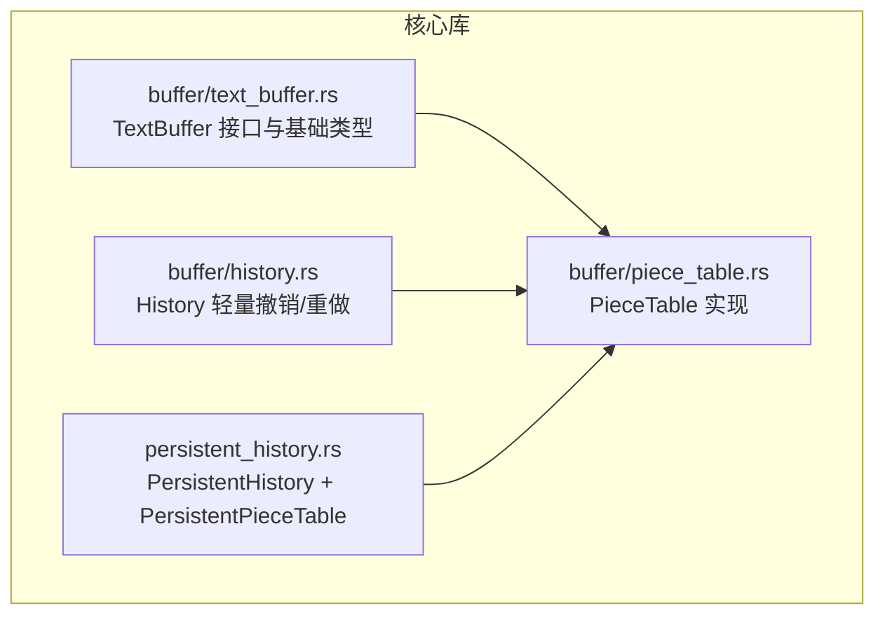
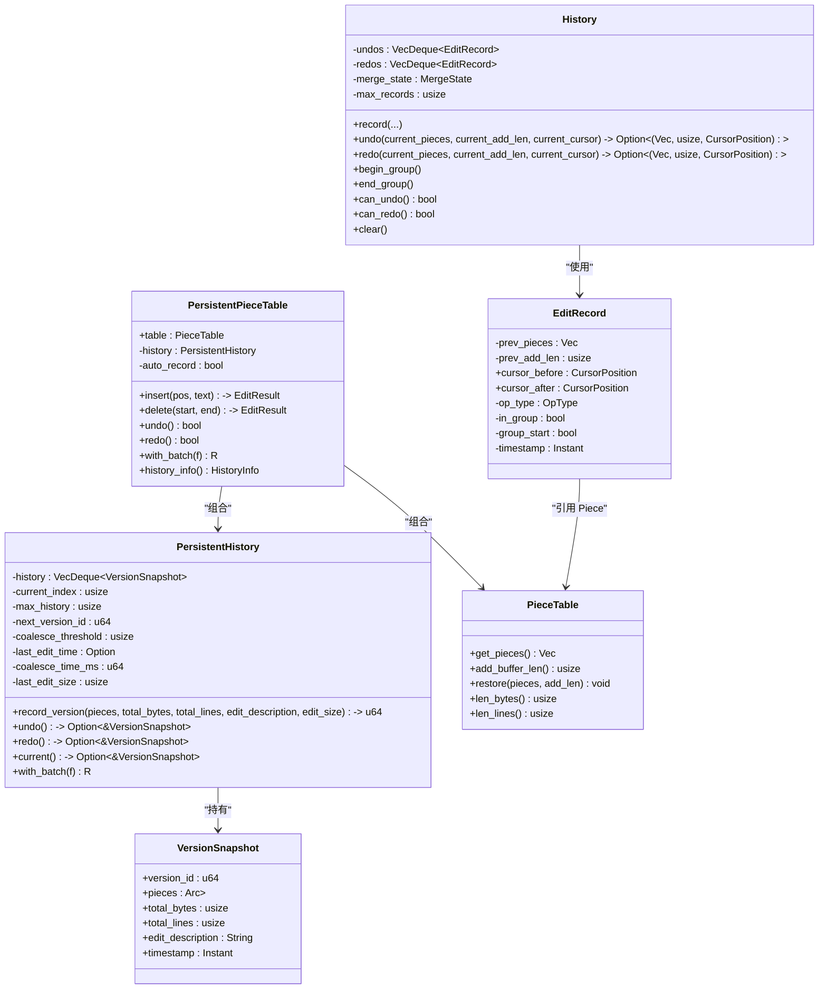
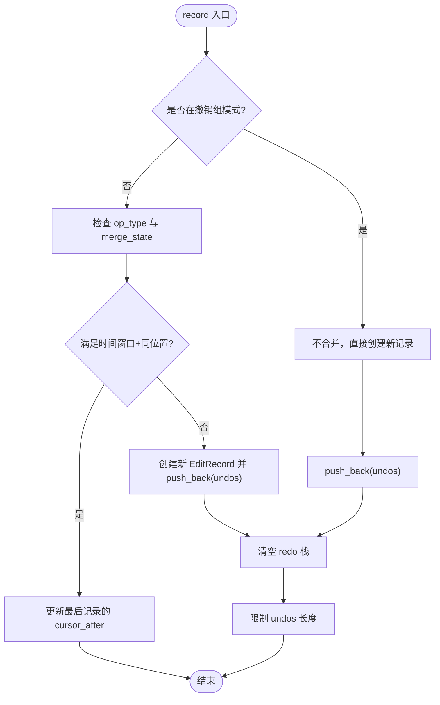
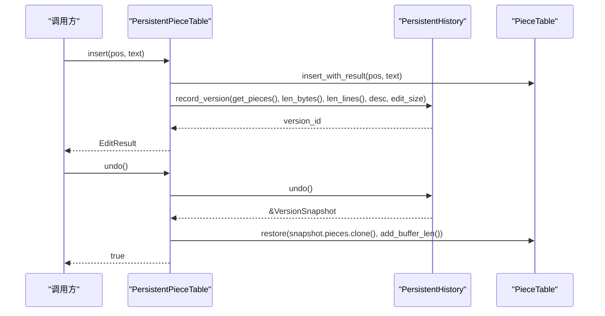
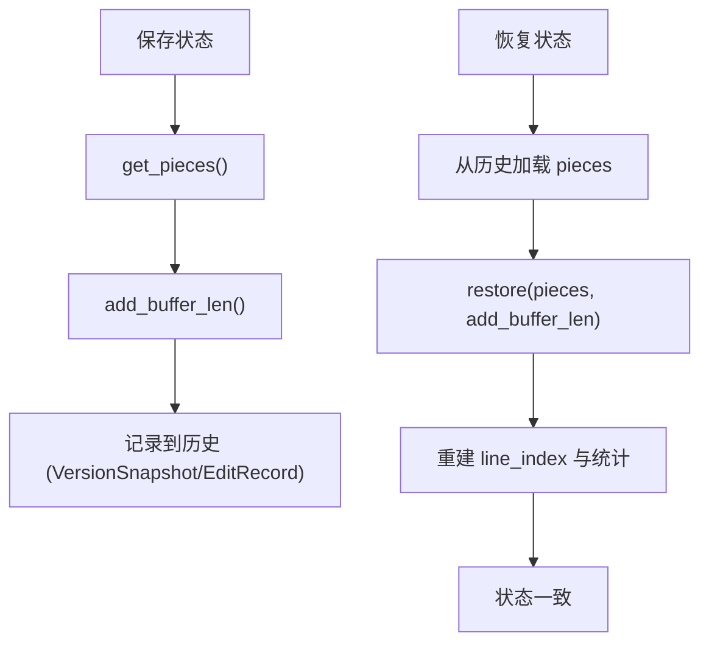
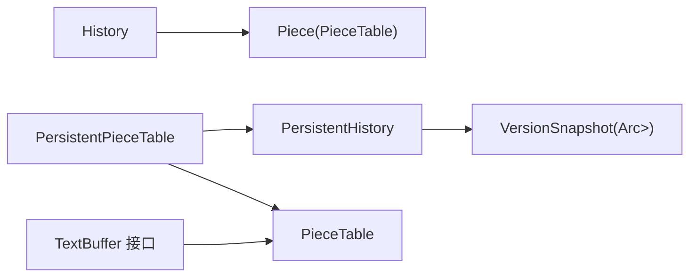

# 历史记录管理

<cite>
**本文引用的文件**   
- [history.rs](file://crates/aether-core/src/buffer/history.rs)
- [persistent_history.rs](file://crates/aether-core/src/persistent_history.rs)
- [piece_table.rs](file://crates/aether-core/src/buffer/piece_table.rs)
- [text_buffer.rs](file://crates/aether-core/src/buffer/text_buffer.rs)
</cite>

## 目录
1. [简介](#简介)
2. [项目结构](#项目结构)
3. [核心组件](#核心组件)
4. [架构总览](#架构总览)
5. [详细组件分析](#详细组件分析)
6. [依赖关系分析](#依赖关系分析)
7. [性能考量](#性能考量)
8. [故障排查指南](#故障排查指南)
9. [结论](#结论)
10. [附录：使用示例与最佳实践](#附录使用示例与最佳实践)

## 简介
本技术文档围绕“历史记录管理系统”展开，聚焦于撤销/重做历史栈的实现原理、操作类型设计、合并压缩策略、内存优化、执行流程与状态一致性保证、批量操作机制，以及与 PieceTable 的协作方式（快照保存与恢复）。文档同时给出调试方法与性能优化建议，帮助读者在复杂嵌套编辑场景下正确记录与回放编辑操作。

## 项目结构
本项目采用模块化组织，与历史记录相关的核心代码位于 aether-core 的 buffer 模块与持久化历史模块中：
- buffer/history.rs：轻量级基于元数据快照的 Undo/Redo 实现，面向高频输入合并与撤销组。
- persistent_history.rs：基于 Arc 共享的持久化版本历史管理器，提供高效撤销/重做与批量操作封装。
- buffer/piece_table.rs：高性能文本缓冲区，支持 O(1) 插入/删除、零拷贝读取、行索引与片段合并。
- buffer/text_buffer.rs：文本缓冲区抽象接口与通用数据结构（光标、选择区、编辑结果等）。

图表来源
- [text_buffer.rs:1-49](file://crates/aether-core/src/buffer/text_buffer.rs#L1-L49)
- [piece_table.rs:11-34](file://crates/aether-core/src/buffer/piece_table.rs#L11-L34)
- [history.rs:7-16](file://crates/aether-core/src/buffer/history.rs#L7-L16)
- [persistent_history.rs:32-50](file://crates/aether-core/src/persistent_history.rs#L32-L50)

章节来源
- [text_buffer.rs:1-49](file://crates/aether-core/src/buffer/text_buffer.rs#L1-L49)
- [piece_table.rs:11-34](file://crates/aether-core/src/buffer/piece_table.rs#L11-L34)
- [history.rs:7-16](file://crates/aether-core/src/buffer/history.rs#L7-L16)
- [persistent_history.rs:32-50](file://crates/aether-core/src/persistent_history.rs#L32-L50)

## 核心组件
- History（轻量撤销/重做）
  - 以 EditRecord 为单位记录“编辑前的 pieces 元数据快照 + 光标位置 + 操作类型 + 时间戳”。
  - 支持连续插入/删除的时间窗口合并；支持撤销组（begin_group/end_group），组内不合并，一次 undo 撤销整个组。
  - 使用 VecDeque 存储 undos/redos，限制最大记录数，O(1) 淘汰旧记录。
- PersistentHistory（持久化版本历史）
  - 以 VersionSnapshot 为版本节点，pieces 通过 Arc<Vec<Piece>> 共享，避免完整拷贝。
  - 支持按大小和时间窗口的合并策略，减少版本数量。
  - 提供 with_batch 批量操作封装，仅记录一次最终版本。
- PieceTable（文本缓冲区）
  - 维护 original（可选内存映射）、add_buffer（只追加）、pieces（有序片段列表）、line_index（行索引）、piece_offset_cache（前缀和缓存）。
  - 提供 insert/delete/restore/get_pieces/add_buffer_len 等能力，供历史记录系统保存/恢复状态。
- TextBuffer（抽象接口）
  - 定义统一的文本编辑接口与 BufferState（用于保存/恢复状态的序列化结构）。

章节来源
- [history.rs:7-16](file://crates/aether-core/src/buffer/history.rs#L7-L16)
- [history.rs:18-36](file://crates/aether-core/src/buffer/history.rs#L18-L36)
- [history.rs:50-76](file://crates/aether-core/src/buffer/history.rs#L50-L76)
- [persistent_history.rs:13-27](file://crates/aether-core/src/persistent_history.rs#L13-L27)
- [persistent_history.rs:32-50](file://crates/aether-core/src/persistent_history.rs#L32-L50)
- [piece_table.rs:11-34](file://crates/aether-core/src/buffer/piece_table.rs#L11-L34)
- [text_buffer.rs:61-81](file://crates/aether-core/src/buffer/text_buffer.rs#L61-L81)

## 架构总览
历史记录系统分为两层：
- 轻量层（History）：面向高频输入与撤销组，记录最小必要元数据，快速合并相邻输入，适合 UI 交互层。
- 持久化层（PersistentHistory/PersistentPieceTable）：面向版本管理与批量操作，利用 Arc 共享 pieces，降低内存开销，适合跨会话或需要版本回溯的场景。

图表来源
- [history.rs:7-16](file://crates/aether-core/src/buffer/history.rs#L7-L16)
- [history.rs:18-36](file://crates/aether-core/src/buffer/history.rs#L18-L36)
- [persistent_history.rs:13-27](file://crates/aether-core/src/persistent_history.rs#L13-L27)
- [persistent_history.rs:32-50](file://crates/aether-core/src/persistent_history.rs#L32-L50)
- [persistent_history.rs:242-250](file://crates/aether-core/src/persistent_history.rs#L242-L250)
- [piece_table.rs:11-34](file://crates/aether-core/src/buffer/piece_table.rs#L11-L34)

## 详细组件分析

### 组件A：History（轻量撤销/重做）
- 操作类型设计
  - OpType：Insert/Delete/Replace，影响合并策略。
  - EditRecord：保存 prev_pieces（完整副本）、prev_add_len、光标前后位置、操作类型、是否属于撤销组、组首标记、时间戳。
- 合并策略
  - 时间窗口合并：对 Insert/Delete 在 500ms 内且编辑位置相同的情况下进行合并，更新最后记录的 cursor_after。
  - Replace 不参与合并。
  - 撤销组：begin_group/end_group 之间不合并，撤销时一次性回退到组首记录的 prev_pieces。
- 执行流程
  - record：根据 merge_state 判断是否合并；否则创建新 EditRecord 并推入 undos，清空 redos，限制最大记录数。
  - undo：弹出 last；若为组成员但非组首，继续弹出直到组首，将当前状态作为单条汇总记录推入 redo，返回组首 prev_pieces。
  - redo：从 redo 弹出记录，将当前状态推入 undos，返回记录的 prev_pieces。
- 状态一致性
  - 每次 undo/redo 都会更新 merge_state 为 Idle，避免后续误合并。
  - 撤销组逻辑确保组内多条记录被整体撤销/重做，光标回到组首 before 或组末 after。
- 复杂度与内存
  - 每个 EditRecord 包含一份完整的 Vec<Piece> 副本，适用于小文件或中等规模文本；对于大文件建议使用 PersistentHistory 的 Arc 共享方案。
  - VecDeque 提供 O(1) 淘汰，避免 O(n) remove(0)。

图表来源
- [history.rs:101-200](file://crates/aether-core/src/buffer/history.rs#L101-L200)

章节来源
- [history.rs:50-76](file://crates/aether-core/src/buffer/history.rs#L50-L76)
- [history.rs:101-200](file://crates/aether-core/src/buffer/history.rs#L101-L200)
- [history.rs:206-312](file://crates/aether-core/src/buffer/history.rs#L206-L312)

### 组件B：PersistentHistory（持久化版本历史）
- 版本快照
  - VersionSnapshot 包含 version_id、Arc<Vec<Piece>>、total_bytes、total_lines、edit_description、timestamp。
  - Arc 包装使得不同版本共享同一份 pieces 数据，撤销/重做仅增加引用计数，避免完整拷贝。
- 合并策略
  - 大小阈值 coalesce_threshold：小于阈值的编辑尝试合并到当前版本。
  - 时间窗口 coalesce_time_ms：距离上次编辑较近的小编辑可合并。
  - should_coalesce 综合两者判断。
- 执行流程
  - record_version：若应合并则更新当前版本的 pieces/字节/行数/描述/时间戳；否则创建新版本，丢弃当前版本之后的历史，限制历史长度，更新 current_index。
  - undo/redo：移动 current_index 并返回对应 VersionSnapshot 引用。
- 批量操作
  - PersistentPieceTable::with_batch 临时关闭 auto_record，执行多个底层编辑后统一记录一次“批量操作”，减少历史膨胀。
- 溢出处理
  - 当 history 超过 max_history 时，优先删除中间旧版本以保留用户当前所在版本，避免索引跳到最新条目。

图表来源
- [persistent_history.rs:273-285](file://crates/aether-core/src/persistent_history.rs#L273-L285)
- [persistent_history.rs:69-136](file://crates/aether-core/src/persistent_history.rs#L69-L136)
- [persistent_history.rs:299-321](file://crates/aether-core/src/persistent_history.rs#L299-L321)
- [piece_table.rs:532-545](file://crates/aether-core/src/buffer/piece_table.rs#L532-L545)

章节来源
- [persistent_history.rs:13-27](file://crates/aether-core/src/persistent_history.rs#L13-L27)
- [persistent_history.rs:69-136](file://crates/aether-core/src/persistent_history.rs#L69-L136)
- [persistent_history.rs:242-250](file://crates/aether-core/src/persistent_history.rs#L242-L250)
- [persistent_history.rs:273-363](file://crates/aether-core/src/persistent_history.rs#L273-L363)

### 组件C：PieceTable（与历史记录协作）
- 关键接口
  - get_pieces：返回当前 pieces 的克隆副本，供历史记录保存。
  - add_buffer_len：返回 add_buffer 当前长度，用于恢复时校验。
  - restore：用新的 pieces 替换当前片段表，重建行索引与统计信息。
  - len_bytes/len_lines：获取当前文本长度与行数，用于版本描述与合并策略。
- 恢复与一致性
  - restore 会重新计算 len_chars、len_lines 并重建 line_index，确保撤销/重做后的状态一致。
  - save_state/restore_state 提供 BufferState 序列化/反序列化路径，带严格边界校验，防止损坏数据导致 panic。

图表来源
- [piece_table.rs:522-545](file://crates/aether-core/src/buffer/piece_table.rs#L522-L545)
- [piece_table.rs:1281-1307](file://crates/aether-core/src/buffer/piece_table.rs#L1281-L1307)
- [piece_table.rs:1310-1467](file://crates/aether-core/src/buffer/piece_table.rs#L1310-L1467)

章节来源
- [piece_table.rs:522-545](file://crates/aether-core/src/buffer/piece_table.rs#L522-L545)
- [piece_table.rs:1281-1307](file://crates/aether-core/src/buffer/piece_table.rs#L1281-L1307)
- [piece_table.rs:1310-1467](file://crates/aether-core/src/buffer/piece_table.rs#L1310-L1467)

## 依赖关系分析
- History 依赖 PieceTable 的 Piece 类型，保存的是元数据快照而非文本内容。
- PersistentHistory 通过 Arc<Vec<Piece>> 共享 pieces，显著降低内存占用。
- PersistentPieceTable 组合 PieceTable 与 PersistentHistory，提供高层 API（insert/delete/undo/redo/with_batch）。
- TextBuffer 接口定义了通用的编辑与状态保存/恢复方法，PieceTable 实现了该接口。

图表来源
- [history.rs:18-36](file://crates/aether-core/src/buffer/history.rs#L18-L36)
- [persistent_history.rs:13-27](file://crates/aether-core/src/persistent_history.rs#L13-L27)
- [persistent_history.rs:242-250](file://crates/aether-core/src/persistent_history.rs#L242-L250)
- [text_buffer.rs:1-49](file://crates/aether-core/src/buffer/text_buffer.rs#L1-L49)

章节来源
- [history.rs:18-36](file://crates/aether-core/src/buffer/history.rs#L18-L36)
- [persistent_history.rs:13-27](file://crates/aether-core/src/persistent_history.rs#L13-L27)
- [persistent_history.rs:242-250](file://crates/aether-core/src/persistent_history.rs#L242-L250)
- [text_buffer.rs:1-49](file://crates/aether-core/src/buffer/text_buffer.rs#L1-L49)

## 性能考量
- 合并策略
  - History：500ms 时间窗口 + 同位置判定，减少频繁输入的冗余记录。
  - PersistentHistory：大小阈值 + 时间窗口，避免大量小版本堆积。
- 数据结构
  - History 使用 VecDeque，O(1) 淘汰旧记录；PersistentHistory 使用 Arc<Vec<Piece>>，避免完整拷贝。
- 索引与前缀和
  - PieceTable 维护 piece_offset_cache 与 line_index，提升查找与渲染性能。
- 批量操作
  - with_batch 将多次编辑合并为一次历史记录，显著减少历史膨胀。
- 碎片合并
  - PieceTable 定期合并相邻 Add 片段，减少碎片数量，提高后续操作效率。

[本节为通用性能讨论，无需具体文件分析]

## 故障排查指南
- 常见错误
  - 恢复失败：BufferState 反序列化校验失败（如 pieces_data 长度非法、source/start/len 越界、add_buffer_len 异常、byte_len 不匹配）。此时会放弃恢复并保留当前状态。
  - 撤销组不一致：确保 begin_group/end_group 成对出现；组内记录不合并，撤销时应一次性回退到组首。
  - 历史溢出：当达到 max_records/max_history 时，旧记录会被淘汰；注意 current_index 的维护以避免索引跳变。
- 定位方法
  - 打印 History.merge_state 与 EditRecord.op_type/in_group/group_start 字段，确认合并与分组行为是否符合预期。
  - 检查 PersistentHistory.should_coalesce 的阈值与时间窗口设置，调整以平衡历史粒度与内存占用。
  - 使用 PieceTable.save_state/restore_state_checked 的返回值与日志输出，定位恢复失败原因。

章节来源
- [piece_table.rs:1281-1307](file://crates/aether-core/src/buffer/piece_table.rs#L1281-L1307)
- [piece_table.rs:1310-1467](file://crates/aether-core/src/buffer/piece_table.rs#L1310-L1467)
- [history.rs:206-312](file://crates/aether-core/src/buffer/history.rs#L206-L312)
- [persistent_history.rs:69-136](file://crates/aether-core/src/persistent_history.rs#L69-L136)

## 结论
历史记录管理系统通过两层设计兼顾了交互响应性与版本管理能力：
- History 针对高频输入与撤销组，提供轻量高效的撤销/重做体验。
- PersistentHistory 借助 Arc 共享与合并策略，在保证功能的同时控制内存占用，并提供批量操作封装。
- PieceTable 的 restore 与状态校验机制确保了撤销/重做后的状态一致性。
在实际使用中，应根据文本规模与交互需求选择合适的历史策略，并结合批量操作与合并阈值调优以获得最佳性能。

[本节为总结性内容，无需具体文件分析]

## 附录：使用示例与最佳实践

### 如何记录编辑操作（History 轻量层）
- 在编辑完成后调用 record，传入编辑前的 pieces、add_buffer 长度、光标前后位置、操作类型、编辑位置与长度。
- 对于复杂的多步编辑，使用 begin_group/end_group 包裹，确保一次撤销能回退整个组。

章节来源
- [history.rs:101-200](file://crates/aether-core/src/buffer/history.rs#L101-L200)
- [history.rs:88-99](file://crates/aether-core/src/buffer/history.rs#L88-L99)

### 如何执行撤销/重做（History 轻量层）
- 调用 undo 获取上一状态的 pieces、add_buffer 长度与光标位置，然后应用到底层缓冲区。
- 调用 redo 获取下一状态的 pieces、add_buffer 长度与光标位置，然后应用到底层缓冲区。

章节来源
- [history.rs:206-312](file://crates/aether-core/src/buffer/history.rs#L206-L312)

### 如何处理复杂的嵌套编辑场景（PersistentPieceTable）
- 使用 with_batch 包裹一系列编辑操作，内部关闭自动记录，结束后统一记录一次“批量操作”。
- 适用于模板填充、格式化、批量替换等场景。

章节来源
- [persistent_history.rs:347-363](file://crates/aether-core/src/persistent_history.rs#L347-L363)

### 与 PieceTable 的协作要点
- 保存状态：get_pieces + add_buffer_len。
- 恢复状态：restore(pieces, add_buffer_len)，重建行索引与统计信息。
- 使用 save_state/restore_state 进行更严格的序列化/反序列化与校验。

章节来源
- [piece_table.rs:522-545](file://crates/aether-core/src/buffer/piece_table.rs#L522-L545)
- [piece_table.rs:1281-1307](file://crates/aether-core/src/buffer/piece_table.rs#L1281-L1307)
- [piece_table.rs:1310-1467](file://crates/aether-core/src/buffer/piece_table.rs#L1310-L1467)

### 内存泄漏防护措施
- 使用 Arc<Vec<Piece>> 共享 pieces，避免重复拷贝。
- 限制历史记录数量（max_records/max_history），及时淘汰旧记录。
- 谨慎使用 begin_group/end_group，避免长时间保持组状态导致记录过多。
- 合理使用 with_batch，减少不必要的中间版本。

章节来源
- [persistent_history.rs:13-27](file://crates/aether-core/src/persistent_history.rs#L13-L27)
- [history.rs:173-177](file://crates/aether-core/src/buffer/history.rs#L173-L177)
- [persistent_history.rs:116-136](file://crates/aether-core/src/persistent_history.rs#L116-L136)

### 调试方法
- 打印 History.merge_state 与 EditRecord 关键字段，验证合并与分组逻辑。
- 检查 PersistentHistory.should_coalesce 的阈值与时间窗口，调整以平衡历史粒度与内存占用。
- 使用 PieceTable.save_state/restore_state_checked 的返回值与日志输出，定位恢复失败原因。

章节来源
- [history.rs:58-76](file://crates/aether-core/src/buffer/history.rs#L58-L76)
- [persistent_history.rs:138-155](file://crates/aether-core/src/persistent_history.rs#L138-L155)
- [piece_table.rs:1281-1307](file://crates/aether-core/src/buffer/piece_table.rs#L1281-L1307)