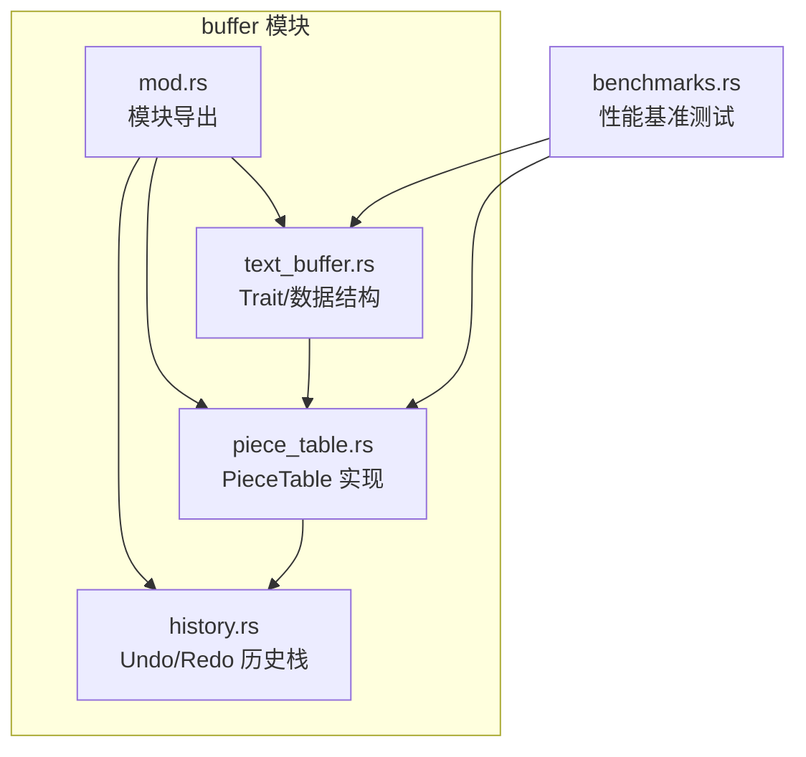
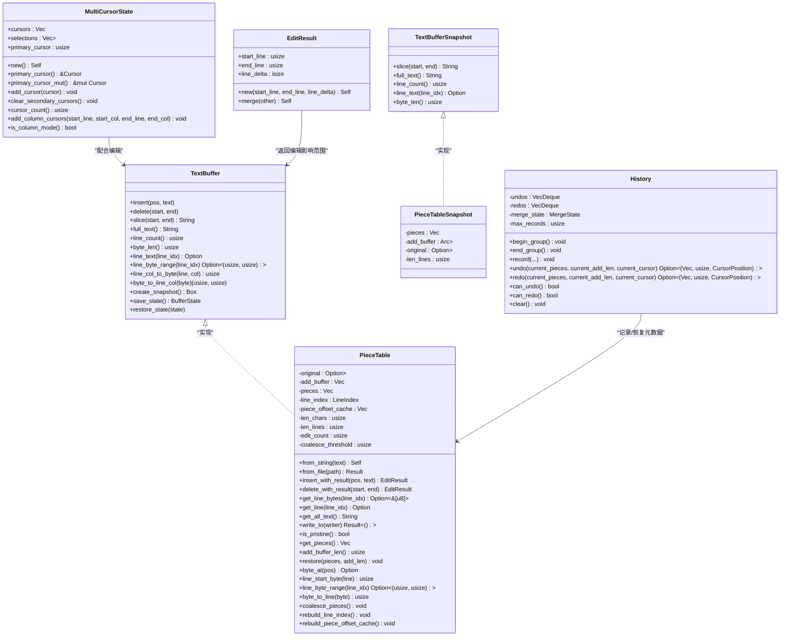
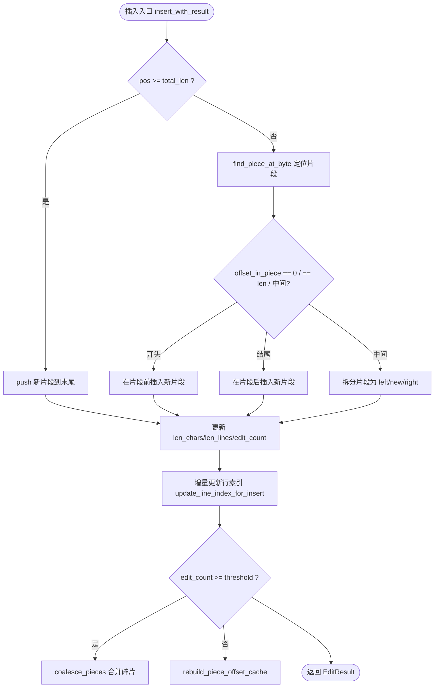
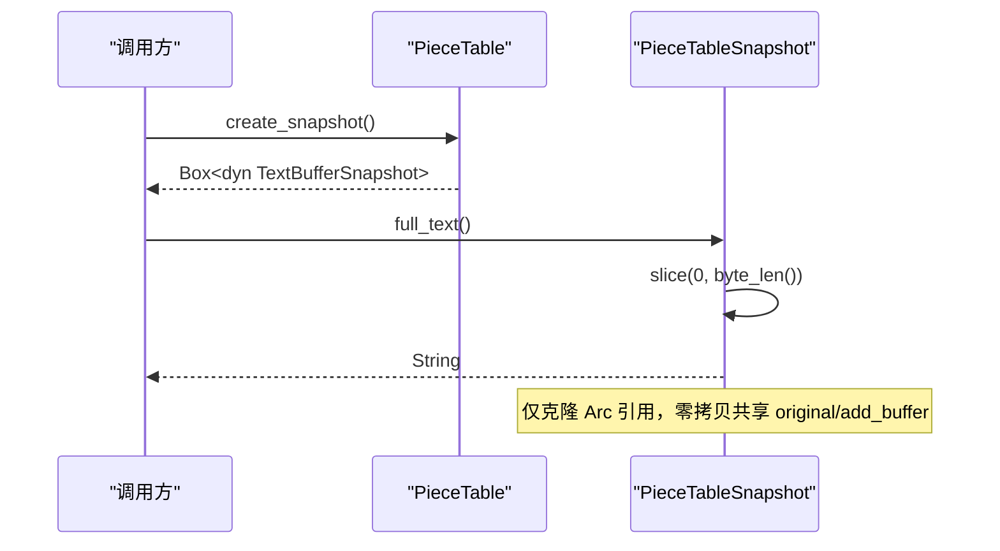
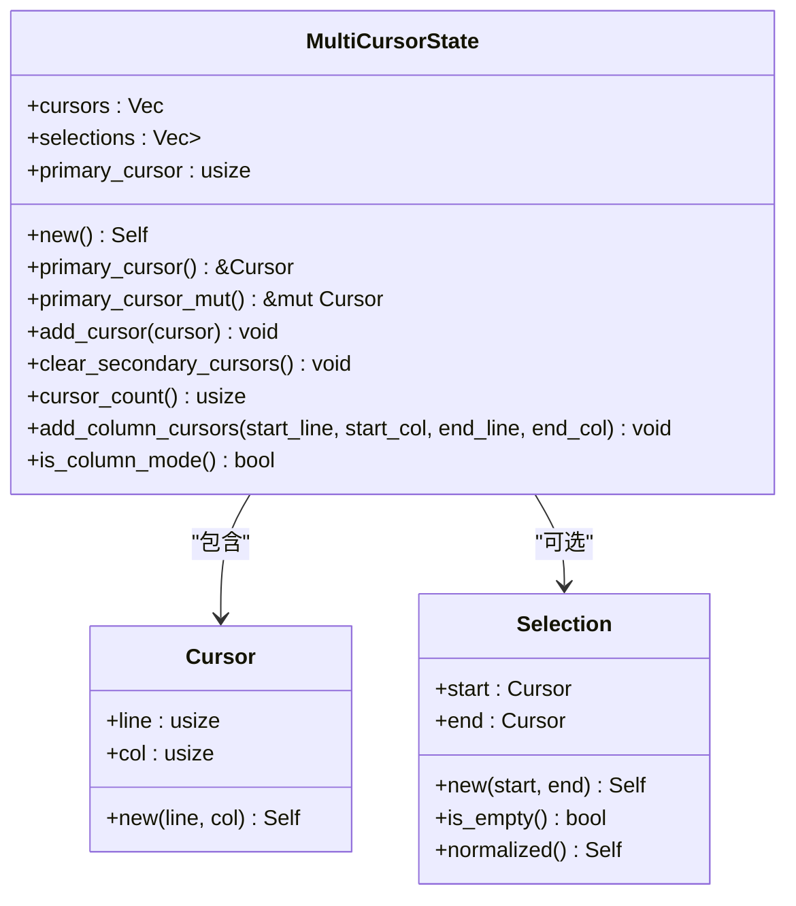
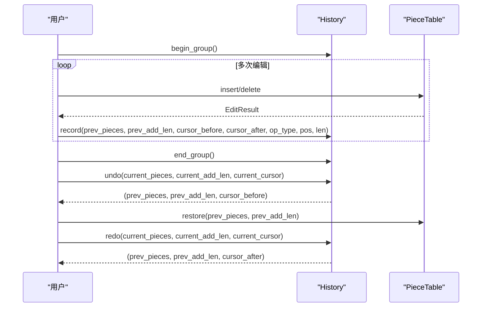
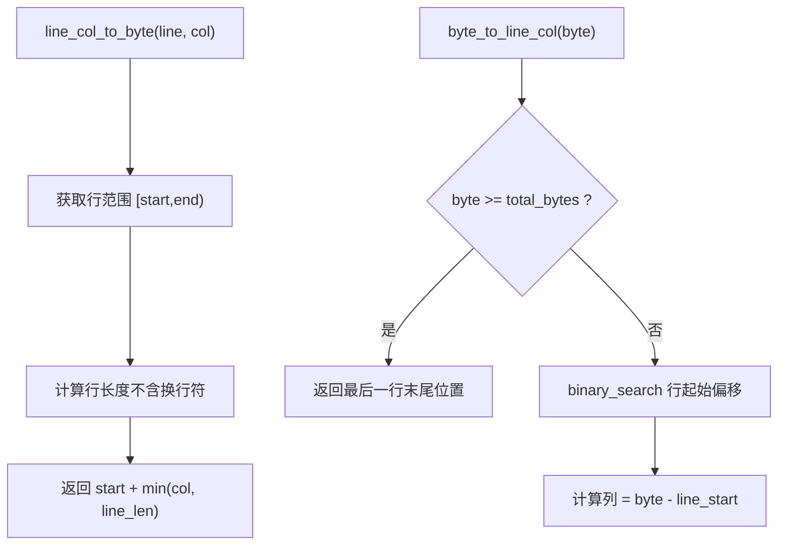
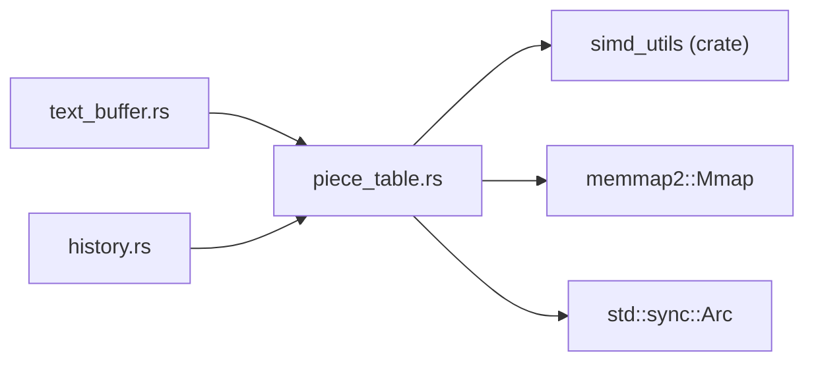

# 文本缓冲区系统

<cite>
**本文引用的文件**
- [crates/aether-core/src/buffer/mod.rs](file://crates/aether-core/src/buffer/mod.rs)
- [crates/aether-core/src/buffer/text_buffer.rs](file://crates/aether-core/src/buffer/text_buffer.rs)
- [crates/aether-core/src/buffer/piece_table.rs](file://crates/aether-core/src/buffer/piece_table.rs)
- [crates/aether-core/src/buffer/history.rs](file://crates/aether-core/src/buffer/history.rs)
- [crates/aether-core/src/benchmarks.rs](file://crates/aether-core/src/benchmarks.rs)
</cite>

## 更新摘要
**所做更改**
- 移除了对已删除的 `PieceTable::needs_rebuild` 方法的引用，这是代码清理的一部分
- 更新了相关章节以反映 PieceTable 结构的简化

## 目录
1. [简介](#简介)
2. [项目结构](#项目结构)
3. [核心组件](#核心组件)
4. [架构总览](#架构总览)
5. [详细组件分析](#详细组件分析)
6. [依赖关系分析](#依赖关系分析)
7. [性能考量](#性能考量)
8. [故障排查指南](#故障排查指南)
9. [结论](#结论)
10. [附录](#附录)

## 简介
本技术文档聚焦牧羊人编辑器的文本缓冲区子系统，围绕 Piece Table 数据结构、TextBuffer trait 接口、多光标支持机制与撤销/重做历史栈进行深入解析。文档涵盖 O(1) 插入/删除的设计原理与实现细节、内存管理策略（零拷贝、Arc 共享、内存映射）、并发安全（快照与 Send/Sync）、性能优化技巧（前缀和缓存、SIMD 加速、碎片合并）以及与其他系统的集成方式（如增量词法分析器）。文末提供常见问题解决方案与调优建议。

## 项目结构
文本缓冲区相关代码位于 aether-core 的 buffer 模块中，采用分层组织：
- text_buffer.rs：定义 TextBuffer trait、不可变快照、光标与选择区、编辑操作类型与结果等公共接口与数据结构。
- piece_table.rs：Piece Table 的具体实现，包含片段表、行索引、偏移前缀和缓存、写入与读取路径、状态保存/恢复、TextBuffer trait 实现等。
- history.rs：基于 Piece Table 元数据快照的高效 Undo/Redo 历史栈，支持撤销组与连续输入合并。
- mod.rs：模块导出，将核心类型暴露给上层使用。

图表来源
- [crates/aether-core/src/buffer/mod.rs:1-9](file://crates/aether-core/src/buffer/mod.rs#L1-L9)
- [crates/aether-core/src/buffer/text_buffer.rs:1-49](file://crates/aether-core/src/buffer/text_buffer.rs#L1-L49)
- [crates/aether-core/src/buffer/piece_table.rs:117-168](file://crates/aether-core/src/buffer/piece_table.rs#L117-L168)
- [crates/aether-core/src/buffer/history.rs:78-86](file://crates/aether-core/src/buffer/history.rs#L78-L86)
- [crates/aether-core/src/benchmarks.rs:399-443](file://crates/aether-core/src/benchmarks.rs#L399-L443)

章节来源
- [crates/aether-core/src/buffer/mod.rs:1-9](file://crates/aether-core/src/buffer/mod.rs#L1-L9)

## 核心组件
- TextBuffer trait：抽象所有文本编辑与查询操作，统一字节偏移语义，支持不可变快照用于后台线程安全访问。
- PieceTable：高性能文本缓冲区，维护原始文件（内存映射）与追加缓冲区，通过有序片段表与行索引实现高效定位与更新。
- History：轻量级历史栈，记录编辑前的 pieces 元数据与光标位置，支持撤销组与快速合并。
- 多光标与选择区：Cursor、Selection、MultiCursorState 提供多光标与列选择模式能力。
- EditResult：描述一次编辑影响的行范围与行数变化，便于上层精确失效缓存。

章节来源
- [crates/aether-core/src/buffer/text_buffer.rs:1-49](file://crates/aether-core/src/buffer/text_buffer.rs#L1-L49)
- [crates/aether-core/src/buffer/piece_table.rs:117-168](file://crates/aether-core/src/buffer/piece_table.rs#L117-L168)
- [crates/aether-core/src/buffer/history.rs:78-86](file://crates/aether-core/src/buffer/history.rs#L78-L86)
- [crates/aether-core/src/buffer/text_buffer.rs:83-122](file://crates/aether-core/src/buffer/text_buffer.rs#L83-L122)
- [crates/aether-core/src/buffer/text_buffer.rs:173-258](file://crates/aether-core/src/buffer/text_buffer.rs#L173-L258)
- [crates/aether-core/src/buffer/text_buffer.rs:142-171](file://crates/aether-core/src/buffer/text_buffer.rs#L142-L171)

## 架构总览
整体架构以 Trait 解耦具体数据结构，PieceTable 作为默认实现，History 在外部驱动并记录元数据快照，上层 UI/渲染/词法分析器等通过 TextBuffer 接口交互。

图表来源
- [crates/aether-core/src/buffer/text_buffer.rs:1-49](file://crates/aether-core/src/buffer/text_buffer.rs#L1-L49)
- [crates/aether-core/src/buffer/piece_table.rs:117-168](file://crates/aether-core/src/buffer/piece_table.rs#L117-L168)
- [crates/aether-core/src/buffer/piece_table.rs:1062-1104](file://crates/aether-core/src/buffer/piece_table.rs#L1062-L1104)
- [crates/aether-core/src/buffer/piece_table.rs:1179-1308](file://crates/aether-core/src/buffer/piece_table.rs#L1179-L1308)
- [crates/aether-core/src/buffer/history.rs:78-86](file://crates/aether-core/src/buffer/history.rs#L78-L86)
- [crates/aether-core/src/buffer/text_buffer.rs:173-258](file://crates/aether-core/src/buffer/text_buffer.rs#L173-L258)
- [crates/aether-core/src/buffer/text_buffer.rs:142-171](file://crates/aether-core/src/buffer/text_buffer.rs#L142-L171)

## 详细组件分析

### Piece Table 数据结构与算法
- 设计要点
  - 双缓冲：original（只读，Arc<Mmap>）与 add_buffer（只追加），避免频繁移动大段内存。
  - 片段表 pieces：按顺序引用两个 buffer 的连续区间，支持 O(1) 插入新片段与 O(1) 删除片段（splice）。
  - 行索引 line_index：每行起始字节偏移数组，O(1) 获取行范围；增量更新避免全量重建。
  - 偏移前缀和缓存 piece_offset_cache：每个 piece 的起始字节偏移与前缀和哨兵，二分查找 O(log n) 定位 piece，O(1) 计算总长度。
  - 自动碎片合并：编辑计数达到阈值后合并相邻同 Source 的 Add 片段，降低碎片数量。
- 关键复杂度
  - 插入/删除：片段表 splice 为 O(k)，k 为受影响的片段数，通常很小；行索引增量更新 O(n_tail)。
  - 行号到字节偏移：O(1) 通过 line_index.line_start/end。
  - 字节偏移到行号：O(log n) 二分查找。
  - 单 piece 命中时 get_line_bytes 零拷贝，跨 piece 回退拼接。
- 边界与健壮性
  - 空表处理：find_piece_at_byte 对空 pieces 返回 0，避免越界 panic。
  - 删除边界钳位：end 被限制到 len_bytes，防止越界。
  - 行索引一致性：删除后严格调整行起点集合，保证与重建一致。

图表来源
- [crates/aether-core/src/buffer/piece_table.rs:170-282](file://crates/aether-core/src/buffer/piece_table.rs#L170-L282)
- [crates/aether-core/src/buffer/piece_table.rs:604-641](file://crates/aether-core/src/buffer/piece_table.rs#L604-L641)
- [crates/aether-core/src/buffer/piece_table.rs:714-744](file://crates/aether-core/src/buffer/piece_table.rs#L714-L744)
- [crates/aether-core/src/buffer/piece_table.rs:1484-1516](file://crates/aether-core/src/buffer/piece_table.rs#L1484-L1516)

章节来源
- [crates/aether-core/src/buffer/piece_table.rs:117-168](file://crates/aether-core/src/buffer/piece_table.rs#L117-L168)
- [crates/aether-core/src/buffer/piece_table.rs:170-282](file://crates/aether-core/src/buffer/piece_table.rs#L170-L282)
- [crates/aether-core/src/buffer/piece_table.rs:289-408](file://crates/aether-core/src/buffer/piece_table.rs#L289-L408)
- [crates/aether-core/src/buffer/piece_table.rs:432-461](file://crates/aether-core/src/buffer/piece_table.rs#L432-L461)
- [crates/aether-core/src/buffer/piece_table.rs:604-641](file://crates/aether-core/src/buffer/piece_table.rs#L604-L641)
- [crates/aether-core/src/buffer/piece_table.rs:668-696](file://crates/aether-core/src/buffer/piece_table.rs#L668-L696)
- [crates/aether-core/src/buffer/piece_table.rs:714-744](file://crates/aether-core/src/buffer/piece_table.rs#L714-L744)
- [crates/aether-core/src/buffer/piece_table.rs:748-780](file://crates/aether-core/src/buffer/piece_table.rs#L748-L780)
- [crates/aether-core/src/buffer/piece_table.rs:1484-1516](file://crates/aether-core/src/buffer/piece_table.rs#L1484-L1516)

### TextBuffer trait 与快照
- 接口设计原则
  - 统一字节偏移语义，避免字符编码歧义。
  - 行号从 0 开始，提供行号与列号互转方法。
  - 支持不可变快照，允许后台线程安全读取而不加锁。
- 快照实现
  - PieceTableSnapshot 持有 pieces 副本与 Arc<Vec<u8>> 共享 add_buffer，original 直接共享 Arc<Mmap>，避免大文件拷贝。
  - 快照提供 slice/full_text/line_text/byte_len 等只读接口。
- 状态保存/恢复
  - save_state 序列化 pieces 元数据与长度信息，用于持久化或撤销。
  - restore_state_checked 带严格校验，确保反序列化数据合法，避免后续越界或损坏。

图表来源
- [crates/aether-core/src/buffer/piece_table.rs:1268-1279](file://crates/aether-core/src/buffer/piece_table.rs#L1268-L1279)
- [crates/aether-core/src/buffer/piece_table.rs:1062-1104](file://crates/aether-core/src/buffer/piece_table.rs#L1062-L1104)
- [crates/aether-core/src/buffer/piece_table.rs:1281-1308](file://crates/aether-core/src/buffer/piece_table.rs#L1281-L1308)
- [crates/aether-core/src/buffer/piece_table.rs:1314-1467](file://crates/aether-core/src/buffer/piece_table.rs#L1314-L1467)

章节来源
- [crates/aether-core/src/buffer/text_buffer.rs:1-49](file://crates/aether-core/src/buffer/text_buffer.rs#L1-L49)
- [crates/aether-core/src/buffer/piece_table.rs:1062-1104](file://crates/aether-core/src/buffer/piece_table.rs#L1062-L1104)
- [crates/aether-core/src/buffer/piece_table.rs:1268-1308](file://crates/aether-core/src/buffer/piece_table.rs#L1268-L1308)
- [crates/aether-core/src/buffer/piece_table.rs:1314-1467](file://crates/aether-core/src/buffer/piece_table.rs#L1314-L1467)

### 多光标与选择区
- 数据结构
  - Cursor：行+列（字节列）。
  - Selection：起止光标，支持规范化与空判断。
  - MultiCursorState：维护多个光标与可选选择区，主光标索引钳位保护。
- 功能特性
  - 添加列选择模式光标（矩形选区）。
  - 清除次要光标，保留主光标及其选择区。
  - 检测是否处于列选择模式。

图表来源
- [crates/aether-core/src/buffer/text_buffer.rs:83-122](file://crates/aether-core/src/buffer/text_buffer.rs#L83-L122)
- [crates/aether-core/src/buffer/text_buffer.rs:173-258](file://crates/aether-core/src/buffer/text_buffer.rs#L173-L258)

章节来源
- [crates/aether-core/src/buffer/text_buffer.rs:83-122](file://crates/aether-core/src/buffer/text_buffer.rs#L83-L122)
- [crates/aether-core/src/buffer/text_buffer.rs:173-258](file://crates/aether-core/src/buffer/text_buffer.rs#L173-L258)

### 撤销/重做历史栈
- 设计要点
  - 记录编辑前的 pieces 元数据与 add_buffer 长度，而非文本内容，极大降低内存占用。
  - 支持撤销组：begin_group/end_group 包裹的操作不合并，一次性撤销/重做。
  - 连续输入合并：相同位置、短时间内的插入/删除合并为一条记录。
  - 最大记录数限制：VecDeque 头淘汰 O(1)。
- 操作流程
  - record(before_pieces, before_add_len, cursor_before, cursor_after, op_type, edit_pos, edit_len)
  - undo(current_pieces, current_add_len, current_cursor) -> 返回 prev_pieces 与光标
  - redo(current_pieces, current_add_len, current_cursor) -> 返回 prev_pieces 与光标

图表来源
- [crates/aether-core/src/buffer/history.rs:78-86](file://crates/aether-core/src/buffer/history.rs#L78-L86)
- [crates/aether-core/src/buffer/history.rs:105-200](file://crates/aether-core/src/buffer/history.rs#L105-L200)
- [crates/aether-core/src/buffer/history.rs:206-284](file://crates/aether-core/src/buffer/history.rs#L206-L284)
- [crates/aether-core/src/buffer/history.rs:289-312](file://crates/aether-core/src/buffer/history.rs#L289-L312)

章节来源
- [crates/aether-core/src/buffer/history.rs:78-86](file://crates/aether-core/src/buffer/history.rs#L78-L86)
- [crates/aether-core/src/buffer/history.rs:105-200](file://crates/aether-core/src/buffer/history.rs#L105-L200)
- [crates/aether-core/src/buffer/history.rs:206-284](file://crates/aether-core/src/buffer/history.rs#L206-L284)
- [crates/aether-core/src/buffer/history.rs:289-312](file://crates/aether-core/src/buffer/history.rs#L289-L312)

### 行索引与字节偏移转换
- 行号到字节范围：O(1) 通过 line_index.line_start/end。
- 字节到行号：O(log n) 二分查找。
- 行号+列号到字节偏移：结合行范围与换行符处理（CRLF/LF），钳位列到行长度。
- 字节到行号+列号：处理缓冲区末尾光标合法性。

图表来源
- [crates/aether-core/src/buffer/piece_table.rs:1212-1266](file://crates/aether-core/src/buffer/piece_table.rs#L1212-L1266)
- [crates/aether-core/src/buffer/piece_table.rs:1475-1481](file://crates/aether-core/src/buffer/piece_table.rs#L1475-L1481)

章节来源
- [crates/aether-core/src/buffer/piece_table.rs:1212-1266](file://crates/aether-core/src/buffer/piece_table.rs#L1212-L1266)
- [crates/aether-core/src/buffer/piece_table.rs:1475-1481](file://crates/aether-core/src/buffer/piece_table.rs#L1475-L1481)

## 依赖关系分析
- 模块内依赖
  - text_buffer.rs 定义接口与通用数据结构。
  - piece_table.rs 实现 TextBuffer trait，并使用 simd_utils 进行 SIMD 加速。
  - history.rs 依赖 PieceTable 的 Piece 元数据进行快照记录。
- 外部依赖
  - memmap2::Mmap：内存映射大文件，零拷贝打开与读取。
  - Arc：共享引用计数，避免重复拷贝。
- 潜在循环依赖
  - 当前无循环依赖，模块职责清晰。

图表来源
- [crates/aether-core/src/buffer/piece_table.rs:1-10](file://crates/aether-core/src/buffer/piece_table.rs#L1-L10)
- [crates/aether-core/src/buffer/history.rs:1-5](file://crates/aether-core/src/buffer/history.rs#L1-L5)

章节来源
- [crates/aether-core/src/buffer/piece_table.rs:1-10](file://crates/aether-core/src/buffer/piece_table.rs#L1-L10)
- [crates/aether-core/src/buffer/history.rs:1-5](file://crates/aether-core/src/buffer/history.rs#L1-L5)

## 性能考量
- 零拷贝与大文件加载
  - from_file 使用内存映射，避免全量拷贝，适合 GB 级文件。
  - write_to 直接写出各片段切片，避免中间 String 分配。
- 行读取优化
  - get_line_bytes 优先零拷贝路径，跨 piece 回退拼接。
  - 行索引增量更新减少重建开销。
- 碎片合并
  - 编辑计数阈值触发 coalesce_pieces，降低碎片数量，提升后续查找效率。
- SIMD 加速
  - 换行符计数与查找使用 SIMD，显著优于标量遍历。
- 基准测试
  - benchmarks.rs 提供多项 PieceTable 与 SIMD 基准，覆盖加载、插入、删除、行读取、全文读取、快照创建与编辑吞吐量。

章节来源
- [crates/aether-core/src/buffer/piece_table.rs:499-514](file://crates/aether-core/src/buffer/piece_table.rs#L499-L514)
- [crates/aether-core/src/buffer/piece_table.rs:432-461](file://crates/aether-core/src/buffer/piece_table.rs#L432-L461)
- [crates/aether-core/src/buffer/piece_table.rs:1484-1516](file://crates/aether-core/src/buffer/piece_table.rs#L1484-L1516)
- [crates/aether-core/src/buffer/piece_table.rs:784-797](file://crates/aether-core/src/buffer/piece_table.rs#L784-797)
- [crates/aether-core/src/benchmarks.rs:108-228](file://crates/aether-core/src/benchmarks.rs#L108-L228)
- [crates/aether-core/src/benchmarks.rs:234-263](file://crates/aether-core/src/benchmarks.rs#L234-L263)
- [crates/aether-core/src/benchmarks.rs:399-443](file://crates/aether-core/src/benchmarks.rs#L399-L443)

## 故障排查指南
- 常见错误与修复
  - 删除越界：delete_with_result 已对 end 进行钳位，若仍出现异常，检查调用方传入的 start/end 是否正确。
  - 行索引不一致：删除跨行文本后，update_line_index_for_delete 需正确计算 drain_end 与 shift_from_sub，确保与重建一致。
  - 状态恢复失败：restore_state_checked 会严格校验 pieces_data 长度、source/start/len/line_breaks 与 add_buffer_len，任何非法值都会放弃恢复。
  - 空表插入：find_piece_at_byte 对空 pieces 返回 0，避免越界；确保 insert_with_result 的空表分支正确处理。
- 调试建议
  - 使用 get_pieces 与 add_buffer_len 打印当前状态，对比 save_state 的结果。
  - 使用 len_lines 与 line_index.line_starts 验证行索引一致性。
  - 启用基准测试观察性能退化点，定位热点函数。

章节来源
- [crates/aether-core/src/buffer/piece_table.rs:289-408](file://crates/aether-core/src/buffer/piece_table.rs#L289-L408)
- [crates/aether-core/src/buffer/piece_table.rs:748-780](file://crates/aether-core/src/buffer/piece_table.rs#L748-L780)
- [crates/aether-core/src/buffer/piece_table.rs:1314-1467](file://crates/aether-core/src/buffer/piece_table.rs#L1314-L1467)
- [crates/aether-core/src/buffer/piece_table.rs:604-641](file://crates/aether-core/src/buffer/piece_table.rs#L604-L641)

## 结论
文本缓冲区系统以 Piece Table 为核心，结合行索引与前缀和缓存实现了高效的插入/删除与行定位；通过 TextBuffer trait 抽象出可替换的数据结构，并提供不可变快照支持并发读取；History 基于元数据快照实现轻量且强大的撤销/重做能力；多光标与选择区满足复杂编辑场景；内存管理与性能优化贯穿始终，包括零拷贝、Arc 共享、内存映射与 SIMD 加速。整体架构清晰、可扩展性强，适合大型编辑器的高性能需求。

## 附录
- 使用示例（路径指引）
  - 基本编辑与查询：参考 tests 中的 insert/delete/get_line 用例。
  - 快照与状态保存：参考 restore_and_snapshot 与 save_restore_state 用例。
  - 多光标与列选择：参考 MultiCursorState 的测试用例。
  - 撤销/重做与撤销组：参考 history 模块的 group_undo 与 merge_deletes 用例。
  - 性能基准：运行 perf_test 示例，查看 run_all_benchmarks 输出。

章节来源
- [crates/aether-core/src/buffer/piece_table.rs:801-1056](file://crates/aether-core/src/buffer/piece_table.rs#L801-L1056)
- [crates/aether-core/src/buffer/text_buffer.rs:260-343](file://crates/aether-core/src/buffer/text_buffer.rs#L260-L343)
- [crates/aether-core/src/buffer/history.rs:335-681](file://crates/aether-core/src/buffer/history.rs#L335-L681)
- [crates/aether-core/examples/perf_test.rs:1-18](file://crates/aether-core/examples/perf_test.rs#L1-L18)
- [crates/aether-core/src/benchmarks.rs:399-443](file://crates/aether-core/src/benchmarks.rs#L399-L443)