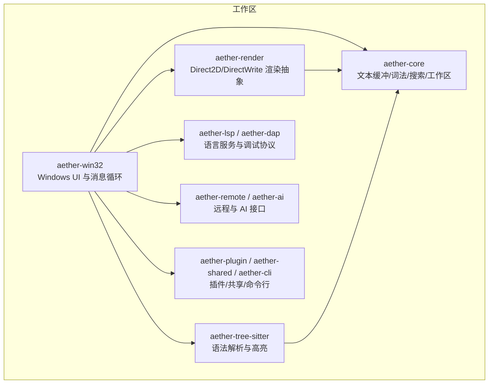
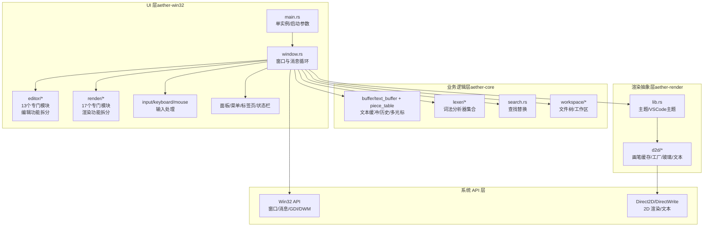
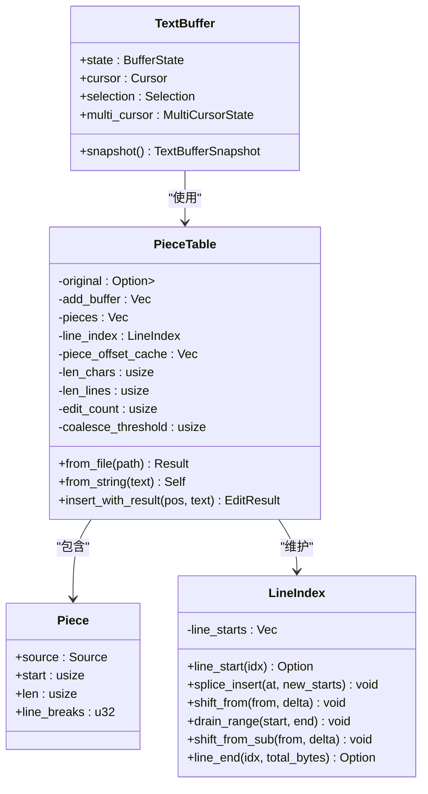
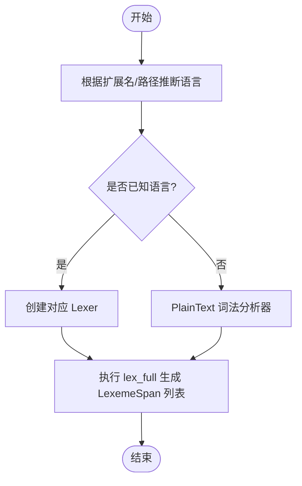
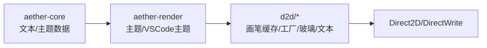
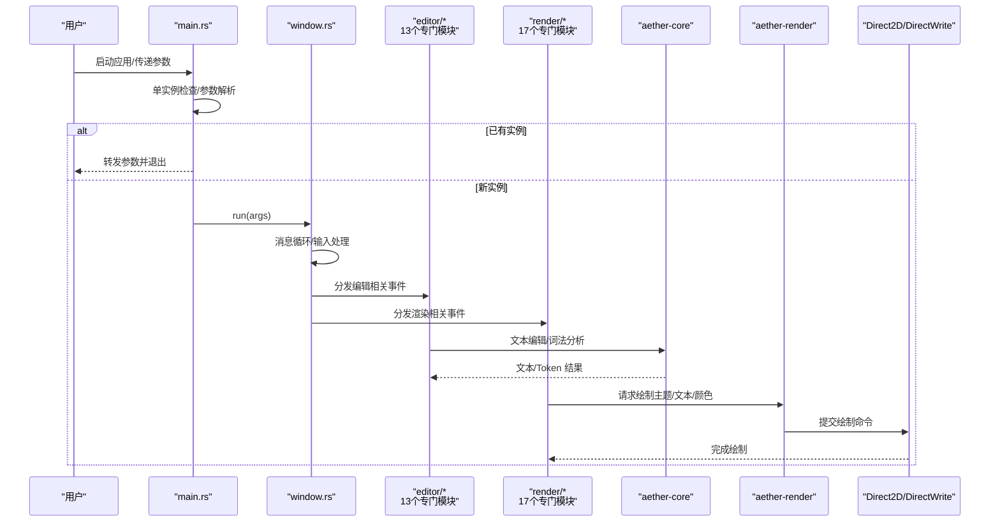
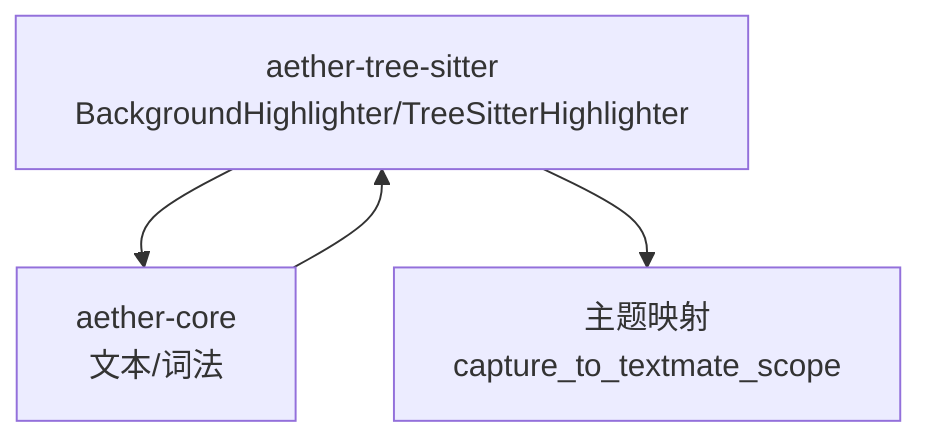
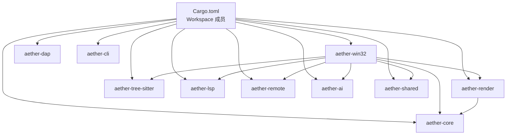

# 架构设计

<cite>
**本文引用的文件**   
- [Cargo.toml](file://Cargo.toml)
- [README.md](file://README.md)
- [crates/aether-win32/Cargo.toml](file://crates/aether-win32/Cargo.toml)
- [crates/aether-core/Cargo.toml](file://crates/aether-core/Cargo.toml)
- [crates/aether-render/Cargo.toml](file://crates/aether-render/Cargo.toml)
- [crates/aether-win32/src/main.rs](file://crates/aether-win32/src/main.rs)
- [crates/aether-win32/src/lib.rs](file://crates/aether-win32/src/lib.rs)
- [crates/aether-core/src/lib.rs](file://crates/aether-core/src/lib.rs)
- [crates/aether-core/src/lexer/mod.rs](file://crates/aether-core/src/lexer/mod.rs)
- [crates/aether-core/src/buffer/mod.rs](file://crates/aether-core/src/buffer/mod.rs)
- [crates/aether-core/src/buffer/piece_table.rs](file://crates/aether-core/src/buffer/piece_table.rs)
- [crates/aether-render/src/lib.rs](file://crates/aether-render/src/lib.rs)
- [crates/aether-render/src/d2d/mod.rs](file://crates/aether-render/src/d2d/mod.rs)
- [crates/aether-tree-sitter/src/lib.rs](file://crates/aether-tree-sitter/src/lib.rs)
- [crates/aether-win32/src/editor/mod.rs](file://crates/aether-win32/src/editor/mod.rs)
- [crates/aether-win32/src/render/mod.rs](file://crates/aether-win32/src/render/mod.rs)
</cite>

## 更新摘要
**变更内容**   
- 重大架构重构：将editor.rs和render.rs两个单体文件拆分为13个和17个专门模块
- 显著改善代码组织和可维护性，主模块文件现在作为协调点，复杂度大幅降低
- 更新了UI层组件分析章节，反映新的模块化结构
- 增强了架构图以展示新的模块层次关系

## 目录
1. [引言](#引言)
2. [项目结构](#项目结构)
3. [核心组件](#核心组件)
4. [架构总览](#架构总览)
5. [详细组件分析](#详细组件分析)
6. [依赖关系分析](#依赖关系分析)
7. [性能考量](#性能考量)
8. [故障排查指南](#故障排查指南)
9. [结论](#结论)
10. [附录](#附录)

## 引言
本架构设计文档面向牧羊人编辑器（Aether Studio）的开发者与贡献者，系统性阐述基于 Cargo Workspace 的模块化架构、分层模式与关键数据流。重点包括：
- 分层架构：UI 层（aether-win32）→ 业务逻辑层（aether-core）→ 渲染抽象层（aether-render）→ 系统 API 层（Windows/Direct2D/DirectWrite）
- 组件职责与依赖边界
- 事件驱动与数据流向
- 关键技术决策权衡（Direct2D、Piece Table 等）
- 架构图与组件关系图，帮助快速建立全景认知

**最新更新**：经过重大架构重构，UI层的editor.rs和render.rs已拆分为多个专门模块，显著提升了代码组织性和可维护性。

## 项目结构
仓库采用 Cargo Workspace 组织，按职责拆分为多个 crate，形成清晰的层次与边界。顶层工作区定义成员与发布配置，GUI 主程序位于 aether-win32，核心编辑能力在 aether-core，渲染抽象在 aether-render，并集成 LSP、DAP、Tree-sitter、AI、远程、插件与 CLI 等扩展能力。

图表来源
- [Cargo.toml:1-14](file://Cargo.toml#L1-L14)
- [crates/aether-win32/Cargo.toml:14-22](file://crates/aether-win32/Cargo.toml#L14-L22)
- [crates/aether-render/Cargo.toml:6-10](file://crates/aether-render/Cargo.toml#L6-L10)
- [crates/aether-core/Cargo.toml:6-12](file://crates/aether-core/Cargo.toml#L6-L12)

章节来源
- [Cargo.toml:1-32](file://Cargo.toml#L1-L32)
- [README.md:29-46](file://README.md#L29-L46)

## 核心组件
- aether-win32（UI 层）
  - Windows 原生窗口、消息循环、布局、输入处理、菜单、面板、终端、AI 面板、命令面板、标签页、状态栏等
  - **重大更新**：经过重构后，UI层采用模块化设计，editor.rs拆分为13个专门模块，render.rs拆分为17个专门模块
  - 通过 aether-core 提供文本与词法能力，通过 aether-render 进行绘制
- aether-core（业务逻辑层）
  - Piece Table 文本缓冲、历史栈、多光标/选择、增量词法分析、搜索、工作区文件树等
- aether-render（渲染抽象层）
  - Direct2D/DirectWrite 渲染抽象、主题系统、画笔与文本格式缓存、玻璃效果等
- aether-tree-sitter（语法与高亮）
  - Tree-sitter 解析、语言检测、TextMate 主题映射与后台高亮
- 其他扩展
  - aether-lsp、aether-dap、aether-remote、aether-ai、aether-plugin、aether-shared、aether-cli

章节来源
- [crates/aether-win32/src/lib.rs:1-54](file://crates/aether-win32/src/lib.rs#L1-L54)
- [crates/aether-core/src/lib.rs:1-12](file://crates/aether-core/src/lib.rs#L1-L12)
- [crates/aether-render/src/lib.rs:1-4](file://crates/aether-render/src/lib.rs#L1-L4)
- [crates/aether-tree-sitter/src/lib.rs:1-10](file://crates/aether-tree-sitter/src/lib.rs#L1-L10)

## 架构总览
整体采用"UI → 核心 → 渲染抽象 → 系统 API"的分层模式，结合事件驱动与异步 IO，确保 UI 线程不阻塞、渲染高效、可扩展性强。

图表来源
- [crates/aether-win32/src/main.rs:1-26](file://crates/aether-win32/src/main.rs#L1-L26)
- [crates/aether-core/src/buffer/mod.rs:1-9](file://crates/aether-core/src/buffer/mod.rs#L1-L9)
- [crates/aether-core/src/lexer/mod.rs:1-10](file://crates/aether-core/src/lexer/mod.rs#L1-L10)
- [crates/aether-render/src/lib.rs:1-4](file://crates/aether-render/src/lib.rs#L1-L4)
- [crates/aether-render/src/d2d/mod.rs:1-5](file://crates/aether-render/src/d2d/mod.rs#L1-L5)

## 详细组件分析

### 文本缓冲与 Piece Table（aether-core）
- 数据结构
  - PieceTable：维护 original（内存映射）、add_buffer（只追加）、pieces（有序片段）、line_index（行索引）、piece_offset_cache（偏移前缀和）、len_chars/len_lines（缓存计数）、edit_count/coalesce_threshold（碎片合并策略）
  - Piece：指向 Original 或 Add 的连续字节区间，附带换行计数
  - LineIndex：维护每行起始的全局字节偏移，支持插入/删除/平移等高效更新
- 关键操作
  - from_file/from_string：构建初始 PieceTable；大文件使用 memmap2 零拷贝打开
  - insert_with_result：O(1) 追加到 add_buffer，调整 pieces 与 line_index，维护偏移缓存与行数统计
  - 行号↔字节偏移转换：借助 line_index 与 piece_offset_cache 实现 O(1)/近似 O(1) 访问
- 复杂度与优化
  - 插入/删除为 O(1) 片段级操作；行索引局部更新避免全量重建
  - 自动碎片合并阈值控制碎片数量，平衡内存与查询性能
  - 前缀和缓存替代线性累积求和，提升随机定位性能

图表来源
- [crates/aether-core/src/buffer/piece_table.rs:11-34](file://crates/aether-core/src/buffer/piece_table.rs#L11-L34)
- [crates/aether-core/src/buffer/piece_table.rs:36-56](file://crates/aether-core/src/buffer/piece_table.rs#L36-L56)
- [crates/aether-core/src/buffer/piece_table.rs:51-115](file://crates/aether-core/src/buffer/piece_table.rs#L51-115)
- [crates/aether-core/src/buffer/piece_table.rs:117-168](file://crates/aether-core/src/buffer/piece_table.rs#L117-L168)
- [crates/aether-core/src/buffer/piece_table.rs:170-200](file://crates/aether-core/src/buffer/piece_table.rs#L170-L200)
- [crates/aether-core/src/buffer/mod.rs:5-8](file://crates/aether-core/src/buffer/mod.rs#L5-L8)

章节来源
- [crates/aether-core/src/buffer/mod.rs:1-9](file://crates/aether-core/src/buffer/mod.rs#L1-L9)
- [crates/aether-core/src/buffer/piece_table.rs:11-34](file://crates/aether-core/src/buffer/piece_table.rs#L11-L34)
- [crates/aether-core/src/buffer/piece_table.rs:117-168](file://crates/aether-core/src/buffer/piece_table.rs#L117-L168)
- [crates/aether-core/src/buffer/piece_table.rs:170-200](file://crates/aether-core/src/buffer/piece_table.rs#L170-L200)

### 词法分析与语言识别（aether-core）
- 统一 Token 类型与 LexemeSpan，跨语言一致
- Language 枚举根据扩展名/路径推断语言，并提供静态分发 lex_full 与动态 create_lexer
- 内置多种语言 lexer（C/Rust/Python/JS/JSON/Markdown/TOML/HTML 等），未知扩展回退 PlainText
- 增量词法分析器与并行基准测试支撑高性能高亮

图表来源
- [crates/aether-core/src/lexer/mod.rs:79-142](file://crates/aether-core/src/lexer/mod.rs#L79-L142)
- [crates/aether-core/src/lexer/mod.rs:144-182](file://crates/aether-core/src/lexer/mod.rs#L144-L182)
- [crates/aether-core/src/lexer/mod.rs:194-221](file://crates/aether-core/src/lexer/mod.rs#L194-L221)

章节来源
- [crates/aether-core/src/lexer/mod.rs:1-10](file://crates/aether-core/src/lexer/mod.rs#L1-L10)
- [crates/aether-core/src/lexer/mod.rs:79-182](file://crates/aether-core/src/lexer/mod.rs#L79-L182)
- [crates/aether-core/src/lexer/mod.rs:194-221](file://crates/aether-core/src/lexer/mod.rs#L194-L221)

### 渲染抽象与 Direct2D（aether-render）
- 模块划分：主题系统、VSCode 主题映射、Direct2D 子模块（画笔缓存、工厂、玻璃效果、文本）
- 与 aether-core 解耦：仅消费核心提供的文本/主题数据，输出到 Direct2D/DirectWrite
- 优势：自绘 UI 可深度定制主题、半透明背景、阴影、动画与脏矩形优化

图表来源
- [crates/aether-render/src/lib.rs:1-4](file://crates/aether-render/src/lib.rs#L1-L4)
- [crates/aether-render/src/d2d/mod.rs:1-5](file://crates/aether-render/src/d2d/mod.rs#L1-L5)
- [crates/aether-render/Cargo.toml:6-10](file://crates/aether-render/Cargo.toml#L6-L10)

章节来源
- [crates/aether-render/src/lib.rs:1-4](file://crates/aether-render/src/lib.rs#L1-L4)
- [crates/aether-render/src/d2d/mod.rs:1-5](file://crates/aether-render/src/d2d/mod.rs#L1-L5)

### UI 层与事件驱动（aether-win32）
- 入口 main.rs：单实例控制、启动参数解析、复用已有窗口或新建窗口
- 窗口与消息循环：接收键盘/鼠标/IME 事件，分派至对应处理器
- **重大更新**：经过架构重构后，UI层采用高度模块化的设计：
  - editor模块：拆分为13个专门模块，包括ai.rs、cursor.rs、dialogs.rs、editing.rs、events.rs、file_tree.rs、files.rs、find.rs、git.rs、ime.rs、lsp.rs、remote.rs、tabs.rs等
  - render模块：拆分为17个专门模块，包括account.rs、ai.rs、chrome.rs、dialogs.rs、editor_view.rs、find.rs、menus.rs、remote.rs、remote_dialogs.rs、settings_ai.rs、settings_general.rs、settings_models.rs、sidebar.rs、sidebar_files.rs、sidebar_scm.rs、tabs.rs、terminal.rs等
  - window模块：包含keyboard_handler、mouse_handler等子模块，进一步细分为char_input.rs、key_down.rs、l_button_down.rs等
- 与核心交互：调用 aether-core 的文本缓冲与词法能力，调用 aether-render 进行绘制

图表来源
- [crates/aether-win32/src/main.rs:1-26](file://crates/aether-win32/src/main.rs#L1-L26)
- [crates/aether-win32/src/lib.rs:1-54](file://crates/aether-win32/src/lib.rs#L1-L54)
- [crates/aether-core/src/lib.rs:1-12](file://crates/aether-core/src/lib.rs#L1-L12)
- [crates/aether-render/src/lib.rs:1-4](file://crates/aether-render/src/lib.rs#L1-L4)

章节来源
- [crates/aether-win32/src/main.rs:1-26](file://crates/aether-win32/src/main.rs#L1-L26)
- [crates/aether-win32/src/lib.rs:1-54](file://crates/aether-win32/src/lib.rs#L1-L54)

### 语法高亮与 Tree-sitter（aether-tree-sitter）
- 提供后台高亮器与 Tree-sitter 高亮器，支持语言检测与 TextMate 主题映射
- 与 aether-core 协作：基于文本变更触发增量高亮，减少重算开销

图表来源
- [crates/aether-tree-sitter/src/lib.rs:1-10](file://crates/aether-tree-sitter/src/lib.rs#L1-L10)

章节来源
- [crates/aether-tree-sitter/src/lib.rs:1-10](file://crates/aether-tree-sitter/src/lib.rs#L1-L10)

## 依赖关系分析
- 顶层工作区声明所有成员 crate，统一版本与发布配置
- aether-win32 依赖 aether-core、aether-render、aether-tree-sitter、aether-lsp、aether-remote、aether-ai、aether-shared 等
- aether-render 依赖 aether-core 与 Windows Graphics 特性
- aether-core 依赖文件系统、正则、并行计算等通用库

图表来源
- [Cargo.toml:1-14](file://Cargo.toml#L1-L14)
- [crates/aether-win32/Cargo.toml:14-22](file://crates/aether-win32/Cargo.toml#L14-L22)
- [crates/aether-render/Cargo.toml:6-10](file://crates/aether-render/Cargo.toml#L6-L10)
- [crates/aether-core/Cargo.toml:6-12](file://crates/aether-core/Cargo.toml#L6-L12)

章节来源
- [Cargo.toml:1-32](file://Cargo.toml#L1-L32)
- [crates/aether-win32/Cargo.toml:1-35](file://crates/aether-win32/Cargo.toml#L1-L35)
- [crates/aether-render/Cargo.toml:1-11](file://crates/aether-render/Cargo.toml#L1-L11)
- [crates/aether-core/Cargo.toml:1-20](file://crates/aether-core/Cargo.toml#L1-L20)

## 性能考量
- 文本缓冲
  - Piece Table 的 O(1) 插入/删除与只追加缓冲区，避免频繁复制
  - 行索引与偏移前缀和缓存，提升行号/偏移转换性能
  - 自动碎片合并阈值，控制碎片规模与查询成本
- 词法分析
  - 静态分发 lex_full 避免 Box 分配与动态分发开销
  - 增量词法分析器与并行基准测试，保障高亮性能
- 渲染
  - Direct2D/DirectWrite 硬件加速，配合画笔缓存与脏矩形优化，降低重绘成本
- I/O 与异步
  - 大文件使用内存映射零拷贝打开
  - 文件扫描、网络请求、调试会话等异步化，避免阻塞 UI 线程
- **架构重构带来的性能改进**
  - 模块化设计减少了主模块文件的复杂度，提高了编译性能
  - 专门的模块职责清晰，减少了不必要的依赖和耦合
  - 更好的代码组织有利于增量编译和开发效率

## 故障排查指南
- 启动问题
  - 单实例冲突：确认已有实例窗口是否存在与进程 PID 匹配逻辑
  - 启动参数解析失败：检查 LaunchArgs 与环境变量传递
- 渲染异常
  - Direct2D/DirectWrite 初始化失败：检查显卡驱动与 Windows SDK 特性启用
  - 主题加载错误：验证 VSCode 主题映射与 JSON 格式
- 文本编辑卡顿
  - 碎片过多：调低 coalesce_threshold 或手动触发合并
  - 行索引不一致：检查 splice_insert/shift_from 等更新路径
- 词法高亮不正确
  - 语言推断错误：核对扩展名映射与 fallback 策略
  - 增量高亮未生效：检查变更范围与 token 跨度对齐
- **模块化重构相关问题**
  - 模块导入错误：检查editor.rs和render.rs的新模块结构是否正确引用
  - 协调点问题：确认主模块文件作为协调点的职责是否正确实现
  - 模块间通信：验证各专门模块之间的数据传递和事件处理机制

章节来源
- [crates/aether-win32/src/main.rs:1-26](file://crates/aether-win32/src/main.rs#L1-L26)
- [crates/aether-core/src/buffer/piece_table.rs:117-168](file://crates/aether-core/src/buffer/piece_table.rs#L117-L168)
- [crates/aether-core/src/lexer/mod.rs:79-182](file://crates/aether-core/src/lexer/mod.rs#L79-L182)

## 结论
本项目以 Cargo Workspace 为核心组织方式，清晰划分 UI、核心、渲染抽象与系统 API 层，结合 Piece Table 与 Direct2D 自绘渲染，实现了高性能、低延迟、可扩展的编辑器体验。**经过重大架构重构后，UI层的模块化设计显著提升了代码的可维护性和可扩展性**。事件驱动与异步 IO 保障了 UI 流畅性，模块化设计便于持续演进与功能扩展。

## 附录
- 技术决策权衡
  - 为什么选择 Direct2D 而非其他方案？
    - 原生 Windows 平台下具备成熟的硬件加速与文本渲染能力，适合自绘 UI 的深度定制与主题系统
    - 与 DWM 集成良好，支持沉浸式深色模式、高 DPI 与阴影/动画等现代视觉效果
  - 为什么采用 Piece Table 数据结构？
    - 支持 O(1) 插入/删除，适合高频编辑场景
    - 只追加缓冲区与内存映射原始文件，兼顾大文件打开与撤销/重做历史的高效管理
    - 行索引与前缀和缓存进一步优化行号/偏移转换性能
  - **为什么进行重大架构重构？**
    - 将editor.rs(7,958行)和render.rs(14,167行)两个庞大单体文件拆分为30个专门模块
    - 显著改善代码组织和可维护性，主模块文件现在作为协调点，复杂度大幅降低
    - 提高代码可读性和团队协作效率，每个模块职责单一明确
    - 便于单元测试和代码审查，支持更精细的功能迭代