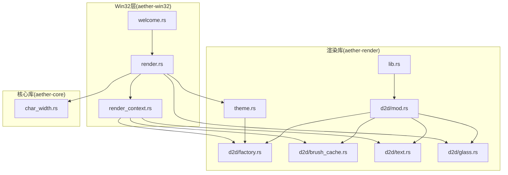
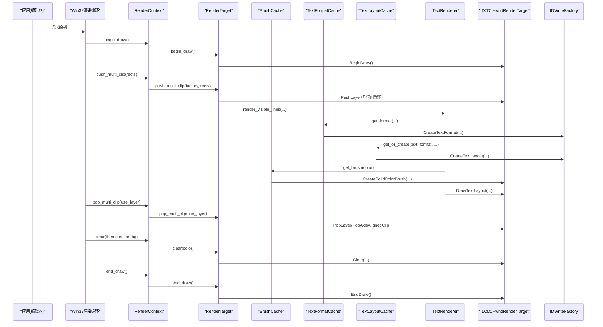
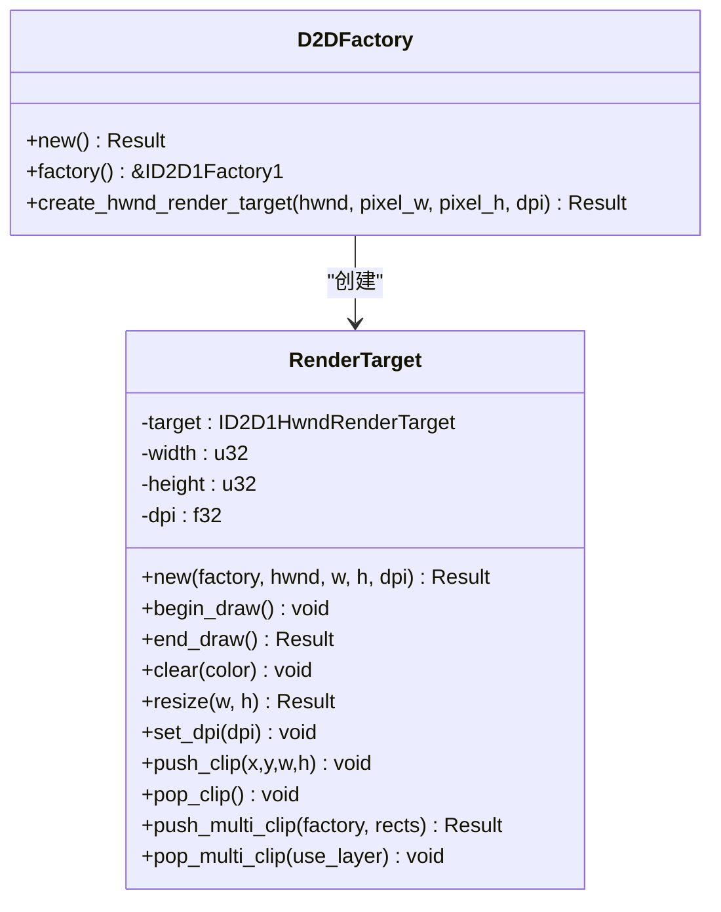
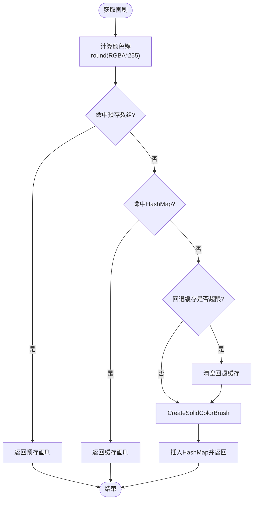
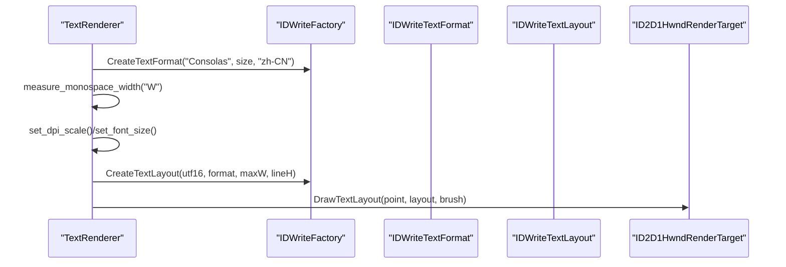
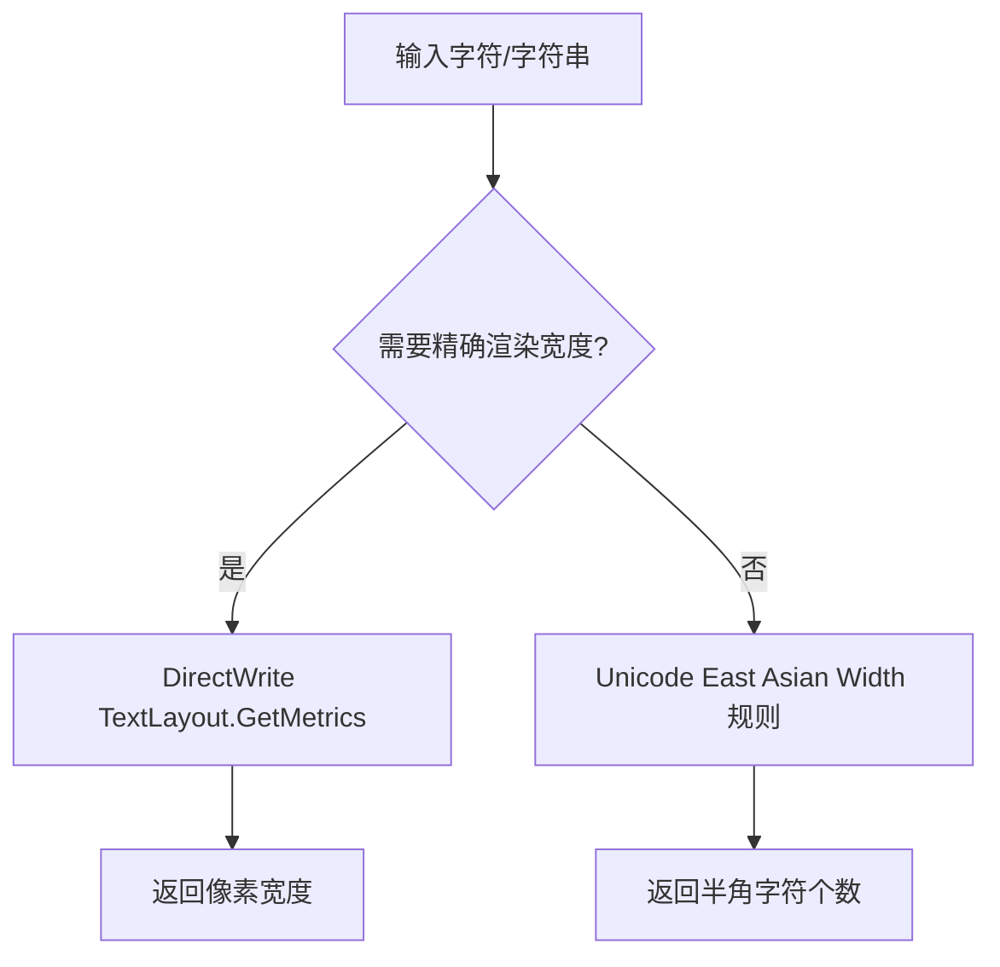
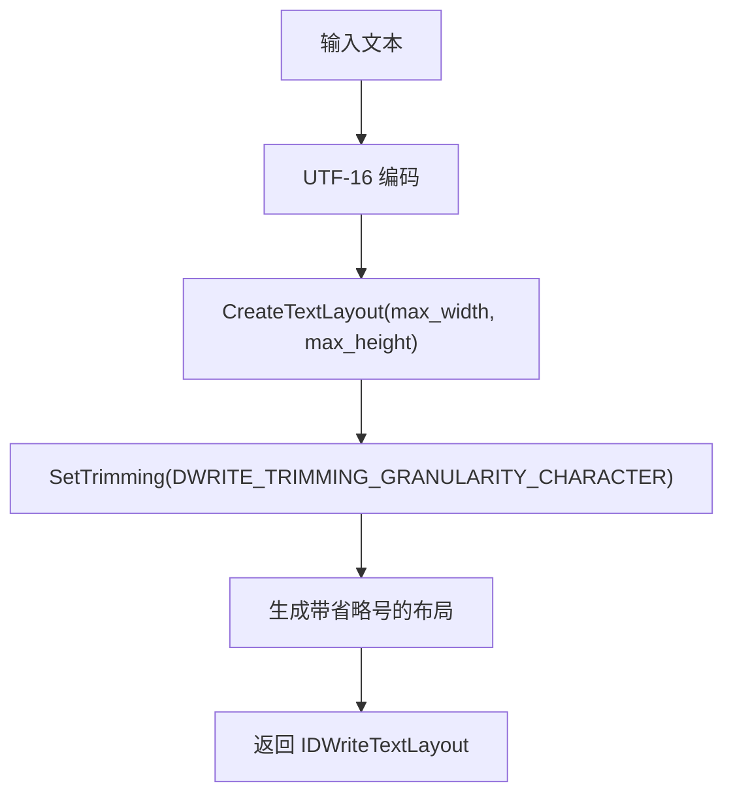
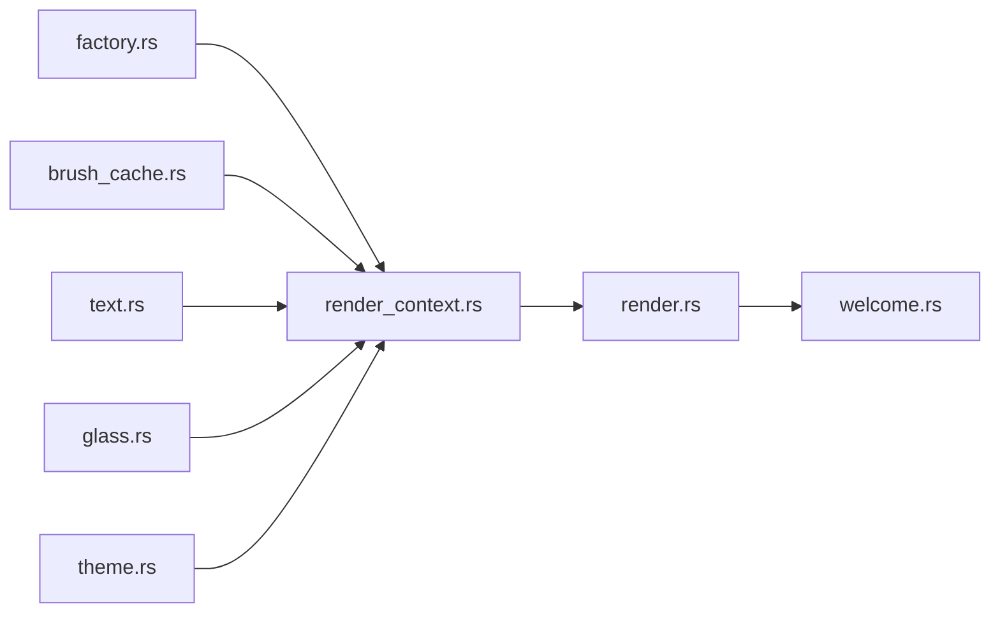

# Direct2D 渲染管线

<cite>
**本文引用的文件**   
- [crates/aether-render/src/lib.rs](file://crates/aether-render/src/lib.rs)
- [crates/aether-render/src/d2d/mod.rs](file://crates/aether-render/src/d2d/mod.rs)
- [crates/aether-render/src/d2d/factory.rs](file://crates/aether-render/src/d2d/factory.rs)
- [crates/aether-render/src/d2d/brush_cache.rs](file://crates/aether-render/src/d2d/brush_cache.rs)
- [crates/aether-render/src/d2d/text.rs](file://crates/aether-render/src/d2d/text.rs)
- [crates/aether-render/src/d2d/glass.rs](file://crates/aether-render/src/d2d/glass.rs)
- [crates/aether-render/src/theme.rs](file://crates/aether-render/src/theme.rs)
- [crates/aether-win32/src/render_context.rs](file://crates/aether-win32/src/render_context.rs)
- [crates/aether-win32/src/render.rs](file://crates/aether-win32/src/render.rs)
- [crates/aether-win32/src/welcome.rs](file://crates/aether-win32/src/welcome.rs)
- [crates/aether-core/src/char_width.rs](file://crates/aether-core/src/char_width.rs)
</cite>

## 更新摘要
**变更内容**   
- 新增 TextLayoutCache.create_ellipsis_layout() 方法文档，支持文本省略号截断功能
- 更新侧边栏文件树渲染流程，说明长文件名处理机制
- 增强文本布局缓存系统的功能描述
- 补充 UI 元素渲染优化策略

## 目录
1. [简介](#简介)
2. [项目结构](#项目结构)
3. [核心组件](#核心组件)
4. [架构总览](#架构总览)
5. [详细组件分析](#详细组件分析)
6. [依赖关系分析](#依赖关系分析)
7. [性能考量](#性能考量)
8. [故障排查指南](#故障排查指南)
9. [结论](#结论)
10. [附录](#附录)

## 简介
本技术文档围绕 Direct2D/DirectWrite 渲染管线展开，聚焦以下目标：
- 解释工厂模式如何管理图形对象生命周期（ID2D1Factory1、IDWriteFactory）
- 描述文本渲染流程、字体加载机制与字符宽度计算
- 阐述画刷缓存系统的工作原理、内存优化策略与 GPU 资源管理
- 说明渲染状态管理、变换矩阵应用与抗锯齿配置
- 提供性能调优指南、调试技巧与常见问题解决方案

该实现采用分层设计：aether-render 封装 Direct2D/DirectWrite 能力；aether-win32 负责窗口与渲染上下文调度；aether-core 提供字符宽度等基础算法。

## 项目结构
- aether-render
  - d2d: 封装 D2D/DW 工厂、渲染目标、画刷缓存、文本格式与布局缓存、玻璃效果绘制
  - theme: 主题与语法高亮颜色定义
- aether-win32
  - render_context: 统一持有并管理渲染目标、各类缓存，暴露 begin/end_draw、裁剪、清理等接口
  - render: 主渲染循环，脏矩形推断、区域裁剪、面板绘制顺序、设备丢失处理
- aether-core
  - char_width: Unicode East Asian Width 精简实现，用于 UI 布局与列宽估算

图表来源
- [crates/aether-render/src/lib.rs:1-4](file://crates/aether-render/src/lib.rs#L1-L4)
- [crates/aether-render/src/d2d/mod.rs:1-5](file://crates/aether-render/src/d2d/mod.rs#L1-L5)
- [crates/aether-render/src/d2d/factory.rs:1-63](file://crates/aether-render/src/d2d/factory.rs#L1-L63)
- [crates/aether-render/src/d2d/brush_cache.rs:1-44](file://crates/aether-render/src/d2d/brush_cache.rs#L1-L44)
- [crates/aether-render/src/d2d/text.rs:1-22](file://crates/aether-render/src/d2d/text.rs#L1-L22)
- [crates/aether-render/src/d2d/glass.rs:1-12](file://crates/aether-render/src/d2d/glass.rs#L1-L12)
- [crates/aether-render/src/theme.rs:1-31](file://crates/aether-render/src/theme.rs#L1-L31)
- [crates/aether-win32/src/render_context.rs:1-31](file://crates/aether-win32/src/render_context.rs#L1-L31)
- [crates/aether-win32/src/render.rs:1-20](file://crates/aether-win32/src/render.rs#L1-L20)
- [crates/aether-core/src/char_width.rs:1-37](file://crates/aether-core/src/char_width.rs#L1-L37)

章节来源
- [crates/aether-render/src/lib.rs:1-4](file://crates/aether-render/src/lib.rs#L1-L4)
- [crates/aether-render/src/d2d/mod.rs:1-5](file://crates/aether-render/src/d2d/mod.rs#L1-L5)

## 核心组件
- 工厂与渲染目标
  - D2DFactory：封装 ID2D1Factory1，创建 HWND 渲染目标，设置硬件加速与 DPI
  - RenderTarget：包装 ID2D1HwndRenderTarget，提供 BeginDraw/EndDraw/Clear/Resize/SetDpi/Clip/Layer 等
- 画刷与文本缓存
  - BrushCache：预存常用纯色画刷 + HashMap 回退，避免每帧创建 COM 对象
  - TextFormatCache：预存常用文本格式（左对齐/右对齐/居中），按 key 复用
  - TextLayoutCache：缓存 IDWriteTextLayout，减少频繁创建开销，支持省略号截断
- 文本渲染器
  - TextRenderer：基于 DirectWrite 的文本测量与绘制，支持 DPI 缩放与字体大小调整
- 玻璃效果
  - glass 模块：半透明面板、柔和边框、阴影、光晕选择等绘制辅助
- 主题
  - Theme/SyntaxColors：深色与毛玻璃主题，语义 token 到颜色的映射
- 渲染上下文
  - RenderContext：集中持有 D2D 渲染目标与三类缓存，提供 begin/end_draw、多矩形裁剪、设备丢失恢复等

章节来源
- [crates/aether-render/src/d2d/factory.rs:14-126](file://crates/aether-render/src/d2d/factory.rs#L14-L126)
- [crates/aether-render/src/d2d/brush_cache.rs:25-106](file://crates/aether-render/src/d2d/brush_cache.rs#L25-L106)
- [crates/aether-render/src/d2d/brush_cache.rs:108-314](file://crates/aether-render/src/d2d/brush_cache.rs#L108-L314)
- [crates/aether-render/src/d2d/text.rs:14-102](file://crates/aether-render/src/d2d/text.rs#L14-L102)
- [crates/aether-render/src/d2d/glass.rs:12-154](file://crates/aether-render/src/d2d/glass.rs#L12-L154)
- [crates/aether-render/src/theme.rs:8-86](file://crates/aether-render/src/theme.rs#L8-L86)
- [crates/aether-win32/src/render_context.rs:6-31](file://crates/aether-win32/src/render_context.rs#L6-L31)

## 架构总览
Direct2D/DirectWrite 渲染管线由"工厂—渲染目标—缓存—绘制"四层组成。顶层渲染循环在 aether-win32 中编排，底层资源在 aether-render 中封装。

图表来源
- [crates/aether-win32/src/render.rs:385-746](file://crates/aether-win32/src/render.rs#L385-L746)
- [crates/aether-win32/src/render_context.rs:65-155](file://crates/aether-win32/src/render_context.rs#L65-L155)
- [crates/aether-render/src/d2d/factory.rs:90-126](file://crates/aether-render/src/d2d/factory.rs#L90-L126)
- [crates/aether-render/src/d2d/brush_cache.rs:71-99](file://crates/aether-render/src/d2d/brush_cache.rs#L71-L99)
- [crates/aether-render/src/d2d/brush_cache.rs:229-269](file://crates/aether-render/src/d2d/brush_cache.rs#L229-L269)
- [crates/aether-render/src/d2d/brush_cache.rs:405-442](file://crates/aether-render/src/d2d/brush_cache.rs#L405-L442)
- [crates/aether-render/src/d2d/text.rs:190-221](file://crates/aether-render/src/d2d/text.rs#L190-L221)

## 详细组件分析

### 工厂模式与对象生命周期
- D2DFactory
  - 使用单线程工厂类型创建 ID2D1Factory1
  - 提供 create_hwnd_render_target，指定硬件渲染目标、DPI、像素尺寸
- RenderTarget
  - 封装 BeginDraw/EndDraw/Clear/Resize/SetDpi
  - 支持轴对齐裁剪与多矩形裁剪（通过 GeometryGroup + Layer）
  - 维护 width/height/dpi 等状态

图表来源
- [crates/aether-render/src/d2d/factory.rs:14-63](file://crates/aether-render/src/d2d/factory.rs#L14-L63)
- [crates/aether-render/src/d2d/factory.rs:65-126](file://crates/aether-render/src/d2d/factory.rs#L65-L126)
- [crates/aether-render/src/d2d/factory.rs:143-271](file://crates/aether-render/src/d2d/factory.rs#L143-L271)

章节来源
- [crates/aether-render/src/d2d/factory.rs:14-126](file://crates/aether-render/src/d2d/factory.rs#L14-L126)
- [crates/aether-render/src/d2d/factory.rs:143-271](file://crates/aether-render/src/d2d/factory.rs#L143-L271)

### 画刷缓存系统与 GPU 资源管理
- BrushCache
  - 预存常用颜色画刷（线性扫描快路径）+ HashMap 回退
  - 超过最大条目数时清空回退缓存，避免无界增长
  - 提供 init_common_brushes 在渲染目标就绪后批量预热
- TextFormatCache
  - 预存三种常用格式（代码/行号/居中），key 包含字号、字重、对齐方式
  - 提供 measure_text_width 与 text_position_x 用于菜单/光标定位
- TextLayoutCache
  - 缓存 IDWriteTextLayout，按文本内容键值复用
  - 字号变化时自动清空缓存，避免布局失效
  - 提供 create_ellipsis_layout 用于文件树省略号场景

图表来源
- [crates/aether-render/src/d2d/brush_cache.rs:71-99](file://crates/aether-render/src/d2d/brush_cache.rs#L71-L99)
- [crates/aether-render/src/d2d/brush_cache.rs:479-487](file://crates/aether-render/src/d2d/brush_cache.rs#L479-L487)

章节来源
- [crates/aether-render/src/d2d/brush_cache.rs:25-106](file://crates/aether-render/src/d2d/brush_cache.rs#L25-L106)
- [crates/aether-render/src/d2d/brush_cache.rs:108-314](file://crates/aether-render/src/d2d/brush_cache.rs#L108-L314)
- [crates/aether-render/src/d2d/brush_cache.rs:376-477](file://crates/aether-render/src/d2d/brush_cache.rs#L376-L477)

### 文本渲染流程与字体加载
- TextRenderer
  - 构造时创建 IDWriteFactory 与默认文本格式（Consolas，中文区域 zh-CN）
  - 使用 DirectWrite 实测等宽字符推进宽度，替代硬编码比例
  - set_dpi_scale/set_font_size 动态重建文本格式并重新测量字符宽度
  - render_line 将一行文本按 token 分段绘制，使用 DrawTextLayout
  - render_visible_lines 根据滚动与视口计算可见行范围并绘制

图表来源
- [crates/aether-render/src/d2d/text.rs:24-72](file://crates/aether-render/src/d2d/text.rs#L24-L72)
- [crates/aether-render/src/d2d/text.rs:74-132](file://crates/aether-render/src/d2d/text.rs#L74-L132)
- [crates/aether-render/src/d2d/text.rs:138-187](file://crates/aether-render/src/d2d/text.rs#L138-L187)

章节来源
- [crates/aether-render/src/d2d/text.rs:14-102](file://crates/aether-render/src/d2d/text.rs#L14-L102)
- [crates/aether-render/src/d2d/text.rs:138-221](file://crates/aether-render/src/d2d/text.rs#L138-L221)

### 字符宽度计算与布局
- 两种宽度计算路径
  - DirectWrite 实测：measure_monospace_width 使用 TextLayout::GetMetrics 获取实际 advance 宽度
  - Unicode 显示宽度：aether-core 的 char_width 基于 East Asian Width 规则估算列宽（用于 UI 布局与列计数）
- 二者互补：前者用于精确渲染，后者用于快速布局与列宽统计

图表来源
- [crates/aether-render/src/d2d/text.rs:59-72](file://crates/aether-render/src/d2d/text.rs#L59-L72)
- [crates/aether-core/src/char_width.rs:12-37](file://crates/aether-core/src/char_width.rs#L12-L37)

章节来源
- [crates/aether-core/src/char_width.rs:12-37](file://crates/aether-core/src/char_width.rs#L12-L37)
- [crates/aether-render/src/d2d/text.rs:59-72](file://crates/aether-render/src/d2d/text.rs#L59-L72)

### 渲染状态管理、裁剪与抗锯齿
- 渲染状态
  - RenderContext 统一管理 begin/end_draw、clear、fill_rect、set_dpi
  - 设备丢失时 handle_device_lost 清理所有资源并重建
- 裁剪
  - 单矩形：PushAxisAlignedClip/PopAxisAlignedClip 快路径
  - 多矩形：GeometryGroup(Union) + PushLayer/PopLayer，避免合并包围盒导致重绘面积膨胀
- 抗锯齿
  - 渲染目标属性未显式设置抗锯齿模式，默认使用硬件渲染目标的默认行为
  - 裁剪区域使用 per-primitive 或 aliased 模式以平衡质量与性能

章节来源
- [crates/aether-win32/src/render_context.rs:65-155](file://crates/aether-win32/src/render_context.rs#L65-L155)
- [crates/aether-render/src/d2d/factory.rs:90-126](file://crates/aether-render/src/d2d/factory.rs#L90-L126)
- [crates/aether-render/src/d2d/factory.rs:143-271](file://crates/aether-render/src/d2d/factory.rs#L143-L271)

### 变换矩阵应用
- 在多矩形裁剪的 Layer 参数中，maskTransform 使用 Matrix3x2::default()（单位矩阵）
- 如需对裁剪掩码进行缩放/旋转/平移，可替换为自定义 Matrix3x2 以实现更复杂的遮罩变换

章节来源
- [crates/aether-render/src/d2d/factory.rs:226-246](file://crates/aether-render/src/d2d/factory.rs#L226-L246)

### 玻璃效果绘制
- draw_glass_panel：背景填充 + 可选四边细边框
- draw_glow_selection：外发光 + 内选区叠加
- draw_panel_shadow：底部渐变阴影条
- draw_rounded_panel：模拟圆角高光

章节来源
- [crates/aether-render/src/d2d/glass.rs:12-154](file://crates/aether-render/src/d2d/glass.rs#L12-L154)

### 文本省略号截断功能

**新增** TextLayoutCache 现支持 create_ellipsis_layout() 方法，专门用于处理长文本的省略号截断场景。

#### 功能特性
- **字符级省略号**：使用 DirectWrite 的原生 DWRITE_TRIMMING 机制，在字符边界处插入省略号
- **自适应宽度**：根据指定的 max_width 自动截断文本，确保不超过容器宽度
- **UI 优化**：专为侧边栏文件树、欢迎页面路径显示等 UI 元素设计

#### 实现原理

图表来源
- [crates/aether-render/src/d2d/brush_cache.rs:454-478](file://crates/aether-render/src/d2d/brush_cache.rs#L454-L478)

#### 应用场景
- **侧边栏文件树**：处理超长文件名，避免文本重叠和换行问题
- **欢迎页面路径**：智能折叠长路径，保留关键目录信息
- **其他 UI 元素**：任何需要限制文本显示宽度的界面组件

章节来源
- [crates/aether-render/src/d2d/brush_cache.rs:454-478](file://crates/aether-render/src/d2d/brush_cache.rs#L454-L478)
- [crates/aether-win32/src/render.rs:10043-10060](file://crates/aether-win32/src/render.rs#L10043-L10060)
- [crates/aether-win32/src/welcome.rs:1261-1336](file://crates/aether-win32/src/welcome.rs#L1261-L1336)

## 依赖关系分析
- aether-render 内部耦合
  - factory 被 render_context 与上层渲染循环使用
  - brush_cache 与 text 模块共享 ID2D1HwndRenderTarget 与 IDWriteFactory
  - theme 提供颜色常量，供 text 与 glass 使用
- aether-win32 与 aether-render 的协作
  - render_context 作为中间层，屏蔽 COM 对象细节，向上提供安全 API
  - render 编排脏矩形、裁剪、绘制顺序与错误恢复

图表来源
- [crates/aether-render/src/d2d/mod.rs:1-5](file://crates/aether-render/src/d2d/mod.rs#L1-L5)
- [crates/aether-win32/src/render_context.rs:1-31](file://crates/aether-win32/src/render_context.rs#L1-L31)
- [crates/aether-win32/src/render.rs:1-20](file://crates/aether-win32/src/render.rs#L1-L20)

章节来源
- [crates/aether-render/src/d2d/mod.rs:1-5](file://crates/aether-render/src/d2d/mod.rs#L1-L5)
- [crates/aether-win32/src/render_context.rs:1-31](file://crates/aether-win32/src/render_context.rs#L1-L31)
- [crates/aether-win32/src/render.rs:1-20](file://crates/aether-win32/src/render.rs#L1-L20)

## 性能考量
- 减少 COM 对象分配
  - 画刷缓存：预存常用色 + HashMap 回退，超限清空回退缓存
  - 文本格式缓存：预存三种常用格式，按 key 复用
  - 文本布局缓存：按文本内容复用 TextLayout，字号变化时清空
- 局部重绘与裁剪
  - 脏矩形推断与多矩形并集裁剪，避免全窗口重绘
  - 单矩形走快路径，多矩形走 Layer 几何裁剪
- 设备丢失恢复
  - 检测 EndDraw 错误码，重建渲染目标并重新预热缓存
- 字体与 DPI
  - DPI 变化时重建文本格式并重新测量字符宽度，保证布局一致
- **文本省略号优化**
  - create_ellipsis_layout 每次重绘创建新布局，避免缓存滞后问题
  - 适用于节点数量较少的侧边栏场景，牺牲少量性能换取即时响应
- 建议
  - 合理设置 MAX_BRUSH_CACHE_ENTRIES 与 MAX_TEXT_LAYOUT_CACHE_ENTRIES，依据主题与 UI 复杂度调优
  - 在高频重复文本（关键字、标识符等）较多的场景下，TextLayoutCache 命中率极高，收益显著
  - 对于复杂 UI 面板，优先使用多矩形裁剪而非全窗口清除
  - 长文本截断场景使用 create_ellipsis_layout 而非手动字符串处理，提升渲染一致性

[本节为通用指导，不直接分析具体文件]

## 故障排查指南
- 设备丢失（D2DERR_RECREATE_TARGET）
  - 现象：EndDraw 返回特定错误码
  - 处理：清理渲染目标与缓存，重建渲染目标并重新初始化常用资源
- 文本错位或光标位置偏差
  - 可能原因：TextLayout 创建时附加了 null 终止符导致额外进位宽度
  - 处理：确保 UTF-16 切片不含 U+0000，与 measure_monospace_width (text.rs) 保持一致
- 多矩形裁剪无效或重绘面积过大
  - 检查是否误用单矩形快路径标志，确保 push/pop 配对正确
  - 确认 rects 列表为空或非正尺寸时的分支逻辑
- 字体不可见或异常
  - 确认 Consolas 可用且语言区域 zh-CN 有效
  - 检查 DPI 缩放后是否重建了文本格式
- **文本省略号显示异常**
  - 现象：文件名截断不正确或省略号位置错误
  - 处理：检查 max_width 计算是否正确，确认文本布局高度足够容纳省略号
  - 验证：确保使用 DWRITE_TRIMMING_GRANULARITY_CHARACTER 而非 WORD 级别截断

章节来源
- [crates/aether-win32/src/render.rs:704-746](file://crates/aether-win32/src/render.rs#L704-L746)
- [crates/aether-render/src/d2d/brush_cache.rs:428-442](file://crates/aether-render/src/d2d/brush_cache.rs#L428-L442)
- [crates/aether-render/src/d2d/factory.rs:255-271](file://crates/aether-render/src/d2d/factory.rs#L255-L271)

## 结论
该 Direct2D 渲染管线通过工厂模式统一管理图形对象生命周期，结合多层缓存显著降低 COM 对象分配与 GPU 资源压力。文本渲染流程基于 DirectWrite，兼顾精度与性能；多矩形裁剪与脏矩形机制提升局部重绘效率；主题与玻璃效果增强视觉体验。**新增的文本省略号截断功能进一步增强了 UI 元素的渲染能力，特别是在侧边栏文件树等长文本场景中提供了更好的用户体验**。整体架构清晰、可扩展性强，适合大型编辑器的持续演进。

[本节为总结性内容，不直接分析具体文件]

## 附录
- 关键 API 与职责速览
  - D2DFactory：创建与持有 ID2D1Factory1，构建渲染目标
  - RenderTarget：BeginDraw/EndDraw/Clear/Resize/SetDpi/Clip/Layer
  - BrushCache：纯色画刷缓存
  - TextFormatCache：文本格式缓存与测量
  - TextLayoutCache：文本布局缓存，**新增 create_ellipsis_layout 支持省略号截断**
  - TextRenderer：文本测量与绘制
  - glass：玻璃效果绘制工具
  - Theme：主题与语法高亮颜色
  - RenderContext：渲染上下文聚合与设备丢失恢复

章节来源
- [crates/aether-render/src/d2d/factory.rs:14-126](file://crates/aether-render/src/d2d/factory.rs#L14-L126)
- [crates/aether-render/src/d2d/brush_cache.rs:25-106](file://crates/aether-render/src/d2d/brush_cache.rs#L25-L106)
- [crates/aether-render/src/d2d/brush_cache.rs:108-314](file://crates/aether-render/src/d2d/brush_cache.rs#L108-L314)
- [crates/aether-render/src/d2d/brush_cache.rs:376-477](file://crates/aether-render/src/d2d/brush_cache.rs#L376-L477)
- [crates/aether-render/src/d2d/brush_cache.rs:454-478](file://crates/aether-render/src/d2d/brush_cache.rs#L454-L478)
- [crates/aether-render/src/d2d/text.rs:14-102](file://crates/aether-render/src/d2d/text.rs#L14-L102)
- [crates/aether-render/src/d2d/glass.rs:12-154](file://crates/aether-render/src/d2d/glass.rs#L12-L154)
- [crates/aether-render/src/theme.rs:8-86](file://crates/aether-render/src/theme.rs#L8-L86)
- [crates/aether-win32/src/render_context.rs:6-31](file://crates/aether-win32/src/render_context.rs#L6-L31)