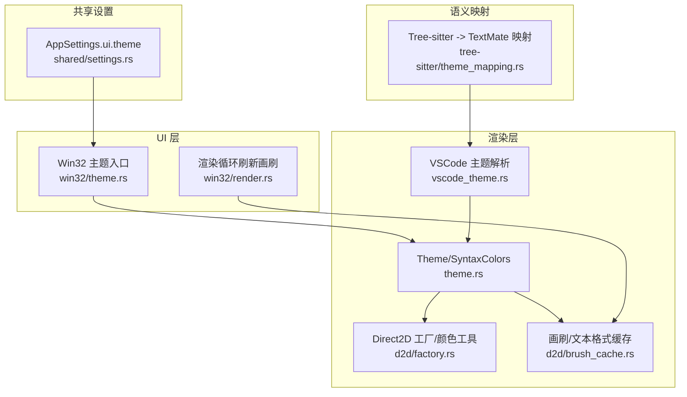
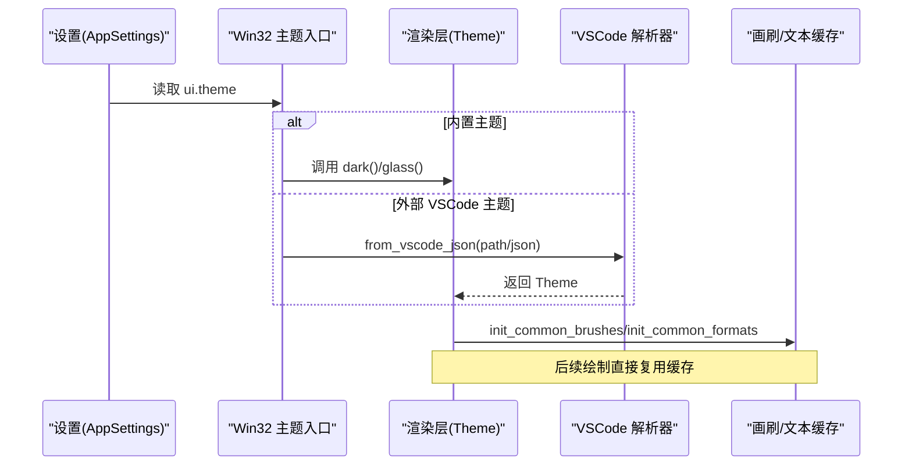
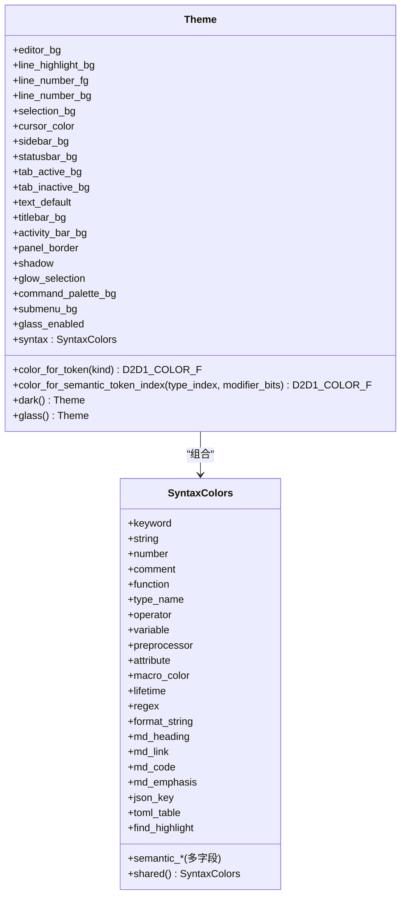
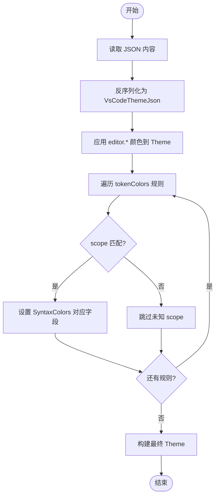
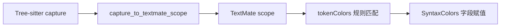
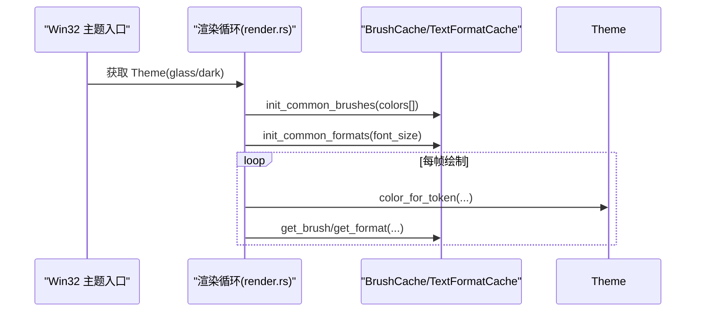
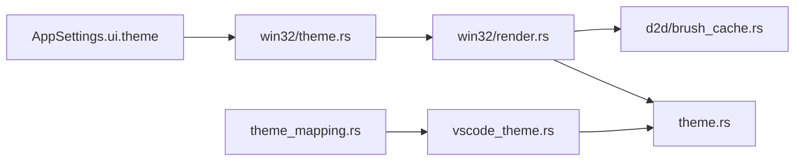

# 主题系统架构

<cite>
**本文引用的文件**   
- [crates/aether-render/src/theme.rs](file://crates/aether-render/src/theme.rs)
- [crates/aether-render/src/vscode_theme.rs](file://crates/aether-render/src/vscode_theme.rs)
- [crates/aether-render/src/d2d/factory.rs](file://crates/aether-render/src/d2d/factory.rs)
- [crates/aether-render/src/d2d/brush_cache.rs](file://crates/aether-render/src/d2d/brush_cache.rs)
- [crates/aether-win32/src/theme.rs](file://crates/aether-win32/src/theme.rs)
- [crates/aether-win32/src/render.rs](file://crates/aether-win32/src/render.rs)
- [crates/aether-tree-sitter/src/theme_mapping.rs](file://crates/aether-tree-sitter/src/theme_mapping.rs)
- [crates/aether-shared/src/settings.rs](file://crates/aether-shared/src/settings.rs)
</cite>

## 目录
1. [简介](#简介)
2. [项目结构](#项目结构)
3. [核心组件](#核心组件)
4. [架构总览](#架构总览)
5. [详细组件分析](#详细组件分析)
6. [依赖关系分析](#依赖关系分析)
7. [性能与缓存策略](#性能与缓存策略)
8. [自定义主题开发指南](#自定义主题开发指南)
9. [调试与故障排查](#调试与故障排查)
10. [结论](#结论)

## 简介
本文件围绕“主题系统”的架构进行系统化说明，覆盖数据模型设计、颜色管理机制、样式继承规则、VSCode 主题格式解析与转换、动态切换与渲染更新机制、缓存策略与性能优化，以及自定义主题创建、变量定义、语法高亮配置和兼容性考虑。目标是帮助开发者快速理解并高效扩展主题能力。

## 项目结构
主题系统横跨渲染层、Win32 UI 层、树 sitter 映射层与共享设置层：
- 渲染层（aether-render）
  - 主题数据模型与内置主题：theme.rs
  - VSCode 主题 JSON 解析与转换：vscode_theme.rs
  - Direct2D 工厂与颜色工具：d2d/factory.rs
  - 画刷与文本格式缓存：d2d/brush_cache.rs
- Win32 UI 层（aether-win32）
  - 主题选择入口与默认值：theme.rs
  - 渲染循环中刷新常用画刷：render.rs
- 语义映射层（aether-tree-sitter）
  - Tree-sitter capture 到 TextMate scope 的映射：theme_mapping.rs
- 共享设置（aether-shared）
  - 应用设置中的主题键与持久化：settings.rs

图表来源
- [crates/aether-render/src/theme.rs](file://crates/aether-render/src/theme.rs)
- [crates/aether-render/src/vscode_theme.rs](file://crates/aether-render/src/vscode_theme.rs)
- [crates/aether-render/src/d2d/factory.rs](file://crates/aether-render/src/d2d/factory.rs)
- [crates/aether-render/src/d2d/brush_cache.rs](file://crates/aether-render/src/d2d/brush_cache.rs)
- [crates/aether-win32/src/theme.rs](file://crates/aether-win32/src/theme.rs)
- [crates/aether-win32/src/render.rs](file://crates/aether-win32/src/render.rs)
- [crates/aether-tree-sitter/src/theme_mapping.rs](file://crates/aether-tree-sitter/src/theme_mapping.rs)
- [crates/aether-shared/src/settings.rs](file://crates/aether-shared/src/settings.rs)

章节来源
- [crates/aether-render/src/theme.rs](file://crates/aether-render/src/theme.rs)
- [crates/aether-render/src/vscode_theme.rs](file://crates/aether-render/src/vscode_theme.rs)
- [crates/aether-render/src/d2d/factory.rs](file://crates/aether-render/src/d2d/factory.rs)
- [crates/aether-render/src/d2d/brush_cache.rs](file://crates/aether-render/src/d2d/brush_cache.rs)
- [crates/aether-win32/src/theme.rs](file://crates/aether-win32/src/theme.rs)
- [crates/aether-win32/src/render.rs](file://crates/aether-win32/src/render.rs)
- [crates/aether-tree-sitter/src/theme_mapping.rs](file://crates/aether-tree-sitter/src/theme_mapping.rs)
- [crates/aether-shared/src/settings.rs](file://crates/aether-shared/src/settings.rs)

## 核心组件
- 主题数据模型
  - Theme：包含编辑器背景、行号、选择区、光标、侧边栏、状态栏、标签页、文本默认色、毛玻璃效果相关字段及 SyntaxColors。
  - SyntaxColors：涵盖关键字、字符串、数字、注释、函数、类型名、操作符、变量、预处理、属性、宏、生命周期、正则、格式化字符串、Markdown、JSON/TOML、查找高亮以及大量语义令牌颜色。
- 内置主题
  - dark()：经典深色主题，所有颜色不透明。
  - glass()：毛玻璃主题，部分区域半透明，启用 glass_enabled 标志。
- VSCode 主题解析
  - VsCodeThemeJson：支持 name、type、colors、tokenColors、semanticHighlighting、semanticTokenColors。
  - TokenColorRule/TokenScope/TokenSettings：TextMate scope 列表与前景/背景/字体样式。
  - from_vscode_json/from_vscode_json_str/from_vscode：从文件或字符串加载并转换为内部 Theme。
- 颜色工具与工厂
  - color_f：构造 D2D1_COLOR_F。
  - colors 模块：提供深色主题默认颜色常量。
- 渲染缓存
  - BrushCache：预存常用颜色画刷 + HashMap 回退，避免每帧创建 COM 对象。
  - TextFormatCache/TextLayoutCache：复用文本格式与布局对象，减少开销。
- 语义映射
  - capture_to_textmate_scope/build_theme_mapping：将 Tree-sitter capture 名称映射为 TextMate scope，便于与 VSCode 主题生态对接。
- UI 集成
  - win32/theme.rs：提供 glass_theme()/dark_theme() 快捷方法。
  - win32/render.rs：在初始化或设备重建时批量初始化常用画刷与文本格式。
- 设置持久化
  - AppSettings.ui.theme：保存当前主题标识（如 "glass"/"dark"）。

章节来源
- [crates/aether-render/src/theme.rs](file://crates/aether-render/src/theme.rs)
- [crates/aether-render/src/vscode_theme.rs](file://crates/aether-render/src/vscode_theme.rs)
- [crates/aether-render/src/d2d/factory.rs](file://crates/aether-render/src/d2d/factory.rs)
- [crates/aether-render/src/d2d/brush_cache.rs](file://crates/aether-render/src/d2d/brush_cache.rs)
- [crates/aether-tree-sitter/src/theme_mapping.rs](file://crates/aether-tree-sitter/src/theme_mapping.rs)
- [crates/aether-win32/src/theme.rs](file://crates/aether-win32/src/theme.rs)
- [crates/aether-win32/src/render.rs](file://crates/aether-win32/src/render.rs)
- [crates/aether-shared/src/settings.rs](file://crates/aether-shared/src/settings.rs)

## 架构总览
主题系统的数据流与职责划分如下：
- 设置层读取 ui.theme 决定使用哪个内置主题或是否加载外部 VSCode 主题。
- 渲染层根据 Theme 提供颜色查询接口（通用 token 与语义令牌）。
- VSCode 主题解析器将 JSON 映射到 Theme 与 SyntaxColors。
- 渲染循环在主题变化或设备重建时批量初始化画刷与文本格式缓存。
- 语义映射桥接 Tree-sitter 与 TextMate scope，使 VSCode 主题可无缝生效。

图表来源
- [crates/aether-shared/src/settings.rs](file://crates/aether-shared/src/settings.rs)
- [crates/aether-win32/src/theme.rs](file://crates/aether-win32/src/theme.rs)
- [crates/aether-render/src/theme.rs](file://crates/aether-render/src/theme.rs)
- [crates/aether-render/src/vscode_theme.rs](file://crates/aether-render/src/vscode_theme.rs)
- [crates/aether-render/src/d2d/brush_cache.rs](file://crates/aether-render/src/d2d/brush_cache.rs)

## 详细组件分析

### 主题数据模型与颜色管理
- Theme 结构体集中管理 UI 与编辑器颜色，并提供：
  - color_for_token：按 TokenKind 返回对应颜色。
  - color_for_semantic_token_index：按语义令牌索引返回颜色。
- SyntaxColors::shared() 提供暗色/玻璃主题共享的语法颜色，消除重复代码。
- 颜色来源：
  - 内置主题通过 d2d/factory.colors 模块提供的常量。
  - VSCode 主题通过十六进制颜色解析后覆盖默认值。

图表来源
- [crates/aether-render/src/theme.rs](file://crates/aether-render/src/theme.rs)
- [crates/aether-render/src/d2d/factory.rs](file://crates/aether-render/src/d2d/factory.rs)

章节来源
- [crates/aether-render/src/theme.rs](file://crates/aether-render/src/theme.rs)
- [crates/aether-render/src/d2d/factory.rs](file://crates/aether-render/src/d2d/factory.rs)

### VSCode 主题解析与转换流程
- 输入：VSCode 主题 JSON（支持 editor.* 颜色键与 tokenColors 规则）。
- 处理：
  - 解析 colors 映射到 Theme 的 UI 颜色字段。
  - 解析 tokenColors 规则，将 TextMate scope 映射到 SyntaxColors 字段。
  - 未匹配或无效颜色保持默认（dark 默认）。
- 输出：Theme 实例，可直接用于渲染。

图表来源
- [crates/aether-render/src/vscode_theme.rs](file://crates/aether-render/src/vscode_theme.rs)

章节来源
- [crates/aether-render/src/vscode_theme.rs](file://crates/aether-render/src/vscode_theme.rs)

### 语义令牌与 TextMate 映射
- Tree-sitter capture 名称通过 theme_mapping 映射为 TextMate scope，从而与 VSCode 主题的 tokenColors 规则对齐。
- 该映射确保不同语言的语法元素能正确命中主题规则。

图表来源
- [crates/aether-tree-sitter/src/theme_mapping.rs](file://crates/aether-tree-sitter/src/theme_mapping.rs)
- [crates/aether-render/src/vscode_theme.rs](file://crates/aether-render/src/vscode_theme.rs)

章节来源
- [crates/aether-tree-sitter/src/theme_mapping.rs](file://crates/aether-tree-sitter/src/theme_mapping.rs)
- [crates/aether-render/src/vscode_theme.rs](file://crates/aether-render/src/vscode_theme.rs)

### 动态主题切换与渲染更新
- 入口：win32/theme.rs 提供 glass_theme()/dark_theme() 便捷方法。
- 渲染循环：win32/render.rs 在初始化或设备重建时批量初始化常用画刷与文本格式，确保主题切换后的即时生效。
- 颜色查询：Theme.color_for_token/color_for_semantic_token_index 在绘制时被频繁调用。

图表来源
- [crates/aether-win32/src/theme.rs](file://crates/aether-win32/src/theme.rs)
- [crates/aether-win32/src/render.rs](file://crates/aether-win32/src/render.rs)
- [crates/aether-render/src/d2d/brush_cache.rs](file://crates/aether-render/src/d2d/brush_cache.rs)
- [crates/aether-render/src/theme.rs](file://crates/aether-render/src/theme.rs)

章节来源
- [crates/aether-win32/src/theme.rs](file://crates/aether-win32/src/theme.rs)
- [crates/aether-win32/src/render.rs](file://crates/aether-win32/src/render.rs)
- [crates/aether-render/src/d2d/brush_cache.rs](file://crates/aether-render/src/d2d/brush_cache.rs)
- [crates/aether-render/src/theme.rs](file://crates/aether-render/src/theme.rs)

## 依赖关系分析
- 低耦合：Theme 仅依赖颜色工具与 TokenKind；VSCode 解析器独立于渲染细节。
- 关键依赖链：
  - settings.ui.theme → win32/theme → render → brush/text cache
  - vscode_theme → theme/syntax_colors
  - tree-sitter mapping → vscode_theme
- 潜在风险：
  - 若新增 TokenKind 或语义令牌，需同步更新映射与颜色查询逻辑。
  - 外部 VSCode 主题字段缺失或不合法时应稳健回退至默认值。

图表来源
- [crates/aether-shared/src/settings.rs](file://crates/aether-shared/src/settings.rs)
- [crates/aether-win32/src/theme.rs](file://crates/aether-win32/src/theme.rs)
- [crates/aether-win32/src/render.rs](file://crates/aether-win32/src/render.rs)
- [crates/aether-render/src/d2d/brush_cache.rs](file://crates/aether-render/src/d2d/brush_cache.rs)
- [crates/aether-render/src/theme.rs](file://crates/aether-render/src/theme.rs)
- [crates/aether-render/src/vscode_theme.rs](file://crates/aether-render/src/vscode_theme.rs)
- [crates/aether-tree-sitter/src/theme_mapping.rs](file://crates/aether-tree-sitter/src/theme_mapping.rs)

章节来源
- [crates/aether-shared/src/settings.rs](file://crates/aether-shared/src/settings.rs)
- [crates/aether-win32/src/theme.rs](file://crates/aether-win32/src/theme.rs)
- [crates/aether-win32/src/render.rs](file://crates/aether-win32/src/render.rs)
- [crates/aether-render/src/d2d/brush_cache.rs](file://crates/aether-render/src/d2d/brush_cache.rs)
- [crates/aether-render/src/theme.rs](file://crates/aether-render/src/theme.rs)
- [crates/aether-render/src/vscode_theme.rs](file://crates/aether-render/src/vscode_theme.rs)
- [crates/aether-tree-sitter/src/theme_mapping.rs](file://crates/aether-tree-sitter/src/theme_mapping.rs)

## 性能与缓存策略
- 画刷缓存（BrushCache）
  - 预存常用颜色画刷（线性扫描快路径），未命中回退 HashMap。
  - 超过最大条目数时清空回退缓存，避免无界增长。
- 文本格式缓存（TextFormatCache）
  - 预存三种常用格式（代码左对齐、行号右对齐、居中），其余回退 HashMap。
- 文本布局缓存（TextLayoutCache）
  - 复用 IDWriteTextLayout，显著降低 COM 对象分配开销。
  - 字体大小变化时自动清空缓存，保证一致性。
- 渲染循环批量初始化
  - 在主题切换或设备重建时一次性初始化常用画刷与文本格式，减少运行时开销。

章节来源
- [crates/aether-render/src/d2d/brush_cache.rs](file://crates/aether-render/src/d2d/brush_cache.rs)
- [crates/aether-win32/src/render.rs](file://crates/aether-win32/src/render.rs)

## 自定义主题开发指南
- 创建 VSCode 风格主题 JSON
  - 必填/可选字段：name、type、colors、tokenColors、semanticHighlighting、semanticTokenColors。
  - colors 支持 editor.background/editor.foreground/editor.selectionBackground/editorCursor.foreground/editorLineNumber.foreground/editor.lineHighlightBackground/sideBar.background/statusBar.background/tab.activeBackground/tab.inactiveBackground 等键。
  - tokenColors 使用 TextMate scope 列表与 foreground/background/font_style 设置。
- 颜色变量定义
  - 使用十六进制颜色字符串（支持 #RGB/#RRGGBB/#RRGGBBAA），解析器会忽略非法值并回退默认。
- 语法高亮配置
  - 通过 tokenColors 的 scope 映射到 SyntaxColors 字段（如 keyword/string/comment/number/function/type_name/variable 等）。
  - 如需语义高亮，可在 semanticTokenColors 中补充更多映射（当前解析器主要基于 tokenColors）。
- 加载与切换
  - 通过 Theme::from_vscode_json(path) 或 Theme::from_vscode_json_str(json) 加载。
  - 在 UI 层根据 AppSettings.ui.theme 选择内置或外部主题。
- 兼容性与回退
  - 缺失字段或非法颜色不会导致崩溃，系统将回退到 dark 默认值。
  - 未知 scope 会被跳过，不影响其他规则生效。

章节来源
- [crates/aether-render/src/vscode_theme.rs](file://crates/aether-render/src/vscode_theme.rs)
- [crates/aether-shared/src/settings.rs](file://crates/aether-shared/src/settings.rs)
- [crates/aether-win32/src/theme.rs](file://crates/aether-win32/src/theme.rs)

## 调试与故障排查
- 常见问题
  - 主题 JSON 解析失败：检查 JSON 结构与十六进制颜色格式。
  - 颜色未生效：确认 colors 键名是否正确，scope 是否被识别。
  - 设备丢失导致渲染异常：确保在设备重建时重新初始化画刷与文本格式缓存。
- 定位建议
  - 打印 ThemeError 信息（IO/Parse/InvalidColor）以快速定位问题。
  - 验证 TokenScope 列表与 scope 匹配情况。
  - 检查 BrushCache/TextFormatCache 是否在主题切换后正确重建。

章节来源
- [crates/aether-render/src/vscode_theme.rs](file://crates/aether-render/src/vscode_theme.rs)
- [crates/aether-render/src/d2d/brush_cache.rs](file://crates/aether-render/src/d2d/brush_cache.rs)
- [crates/aether-win32/src/render.rs](file://crates/aether-win32/src/render.rs)

## 结论
本主题系统以清晰的模块化设计实现了内置主题、VSCode 主题兼容、语义令牌支持与高性能渲染缓存。通过统一的 Theme 数据模型与颜色查询接口，结合 Tree-sitter 到 TextMate 的映射，使得主题生态具备良好扩展性与兼容性。建议在新增语言或令牌类型时同步完善映射与颜色查询逻辑，并在主题切换时确保缓存重建，以获得稳定高效的视觉体验。