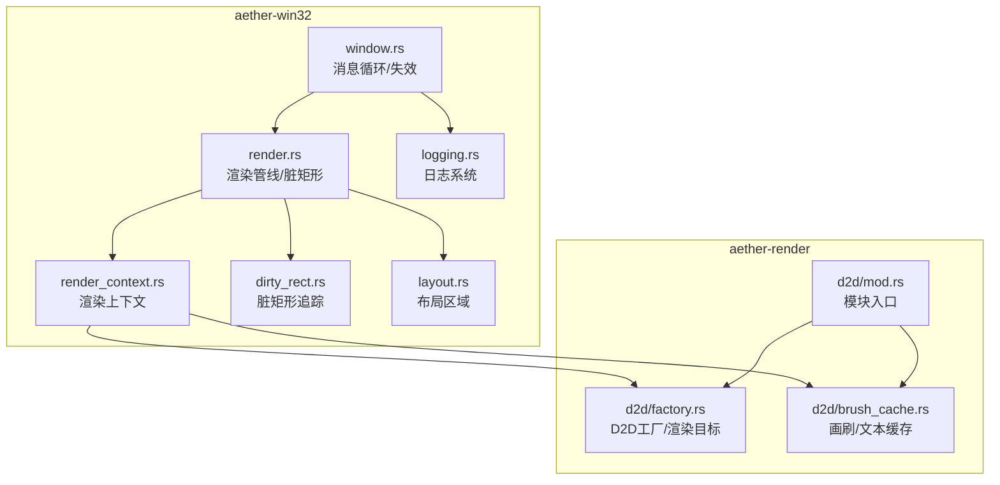
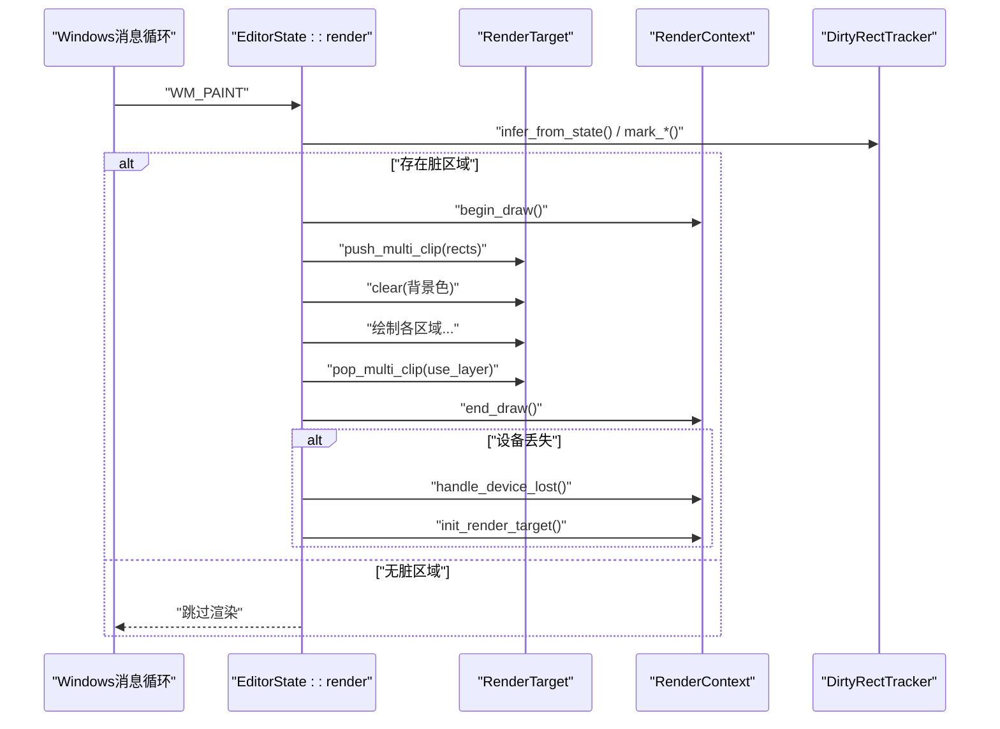
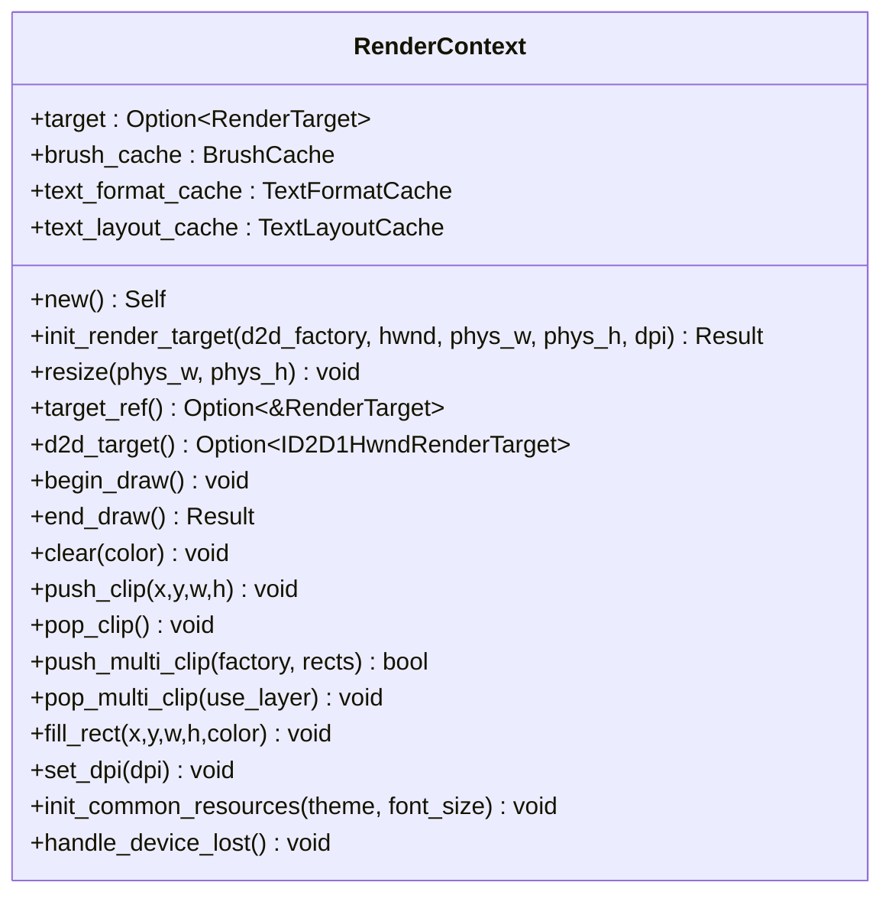
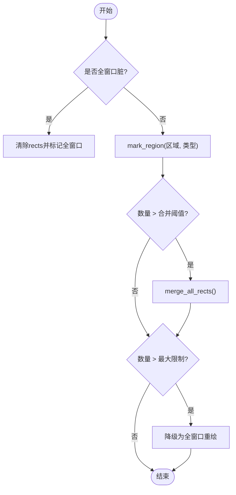
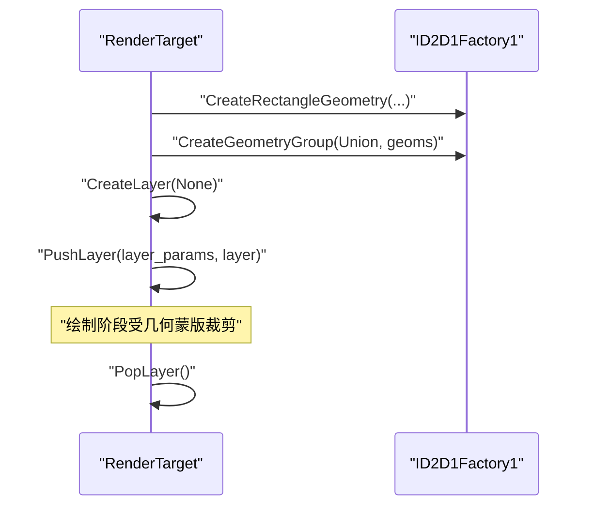
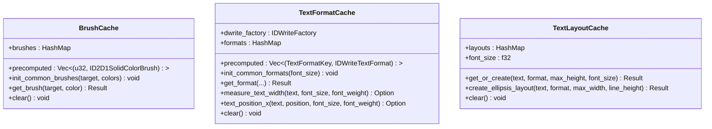
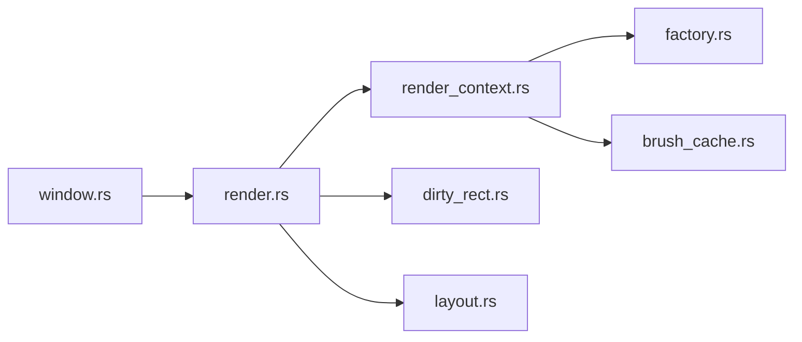

# 渲染上下文管理

<cite>
**本文引用的文件**
- [render_context.rs](file://crates/aether-win32/src/render_context.rs)
- [dirty_rect.rs](file://crates/aether-win32/src/dirty_rect.rs)
- [render.rs](file://crates/aether-win32/src/render.rs)
- [factory.rs](file://crates/aether-render/src/d2d/factory.rs)
- [brush_cache.rs](file://crates/aether-render/src/d2d/brush_cache.rs)
- [layout.rs](file://crates/aether-win32/src/layout.rs)
- [window.rs](file://crates/aether-win32/src/window.rs)
- [logging.rs](file://crates/aether-win32/src/logging.rs)
- [lib.rs](file://crates/aether-render/src/lib.rs)
</cite>

## 目录
1. [简介](#简介)
2. [项目结构](#项目结构)
3. [核心组件](#核心组件)
4. [架构总览](#架构总览)
5. [详细组件分析](#详细组件分析)
6. [依赖关系分析](#依赖关系分析)
7. [性能考量](#性能考量)
8. [故障排除指南](#故障排除指南)
9. [结论](#结论)
10. [附录](#附录)

## 简介
本技术文档聚焦于“渲染上下文管理系统”，围绕以下目标展开：
- 渲染上下文的生命周期管理、初始化流程与资源清理机制
- 脏矩形算法的实现原理、增量渲染策略与重绘优化技术
- 渲染状态的保存与恢复、变换栈管理与图层合成机制
- 多线程渲染支持、异步绘制操作与性能监控指标
- 渲染调试工具使用指南、性能分析方法与故障排除技巧

该系统的核心由 Windows 消息循环驱动，基于 Direct2D/DirectWrite 进行硬件加速渲染，结合脏矩形追踪与多区域裁剪，实现高效的增量重绘。

## 项目结构
与渲染上下文相关的代码主要分布在以下模块：
- aether-win32（Windows 平台窗口与渲染编排）
  - render.rs：主渲染管线、脏矩形决策、绘制顺序与设备丢失处理
  - render_context.rs：渲染上下文封装（RenderTarget、画刷/文本缓存）
  - dirty_rect.rs：脏矩形追踪器与渲染命令推断
  - layout.rs：布局区域计算（标题栏、侧边栏、编辑器等）
  - window.rs：窗口创建、消息循环与失效触发
  - logging.rs：日志系统初始化与崩溃钩子
- aether-render（Direct2D/DirectWrite 抽象与缓存）
  - d2d/factory.rs：D2D 工厂与 HWND 渲染目标、多矩形裁剪
  - d2d/brush_cache.rs：画刷、文本格式与 TextLayout 缓存

图表来源
- [window.rs:114-173](file://crates/aether-win32/src/window.rs#L114-L173)
- [render.rs:62-780](file://crates/aether-win32/src/render.rs#L62-L780)
- [render_context.rs:1-226](file://crates/aether-win32/src/render_context.rs#L1-L226)
- [dirty_rect.rs:1-707](file://crates/aether-win32/src/dirty_rect.rs#L1-L707)
- [layout.rs:1-200](file://crates/aether-win32/src/layout.rs#L1-L200)
- [factory.rs:1-487](file://crates/aether-render/src/d2d/factory.rs#L1-L487)
- [brush_cache.rs:1-538](file://crates/aether-render/src/d2d/brush_cache.rs#L1-L538)
- [mod.rs](file://crates/aether-render/src/d2d/mod.rs)

章节来源
- [window.rs:114-173](file://crates/aether-win32/src/window.rs#L114-L173)
- [render.rs:62-780](file://crates/aether-win32/src/render.rs#L62-L780)
- [render_context.rs:1-226](file://crates/aether-win32/src/render_context.rs#L1-L226)
- [dirty_rect.rs:1-707](file://crates/aether-win32/src/dirty_rect.rs#L1-L707)
- [layout.rs:1-200](file://crates/aether-win32/src/layout.rs#L1-L200)
- [factory.rs:1-487](file://crates/aether-render/src/d2d/factory.rs#L1-L487)
- [brush_cache.rs:1-538](file://crates/aether-render/src/d2d/brush_cache.rs#L1-L538)
- [mod.rs](file://crates/aether-render/src/d2d/mod.rs)

## 核心组件
- 渲染上下文 RenderContext
  - 职责：封装 D2D 渲染目标、画刷缓存、文本格式缓存与 TextLayout 缓存；提供 begin/end_draw、clear、push/pop_clip、多矩形裁剪、设备丢失处理等能力。
- 脏矩形追踪 DirtyRectTracker
  - 职责：记录需要重绘的矩形区域，合并重叠区域，按区域类型标记，支持全窗口降级与渲染命令推断。
- 渲染管线 EditorState::render
  - 职责：在 WM_PAINT 中执行，负责状态对比、脏区标记、裁剪设置、各区域绘制、end_draw 与错误处理。
- D2D 工厂与渲染目标 D2DFactory/RenderTarget
  - 职责：创建 ID2D1HwndRenderTarget、BeginDraw/EndDraw、Resize/SetDpi、PushAxisAlignedClip/PushLayer 多矩形裁剪。
- 画刷与文本缓存 BrushCache/TextFormatCache/TextLayoutCache
  - 职责：避免每帧重复创建 COM 对象，预存常用颜色画笔与文本格式，复用 TextLayout。

章节来源
- [render_context.rs:1-226](file://crates/aether-win32/src/render_context.rs#L1-L226)
- [dirty_rect.rs:1-707](file://crates/aether-win32/src/dirty_rect.rs#L1-L707)
- [render.rs:62-780](file://crates/aether-win32/src/render.rs#L62-L780)
- [factory.rs:1-487](file://crates/aether-render/src/d2d/factory.rs#L1-L487)
- [brush_cache.rs:1-538](file://crates/aether-render/src/d2d/brush_cache.rs#L1-L538)

## 架构总览
渲染上下文管理采用“事件驱动 + 脏矩形 + 多区域裁剪”的架构：
- 窗口消息循环触发 InvalidateRect，WM_PAINT 统一调用 EditorState::render
- render 内部根据状态变化推断 RenderCommand，更新 DirtyRectTracker
- 非全窗口时，使用多矩形并集裁剪（GeometryGroup + PushLayer），减少无效绘制
- 绘制完成后 end_draw，若检测到设备丢失则重建渲染目标与缓存

图表来源
- [window.rs:114-173](file://crates/aether-win32/src/window.rs#L114-L173)
- [render.rs:62-780](file://crates/aether-win32/src/render.rs#L62-L780)
- [render_context.rs:1-226](file://crates/aether-win32/src/render_context.rs#L1-L226)
- [dirty_rect.rs:1-707](file://crates/aether-win32/src/dirty_rect.rs#L1-L707)
- [factory.rs:1-487](file://crates/aether-render/src/d2d/factory.rs#L1-L487)

## 详细组件分析

### 渲染上下文 RenderContext
- 生命周期
  - new：初始化文本格式缓存与 TextLayout 缓存
  - init_render_target：创建 HWND 渲染目标（物理像素与 DPI）
  - resize：调整渲染目标尺寸
  - handle_device_lost：清空 target 与所有缓存，等待重建
- 绘制接口
  - begin_draw/end_draw/clear：包装 ID2D1HwndRenderTarget 的绘制生命周期
  - push_clip/pop_clip：单矩形轴对齐裁剪
  - push_multi_clip/pop_multi_clip：多矩形并集裁剪（返回 use_layer 标志）
  - fill_rect：局部背景填充（用于欢迎页下面板区域补色）
  - set_dpi：响应 DPI 变化
  - init_common_resources：预初始化常用画刷与文本格式

图表来源
- [render_context.rs:1-226](file://crates/aether-win32/src/render_context.rs#L1-L226)

章节来源
- [render_context.rs:1-226](file://crates/aether-win32/src/render_context.rs#L1-L226)

### 脏矩形算法与增量渲染
- 数据结构
  - DirtyRegionType：区域类型枚举（标题栏、侧边栏、编辑器内容、状态栏等）
  - DirtyRect：矩形区域 + 区域类型
  - DirtyRectTracker：维护 rects 列表、full_window_dirty 标志、窗口尺寸、阈值与上限
- 核心逻辑
  - mark_full_window：标记全窗口重绘，清空 rects
  - mark_region：插入新矩形，同类型相交则合并；超过阈值触发 merge_all_rects；超过上限降级为全窗口
  - is_editor_dirty/is_sidebar_dirty/is_status_bar_dirty 等：按区域类型判断是否需要重绘
  - RenderCommand::infer_from_state：根据状态变化推断最优渲染命令（None/EditorOnly/EditorAndStatus/SidebarOnly/RightPanelOnly/BottomPanelOnly/FullRedraw）
- 渲染集成
  - render 中根据 RenderCommand 标记对应区域为脏
  - 非全窗口时使用 push_multi_clip 设置多矩形裁剪，避免合并包围盒导致的过度重绘

图表来源
- [dirty_rect.rs:1-707](file://crates/aether-win32/src/dirty_rect.rs#L1-L707)

章节来源
- [dirty_rect.rs:1-707](file://crates/aether-win32/src/dirty_rect.rs#L1-L707)
- [render.rs:62-780](file://crates/aether-win32/src/render.rs#L62-L780)

### 多矩形裁剪与图层合成
- 单矩形快路径：PushAxisAlignedClip/PopAxisAlignedClip
- 多矩形并集：
  - 为每个有效矩形创建 ID2D1RectangleGeometry
  - 使用 CreateGeometryGroup(D2D1_FILL_MODE_ALTERNATE) 构建 Union 几何组
  - PushLayer 以几何组作为 geometricMask，实现真正的多矩形裁剪
  - PopLayer 或 PopAxisAlignedClip 取决于 use_layer 标志
- 回退策略：当多矩形失败时，计算包围盒并使用单矩形裁剪

图表来源
- [factory.rs:164-271](file://crates/aether-render/src/d2d/factory.rs#L164-L271)
- [render.rs:394-410](file://crates/aether-win32/src/render.rs#L394-L410)

章节来源
- [factory.rs:164-271](file://crates/aether-render/src/d2d/factory.rs#L164-L271)
- [render.rs:394-410](file://crates/aether-win32/src/render.rs#L394-L410)

### 资源缓存与文本布局
- 画刷缓存 BrushCache
  - 预存常用颜色画笔（线性扫描优先），未命中回退 HashMap，超出上限清空回退缓存
- 文本格式缓存 TextFormatCache
  - 预存 code/line_number/center 三种常用格式，其他通过 HashMap 缓存
  - 提供 measure_text_width/text_position_x 辅助测量
- TextLayout 缓存 TextLayoutCache
  - 按文本内容缓存 IDWriteTextLayout，字体大小变化时自动清空
  - create_ellipsis_layout 支持单行省略号

图表来源
- [brush_cache.rs:1-538](file://crates/aether-render/src/d2d/brush_cache.rs#L1-L538)

章节来源
- [brush_cache.rs:1-538](file://crates/aether-render/src/d2d/brush_cache.rs#L1-L538)

### 渲染状态保存与恢复、变换栈管理
- 状态保存与恢复
  - render 末尾更新 last_* 字段，确保下一帧正确检测变化
  - 设备丢失时重建渲染目标与缓存，保持 UI 一致性
- 变换栈管理
  - 当前实现以裁剪栈为主（PushAxisAlignedClip/PushLayer），未显式维护矩阵变换栈
  - 多矩形裁剪通过几何蒙版实现，避免额外矩阵运算

章节来源
- [render.rs:748-776](file://crates/aether-win32/src/render.rs#L748-L776)
- [render_context.rs:219-225](file://crates/aether-win32/src/render_context.rs#L219-L225)

### 多线程渲染支持与异步绘制
- 当前渲染在主线程（UI 线程）执行，遵循 Windows 消息循环模型
- 后台任务（如 LSP 诊断、终端输出轮询、AI 请求结果）通过事件队列与轮询机制更新状态，不阻塞 UI 线程
- 文本预处理（并行 token 生成）位于 aether-core，但渲染本身仍为单线程

章节来源
- [render.rs:71-87](file://crates/aether-win32/src/render.rs#L71-L87)
- [render.rs:193-213](file://crates/aether-win32/src/render.rs#L193-L213)

### 性能监控指标
- 脏矩形数量：dirty_count()/rects().len()
- 全窗口重绘标志：is_full_window()
- 区域重绘判定：is_editor_dirty()/is_sidebar_dirty()/is_status_bar_dirty()
- 日志与 trace：render 关键节点使用 tracing::trace 输出

章节来源
- [dirty_rect.rs:358-365](file://crates/aether-win32/src/dirty_rect.rs#L358-L365)
- [dirty_rect.rs:231-321](file://crates/aether-win32/src/dirty_rect.rs#L231-L321)
- [render.rs:94-98](file://crates/aether-win32/src/render.rs#L94-L98)

## 依赖关系分析
- 模块耦合
  - render.rs 依赖 render_context.rs、dirty_rect.rs、layout.rs
  - render_context.rs 依赖 aether-render 的 factory 与 brush_cache
  - window.rs 驱动消息循环并触发 invalidate_window
- 外部依赖
  - Direct2D/DirectWrite COM 对象（ID2D1HwndRenderTarget、IDWriteFactory 等）
  - Windows API（InvalidateRect、GetMessageW、DispatchMessageW 等）

图表来源
- [render.rs:62-780](file://crates/aether-win32/src/render.rs#L62-L780)
- [render_context.rs:1-226](file://crates/aether-win32/src/render_context.rs#L1-L226)
- [dirty_rect.rs:1-707](file://crates/aether-win32/src/dirty_rect.rs#L1-L707)
- [layout.rs:1-200](file://crates/aether-win32/src/layout.rs#L1-L200)
- [factory.rs:1-487](file://crates/aether-render/src/d2d/factory.rs#L1-L487)
- [brush_cache.rs:1-538](file://crates/aether-render/src/d2d/brush_cache.rs#L1-L538)
- [window.rs:114-173](file://crates/aether-win32/src/window.rs#L114-L173)

章节来源
- [render.rs:62-780](file://crates/aether-win32/src/render.rs#L62-L780)
- [render_context.rs:1-226](file://crates/aether-win32/src/render_context.rs#L1-L226)
- [dirty_rect.rs:1-707](file://crates/aether-win32/src/dirty_rect.rs#L1-L707)
- [layout.rs:1-200](file://crates/aether-win32/src/layout.rs#L1-L200)
- [factory.rs:1-487](file://crates/aether-render/src/d2d/factory.rs#L1-L487)
- [brush_cache.rs:1-538](file://crates/aether-render/src/d2d/brush_cache.rs#L1-L538)
- [window.rs:114-173](file://crates/aether-win32/src/window.rs#L114-L173)

## 性能考量
- 避免无变化重绘：RenderCommand::None 直接跳过渲染
- 多矩形裁剪：减少无效绘制面积，避免合并包围盒导致的全量覆盖
- 资源缓存：画刷、文本格式与 TextLayout 缓存显著降低 COM 对象分配开销
- 阈值与上限：脏矩形数量超过阈值触发合并，超过上限降级为全窗口重绘，保证稳定性
- DPI 变化：及时更新渲染目标 DPI，避免缩放异常
- 日志级别：生产环境使用 trace 级别，避免每帧日志噪声

[本节为通用指导，无需列出具体文件来源]

## 故障排除指南
- 设备丢失（D2DERR_RECREATE_TARGET）
  - 现象：end_draw 返回特定错误码
  - 处理：调用 handle_device_lost 清空资源，重建渲染目标与缓存
- 欢迎页黑屏问题
  - 现象：欢迎页状态下部分区域显示黑色
  - 处理：在非全窗口 clear 后手动填充活动栏/侧边栏/右侧面板/底部面板背景
- 日志定位
  - 使用 tracing 的 trace 信息定位渲染关键步骤
  - 日志文件按天轮转，panic 时自动 flush

章节来源
- [render.rs:704-746](file://crates/aether-win32/src/render.rs#L704-L746)
- [render.rs:431-474](file://crates/aether-win32/src/render.rs#L431-L474)
- [logging.rs:31-86](file://crates/aether-win32/src/logging.rs#L31-L86)

## 结论
渲染上下文管理系统通过清晰的职责划分与高效的增量渲染策略，实现了高性能的 UI 渲染。脏矩形与多矩形裁剪的结合，在保证视觉一致性的同时大幅降低了重绘成本。资源缓存与设备丢失处理进一步提升了鲁棒性与用户体验。未来可在变换栈管理与更细粒度的异步绘制方面继续优化。

[本节为总结性内容，无需列出具体文件来源]

## 附录
- 术语
  - 脏矩形：需要重绘的区域集合
  - 多矩形裁剪：使用几何蒙版对多个独立矩形区域进行裁剪
  - 设备丢失：GPU 或驱动相关原因导致渲染目标失效
- 最佳实践
  - 尽量使用 RenderCommand::None 避免无谓重绘
  - 合理设置脏矩形阈值与上限，平衡性能与稳定性
  - 在 DPI 变化时及时更新渲染目标 DPI
  - 利用缓存减少 COM 对象创建开销

[本节为概念性内容，无需列出具体文件来源]