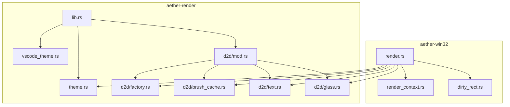
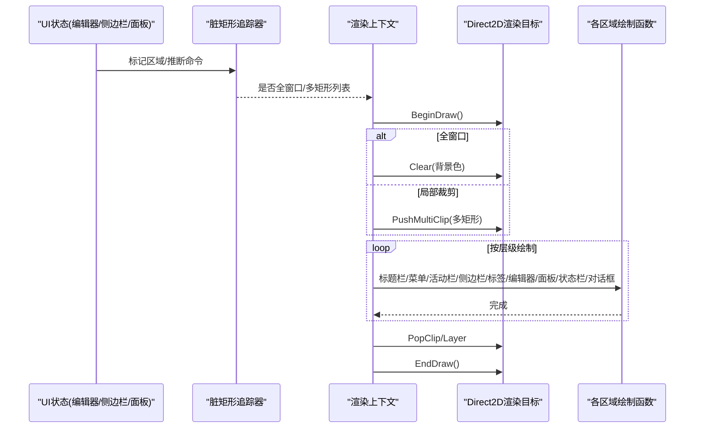
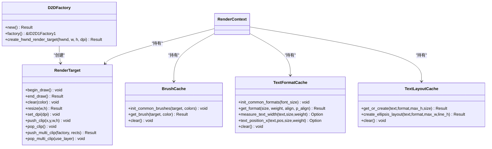
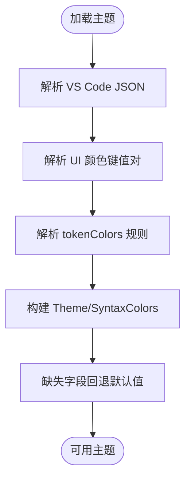
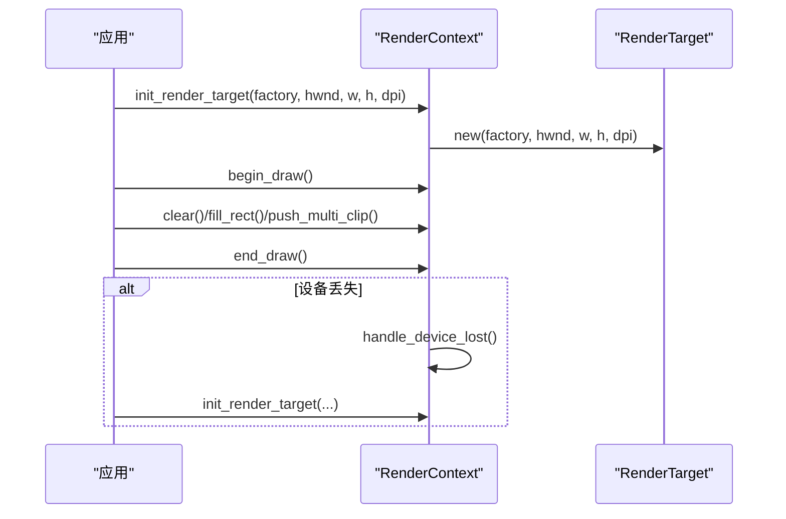
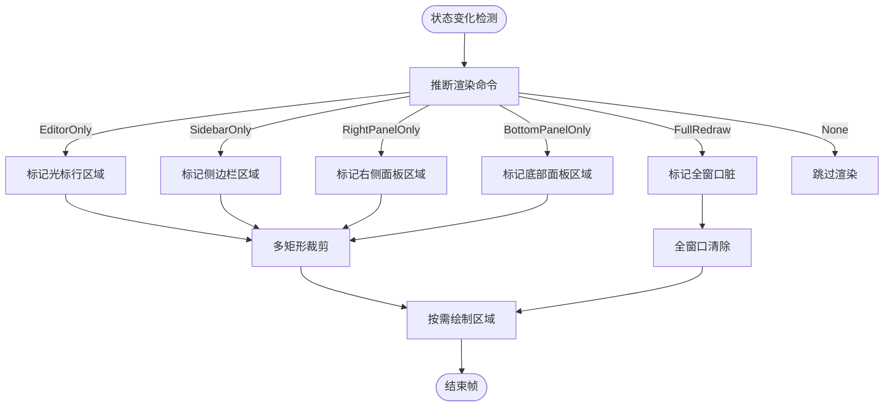
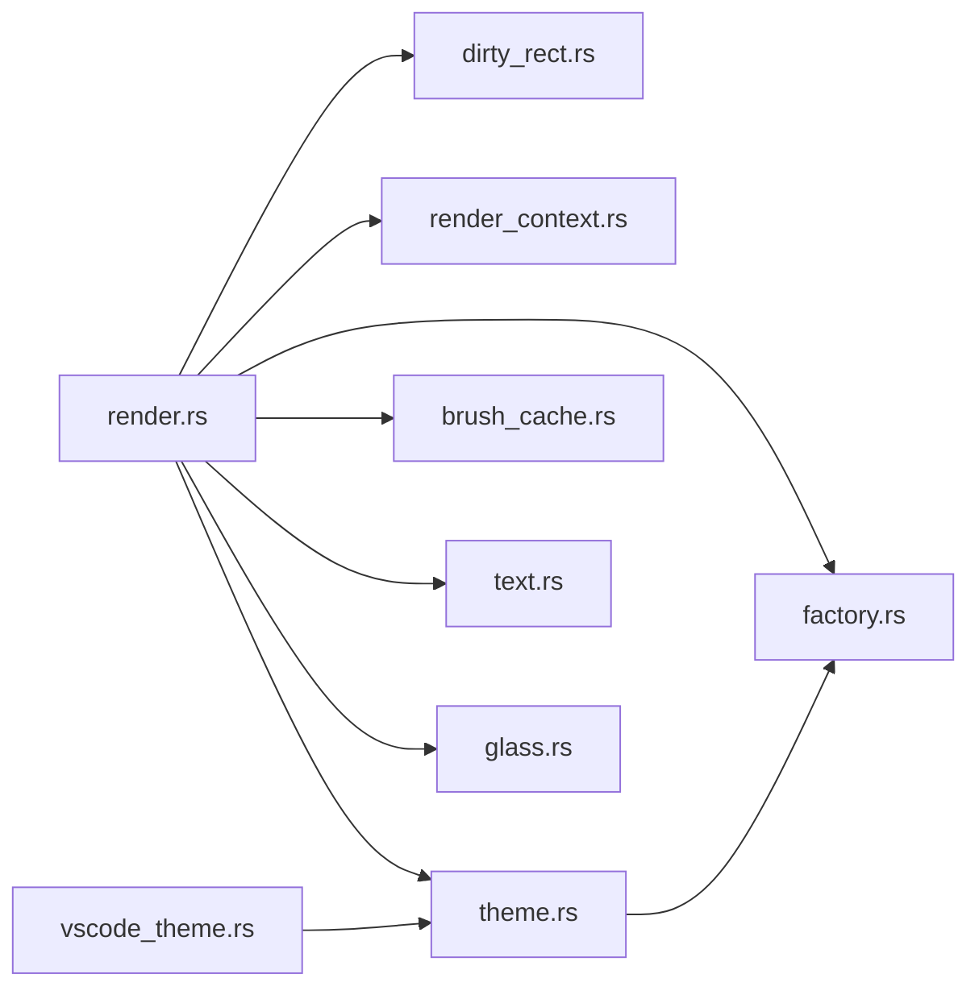

# 渲染引擎架构

<cite>
**本文引用的文件**   
- [crates/aether-render/src/lib.rs](file://crates/aether-render/src/lib.rs)
- [crates/aether-render/src/theme.rs](file://crates/aether-render/src/theme.rs)
- [crates/aether-render/src/vscode_theme.rs](file://crates/aether-render/src/vscode_theme.rs)
- [crates/aether-render/src/d2d/mod.rs](file://crates/aether-render/src/d2d/mod.rs)
- [crates/aether-render/src/d2d/factory.rs](file://crates/aether-render/src/d2d/factory.rs)
- [crates/aether-render/src/d2d/brush_cache.rs](file://crates/aether-render/src/d2d/brush_cache.rs)
- [crates/aether-render/src/d2d/text.rs](file://crates/aether-render/src/d2d/text.rs)
- [crates/aether-render/src/d2d/glass.rs](file://crates/aether-render/src/d2d/glass.rs)
- [crates/aether-win32/src/render_context.rs](file://crates/aether-win32/src/render_context.rs)
- [crates/aether-win32/src/render.rs](file://crates/aether-win32/src/render.rs)
- [crates/aether-win32/src/dirty_rect.rs](file://crates/aether-win32/src/dirty_rect.rs)
</cite>

## 目录
1. [简介](#简介)
2. [项目结构](#项目结构)
3. [核心组件](#核心组件)
4. [架构总览](#架构总览)
5. [详细组件分析](#详细组件分析)
6. [依赖关系分析](#依赖关系分析)
7. [性能考量](#性能考量)
8. [故障排查指南](#故障排查指南)
9. [结论](#结论)
10. [附录：扩展与调试](#附录扩展与调试)

## 简介
本文件面向牧羊人编辑器的渲染子系统，系统性阐述基于 Direct2D/DirectWrite 的渲染管线设计与实现。重点包括：
- 渲染抽象层如何封装 Windows 图形 API（工厂、渲染目标、画刷与文本格式缓存）
- 主题系统与颜色管理机制（内置主题、VS Code 主题导入、语义令牌映射）
- 渲染上下文生命周期管理（设备丢失恢复、DPI 缩放、资源重建）
- 脏矩形优化与增量渲染策略（多矩形并集裁剪、区域级重绘）
- 性能优化技巧、内存使用模式与 GPU 加速配置
- 自定义渲染效果的扩展方法与调试手段

## 项目结构
渲染相关代码主要分布在两个 crate：
- aether-render：跨平台渲染抽象与主题系统，包含 D2D 抽象、画刷/文本缓存、玻璃效果工具等
- aether-win32：Windows 平台集成，负责窗口消息、布局、脏矩形追踪、渲染调度与资源管理

图表来源
- [crates/aether-render/src/lib.rs:1-4](file://crates/aether-render/src/lib.rs#L1-L4)
- [crates/aether-render/src/d2d/mod.rs:1-5](file://crates/aether-render/src/d2d/mod.rs#L1-L5)
- [crates/aether-win32/src/render.rs:1-120](file://crates/aether-win32/src/render.rs#L1-L120)
- [crates/aether-win32/src/render_context.rs:1-40](file://crates/aether-win32/src/render_context.rs#L1-L40)
- [crates/aether-win32/src/dirty_rect.rs:1-35](file://crates/aether-win32/src/dirty_rect.rs#L1-L35)

章节来源
- [crates/aether-render/src/lib.rs:1-4](file://crates/aether-render/src/lib.rs#L1-L4)
- [crates/aether-render/src/d2d/mod.rs:1-5](file://crates/aether-render/src/d2d/mod.rs#L1-L5)
- [crates/aether-win32/src/render.rs:1-120](file://crates/aether-win32/src/render.rs#L1-L120)
- [crates/aether-win32/src/render_context.rs:1-40](file://crates/aether-win32/src/render_context.rs#L1-L40)
- [crates/aether-win32/src/dirty_rect.rs:1-35](file://crates/aether-win32/src/dirty_rect.rs#L1-L35)

## 核心组件
- 渲染抽象层（Direct2D/DirectWrite 封装）
  - 工厂与渲染目标：单线程工厂、硬件渲染目标、BeginDraw/EndDraw、Resize/SetDpi、轴对齐裁剪与多矩形几何裁剪
  - 画刷与文本格式缓存：预存常用项 + HashMap 回退，限制最大条目数避免无界增长
  - 文本布局缓存：按内容复用 TextLayout，减少 COM 对象分配
- 主题系统
  - 内置暗色与毛玻璃主题；语法高亮颜色共享构造；VS Code JSON 主题解析与映射
  - 语义令牌索引到颜色的查找表
- 渲染上下文
  - 统一管理渲染目标、画刷缓存、文本格式与布局缓存；设备丢失时清理并重建
- 脏矩形与增量渲染
  - 区域类型化脏矩形合并、阈值降级为全窗口重绘；多矩形并集裁剪避免包围盒膨胀
- 玻璃效果工具
  - 半透明面板、柔和边框、光晕选择、阴影与圆角模拟

章节来源
- [crates/aether-render/src/d2d/factory.rs:14-126](file://crates/aether-render/src/d2d/factory.rs#L14-L126)
- [crates/aether-render/src/d2d/brush_cache.rs:25-106](file://crates/aether-render/src/d2d/brush_cache.rs#L25-L106)
- [crates/aether-render/src/d2d/brush_cache.rs:108-314](file://crates/aether-render/src/d2d/brush_cache.rs#L108-L314)
- [crates/aether-render/src/d2d/brush_cache.rs:376-477](file://crates/aether-render/src/d2d/brush_cache.rs#L376-L477)
- [crates/aether-render/src/theme.rs:8-86](file://crates/aether-render/src/theme.rs#L8-L86)
- [crates/aether-render/src/theme.rs:148-277](file://crates/aether-render/src/theme.rs#L148-L277)
- [crates/aether-render/src/vscode_theme.rs:103-176](file://crates/aether-render/src/vscode_theme.rs#L103-L176)
- [crates/aether-win32/src/render_context.rs:6-31](file://crates/aether-win32/src/render_context.rs#L6-L31)
- [crates/aether-win32/src/dirty_rect.rs:8-35](file://crates/aether-win32/src/dirty_rect.rs#L8-L35)
- [crates/aether-render/src/d2d/glass.rs:12-62](file://crates/aether-render/src/d2d/glass.rs#L12-L62)

## 架构总览
渲染管线从 UI 状态变化驱动脏矩形计算开始，经渲染上下文进入 Direct2D 绘制阶段，最终提交帧缓冲。关键路径如下：

图表来源
- [crates/aether-win32/src/render.rs:385-426](file://crates/aether-win32/src/render.rs#L385-L426)
- [crates/aether-win32/src/render_context.rs:65-79](file://crates/aether-win32/src/render_context.rs#L65-L79)
- [crates/aether-win32/src/render_context.rs:107-155](file://crates/aether-win32/src/render_context.rs#L107-L155)
- [crates/aether-render/src/d2d/factory.rs:90-126](file://crates/aether-render/src/d2d/factory.rs#L90-L126)
- [crates/aether-render/src/d2d/factory.rs:172-263](file://crates/aether-render/src/d2d/factory.rs#L172-L263)

## 详细组件分析

### 渲染抽象层（Direct2D/DirectWrite 封装）
- 工厂与渲染目标
  - 单线程工厂创建硬件渲染目标，支持 DPI 设置与尺寸调整
  - 提供 BeginDraw/EndDraw/Clear/Resize/SetDpi 等基础操作
  - 轴对齐裁剪用于单矩形快路径；多矩形通过 GeometryGroup + PushLayer 实现真正并集裁剪
- 画刷与文本格式缓存
  - 预存常用颜色画笔与三种文本格式（左对齐、右对齐、居中），未命中回退 HashMap
  - 超出最大条目数时清空回退缓存，控制内存上限
- 文本布局缓存
  - 以文本内容为键复用 IDWriteTextLayout，字体大小变化时自动失效
  - 提供带省略号的布局创建接口，用于文件树等场景

图表来源
- [crates/aether-render/src/d2d/factory.rs:14-126](file://crates/aether-render/src/d2d/factory.rs#L14-L126)
- [crates/aether-render/src/d2d/factory.rs:172-263](file://crates/aether-render/src/d2d/factory.rs#L172-L263)
- [crates/aether-render/src/d2d/brush_cache.rs:25-106](file://crates/aether-render/src/d2d/brush_cache.rs#L25-L106)
- [crates/aether-render/src/d2d/brush_cache.rs:108-314](file://crates/aether-render/src/d2d/brush_cache.rs#L108-L314)
- [crates/aether-render/src/d2d/brush_cache.rs:376-477](file://crates/aether-render/src/d2d/brush_cache.rs#L376-L477)
- [crates/aether-win32/src/render_context.rs:6-31](file://crates/aether-win32/src/render_context.rs#L6-L31)

章节来源
- [crates/aether-render/src/d2d/factory.rs:14-126](file://crates/aether-render/src/d2d/factory.rs#L14-L126)
- [crates/aether-render/src/d2d/factory.rs:172-263](file://crates/aether-render/src/d2d/factory.rs#L172-L263)
- [crates/aether-render/src/d2d/brush_cache.rs:25-106](file://crates/aether-render/src/d2d/brush_cache.rs#L25-L106)
- [crates/aether-render/src/d2d/brush_cache.rs:108-314](file://crates/aether-render/src/d2d/brush_cache.rs#L108-L314)
- [crates/aether-render/src/d2d/brush_cache.rs:376-477](file://crates/aether-render/src/d2d/brush_cache.rs#L376-L477)
- [crates/aether-win32/src/render_context.rs:6-31](file://crates/aether-win32/src/render_context.rs#L6-L31)

### 主题系统与颜色管理
- 主题模型
  - Theme 包含 UI 颜色与 SyntaxColors；支持 dark 与 glass 两种预设，glass 启用半透明与光晕效果
  - 提供 TokenKind 与语义令牌索引到颜色的映射方法
- VS Code 主题导入
  - 解析 JSON 中的 colors 与 tokenColors，映射到内部 Theme/SyntaxColors
  - 十六进制颜色解析支持 #RGB/#RRGGBB/#RRGGBBAA，错误回退默认值
- 颜色键与缓存
  - 将 RGBA 浮点归一化为 u32 键，用于画刷缓存快速查找

图表来源
- [crates/aether-render/src/vscode_theme.rs:103-176](file://crates/aether-render/src/vscode_theme.rs#L103-L176)
- [crates/aether-render/src/vscode_theme.rs:236-281](file://crates/aether-render/src/vscode_theme.rs#L236-L281)
- [crates/aether-render/src/theme.rs:148-277](file://crates/aether-render/src/theme.rs#L148-L277)
- [crates/aether-render/src/d2d/brush_cache.rs:479-487](file://crates/aether-render/src/d2d/brush_cache.rs#L479-L487)

章节来源
- [crates/aether-render/src/theme.rs:8-86](file://crates/aether-render/src/theme.rs#L8-L86)
- [crates/aether-render/src/theme.rs:148-277](file://crates/aether-render/src/theme.rs#L148-L277)
- [crates/aether-render/src/vscode_theme.rs:103-176](file://crates/aether-render/src/vscode_theme.rs#L103-L176)
- [crates/aether-render/src/vscode_theme.rs:236-281](file://crates/aether-render/src/vscode_theme.rs#L236-L281)
- [crates/aether-render/src/d2d/brush_cache.rs:479-487](file://crates/aether-render/src/d2d/brush_cache.rs#L479-L487)

### 渲染上下文生命周期管理
- 初始化
  - 创建 DirectWrite 工厂与文本格式缓存；按需创建渲染目标（HWND、物理像素、DPI）
- 绘制周期
  - begin_draw/end_draw 包裹绘制；clear 仅在全窗口或需要时执行
  - 多矩形裁剪：单矩形走快路径，多矩形使用 Layer + GeometryGroup
- 设备丢失处理
  - 捕获 EndDraw 错误码，触发 handle_device_lost 清理资源，随后重建渲染目标与常用资源

图表来源
- [crates/aether-win32/src/render_context.rs:33-46](file://crates/aether-win32/src/render_context.rs#L33-L46)
- [crates/aether-win32/src/render_context.rs:65-79](file://crates/aether-win32/src/render_context.rs#L65-L79)
- [crates/aether-win32/src/render_context.rs:107-155](file://crates/aether-win32/src/render_context.rs#L107-L155)
- [crates/aether-win32/src/render_context.rs:219-225](file://crates/aether-win32/src/render_context.rs#L219-L225)
- [crates/aether-win32/src/render.rs:704-746](file://crates/aether-win32/src/render.rs#L704-L746)

章节来源
- [crates/aether-win32/src/render_context.rs:6-31](file://crates/aether-win32/src/render_context.rs#L6-L31)
- [crates/aether-win32/src/render_context.rs:33-46](file://crates/aether-win32/src/render_context.rs#L33-L46)
- [crates/aether-win32/src/render_context.rs:65-79](file://crates/aether-win32/src/render_context.rs#L65-L79)
- [crates/aether-win32/src/render_context.rs:107-155](file://crates/aether-win32/src/render_context.rs#L107-L155)
- [crates/aether-win32/src/render_context.rs:219-225](file://crates/aether-win32/src/render_context.rs#L219-L225)
- [crates/aether-win32/src/render.rs:704-746](file://crates/aether-win32/src/render.rs#L704-L746)

### 脏矩形优化与增量渲染策略
- 区域类型化脏矩形
  - 支持标题栏、菜单栏、活动栏、侧边栏、编辑器、标签栏、状态栏、右侧面板、底部面板、对话框、全窗口等类型
  - 同类型重叠矩形合并，数量超过阈值则降级为全窗口重绘
- 渲染命令推断
  - 根据光标移动、选择变化、滚动、面板可见性、对话框显示等状态推断最小必要重绘范围
- 多矩形并集裁剪
  - 使用 GeometryGroup Union + PushLayer 精确裁剪，避免合并为单一包围盒导致重绘面积膨胀

图表来源
- [crates/aether-win32/src/dirty_rect.rs:368-426](file://crates/aether-win32/src/dirty_rect.rs#L368-L426)
- [crates/aether-win32/src/dirty_rect.rs:114-162](file://crates/aether-win32/src/dirty_rect.rs#L114-L162)
- [crates/aether-win32/src/render.rs:394-426](file://crates/aether-win32/src/render.rs#L394-L426)
- [crates/aether-render/src/d2d/factory.rs:172-263](file://crates/aether-render/src/d2d/factory.rs#L172-L263)

章节来源
- [crates/aether-win32/src/dirty_rect.rs:8-35](file://crates/aether-win32/src/dirty_rect.rs#L8-L35)
- [crates/aether-win32/src/dirty_rect.rs:114-162](file://crates/aether-win32/src/dirty_rect.rs#L114-L162)
- [crates/aether-win32/src/dirty_rect.rs:368-426](file://crates/aether-win32/src/dirty_rect.rs#L368-L426)
- [crates/aether-win32/src/render.rs:394-426](file://crates/aether-win32/src/render.rs#L394-L426)
- [crates/aether-render/src/d2d/factory.rs:172-263](file://crates/aether-render/src/d2d/factory.rs#L172-L263)

### 文本渲染与度量
- 等宽字符宽度测量
  - 使用 DirectWrite TextLayout 实测“W”推进宽度，替代硬编码比例
- 文本格式与布局
  - 文本格式缓存预置常用组合；TextLayout 缓存按内容复用，避免每帧创建 COM 对象
- 视口与行渲染
  - 根据滚动与行高计算可见行范围，逐行绘制 token 着色文本

章节来源
- [crates/aether-render/src/d2d/text.rs:24-57](file://crates/aether-render/src/d2d/text.rs#L24-L57)
- [crates/aether-render/src/d2d/text.rs:59-72](file://crates/aether-render/src/d2d/text.rs#L59-L72)
- [crates/aether-render/src/d2d/text.rs:138-187](file://crates/aether-render/src/d2d/text.rs#L138-L187)
- [crates/aether-render/src/d2d/brush_cache.rs:316-374](file://crates/aether-render/src/d2d/brush_cache.rs#L316-L374)
- [crates/aether-render/src/d2d/brush_cache.rs:376-477](file://crates/aether-render/src/d2d/brush_cache.rs#L376-L477)

### 玻璃效果与视觉增强
- 半透明面板、柔和边框、光晕选择、阴影与圆角模拟
- 通过 BrushCache 获取半透明画刷，结合 FillRectangle 叠加绘制

章节来源
- [crates/aether-render/src/d2d/glass.rs:12-62](file://crates/aether-render/src/d2d/glass.rs#L12-L62)
- [crates/aether-render/src/d2d/glass.rs:64-95](file://crates/aether-render/src/d2d/glass.rs#L64-L95)
- [crates/aether-render/src/d2d/glass.rs:97-116](file://crates/aether-render/src/d2d/glass.rs#L97-L116)
- [crates/aether-render/src/d2d/glass.rs:118-154](file://crates/aether-render/src/d2d/glass.rs#L118-L154)

## 依赖关系分析
- 模块耦合
  - render.rs 作为编排者，依赖 dirty_rect 进行增量决策，依赖 render_context 进行资源与裁剪控制，依赖 d2d 子模块进行具体绘制
  - theme.rs 与 vscode_theme.rs 提供颜色数据，被 render.rs 与 brush_cache 使用
- 外部依赖
  - Direct2D 工厂与渲染目标、DirectWrite 文本工厂与布局对象
- 潜在循环依赖
  - 当前结构清晰分层，未见直接循环引用

图表来源
- [crates/aether-win32/src/render.rs:1-20](file://crates/aether-win32/src/render.rs#L1-L20)
- [crates/aether-win32/src/render_context.rs:1-19](file://crates/aether-win32/src/render_context.rs#L1-L19)
- [crates/aether-render/src/theme.rs:1-6](file://crates/aether-render/src/theme.rs#L1-L6)
- [crates/aether-render/src/vscode_theme.rs:1-9](file://crates/aether-render/src/vscode_theme.rs#L1-L9)

章节来源
- [crates/aether-win32/src/render.rs:1-20](file://crates/aether-win32/src/render.rs#L1-L20)
- [crates/aether-win32/src/render_context.rs:1-19](file://crates/aether-win32/src/render_context.rs#L1-L19)
- [crates/aether-render/src/theme.rs:1-6](file://crates/aether-render/src/theme.rs#L1-L6)
- [crates/aether-render/src/vscode_theme.rs:1-9](file://crates/aether-render/src/vscode_theme.rs#L1-L9)

## 性能考量
- GPU 加速配置
  - 渲染目标类型为硬件加速，确保在支持的设备上获得最佳性能
- 裁剪与增量渲染
  - 单矩形走轴对齐裁剪快路径；多矩形使用几何组并集裁剪，避免包围盒膨胀
  - 无脏区域时跳过整帧渲染，显著降低 CPU/GPU 负载
- 资源缓存
  - 画刷与文本格式采用预存数组 + HashMap 两级缓存，命中率优先
  - TextLayout 缓存按内容复用，字体大小变化时自动失效
- 内存控制
  - 画刷与文本格式回退缓存设置最大条目数，超限后整体清空，防止无界增长
- 文本度量
  - 使用 DirectWrite 实测等宽字符宽度，避免估算误差导致的额外重绘或错位

[本节为通用性能建议，不直接分析具体文件]

## 故障排查指南
- 设备丢失（D2DERR_RECREATE_TARGET）
  - 现象：EndDraw 返回特定错误码
  - 处理：调用 handle_device_lost 清理资源，重建渲染目标与常用资源
- 欢迎页与脏矩形裁剪冲突
  - 现象：侧边栏/活动栏/右侧面板/底部面板出现黑色空洞
  - 处理：在欢迎页且使用裁剪时，手动填充这些区域背景色
- 多矩形裁剪失败回退
  - 现象：GeometryGroup 创建失败
  - 处理：回退为合并包围盒的轴对齐裁剪，保证正确性

章节来源
- [crates/aether-win32/src/render.rs:704-746](file://crates/aether-win32/src/render.rs#L704-L746)
- [crates/aether-win32/src/render.rs:412-474](file://crates/aether-win32/src/render.rs#L412-L474)
- [crates/aether-win32/src/render_context.rs:107-155](file://crates/aether-win32/src/render_context.rs#L107-L155)

## 结论
该渲染引擎通过清晰的抽象层封装了 Direct2D/DirectWrite，结合主题系统与高效的资源缓存，实现了高性能的增量渲染。脏矩形与多矩形并集裁剪有效降低了重绘开销，设备丢失与 DPI 切换具备稳健的恢复机制。整体架构具备良好的可扩展性与可维护性，适合持续演进与功能增强。

[本节为总结性内容，不直接分析具体文件]

## 附录：扩展与调试
- 自定义渲染效果扩展指南
  - 新增视觉效果：在 glass.rs 中增加绘制辅助函数，配合 BrushCache 获取半透明画刷
  - 新增主题颜色：在 theme.rs 中添加字段并在 common brushes 初始化中注册
  - 新增文本样式：在 TextFormatCache 中预置新格式或在运行时动态创建并缓存
- 调试方法
  - 使用 tracing::trace 在关键渲染步骤输出日志（如欢迎页、右侧面板绘制前后）
  - 利用 hit_test 模块记录命中区域，便于定位交互问题
  - 观察脏矩形数量与类型，评估增量渲染有效性

章节来源
- [crates/aether-render/src/d2d/glass.rs:12-62](file://crates/aether-render/src/d2d/glass.rs#L12-L62)
- [crates/aether-render/src/theme.rs:148-277](file://crates/aether-render/src/theme.rs#L148-L277)
- [crates/aether-render/src/d2d/brush_cache.rs:108-314](file://crates/aether-render/src/d2d/brush_cache.rs#L108-L314)
- [crates/aether-win32/src/render.rs:94-98](file://crates/aether-win32/src/render.rs#L94-L98)
- [crates/aether-win32/src/render.rs:596-599](file://crates/aether-win32/src/render.rs#L596-L599)