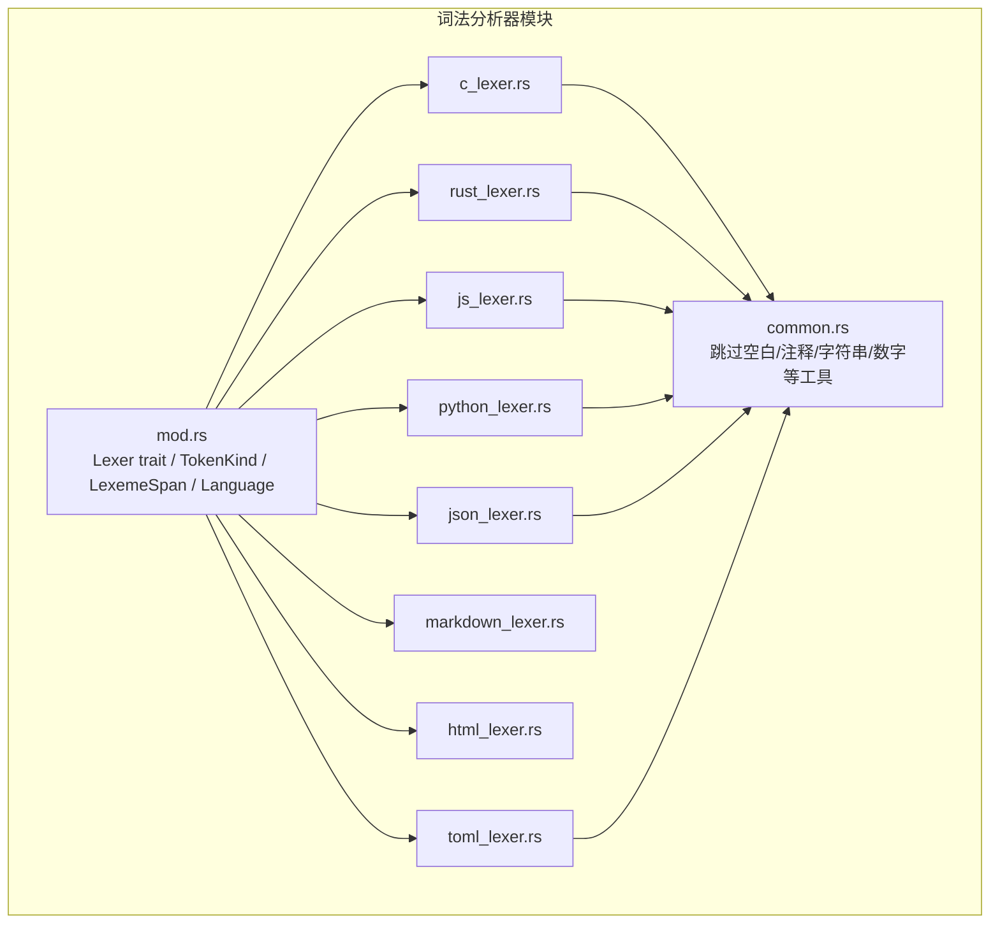
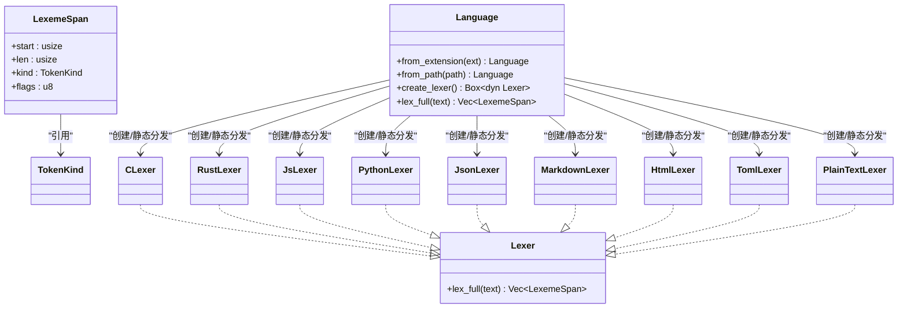
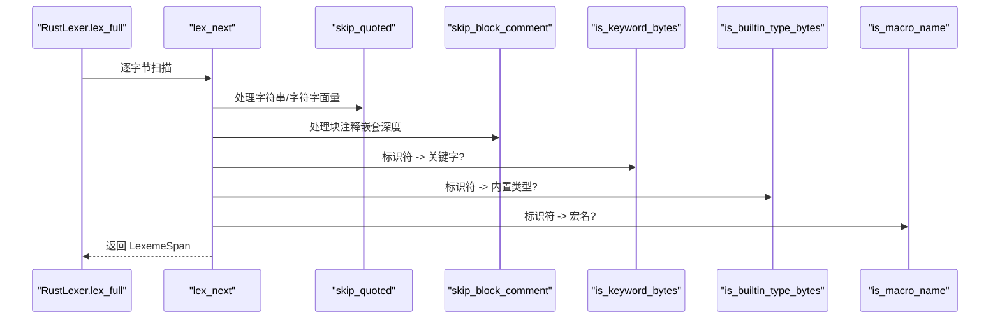
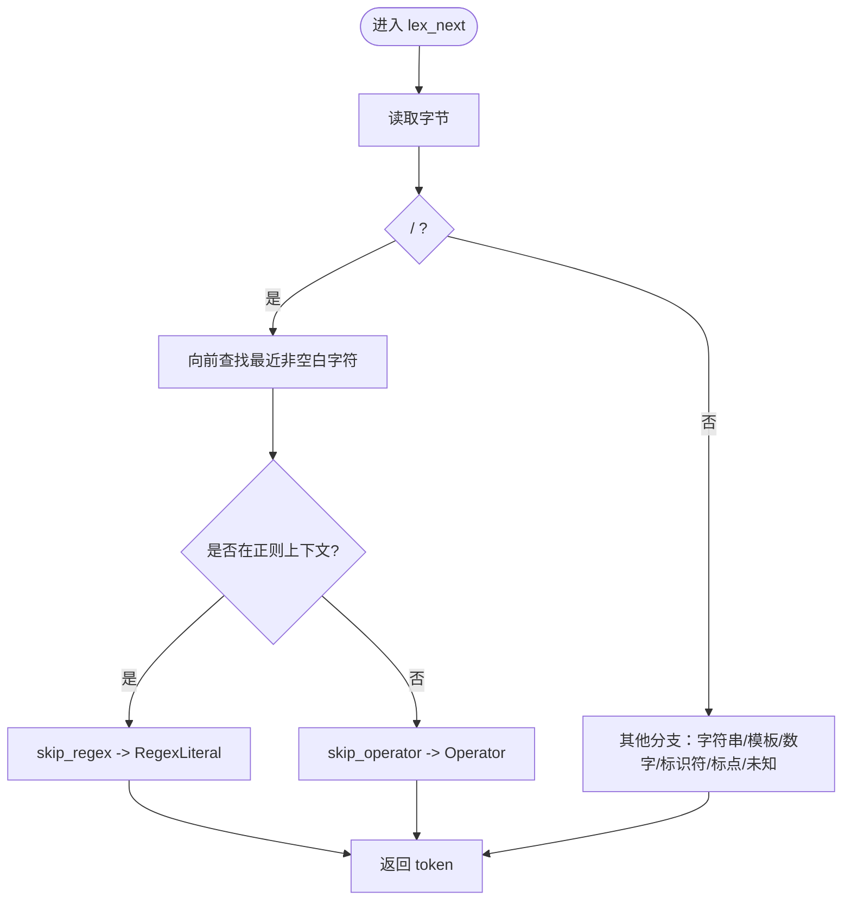
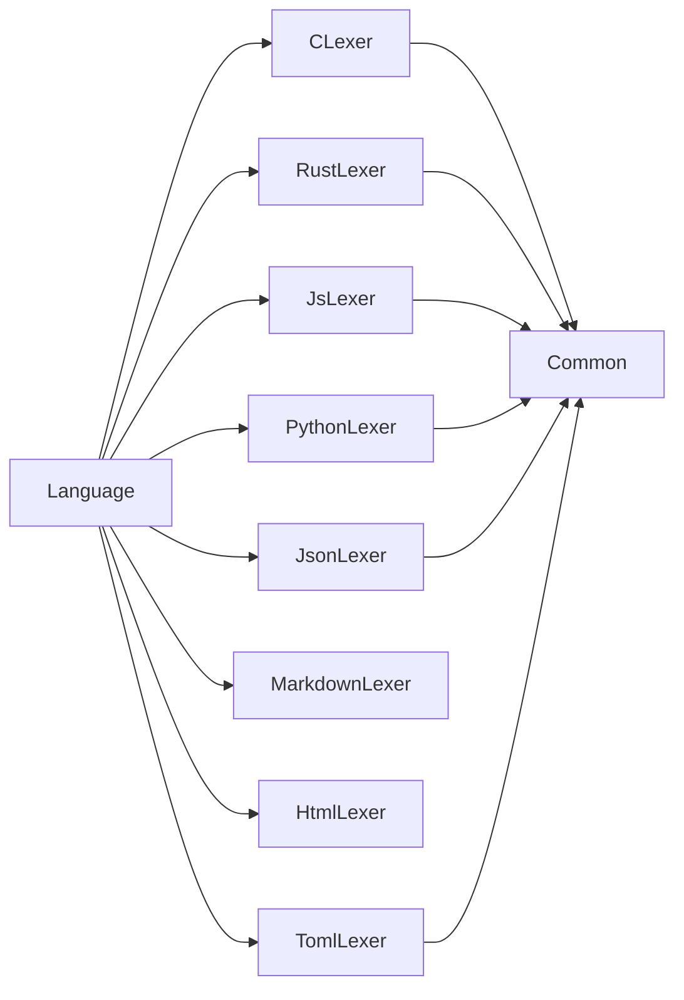

# Lexer Trait 设计

<cite>
**本文引用的文件**
- [mod.rs](file://crates/aether-core/src/lexer/mod.rs)
- [common.rs](file://crates/aether-core/src/lexer/common.rs)
- [c_lexer.rs](file://crates/aether-core/src/lexer/c_lexer.rs)
- [rust_lexer.rs](file://crates/aether-core/src/lexer/rust_lexer.rs)
- [js_lexer.rs](file://crates/aether-core/src/lexer/js_lexer.rs)
- [python_lexer.rs](file://crates/aether-core/src/lexer/python_lexer.rs)
- [json_lexer.rs](file://crates/aether-core/src/lexer/json_lexer.rs)
- [markdown_lexer.rs](file://crates/aether-core/src/lexer/markdown_lexer.rs)
- [html_lexer.rs](file://crates/aether-core/src/lexer/html_lexer.rs)
- [toml_lexer.rs](file://crates/aether-core/src/lexer/toml_lexer.rs)
</cite>

## 目录
1. [简介](#简介)
2. [项目结构](#项目结构)
3. [核心组件](#核心组件)
4. [架构总览](#架构总览)
5. [详细组件分析](#详细组件分析)
6. [依赖关系分析](#依赖关系分析)
7. [性能考量](#性能考量)
8. [故障排查指南](#故障排查指南)
9. [结论](#结论)
10. [附录：新语言支持与自定义 Lexer 开发指南](#附录新语言支持与自定义-lexer-开发指南)

## 简介
本技术文档围绕 Lexer trait 的统一接口与实现展开，系统阐述以下要点：
- Lexer trait 的 lex_full 方法设计理念与参数规范
- TokenKind 枚举的完整分类体系（关键字、标识符、字面量、注释、运算符等）
- LexemeSpan 结构体的字段含义与内存布局优化
- Language 枚举的语言检测机制与 create_lexer 工厂方法原理
- 多语言 Lexer 的实现模式与差异点
- 新增语言支持的开发指南与自定义 Lexer 示例路径

## 项目结构
Lexer 子系统位于 aether-core 的 lexer 模块中，采用“统一接口 + 多语言实现”的组织方式：
- 公共接口与类型定义集中在 mod.rs
- 通用扫描工具函数集中在 common.rs
- 各语言独立实现文件（C/Rust/JS/Python/JSON/Markdown/HTML/TOML）



图表来源
- [mod.rs:1-296](file://crates/aether-core/src/lexer/mod.rs#L1-L296)
- [common.rs:1-151](file://crates/aether-core/src/lexer/common.rs#L1-L151)
- [c_lexer.rs:1-542](file://crates/aether-core/src/lexer/c_lexer.rs#L1-L542)
- [rust_lexer.rs:1-769](file://crates/aether-core/src/lexer/rust_lexer.rs#L1-L769)
- [js_lexer.rs:1-778](file://crates/aether-core/src/lexer/js_lexer.rs#L1-L778)
- [python_lexer.rs:1-545](file://crates/aether-core/src/lexer/python_lexer.rs#L1-L545)
- [json_lexer.rs:1-278](file://crates/aether-core/src/lexer/json_lexer.rs#L1-L278)
- [markdown_lexer.rs:1-470](file://crates/aether-core/src/lexer/markdown_lexer.rs#L1-L470)
- [html_lexer.rs:1-310](file://crates/aether-core/src/lexer/html_lexer.rs#L1-L310)
- [toml_lexer.rs:1-374](file://crates/aether-core/src/lexer/toml_lexer.rs#L1-L374)

章节来源
- [mod.rs:1-296](file://crates/aether-core/src/lexer/mod.rs#L1-L296)
- [common.rs:1-151](file://crates/aether-core/src/lexer/common.rs#L1-L151)

## 核心组件
本节聚焦 Lexer trait、TokenKind、LexemeSpan、Language 四大核心构件。

- Lexer trait
  - 职责：对单行文本进行全量词法分析，返回按字节跨度标注的词法单元序列。
  - 方法：lex_full(&self, text: &str) -> Vec<LexemeSpan>
  - 设计要点：
    - 输入为 UTF-8 字符串切片，避免拷贝；内部以字节流驱动扫描，保证高性能。
    - 输出为 LexemeSpan 向量，每个元素包含起始位置、长度、类型与扩展标志位。
    - 无状态或轻量状态：大多数实现为无状态 struct，便于并发复用。

- TokenKind 枚举
  - 作用：跨语言的统一词法单元分类，涵盖关键字、标识符、各类字面量、注释、运算符、分隔符、预处理指令、属性/注解、类型名、函数名、宏、生命周期、泛型、正则表达式、格式化字符串、Markdown 标题/链接/代码/强调、JSON 键、TOML 表头、空白、换行、未知、EOF 等。
  - 内存布局：使用 #[repr(u8)] 紧凑表示，利于缓存友好与快速匹配。

- LexemeSpan 结构体
  - 字段：start(usize)、len(usize)、kind(TokenKind)、flags(u8)
  - 语义：
    - start/len 基于 UTF-8 字节偏移，确保与编辑器缓冲区一致。
    - kind 指明词法类别。
    - flags 用于携带额外信息（如 Markdown 标题级别、强调标记数量等）。
  - 内存布局优化：
    - 使用 usize 作为索引，避免指针开销。
    - flags 使用 u8 承载小范围元数据，减少空间占用。
    - 整体结构体较小，适合批量生成与后续渲染管线消费。

- Language 枚举与工厂
  - 语言检测：
    - from_extension(ext: &str) -> Self：根据扩展名映射到具体语言，含大量常见变体（如 TSX、SCSS、Vue 等）。
    - from_path(path: &Path) -> Self：从路径提取扩展名并调用上述方法。
  - 工厂方法：
    - create_lexer(&self) -> Box<dyn Lexer>：动态分发创建对应语言的 Lexer 实例。
    - lex_full(&self, text: &str) -> Vec<LexemeSpan>：静态分发直接调用具体 Lexer 的 lex_full，避免 Box 分配与虚调用开销。

章节来源
- [mod.rs:1-296](file://crates/aether-core/src/lexer/mod.rs#L1-L296)

## 架构总览
下图展示 Language 如何调度不同 Lexer 实现，以及各 Lexer 对通用工具的复用关系。



图表来源
- [mod.rs:1-296](file://crates/aether-core/src/lexer/mod.rs#L1-L296)
- [c_lexer.rs:1-542](file://crates/aether-core/src/lexer/c_lexer.rs#L1-L542)
- [rust_lexer.rs:1-769](file://crates/aether-core/src/lexer/rust_lexer.rs#L1-L769)
- [js_lexer.rs:1-778](file://crates/aether-core/src/lexer/js_lexer.rs#L1-L778)
- [python_lexer.rs:1-545](file://crates/aether-core/src/lexer/python_lexer.rs#L1-L545)
- [json_lexer.rs:1-278](file://crates/aether-core/src/lexer/json_lexer.rs#L1-L278)
- [markdown_lexer.rs:1-470](file://crates/aether-core/src/lexer/markdown_lexer.rs#L1-L470)
- [html_lexer.rs:1-310](file://crates/aether-core/src/lexer/html_lexer.rs#L1-L310)
- [toml_lexer.rs:1-374](file://crates/aether-core/src/lexer/toml_lexer.rs#L1-L374)

## 详细组件分析

### C 语言 Lexer（CLexer）
- 特点：
  - 基于 DFA 风格的逐字节扫描，处理空白、换行、注释（行/块/文档）、预处理指令、字符串/字符字面量、数字（含进制前缀与后缀）、标识符与关键字、运算符、标点与未知字符。
  - 数字解析考虑十六进制/二进制前缀、浮点小数点与指数、整数后缀，防止 1..2 被合并。
  - 运算符识别支持复合赋值与移位等组合。
  - 文档注释通过判断是否以 /** 开头且非空块注释来区分。
- 关键流程（片段）：
  - 遇到 '/' 时分支判断 // 与 /*，前者走行注释，后者走块注释并判定是否为文档注释。
  - 数字解析在遇到 '.' 时检查后续是否为 '.' 以避免范围语法误判。

```mermaid
flowchart TD
Start(["进入 lex_next"]) --> CheckEOF{"pos >= len?"}
CheckEOF --> |是| ReturnEOF["返回 EOF"]
CheckEOF --> |否| ReadCh["读取当前字节"]
ReadCh --> Branch{"首字节分类"}
Branch --> |空白/制表/回车| SkipWS["skip_whitespace"]
Branch --> |换行| NewlineTok["Newline token"]
Branch --> |'/'| SlashCase["分支：// 或 /* 或 运算符"]
Branch --> |'#'| Preproc["skip_preprocessor -> Preprocessor"]
Branch --> |'"'| StringLit["skip_quoted -> StringLiteral"]
Branch --> |"'"| CharLit["skip_quoted -> CharLiteral"]
Branch --> |数字| Number["skip_number -> NumberLiteral"]
Branch --> |字母/下划线| Ident["skip_identifier -> Keyword/Identifier"]
Branch --> |运算符集| Operator["skip_operator -> Operator"]
Branch --> |标点集| Punct["Punctuation"]
Branch --> |其他| Unknown["utf8_char_len -> Unknown"]
SkipWS --> Push["push token"]
NewlineTok --> Push
SlashCase --> Push
Preproc --> Push
StringLit --> Push
CharLit --> Push
Number --> Push
Ident --> Push
Operator --> Push
Punct --> Push
Unknown --> Push
Push --> NextPos["更新 pos"]
NextPos --> End(["结束/继续循环"])
```

图表来源
- [c_lexer.rs:12-230](file://crates/aether-core/src/lexer/c_lexer.rs#L12-L230)
- [c_lexer.rs:302-410](file://crates/aether-core/src/lexer/c_lexer.rs#L302-L410)

章节来源
- [c_lexer.rs:1-542](file://crates/aether-core/src/lexer/c_lexer.rs#L1-542)

### Rust 语言 Lexer（RustLexer）
- 特点：
  - 支持行注释与块注释，其中 /// 与 /** 被识别为文档注释。
  - 属性 # 与内联属性 #! 均识别为 Attribute。
  - 生命周期 'a 与字符字面量 'x' 的区分逻辑严谨，避免转义字符字面量误判。
  - 内置类型与宏名识别，提升高亮质量。
  - 数字解析支持多种进制与前缀，阻止 1..2 合并。
- 关键流程（片段）：
  - 遇到 ' 时优先判断转义字符字面量，其次单字符字面量，最后生命周期。
  - 块注释支持嵌套深度计数，未闭合时推进至末尾避免残留字节。



图表来源
- [rust_lexer.rs:12-353](file://crates/aether-core/src/lexer/rust_lexer.rs#L12-L353)
- [rust_lexer.rs:361-459](file://crates/aether-core/src/lexer/rust_lexer.rs#L361-L459)
- [rust_lexer.rs:461-511](file://crates/aether-core/src/lexer/rust_lexer.rs#L461-L511)

章节来源
- [rust_lexer.rs:1-769](file://crates/aether-core/src/lexer/rust_lexer.rs#L1-769)

### JavaScript/TypeScript Lexer（JsLexer）
- 特点：
  - 支持行注释与块注释。
  - 斜杠上下文敏感：在特定上下文中识别为正则表达式字面量，否则为运算符。
  - 模板字符串 `` `...` `` 识别为 FormatString，支持 ${...} 插值。
  - 数字解析支持 BigInt 后缀 n，阻止 1..2 合并。
  - 运算符覆盖现代语法（??、?.、**=、>>> 等）。
- 关键流程（片段）：
  - 遇到 '/' 时回溯最近非空白字符判断是否为正则上下文。
  - 模板字符串解析时维护 ${...} 的深度计数。



图表来源
- [js_lexer.rs:12-274](file://crates/aether-core/src/lexer/js_lexer.rs#L12-L274)
- [js_lexer.rs:421-473](file://crates/aether-core/src/lexer/js_lexer.rs#L421-L473)
- [js_lexer.rs:475-534](file://crates/aether-core/src/lexer/js_lexer.rs#L475-L534)

章节来源
- [js_lexer.rs:1-778](file://crates/aether-core/src/lexer/js_lexer.rs#L1-L778)

### Python 语言 Lexer（PythonLexer）
- 特点：
  - 支持三引号字符串与 f-string（f"..." 或 f'...'），f-string 前缀在引号之前。
  - 数字解析支持复数后缀 j，阻止 1..2 合并。
  - 关键字与内置函数/类型识别。
- 关键流程（片段）：
  - 遇到 f 后紧跟引号则识别为 FormatString。
  - 三引号字符串通过 skip_triple_quoted 定位结束。

章节来源
- [python_lexer.rs:1-545](file://crates/aether-core/src/lexer/python_lexer.rs#L1-L545)

### JSON 语言 Lexer（JsonLexer）
- 特点：
  - 字符串后若紧接冒号（忽略空白）则识别为 JsonKey。
  - 数字解析遵循 JSON 规范（可选负号、小数、指数）。
  - true/false/null 识别为 Keyword。
- 关键流程（片段）：
  - is_json_key 在字符串结束后跳过空白并检查 ':'。

章节来源
- [json_lexer.rs:1-278](file://crates/aether-core/src/lexer/json_lexer.rs#L1-L278)

### Markdown 语言 Lexer（MarkdownLexer）
- 特点：
  - 标题 #n 行识别，level 存入 flags。
  - 代码块 ``` 与行内代码 `...` 识别为 MdCode。
  - 链接 [text](url) 识别为 MdLink。
  - 强调 *...* 或 _..._ 识别为 MdEmphasis，flags 记录标记数量。
  - 列表项（无序/有序）识别为 Punctuation。
  - HTML 标签识别为 MdCode。
- 关键流程（片段）：
  - 强调匹配失败时仅消耗开放标记，避免整行误标。

章节来源
- [markdown_lexer.rs:1-470](file://crates/aether-core/src/lexer/markdown_lexer.rs#L1-L470)

### HTML 语言 Lexer（HtmlLexer）
- 特点：
  - 注释 <!-- ... --> 识别为 BlockComment。
  - 标签 <tag attr="value"> 解析为 Keyword（标签名）、Attribute（属性名）、Operator（=）、StringLiteral（属性值）、Punctuation（> 或 /）。
  - 实体引用 &name; 识别为 Identifier。
  - 普通文本收集为非结构化 Unknown。
- 关键流程（片段）：
  - 标签名解析后进入属性循环，处理等号与值（有引号/无引号）。

章节来源
- [html_lexer.rs:1-310](file://crates/aether-core/src/lexer/html_lexer.rs#L1-L310)

### TOML 语言 Lexer（TomlLexer）
- 特点：
  - 表头 [table] 与 [[array]] 识别为 TomlTable。
  - 字符串支持双引号与单引号（literal string）。
  - 数字/日期混合解析，布尔 true/false 识别为 Keyword。
  - 键统一使用 Identifier（而非 JsonKey）。
- 关键流程（片段）：
  - 正负号仅在后跟数字时作为数字起始，否则为标点。

章节来源
- [toml_lexer.rs:1-374](file://crates/aether-core/src/lexer/toml_lexer.rs#L1-L374)

### 纯文本与通用工具
- PlainTextLexer：将整段文本视为单个 Unknown token，适用于图片或非文本文件。
- common.rs 工具函数：
  - skip_whitespace：跳过空格、制表符、回车。
  - skip_line_comment：跳过 // 行注释。
  - skip_block_comment：跳过 /* ... */ 块注释。
  - skip_quoted：跳过由指定引号包围的字符串，正确处理转义与边界。
  - skip_identifier_ascii / skip_identifier_with：标识符扫描。
  - skip_number_generic：可配置的数字扫描框架。

章节来源
- [mod.rs:194-221](file://crates/aether-core/src/lexer/mod.rs#L194-L221)
- [common.rs:1-151](file://crates/aether-core/src/lexer/common.rs#L1-L151)

## 依赖关系分析
- 耦合与内聚：
  - 各语言 Lexer 高度内聚于自身语法细节，对外仅依赖 Lexer trait 与通用工具。
  - Language 作为集中调度者，提供动态与静态两种分发策略。
- 外部依赖：
  - 主要依赖标准库 Path 与字符串/字节操作，无第三方运行时依赖。
- 潜在循环依赖：
  - 模块间单向依赖（Language -> 具体 Lexer -> common），不存在循环。



图表来源
- [mod.rs:145-182](file://crates/aether-core/src/lexer/mod.rs#L145-L182)
- [common.rs:1-151](file://crates/aether-core/src/lexer/common.rs#L1-L151)

章节来源
- [mod.rs:145-182](file://crates/aether-core/src/lexer/mod.rs#L145-L182)

## 性能考量
- 零拷贝与字节级扫描：
  - lex_full 接收 &str，内部以 as_bytes() 遍历，避免中间字符串分配。
- 预分配容量：
  - Vec::with_capacity(text.len() / 4 + 1) 预估 token 数量，降低扩容成本。
- 紧凑类型：
  - TokenKind 使用 #[repr(u8)]，LexemeSpan 使用 usize/u8，减少内存占用。
- 静态分发优化：
  - Language::lex_full 直接调用具体 Lexer 的 lex_full，避免 Box 分配与虚调用。
- 复杂场景注意：
  - 大文件建议结合增量词法分析（见 incremental_lexer.rs）以减少重复扫描。
  - 正则/模板/嵌套注释等复杂语法需小心边界条件，避免越界与死循环。

[本节为通用指导，不直接分析具体文件]

## 故障排查指南
- 常见问题与定位思路：
  - 中文/Emoji 错位：确认未知字符分支使用 utf8_char_len 推进，避免按字节拆分导致高亮错位。
  - 1..2 范围语法误判：检查数字解析中对 '.' 的二次出现与后续 '.' 的检测。
  - 正则与除号歧义（JS）：确认斜杠上下文回溯逻辑是否正确。
  - 未闭合注释/字符串：检查 skip_* 函数边界处理与回退逻辑。
  - 属性/注解识别（Rust）：确认 # 与 ! 的组合与 [...] 括号深度计数。
- 调试建议：
  - 打印 LexemeSpan 的 start/len/kind/flags，核对与源文本的对应关系。
  - 针对边界用例（空串、末尾反斜杠、未闭合引号/注释）编写单元测试。

章节来源
- [mod.rs:223-233](file://crates/aether-core/src/lexer/mod.rs#L223-L233)
- [c_lexer.rs:302-350](file://crates/aether-core/src/lexer/c_lexer.rs#L302-L350)
- [js_lexer.rs:475-534](file://crates/aether-core/src/lexer/js_lexer.rs#L475-L534)
- [rust_lexer.rs:461-511](file://crates/aether-core/src/lexer/rust_lexer.rs#L461-L511)

## 结论
Lexer trait 通过统一的 lex_full 接口与紧凑的 LexemeSpan 输出，在多语言场景中实现了高效、可扩展的词法分析能力。Language 枚举提供了便捷的语言检测与工厂方法，既支持动态分发也提供静态分发优化。各语言 Lexer 在保持内聚的同时复用通用工具，兼顾了正确性与性能。

[本节为总结性内容，不直接分析具体文件]

## 附录：新语言支持与自定义 Lexer 开发指南

- 新增语言步骤
  1. 在 mod.rs 的 Language 枚举中添加新语言变体。
  2. 在 Language::from_extension 与 Language::from_path 中增加扩展名映射。
  3. 在 Language::create_lexer 与 Language::lex_full 中注册新 Lexer 的创建与静态分发。
  4. 新建语言实现文件（例如 mylang_lexer.rs），实现 Lexer trait 的 lex_full 方法。
     - 建议采用逐字节扫描模式，复用 common.rs 中的工具函数。
     - 明确 TokenKind 的使用策略，必要时利用 flags 携带额外信息。
  5. 在 mod.rs 中 pub mod 引入新实现文件。
  6. 编写单元测试，覆盖关键字、字面量、注释、运算符、边界情况。

- 自定义 Lexer 示例路径
  - 参考现有实现：
    - [c_lexer.rs:12-230](file://crates/aether-core/src/lexer/c_lexer.rs#L12-L230)
    - [rust_lexer.rs:12-353](file://crates/aether-core/src/lexer/rust_lexer.rs#L12-L353)
    - [js_lexer.rs:12-274](file://crates/aether-core/src/lexer/js_lexer.rs#L12-L274)
    - [python_lexer.rs:12-219](file://crates/aether-core/src/lexer/python_lexer.rs#L12-L219)
    - [json_lexer.rs:12-127](file://crates/aether-core/src/lexer/json_lexer.rs#L12-L127)
    - [markdown_lexer.rs:11-209](file://crates/aether-core/src/lexer/markdown_lexer.rs#L11-L209)
    - [html_lexer.rs:10-221](file://crates/aether-core/src/lexer/html_lexer.rs#L10-L221)
    - [toml_lexer.rs:12-228](file://crates/aether-core/src/lexer/toml_lexer.rs#L12-L228)

- 最佳实践
  - 使用 utf8_char_len 处理未知字符，确保 UTF-8 完整性。
  - 数字解析务必考虑进制前缀、小数点与指数，避免范围语法误判。
  - 对于复杂语法（正则、模板、嵌套注释），维护深度计数与边界保护。
  - 充分利用 flags 传递轻量元数据（如标题级别、强调强度）。
  - 为每种语言编写充分的单元测试，覆盖空串、边界与异常输入。

章节来源
- [mod.rs:98-182](file://crates/aether-core/src/lexer/mod.rs#L98-L182)
- [c_lexer.rs:12-230](file://crates/aether-core/src/lexer/c_lexer.rs#L12-L230)
- [rust_lexer.rs:12-353](file://crates/aether-core/src/lexer/rust_lexer.rs#L12-L353)
- [js_lexer.rs:12-274](file://crates/aether-core/src/lexer/js_lexer.rs#L12-L274)
- [python_lexer.rs:12-219](file://crates/aether-core/src/lexer/python_lexer.rs#L12-L219)
- [json_lexer.rs:12-127](file://crates/aether-core/src/lexer/json_lexer.rs#L12-L127)
- [markdown_lexer.rs:11-209](file://crates/aether-core/src/lexer/markdown_lexer.rs#L11-L209)
- [html_lexer.rs:10-221](file://crates/aether-core/src/lexer/html_lexer.rs#L10-L221)
- [toml_lexer.rs:12-228](file://crates/aether-core/src/lexer/toml_lexer.rs#L12-L228)