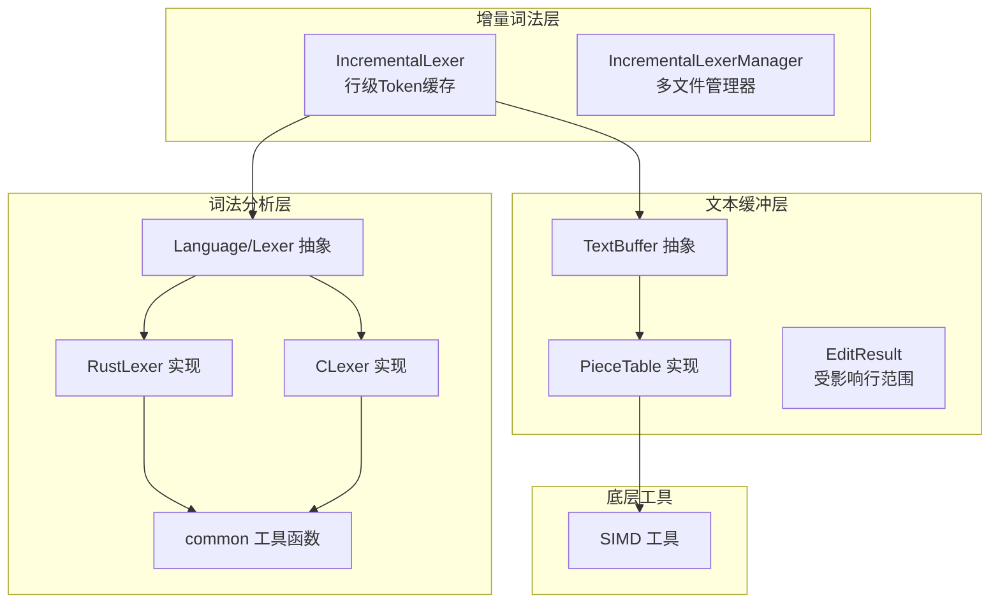
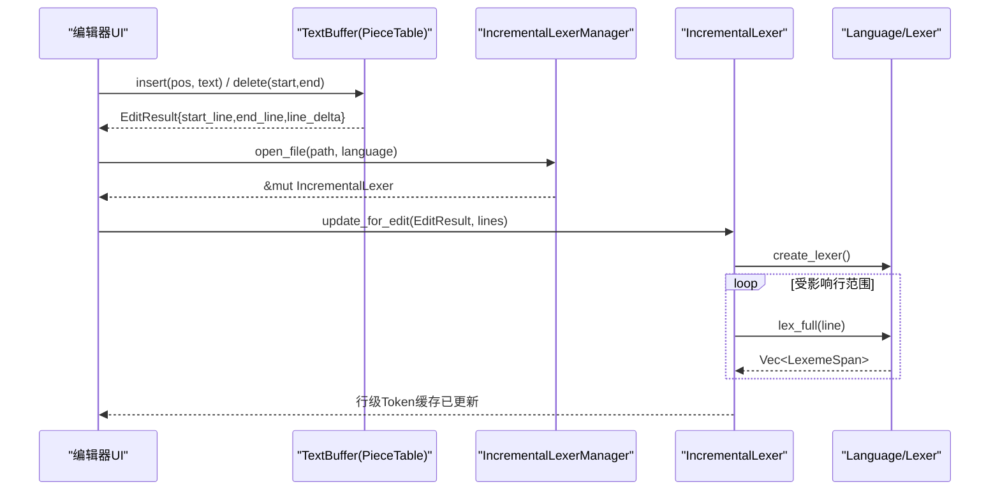
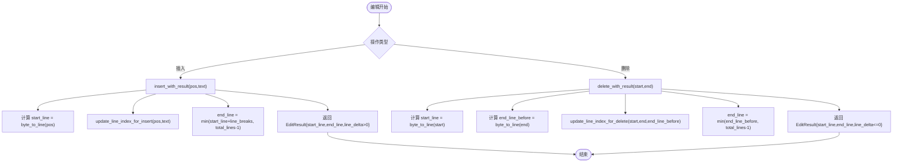
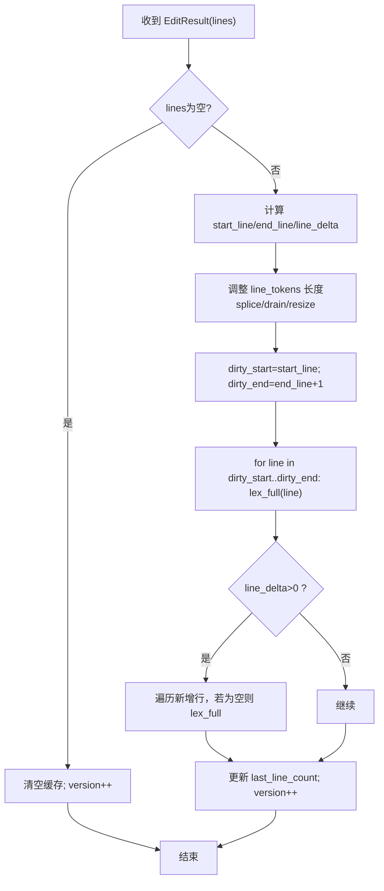
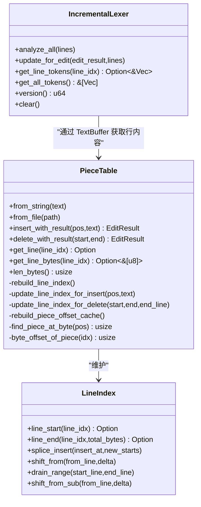
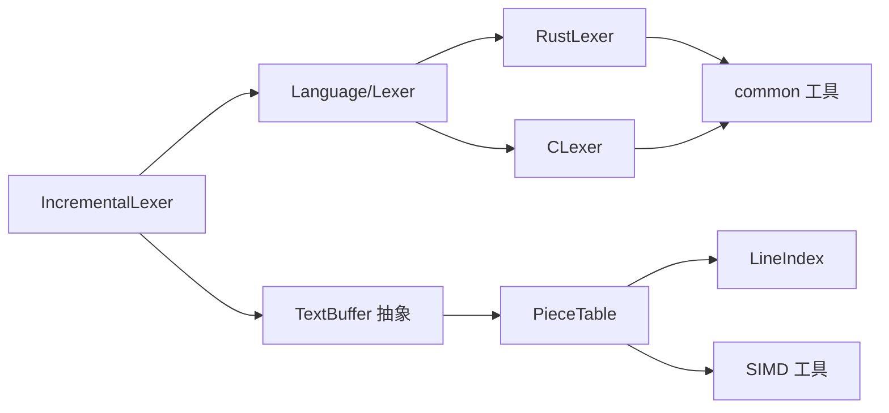

# 增量词法分析

<cite>
**本文引用的文件**   
- [crates/aether-core/src/incremental_lexer.rs](file://crates/aether-core/src/incremental_lexer.rs)
- [crates/aether-core/src/buffer/piece_table.rs](file://crates/aether-core/src/buffer/piece_table.rs)
- [crates/aether-core/src/buffer/text_buffer.rs](file://crates/aether-core/src/buffer/text_buffer.rs)
- [crates/aether-core/src/lexer/mod.rs](file://crates/aether-core/src/lexer/mod.rs)
- [crates/aether-core/src/lexer/common.rs](file://crates/aether-core/src/lexer/common.rs)
- [crates/aether-core/src/lexer/rust_lexer.rs](file://crates/aether-core/src/lexer/rust_lexer.rs)
- [crates/aether-core/src/simd_utils.rs](file://crates/aether-core/src/simd_utils.rs)
- [crates/aether-core/benches/lexer_bench.rs](file://crates/aether-core/benches/lexer_bench.rs)
</cite>

## 目录
1. [简介](#简介)
2. [项目结构](#项目结构)
3. [核心组件](#核心组件)
4. [架构总览](#架构总览)
5. [详细组件分析](#详细组件分析)
6. [依赖关系分析](#依赖关系分析)
7. [性能考量](#性能考量)
8. [故障排查指南](#故障排查指南)
9. [结论](#结论)
10. [附录：使用示例与最佳实践](#附录使用示例与最佳实践)

## 简介
本技术文档围绕“增量词法分析系统”展开，聚焦以下目标：
- 变更检测算法的工作原理：文本差异计算、影响范围确定。
- 部分重分析的触发条件与执行策略：如何最小化重新分析的文本范围。
- 缓存机制设计与失效策略：Token 缓存、行级缓存、跨行依赖处理。
- 增量分析与 Piece Table 数据结构的集成方式。
- 性能优化技巧、内存管理策略与调试方法。
- 具体使用示例与最佳实践指南。

该实现以“行级 Token 缓存 + 基于编辑结果的增量更新”为核心，结合 Piece Table 的 O(1) 插入/删除能力与高效的行索引维护，确保在高频编辑场景下保持低延迟与高吞吐。

## 项目结构
与增量词法分析直接相关的核心模块位于 aether-core crate 中：
- 增量词法分析器：按行缓存 LexemeSpan，依据 EditResult 进行局部重分析。
- 文本缓冲区抽象：统一 insert/delete 接口，返回受影响的行范围（EditResult）。
- Piece Table 实现：支持高效插入/删除、行索引维护、前缀和偏移缓存。
- 语言与词法分析器：通用 Lexer trait 与多语言实现（Rust/C/JS/Python 等）。
- SIMD 工具：加速换行符查找、空白跳过、前缀匹配等。

图表来源
- [crates/aether-core/src/incremental_lexer.rs:1-130](file://crates/aether-core/src/incremental_lexer.rs#L1-L130)
- [crates/aether-core/src/buffer/text_buffer.rs:1-172](file://crates/aether-core/src/buffer/text_buffer.rs#L1-L172)
- [crates/aether-core/src/buffer/piece_table.rs:117-781](file://crates/aether-core/src/buffer/piece_table.rs#L117-L781)
- [crates/aether-core/src/lexer/mod.rs:1-182](file://crates/aether-core/src/lexer/mod.rs#L1-L182)
- [crates/aether-core/src/lexer/common.rs:1-151](file://crates/aether-core/src/lexer/common.rs#L1-L151)
- [crates/aether-core/src/simd_utils.rs:1-171](file://crates/aether-core/src/simd_utils.rs#L1-L171)

章节来源
- [crates/aether-core/src/incremental_lexer.rs:1-130](file://crates/aether-core/src/incremental_lexer.rs#L1-L130)
- [crates/aether-core/src/buffer/text_buffer.rs:1-172](file://crates/aether-core/src/buffer/text_buffer.rs#L1-L172)
- [crates/aether-core/src/buffer/piece_table.rs:117-781](file://crates/aether-core/src/buffer/piece_table.rs#L117-L781)
- [crates/aether-core/src/lexer/mod.rs:1-182](file://crates/aether-core/src/lexer/mod.rs#L1-L182)
- [crates/aether-core/src/lexer/common.rs:1-151](file://crates/aether-core/src/lexer/common.rs#L1-L151)
- [crates/aether-core/src/simd_utils.rs:1-171](file://crates/aether-core/src/simd_utils.rs#L1-L171)

## 核心组件
- 增量词法分析器 IncrementalLexer
  - 维护每行的 LexemeSpan 列表（Vec<Vec<LexemeSpan>>），行号即索引，O(1) 访问。
  - 提供 analyze_all 全量分析；update_for_edit 根据 EditResult 仅重分析受影响行。
  - 版本控制 version 用于外部失效检测；clear 用于文件切换时清理。
- 增量词法分析管理器 IncrementalLexerManager
  - 管理多个文件的 IncrementalLexer，限制最大缓存数量，避免无界增长。
- 文本缓冲区 TextBuffer 抽象与 EditResult
  - 所有操作基于字节偏移；返回受影响行范围（start_line, end_line, line_delta）。
- Piece Table 数据结构
  - 支持 O(1) 插入/删除，维护行索引 LineIndex 与前缀和偏移缓存 piece_offset_cache。
  - 提供 get_line_bytes 零拷贝路径，跨 piece 回退拼接。
- 语言与词法分析器 Language/Lexer
  - 统一 Lexer trait，lex_full 对单行进行全量分析；Language 提供静态分发 lex_full。
- SIMD 工具
  - count_newlines_simd、find_byte_simd、skip_whitespace_simd 等加速基础扫描。

章节来源
- [crates/aether-core/src/incremental_lexer.rs:1-130](file://crates/aether-core/src/incremental_lexer.rs#L1-L130)
- [crates/aether-core/src/buffer/text_buffer.rs:124-172](file://crates/aether-core/src/buffer/text_buffer.rs#L124-L172)
- [crates/aether-core/src/buffer/piece_table.rs:117-781](file://crates/aether-core/src/buffer/piece_table.rs#L117-L781)
- [crates/aether-core/src/lexer/mod.rs:1-182](file://crates/aether-core/src/lexer/mod.rs#L1-L182)
- [crates/aether-core/src/simd_utils.rs:1-171](file://crates/aether-core/src/simd_utils.rs#L1-L171)

## 架构总览
增量词法分析的整体流程如下：
- 文本编辑通过 TextBuffer.insert/delete 完成，返回 EditResult（受影响行范围）。
- IncrementalLexer.update_for_edit 接收 EditResult 与当前 lines 切片，调整内部 Vec 长度并仅重分析受影响行。
- 行级 Token 缓存命中后直接读取，渲染或下游消费无需重复分析。
- Piece Table 负责高效维护文本内容与行索引，为上层提供 get_line 等接口。

图表来源
- [crates/aether-core/src/buffer/text_buffer.rs:124-172](file://crates/aether-core/src/buffer/text_buffer.rs#L124-L172)
- [crates/aether-core/src/incremental_lexer.rs:36-101](file://crates/aether-core/src/incremental_lexer.rs#L36-L101)
- [crates/aether-core/src/lexer/mod.rs:144-182](file://crates/aether-core/src/lexer/mod.rs#L144-L182)

## 详细组件分析

### 变更检测算法与影响范围确定
- 文本差异计算
  - TextBuffer 的 insert_with_result 与 delete_with_result 返回 EditResult，包含 start_line、end_line、line_delta。
  - Piece Table 在插入/删除后维护 LineIndex，保证行号到字节偏移的 O(1) 转换。
- 影响范围确定
  - 插入：start_line 为插入位置所在行；end_line 为插入文本最后一个换行所在的行（或末尾行）；line_delta 为正数表示新增行数。
  - 删除：start_line 为删除起始行；end_line_before 为删除结束行；删除后根据剩余行数计算 end_line；line_delta 为负数表示减少行数。
- 行索引增量更新
  - update_line_index_for_insert：从插入行之后整体偏移 +insert_len，并在中间插入新行起点。
  - update_line_index_for_delete：删除被覆盖的行起点，并对后续行整体偏移 -delete_len。

图表来源
- [crates/aether-core/src/buffer/piece_table.rs:170-282](file://crates/aether-core/src/buffer/piece_table.rs#L170-L282)
- [crates/aether-core/src/buffer/piece_table.rs:289-408](file://crates/aether-core/src/buffer/piece_table.rs#L289-L408)
- [crates/aether-core/src/buffer/piece_table.rs:712-781](file://crates/aether-core/src/buffer/piece_table.rs#L712-L781)

章节来源
- [crates/aether-core/src/buffer/piece_table.rs:170-282](file://crates/aether-core/src/buffer/piece_table.rs#L170-L282)
- [crates/aether-core/src/buffer/piece_table.rs:289-408](file://crates/aether-core/src/buffer/piece_table.rs#L289-L408)
- [crates/aether-core/src/buffer/piece_table.rs:712-781](file://crates/aether-core/src/buffer/piece_table.rs#L712-L781)

### 部分重分析的触发条件与执行策略
- 触发条件
  - 当 TextBuffer 返回 EditResult 非默认值（存在受影响行）时，调用 IncrementalLexer.update_for_edit。
  - 空缓冲区或空行集合会清空缓存并提升版本号。
- 执行策略
  - 调整内部 line_tokens 长度：根据 line_delta 插入或删除行槽位，确保与 lines 长度一致。
  - 计算 dirty_start 与 dirty_end：通常为 start_line..=end_line 的范围。
  - 仅对该范围内的行调用 lexer.lex_full 进行重分析。
  - 若插入导致行数增加，额外对新插入的空行进行 lex_full。
  - 更新 last_line_count 与 version。

图表来源
- [crates/aether-core/src/incremental_lexer.rs:36-101](file://crates/aether-core/src/incremental_lexer.rs#L36-L101)

章节来源
- [crates/aether-core/src/incremental_lexer.rs:36-101](file://crates/aether-core/src/incremental_lexer.rs#L36-L101)

### 缓存机制设计与失效策略
- Token 缓存
  - 行级缓存：line_tokens 为 Vec<Vec<LexemeSpan>>，行号即索引，O(1) 获取。
  - 版本控制：version 每次编辑后递增，供外部判断是否需要刷新。
- 行级缓存失效
  - 基于 EditResult 精确计算受影响行范围，仅重分析该行及其相邻行（若有必要）。
  - 插入/删除导致的行号偏移通过 splice/drain 调整，避免重建整个 Vec。
- 跨行依赖处理
  - 当前实现为行级独立分析，未显式维护跨行状态机；适用于大多数语法的高亮需求。
  - 若未来需要跨行语义（如多行字符串、块注释边界），可在 Lexer 中引入行间上下文或扩展受影响范围。
- 文件级缓存上限
  - IncrementalLexerManager 限制 MAX_INCREMENTAL_LEXER_FILES，超过阈值时清空缓存，防止长时间运行后无界增长。

章节来源
- [crates/aether-core/src/incremental_lexer.rs:1-130](file://crates/aether-core/src/incremental_lexer.rs#L1-L130)
- [crates/aether-core/src/incremental_lexer.rs:131-193](file://crates/aether-core/src/incremental_lexer.rs#L131-L193)

### 增量分析与 Piece Table 的集成方式
- 文本获取
  - Piece Table 提供 get_line 与 get_line_bytes，优先零拷贝路径；跨 piece 时回退拼接。
  - 行字节范围由 line_byte_range 提供，基于 LineIndex 的 O(1) 查找。
- 行索引维护
  - rebuild_line_index 使用 SIMD 加速换行符查找，构建每行起始字节偏移。
  - 增量更新：update_line_index_for_insert/update_line_index_for_delete 原地修改行索引，避免全量重建。
- 偏移缓存
  - piece_offset_cache 作为前缀和缓存，O(1) 获取任意 piece 的起始字节偏移，加速 find_piece_at_byte。

图表来源
- [crates/aether-core/src/buffer/piece_table.rs:117-781](file://crates/aether-core/src/buffer/piece_table.rs#L117-L781)
- [crates/aether-core/src/incremental_lexer.rs:1-130](file://crates/aether-core/src/incremental_lexer.rs#L1-L130)

章节来源
- [crates/aether-core/src/buffer/piece_table.rs:117-781](file://crates/aether-core/src/buffer/piece_table.rs#L117-L781)
- [crates/aether-core/src/incremental_lexer.rs:1-130](file://crates/aether-core/src/incremental_lexer.rs#L1-L130)

### 词法分析器与语言适配
- 通用 Lexer trait
  - lex_full 对单行文本进行全量分析，返回 LexemeSpan 列表。
- 语言选择与静态分发
  - Language::create_lexer 动态创建具体语言 Lexer；Language::lex_full 静态分发，避免 Box 分配与动态分发开销。
- Rust 词法分析器
  - 支持关键字、标识符、字符串/字符字面量、数字、注释、属性、生命周期、宏调用等。
  - 使用 common 工具函数进行空白、注释、引号、标识符、数字、运算符的快速扫描。

章节来源
- [crates/aether-core/src/lexer/mod.rs:1-182](file://crates/aether-core/src/lexer/mod.rs#L1-L182)
- [crates/aether-core/src/lexer/rust_lexer.rs:1-353](file://crates/aether-core/src/lexer/rust_lexer.rs#L1-L353)
- [crates/aether-core/src/lexer/common.rs:1-151](file://crates/aether-core/src/lexer/common.rs#L1-L151)

## 依赖关系分析
- 组件耦合与内聚
  - IncrementalLexer 与 TextBuffer 解耦，通过 EditResult 传递影响范围，内聚于行级缓存与增量更新逻辑。
  - Piece Table 与 LineIndex 紧密耦合，共同维护文本与行映射；piece_offset_cache 进一步提升查询效率。
  - Language/Lexer 抽象清晰，具体语言实现复用 common 工具函数，降低重复代码。
- 直接/间接依赖
  - IncrementalLexer -> Language/Lexer -> 具体语言实现 -> common 工具。
  - TextBuffer -> Piece Table -> LineIndex/SIMD 工具。
- 外部依赖与集成点
  - memmap2 用于大文件内存映射；SIMD 工具在稳定版 Rust 中模拟 SIMD 效果，无需外部依赖。
- 潜在循环依赖
  - 当前设计无循环依赖；各层职责清晰，单向依赖。

图表来源
- [crates/aether-core/src/incremental_lexer.rs:1-130](file://crates/aether-core/src/incremental_lexer.rs#L1-L130)
- [crates/aether-core/src/lexer/mod.rs:1-182](file://crates/aether-core/src/lexer/mod.rs#L1-L182)
- [crates/aether-core/src/buffer/piece_table.rs:117-781](file://crates/aether-core/src/buffer/piece_table.rs#L117-L781)
- [crates/aether-core/src/simd_utils.rs:1-171](file://crates/aether-core/src/simd_utils.rs#L1-L171)

章节来源
- [crates/aether-core/src/incremental_lexer.rs:1-130](file://crates/aether-core/src/incremental_lexer.rs#L1-L130)
- [crates/aether-core/src/lexer/mod.rs:1-182](file://crates/aether-core/src/lexer/mod.rs#L1-L182)
- [crates/aether-core/src/buffer/piece_table.rs:117-781](file://crates/aether-core/src/buffer/piece_table.rs#L117-L781)
- [crates/aether-core/src/simd_utils.rs:1-171](file://crates/aether-core/src/simd_utils.rs#L1-L171)

## 性能考量
- 时间复杂度
  - 行级 Token 缓存访问：O(1)。
  - 增量更新：受影响的行范围 R，每次 lex_full 为 O(L)，总体 O(R*L)。
  - Piece Table 插入/删除：O(1) 片段操作，行索引增量更新 O(K+N-tail)。
  - 行索引查找：O(1)；piece 定位：O(log n) 使用前缀和缓存。
- 空间复杂度
  - 行级缓存：每行 LexemeSpan 列表，内存占用与 token 数量成正比。
  - Piece Table：original mmap + add_buffer + pieces + line_index + offset_cache。
- 优化技巧
  - 使用 piece_offset_cache 替代线性扫描，提升 find_piece_at_byte 与 byte_offset_of_piece 性能。
  - 使用 SIMD 加速换行符计数与查找，显著降低大文件初始化成本。
  - 批量预分配 add_buffer 容量，减少重新分配。
  - 合并碎片阈值 coalesce_threshold 控制碎片合并频率，平衡内存与性能。
- 基准测试
  - benches/lexer_bench.rs 提供多语言样本的性能基准，便于回归评估。

章节来源
- [crates/aether-core/src/buffer/piece_table.rs:643-710](file://crates/aether-core/src/buffer/piece_table.rs#L643-L710)
- [crates/aether-core/src/simd_utils.rs:1-171](file://crates/aether-core/src/simd_utils.rs#L1-L171)
- [crates/aether-core/benches/lexer_bench.rs:136-162](file://crates/aether-core/benches/lexer_bench.rs#L136-L162)

## 故障排查指南
- 常见问题
  - 行索引不一致：检查 update_line_index_for_delete 的 drain 范围与 shift 逻辑是否覆盖边界情况。
  - 跨 piece 文本获取为空：确认 get_text_bytes 返回 None 时回退到 get_text 拼接。
  - 大文件初始化慢：确认 SIMD 路径启用，count_newlines_simd 与 find_byte_simd 正常工作。
- 调试方法
  - 使用 IncrementalLexer.cache_stats 获取缓存命中率统计。
  - 打印 EditResult 验证受影响行范围是否正确。
  - 对比 Piece Table 的 len_lines 与 line_index.len 一致性。
- 错误处理
  - Piece Table 写入校验：write_to 中对 piece 引用越界进行错误返回。
  - 边界钳位：delete_with_result 对 end 进行 min(len_bytes) 保护。

章节来源
- [crates/aether-core/src/incremental_lexer.rs:125-129](file://crates/aether-core/src/incremental_lexer.rs#L125-L129)
- [crates/aether-core/src/buffer/piece_table.rs:499-520](file://crates/aether-core/src/buffer/piece_table.rs#L499-L520)
- [crates/aether-core/src/buffer/piece_table.rs:289-308](file://crates/aether-core/src/buffer/piece_table.rs#L289-L308)

## 结论
本增量词法分析系统通过行级 Token 缓存与 EditResult 驱动的局部重分析，实现了高效的增量更新。Piece Table 提供高性能的文本编辑与行索引维护，配合 SIMD 工具进一步提升了初始化与扫描性能。整体架构清晰、依赖明确，具备良好的可扩展性与可维护性。建议在后续迭代中关注跨行依赖的处理与更精细的影响范围估算，以进一步优化性能与准确性。

## 附录：使用示例与最佳实践
- 基本用法
  - 打开文件：IncrementalLexerManager.open_file(path, language)。
  - 全量分析：IncrementalLexer.analyze_all(lines)。
  - 增量更新：根据 TextBuffer 返回的 EditResult 调用 update_for_edit。
  - 获取 Token：get_line_tokens(line_idx) 或 get_all_tokens()。
- 最佳实践
  - 合理设置 MAX_INCREMENTAL_LEXER_FILES，避免长时间运行后内存膨胀。
  - 在频繁编辑场景下，尽量聚合小编辑，减少 EditResult 的抖动。
  - 对于大文件，优先使用 Piece Table 的零拷贝路径 get_line_bytes。
  - 利用 cache_stats 监控缓存命中率，必要时调整受影响范围估算策略。
- 性能基准
  - 运行 benches/lexer_bench.rs 对不同语言的 lex_full 进行基准测试，评估改动影响。

章节来源
- [crates/aether-core/src/incremental_lexer.rs:131-193](file://crates/aether-core/src/incremental_lexer.rs#L131-L193)
- [crates/aether-core/benches/lexer_bench.rs:136-162](file://crates/aether-core/benches/lexer_bench.rs#L136-L162)