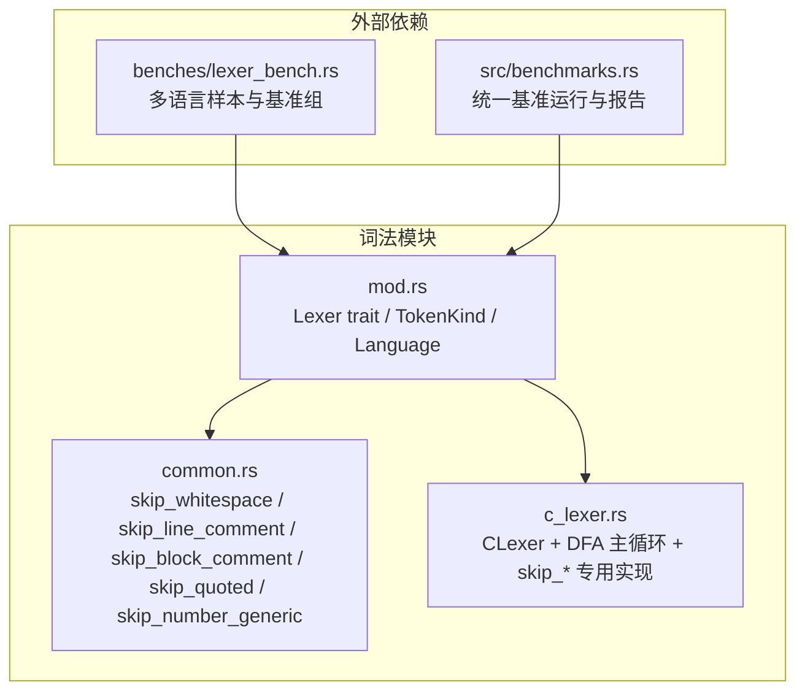
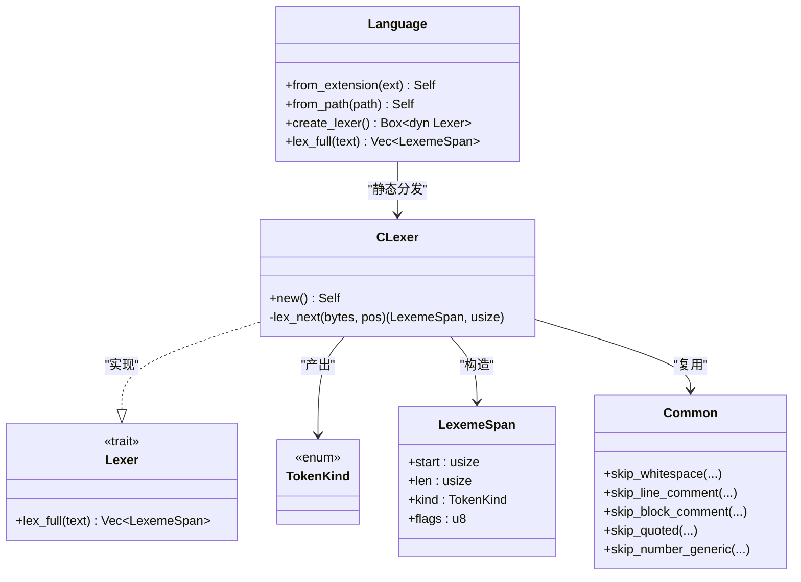

# C/C++ 词法分析器

<cite>
**本文引用的文件**   
- [c_lexer.rs](file://crates/aether-core/src/lexer/c_lexer.rs)
- [common.rs](file://crates/aether-core/src/lexer/common.rs)
- [mod.rs](file://crates/aether-core/src/lexer/mod.rs)
- [lexer_bench.rs](file://crates/aether-core/benches/lexer_bench.rs)
- [benchmarks.rs](file://crates/aether-core/src/benchmarks.rs)
</cite>

## 目录
1. [简介](#简介)
2. [项目结构](#项目结构)
3. [核心组件](#核心组件)
4. [架构总览](#架构总览)
5. [详细组件分析](#详细组件分析)
6. [依赖关系分析](#依赖关系分析)
7. [性能考量与优化策略](#性能考量与优化策略)
8. [故障排查指南](#故障排查指南)
9. [结论](#结论)
10. [附录：测试用例说明](#附录测试用例说明)

## 简介
本技术文档聚焦于 C/C++ 词法分析器的实现，围绕基于确定性有限自动机（DFA）的扫描模式展开。该实现以字节为基本单位进行线性扫描，通过状态分支识别关键字、预处理指令、注释（行注释、块注释、文档注释）、字符串与字符字面量、数字字面量（十进制、十六进制、二进制、浮点数）、操作符组合以及标识符等核心语法单元。文档同时深入解析辅助函数 skip_preprocessor、skip_number、skip_identifier、skip_operator 的实现逻辑，并给出完整的测试用例说明与性能优化建议。

## 项目结构
C/C++ 词法分析器位于 aether-core 库的 lexer 模块中，采用“通用接口 + 语言特定实现”的分层组织方式：
- 通用接口与类型定义：Lexer trait、TokenKind、LexemeSpan、Language 枚举及静态分发入口
- 公共工具函数：跨语言的跳过/扫描基础函数（空白、注释、引号、标识符、数字框架）
- C/C++ 具体实现：CLexer 及其 DFA 主循环与各类 skip_* 辅助函数
- 基准与示例：针对多语言的基准测试样例与统一运行入口



图表来源
- [mod.rs:1-182](file://crates/aether-core/src/lexer/mod.rs#L1-L182)
- [common.rs:1-90](file://crates/aether-core/src/lexer/common.rs#L1-L90)
- [c_lexer.rs:1-230](file://crates/aether-core/src/lexer/c_lexer.rs#L1-L230)
- [lexer_bench.rs:136-161](file://crates/aether-core/benches/lexer_bench.rs#L136-L161)
- [benchmarks.rs:399-443](file://crates/aether-core/src/benchmarks.rs#L399-L443)

章节来源
- [mod.rs:1-182](file://crates/aether-core/src/lexer/mod.rs#L1-L182)
- [common.rs:1-90](file://crates/aether-core/src/lexer/common.rs#L1-L90)
- [c_lexer.rs:1-230](file://crates/aether-core/src/lexer/c_lexer.rs#L1-L230)

## 核心组件
- Lexer trait：定义统一的 lex_full(text) -> Vec<LexemeSpan> 接口，用于对文本进行全量词法分析。
- TokenKind：跨语言统一的 token 类别枚举，包含 Keyword、Identifier、StringLiteral、CharLiteral、NumberLiteral、LineComment、BlockComment、DocComment、Operator、Punctuation、Preprocessor、Whitespace、Newline、Unknown、EOF 等。
- LexemeSpan：记录每个 token 的起始位置、长度、种类与标志位。
- Language：按扩展名或路径选择对应语言，并提供静态分发的 lex_full 入口，避免动态分配与虚调用开销。
- CLexer：C/C++ 词法分析器，内部维护一个基于首字节分类的 DFA 主循环，配合若干 skip_* 辅助函数完成扫描。

章节来源
- [mod.rs:1-182](file://crates/aether-core/src/lexer/mod.rs#L1-L182)
- [c_lexer.rs:1-230](file://crates/aether-core/src/lexer/c_lexer.rs#L1-L230)

## 架构总览
整体流程遵循“首字节分类 -> 进入相应 skip_* 子状态机 -> 返回 LexemeSpan 并推进位置”的 DFA 模式。Language::lex_full 提供静态分发，直接调用 c_lexer::CLexer::new().lex_full(text)，从而获得零分配、零虚调用的高性能路径。

```mermaid
sequenceDiagram
participant Caller as "调用方"
participant Lang as "Language(静态分发)"
participant CL as "CLexer.lex_full"
participant Loop as "CLexer.lex_next(DFA)"
participant Skip as "skip_* 辅助函数"
Caller->>Lang : lex_full(text)
Lang->>CL : new().lex_full(text)
loop 逐 token 扫描
CL->>Loop : lex_next(bytes, pos)
alt 空白/换行
Loop->>Skip : skip_whitespace(...)
Skip-->>Loop : 新位置
else 注释/字符串/数字/标识符/操作符/预处理
Loop->>Skip : 对应 skip_*
Skip-->>Loop : 新位置
end
Loop-->>CL : (LexemeSpan, new_pos)
CL-->>Caller : 追加到结果向量
end
```

图表来源
- [mod.rs:165-181](file://crates/aether-core/src/lexer/mod.rs#L165-L181)
- [c_lexer.rs:216-230](file://crates/aether-core/src/lexer/c_lexer.rs#L216-L230)
- [c_lexer.rs:12-213](file://crates/aether-core/src/lexer/c_lexer.rs#L12-L213)

## 详细组件分析

### CLexer 与 DFA 主循环
- 入口：lex_full 将输入转为字节切片，初始化位置指针，循环调用 lex_next 直至 EOF。
- 首字节分类：根据当前字节落入不同分支，分别处理空白、换行、注释、预处理、字符串/字符、数字、标识符、操作符、标点与未知 UTF-8 字符。
- 注释区分：块注释若以 /** 开头且非 /**/ 则标记为文档注释 DocComment，否则为 BlockComment。
- 预处理指令：遇到 # 即调用 skip_preprocessor 整行吞掉（支持续行）。
- 数字字面量：调用 skip_number，支持十六进制/二进制前缀、小数点、指数部分与后缀。
- 标识符：调用 skip_identifier 后与关键字集合匹配，决定 Keyword 还是 Identifier。
- 操作符组合：调用 skip_operator 支持 ++/--/->/==/!=/<=/>=/<</>>/&&/|| 等复合形式。
- 未知字符：使用 utf8_char_len 推断首字节对应的 UTF-8 长度，保证至少前进一步，避免死循环。

```mermaid
flowchart TD
Start(["进入 lex_next(pos)"]) --> CheckEOF{"pos >= len?"}
CheckEOF --> |是| ReturnEOF["返回 EOF 跨度"]
CheckEOF --> |否| Ch["读取 bytes[pos]"]
Ch --> Branch{"首字节分类"}
Branch --> |空白/回车| WS["skip_whitespace"] --> PushWS["产出 Whitespace"]
Branch --> |换行| NL["产出 Newline"]
Branch --> |'/'| Slash["判断下一字节 '/' 或 '*' 或 '='"]
Slash --> |'//'| LineC["skip_line_comment"] --> PushLC["产出 LineComment"]
Slash --> |'/*'| BlockC["skip_block_comment"] --> DocCheck{"是否 /** 且非 /**/ ?"}
DocCheck --> |是| PushDC["产出 DocComment"]
DocCheck --> |否| PushBC["产出 BlockComment"]
Slash --> |'='| AssignDiv["产出 Operator '/='"]
Slash --> |其他| Div["产出 Operator '/'"]
Branch --> |'#'| PP["skip_preprocessor"] --> PushPP["产出 Preprocessor"]
Branch --> |'"'| Str["skip_quoted('"')"] --> PushStr["产出 StringLiteral"]
Branch --> |"'"| Chr["skip_quoted('''")"] --> PushChr["产出 CharLiteral"]
Branch --> |数字| Num["skip_number"] --> PushNum["产出 NumberLiteral"]
Branch --> |字母/下划线| Id["skip_identifier"] --> KW{"是否关键字?"}
KW --> |是| PushKW["产出 Keyword"]
KW --> |否| PushID["产出 Identifier"]
Branch --> |运算符集| Op["skip_operator"] --> PushOp["产出 Operator"]
Branch --> |标点| Punc["产出 Punctuation"]
Branch --> |其他| Unknown["utf8_char_len 推断长度"] --> PushU["产出 Unknown"]
PushWS --> NextPos
PushNL --> NextPos
PushLC --> NextPos
PushDC --> NextPos
PushBC --> NextPos
PushPP --> NextPos
PushStr --> NextPos
PushChr --> NextPos
PushNum --> NextPos
PushKW --> NextPos
PushID --> NextPos
PushOp --> NextPos
PushPunc --> NextPos
PushU --> NextPos
NextPos(["更新 pos 并继续循环"]) --> End(["结束"])
```

图表来源
- [c_lexer.rs:12-213](file://crates/aether-core/src/lexer/c_lexer.rs#L12-L213)
- [c_lexer.rs:288-300](file://crates/aether-core/src/lexer/c_lexer.rs#L288-L300)
- [c_lexer.rs:302-350](file://crates/aether-core/src/lexer/c_lexer.rs#L302-L350)
- [c_lexer.rs:352-358](file://crates/aether-core/src/lexer/c_lexer.rs#L352-L358)
- [c_lexer.rs:360-410](file://crates/aether-core/src/lexer/c_lexer.rs#L360-L410)
- [mod.rs:223-233](file://crates/aether-core/src/lexer/mod.rs#L223-L233)

章节来源
- [c_lexer.rs:12-213](file://crates/aether-core/src/lexer/c_lexer.rs#L12-L213)
- [c_lexer.rs:288-300](file://crates/aether-core/src/lexer/c_lexer.rs#L288-L300)
- [c_lexer.rs:302-350](file://crates/aether-core/src/lexer/c_lexer.rs#L302-L350)
- [c_lexer.rs:352-358](file://crates/aether-core/src/lexer/c_lexer.rs#L352-L358)
- [c_lexer.rs:360-410](file://crates/aether-core/src/lexer/c_lexer.rs#L360-L410)
- [mod.rs:223-233](file://crates/aether-core/src/lexer/mod.rs#L223-L233)

### 辅助函数详解

#### skip_preprocessor
- 功能：从 # 之后开始，直到行尾（\n），期间支持反斜杠+换行的续行语义。
- 行为：遇到 \\\n 时跳过两字节；遇到 \n 则返回其后一位置；到达末尾则返回文本长度。
- 复杂度：O(n) 单遍扫描。

章节来源
- [c_lexer.rs:288-300](file://crates/aether-core/src/lexer/c_lexer.rs#L288-L300)

#### skip_number
- 功能：识别十进制、十六进制（0x/0X）、二进制（0b/0B）整数与浮点数，包括小数点、指数 e/E、符号 +/-、后缀 f/F/l/L/u/U。
- 关键细节：
  - 十六进制/二进制仅在 0x/0X/0b/0B 前缀后允许 a-f/A-F 或 0/1 字符，防止 123abc 被误判为数字。
  - 小数点需避免与范围操作符 1..2 混淆：当出现第二个 . 或 . 后紧跟 . 时停止。
  - 指数部分仅允许一次 e/E，随后可选 +/-，再跟数字。
  - 后缀顺序不严格校验，但会消费合法后缀字符。
- 复杂度：O(n) 单遍扫描。

章节来源
- [c_lexer.rs:302-350](file://crates/aether-core/src/lexer/c_lexer.rs#L302-L350)

#### skip_identifier
- 功能：消费 ASCII 字母、数字与下划线，形成标识符。
- 复杂度：O(n) 单遍扫描。

章节来源
- [c_lexer.rs:352-358](file://crates/aether-core/src/lexer/c_lexer.rs#L352-L358)

#### skip_operator
- 功能：在已匹配首操作符的基础上，尝试合并下一个字符形成复合操作符，如 ++/--/->/==/!=/<=/>>/<</&&/||/+=/-=/*=/%=/^=/<</>> 等。
- 复杂度：常数时间（最多检查 1~2 个后续字节）。

章节来源
- [c_lexer.rs:360-410](file://crates/aether-core/src/lexer/c_lexer.rs#L360-L410)

### 关键字识别
- is_keyword_bytes 使用字节数组精确匹配 C 标准关键字集合（含 C11/C18 新增特性如 _Alignas、_Atomic、_Static_assert 等）。
- 匹配策略为 matches! 宏的多分支比较，时间复杂度 O(k)（k 为关键字数量），空间 O(1)。

章节来源
- [c_lexer.rs:238-286](file://crates/aether-core/src/lexer/c_lexer.rs#L238-L286)

### 公共工具函数（common.rs）
- skip_whitespace：跳过空格、制表符、回车。
- skip_line_comment：跳过 // 至行尾。
- skip_block_comment：跳过 /* ... */，未闭合则吞到末尾。
- skip_quoted：跳过由指定引号包围的字面量，正确处理转义与越界。
- skip_identifier_ascii / skip_identifier_with：通用标识符扫描（供其他语言复用）。
- skip_number_generic：通用数字扫描框架，接受谓词回调。

章节来源
- [common.rs:1-90](file://crates/aether-core/src/lexer/common.rs#L1-L90)

## 依赖关系分析
- CLexer 依赖 common 中的通用跳过函数与 mod 中的类型定义。
- Language 提供静态分发，避免 Box<dyn Lexer> 的动态分配与虚调用。
- 基准测试通过 Language::lex_full 直接驱动各语言 lexer，确保公平对比。



图表来源
- [mod.rs:1-182](file://crates/aether-core/src/lexer/mod.rs#L1-L182)
- [c_lexer.rs:1-230](file://crates/aether-core/src/lexer/c_lexer.rs#L1-L230)
- [common.rs:1-90](file://crates/aether-core/src/lexer/common.rs#L1-L90)

章节来源
- [mod.rs:1-182](file://crates/aether-core/src/lexer/mod.rs#L1-L182)
- [c_lexer.rs:1-230](file://crates/aether-core/src/lexer/c_lexer.rs#L1-L230)
- [common.rs:1-90](file://crates/aether-core/src/lexer/common.rs#L1-L90)

## 性能考量与优化策略
- 静态分发：Language::lex_full 直接调用具体 lexer 的 lex_full，避免 Box<dyn Lexer> 的堆分配与虚调用开销。
- 预分配容量：lex_full 内部使用 text.len()/4 + 1 作为初始容量，减少扩容次数。
- 字节级扫描：所有 skip_* 函数均以字节为单位推进，避免不必要的 UTF-8 解码。
- 常量时间操作符合并：skip_operator 仅检查 1~2 个后续字节，保持常数时间。
- 可能的进一步优化方向（概念性建议）：
  - 使用 SIMD 批量查找空白、换行与分隔符（例如 memchr 或平台内建 SIMD）。
  - 使用查找表替代多次 is_digit/is_alphanumeric 判断。
  - 关键词匹配可考虑哈希或 Trie 结构降低比较成本。
  - 对大文件场景引入增量词法分析（已在 benchmarks 中提供增量分析相关测试）。

章节来源
- [mod.rs:165-181](file://crates/aether-core/src/lexer/mod.rs#L165-L181)
- [c_lexer.rs:216-230](file://crates/aether-core/src/lexer/c_lexer.rs#L216-L230)
- [benchmarks.rs:399-443](file://crates/aether-core/src/benchmarks.rs#L399-L443)

## 故障排查指南
- 未知字符导致高亮错位：
  - 现象：中文、emoji 等多字节字符被拆成多个 Unknown token。
  - 原因：未知分支使用 utf8_char_len 推断长度，但仍可能产生多个 Unknown token。
  - 建议：上层渲染可根据 Unknown 的长度合并显示，或在更高层做 Unicode 规范化。
- 数字字面量误判：
  - 现象：1..2 可能被错误合并为一个数字。
  - 现状：skip_number 已加入对第二个 . 或 . 后紧跟 . 的阻断逻辑，但仍需关注边界情况。
  - 建议：在需要严格语法的场景，结合语法分析阶段进一步校验。
- 字符串/字符字面量未闭合：
  - 现象：未闭合的引号会被吞到文本末尾。
  - 原因：skip_quoted 在找不到闭合引号时返回 bytes.len()。
  - 建议：上层可进行错误提示或回退到纯文本模式。
- 预处理指令续行：
  - 现象：#define FOO \\\n bar 应被视为一条预处理指令。
  - 现状：skip_preprocessor 支持 \\\n 续行。
  - 建议：确保上游不会提前截断行。

章节来源
- [c_lexer.rs:302-350](file://crates/aether-core/src/lexer/c_lexer.rs#L302-L350)
- [common.rs:42-55](file://crates/aether-core/src/lexer/common.rs#L42-L55)
- [c_lexer.rs:288-300](file://crates/aether-core/src/lexer/c_lexer.rs#L288-L300)
- [mod.rs:223-233](file://crates/aether-core/src/lexer/mod.rs#L223-L233)

## 结论
该 C/C++ 词法分析器以简洁高效的 DFA 模式实现了主流语法单元的识别，并通过静态分发与字节级扫描保证了良好的运行时性能。辅助函数清晰分离了各类字面量与结构的扫描逻辑，便于复用与维护。尽管存在若干可优化的空间（SIMD、查找表、关键词匹配结构等），当前实现已能满足编辑器高亮与基础语法分析的需求。

## 附录：测试用例说明
以下测试覆盖了关键字、注释、操作符、预处理、字符串/字符、数字、未知 UTF-8 等关键路径，可作为验证与回归的依据。

- 关键字与数字
  - 输入："int main() { return 0; }"
  - 预期：包含 Keyword 与 NumberLiteral
  - 参考路径：[c_lexer.rs:416-423](file://crates/aether-core/src/lexer/c_lexer.rs#L416-L423)

- 注释
  - 输入："// line comment\n/* block */"
  - 预期：包含 LineComment 与 BlockComment
  - 参考路径：[c_lexer.rs:425-431](file://crates/aether-core/src/lexer/c_lexer.rs#L425-L431)

- 操作符
  - 输入："a + b - c * d / e % f == g != h <= i >= j && k || l << m >> n"
  - 预期：Operator 计数大于 5
  - 参考路径：[c_lexer.rs:433-443](file://crates/aether-core/src/lexer/c_lexer.rs#L433-L443)

- 预处理指令
  - 输入："#include <stdio.h>\n#define MAX 100"
  - 预期：包含 Preprocessor
  - 参考路径：[c_lexer.rs:445-450](file://crates/aether-core/src/lexer/c_lexer.rs#L445-L450)

- 空输入
  - 输入：""
  - 预期：结果为空
  - 参考路径：[c_lexer.rs:452-455](file://crates/aether-core/src/lexer/c_lexer.rs#L452-L455)

- 文档注释
  - 输入："/** doc */\n/*/ not doc */"
  - 预期：DocComment 数量为 1
  - 参考路径：[c_lexer.rs:457-465](file://crates/aether-core/src/lexer/c_lexer.rs#L457-L465)

- 字符串与字符字面量
  - 输入：'"str" 'c''
  - 预期：StringLiteral 与 CharLiteral 各 1
  - 参考路径：[c_lexer.rs:467-484](file://crates/aether-core/src/lexer/c_lexer.rs#L467-L484)

- 数字字面量
  - 输入："0x1F 0b10 3.14f 1e10L 123u"
  - 预期：NumberLiteral 数量为 5
  - 参考路径：[c_lexer.rs:486-496](file://crates/aether-core/src/lexer/c_lexer.rs#L486-L496)

- 复合操作符
  - 输入："++ -- -> == != <= >= << >> && ||"
  - 预期：Operator 数量不少于 10
  - 参考路径：[c_lexer.rs:498-508](file://crates/aether-core/src/lexer/c_lexer.rs#L498-L508)

- 除法赋值
  - 输入："a /= b"
  - 预期：Operator 数量为 1
  - 参考路径：[c_lexer.rs:510-520](file://crates/aether-core/src/lexer/c_lexer.rs#L510-L520)

- 预处理续行
  - 输入："#define FOO \\\n  bar"
  - 预期：Preprocessor 数量为 1
  - 参考路径：[c_lexer.rs:522-532](file://crates/aether-core/src/lexer/c_lexer.rs#L522-L532)

- 未知 UTF-8
  - 输入："中文"
  - 预期：存在 Unknown 且长度为 3
  - 参考路径：[c_lexer.rs:534-541](file://crates/aether-core/src/lexer/c_lexer.rs#L534-L541)

章节来源
- [c_lexer.rs:416-541](file://crates/aether-core/src/lexer/c_lexer.rs#L416-L541)