# Go 词法分析器

<cite>
**本文引用的文件**   
- [crates/aether-core/src/lexer/mod.rs](file://crates/aether-core/src/lexer/mod.rs)
- [crates/aether-core/src/lexer/c_lexer.rs](file://crates/aether-core/src/lexer/c_lexer.rs)
- [crates/aether-core/src/lexer/rust_lexer.rs](file://crates/aether-core/src/lexer/rust_lexer.rs)
- [crates/aether-core/src/lexer/js_lexer.rs](file://crates/aether-core/src/lexer/js_lexer.rs)
- [crates/aether-core/src/lexer/python_lexer.rs](file://crates/aether-core/src/lexer/python_lexer.rs)
- [crates/aether-core/src/lexer/json_lexer.rs](file://crates/aether-core/src/lexer/json_lexer.rs)
- [crates/aether-core/src/lexer/markdown_lexer.rs](file://crates/aether-core/src/lexer/markdown_lexer.rs)
- [crates/aether-core/src/lexer/common.rs](file://crates/aether-core/src/lexer/common.rs)
- [crates/aether-core/src/incremental_lexer.rs](file://crates/aether-core/src/incremental_lexer.rs)
- [crates/aether-tree-sitter/src/highlighter.rs](file://crates/aether-tree-sitter/src/highlighter.rs)
- [crates/aether-tree-sitter/src/language.rs](file://crates/aether-tree-sitter/src/language.rs)
- [crates/aether-core/benches/lexer_bench.rs](file://crates/aether-core/benches/lexer_bench.rs)
- [crates/aether-core/Cargo.toml](file://crates/aether-core/Cargo.toml)
- [README.md](file://README.md)
</cite>

## 更新摘要
**变更内容**   
- 新增完整的 Go 语言支持，包括 tree-sitter 集成和语法高亮功能
- 添加 C 家族词法分析器回退机制，为 Go/Java 提供基础语法高亮
- 实现专门的 Go 语言配置字段和高亮查询处理
- 增加全面的测试覆盖，验证 Go 语言的解析和高亮功能
- 扩展 Language 枚举以支持 Go 语言识别

## 目录
1. [简介](#简介)
2. [项目结构](#项目结构)
3. [核心组件](#核心组件)
4. [架构总览](#架构总览)
5. [详细组件分析](#详细组件分析)
6. [Go 语言支持详解](#go-语言支持详解)
7. [依赖关系分析](#依赖关系分析)
8. [性能考量](#性能考量)
9. [故障排查指南](#故障排查指南)
10. [结论](#结论)
11. [附录](#附录)

## 简介
本仓库包含一个高性能、多语言的词法分析子系统，用于在编辑器中为多种语言提供快速、稳定的分词与高亮基础。该子系统采用统一的 Token 类型与 Lexer trait，支持 C、Rust、JavaScript/TypeScript、Python、JSON、Markdown、HTML/TOML 等语言，并提供增量缓存以提升编辑时的响应速度。

**最新更新**：现已全面支持 Go 语言，通过 tree-sitter 集成提供精确的语法高亮，同时保留 C 家族词法分析器作为回退方案，确保在各种场景下都能提供可靠的语法分析能力。

注意：尽管文档标题为"Go 词法分析器"，但实际实现基于 Rust（见 Cargo 配置与源码），并非 Go 语言实现。

## 项目结构
- 词法模块位于 crates/aether-core/src/lexer 下，按语言拆分多个 lexer 文件，并通过 mod.rs 暴露统一接口。
- 公共工具函数集中在 common.rs，供各语言复用。
- 增量词法分析器位于 incremental_lexer.rs，负责行级缓存与增量更新。
- Tree-sitter 高亮器位于 crates/aether-tree-sitter/src/highlighter.rs，提供高级语法高亮功能。
- 基准测试位于 benches/lexer_bench.rs，用于评估不同语言的吞吐能力。

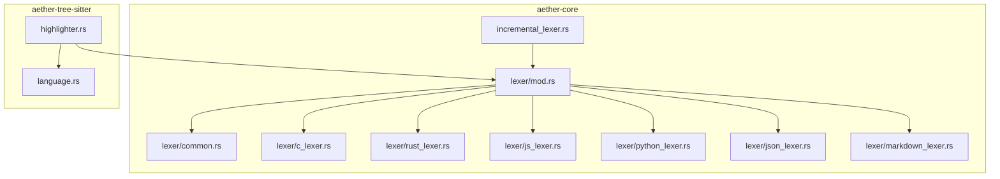

**图表来源**
- [crates/aether-core/src/lexer/mod.rs:1-296](file://crates/aether-core/src/lexer/mod.rs#L1-L296)
- [crates/aether-core/src/lexer/common.rs:1-151](file://crates/aether-core/src/lexer/common.rs#L1-L151)
- [crates/aether-core/src/incremental_lexer.rs:1-130](file://crates/aether-core/src/incremental_lexer.rs#L1-L130)
- [crates/aether-tree-sitter/src/highlighter.rs:1-200](file://crates/aether-tree-sitter/src/highlighter.rs#L1-L200)
- [crates/aether-tree-sitter/src/language.rs:1-105](file://crates/aether-tree-sitter/src/language.rs#L1-L105)

**章节来源**
- [crates/aether-core/src/lexer/mod.rs:1-296](file://crates/aether-core/src/lexer/mod.rs#L1-L296)
- [crates/aether-core/Cargo.toml:1-20](file://crates/aether-core/Cargo.toml#L1-L20)

## 核心组件
- 统一 Lexer trait 与 TokenKind/LexemeSpan：定义跨语言一致的 token 类型与跨度信息。
- Language 枚举与静态分发：根据扩展名或路径选择具体语言，并直接调用对应 lexer 的 lex_full，避免动态分发开销。
- 各语言 Lexer 实现：C、Rust、JS/TS、Python、JSON、Markdown、HTML/TOML 等，均实现 Lexer trait。
- **新增**：Tree-sitter 高亮器：提供精确的语法树分析和高级语法高亮功能。
- 公共工具函数：跳过空白、注释、字符串、标识符、数字等通用逻辑。
- 增量词法分析器：按行缓存 token，编辑后仅重算受影响行，提升交互性能。

**章节来源**
- [crates/aether-core/src/lexer/mod.rs:1-296](file://crates/aether-core/src/lexer/mod.rs#L1-L296)
- [crates/aether-core/src/lexer/common.rs:1-151](file://crates/aether-core/src/lexer/common.rs#L1-L151)
- [crates/aether-core/src/incremental_lexer.rs:1-130](file://crates/aether-core/src/incremental_lexer.rs#L1-L130)
- [crates/aether-tree-sitter/src/highlighter.rs:1-200](file://crates/aether-tree-sitter/src/highlighter.rs#L1-L200)

## 架构总览
系统通过 Language::lex_full 进行静态分发，直接调用具体语言的 lex_full，返回 Vec<LexemeSpan>。上层渲染或高亮模块消费这些 token 进行着色。增量管理器维护每行的 token 缓存，并在编辑时只重算受影响的行。**新增**：Tree-sitter 高亮器提供并行的高精度语法分析能力。

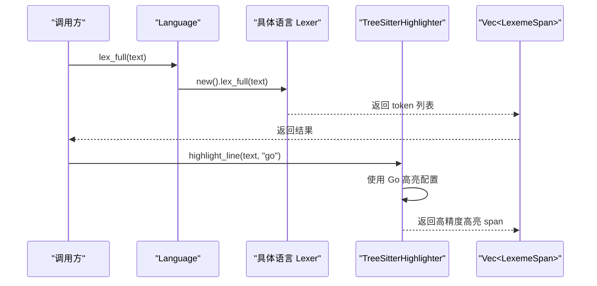

**图表来源**
- [crates/aether-core/src/lexer/mod.rs:165-182](file://crates/aether-core/src/lexer/mod.rs#L165-L182)
- [crates/aether-tree-sitter/src/highlighter.rs:182-283](file://crates/aether-tree-sitter/src/highlighter.rs#L182-L283)

## 详细组件分析

### 统一接口与类型
- Lexer trait：定义 lex_full(text) -> Vec<LexemeSpan>。
- TokenKind：涵盖关键字、标识符、字符串、字符、数字、注释、运算符、分隔符、预处理、属性、类型名、函数名、宏、生命周期、泛型、正则、格式化字符串、Markdown 元素、JSON 键、TOML 表头、空白、换行、未知、EOF 等。
- LexemeSpan：记录 start、len、kind、flags，便于定位与着色。
- Language：从扩展名/路径推断语言，并提供 create_lexer() 与 lex_full() 两种调用方式；后者使用静态分发，无 Box 分配与动态分发开销。

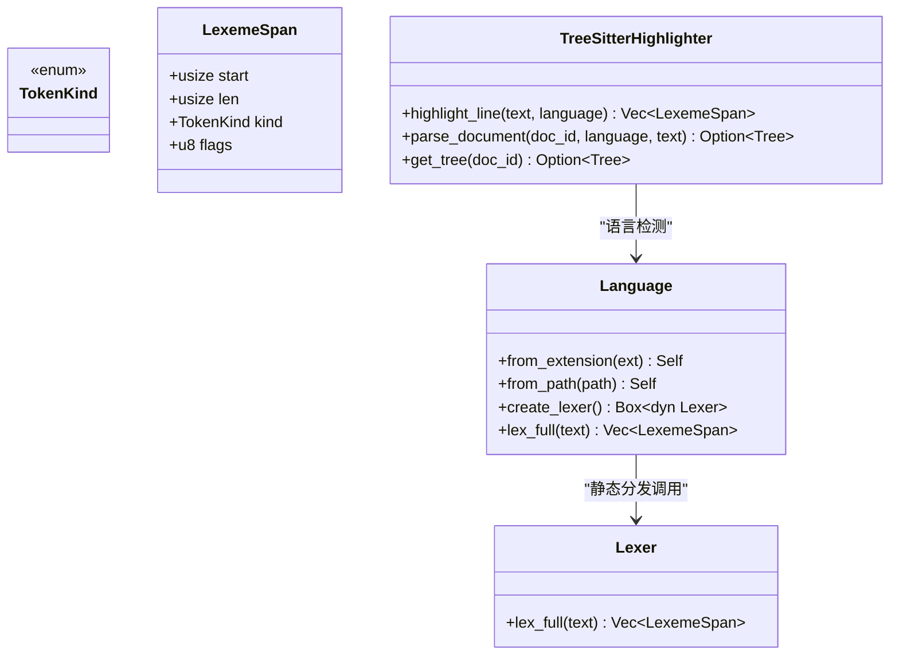

**图表来源**
- [crates/aether-core/src/lexer/mod.rs:1-296](file://crates/aether-core/src/lexer/mod.rs#L1-L296)
- [crates/aether-tree-sitter/src/highlighter.rs:1-200](file://crates/aether-tree-sitter/src/highlighter.rs#L1-L200)

**章节来源**
- [crates/aether-core/src/lexer/mod.rs:1-296](file://crates/aether-core/src/lexer/mod.rs#L1-L296)

### C 语言词法分析器
- DFA 风格逐字节扫描，处理空白、换行、注释（行/块/文档）、预处理指令、字符串/字符字面量、数字（含进制前缀与后缀）、标识符与关键字、运算符、标点、UTF-8 未知字符。
- 数字解析考虑十六进制/二进制前缀、小数点、指数、整数/浮点后缀，并防止范围语法被误合并。
- 预处理指令支持续行。

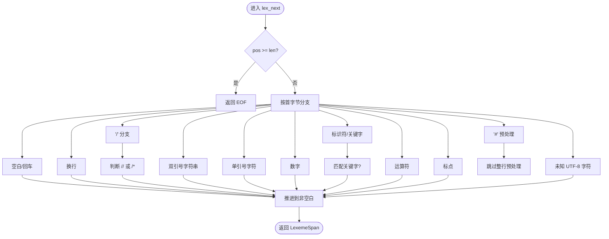

**图表来源**
- [crates/aether-core/src/lexer/c_lexer.rs:12-213](file://crates/aether-core/src/lexer/c_lexer.rs#L12-L213)
- [crates/aether-core/src/lexer/c_lexer.rs:302-410](file://crates/aether-core/src/lexer/c_lexer.rs#L302-L410)

**章节来源**
- [crates/aether-core/src/lexer/c_lexer.rs:1-542](file://crates/aether-core/src/lexer/c_lexer.rs#L1-L542)

### Rust 语言词法分析器
- 支持行/块/文档注释、属性（#[...] 与 #![...]）、字符串/字符字面量、生命周期（'a, 'static）、数字（含进制前缀、下划线分隔、小数点、指数）、标识符与关键字、内置类型名、宏名称、宏调用（ident!）检测、运算符与标点。
- 块注释支持嵌套深度计数，未终止注释会吞到末尾，避免残余 token。

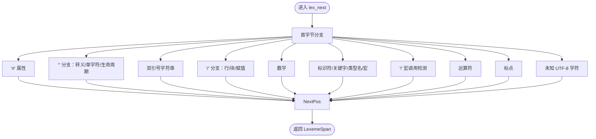

**图表来源**
- [crates/aether-core/src/lexer/rust_lexer.rs:12-336](file://crates/aether-core/src/lexer/rust_lexer.rs#L12-L336)
- [crates/aether-core/src/lexer/rust_lexer.rs:461-511](file://crates/aether-core/src/lexer/rust_lexer.rs#L461-L511)

**章节来源**
- [crates/aether-core/src/lexer/rust_lexer.rs:1-769](file://crates/aether-core/src/lexer/rust_lexer.rs#L1-L769)

### JavaScript/TypeScript 词法分析器
- 支持行/块注释、模板字符串（带 ${...} 嵌套）、正则表达式（上下文敏感识别）、字符串/字符字面量、数字（含 BigInt 后缀 n）、标识符与关键字、内置类型名、运算符（包括 ??、??=、?.、**=、===、!==、>>> 等）、标点与未知字符。
- 正则识别通过向前查找最近非空白字符来判断是否为正则上下文，避免将 / 误判为除法。

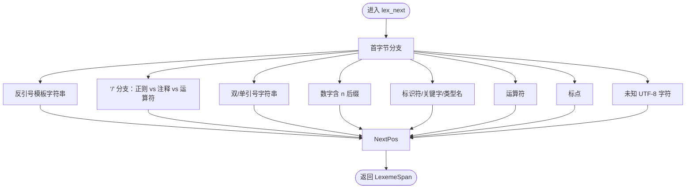

**图表来源**
- [crates/aether-core/src/lexer/js_lexer.rs:12-257](file://crates/aether-core/src/lexer/js_lexer.rs#L12-L257)
- [crates/aether-core/src/lexer/js_lexer.rs:421-473](file://crates/aether-core/src/lexer/js_lexer.rs#L421-L473)

**章节来源**
- [crates/aether-core/src/lexer/js_lexer.rs:1-778](file://crates/aether-core/src/lexer/js_lexer.rs#L1-L778)

### Python 词法分析器
- 支持行注释（#）、三引号字符串与 f-string（f"..." 或 f'...'）、普通字符串/字符、数字（含虚数 j 后缀）、标识符与关键字、内置类型名、运算符（包括 **、//、-> 等）、标点与未知字符。
- f-string 前缀在引号之前，正确区分 FormatString 与 StringLiteral。

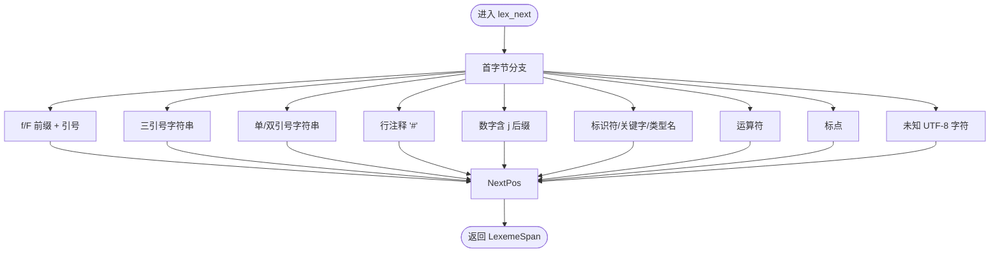

**图表来源**
- [crates/aether-core/src/lexer/python_lexer.rs:12-202](file://crates/aether-core/src/lexer/python_lexer.rs#L12-L202)
- [crates/aether-core/src/lexer/python_lexer.rs:313-355](file://crates/aether-core/src/lexer/python_lexer.rs#L313-L355)

**章节来源**
- [crates/aether-core/src/lexer/python_lexer.rs:1-545](file://crates/aether-core/src/lexer/python_lexer.rs#L1-L545)

### JSON 词法分析器
- 支持空白（空格、制表符、回车、换行）、字符串（自动识别键值对中的键）、数字（含负号、小数、指数）、布尔与 null 关键字、标点符号与未知字符。
- 键识别通过检查字符串后的冒号位置。

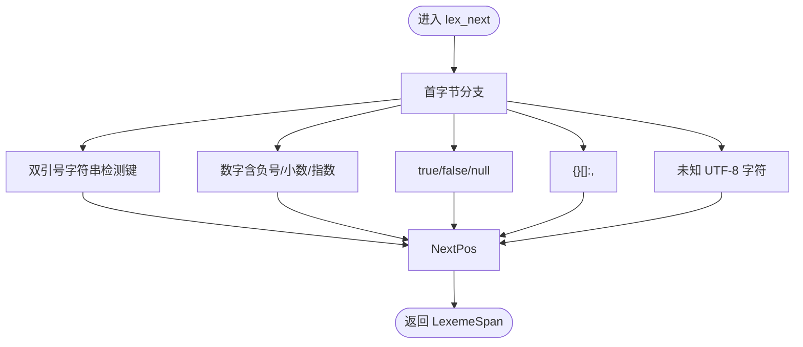

**图表来源**
- [crates/aether-core/src/lexer/json_lexer.rs:12-110](file://crates/aether-core/src/lexer/json_lexer.rs#L12-L110)
- [crates/aether-core/src/lexer/json_lexer.rs:155-187](file://crates/aether-core/src/lexer/json_lexer.rs#L155-L187)

**章节来源**
- [crates/aether-core/src/lexer/json_lexer.rs:1-278](file://crates/aether-core/src/lexer/json_lexer.rs#L1-L278)

### Markdown 词法分析器
- 支持标题（# 级别 1-6）、代码块标记（```）、行内代码（`）、链接（[text](url)）、强调（*、_、**、__）、无序/有序列表、HTML 标签与普通文本。
- 强调闭合失败时仅消耗开放标记，避免整行错误高亮。

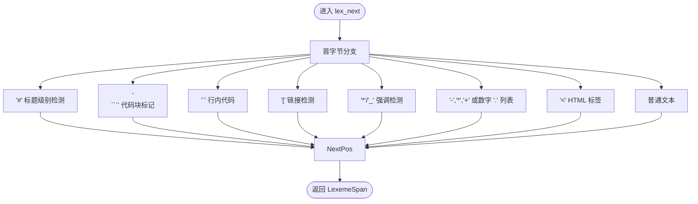

**图表来源**
- [crates/aether-core/src/lexer/markdown_lexer.rs:11-192](file://crates/aether-core/src/lexer/markdown_lexer.rs#L11-L192)
- [crates/aether-core/src/lexer/markdown_lexer.rs:259-311](file://crates/aether-core/src/lexer/markdown_lexer.rs#L259-L311)

**章节来源**
- [crates/aether-core/src/lexer/markdown_lexer.rs:1-470](file://crates/aether-core/src/lexer/markdown_lexer.rs#L1-L470)

### 公共工具函数
- skip_whitespace：跳过空格、制表符、回车。
- skip_line_comment：跳过 // 行注释。
- skip_block_comment：跳过 /* */ 块注释（不支持嵌套，由具体 lexer 自行处理）。
- skip_quoted：跳过由指定引号包围的字符串/字符字面量，正确处理末尾反斜杠。
- skip_identifier_ascii/skip_identifier_with：标识符扫描。
- skip_number_generic：通用数字扫描框架。

**章节来源**
- [crates/aether-core/src/lexer/common.rs:1-151](file://crates/aether-core/src/lexer/common.rs#L1-L151)

### 增量词法分析器
- IncrementalLexer：按行缓存 token，首次全量分析，编辑后仅重算受影响行；维护版本号和行数统计。
- IncrementalLexerManager：管理多个文件的增量 lexer，限制最大缓存文件数量，避免长时间运行后内存增长。

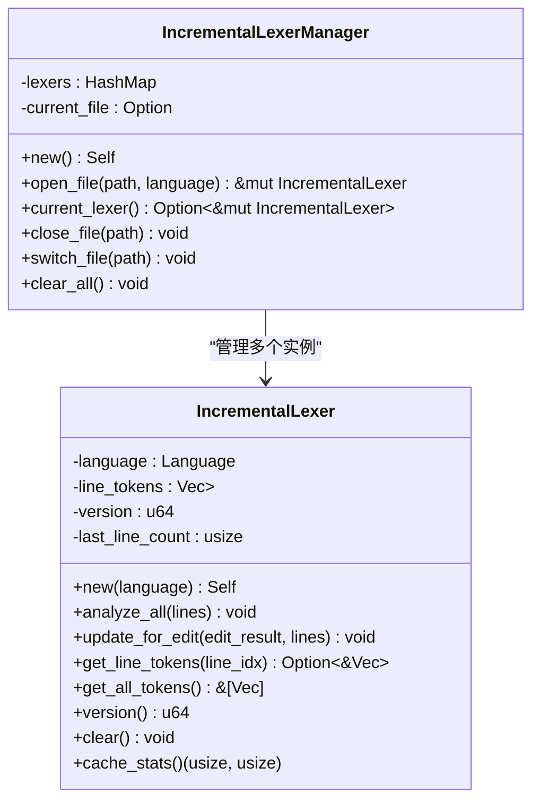

**图表来源**
- [crates/aether-core/src/incremental_lexer.rs:1-194](file://crates/aether-core/src/incremental_lexer.rs#L1-L194)

**章节来源**
- [crates/aether-core/src/incremental_lexer.rs:1-301](file://crates/aether-core/src/incremental_lexer.rs#L1-L301)

## Go 语言支持详解

### 语言识别与配置
**新增**：Go 语言现已完全集成到系统中，支持以下特性：

- **语言识别**：`.go` 文件扩展名自动识别为 `Language::Go`
- **双重支持策略**：
  - **主要方案**：Tree-sitter 集成提供精确的语法高亮
  - **回退方案**：C 家族词法分析器提供基础语法分析
- **专用配置字段**：`go_config` 字段存储 Go 语言的高亮配置

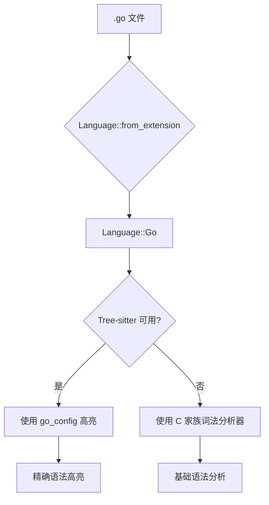

**图表来源**
- [crates/aether-core/src/lexer/mod.rs:113-114](file://crates/aether-core/src/lexer/mod.rs#L113-L114)
- [crates/aether-core/src/lexer/mod.rs:151-153](file://crates/aether-core/src/lexer/mod.rs#L151-L153)
- [crates/aether-tree-sitter/src/highlighter.rs:157-166](file://crates/aether-tree-sitter/src/highlighter.rs#L157-L166)

### Tree-sitter 集成实现
**新增**：完整的 Tree-sitter 集成支持 Go 语言：

- **高亮配置初始化**：使用 `tree_sitter_go::HIGHLIGHT_QUERY` 配置 Go 语言高亮规则
- **语言映射**：`"go"` 语言 ID 映射到 `tree_sitter_go::language()`
- **增量解析**：支持 Go 代码的增量语法树更新
- **捕获名称映射**：将 Go 语言的 capture 名称映射到统一的 TokenKind

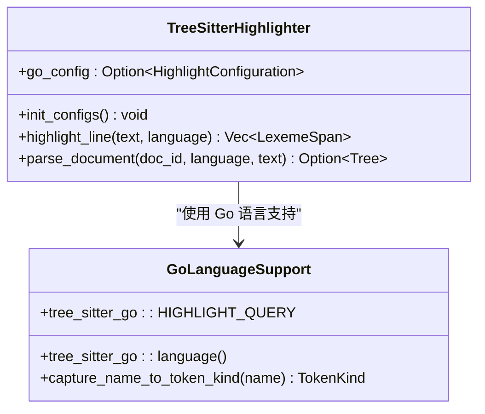

**图表来源**
- [crates/aether-tree-sitter/src/highlighter.rs:19](file://crates/aether-tree-sitter/src/highlighter.rs#L19)
- [crates/aether-tree-sitter/src/highlighter.rs:157-166](file://crates/aether-tree-sitter/src/highlighter.rs#L157-L166)
- [crates/aether-tree-sitter/src/highlighter.rs:339](file://crates/aether-tree-sitter/src/highlighter.rs#L339)

### C 家族词法分析器回退机制
**新增**：为 Go 语言提供 C 家族词法分析器作为回退方案：

- **基础语法支持**：注释、字符串、数字、大括号等公共结构
- **兼容性保证**：确保在任何情况下都能提供基本的语法高亮
- **无缝切换**：当 Tree-sitter 不可用时自动降级到 C 家族分析器

**章节来源**
- [crates/aether-core/src/lexer/mod.rs:151-153](file://crates/aether-core/src/lexer/mod.rs#L151-L153)
- [crates/aether-core/src/lexer/mod.rs:172](file://crates/aether-core/src/lexer/mod.rs#L172)
- [crates/aether-tree-sitter/src/highlighter.rs:157-166](file://crates/aether-tree-sitter/src/highlighter.rs#L157-L166)
- [crates/aether-tree-sitter/src/language.rs:16](file://crates/aether-tree-sitter/src/language.rs#L16)

### Go 语言测试覆盖
**新增**：全面的测试用例验证 Go 语言功能：

- **高亮测试**：`test_highlight_line_go` 验证基本 Go 代码的高亮
- **解析测试**：`test_parse_document_go` 验证 Go 代码的语法树解析
- **语言支持测试**：`test_get_language_go` 验证 Go 语言识别
- **综合测试**：支持 `package main` 和 `func main() {}` 等标准 Go 语法

**章节来源**
- [crates/aether-tree-sitter/src/highlighter.rs:690-695](file://crates/aether-tree-sitter/src/highlighter.rs#L690-L695)
- [crates/aether-tree-sitter/src/highlighter.rs:786-791](file://crates/aether-tree-sitter/src/highlighter.rs#L786-L791)
- [crates/aether-tree-sitter/src/language.rs:80-83](file://crates/aether-tree-sitter/src/language.rs#L80-L83)

## 依赖关系分析
- 各语言 Lexer 均依赖 common 工具函数与统一接口（Lexer、TokenKind、LexemeSpan）。
- Language 作为调度中心，内部直接构造具体 Lexer 并调用 lex_full，避免运行时动态分发。
- 增量管理器依赖 Language 创建具体 Lexer，并对每行执行 lex_full。
- **新增**：Tree-sitter 高亮器独立于传统 Lexer 系统，提供并行的高精度语法分析能力。

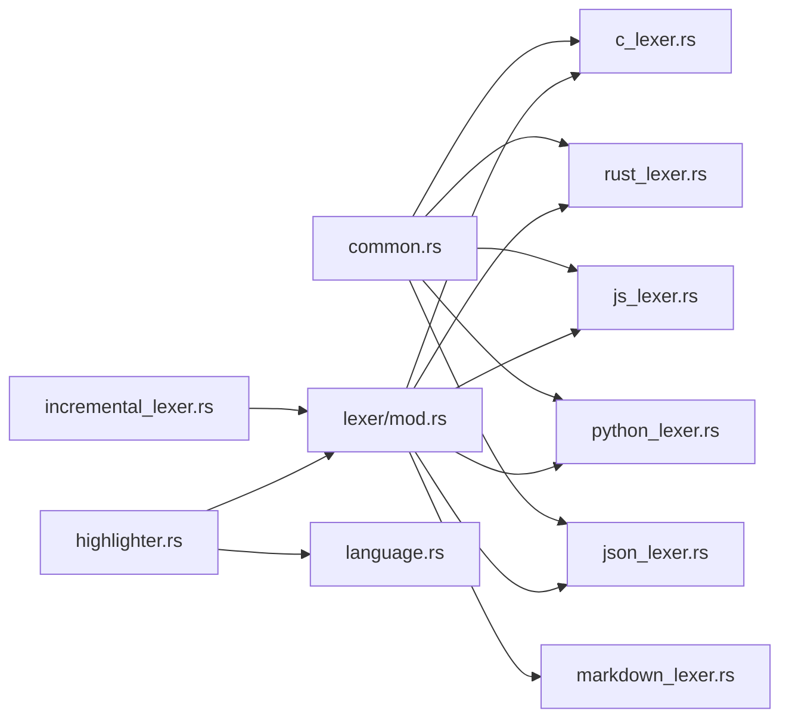

**图表来源**
- [crates/aether-core/src/lexer/mod.rs:184-192](file://crates/aether-core/src/lexer/mod.rs#L184-L192)
- [crates/aether-core/src/lexer/common.rs:1-151](file://crates/aether-core/src/lexer/common.rs#L1-L151)
- [crates/aether-core/src/incremental_lexer.rs:1-130](file://crates/aether-core/src/incremental_lexer.rs#L1-L130)
- [crates/aether-tree-sitter/src/highlighter.rs:1-200](file://crates/aether-tree-sitter/src/highlighter.rs#L1-L200)
- [crates/aether-tree-sitter/src/language.rs:1-105](file://crates/aether-tree-sitter/src/language.rs#L1-L105)

**章节来源**
- [crates/aether-core/src/lexer/mod.rs:184-192](file://crates/aether-core/src/lexer/mod.rs#L184-L192)
- [crates/aether-core/src/incremental_lexer.rs:1-130](file://crates/aether-core/src/incremental_lexer.rs#L1-L130)
- [crates/aether-tree-sitter/src/highlighter.rs:1-200](file://crates/aether-tree-sitter/src/highlighter.rs#L1-L200)

## 性能考量
- 静态分发：Language::lex_full 直接调用具体 Lexer，避免 Box 分配与动态分发开销。
- 零拷贝扫描：各 Lexer 以字节切片扫描，减少字符串转换成本。
- 预分配容量：lex_full 初始化 Vec 时预估容量，降低扩容次数。
- 增量缓存：IncrementalLexer 按行缓存，编辑后仅重算受影响行，显著降低高频编辑时的 CPU 占用。
- **新增**：Tree-sitter 增量解析：支持语法树的增量更新，避免重复解析。
- **新增**：配置缓存：高亮配置在初始化时一次性加载，运行时直接使用。
- 基准测试：benchmarks 覆盖 Rust、JS、Python、C 四种语言样本，报告吞吐指标（MiB/s）。

**章节来源**
- [crates/aether-core/src/lexer/mod.rs:165-182](file://crates/aether-core/src/lexer/mod.rs#L165-L182)
- [crates/aether-core/benches/lexer_bench.rs:136-158](file://crates/aether-core/benches/lexer_bench.rs#L136-L158)
- [crates/aether-core/src/incremental_lexer.rs:28-101](file://crates/aether-core/src/incremental_lexer.rs#L28-L101)
- [crates/aether-tree-sitter/src/highlighter.rs:285-318](file://crates/aether-tree-sitter/src/highlighter.rs#L285-L318)

## 故障排查指南
- 未知字符导致高亮错位：确保未知字符按完整 UTF-8 长度推进，避免拆散多字节字符。
- 未终止注释残留 token：如 Rust 块注释未闭合，应吞到文本末尾，避免产生 1 字节残余 token。
- 正则与除法器歧义：JS 中需根据上下文判断 '/' 是否为正则，避免误分类。
- 范围语法误合并：数字解析时需阻止 1..2 被合并为一个数字 token。
- 空输入与边界条件：lex_full 对空输入应返回空列表；lex_next 在 pos >= len 时应返回 EOF。
- **新增**：Go 语言高亮问题：检查 tree-sitter-go 是否正确加载，确认 `go_config` 初始化成功。
- **新增**：Tree-sitter 解析失败：验证语言 ID 是否正确映射，检查语法树缓存是否正常工作。

**章节来源**
- [crates/aether-core/src/lexer/js_lexer.rs:77-140](file://crates/aether-core/src/lexer/js_lexer.rs#L77-L140)
- [crates/aether-core/src/lexer/rust_lexer.rs:461-481](file://crates/aether-core/src/lexer/rust_lexer.rs#L461-L481)
- [crates/aether-core/src/lexer/c_lexer.rs:302-350](file://crates/aether-core/src/lexer/c_lexer.rs#L302-L350)
- [crates/aether-core/src/lexer/json_lexer.rs:155-179](file://crates/aether-core/src/lexer/json_lexer.rs#L155-L179)
- [crates/aether-tree-sitter/src/highlighter.rs:285-318](file://crates/aether-tree-sitter/src/highlighter.rs#L285-L318)

## 结论
该词法分析子系统以统一接口与静态分发为核心，结合高效的字节扫描与增量缓存，在多语言场景下提供了稳定且高性能的分词能力。**最新增强**：通过完整的 Go 语言支持和 Tree-sitter 集成，系统现在能够提供高精度的语法高亮，同时保持向后兼容的回退机制。通过完善的单元测试与基准测试，确保了正确性与性能表现。未来可继续扩展更多语言支持与更细粒度的语义 token 分类。

## 附录
- 构建与运行参考：参见 README 中的构建与运行说明。
- 覆盖率与测试：参见 README 中的测试与质量部分。
- **新增**：Go 语言支持：详见上述 Go 语言支持详解章节。

**章节来源**
- [README.md:49-122](file://README.md#L49-L122)