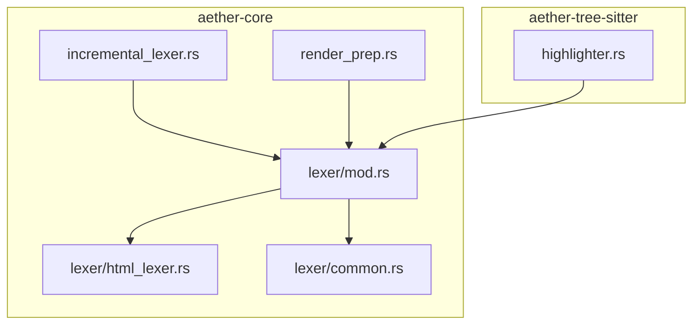
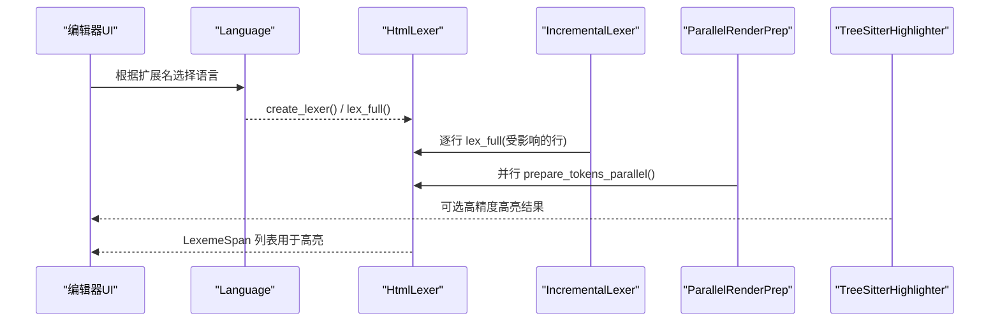
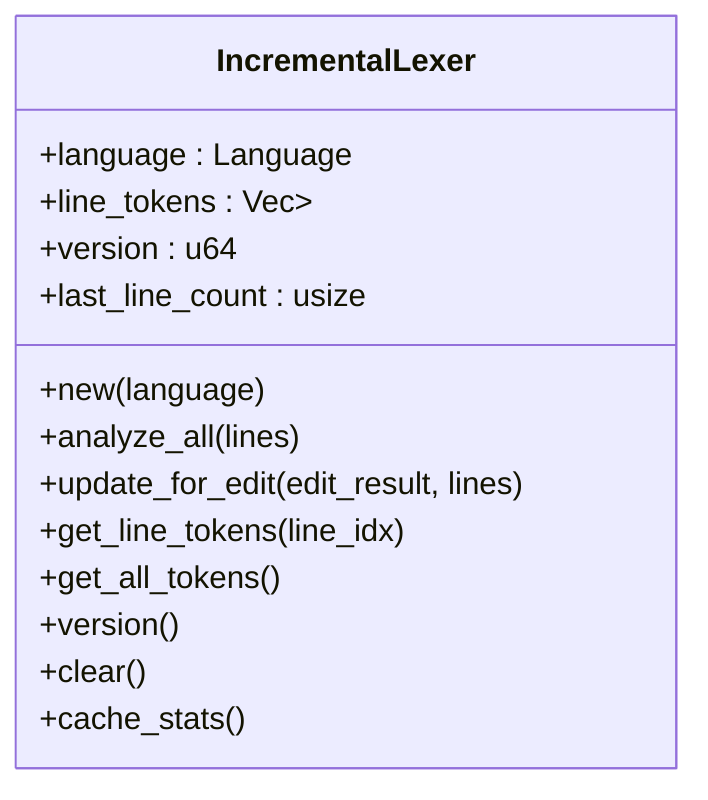
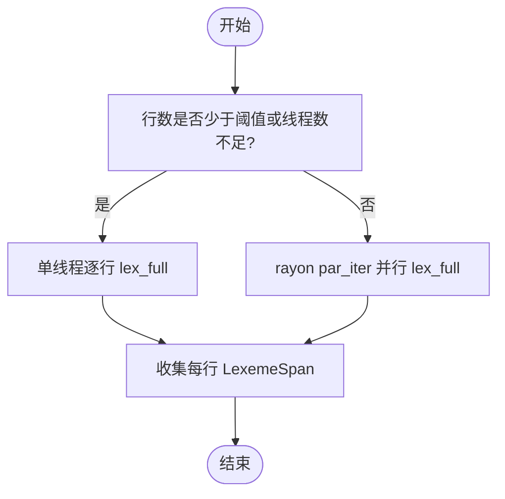
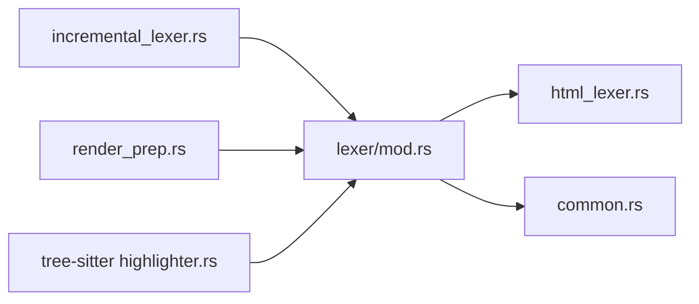

# HTML 词法分析器

<cite>
**本文引用的文件**
- [crates/aether-core/src/lexer/html_lexer.rs](file://crates/aether-core/src/lexer/html_lexer.rs)
- [crates/aether-core/src/lexer/mod.rs](file://crates/aether-core/src/lexer/mod.rs)
- [crates/aether-core/src/lexer/common.rs](file://crates/aether-core/src/lexer/common.rs)
- [crates/aether-core/src/incremental_lexer.rs](file://crates/aether-core/src/incremental_lexer.rs)
- [crates/aether-core/src/render_prep.rs](file://crates/aether-core/src/render_prep.rs)
- [crates/aether-tree-sitter/src/highlighter.rs](file://crates/aether-tree-sitter/src/highlighter.rs)
</cite>

## 目录
1. [简介](#简介)
2. [项目结构](#项目结构)
3. [核心组件](#核心组件)
4. [架构总览](#架构总览)
5. [详细组件分析](#详细组件分析)
6. [依赖关系分析](#依赖关系分析)
7. [性能考量](#性能考量)
8. [故障排查指南](#故障排查指南)
9. [结论](#结论)
10. [附录](#附录)

## 简介
本技术文档聚焦于项目中的 HTML 词法分析器，系统性阐述其语法特征实现与集成方式。内容覆盖标签解析、属性处理、文本内容、注释、实体引用、自闭合标签、嵌套结构的容错策略，以及与其他高亮机制（如 Tree-sitter）的协作。同时给出增量分析与并行渲染预处理的设计说明，帮助读者理解在编辑器场景下如何实现高效、可维护且语义化的高亮能力。

## 项目结构
HTML 词法分析器位于 aether-core 的 lexer 模块中，并通过 Language 枚举统一接入。增量词法分析器与渲染预处理器分别负责行级缓存与并行预处理，Tree-sitter 高亮器提供可选的更精确高亮路径。



图表来源
- [crates/aether-core/src/lexer/mod.rs:145-182](file://crates/aether-core/src/lexer/mod.rs#L145-L182)
- [crates/aether-core/src/lexer/html_lexer.rs:1-227](file://crates/aether-core/src/lexer/html_lexer.rs#L1-L227)
- [crates/aether-core/src/lexer/common.rs:1-151](file://crates/aether-core/src/lexer/common.rs#L1-L151)
- [crates/aether-core/src/incremental_lexer.rs:1-130](file://crates/aether-core/src/incremental_lexer.rs#L1-L130)
- [crates/aether-core/src/render_prep.rs:1-67](file://crates/aether-core/src/render_prep.rs#L1-L67)
- [crates/aether-tree-sitter/src/highlighter.rs:1-200](file://crates/aether-tree-sitter/src/highlighter.rs#L1-L200)

章节来源
- [crates/aether-core/src/lexer/mod.rs:145-182](file://crates/aether-core/src/lexer/mod.rs#L145-L182)
- [crates/aether-core/src/lexer/html_lexer.rs:1-227](file://crates/aether-core/src/lexer/html_lexer.rs#L1-L227)

## 核心组件
- 通用 Lexer trait 与 TokenKind：定义跨语言的统一接口与 token 类型集合，HTML 通过 HtmlLexer 实现 lex_full。
- HtmlLexer：单字节扫描实现，识别注释、标签（含结束标签）、属性名/值、等号、自闭合符、实体引用与普通文本。
- 增量词法分析器 IncrementalLexer：按行缓存 token，编辑后仅重算受影响行。
- 并行渲染预处理 ParallelRenderPrep：对可见行进行并行 token 预处理，减少重复计算。
- Tree-sitter 高亮器：作为可选的高精度高亮方案，可与轻量 lexer 并存。

章节来源
- [crates/aether-core/src/lexer/mod.rs:1-96](file://crates/aether-core/src/lexer/mod.rs#L1-L96)
- [crates/aether-core/src/lexer/html_lexer.rs:1-227](file://crates/aether-core/src/lexer/html_lexer.rs#L1-L227)
- [crates/aether-core/src/incremental_lexer.rs:1-130](file://crates/aether-core/src/incremental_lexer.rs#L1-L130)
- [crates/aether-core/src/render_prep.rs:1-67](file://crates/aether-core/src/render_prep.rs#L1-L67)
- [crates/aether-tree-sitter/src/highlighter.rs:1-200](file://crates/aether-tree-sitter/src/highlighter.rs#L1-L200)

## 架构总览
HTML 词法分析器在编辑器中的调用链如下：语言检测 -> 创建具体 Lexer -> 全量或增量分析 -> 渲染预处理 -> 高亮输出。Tree-sitter 可作为高精度高亮的备选路径。



图表来源
- [crates/aether-core/src/lexer/mod.rs:145-182](file://crates/aether-core/src/lexer/mod.rs#L145-L182)
- [crates/aether-core/src/incremental_lexer.rs:28-101](file://crates/aether-core/src/incremental_lexer.rs#L28-L101)
- [crates/aether-core/src/render_prep.rs:32-61](file://crates/aether-core/src/render_prep.rs#L32-L61)
- [crates/aether-tree-sitter/src/highlighter.rs:180-200](file://crates/aether-tree-sitter/src/highlighter.rs#L180-L200)

## 详细组件分析

### HtmlLexer 设计与实现
HtmlLexer 采用单字节扫描，状态机式推进指针 i，依次识别以下片段：
- HTML 注释 <!-- ... -->
- 标签 <...>（支持结束标签 </...>）
- 标签名（字母数字、连字符、下划线、冒号）
- 属性名与属性值（支持双引号、单引号和无引号值）
- 等号运算符
- 自闭合斜杠 / 与闭合 >
- 实体引用 &...;
- 普通文本（非标签、非实体）

```mermaid
flowchart TD
Start(["开始"]) --> CheckComment["是否以 \"<!--\" 开头?"]
CheckComment --> |是| EmitBlockComment["产出 BlockComment 并跳过到 \" --> \""]
CheckComment --> |否| CheckLess["当前字节是否为 '<' ?"]
CheckLess --> |否| CheckEntity["当前字节是否为 '&' ?"]
CheckEntity --> |是| EmitEntity["产出 Identifier 并跳过到 ';' 或边界"]
CheckEntity --> |否| EmitText["收集连续非 '<' 非 '&' 文本为 Unknown"]
CheckLess --> |是| ParseTag["解析标签: 可选 '/' 结束标记, 标签名, 属性, '/', '>'"]
ParseTag --> EmitTokens["产出 Keyword/Attribute/Operator/StringLiteral/Punctuation"]
EmitBlockComment --> Next["继续扫描"]
EmitEntity --> Next
EmitText --> Next
EmitTokens --> Next
Next --> End(["结束"])
```

图表来源
- [crates/aether-core/src/lexer/html_lexer.rs:16-217](file://crates/aether-core/src/lexer/html_lexer.rs#L16-L217)

关键行为与容错特性
- 注释：遇到 <!-- 即进入块注释模式，直到找到 -->；若未找到则扫描至末尾，保证不越界。
- 标签名：要求至少一个合法字符，否则回退并将 '<' 视为标点，避免误判。
- 属性值：优先匹配带引号的字符串；无引号时按空白与分隔符终止。
- 实体引用：从 & 开始扫描到 ; 或空格/小于号，若存在 ; 则包含之，整体标记为标识符。
- 自闭合：将 / 和 > 分别作为标点产出，便于上层区分。
- 未知文本：未被识别的结构以 Unknown 返回，确保任何输入都能被消费。

章节来源
- [crates/aether-core/src/lexer/html_lexer.rs:16-217](file://crates/aether-core/src/lexer/html_lexer.rs#L16-L217)

### 标签与属性处理细节
- 标签名允许字母数字、连字符、下划线、冒号，兼容 SVG/MathML 前缀命名空间风格。
- 属性名以非空白、非等号、非结束符为界；属性值支持双引号、单引号和无引号三种形式。
- 等号单独作为 Operator 产出，便于上层语义高亮。
- 自闭合标签的 / 与 > 均作为 Punctuation 产出，测试用例验证了该行为。

章节来源
- [crates/aether-core/src/lexer/html_lexer.rs:47-177](file://crates/aether-core/src/lexer/html_lexer.rs#L47-L177)

### 实体引用与字符编码
- 实体引用从 & 开始，扫描到 ; 或空格/小于号；若存在 ; 则包含之，整体标记为 Identifier。
- 字符编码方面，lexer 基于 UTF-8 首字节推断长度工具函数 utf8_char_len，保证多字节字符不会导致无限循环。

章节来源
- [crates/aether-core/src/lexer/html_lexer.rs:181-198](file://crates/aether-core/src/lexer/html_lexer.rs#L181-L198)
- [crates/aether-core/src/lexer/mod.rs:223-233](file://crates/aether-core/src/lexer/mod.rs#L223-L233)

### DOCTYPE 声明与 CDATA 段
- 当前实现未显式识别 <!DOCTYPE ...> 与 <![CDATA[ ... ]]> 等特殊结构，它们会被当作普通文本或标点序列处理。
- 如需增强，可在标签解析分支增加对 "<!" 开头的特殊分支，分别处理 DOCTYPE 与 CDATA 的起止标记。

章节来源
- [crates/aether-core/src/lexer/html_lexer.rs:37-178](file://crates/aether-core/src/lexer/html_lexer.rs#L37-L178)

### 嵌入内容（SVG、MathML）与 HTML5 新特性
- 标签名规则允许冒号与连字符，能覆盖 SVG/MathML 的命名空间前缀与自定义元素。
- 对于 HTML5 新增标签与属性，只要符合上述命名与属性规则即可被识别。
- 如需更精细的语义高亮（例如区分标签名与关键字），可将标签名 token 类型调整为更合适的类别，并在上层映射到高亮主题。

章节来源
- [crates/aether-core/src/lexer/html_lexer.rs:47-74](file://crates/aether-core/src/lexer/html_lexer.rs#L47-L74)

### 容错解析与语义化高亮
- 容错：当标签名无效时回退为标点；未闭合注释或标签会尽量向前推进，避免死循环。
- 语义化：可通过调整 TokenKind 的分配（如将标签名改为更明确的类别）并结合 Tree-sitter 高亮器提供更准确的语义高亮。

章节来源
- [crates/aether-core/src/lexer/html_lexer.rs:64-74](file://crates/aether-core/src/lexer/html_lexer.rs#L64-L74)
- [crates/aether-tree-sitter/src/highlighter.rs:559-583](file://crates/aether-tree-sitter/src/highlighter.rs#L559-L583)

### 增量词法分析器
- 按行缓存 token，编辑后仅重算受影响行，使用 Vec 存储，O(1) 访问。
- 支持插入/删除导致的行数变化，自动调整内部缓存结构。
- 提供版本控制与统计信息，便于渲染层判断缓存有效性。



图表来源
- [crates/aether-core/src/incremental_lexer.rs:1-130](file://crates/aether-core/src/incremental_lexer.rs#L1-L130)

章节来源
- [crates/aether-core/src/incremental_lexer.rs:1-130](file://crates/aether-core/src/incremental_lexer.rs#L1-L130)

### 并行渲染预处理
- 对可见行使用 rayon 并行 map-reduce，线程池复用避免频繁创建销毁开销。
- 行数较少或线程数不足时回退为单线程处理。



图表来源
- [crates/aether-core/src/render_prep.rs:32-61](file://crates/aether-core/src/render_prep.rs#L32-L61)

章节来源
- [crates/aether-core/src/render_prep.rs:1-67](file://crates/aether-core/src/render_prep.rs#L1-L67)

### Tree-sitter 高亮器（可选）
- 提供基于 capture 名称到 TokenKind 的映射，支持 keyword、string、number、comment、function、type、operator、identifier、preprocessor、attribute 等。
- 与现有 Lexer 框架兼容，返回 LexemeSpan 列表，可用于更精确的高亮。

章节来源
- [crates/aether-tree-sitter/src/highlighter.rs:559-583](file://crates/aether-tree-sitter/src/highlighter.rs#L559-L583)

## 依赖关系分析
- HtmlLexer 依赖通用 Lexer trait 与 TokenKind，由 Language 工厂方法创建。
- IncrementalLexer 与 ParallelRenderPrep 均依赖 Language.create_lexer() 获取具体 lexer。
- Tree-sitter 高亮器独立运行，但返回相同的数据结构以便替换或叠加。



图表来源
- [crates/aether-core/src/lexer/mod.rs:145-182](file://crates/aether-core/src/lexer/mod.rs#L145-L182)
- [crates/aether-core/src/lexer/html_lexer.rs:1-227](file://crates/aether-core/src/lexer/html_lexer.rs#L1-L227)
- [crates/aether-core/src/incremental_lexer.rs:1-130](file://crates/aether-core/src/incremental_lexer.rs#L1-L130)
- [crates/aether-core/src/render_prep.rs:1-67](file://crates/aether-core/src/render_prep.rs#L1-L67)
- [crates/aether-tree-sitter/src/highlighter.rs:1-200](file://crates/aether-tree-sitter/src/highlighter.rs#L1-L200)

章节来源
- [crates/aether-core/src/lexer/mod.rs:145-182](file://crates/aether-core/src/lexer/mod.rs#L145-L182)

## 性能考量
- 单字节扫描：简单可靠，适合轻量高亮；在热点路径上可考虑批量查找（如 memchr）以减少循环次数。
- 预分配容量：lex_full 已为 spans 预留容量，降低扩容开销。
- 增量更新：按行缓存与最小重算范围，显著降低编辑时的 CPU 消耗。
- 并行预处理：大文件可见区域并行 map-reduce，利用多线程提升吞吐。
- UTF-8 安全：utf8_char_len 保证非法字节也能前进，避免死循环。

章节来源
- [crates/aether-core/src/lexer/html_lexer.rs:11-14](file://crates/aether-core/src/lexer/html_lexer.rs#L11-L14)
- [crates/aether-core/src/incremental_lexer.rs:28-101](file://crates/aether-core/src/incremental_lexer.rs#L28-L101)
- [crates/aether-core/src/render_prep.rs:32-61](file://crates/aether-core/src/render_prep.rs#L32-L61)
- [crates/aether-core/src/lexer/mod.rs:223-233](file://crates/aether-core/src/lexer/mod.rs#L223-L233)

## 故障排查指南
- 标签名无效：当 '<' 后不是有效标签名时，会将 '<' 作为标点处理，避免误判。检查输入是否符合预期，或在上层做二次校验。
- 未闭合注释：注释未找到结束标记时会扫描至末尾，不会产生越界；确认注释格式是否正确。
- 实体引用不完整：& 后若无 ;，仍会产出标识符片段；上层可根据需要忽略或提示。
- 中文/Emoji 高亮错位：由于按字节扫描，多字节字符可能被拆分为多个 Unknown token；建议结合 utf8_char_len 或 Tree-sitter 高亮器改善体验。

章节来源
- [crates/aether-core/src/lexer/html_lexer.rs:64-74](file://crates/aether-core/src/lexer/html_lexer.rs#L64-L74)
- [crates/aether-core/src/lexer/html_lexer.rs:18-35](file://crates/aether-core/src/lexer/html_lexer.rs#L18-L35)
- [crates/aether-core/src/lexer/html_lexer.rs:181-198](file://crates/aether-core/src/lexer/html_lexer.rs#L181-L198)
- [crates/aether-core/src/lexer/mod.rs:223-233](file://crates/aether-core/src/lexer/mod.rs#L223-L233)

## 结论
HTML 词法分析器以简洁高效的单字节扫描实现了基础的标签、属性、注释、实体引用与文本识别，具备良好的容错性与可扩展性。配合增量词法分析与并行渲染预处理，能够在编辑器场景中提供流畅的交互体验。对于更精细的语义高亮需求，可引入 Tree-sitter 高亮器作为补充。未来可在 DOCTYPE、CDATA、更严格的属性值解析与更细粒度的 TokenKind 分类方面进一步增强。

## 附录
- 示例用法路径（不展示代码内容）：
  - 全量分析：参考 [crates/aether-core/src/lexer/html_lexer.rs:11-227](file://crates/aether-core/src/lexer/html_lexer.rs#L11-L227)
  - 增量更新：参考 [crates/aether-core/src/incremental_lexer.rs:43-101](file://crates/aether-core/src/incremental_lexer.rs#L43-L101)
  - 并行预处理：参考 [crates/aether-core/src/render_prep.rs:32-61](file://crates/aether-core/src/render_prep.rs#L32-L61)
  - Tree-sitter 高亮映射：参考 [crates/aether-tree-sitter/src/highlighter.rs:559-583](file://crates/aether-tree-sitter/src/highlighter.rs#L559-L583)