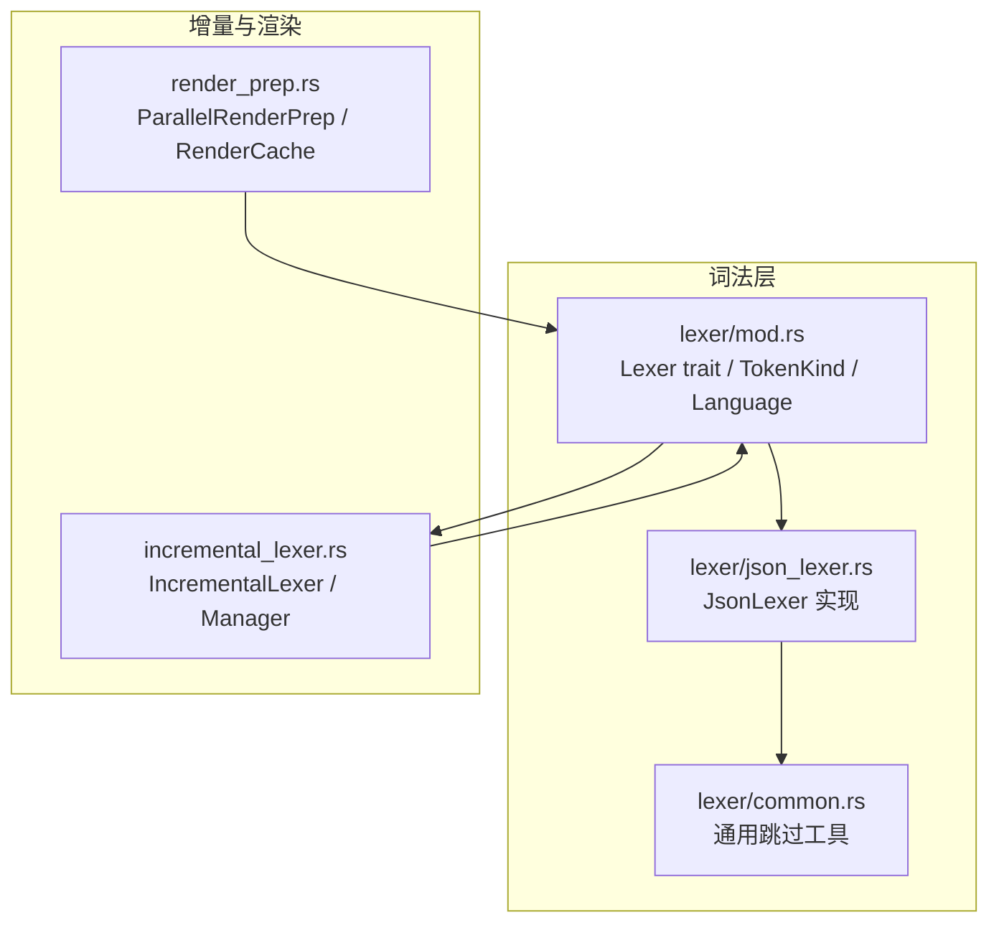
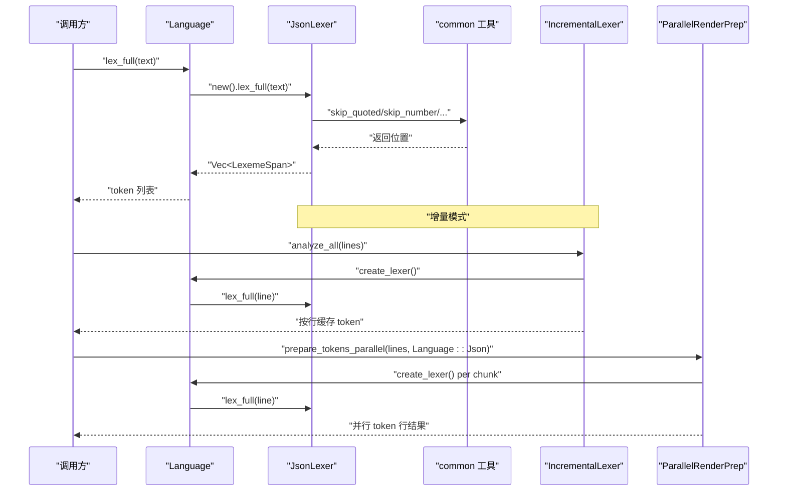
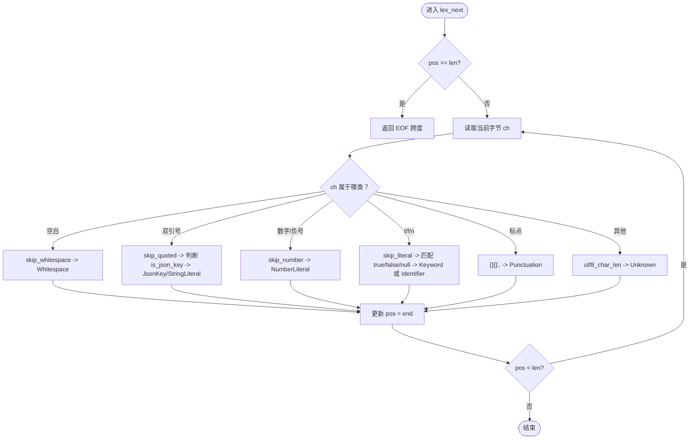
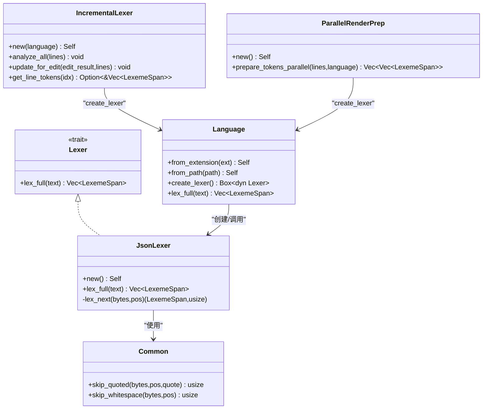

# JSON 词法分析器

<cite>
**本文引用的文件**
- [json_lexer.rs](file://crates/aether-core/src/lexer/json_lexer.rs)
- [common.rs](file://crates/aether-core/src/lexer/common.rs)
- [mod.rs](file://crates/aether-core/src/lexer/mod.rs)
- [incremental_lexer.rs](file://crates/aether-core/src/incremental_lexer.rs)
- [render_prep.rs](file://crates/aether-core/src/render_prep.rs)
</cite>

## 目录
1. [简介](#简介)
2. [项目结构](#项目结构)
3. [核心组件](#核心组件)
4. [架构总览](#架构总览)
5. [详细组件分析](#详细组件分析)
6. [依赖关系分析](#依赖关系分析)
7. [性能考量](#性能考量)
8. [故障排查指南](#故障排查指南)
9. [结论](#结论)
10. [附录](#附录)

## 简介
本技术文档聚焦于 JSON 词法分析器的实现与使用，围绕以下目标展开：
- 解释 JSON 数据格式的严格语法规则在词法层面的实现方式（对象、数组、字符串、数字、布尔值、null）。
- 说明特殊字符转义处理、Unicode 序列解析策略、数字格式验证与嵌套结构识别。
- 介绍与 JSON Schema 相关的元数据处理现状与扩展建议。
- 提供错误恢复机制的设计思路与落地方案。
- 给出具体代码示例路径，展示如何对 JSON 数据进行精确解析与高亮显示。

## 项目结构
JSON 词法分析器位于 aether-core 的 lexer 模块中，采用“语言独立 trait + 多语言实现”的组织方式。JSON 相关的关键文件如下：
- json_lexer.rs：JSON 词法分析器实现，包含逐 token 扫描、空白/数字/字面量跳过、键识别等逻辑。
- common.rs：跨语言的通用工具函数，如 skip_quoted（带反斜杠安全跳过的引号串）、skip_whitespace 等。
- mod.rs：统一 Lexer trait、TokenKind 枚举、Language 枚举及静态分发入口。
- incremental_lexer.rs：增量词法分析器，按行缓存 token，支持编辑后局部重算。
- render_prep.rs：渲染预处理与并行化准备，为高亮渲染提供预计算的 token 行数据。

图表来源
- [mod.rs:1-182](file://crates/aether-core/src/lexer/mod.rs#L1-L182)
- [json_lexer.rs:1-127](file://crates/aether-core/src/lexer/json_lexer.rs#L1-L127)
- [common.rs:1-55](file://crates/aether-core/src/lexer/common.rs#L1-L55)
- [incremental_lexer.rs:1-129](file://crates/aether-core/src/incremental_lexer.rs#L1-L129)
- [render_prep.rs:1-67](file://crates/aether-core/src/render_prep.rs#L1-L67)

章节来源
- [mod.rs:1-182](file://crates/aether-core/src/lexer/mod.rs#L1-L182)
- [json_lexer.rs:1-127](file://crates/aether-core/src/lexer/json_lexer.rs#L1-L127)
- [common.rs:1-55](file://crates/aether-core/src/lexer/common.rs#L1-L55)
- [incremental_lexer.rs:1-129](file://crates/aether-core/src/incremental_lexer.rs#L1-L129)
- [render_prep.rs:1-67](file://crates/aether-core/src/render_prep.rs#L1-L67)

## 核心组件
- JsonLexer：实现 Lexer trait，提供 lex_full 全量词法分析；内部通过 lex_next 逐个扫描字节切片，产出 LexemeSpan 列表。
- TokenKind：统一的 token 类型集合，包含 Keyword、StringLiteral、NumberLiteral、Punctuation、Whitespace、Unknown、EOF 以及 JsonKey 等。
- Language：根据扩展名或路径选择对应语言，并创建相应 Lexer 实例；同时提供静态分发的 lex_full 接口。
- IncrementalLexer：按行缓存 token，支持编辑后的增量更新与版本失效检测。
- ParallelRenderPrep：基于 rayon 的并行预处理，将每行文本交给对应语言的 Lexer 进行 token 化，供渲染阶段消费。

章节来源
- [json_lexer.rs:1-127](file://crates/aether-core/src/lexer/json_lexer.rs#L1-L127)
- [mod.rs:1-182](file://crates/aether-core/src/lexer/mod.rs#L1-L182)
- [incremental_lexer.rs:1-129](file://crates/aether-core/src/incremental_lexer.rs#L1-L129)
- [render_prep.rs:1-67](file://crates/aether-core/src/render_prep.rs#L1-L67)

## 架构总览
JSON 词法分析在编辑器中的调用链如下：
- 上层根据文件扩展名选择 Language::Json，并通过 Language::lex_full 或 create_lexer 获取 JsonLexer。
- JsonLexer 对输入文本进行逐 token 扫描，产出 LexemeSpan 序列。
- 增量场景下，IncrementalLexer 维护每行的 token 缓存，并在编辑后仅重算受影响行。
- 渲染阶段，ParallelRenderPrep 可并行生成可见行的 token 列表，配合 RenderCache 减少重复计算。

图表来源
- [mod.rs:145-181](file://crates/aether-core/src/lexer/mod.rs#L145-L181)
- [json_lexer.rs:113-127](file://crates/aether-core/src/lexer/json_lexer.rs#L113-L127)
- [common.rs:42-55](file://crates/aether-core/src/lexer/common.rs#L42-L55)
- [incremental_lexer.rs:28-34](file://crates/aether-core/src/incremental_lexer.rs#L28-L34)
- [render_prep.rs:36-54](file://crates/aether-core/src/render_prep.rs#L36-L54)

## 详细组件分析

### JsonLexer 实现要点
- 状态机式扫描：lex_next 根据当前字节分支处理空白、字符串、数字、字面量、标点与未知字符。
- 字符串与键识别：
  - 使用 common::skip_quoted 安全跳过双引号包围的字符串内容，正确处理末尾反斜杠。
  - is_json_key 在字符串结束后向前跳过空白，判断是否紧跟冒号，从而区分 JsonKey 与 StringLiteral。
- 数字解析：
  - skip_number 支持可选负号、整数部分、小数部分、指数部分（e/E 与可选 +/-），符合 JSON 数字语法。
- 字面量识别：
  - skip_literal 读取连续 ASCII 字母，随后匹配 true/false/null 为 Keyword，否则标记为 Identifier。
- 标点符号：
  - {}[]:, 作为 Punctuation 输出。
- 未知字符：
  - 非 JSON 合法字符被标记为 Unknown，并以 UTF-8 首字节推断长度，保证至少前进一步，避免死循环。

图表来源
- [json_lexer.rs:12-110](file://crates/aether-core/src/lexer/json_lexer.rs#L12-L110)
- [json_lexer.rs:135-187](file://crates/aether-core/src/lexer/json_lexer.rs#L135-L187)
- [common.rs:42-55](file://crates/aether-core/src/lexer/common.rs#L42-L55)
- [mod.rs:223-233](file://crates/aether-core/src/lexer/mod.rs#L223-L233)

章节来源
- [json_lexer.rs:12-110](file://crates/aether-core/src/lexer/json_lexer.rs#L12-L110)
- [json_lexer.rs:135-187](file://crates/aether-core/src/lexer/json_lexer.rs#L135-L187)
- [common.rs:42-55](file://crates/aether-core/src/lexer/common.rs#L42-L55)
- [mod.rs:223-233](file://crates/aether-core/src/lexer/mod.rs#L223-L233)

### 字符串与转义处理
- 转义安全：skip_quoted 遇到反斜杠时，若存在下一字节则整体跳过两个字节，否则只前进一个字节，防止越界。
- 未闭合字符串：当到达文本末尾仍未找到匹配的结束引号时，函数返回文本末尾位置，确保词法分析不会卡死。
- 键识别：is_json_key 在字符串结束后跳过空白，检查是否紧跟冒号，用于区分键与值字符串。

章节来源
- [common.rs:42-55](file://crates/aether-core/src/lexer/common.rs#L42-L55)
- [json_lexer.rs:40-58](file://crates/aether-core/src/lexer/json_lexer.rs#L40-L58)
- [json_lexer.rs:135-143](file://crates/aether-core/src/lexer/json_lexer.rs#L135-L143)

### Unicode 序列解析策略
- 当前实现未在词法层面解析 \uXXXX 或 \u{...} 序列，而是以字节为单位跳过字符串内容，并将整个字符串作为一个 token 输出。
- 对于未知字符（不在 JSON 关键字/标点/数字/引号范围内），使用 utf8_char_len 推断首字节对应的 UTF-8 长度，保证至少前进一步。
- 如需语义级 Unicode 解码（例如高亮转义序列），可在后续阶段对 StringLiteral 内容进行解码与二次标注。

章节来源
- [json_lexer.rs:40-58](file://crates/aether-core/src/lexer/json_lexer.rs#L40-L58)
- [mod.rs:223-233](file://crates/aether-core/src/lexer/mod.rs#L223-L233)

### 数字格式验证
- 支持负号、整数、小数点与小数部分、指数 e/E 与可选正负号与指数部分，覆盖 JSON 数字语法。
- 注意：该实现较为宽松，可能将某些非法组合也视为数字片段（例如多余的小数点或指数），建议在需要严格校验的场景增加额外验证步骤。

章节来源
- [json_lexer.rs:155-179](file://crates/aether-core/src/lexer/json_lexer.rs#L155-L179)

### 嵌套结构识别
- 词法层不构建 AST，但通过标点 token（{}[]:,）可以辅助上层进行括号匹配与缩进/折叠等 UI 功能。
- 键识别（JsonKey）有助于区分对象键与值字符串，便于高亮与导航。

章节来源
- [json_lexer.rs:88-96](file://crates/aether-core/src/lexer/json_lexer.rs#L88-L96)
- [json_lexer.rs:40-58](file://crates/aether-core/src/lexer/json_lexer.rs#L40-L58)

### JSON Schema 相关的元数据处理
- 当前仓库未发现 JSON Schema 解析或校验的实现。词法层仅提供 token 流，不包含语义校验能力。
- 建议扩展方向：
  - 在编辑器启动时加载 .schema.json 或 $schema 字段指向的 schema 文件。
  - 在增量更新时，结合变更范围重新运行轻量校验，并生成诊断信息（错误位置、消息）。
  - 将诊断信息与 token 行关联，用于高亮与提示。

[本节为概念性建议，不涉及具体源码]

### 错误恢复机制
- 词法层对未知字符采用 Unknown token 并推进至少一个字节，避免死循环，保持稳健性。
- 未闭合字符串会吞到文本末尾，保证继续分析后续内容。
- 建议增强：
  - 引入错误计数与最大错误限制，避免大量错误导致性能问题。
  - 记录错误位置与简要描述，供上层进行快速修复建议。

章节来源
- [json_lexer.rs:97-108](file://crates/aether-core/src/lexer/json_lexer.rs#L97-L108)
- [common.rs:42-55](file://crates/aether-core/src/lexer/common.rs#L42-L55)

### 增量与渲染集成
- IncrementalLexer 按行缓存 token，支持插入/删除/替换后的局部重算，并提供版本控制与统计。
- ParallelRenderPrep 利用 rayon 并行处理可见行，降低大文件的 token 化开销。
- 典型流程：打开文件 -> analyze_all -> 编辑 -> update_for_edit -> 渲染 -> prepare_tokens_parallel。

章节来源
- [incremental_lexer.rs:28-101](file://crates/aether-core/src/incremental_lexer.rs#L28-L101)
- [render_prep.rs:36-67](file://crates/aether-core/src/render_prep.rs#L36-L67)

## 依赖关系分析
- JsonLexer 依赖 common 工具函数进行字符串与空白跳过。
- Language 提供静态分发入口，直接调用 JsonLexer::lex_full，避免动态分配与虚调用开销。
- IncrementalLexer 与 ParallelRenderPrep 均通过 Language 创建 Lexer 实例，形成统一的词法入口。

图表来源
- [mod.rs:1-182](file://crates/aether-core/src/lexer/mod.rs#L1-182)
- [json_lexer.rs:1-127](file://crates/aether-core/src/lexer/json_lexer.rs#L1-127)
- [common.rs:1-55](file://crates/aether-core/src/lexer/common.rs#L1-L55)
- [incremental_lexer.rs:1-129](file://crates/aether-core/src/incremental_lexer.rs#L1-L129)
- [render_prep.rs:1-67](file://crates/aether-core/src/render_prep.rs#L1-L67)

章节来源
- [mod.rs:1-182](file://crates/aether-core/src/lexer/mod.rs#L1-182)
- [json_lexer.rs:1-127](file://crates/aether-core/src/lexer/json_lexer.rs#L1-127)
- [common.rs:1-55](file://crates/aether-core/src/lexer/common.rs#L1-L55)
- [incremental_lexer.rs:1-129](file://crates/aether-core/src/incremental_lexer.rs#L1-L129)
- [render_prep.rs:1-67](file://crates/aether-core/src/render_prep.rs#L1-L67)

## 性能考量
- 预分配容量：lex_full 初始化时预留一定容量，减少扩容开销。
- 静态分发：Language::lex_full 直接调用具体 Lexer 的 lex_full，避免 Box<dyn Lexer> 的动态分发。
- 增量缓存：IncrementalLexer 按行缓存 token，编辑后仅重算受影响行，显著降低重复计算。
- 并行预处理：ParallelRenderPrep 在行数较多时使用 rayon 并行 map，提升吞吐。
- 潜在优化：
  - 使用 memchr/SIMD 批量查找空白与标点，减少逐字节循环。
  - 对关键词匹配使用哈希表或字典树，降低线性比较成本。
  - 对数字解析增加更严格的边界检查，避免误判。

章节来源
- [json_lexer.rs:114-126](file://crates/aether-core/src/lexer/json_lexer.rs#L114-L126)
- [mod.rs:165-181](file://crates/aether-core/src/lexer/mod.rs#L165-L181)
- [incremental_lexer.rs:28-101](file://crates/aether-core/src/incremental_lexer.rs#L28-L101)
- [render_prep.rs:36-54](file://crates/aether-core/src/render_prep.rs#L36-L54)

## 故障排查指南
- 症状：中文或 emoji 高亮错位
  - 原因：未知字符被拆成多个 Unknown token，导致后续 token 偏移。
  - 解决：确认 utf8_char_len 正确推断长度；必要时在渲染阶段合并相邻 Unknown token。
- 症状：未闭合字符串导致后续内容无法高亮
  - 原因：skip_quoted 吞到文本末尾。
  - 解决：在词法层记录错误位置，或在渲染层对未闭合字符串进行特殊高亮提示。
- 症状：数字被过度合并
  - 原因：skip_number 较宽松，可能将非法组合纳入。
  - 解决：在需要严格校验的场景增加二次验证，或调整 skip_number 的边界条件。
- 症状：性能瓶颈
  - 原因：大文件全量分析或频繁编辑。
  - 解决：启用增量分析与并行预处理；考虑批量扫描优化。

章节来源
- [json_lexer.rs:97-108](file://crates/aether-core/src/lexer/json_lexer.rs#L97-L108)
- [common.rs:42-55](file://crates/aether-core/src/lexer/common.rs#L42-L55)
- [json_lexer.rs:155-179](file://crates/aether-core/src/lexer/json_lexer.rs#L155-L179)
- [incremental_lexer.rs:43-101](file://crates/aether-core/src/incremental_lexer.rs#L43-L101)
- [render_prep.rs:36-54](file://crates/aether-core/src/render_prep.rs#L36-L54)

## 结论
JSON 词法分析器在当前实现中提供了稳定、高效的 token 化能力，能够准确识别键、字符串、数字、字面量与标点，并与增量与渲染管线良好集成。针对 Unicode 转义与数字严格校验的需求，可在现有基础上进行扩展与增强。未来可引入 JSON Schema 校验与诊断，进一步提升编辑体验与数据质量保障。

## 附录

### 使用示例与代码片段路径
- 全量分析 JSON 文本：
  - 入口：Language::lex_full("...") 或 Language::Json.lex_full("...")
  - 参考路径：[mod.rs:165-181](file://crates/aether-core/src/lexer/mod.rs#L165-L181)
- 增量分析 JSON 文件：
  - 首次分析：IncrementalLexer::analyze_all(lines)
  - 编辑更新：IncrementalLexer::update_for_edit(edit_result, lines)
  - 参考路径：[incremental_lexer.rs:28-101](file://crates/aether-core/src/incremental_lexer.rs#L28-L101)
- 并行预处理 JSON 行 token：
  - 入口：ParallelRenderPrep::prepare_tokens_parallel(lines, Language::Json)
  - 参考路径：[render_prep.rs:36-54](file://crates/aether-core/src/render_prep.rs#L36-L54)
- 字符串与键识别细节：
  - 参考路径：[json_lexer.rs:40-58](file://crates/aether-core/src/lexer/json_lexer.rs#L40-L58)、[json_lexer.rs:135-143](file://crates/aether-core/src/lexer/json_lexer.rs#L135-L143)
- 数字解析细节：
  - 参考路径：[json_lexer.rs:155-179](file://crates/aether-core/src/lexer/json_lexer.rs#L155-L179)