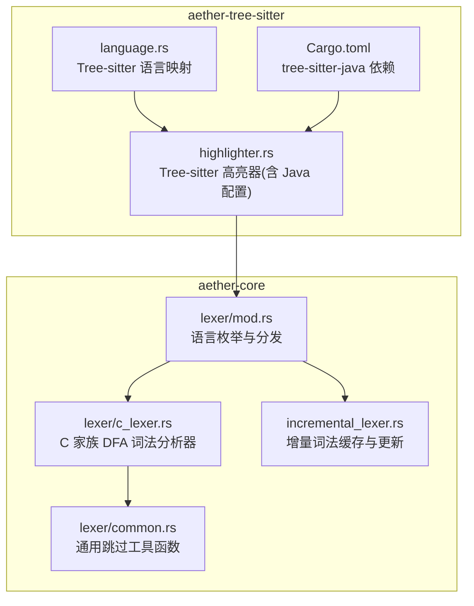
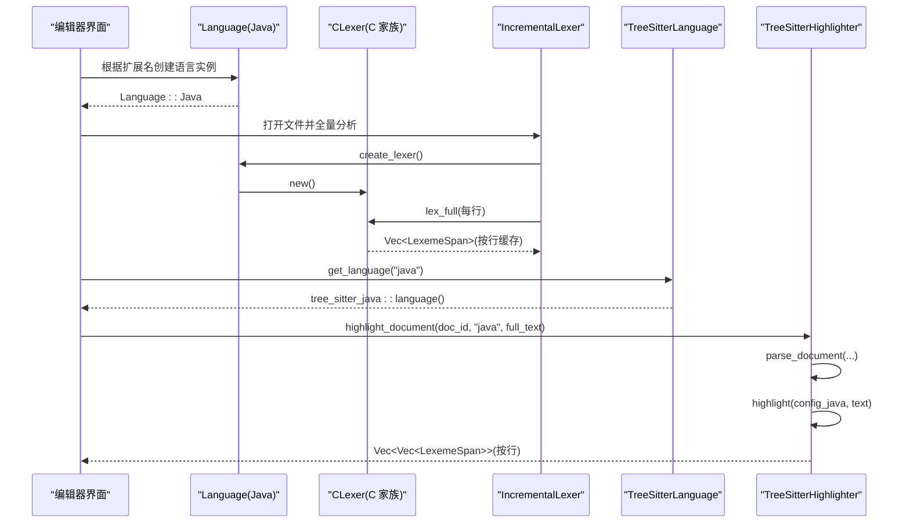
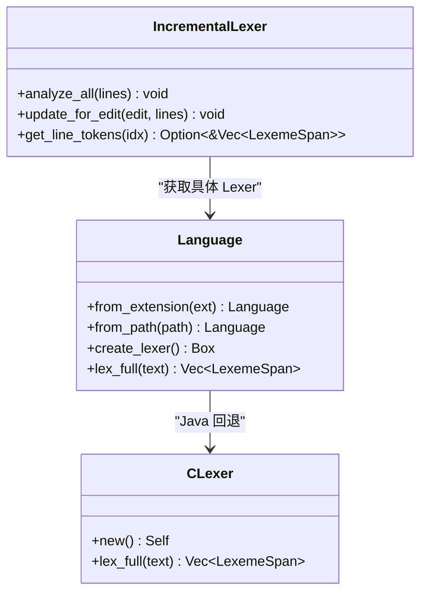
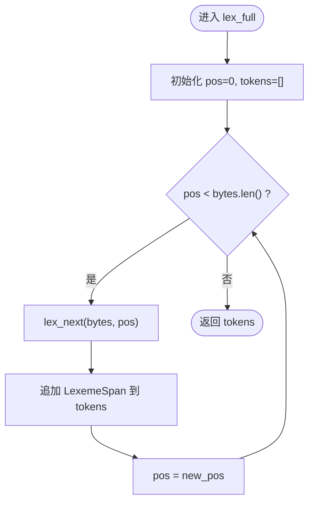
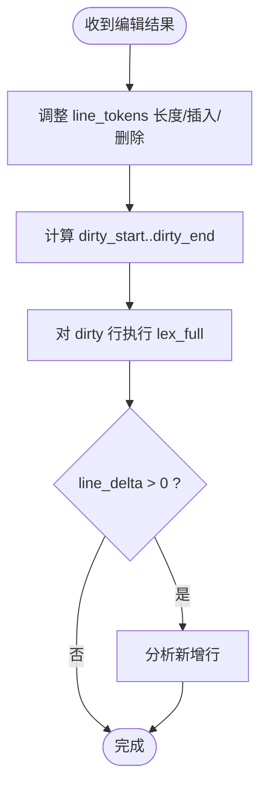
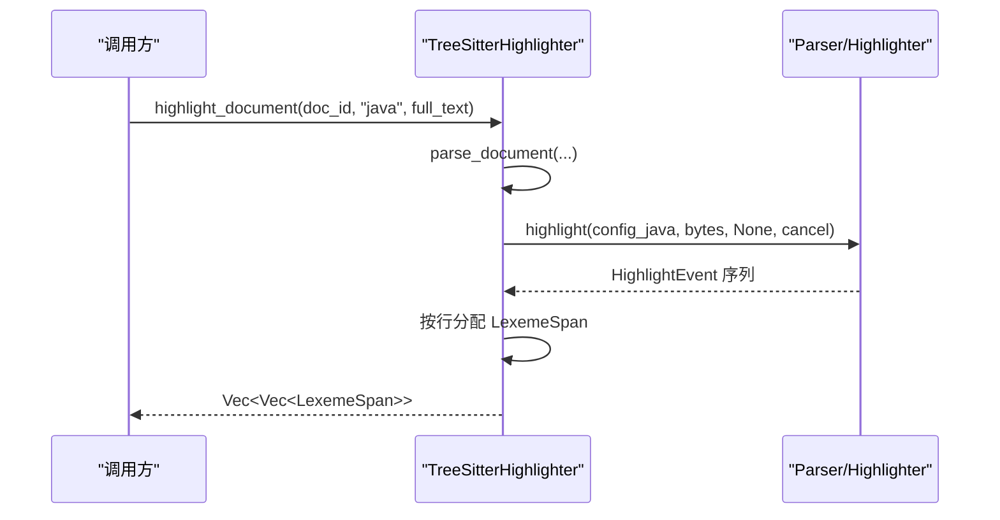
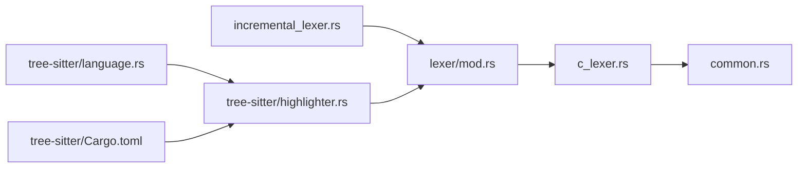

# Java 词法分析器

<cite>
**本文引用的文件列表**
- [crates/aether-core/src/lexer/mod.rs](file://crates/aether-core/src/lexer/mod.rs)
- [crates/aether-core/src/lexer/c_lexer.rs](file://crates/aether-core/src/lexer/c_lexer.rs)
- [crates/aether-core/src/lexer/common.rs](file://crates/aether-core/src/lexer/common.rs)
- [crates/aether-core/src/incremental_lexer.rs](file://crates/aether-core/src/incremental_lexer.rs)
- [crates/aether-tree-sitter/src/highlighter.rs](file://crates/aether-tree-sitter/src/highlighter.rs)
- [crates/aether-tree-sitter/src/language.rs](file://crates/aether-tree-sitter/src/language.rs)
- [crates/aether-tree-sitter/Cargo.toml](file://crates/aether-tree-sitter/Cargo.toml)
</cite>

## 更新摘要
**所做更改**
- 添加了完整的 Java 语言支持，包括 Tree-sitter 集成和 C 家族词法分析器回退
- 新增了 Java 专用的高亮配置和语法树解析支持
- 完善了测试覆盖范围，包含 Java 语言的单元测试
- 更新了依赖管理，添加 tree-sitter-java 0.20 版本支持

## 目录
1. [简介](#简介)
2. [项目结构](#项目结构)
3. [核心组件](#核心组件)
4. [架构总览](#架构总览)
5. [详细组件分析](#详细组件分析)
6. [依赖关系分析](#依赖关系分析)
7. [性能考量](#性能考量)
8. [故障排查指南](#故障排查指南)
9. [结论](#结论)
10. [附录](#附录)

## 简介
本文件聚焦于"Java 词法分析器"的完整实现与集成方式。在该代码库中，Java 语言采用了双轨策略：一方面复用 C 家族词法分析器作为轻量级回退方案，用于基础高亮（注释、字符串、数字、大括号等公共结构）；另一方面通过 Tree-sitter 的高亮配置对 Java 进行更精确的语法高亮支持，包括关键字、类型名、函数调用、注解等高级特性。增量词法分析器则负责在编辑时仅重算受影响行，提升交互性能。

## 项目结构
与 Java 词法分析相关的核心位置如下：
- aether-core/lexer：通用 Lexer 框架与各语言实现；Java 使用 C 家族 lexer 作为回退
- aether-core/incremental_lexer：基于行的增量词法缓存与更新
- aether-tree-sitter/highlighter：Tree-sitter 高亮器，包含 Java 专用高亮配置
- aether-tree-sitter/language：Tree-sitter 语言映射，支持 Java 语言识别
- aether-tree-sitter/Cargo.toml：包含 tree-sitter-java 依赖配置

**图表来源**
- [crates/aether-core/src/lexer/mod.rs:145-181](file://crates/aether-core/src/lexer/mod.rs#L145-L181)
- [crates/aether-core/src/lexer/c_lexer.rs:1-230](file://crates/aether-core/src/lexer/c_lexer.rs#L1-L230)
- [crates/aether-core/src/lexer/common.rs:1-151](file://crates/aether-core/src/lexer/common.rs#L1-L151)
- [crates/aether-core/src/incremental_lexer.rs:1-129](file://crates/aether-core/src/incremental_lexer.rs#L1-L129)
- [crates/aether-tree-sitter/src/highlighter.rs:168-178](file://crates/aether-tree-sitter/src/highlighter.rs#L168-L178)
- [crates/aether-tree-sitter/src/language.rs:16-17](file://crates/aether-tree-sitter/src/language.rs#L16-L17)
- [crates/aether-tree-sitter/Cargo.toml:21](file://crates/aether-tree-sitter/Cargo.toml#L21)

**章节来源**
- [crates/aether-core/src/lexer/mod.rs:145-181](file://crates/aether-core/src/lexer/mod.rs#L145-L181)
- [crates/aether-core/src/lexer/c_lexer.rs:1-230](file://crates/aether-core/src/lexer/c_lexer.rs#L1-L230)
- [crates/aether-core/src/lexer/common.rs:1-151](file://crates/aether-core/src/lexer/common.rs#L1-L151)
- [crates/aether-core/src/incremental_lexer.rs:1-129](file://crates/aether-core/src/incremental_lexer.rs#L1-L129)
- [crates/aether-tree-sitter/src/highlighter.rs:168-178](file://crates/aether-tree-sitter/src/highlighter.rs#L168-L178)
- [crates/aether-tree-sitter/src/language.rs:16-17](file://crates/aether-tree-sitter/src/language.rs#L16-L17)
- [crates/aether-tree-sitter/Cargo.toml:21](file://crates/aether-tree-sitter/Cargo.toml#L21)

## 核心组件
- **语言枚举与分发**：Language::from_extension/from_path 识别 .java 扩展名并映射到 Language::Java；create_lexer 与 lex_full 将 Java 路由到 C 家族词法分析器。
- **C 家族词法分析器**：基于字节级 DFA，识别空白、换行、注释（行/块/文档）、预处理指令、字符串/字符字面量、数字、标识符/关键字、运算符、标点与未知 UTF-8 字符。
- **通用工具函数**：提供跳过空白、注释、引号串、标识符、数字等的通用扫描函数，供各语言 lexer 复用。
- **增量词法分析器**：按行缓存 token，编辑后仅重算受影响行，维护版本号和行数一致性。
- **Tree-sitter 高亮器**：为 Java 初始化 HighlightConfiguration，并通过 capture 名称映射到统一 TokenKind，支持整篇文档高亮与逐行高亮。
- **Tree-sitter 语言映射**：提供 get_language 函数，将 "java" 语言 ID 映射到 tree_sitter_java::language()。

**章节来源**
- [crates/aether-core/src/lexer/mod.rs:80-181](file://crates/aether-core/src/lexer/mod.rs#L80-L181)
- [crates/aether-core/src/lexer/c_lexer.rs:1-230](file://crates/aether-core/src/lexer/c_lexer.rs#L1-L230)
- [crates/aether-core/src/lexer/common.rs:1-151](file://crates/aether-core/src/lexer/common.rs#L1-L151)
- [crates/aether-core/src/incremental_lexer.rs:1-129](file://crates/aether-core/src/incremental_lexer.rs#L1-L129)
- [crates/aether-tree-sitter/src/highlighter.rs:168-178](file://crates/aether-tree-sitter/src/highlighter.rs#L168-L178)
- [crates/aether-tree-sitter/src/language.rs:16-17](file://crates/aether-tree-sitter/src/language.rs#L16-L17)

## 架构总览
下图展示了 Java 文本从输入到最终高亮的两条路径：轻量级 DFA 词法分析（快速回退）与 Tree-sitter 高亮（更精确）。

**图表来源**
- [crates/aether-core/src/lexer/mod.rs:145-181](file://crates/aether-core/src/lexer/mod.rs#L145-L181)
- [crates/aether-core/src/incremental_lexer.rs:28-34](file://crates/aether-core/src/incremental_lexer.rs#L28-L34)
- [crates/aether-tree-sitter/src/language.rs:16-17](file://crates/aether-tree-sitter/src/language.rs#L16-L17)
- [crates/aether-tree-sitter/src/highlighter.rs:431-495](file://crates/aether-tree-sitter/src/highlighter.rs#L431-L495)

## 详细组件分析

### 语言枚举与分发（Java 路由）
- **扩展名检测**：.java -> Language::Java
- **创建词法分析器**：Language::Java 返回 C 家族词法分析器
- **静态分发**：Language::lex_full 直接调用对应语言的 lex_full，避免动态分发开销

**图表来源**
- [crates/aether-core/src/lexer/mod.rs:80-181](file://crates/aether-core/src/lexer/mod.rs#L80-L181)
- [crates/aether-core/src/incremental_lexer.rs:18-34](file://crates/aether-core/src/incremental_lexer.rs#L18-L34)

**章节来源**
- [crates/aether-core/src/lexer/mod.rs:115-181](file://crates/aether-core/src/lexer/mod.rs#L115-L181)

### C 家族词法分析器（Java 回退）
- **设计模式**：确定性有限自动机（DFA），按首字节分支处理不同类别
- **支持的 token 类型**：空白、换行、行/块/文档注释、预处理指令、字符串/字符字面量、数字、标识符/关键字、运算符、标点、未知 UTF-8 字符
- **关键流程**：lex_next 解析单个 token，lex_full 循环推进位置直至 EOF

**图表来源**
- [crates/aether-core/src/lexer/c_lexer.rs:216-230](file://crates/aether-core/src/lexer/c_lexer.rs#L216-L230)
- [crates/aether-core/src/lexer/c_lexer.rs:12-213](file://crates/aether-core/src/lexer/c_lexer.rs#L12-L213)

**章节来源**
- [crates/aether-core/src/lexer/c_lexer.rs:1-230](file://crates/aether-core/src/lexer/c_lexer.rs#L1-L230)

### 通用工具函数（common）
- **作用**：提供不耦合特定语言语义的扫描/跳过函数，如空白、注释、引号串、标识符、数字等
- **优势**：被多语言 lexer 复用，减少重复实现，提高一致性与可维护性

**章节来源**
- [crates/aether-core/src/lexer/common.rs:1-151](file://crates/aether-core/src/lexer/common.rs#L1-L151)

### 增量词法分析器（IncrementalLexer）
- **目标**：在编辑后仅重算受影响行，避免全文重析
- **策略**：
  - 以 Vec 存储每行 token，O(1) 访问
  - 根据 EditResult 调整行数（插入/删除），resize 保证长度一致
  - 仅对 dirty 区间行重新 lex_full
  - 维护 version 版本号用于失效检测
- **管理**：IncrementalLexerManager 管理多个文件的增量 lexer，设置最大缓存条目数防止无界增长

**图表来源**
- [crates/aether-core/src/incremental_lexer.rs:43-101](file://crates/aether-core/src/incremental_lexer.rs#L43-L101)

**章节来源**
- [crates/aether-core/src/incremental_lexer.rs:1-129](file://crates/aether-core/src/incremental_lexer.rs#L1-L129)

### Tree-sitter 高亮器（Java 支持）
- **初始化**：为 Java 创建 HighlightConfiguration，启用标准 capture 名称映射
- **高亮流程**：
  - highlight_document：一次解析全文，生成事件流，按行分配 LexemeSpan
  - highlight_line：单行高亮，适合局部刷新
- **映射策略**：按 capture 名称而非索引映射 TokenKind，兼容不同语言的 highlight query
- **语言支持**：supports_language("java") 返回 true，parse_document 支持 Java 语法树解析

**图表来源**
- [crates/aether-tree-sitter/src/highlighter.rs:431-495](file://crates/aether-tree-sitter/src/highlighter.rs#L431-L495)
- [crates/aether-tree-sitter/src/highlighter.rs:168-178](file://crates/aether-tree-sitter/src/highlighter.rs#L168-L178)

**章节来源**
- [crates/aether-tree-sitter/src/highlighter.rs:168-178](file://crates/aether-tree-sitter/src/highlighter.rs#L168-L178)
- [crates/aether-tree-sitter/src/highlighter.rs:431-495](file://crates/aether-tree-sitter/src/highlighter.rs#L431-L495)

### Tree-sitter 语言映射（Java 支持）
- **语言识别**：get_language("java") 返回 Some(tree_sitter_java::language())
- **别名支持**：支持多种 Java 相关语言 ID 映射
- **错误处理**：不支持的语言返回 None

**章节来源**
- [crates/aether-tree-sitter/src/language.rs:16-17](file://crates/aether-tree-sitter/src/language.rs#L16-L17)

## 依赖关系分析
- **语言分发层**（mod.rs）依赖具体语言 lexer 实现；Java 指向 C 家族 lexer
- **C 家族 lexer** 依赖 common 工具函数
- **增量词法分析器** 依赖 Language 抽象与具体 lexer
- **Tree-sitter 高亮器** 独立于 DFA lexer，但输出统一的 LexemeSpan，便于上层渲染
- **Tree-sitter 语言映射** 提供语言 ID 到 tree-sitter Language 的转换
- **Cargo.toml** 声明 tree-sitter-java 0.20 依赖

**图表来源**
- [crates/aether-core/src/lexer/mod.rs:145-181](file://crates/aether-core/src/lexer/mod.rs#L145-L181)
- [crates/aether-core/src/lexer/c_lexer.rs:1-230](file://crates/aether-core/src/lexer/c_lexer.rs#L1-L230)
- [crates/aether-core/src/lexer/common.rs:1-151](file://crates/aether-core/src/lexer/common.rs#L1-L151)
- [crates/aether-core/src/incremental_lexer.rs:1-129](file://crates/aether-core/src/incremental_lexer.rs#L1-L129)
- [crates/aether-tree-sitter/src/highlighter.rs:168-178](file://crates/aether-tree-sitter/src/highlighter.rs#L168-L178)
- [crates/aether-tree-sitter/src/language.rs:16-17](file://crates/aether-tree-sitter/src/language.rs#L16-L17)
- [crates/aether-tree-sitter/Cargo.toml:21](file://crates/aether-tree-sitter/Cargo.toml#L21)

**章节来源**
- [crates/aether-core/src/lexer/mod.rs:145-181](file://crates/aether-core/src/lexer/mod.rs#L145-L181)
- [crates/aether-core/src/lexer/c_lexer.rs:1-230](file://crates/aether-core/src/lexer/c_lexer.rs#L1-L230)
- [crates/aether-core/src/lexer/common.rs:1-151](file://crates/aether-core/src/lexer/common.rs#L1-L151)
- [crates/aether-core/src/incremental_lexer.rs:1-129](file://crates/aether-core/src/incremental_lexer.rs#L1-L129)
- [crates/aether-tree-sitter/src/highlighter.rs:168-178](file://crates/aether-tree-sitter/src/highlighter.rs#L168-L178)
- [crates/aether-tree-sitter/src/language.rs:16-17](file://crates/aether-tree-sitter/src/language.rs#L16-L17)
- [crates/aether-tree-sitter/Cargo.toml:21](file://crates/aether-tree-sitter/Cargo.toml#L21)

## 性能考量
- **DFA 词法分析**：
  - 时间复杂度 O(n)，空间复杂度 O(k)（k 为 token 数量）
  - 字节级扫描，避免 UTF-8 解码开销，使用 utf8_char_len 安全前进
- **增量词法分析**：
  - 仅重算 dirty 区间行，避免全文重析
  - Vec 连续内存布局，O(1) 行访问，splice/drain 高效调整行数
  - 版本控制便于外部失效检测
- **Tree-sitter 高亮**：
  - 一次解析全文，事件驱动生成高亮 span，适合批量渲染
  - 内部维护 Parser 与树缓存，限制文档缓存上限，避免内存无限增长
- **Java 特定优化**：
  - C 家族 lexer 作为回退方案，确保大文件处理的性能
  - Tree-sitter 高亮仅在需要精确语法高亮时使用

## 故障排查指南
- **Java 未识别为 Java 语言**：
  - 检查文件扩展名是否为 .java；Language::from_extension 会将其映射到 Language::Java
  - 若使用自定义路径或别名，确认 Language::from_path 能正确提取扩展名
- **高亮缺失或不准确**：
  - DFA 回退仅提供基础高亮（注释、字符串、数字、大括号等）
  - 如需更精确高亮，确保 Tree-sitter 高亮器已初始化且 supports_language("java") 为真
  - 检查 tree-sitter-java 依赖是否正确加载
- **增量更新异常**：
  - 确认 EditResult 的 start_line/end_line/line_delta 计算正确
  - 检查 update_for_edit 后的行数与 lines 长度一致
- **内存占用过高**：
  - 检查 IncrementalLexerManager 与 TreeSitterHighlighter 的缓存上限是否生效
  - 长时间运行后应触发清空策略，避免无界增长
- **Java 语法树解析失败**：
  - 确认 get_language("java") 返回有效值
  - 检查 parse_document 的文档 ID 是否唯一

**章节来源**
- [crates/aether-core/src/lexer/mod.rs:115-181](file://crates/aether-core/src/lexer/mod.rs#L115-L181)
- [crates/aether-core/src/incremental_lexer.rs:139-187](file://crates/aether-core/src/incremental_lexer.rs#L139-L187)
- [crates/aether-tree-sitter/src/highlighter.rs:28-29](file://crates/aether-tree-sitter/src/highlighter.rs#L28-L29)
- [crates/aether-tree-sitter/src/language.rs:16-17](file://crates/aether-tree-sitter/src/language.rs#L16-L17)

## 结论
在当前仓库中，Java 的词法分析采用"轻量级 DFA 回退 + Tree-sitter 高亮增强"的双轨策略：
- **DFA 回退**（C 家族 lexer）提供快速、稳定的基础高亮能力，适用于大文件或降级场景
- **Tree-sitter 高亮**提供更精确的语法高亮，满足复杂语言结构的显示需求，包括关键字、类型名、函数调用、注解等
- **增量词法分析器**保障编辑时的响应速度与资源可控
- **完整的测试覆盖**确保 Java 语言功能的稳定性和可靠性

该实现为 Java 语言提供了生产级别的词法分析和语法高亮支持，同时保持了良好的性能和可扩展性。

## 附录
- **相关测试用例参考**：
  - 语言扩展名与路径检测、创建 lexer、静态分发
  - C 家族 lexer 的关键字、注释、运算符、预处理、数字、UTF-8 未知字符
  - 增量词法分析的插入/删除/空行/边界/管理器缓存上限
  - Tree-sitter 高亮器的语言支持与基本高亮行为
  - **新增**：Java 语言支持测试，包括 supports_language("java")、highlight_line("java")、parse_document("java") 等
  - **新增**：Tree-sitter 语言映射测试，验证 get_language("java") 的正确性

**章节来源**
- [crates/aether-core/src/lexer/mod.rs:235-295](file://crates/aether-core/src/lexer/mod.rs#L235-L295)
- [crates/aether-core/src/lexer/c_lexer.rs:412-541](file://crates/aether-core/src/lexer/c_lexer.rs#L412-L541)
- [crates/aether-core/src/incremental_lexer.rs:195-300](file://crates/aether-core/src/incremental_lexer.rs#L195-L300)
- [crates/aether-tree-sitter/src/highlighter.rs:585-800](file://crates/aether-tree-sitter/src/highlighter.rs#L585-L800)
- [crates/aether-tree-sitter/src/language.rs:85-88](file://crates/aether-tree-sitter/src/language.rs#L85-88)