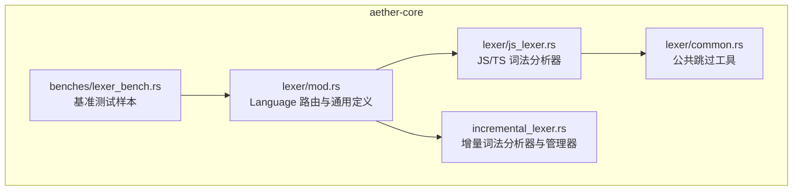
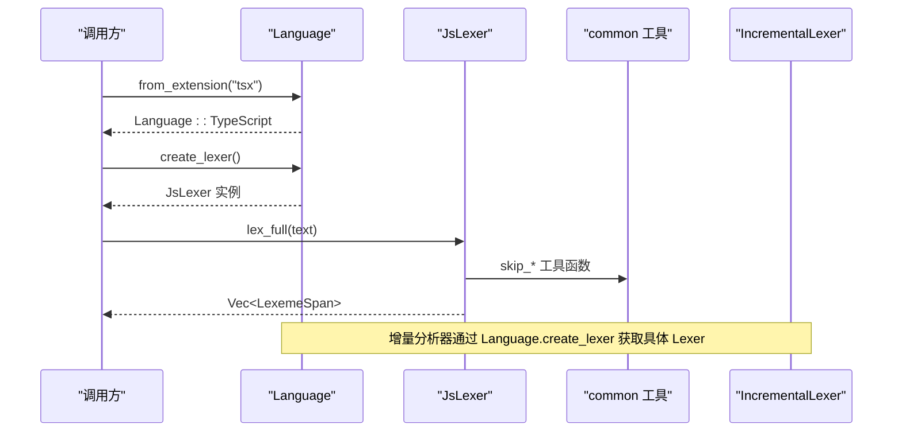
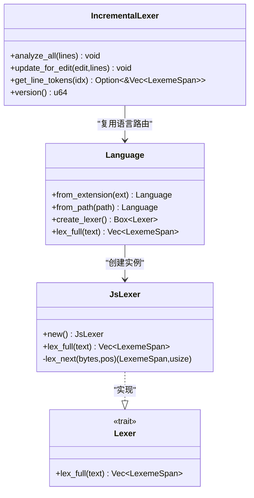
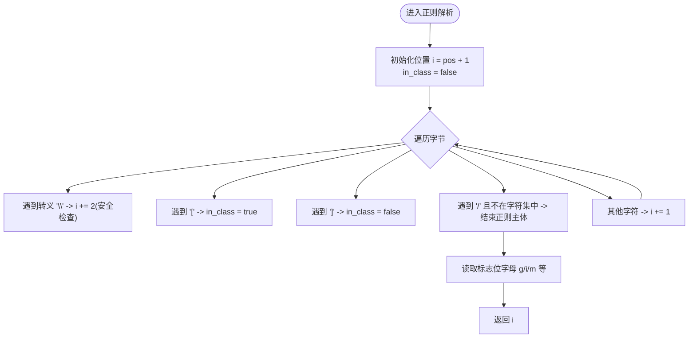
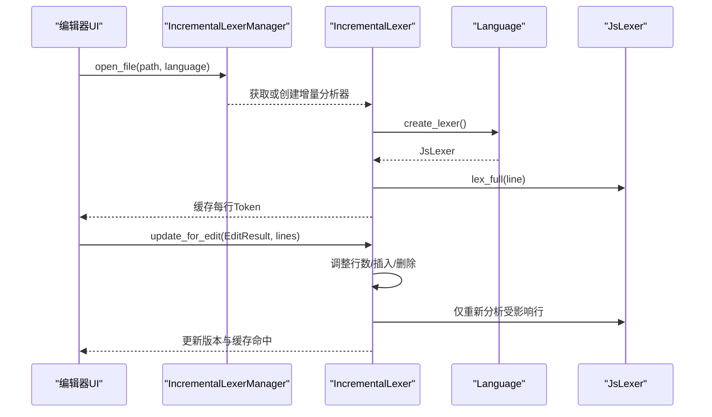
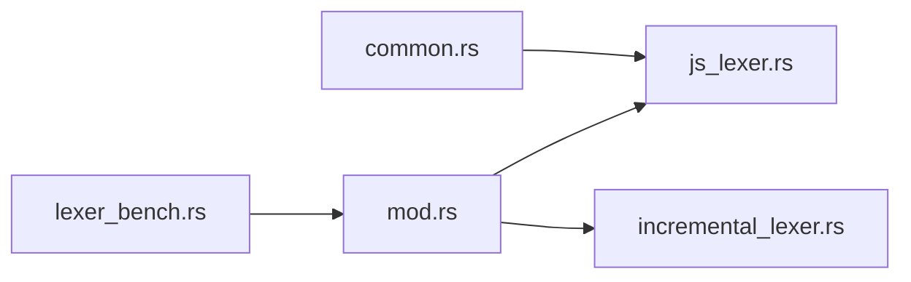

# JavaScript 词法分析器

<cite>
**本文引用的文件**
- [js_lexer.rs](file://crates/aether-core/src/lexer/js_lexer.rs)
- [mod.rs](file://crates/aether-core/src/lexer/mod.rs)
- [common.rs](file://crates/aether-core/src/lexer/common.rs)
- [incremental_lexer.rs](file://crates/aether-core/src/incremental_lexer.rs)
- [lib.rs](file://crates/aether-core/src/lib.rs)
- [lexer_bench.rs](file://crates/aether-core/benches/lexer_bench.rs)
</cite>

## 目录
1. [简介](#简介)
2. [项目结构](#项目结构)
3. [核心组件](#核心组件)
4. [架构总览](#架构总览)
5. [详细组件分析](#详细组件分析)
6. [依赖关系分析](#依赖关系分析)
7. [性能考量](#性能考量)
8. [故障排查指南](#故障排查指南)
9. [结论](#结论)
10. [附录](#附录)

## 简介
本技术文档聚焦于项目中 JavaScript（含 TypeScript）的词法分析实现，系统性说明现代语法特性的支持情况与实现方式，包括：
- 模板字符串、正则表达式字面量、箭头函数语法、解构赋值、展开运算符
- 可选链操作符、空值合并操作符、BigInt、Symbol、async/await 关键字
- JSX 语法的集成处理与 TypeScript 类型兼容支持
- ES6+ 新特性与向后兼容性考虑
- 增量式词法分析在编辑器中的使用方式

该词法分析器以高性能为目标，采用字节级扫描与静态分发策略，避免不必要的分配与动态派发开销，同时为高亮、语义分析等上层能力提供稳定可靠的 Token 流。

## 项目结构
JavaScript 词法分析相关代码位于 aether-core 的 lexer 模块中，并通过 Language 枚举进行语言路由与实例化。增量词法分析器将每行 Token 缓存，配合编辑事件仅重算受影响行，提升交互性能。

图表来源
- [mod.rs:145-182](file://crates/aether-core/src/lexer/mod.rs#L145-L182)
- [js_lexer.rs:1-20](file://crates/aether-core/src/lexer/js_lexer.rs#L1-L20)
- [common.rs:1-20](file://crates/aether-core/src/lexer/common.rs#L1-L20)
- [incremental_lexer.rs:1-30](file://crates/aether-core/src/incremental_lexer.rs#L1-L30)
- [lexer_bench.rs:1-10](file://crates/aether-core/benches/lexer_bench.rs#L1-L10)

章节来源
- [lib.rs:1-12](file://crates/aether-core/src/lib.rs#L1-L12)
- [mod.rs:1-182](file://crates/aether-core/src/lexer/mod.rs#L1-L182)

## 核心组件
- 语言路由与统一接口
  - Language::from_extension/from_path 根据扩展名或路径选择语言
  - Language::create_lexer 返回具体语言的 Lexer 实例
  - Language::lex_full 直接调用对应语言的 lex_full，避免 Box 分配
- JS/TS 词法分析器 JsLexer
  - 实现 Lexer trait，提供 lex_full 全量分析
  - 内部按字节扫描，识别注释、字符串、数字、标识符、运算符、标点、正则、模板字符串等
  - 内置关键字与内置类型名匹配表，覆盖 async/await、Symbol、bigint 等
- 公共工具函数
  - skip_whitespace/skip_line_comment/skip_block_comment/skip_quoted 等
- 增量词法分析器 IncrementalLexer 与管理器 IncrementalLexerManager
  - 维护每行 Token 缓存，基于 EditResult 增量更新
  - 管理多文件的增量分析器，限制最大缓存数量

章节来源
- [mod.rs:79-182](file://crates/aether-core/src/lexer/mod.rs#L79-L182)
- [js_lexer.rs:1-280](file://crates/aether-core/src/lexer/js_lexer.rs#L1-L280)
- [common.rs:1-90](file://crates/aether-core/src/lexer/common.rs#L1-L90)
- [incremental_lexer.rs:1-130](file://crates/aether-core/src/incremental_lexer.rs#L1-L130)

## 架构总览
下图展示从语言路由到具体词法分析器的调用流程，以及增量分析器如何复用语言路由。

图表来源
- [mod.rs:145-182](file://crates/aether-core/src/lexer/mod.rs#L145-L182)
- [js_lexer.rs:260-274](file://crates/aether-core/src/lexer/js_lexer.rs#L260-L274)
- [common.rs:1-55](file://crates/aether-core/src/lexer/common.rs#L1-L55)
- [incremental_lexer.rs:28-34](file://crates/aether-core/src/incremental_lexer.rs#L28-L34)

## 详细组件分析

### JsLexer 类图与职责
JsLexer 负责将输入文本切分为 LexemeSpan 序列，涵盖以下关键能力：
- 注释：单行 // 与块注释 /* */
- 字符串：双引号与单引号，支持转义
- 模板字符串：反引号包裹，支持 ${...} 嵌套表达式
- 正则表达式字面量：上下文敏感识别，支持字符集与标志位
- 数字：十进制、十六进制、八进制、二进制、小数、指数、下划线分隔、BigInt 后缀 n
- 标识符与关键字：包含 async/await、static、get/set、of/from/as 等
- 内置类型名：Symbol、Promise、Map/Set、Record/Partial/Pick/Omit 等 TS 常用类型
- 运算符：包括 ??、??=、?.、>>>、**= 等现代运算符
- 标点与未知字符：括号、逗号、分号、冒号、点、问号；UTF-8 安全推进

图表来源
- [js_lexer.rs:1-280](file://crates/aether-core/src/lexer/js_lexer.rs#L1-L280)
- [mod.rs:1-182](file://crates/aether-core/src/lexer/mod.rs#L1-L182)
- [incremental_lexer.rs:1-130](file://crates/aether-core/src/incremental_lexer.rs#L1-L130)

章节来源
- [js_lexer.rs:1-778](file://crates/aether-core/src/lexer/js_lexer.rs#L1-L778)

### 现代语法特性支持与实现要点

#### 模板字符串
- 识别反引号起始，进入模板字符串解析
- 正确处理转义字符与 ${...} 表达式，支持嵌套模板字符串
- 输出 TokenKind::FormatString

示例参考路径
- [js_lexer.rs:154-165](file://crates/aether-core/src/lexer/js_lexer.rs#L154-L165)
- [js_lexer.rs:421-446](file://crates/aether-core/src/lexer/js_lexer.rs#L421-L446)
- [js_lexer.rs:652-658](file://crates/aether-core/src/lexer/js_lexer.rs#L652-L658)

#### 正则表达式字面量
- 上下文敏感识别：当 / 出现在特定上下文（如 (、[、,、=、:、;、!、&、|、?、{、}、换行、~）时视为正则
- 支持字符集 [ ]、转义、结束斜杠后的标志位（g、i、m 等）
- 输出 TokenKind::RegexLiteral

示例参考路径
- [js_lexer.rs:77-140](file://crates/aether-core/src/lexer/js_lexer.rs#L77-L140)
- [js_lexer.rs:448-473](file://crates/aether-core/src/lexer/js_lexer.rs#L448-L473)
- [js_lexer.rs:660-669](file://crates/aether-core/src/lexer/js_lexer.rs#L660-L669)

#### 箭头函数语法
- 箭头函数由标识符、参数列表、=> 组成，其中 => 被识别为 Operator
- 参数解构与默认值属于标识符与标点范畴，无需特殊处理
- 示例参考路径
  - [lexer_bench.rs:50-69](file://crates/aether-core/benches/lexer_bench.rs#L50-L69)

#### 解构赋值与展开运算符
- 解构赋值涉及 {}、[]、,、: 等标点，已作为 Punctuation 识别
- 展开运算符 ... 由三个连续的 . 构成，分别作为 Punctuation 输出，后续可结合语法分析器进行语义判断
- 示例参考路径
  - [js_lexer.rs:234-242](file://crates/aether-core/src/lexer/js_lexer.rs#L234-L242)

#### 可选链操作符与空值合并操作符
- ?. 作为 Operator 识别，用于可选链访问
- ?? 与 ??= 作为 Operator 识别，用于空值合并与赋值
- 示例参考路径
  - [js_lexer.rs:621-632](file://crates/aether-core/src/lexer/js_lexer.rs#L621-L632)
  - [js_lexer.rs:709-716](file://crates/aether-core/src/lexer/js_lexer.rs#L709-L716)

#### BigInt 与 Symbol
- 数字解析支持 n 后缀，识别 BigInt 字面量
- Symbol 作为内置类型名识别，便于高亮与语义提示
- 示例参考路径
  - [js_lexer.rs:516-524](file://crates/aether-core/src/lexer/js_lexer.rs#L516-L524)
  - [js_lexer.rs:367-369](file://crates/aether-core/src/lexer/js_lexer.rs#L367-369)

#### async/await 关键字
- 关键字表中包含 async 与 await，识别为 Keyword
- 示例参考路径
  - [js_lexer.rs:318-320](file://crates/aether-core/src/lexer/js_lexer.rs#L318-L320)

#### JSX 语法集成与 TypeScript 类型兼容
- 文件扩展名 tsx 映射为 Language::TypeScript，使用 JsLexer 进行词法分析
- JSX 标签与属性由 <、>、/、标识符、字符串等基础 Token 组成，词法层不解析语义，交由树形分析器或渲染层处理
- TypeScript 类型注解（如 number、string、Record、Partial、Pick、Omit、keyof、unique、symbol、bigint、asserts 等）作为 TypeName 识别
- 示例参考路径
  - [mod.rs:110-112](file://crates/aether-core/src/lexer/mod.rs#L110-L112)
  - [js_lexer.rs:389-418](file://crates/aether-core/src/lexer/js_lexer.rs#L389-L418)
  - [lexer_bench.rs:64-69](file://crates/aether-core/benches/lexer_bench.rs#L64-L69)

#### ES6+ 新特性与向后兼容
- 支持 let、const、class、extends、import/export、yield、static、get/set、of/from/as 等关键字
- 支持 **=、===、!==、>>>、??、??=、?. 等新运算符
- 对旧版语法保持兼容，未识别的字符按 UTF-8 完整字符推进，避免中文/emoji 导致高亮错位
- 示例参考路径
  - [js_lexer.rs:282-355](file://crates/aether-core/src/lexer/js_lexer.rs#L282-L355)
  - [js_lexer.rs:536-637](file://crates/aether-core/src/lexer/js_lexer.rs#L536-L637)
  - [js_lexer.rs:243-256](file://crates/aether-core/src/lexer/js_lexer.rs#L243-L256)

### 正则表达式解析流程图

图表来源
- [js_lexer.rs:448-473](file://crates/aether-core/src/lexer/js_lexer.rs#L448-L473)

### 增量词法分析器工作流

图表来源
- [incremental_lexer.rs:18-101](file://crates/aether-core/src/incremental_lexer.rs#L18-L101)
- [mod.rs:145-182](file://crates/aether-core/src/lexer/mod.rs#L145-L182)

章节来源
- [incremental_lexer.rs:1-301](file://crates/aether-core/src/incremental_lexer.rs#L1-L301)

## 依赖关系分析
- JsLexer 依赖 common 工具函数进行通用跳过逻辑
- Language 统一管理各语言 Lexer 的创建与静态分发
- IncrementalLexer 通过 Language 获取具体 Lexer，并缓存每行结果
- 基准测试使用 Language.lex_full 对 JS/TS 样本进行性能评估

图表来源
- [js_lexer.rs:1-20](file://crates/aether-core/src/lexer/js_lexer.rs#L1-L20)
- [mod.rs:145-182](file://crates/aether-core/src/lexer/mod.rs#L145-L182)
- [incremental_lexer.rs:28-34](file://crates/aether-core/src/incremental_lexer.rs#L28-L34)
- [lexer_bench.rs:136-158](file://crates/aether-core/benches/lexer_bench.rs#L136-L158)

章节来源
- [mod.rs:184-192](file://crates/aether-core/src/lexer/mod.rs#L184-L192)
- [incremental_lexer.rs:131-193](file://crates/aether-core/src/incremental_lexer.rs#L131-L193)

## 性能考量
- 静态分发：Language::lex_full 直接调用具体 Lexer 的 lex_full，避免 Box 分配与动态分发
- 字节级扫描：JsLexer 基于 &[u8] 进行高效扫描，减少字符串拷贝
- 增量缓存：IncrementalLexer 按行缓存 Token，编辑后仅重算受影响行，显著降低重复计算
- 基准测试：提供 JS/TS 样本，覆盖正则、模板字符串、箭头函数、JSX 片段等常见场景

章节来源
- [mod.rs:165-182](file://crates/aether-core/src/lexer/mod.rs#L165-L182)
- [js_lexer.rs:260-274](file://crates/aether-core/src/lexer/js_lexer.rs#L260-L274)
- [incremental_lexer.rs:36-101](file://crates/aether-core/src/incremental_lexer.rs#L36-L101)
- [lexer_bench.rs:45-71](file://crates/aether-core/benches/lexer_bench.rs#L45-L71)

## 故障排查指南
- 正则误判为除号
  - 现象：a / b 被识别为两个运算符而非正则
  - 原因：上下文检测需确保前一个非空白字符符合正则上下文条件
  - 参考路径
    - [js_lexer.rs:77-140](file://crates/aether-core/src/lexer/js_lexer.rs#L77-L140)
    - [js_lexer.rs:741-752](file://crates/aether-core/src/lexer/js_lexer.rs#L741-L752)
- 模板字符串嵌套异常
  - 现象：嵌套模板字符串未被正确识别为一个 FormatString
  - 原因：${...} 深度计数需正确维护，避免提前终止
  - 参考路径
    - [js_lexer.rs:421-446](file://crates/aether-core/src/lexer/js_lexer.rs#L421-L446)
    - [js_lexer.rs:767-776](file://crates/aether-core/src/lexer/js_lexer.rs#L767-L776)
- 中文/Emoji 高亮错位
  - 现象：非 ASCII 字符被拆散导致高亮偏移
  - 原因：未知字符需按完整 UTF-8 长度推进
  - 参考路径
    - [js_lexer.rs:243-256](file://crates/aether-core/src/lexer/js_lexer.rs#L243-L256)
    - [mod.rs:223-233](file://crates/aether-core/src/lexer/mod.rs#L223-L233)
- 增量缓存不一致
  - 现象：编辑后某行 Token 未更新
  - 原因：受影响的行范围计算错误或未触发重算
  - 参考路径
    - [incremental_lexer.rs:43-101](file://crates/aether-core/src/incremental_lexer.rs#L43-L101)

章节来源
- [js_lexer.rs:741-776](file://crates/aether-core/src/lexer/js_lexer.rs#L741-L776)
- [mod.rs:223-233](file://crates/aether-core/src/lexer/mod.rs#L223-L233)
- [incremental_lexer.rs:43-101](file://crates/aether-core/src/incremental_lexer.rs#L43-L101)

## 结论
该 JavaScript/TypeScript 词法分析器在保持高性能的同时，全面覆盖了现代语法特性与常见扩展（JSX、TS 类型）。通过静态分发、字节级扫描与增量缓存，实现了低延迟的交互式体验。对于更复杂的语义需求（如 JSX 结构、TS 类型推导），建议结合 Tree-sitter 或其他语法分析器进行分层处理。

## 附录
- 关键字与内置类型名清单
  - 关键字：break/case/catch/class/const/continue/debugger/default/delete/do/else/export/extends/finally/for/function/if/import/in/instanceof/let/new/return/super/switch/this/throw/try/typeof/var/void/while/with/yield/async/await/static/get/set/of/from/as/enum/implements/interface/package/private/protected/public/abstract/boolean/byte/char/double/final/float/goto/int/long/native/short/synchronized/throws/transient/volatile/null/true/false/undefined
  - 内置类型名：Array/Object/String/Number/Boolean/Date/RegExp/Function/Symbol/Error/Map/Set/WeakMap/WeakSet/Promise/Proxy/Reflect/JSON/Math/console/window/document/globalThis/require/module/exports/Buffer/process/EventEmitter/string/number/boolean/any/unknown/never/void/object/Record/Partial/Required/Pick/Omit/Exclude/Extract/ReturnType/Parameters/Readonly/interface/type/namespace/declare/global/infer/keyof/unique/symbol/bigint/asserts
- 示例代码路径
  - JS/TS 基准样本（含正则、模板字符串、箭头函数、JSX）
    - [lexer_bench.rs:45-71](file://crates/aether-core/benches/lexer_bench.rs#L45-L71)

章节来源
- [js_lexer.rs:282-418](file://crates/aether-core/src/lexer/js_lexer.rs#L282-L418)
- [lexer_bench.rs:45-71](file://crates/aether-core/benches/lexer_bench.rs#L45-L71)