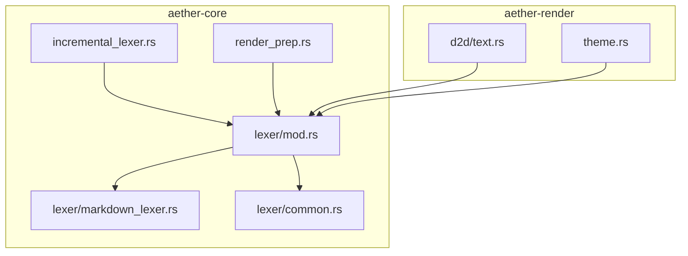
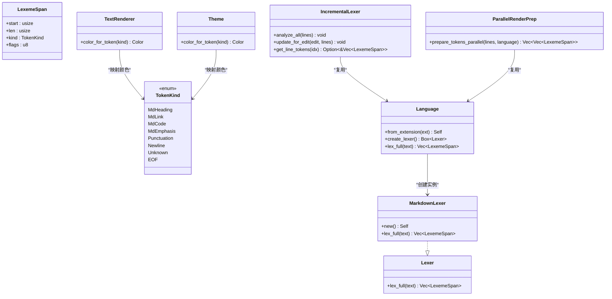
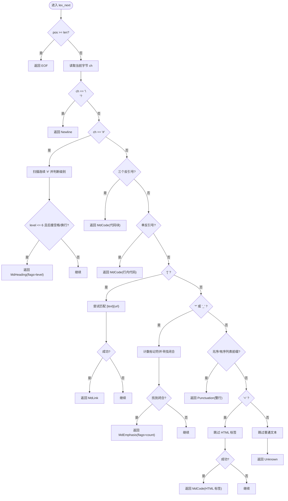
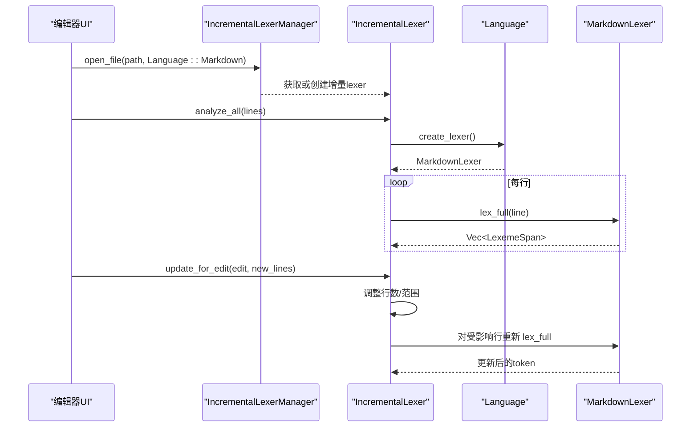
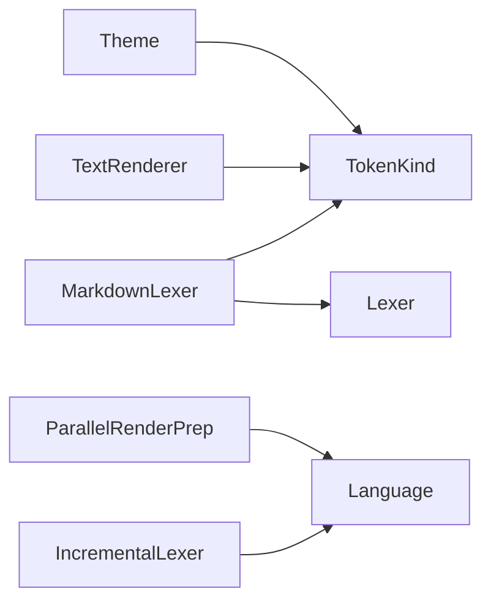

# Markdown 词法分析器

<cite>
**本文引用的文件**
- [crates/aether-core/src/lexer/markdown_lexer.rs](file://crates/aether-core/src/lexer/markdown_lexer.rs)
- [crates/aether-core/src/lexer/mod.rs](file://crates/aether-core/src/lexer/mod.rs)
- [crates/aether-core/src/lexer/common.rs](file://crates/aether-core/src/lexer/common.rs)
- [crates/aether-core/src/incremental_lexer.rs](file://crates/aether-core/src/incremental_lexer.rs)
- [crates/aether-core/src/render_prep.rs](file://crates/aether-core/src/render_prep.rs)
- [crates/aether-render/src/d2d/text.rs](file://crates/aether-render/src/d2d/text.rs)
- [crates/aether-render/src/theme.rs](file://crates/aether-render/src/theme.rs)
</cite>

## 目录
1. [简介](#简介)
2. [项目结构](#项目结构)
3. [核心组件](#核心组件)
4. [架构总览](#架构总览)
5. [详细组件分析](#详细组件分析)
6. [依赖关系分析](#依赖关系分析)
7. [性能考量](#性能考量)
8. [故障排查指南](#故障排查指南)
9. [结论](#结论)
10. [附录](#附录)

## 简介
本技术文档聚焦于仓库中的 Markdown 词法分析器，系统性说明其语法识别能力、实现细节与渲染集成方式。内容覆盖：
- 标题、段落、列表、链接、图片（通过内联链接）、代码块、引用、HTML 标签混合支持等元素的识别策略
- 内联格式如粗体、斜体的处理逻辑
- GFM 扩展语法的现状与边界
- 增量词法分析与并行预处理在渲染上下文中的应用
- 嵌套结构与上下文处理的实践建议

## 项目结构
Markdown 词法分析相关代码位于 aether-core 的 lexer 模块中，并通过 Language 枚举统一接入多语言词法体系；增量词法与渲染预处理器位于同 crate 的其他模块；渲染层将 TokenKind 映射到主题颜色。



图表来源
- [crates/aether-core/src/lexer/mod.rs:1-182](file://crates/aether-core/src/lexer/mod.rs#L1-L182)
- [crates/aether-core/src/lexer/markdown_lexer.rs:1-209](file://crates/aether-core/src/lexer/markdown_lexer.rs#L1-L209)
- [crates/aether-core/src/lexer/common.rs:1-151](file://crates/aether-core/src/lexer/common.rs#L1-L151)
- [crates/aether-core/src/incremental_lexer.rs:1-130](file://crates/aether-core/src/incremental_lexer.rs#L1-L130)
- [crates/aether-core/src/render_prep.rs:1-67](file://crates/aether-core/src/render_prep.rs#L1-L67)
- [crates/aether-render/src/d2d/text.rs:240-253](file://crates/aether-render/src/d2d/text.rs#L240-L253)
- [crates/aether-render/src/theme.rs:260-276](file://crates/aether-render/src/theme.rs#L260-L276)

章节来源
- [crates/aether-core/src/lexer/mod.rs:1-182](file://crates/aether-core/src/lexer/mod.rs#L1-L182)
- [crates/aether-core/src/lexer/markdown_lexer.rs:1-209](file://crates/aether-core/src/lexer/markdown_lexer.rs#L1-L209)

## 核心组件
- 通用词法接口与 Token 类型
  - Lexer trait 定义 lex_full 方法，返回 Vec<LexemeSpan>
  - TokenKind 包含 MdHeading、MdLink、MdCode、MdEmphasis 等 Markdown 专用 token
  - LexemeSpan 携带 start、len、kind、flags，用于定位与语义标注
- Markdown 词法分析器
  - MarkdownLexer 基于字节扫描，按优先级识别标题、代码块/行内代码、链接、强调、列表、HTML 标签与普通文本
  - 使用 flags 字段传递额外信息（例如标题层级）
- 增量词法与渲染预处理
  - IncrementalLexer 缓存每行 token，编辑后仅重算受影响行
  - ParallelRenderPrep 对可见行进行并行预处理，减少首帧延迟
- 渲染层映射
  - d2d/text.rs 与 theme.rs 将 TokenKind 映射为具体颜色，完成高亮显示

章节来源
- [crates/aether-core/src/lexer/mod.rs:1-182](file://crates/aether-core/src/lexer/mod.rs#L1-L182)
- [crates/aether-core/src/lexer/markdown_lexer.rs:1-209](file://crates/aether-core/src/lexer/markdown_lexer.rs#L1-L209)
- [crates/aether-core/src/incremental_lexer.rs:1-130](file://crates/aether-core/src/incremental_lexer.rs#L1-L130)
- [crates/aether-core/src/render_prep.rs:1-67](file://crates/aether-core/src/render_prep.rs#L1-L67)
- [crates/aether-render/src/d2d/text.rs:240-253](file://crates/aether-render/src/d2d/text.rs#L240-L253)
- [crates/aether-render/src/theme.rs:260-276](file://crates/aether-render/src/theme.rs#L260-L276)

## 架构总览
Markdown 词法分析器在多语言框架下运行，Language 枚举负责创建对应语言的 Lexer，并在渲染阶段由主题系统解析 TokenKind 为颜色。



图表来源
- [crates/aether-core/src/lexer/mod.rs:1-182](file://crates/aether-core/src/lexer/mod.rs#L1-L182)
- [crates/aether-core/src/lexer/markdown_lexer.rs:1-209](file://crates/aether-core/src/lexer/markdown_lexer.rs#L1-L209)
- [crates/aether-core/src/incremental_lexer.rs:1-130](file://crates/aether-core/src/incremental_lexer.rs#L1-L130)
- [crates/aether-core/src/render_prep.rs:1-67](file://crates/aether-core/src/render_prep.rs#L1-L67)
- [crates/aether-render/src/d2d/text.rs:240-253](file://crates/aether-render/src/d2d/text.rs#L240-L253)
- [crates/aether-render/src/theme.rs:260-276](file://crates/aether-render/src/theme.rs#L260-L276)

## 详细组件分析

### Markdown 词法分析器（MarkdownLexer）
- 设计要点
  - 逐字符扫描，优先匹配具有强结构的标记（标题、代码、链接、强调），其余归为普通文本或标点
  - 使用 flags 承载元数据（如标题层级）
  - 对未闭合的强调采用保守策略：仅消耗开放标记，避免整行误判
- 关键识别规则
  - 标题：以 # 开头，连续 # 数量作为级别，后接空格或换行
  - 代码块/行内代码：三个反引号作为代码块标记；单个反引号为行内代码
  - 链接：[text](url) 模式
  - 强调：* 或 _ 包裹，支持 1-3 个标记符，flags 记录重复次数
  - 列表：无序（-、*、+ 后跟空格）与有序（数字后跟 . 和空格）
  - HTML 标签：<tag...> 整体视为一段代码类 token
  - 普通文本：默认分支，吞掉非特殊字符序列
- 复杂度与边界
  - 时间复杂度近似 O(n)，n 为输入长度
  - 边界处理包括：未闭合强调、行尾截断、非法 UTF-8 首字节（由公共工具保证前进）



图表来源
- [crates/aether-core/src/lexer/markdown_lexer.rs:11-192](file://crates/aether-core/src/lexer/markdown_lexer.rs#L11-L192)

章节来源
- [crates/aether-core/src/lexer/markdown_lexer.rs:11-192](file://crates/aether-core/src/lexer/markdown_lexer.rs#L11-L192)

#### 内联格式与嵌套结构处理
- 强调（粗体/斜体）
  - 支持 * 与 _ 两种分隔符，count 记录重复次数（1-3）
  - 遇到换行未闭合时，仅消耗开放标记，避免整行被错误标记
- 链接
  - 严格匹配 [text](url) 模式，若缺少 ) 则回退为普通文本
- 代码
  - 行内代码以 ` 开始，直到下一个 ` 结束
  - 代码块以 ``` 开始，整行作为 MdCode
- 列表
  - 无序：-、*、+ 后跟空格即视为列表项起始
  - 有序：数字序列后跟 . 和空格
- HTML 混合
  - <tag...> 整体作为 MdCode 输出，便于后续渲染区分

章节来源
- [crates/aether-core/src/lexer/markdown_lexer.rs:104-179](file://crates/aether-core/src/lexer/markdown_lexer.rs#L104-L179)
- [crates/aether-core/src/lexer/markdown_lexer.rs:259-311](file://crates/aether-core/src/lexer/markdown_lexer.rs#L259-L311)

#### 表格、数学公式与 GFM 扩展
- 表格
  - 当前实现未提供专门的表格识别；表格行会被解析为普通文本或标点
- 数学公式
  - 未提供 $...$ 或 $$...$$ 的识别
- GFM 扩展
  - 未实现删除线 ~~text~~、任务列表、脚注、自动链接等扩展语法
  - 测试用例中包含 ~~strike~~ 的断言，但实际实现并未将其识别为 MdEmphasis，属于测试与实现的差异点

章节来源
- [crates/aether-core/src/lexer/markdown_lexer.rs:338-470](file://crates/aether-core/src/lexer/markdown_lexer.rs#L338-L470)

### 增量词法分析器（IncrementalLexer）
- 功能
  - 维护每行的 token 缓存，编辑后仅重算受影响行
  - 管理多个文件的增量分析器，支持打开、关闭、切换文件
- 适用场景
  - 大文档实时高亮，降低首帧与编辑时的卡顿
- 数据结构
  - line_tokens: Vec<Vec<LexemeSpan>>，行索引直接作为数组索引，O(1) 访问
  - version: 用于失效检测



图表来源
- [crates/aether-core/src/incremental_lexer.rs:18-130](file://crates/aether-core/src/incremental_lexer.rs#L18-L130)
- [crates/aether-core/src/lexer/mod.rs:144-182](file://crates/aether-core/src/lexer/mod.rs#L144-L182)
- [crates/aether-core/src/lexer/markdown_lexer.rs:195-209](file://crates/aether-core/src/lexer/markdown_lexer.rs#L195-L209)

章节来源
- [crates/aether-core/src/incremental_lexer.rs:18-130](file://crates/aether-core/src/incremental_lexer.rs#L18-L130)

### 并行渲染预处理（ParallelRenderPrep）
- 功能
  - 对可见行进行并行 token 预处理，小行数自动回退单线程
- 优势
  - 利用 rayon 线程池，避免频繁创建销毁线程的开销
- 适用场景
  - 首次渲染或滚动加载大量行时提升性能

章节来源
- [crates/aether-core/src/render_prep.rs:1-67](file://crates/aether-core/src/render_prep.rs#L1-L67)

### 渲染层映射（TokenKind -> 颜色）
- d2d/text.rs 与 theme.rs 将 MdHeading、MdLink、MdCode、MdEmphasis 映射为不同颜色
- 主题系统允许自定义各 token 的颜色，适配暗色/玻璃主题

章节来源
- [crates/aether-render/src/d2d/text.rs:240-253](file://crates/aether-render/src/d2d/text.rs#L240-L253)
- [crates/aether-render/src/theme.rs:260-276](file://crates/aether-render/src/theme.rs#L260-L276)

## 依赖关系分析
- 内部依赖
  - MarkdownLexer 依赖 Lexer trait 与 TokenKind/LexemeSpan
  - IncrementalLexer 与 ParallelRenderPrep 依赖 Language 工厂方法
  - 渲染层依赖 TokenKind 进行颜色映射
- 外部依赖
  - rayon 用于并行预处理
- 耦合与内聚
  - MarkdownLexer 与通用工具函数解耦良好，易于扩展新语法
  - Language 集中管理 Lexer 创建，降低调用方耦合



图表来源
- [crates/aether-core/src/lexer/mod.rs:1-182](file://crates/aether-core/src/lexer/mod.rs#L1-L182)
- [crates/aether-core/src/lexer/markdown_lexer.rs:1-209](file://crates/aether-core/src/lexer/markdown_lexer.rs#L1-L209)
- [crates/aether-core/src/incremental_lexer.rs:1-130](file://crates/aether-core/src/incremental_lexer.rs#L1-L130)
- [crates/aether-core/src/render_prep.rs:1-67](file://crates/aether-core/src/render_prep.rs#L1-L67)
- [crates/aether-render/src/d2d/text.rs:240-253](file://crates/aether-render/src/d2d/text.rs#L240-L253)
- [crates/aether-render/src/theme.rs:260-276](file://crates/aether-render/src/theme.rs#L260-L276)

章节来源
- [crates/aether-core/src/lexer/mod.rs:1-182](file://crates/aether-core/src/lexer/mod.rs#L1-L182)
- [crates/aether-core/src/lexer/markdown_lexer.rs:1-209](file://crates/aether-core/src/lexer/markdown_lexer.rs#L1-L209)

## 性能考量
- 时间复杂度
  - MarkdownLexer 线性扫描，近似 O(n)
- 内存布局
  - IncrementalLexer 使用 Vec 存储每行 token，连续内存，缓存命中率高
- 并行化
  - ParallelRenderPrep 对小文件回退单线程，避免线程开销；大文件并行 map-reduce
- 建议
  - 对于超长行或复杂嵌套，可考虑引入状态机或更严格的上下文检查，以减少回溯
  - 针对 GFM 扩展（如表格、任务列表）可在保持 O(n) 的前提下增加有限状态机

章节来源
- [crates/aether-core/src/incremental_lexer.rs:1-130](file://crates/aether-core/src/incremental_lexer.rs#L1-L130)
- [crates/aether-core/src/render_prep.rs:1-67](file://crates/aether-core/src/render_prep.rs#L1-L67)

## 故障排查指南
- 常见问题
  - 未闭合强调导致整行误标：当前实现已保守处理，仅消耗开放标记；若仍出现异常，检查输入是否包含换行
  - 链接不完整：缺少 ) 会回退为普通文本，确认 URL 括号完整
  - HTML 标签识别失败：确保标签名合法且存在 > 闭合
- 调试建议
  - 打印 LexemeSpan 的 kind 与 flags，验证标题层级与强调计数
  - 使用 IncrementalLexer 的版本号检测缓存失效是否正确触发
  - 对比 d2d/text.rs 与 theme.rs 的颜色映射，确认渲染层配置一致

章节来源
- [crates/aether-core/src/lexer/markdown_lexer.rs:259-311](file://crates/aether-core/src/lexer/markdown_lexer.rs#L259-L311)
- [crates/aether-core/src/incremental_lexer.rs:114-129](file://crates/aether-core/src/incremental_lexer.rs#L114-L129)
- [crates/aether-render/src/d2d/text.rs:240-253](file://crates/aether-render/src/d2d/text.rs#L240-L253)
- [crates/aether-render/src/theme.rs:260-276](file://crates/aether-render/src/theme.rs#L260-L276)

## 结论
该 Markdown 词法分析器在多语言框架下提供了高效、可扩展的语法识别能力，覆盖了标题、代码、链接、强调、列表、HTML 标签等常用元素，并通过增量与并行机制保障渲染性能。当前版本未实现表格、数学公式与部分 GFM 扩展，可通过有限状态机与上下文检查逐步增强，同时保持线性时间与低内存占用。

## 附录

### 支持的 Markdown 语法与 Token 映射
- 标题：MdHeading（flags 表示层级）
- 代码块/行内代码：MdCode
- 链接：MdLink
- 强调：MdEmphasis（flags 表示标记重复次数）
- 列表：Punctuation（整行）
- HTML 标签：MdCode
- 普通文本：Unknown
- 换行：Newline

章节来源
- [crates/aether-core/src/lexer/mod.rs:48-68](file://crates/aether-core/src/lexer/mod.rs#L48-L68)
- [crates/aether-core/src/lexer/markdown_lexer.rs:39-192](file://crates/aether-core/src/lexer/markdown_lexer.rs#L39-L192)

### 渲染上下文示例路径
- 颜色映射入口
  - [crates/aether-render/src/d2d/text.rs:240-253](file://crates/aether-render/src/d2d/text.rs#L240-L253)
  - [crates/aether-render/src/theme.rs:260-276](file://crates/aether-render/src/theme.rs#L260-L276)
- 增量与并行预处理
  - [crates/aether-core/src/incremental_lexer.rs:18-130](file://crates/aether-core/src/incremental_lexer.rs#L18-L130)
  - [crates/aether-core/src/render_prep.rs:32-61](file://crates/aether-core/src/render_prep.rs#L32-L61)