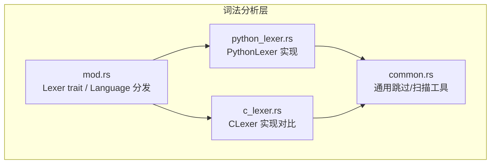
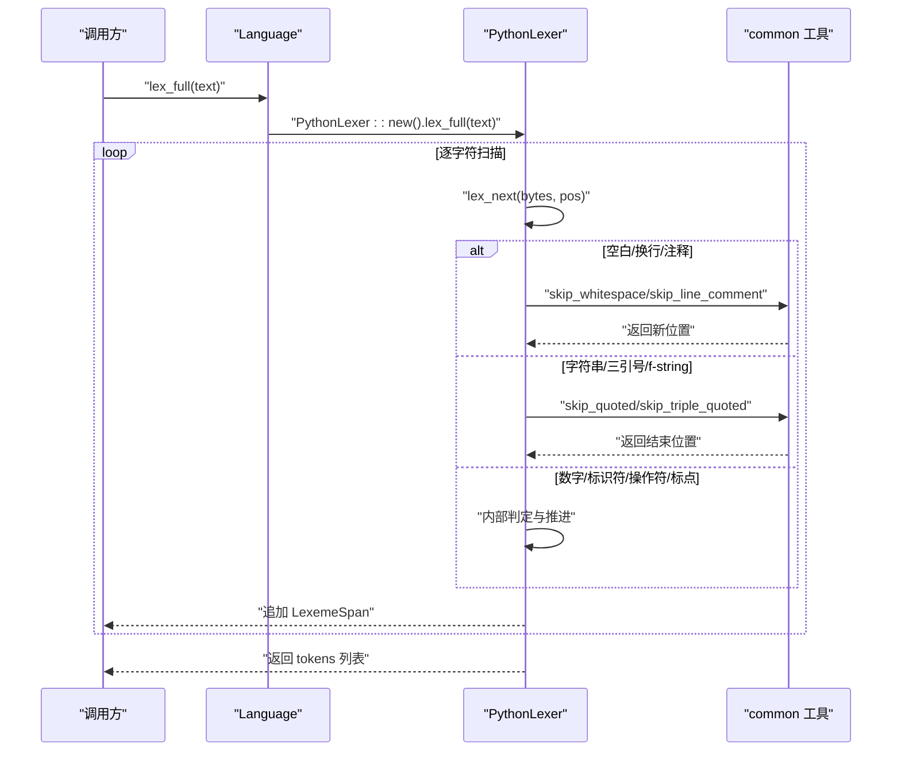
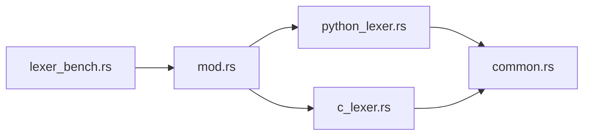

# Python 词法分析器

<cite>
**本文引用的文件**   
- [python_lexer.rs](file://crates/aether-core/src/lexer/python_lexer.rs)
- [mod.rs](file://crates/aether-core/src/lexer/mod.rs)
- [common.rs](file://crates/aether-core/src/lexer/common.rs)
- [c_lexer.rs](file://crates/aether-core/src/lexer/c_lexer.rs)
- [README.md](file://README.md)
- [lexer_bench.rs](file://crates/aether-core/benches/lexer_bench.rs)
</cite>

## 目录
1. [简介](#简介)
2. [项目结构](#项目结构)
3. [核心组件](#核心组件)
4. [架构总览](#架构总览)
5. [详细组件分析](#详细组件分析)
6. [依赖关系分析](#依赖关系分析)
7. [性能考量](#性能考量)
8. [疑难排查指南](#疑难排查指南)
9. [结论](#结论)
10. [附录](#附录)

## 简介
本技术文档聚焦于 Aether Studio 中的 Python 词法分析器实现，系统性解析其如何处理 Python 语言的独特语法特征与词法规则，包括：
- f-string 格式化字符串（含三引号形式）
- 三引号字符串字面量
- 关键字集合识别
- 内置函数/类型名识别
- 装饰器语法（@ 前缀）
- 异步相关关键字（async、await）
- 位运算符与复合赋值操作符
- 数字字面量（含下划线分隔、指数、虚数后缀）
- 注释与空白处理

同时对比 C 系语言在词法层面的根本差异，重点说明“缩进”在 Python 中作为语法元素的处理方式与当前实现的边界。

## 项目结构
Python 词法分析器位于 aether-core crate 的 lexer 模块中，采用统一 Lexer trait + 多语言具体实现的架构。相关文件组织如下：
- 公共接口与语言分发：[mod.rs](file://crates/aether-core/src/lexer/mod.rs)
- Python 专用实现：[python_lexer.rs](file://crates/aether-core/src/lexer/python_lexer.rs)
- 通用工具函数（跳过空白、注释、字符串等）：[common.rs](file://crates/aether-core/src/lexer/common.rs)
- C 语言实现（用于对比与回退）：[c_lexer.rs](file://crates/aether-core/src/lexer/c_lexer.rs)
- 基准测试样本（包含 Python 代码片段）：[lexer_bench.rs](file://crates/aether-core/benches/lexer_bench.rs)
- 项目概览与特性说明：[README.md](file://README.md)



图表来源
- [mod.rs:1-182](file://crates/aether-core/src/lexer/mod.rs#L1-L182)
- [python_lexer.rs:1-225](file://crates/aether-core/src/lexer/python_lexer.rs#L1-L225)
- [common.rs:1-90](file://crates/aether-core/src/lexer/common.rs#L1-L90)
- [c_lexer.rs:1-200](file://crates/aether-core/src/lexer/c_lexer.rs#L1-L200)

章节来源
- [mod.rs:1-182](file://crates/aether-core/src/lexer/mod.rs#L1-L182)
- [README.md:1-120](file://README.md#L1-L120)

## 核心组件
- TokenKind 枚举：跨语言统一的 token 类别，包含 Keyword、Identifier、StringLiteral、NumberLiteral、Operator、Punctuation、FormatString、Newline、Whitespace、Unknown、EOF 等。
- LexemeSpan：记录 token 的起始位置、长度、种类与标志位，便于上层高亮与编辑功能定位。
- Lexer trait：定义 lex_full(text) -> Vec<LexemeSpan> 的统一接口。
- Language：根据扩展名或路径选择对应语言，并创建具体 Lexer 实例或直接静态分发调用 lex_full。

Python 特有要点
- FormatString：f'...' 与 f"""...""" 均被识别为格式化字符串。
- TypeName：对常见内置类型/函数进行识别，如 int、str、len、print 等。
- Punctuation：@ 作为装饰器前缀被识别为标点符号，配合后续标识符完成装饰器语法的高亮。
- Newline：换行符单独成 token，便于上层基于缩进进行语义处理（当前词法层不解释缩进）。

章节来源
- [mod.rs:1-182](file://crates/aether-core/src/lexer/mod.rs#L1-L182)
- [python_lexer.rs:1-225](file://crates/aether-core/src/lexer/python_lexer.rs#L1-L225)

## 架构总览
下图展示了从语言检测到 Python 词法分析的调用链与数据流。



图表来源
- [mod.rs:165-182](file://crates/aether-core/src/lexer/mod.rs#L165-L182)
- [python_lexer.rs:205-219](file://crates/aether-core/src/lexer/python_lexer.rs#L205-L219)
- [common.rs:42-55](file://crates/aether-core/src/lexer/common.rs#L42-L55)

## 详细组件分析

### PythonLexer 主流程与状态机
PythonLexer 的核心是 lex_next 方法，按首字节分支进入不同处理路径：
- 空白与换行：空格、制表符、回车归为 Whitespace；换行单独为 Newline。
- 注释：以 # 开头的行注释，使用 skip_line_comment 推进到行尾。
- 字符串：
  - 单引号/双引号：使用 skip_quoted 支持转义。
  - 三引号：使用 skip_triple_quoted 匹配 """ 或 '''。
  - f-string：检测前缀 f/F 与引号组合，区分 FormatString 与 StringLiteral。
- 数字：支持整数、浮点、指数、虚数后缀 j/J，以及下划线分隔；特别防止 1..2 被合并为一个 token。
- 标识符：字母、数字、下划线组成；随后判断是否为关键字或内置类型名。
- 操作符：支持一元/二元及复合赋值（+=、-=、*=、**=、/=、//=、%=、==、!=、<=、>=、<<、>>、&=、|=、^=、-> 等）。
- 标点：括号、花括号、方括号、逗号、分号、冒号、点、问号、@ 等。
- 未知：UTF-8 字符按首字节推断长度，标记为 Unknown。

```mermaid
flowchart TD
Start(["进入 lex_next"]) --> CheckEmpty{"pos >= len?"}
CheckEmpty --> |是| ReturnEOF["返回 EOF"]
CheckEmpty --> |否| ReadCh["读取 bytes[pos]"]
ReadCh --> Branch{"分支判定"}
Branch --> |空白/回车| SkipWS["skip_whitespace"] --> EmitWS["输出 Whitespace"]
Branch --> |换行| EmitNL["输出 Newline"]
Branch --> |#| SkipLine["skip_line_comment"] --> EmitLC["输出 LineComment"]
Branch --> |"\" 或 "'"| QuoteCheck{"是否三引号?"}
QuoteCheck --> |是| Triple["skip_triple_quoted"] --> FStrCheck{"前缀 f/F ?"}
FStrCheck --> |是| EmitFS["输出 FormatString"]
FStrCheck --> |否| EmitSL["输出 StringLiteral"]
QuoteCheck --> |否| SingleQ["skip_quoted"] --> EmitSL
Branch --> |数字| Num["skip_number"] --> EmitNum["输出 NumberLiteral"]
Branch --> |标识符| Id["skip_identifier"] --> KeyOrBuiltin{"关键字/内置?"}
KeyOrBuiltin --> |关键字| EmitKW["输出 Keyword"]
KeyOrBuiltin --> |内置| EmitTN["输出 TypeName"]
KeyOrBuiltin --> |普通| EmitID["输出 Identifier"]
Branch --> |操作符| Op["skip_operator"] --> EmitOP["输出 Operator"]
Branch --> |标点| EmitPU["输出 Punctuation"]
Branch --> |其他| UTF8["utf8_char_len"] --> EmitUNK["输出 Unknown"]
EmitWS --> Next
EmitNL --> Next
EmitLC --> Next
EmitFS --> Next
EmitSL --> Next
EmitNum --> Next
EmitKW --> Next
EmitTN --> Next
EmitID --> Next
EmitOP --> Next
EmitPU --> Next
EmitUNK --> Next
Next(["更新 pos 并循环"]) --> End(["结束"])
```

图表来源
- [python_lexer.rs:12-202](file://crates/aether-core/src/lexer/python_lexer.rs#L12-L202)
- [common.rs:42-55](file://crates/aether-core/src/lexer/common.rs#L42-L55)

章节来源
- [python_lexer.rs:12-202](file://crates/aether-core/src/lexer/python_lexer.rs#L12-L202)

### 关键字与内置类型识别
- 关键字集合：False、None、True、and、as、assert、async、await、break、class、continue、def、del、elif、else、except、finally、for、from、global、if、import、in、is、lambda、nonlocal、not、or、pass、raise、return、try、while、with、yield。
- 内置类型/函数：int、float、str、bool、list、dict、tuple、set、frozenset、bytes、bytearray、memoryview、object、type、range、enumerate、zip、map、filter、len、print、input、open、super、self、Exception、BaseException、ValueError、TypeError、KeyError、IndexError。

这些集合通过 is_keyword_bytes 与 is_builtin_bytes 进行快速匹配，从而将标识符分类为 Keyword 或 TypeName。

章节来源
- [python_lexer.rs:227-303](file://crates/aether-core/src/lexer/python_lexer.rs#L227-L303)

### 字符串与 f-string 处理
- 单引号/双引号字符串：使用通用 skip_quoted，正确处理反斜杠转义与未闭合情况。
- 三引号字符串：使用 skip_triple_quoted 匹配连续三个相同引号。
- f-string：
  - 单引号/双引号：当首字符为 f/F 且紧跟引号时，整体视为 FormatString。
  - 三引号：若三引号前一个字节为 f/F，则视为 FormatString。
  
注意：三引号 f-string 的前缀位于引号之前（f"""..."""），而非引号之后。

章节来源
- [python_lexer.rs:61-116](file://crates/aether-core/src/lexer/python_lexer.rs#L61-L116)
- [python_lexer.rs:129-166](file://crates/aether-core/src/lexer/python_lexer.rs#L129-L166)
- [common.rs:42-55](file://crates/aether-core/src/lexer/common.rs#L42-L55)

### 数字字面量与范围操作符
- 支持整数、浮点数、指数表示（e/E）、虚数后缀（j/J）、下划线分隔。
- 特殊处理：遇到小数点后紧跟另一个点（如 1..2）时停止数字扫描，避免与范围操作符混淆。

章节来源
- [python_lexer.rs:324-355](file://crates/aether-core/src/lexer/python_lexer.rs#L324-L355)

### 操作符与复合赋值
- 支持基本算术、比较、逻辑、位移、取余、幂运算等。
- 复合赋值：+=、-=、*=、**=、/=、//=、%=、==、!=、<=、>=、<<、>>、&=、|=、^=。
- 箭头操作符：-> 用于函数签名返回类型注解。

章节来源
- [python_lexer.rs:366-435](file://crates/aether-core/src/lexer/python_lexer.rs#L366-L435)

### 装饰器语法（@）
- @ 被识别为标点符号（Punctuation），通常后接标识符或属性访问表达式，形成装饰器语法。
- 测试用例验证了多个装饰器的标点计数。

章节来源
- [python_lexer.rs:180-188](file://crates/aether-core/src/lexer/python_lexer.rs#L180-L188)
- [python_lexer.rs:451-459](file://crates/aether-core/src/lexer/python_lexer.rs#L451-L459)

### 异步关键字
- async、await 作为关键字被识别，可用于函数声明与异步表达式。

章节来源
- [python_lexer.rs:227-266](file://crates/aether-core/src/lexer/python_lexer.rs#L227-L266)

### 注释与空白
- 行注释：以 # 开头至行尾。
- 空白：空格、制表符、回车归为 Whitespace；换行单独为 Newline。

章节来源
- [python_lexer.rs:28-60](file://crates/aether-core/src/lexer/python_lexer.rs#L28-L60)
- [common.rs:6-12](file://crates/aether-core/src/lexer/common.rs#L6-L12)

### 与 C 系语言的根本差异：缩进作为语法元素
- C 系语言（如 C/C++/Rust）使用大括号界定作用域，缩进仅影响可读性；词法层无需关注缩进。
- Python 使用缩进表达块结构，换行与缩进变化具有语法意义。当前 PythonLexer 将换行符单独输出为 Newline token，但不解释缩进层级；缩进语义由上层（如 Tree-sitter 或编辑器高亮/补全）结合上下文处理。
- 对比 CLexer：C 语言词法层同样输出 Newline，但不会将其用于语法控制。

章节来源
- [python_lexer.rs:40-48](file://crates/aether-core/src/lexer/python_lexer.rs#L40-L48)
- [c_lexer.rs:40-48](file://crates/aether-core/src/lexer/c_lexer.rs#L40-L48)

## 依赖关系分析
- PythonLexer 依赖 common 工具函数进行通用扫描（空白、注释、字符串等）。
- Language 根据扩展名创建 PythonLexer 实例或直接调用其 lex_full。
- 测试与基准使用 Language.lex_full 进行端到端验证。



图表来源
- [mod.rs:145-182](file://crates/aether-core/src/lexer/mod.rs#L145-L182)
- [python_lexer.rs:1-10](file://crates/aether-core/src/lexer/python_lexer.rs#L1-L10)
- [common.rs:1-90](file://crates/aether-core/src/lexer/common.rs#L1-L90)
- [lexer_bench.rs:136-158](file://crates/aether-core/benches/lexer_bench.rs#L136-L158)

章节来源
- [mod.rs:145-182](file://crates/aether-core/src/lexer/mod.rs#L145-L182)
- [lexer_bench.rs:136-158](file://crates/aether-core/benches/lexer_bench.rs#L136-L158)

## 性能考量
- 词法分析采用字节级扫描与一次性分配策略，避免频繁内存分配。
- 基准测试覆盖 Rust、JS、Python、C 四种语言，Python 样本包含类型注解、类与方法定义等典型结构。
- README 指出 Lexer 性能基准约 500–650 MiB/s，体现高效实现。

章节来源
- [README.md:113-121](file://README.md#L113-L121)
- [lexer_bench.rs:73-102](file://crates/aether-core/benches/lexer_bench.rs#L73-L102)
- [lexer_bench.rs:136-158](file://crates/aether-core/benches/lexer_bench.rs#L136-L158)

## 疑难排查指南
- f-string 未被识别为 FormatString：
  - 检查前缀是否为小写 f 或大写 F，且紧邻引号（单引号/双引号/三引号）。
  - 三引号 f-string 的前缀必须在引号之前（f"""..."""）。
- 三引号字符串未正确闭合：
  - 确认存在匹配的三引号结尾；未闭合将被吞到文本末尾。
- 数字与范围操作符冲突：
  - 1..2 会被拆分为两个 token（数字与点），避免误合并。
- 装饰器高亮异常：
  - 确保 @ 后跟随标识符或属性访问表达式；@ 本身为标点符号。
- 缩进问题：
  - 词法层仅输出 Newline，不解释缩进层级；如需缩进语义，请在上层结合上下文处理。

章节来源
- [python_lexer.rs:61-116](file://crates/aether-core/src/lexer/python_lexer.rs#L61-L116)
- [python_lexer.rs:324-355](file://crates/aether-core/src/lexer/python_lexer.rs#L324-L355)
- [python_lexer.rs:180-188](file://crates/aether-core/src/lexer/python_lexer.rs#L180-L188)
- [python_lexer.rs:40-48](file://crates/aether-core/src/lexer/python_lexer.rs#L40-L48)

## 结论
该 Python 词法分析器在保持高性能的同时，覆盖了 Python 的关键语法特征：f-string、三引号字符串、关键字与内置类型识别、装饰器、异步关键字、位运算与复合赋值、数字字面量细节等。与 C 系语言相比，Python 的缩进具有语法意义，当前实现通过 Newline token 暴露换行信息，供上层进行缩进语义处理。整体架构清晰、可扩展性强，适合在高亮、补全、诊断等场景中复用。

## 附录

### 示例与用法指引（基于仓库测试与基准）
- 关键字与数字识别：参考测试中对 def/return/42 的断言。
- 装饰器语法：参考测试中对 @property/@staticmethod 的标点计数。
- f-string 识别：参考测试中对 f'Hello {name}' 的 FormatString 断言。
- 三引号 f-string：参考测试中对 f"""x{y}""" 的断言。
- 数字与操作符：参考测试中对多种数字与操作符的计数断言。
- 基准样本：参考 Python 代码片段（包含类型注解、类与方法）。

章节来源
- [python_lexer.rs:441-544](file://crates/aether-core/src/lexer/python_lexer.rs#L441-L544)
- [lexer_bench.rs:73-102](file://crates/aether-core/benches/lexer_bench.rs#L73-L102)