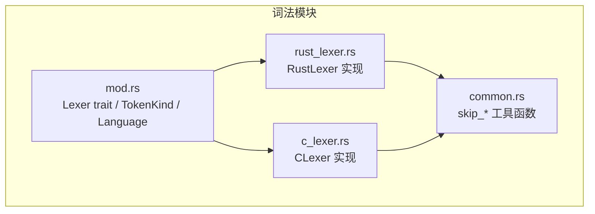
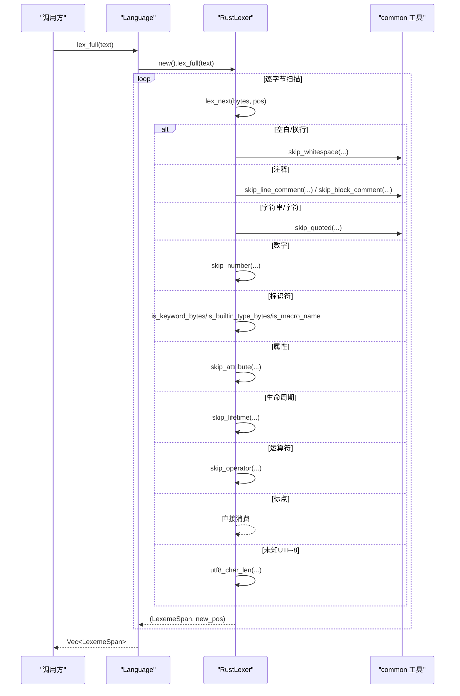
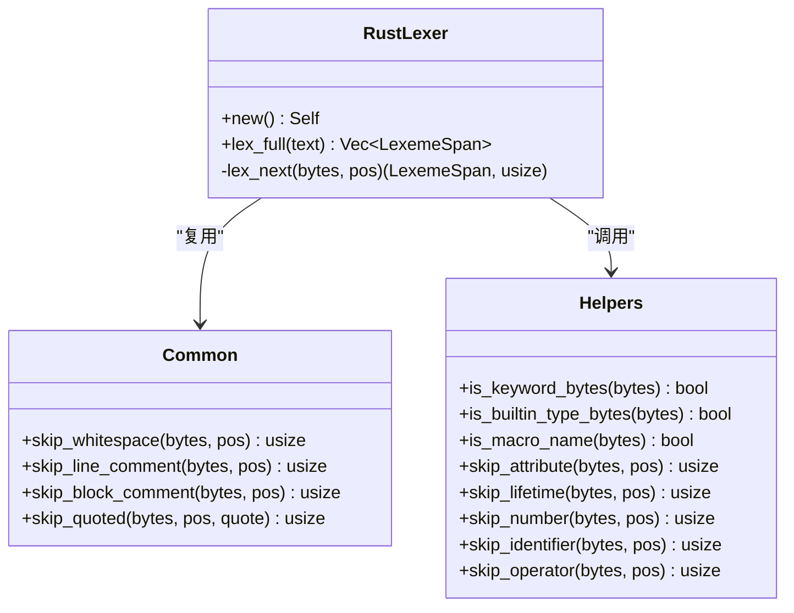
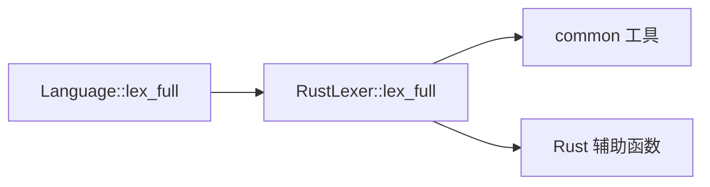

# Rust 词法分析器

<cite>
**本文引用的文件**   
- [rust_lexer.rs](file://crates/aether-core/src/lexer/rust_lexer.rs)
- [mod.rs](file://crates/aether-core/src/lexer/mod.rs)
- [common.rs](file://crates/aether-core/src/lexer/common.rs)
- [c_lexer.rs](file://crates/aether-core/src/lexer/c_lexer.rs)
- [lexer_bench.rs](file://crates/aether-core/benches/lexer_bench.rs)
</cite>

## 目录
1. [简介](#简介)
2. [项目结构](#项目结构)
3. [核心组件](#核心组件)
4. [架构总览](#架构总览)
5. [详细组件分析](#详细组件分析)
6. [依赖关系分析](#依赖关系分析)
7. [性能考量](#性能考量)
8. [故障排查指南](#故障排查指南)
9. [结论](#结论)
10. [附录](#附录)

## 简介
本技术文档聚焦于仓库中的 Rust 词法分析器实现，系统性解析其如何处理 Rust 语言特有的语法特征：生命周期标注、属性注解、宏调用、数字字面量（含下划线分隔符）、操作符与范围语法、注释与文档注释等。同时对比 C/C++ 词法分析器的差异与扩展点，并给出错误恢复策略、关键字集合与保留字处理思路，以及高亮规则的实现要点。文档面向希望理解或扩展该词法分析器的开发者，兼顾可读性与深度。

## 项目结构
Rust 词法分析器位于 aether-core 的 lexer 模块中，采用“通用接口 + 多语言实现”的组织方式：
- 公共接口与类型定义在 mod.rs
- 共享工具函数在 common.rs
- 各语言具体实现以独立文件组织，如 rust_lexer.rs、c_lexer.rs 等
- 基准测试在 benches/lexer_bench.rs，覆盖 Rust 典型代码片段

图表来源
- [mod.rs:1-182](file://crates/aether-core/src/lexer/mod.rs#L1-L182)
- [common.rs:1-151](file://crates/aether-core/src/lexer/common.rs#L1-L151)
- [rust_lexer.rs:1-353](file://crates/aether-core/src/lexer/rust_lexer.rs#L1-L353)
- [c_lexer.rs:1-236](file://crates/aether-core/src/lexer/c_lexer.rs#L1-L236)

章节来源
- [mod.rs:1-182](file://crates/aether-core/src/lexer/mod.rs#L1-L182)
- [common.rs:1-151](file://crates/aether-core/src/lexer/common.rs#L1-L151)
- [rust_lexer.rs:1-353](file://crates/aether-core/src/lexer/rust_lexer.rs#L1-L353)
- [c_lexer.rs:1-236](file://crates/aether-core/src/lexer/c_lexer.rs#L1-L236)

## 核心组件
- Lexer trait：统一全量词法分析接口 lex_full，返回 LexemeSpan 序列
- TokenKind：跨语言统一的 token 类别枚举，包含 Keyword、Identifier、StringLiteral、CharLiteral、NumberLiteral、LineComment、BlockComment、DocComment、Operator、Punctuation、Attribute、TypeName、Macro、Lifetime 等
- Language：按扩展名选择对应 Lexer 的静态分发入口
- RustLexer：Rust 语言的具体实现，负责识别 Rust 特有语法元素
- 共享工具：skip_whitespace、skip_line_comment、skip_block_comment、skip_quoted、utf8_char_len 等

章节来源
- [mod.rs:1-182](file://crates/aether-core/src/lexer/mod.rs#L1-L182)
- [rust_lexer.rs:1-353](file://crates/aether-core/src/lexer/rust_lexer.rs#L1-L353)
- [common.rs:1-151](file://crates/aether-core/src/lexer/common.rs#L1-L151)

## 架构总览
Rust 词法分析流程由 Language::lex_full 静态分发到 RustLexer::lex_full，后者逐字节扫描，根据首字符分派到不同 skip_* 函数完成 token 边界判定，最终产出 LexemeSpan 列表。

图表来源
- [mod.rs:165-181](file://crates/aether-core/src/lexer/mod.rs#L165-L181)
- [rust_lexer.rs:339-353](file://crates/aether-core/src/lexer/rust_lexer.rs#L339-L353)
- [rust_lexer.rs:12-336](file://crates/aether-core/src/lexer/rust_lexer.rs#L12-L336)
- [common.rs:1-151](file://crates/aether-core/src/lexer/common.rs#L1-L151)

## 详细组件分析

### RustLexer 主循环与分派逻辑
- 入口：lex_full 将文本转为字节切片，循环调用 lex_next 推进位置
- 分派：依据首字节进入分支，分别处理空白、换行、注释、字符串、字符、数字、标识符、属性、生命周期、宏、运算符、标点、未知 UTF-8 等
- 关键特性：
  - 属性注解：支持 #[...] 和 #![...]，内部使用 skip_attribute 跳过括号内容
  - 宏调用：检测形如 ident! 的标记，将 ! 单独作为 Macro token
  - 生命周期：单引号后接小写字母时识别为 Lifetime；转义字符或单字符字面量则识别为 CharLiteral
  - 数字字面量：支持十六进制前缀 0x/0X、八进制 0o/0O、二进制 0b/0B；允许下划线分隔；阻止 1..2 被合并为一个数字
  - 注释与文档注释：/// 与 /**...*/ 且非空块注释视为 DocComment；普通 // 与 /*...*/ 为 LineComment/BlockComment
  - 操作符：支持 +=、-=、==、!=、<=、>=、<<、>>、&&、||、..、..= 等组合
  - 标点：(){}[];:.?@$ 等作为 Punctuation
  - 未知字符：通过 utf8_char_len 安全前进，避免死循环

章节来源
- [rust_lexer.rs:12-336](file://crates/aether-core/src/lexer/rust_lexer.rs#L12-L336)
- [rust_lexer.rs:339-353](file://crates/aether-core/src/lexer/rust_lexer.rs#L339-L353)

#### 类图：RustLexer 与其辅助函数

图表来源
- [rust_lexer.rs:1-353](file://crates/aether-core/src/lexer/rust_lexer.rs#L1-L353)
- [common.rs:1-151](file://crates/aether-core/src/lexer/common.rs#L1-L151)

### 关键字与内置类型
- 关键字集合：包括控制流、所有权、可见性、模块、异步等关键字，例如 fn、let、if、match、async、await、trait、impl、use、pub、static、Self、yield 等
- 内置类型：基础数值类型 i8/i16/i32/i64/i128/isize、u* 系列、f32/f64、bool、char、str、String、Vec、Option、Result、Box、Rc、Arc、HashMap、BTreeMap、HashSet、BTreeSet、VecDeque、LinkedList、BinaryHeap、Cow 等
- 宏名称：macro 与 macro_ 前缀被识别为 Macro

章节来源
- [rust_lexer.rs:361-459](file://crates/aether-core/src/lexer/rust_lexer.rs#L361-L459)

### 注释与文档注释
- 行注释：// 开始至行尾
- 块注释：/* ... */，支持嵌套计数，未闭合时吞到末尾
- 文档注释：/// 与 /** ... */ 且非空块注释视为 DocComment

章节来源
- [rust_lexer.rs:49-104](file://crates/aether-core/src/lexer/rust_lexer.rs#L49-L104)
- [rust_lexer.rs:461-481](file://crates/aether-core/src/lexer/rust_lexer.rs#L461-L481)

### 字符串与字符字面量
- 字符串：双引号包围，支持转义，未闭合时吞到末尾
- 字符：单引号包围，支持转义；单字符 'a' 也识别为 CharLiteral
- 注意：当前实现不区分原始字符串 r#"..."# 与字节字符串 b"..." 的前缀语义，仅按通用 quoted 规则消费

章节来源
- [rust_lexer.rs:149-218](file://crates/aether-core/src/lexer/rust_lexer.rs#L149-L218)
- [common.rs:42-55](file://crates/aether-core/src/lexer/common.rs#L42-L55)

### 数字字面量与范围语法
- 支持十进制、十六进制(0x/0X)、八进制(0o/0O)、二进制(0b/0B)
- 允许下划线分隔符
- 支持小数点与指数 e/E，防止 1..2 被合并为一个数字
- 后缀：当前实现未显式处理 Rust 整型/浮点后缀（如 u32、f64），但不会误吞后续标识符

章节来源
- [rust_lexer.rs:513-560](file://crates/aether-core/src/lexer/rust_lexer.rs#L513-L560)

### 生命周期与泛型参数
- 生命周期：单引号后接小写 ASCII 字母序列，如 'a、'static
- 泛型参数：尖括号 < > 作为 Punctuation 处理，不在词法阶段进行语义解析

章节来源
- [rust_lexer.rs:191-218](file://crates/aether-core/src/lexer/rust_lexer.rs#L191-L218)
- [rust_lexer.rs:505-511](file://crates/aether-core/src/lexer/rust_lexer.rs#L505-L511)
- [mod.rs:40-43](file://crates/aether-core/src/lexer/mod.rs#L40-L43)

### 属性注解
- 支持 #[...] 与 #![...]，内部使用 skip_attribute 跳过括号内容，整体作为 Attribute token

章节来源
- [rust_lexer.rs:136-148](file://crates/aether-core/src/lexer/rust_lexer.rs#L136-L148)
- [rust_lexer.rs:483-503](file://crates/aether-core/src/lexer/rust_lexer.rs#L483-L503)

### 宏语法
- 识别 ident! 形式，将 ! 单独作为 Macro token，便于后续高亮与补全

章节来源
- [rust_lexer.rs:253-300](file://crates/aether-core/src/lexer/rust_lexer.rs#L253-L300)
- [rust_lexer.rs:457-459](file://crates/aether-core/src/lexer/rust_lexer.rs#L457-L459)

### 操作符优先级与组合
- 支持常见二元/一元操作符及复合赋值，如 ==、!=、<=、>=、<<、>>、&&、||、..、..=
- 优先级由上层语法/高亮决定，词法阶段仅做最大匹配

章节来源
- [rust_lexer.rs:301-322](file://crates/aether-core/src/lexer/rust_lexer.rs#L301-L322)
- [rust_lexer.rs:570-621](file://crates/aether-core/src/lexer/rust_lexer.rs#L570-L621)

### 与 C/C++ 词法分析器的差异与扩展点
- 差异点
  - Rust 支持属性注解 #[...] 与内联属性 #![...]，C/C++ 使用预处理指令 #include/#define
  - Rust 支持生命周期 'a 与宏调用 ident!，C/C++ 无此概念
  - Rust 内置类型与关键字集合显著不同
  - Rust 数字字面量支持下划线分隔符，C/C++ 不支持
  - Rust 范围语法 .. 与 ..= 需要特殊处理以避免与数字合并
- 扩展点
  - 可在 skip_number 中增加对 Rust 整型/浮点后缀的处理
  - 可增强字符串前缀识别（r#、b#、br#、rb#）以区分原始/字节字符串
  - 可为宏体提供更细粒度的 token 分类（可选）

章节来源
- [rust_lexer.rs:136-148](file://crates/aether-core/src/lexer/rust_lexer.rs#L136-L148)
- [rust_lexer.rs:513-560](file://crates/aether-core/src/lexer/rust_lexer.rs#L513-L560)
- [c_lexer.rs:114-125](file://crates/aether-core/src/lexer/c_lexer.rs#L114-L125)
- [c_lexer.rs:302-350](file://crates/aether-core/src/lexer/c_lexer.rs#L302-L350)

### 错误恢复机制
- 未闭合块注释：当 depth > 0 且到达末尾时，将位置推进到文本末尾，避免残留 1 字节 token
- 未闭合字符串/字符：skip_quoted 遇到末尾反斜杠或不匹配结束引号时吞到末尾
- 未知 UTF-8：通过 utf8_char_len 至少前进一个字符，保证词法循环不会卡住

章节来源
- [rust_lexer.rs:461-481](file://crates/aether-core/src/lexer/rust_lexer.rs#L461-L481)
- [common.rs:42-55](file://crates/aether-core/src/lexer/common.rs#L42-L55)
- [mod.rs:223-233](file://crates/aether-core/src/lexer/mod.rs#L223-L233)

### 高亮规则与示例用法
- 高亮规则映射：TokenKind 与编辑器主题映射，关键字、类型名、字符串、注释、属性、宏等均有独立样式
- 示例路径：基准测试中包含 Rust 代码样本，涵盖关键字、字符串、数字、注释、生命周期、宏等，可用于验证高亮与词法正确性

章节来源
- [lexer_bench.rs:4-43](file://crates/aether-core/benches/lexer_bench.rs#L4-L43)
- [mod.rs:10-68](file://crates/aether-core/src/lexer/mod.rs#L10-L68)

## 依赖关系分析
- 模块耦合
  - RustLexer 依赖 common 工具函数与自身辅助函数
  - Language 静态分发到具体 Lexer 实现
- 外部依赖
  - 无第三方运行时依赖，纯字节级扫描，性能友好

图表来源
- [mod.rs:165-181](file://crates/aether-core/src/lexer/mod.rs#L165-L181)
- [rust_lexer.rs:1-353](file://crates/aether-core/src/lexer/rust_lexer.rs#L1-L353)
- [common.rs:1-151](file://crates/aether-core/src/lexer/common.rs#L1-L151)

章节来源
- [mod.rs:1-182](file://crates/aether-core/src/lexer/mod.rs#L1-L182)
- [rust_lexer.rs:1-353](file://crates/aether-core/src/lexer/rust_lexer.rs#L1-L353)
- [common.rs:1-151](file://crates/aether-core/src/lexer/common.rs#L1-L151)

## 性能考量
- 零分配设计：lex_full 预分配 Vec 容量，减少扩容开销
- 字节级扫描：避免 Unicode 解码，仅在必要时使用 utf8_char_len 推断长度
- 静态分发：Language::lex_full 直接调用具体 Lexer，避免 Box 动态分发
- 基准测试：bench 覆盖 Rust/JS/Python/C 多种语言，便于回归与优化评估

章节来源
- [rust_lexer.rs:339-353](file://crates/aether-core/src/lexer/rust_lexer.rs#L339-L353)
- [mod.rs:165-181](file://crates/aether-core/src/lexer/mod.rs#L165-L181)
- [lexer_bench.rs:136-162](file://crates/aether-core/benches/lexer_bench.rs#L136-L162)

## 故障排查指南
- 症状：出现 1 字节残余 token
  - 原因：未闭合块注释导致循环提前退出
  - 修复：在 depth > 0 时将位置推进到末尾
- 症状：字符串/字符未闭合导致后续 token 错位
  - 原因：skip_quoted 遇到末尾反斜杠或未匹配引号
  - 修复：吞到文本末尾，确保后续扫描继续
- 症状：中文或其他多字节字符导致死循环
  - 原因：未知字符未前进
  - 修复：使用 utf8_char_len 至少前进一个字符

章节来源
- [rust_lexer.rs:461-481](file://crates/aether-core/src/lexer/rust_lexer.rs#L461-L481)
- [common.rs:42-55](file://crates/aether-core/src/lexer/common.rs#L42-L55)
- [mod.rs:223-233](file://crates/aether-core/src/lexer/mod.rs#L223-L233)

## 结论
Rust 词法分析器在保持高性能与简洁性的前提下，实现了 Rust 语言的关键词法特性：生命周期、属性注解、宏调用、数字字面量（含下划线分隔符）、范围语法、注释与文档注释等。通过与 C/C++ 词法分析器的对比，明确了差异与扩展点。错误恢复机制保证了鲁棒性，静态分发与字节级扫描确保了性能。未来可在数字后缀、原始/字节字符串前缀、宏体细化等方面进一步增强。

## 附录

### Rust 关键字与保留字处理建议
- 当前关键字集合已覆盖常用关键字与部分保留字
- 建议：定期对照官方规范更新关键字与保留字，避免误判标识符
- 保留字：对于严格保留字（不可用作标识符），可在上层语义阶段进行校验

章节来源
- [rust_lexer.rs:361-416](file://crates/aether-core/src/lexer/rust_lexer.rs#L361-L416)

### 复杂语法结构的高亮示例路径
- 生命周期与泛型：参考测试用例中对 lifetimes 的断言
- 属性注解：参考测试用例中对 #[derive(Debug)] 与 #![allow(dead_code)] 的断言
- 宏调用：参考测试用例中对 println!(...) 的断言
- 数字与范围：参考测试用例中对 0x1F、1_000、.. 与 ..= 的断言

章节来源
- [rust_lexer.rs:636-768](file://crates/aether-core/src/lexer/rust_lexer.rs#L636-L768)