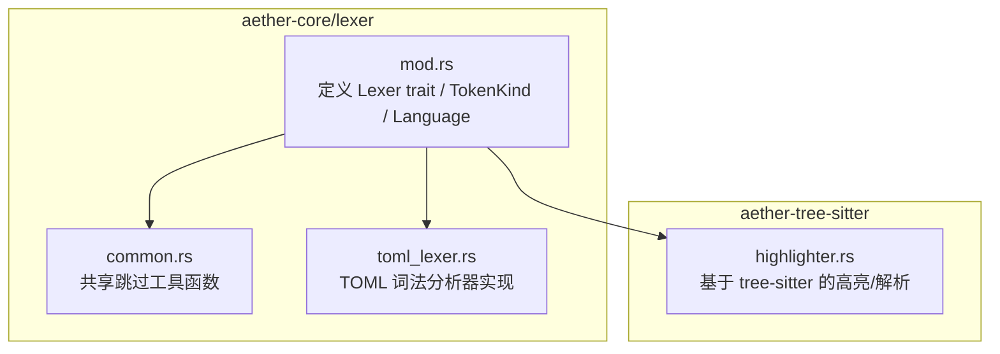
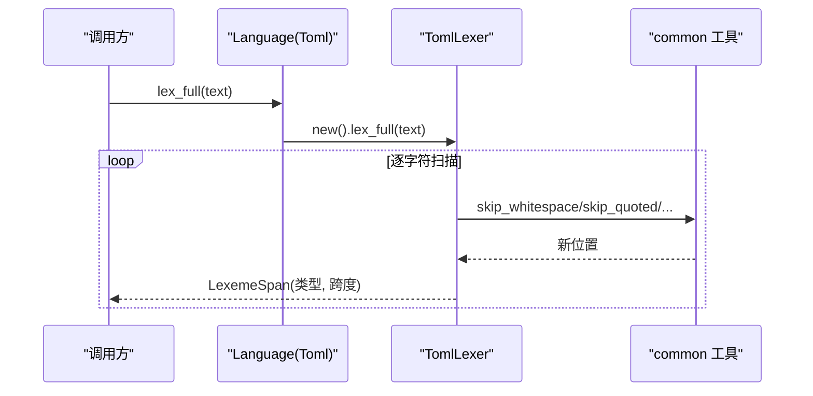
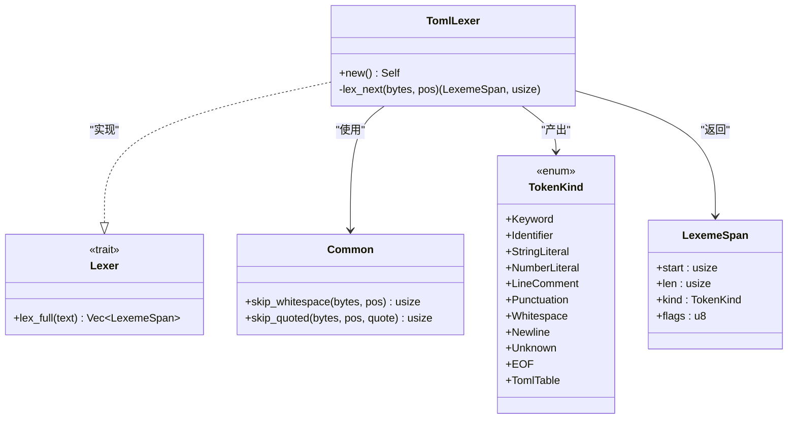
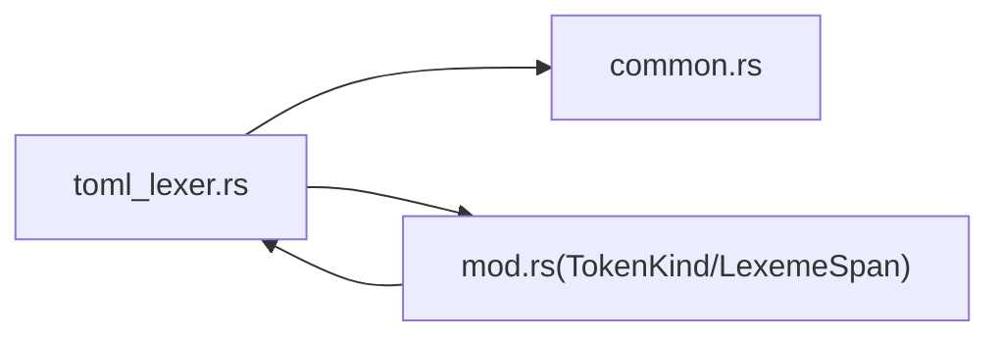

# TOML 词法分析器

<cite>
**本文引用的文件**   
- [crates/aether-core/src/lexer/toml_lexer.rs](file://crates/aether-core/src/lexer/toml_lexer.rs)
- [crates/aether-core/src/lexer/mod.rs](file://crates/aether-core/src/lexer/mod.rs)
- [crates/aether-core/src/lexer/common.rs](file://crates/aether-core/src/lexer/common.rs)
- [crates/aether-tree-sitter/src/highlighter.rs](file://crates/aether-tree-sitter/src/highlighter.rs)
</cite>

## 目录
1. [简介](#简介)
2. [项目结构](#项目结构)
3. [核心组件](#核心组件)
4. [架构总览](#架构总览)
5. [详细组件分析](#详细组件分析)
6. [依赖关系分析](#依赖关系分析)
7. [性能考量](#性能考量)
8. [故障排查指南](#故障排查指南)
9. [结论](#结论)
10. [附录：TOML v1.0.0 语法与实现对照](#附录toml-v100-语法与实现对照)

## 简介
本技术文档聚焦于 TOML 词法分析器的设计与实现，系统阐述其在编辑器中的角色、语法规则的覆盖范围、数据结构与处理流程，以及与上层高亮/解析模块的集成方式。文档同时给出面向使用者的结构化数据示例路径与错误诊断建议，帮助读者快速理解并扩展该词法分析器。

## 项目结构
TOML 词法分析器位于 aether-core 的词法模块中，采用“通用 Lexer trait + 语言特定实现”的分层设计。TOML 的具体实现由 TomlLexer 提供，并通过 Language::Toml 注册到统一入口。



图表来源
- [crates/aether-core/src/lexer/mod.rs:1-182](file://crates/aether-core/src/lexer/mod.rs#L1-L182)
- [crates/aether-core/src/lexer/common.rs:1-151](file://crates/aether-core/src/lexer/common.rs#L1-L151)
- [crates/aether-core/src/lexer/toml_lexer.rs:1-228](file://crates/aether-core/src/lexer/toml_lexer.rs#L1-L228)
- [crates/aether-tree-sitter/src/highlighter.rs:683-785](file://crates/aether-tree-sitter/src/highlighter.rs#L683-L785)

章节来源
- [crates/aether-core/src/lexer/mod.rs:1-182](file://crates/aether-core/src/lexer/mod.rs#L1-L182)
- [crates/aether-core/src/lexer/toml_lexer.rs:1-228](file://crates/aether-core/src/lexer/toml_lexer.rs#L1-L228)

## 核心组件
- Lexer trait：统一的词法接口，提供 lex_full(text) -> Vec<LexemeSpan>。
- TokenKind：跨语言的统一 token 类型集合，包含 Keyword、Identifier、StringLiteral、NumberLiteral、LineComment、Punctuation、Whitespace、Newline、Unknown、EOF 等；其中新增 TomlTable 用于标记表头。
- LexemeSpan：token 的跨度信息（起始位置、长度、类型、标志位）。
- Language：按扩展名或路径选择具体 lexer，并提供静态分发 lex_full 以消除动态分配开销。
- TomlLexer：TOML 专用词法分析器，实现 Lexer trait，负责识别键值对、表头、字符串、数字、布尔、注释、标点等。
- common 工具：skip_whitespace、skip_quoted 等可复用扫描函数。

章节来源
- [crates/aether-core/src/lexer/mod.rs:1-182](file://crates/aether-core/src/lexer/mod.rs#L1-L182)
- [crates/aether-core/src/lexer/toml_lexer.rs:1-228](file://crates/aether-core/src/lexer/toml_lexer.rs#L1-L228)
- [crates/aether-core/src/lexer/common.rs:1-151](file://crates/aether-core/src/lexer/common.rs#L1-L151)

## 架构总览
TOML 词法分析器在编辑器中的调用链如下：Language 根据文件扩展名创建 TomlLexer，随后通过静态分发进行全量词法分析，输出 LexemeSpan 序列供高亮或后续解析使用。tree-sitter 侧也支持 TOML 文档解析与行级高亮。



图表来源
- [crates/aether-core/src/lexer/mod.rs:165-182](file://crates/aether-core/src/lexer/mod.rs#L165-L182)
- [crates/aether-core/src/lexer/toml_lexer.rs:214-228](file://crates/aether-core/src/lexer/toml_lexer.rs#L214-L228)
- [crates/aether-core/src/lexer/common.rs:6-55](file://crates/aether-core/src/lexer/common.rs#L6-L55)

## 详细组件分析

### TomlLexer 类图


图表来源
- [crates/aether-core/src/lexer/mod.rs:1-68](file://crates/aether-core/src/lexer/mod.rs#L1-L68)
- [crates/aether-core/src/lexer/toml_lexer.rs:1-228](file://crates/aether-core/src/lexer/toml_lexer.rs#L1-L228)
- [crates/aether-core/src/lexer/common.rs:1-55](file://crates/aether-core/src/lexer/common.rs#L1-L55)

章节来源
- [crates/aether-core/src/lexer/toml_lexer.rs:1-228](file://crates/aether-core/src/lexer/toml_lexer.rs#L1-L228)
- [crates/aether-core/src/lexer/mod.rs:1-68](file://crates/aether-core/src/lexer/mod.rs#L1-L68)

### 词法单元与规则映射
- 空白与换行：空格、制表符、回车归为 Whitespace；换行归为 Newline。
- 注释：以 # 开头的行注释，归为 LineComment。
- 表头：[table] 与 [[array]] 均归为 TomlTable。
- 字符串：双引号字符串与单引号字面串均归为 StringLiteral。
- 数字与日期时间：数字、浮点、指数形式以及 ISO 风格的日期时间片段归为 NumberLiteral。
- 布尔：true/false 归为 Keyword，其余字母序列归为 Identifier。
- 标识符：键名与一般标识符归为 Identifier（TOML 键统一使用 Identifier，而非 JsonKey）。
- 标点：=、.、,、{、} 等归为 Punctuation。
- 未知：无法识别的字符归为 Unknown。
- EOF：输入结束。

章节来源
- [crates/aether-core/src/lexer/toml_lexer.rs:27-211](file://crates/aether-core/src/lexer/toml_lexer.rs#L27-L211)
- [crates/aether-core/src/lexer/mod.rs:8-68](file://crates/aether-core/src/lexer/mod.rs#L8-L68)

### 关键处理流程（流程图）
```mermaid
flowchart TD
Start(["进入 lex_next"]) --> CheckEOF{"pos >= len?"}
CheckEOF --> |是| ReturnEOF["返回 EOF 跨度"]
CheckEOF --> |否| Peek["读取当前字节 ch"]
Peek --> MatchCh{"匹配 ch"}
MatchCh --> |空白/回车| SkipWS["skip_whitespace 得到 end"]
SkipWS --> EmitWS["返回 Whitespace 跨度"]
MatchCh --> |换行| EmitNL["返回 Newline 跨度"]
MatchCh --> |#| SkipCmt["skip_line_comment 得到 end"]
SkipCmt --> EmitCmt["返回 LineComment 跨度"]
MatchCh --> |[| ParseTbl["检测 [[table]] 或 [table]"]
ParseTbl --> EmitTbl["返回 TomlTable 跨度"]
MatchCh --> |"\""| SkipDQ["skip_quoted 得到 end"]
SkipDQ --> EmitStr["返回 StringLiteral 跨度"]
MatchCh --> |' | SkipSQ["skip_literal_string 得到 end"]
SkipSQ --> EmitStr
MatchCh --> |数字/+/-| NumOrDate["skip_number_or_date 得到 end"]
NumOrDate --> EmitNum["返回 NumberLiteral 跨度"]
MatchCh --> |t/f| BoolScan["scan 字母序列"]
BoolScan --> IsBool{"是否为 true/false?"}
IsBool --> |是| EmitKW["返回 Keyword 跨度"]
IsBool --> |否| EmitID["返回 Identifier 跨度"]
MatchCh --> |字母/下划线| ScanID["skip_identifier 得到 end"]
ScanID --> EmitID
MatchCh --> |=/. , { }| EmitPunc["返回 Punctuation 跨度"]
MatchCh --> |其他| Unknown["utf8_char_len 推进 1 字符"]
Unknown --> EmitUnknown["返回 Unknown 跨度"]
EmitWS --> Next
EmitNL --> Next
EmitCmt --> Next
EmitTbl --> Next
EmitStr --> Next
EmitNum --> Next
EmitKW --> Next
EmitID --> Next
EmitPunc --> Next
EmitUnknown --> Next
Next(["更新 pos 继续循环"]) --> End(["完成"])
```

图表来源
- [crates/aether-core/src/lexer/toml_lexer.rs:12-211](file://crates/aether-core/src/lexer/toml_lexer.rs#L12-L211)
- [crates/aether-core/src/lexer/common.rs:6-55](file://crates/aether-core/src/lexer/common.rs#L6-L55)

章节来源
- [crates/aether-core/src/lexer/toml_lexer.rs:12-211](file://crates/aether-core/src/lexer/toml_lexer.rs#L12-L211)

### 数据类型与语法要点
- 键值对：键为 Identifier，值为多种字面量或复合结构。键名规范遵循 TOML 键命名约定（允许字母、数字、下划线、连字符），在本实现中统一作为 Identifier 输出。
- 表与数组表：[table] 与 [[array]] 均被识别为 TomlTable，便于上层构建层次结构。
- 字符串：支持双引号字符串（含转义）与单引号字面串；多行字符串需结合上下文语义判定，词法阶段仅识别起止边界。
- 日期时间：ISO 风格日期时间片段被纳入 NumberLiteral 范围，以便高亮与基础定位；精确解析交由上层。
- 整数与浮点数：包括十进制、负数前缀、小数点与指数形式。
- 布尔值：true/false 识别为 Keyword。
- 注释：# 行注释。
- 标点：=、.、,、{、} 等。

章节来源
- [crates/aether-core/src/lexer/toml_lexer.rs:49-211](file://crates/aether-core/src/lexer/toml_lexer.rs#L49-L211)
- [crates/aether-core/src/lexer/mod.rs:8-68](file://crates/aether-core/src/lexer/mod.rs#L8-L68)

### 层次结构与键名规范
- 层次结构：通过连续的 TomlTable 与键路径（如 a.b.c）在上层组合成嵌套结构。词法阶段将表头与键分别输出，便于上层构建树。
- 键名规范：TOML 键可为 bare key 或带引号的 quoted key。本实现将 bare key 与 quoted key 均归为 Identifier，简化下游处理。

章节来源
- [crates/aether-core/src/lexer/toml_lexer.rs:167-179](file://crates/aether-core/src/lexer/toml_lexer.rs#L167-L179)
- [crates/aether-core/src/lexer/toml_lexer.rs:61-86](file://crates/aether-core/src/lexer/toml_lexer.rs#L61-L86)

### 注释处理
- 行注释：从 # 开始至行尾，归为 LineComment。
- 块注释：TOML 未定义块注释，但公共工具提供了 skip_block_comment 以供其他语言复用。

章节来源
- [crates/aether-core/src/lexer/toml_lexer.rs:49-60](file://crates/aether-core/src/lexer/toml_lexer.rs#L49-L60)
- [crates/aether-core/src/lexer/common.rs:25-37](file://crates/aether-core/src/lexer/common.rs#L25-L37)

### 继承机制说明
- 词法阶段不直接实现“继承”，而是通过表头与键路径的组合，由上层解析器构建层级结构。TOML 的“表合并/继承”语义属于解析阶段职责。

章节来源
- [crates/aether-core/src/lexer/toml_lexer.rs:61-86](file://crates/aether-core/src/lexer/toml_lexer.rs#L61-L86)

### 与 tree-sitter 的集成
- tree-sitter 高亮器支持 TOML 的行级高亮与文档解析，可作为补充能力。

章节来源
- [crates/aether-tree-sitter/src/highlighter.rs:683-785](file://crates/aether-tree-sitter/src/highlighter.rs#L683-L785)

## 依赖关系分析
- TomlLexer 依赖 common 工具进行高效扫描。
- Language 统一管理各语言 lexer 的创建与静态分发。
- TokenKind/LexemeSpan 为跨语言统一的数据结构。



图表来源
- [crates/aether-core/src/lexer/toml_lexer.rs:1-228](file://crates/aether-core/src/lexer/toml_lexer.rs#L1-L228)
- [crates/aether-core/src/lexer/mod.rs:1-182](file://crates/aether-core/src/lexer/mod.rs#L1-L182)
- [crates/aether-core/src/lexer/common.rs:1-151](file://crates/aether-core/src/lexer/common.rs#L1-L151)

章节来源
- [crates/aether-core/src/lexer/mod.rs:1-182](file://crates/aether-core/src/lexer/mod.rs#L1-L182)
- [crates/aether-core/src/lexer/toml_lexer.rs:1-228](file://crates/aether-core/src/lexer/toml_lexer.rs#L1-L228)

## 性能考量
- 零拷贝扫描：基于 &str.as_bytes() 的字节切片扫描，避免额外分配。
- 预分配容量：lex_full 内部按文本长度估算初始容量，减少扩容开销。
- 静态分发：Language.lex_full 针对每种语言直接调用具体实现，避免 Box 分配与虚调用。
- 工具函数内联友好：skip_* 函数短小且无状态，利于编译器优化。

章节来源
- [crates/aether-core/src/lexer/toml_lexer.rs:214-228](file://crates/aether-core/src/lexer/toml_lexer.rs#L214-L228)
- [crates/aether-core/src/lexer/mod.rs:165-182](file://crates/aether-core/src/lexer/mod.rs#L165-L182)

## 故障排查指南
- 未知字符：遇到不支持的字符会输出 Unknown token，检查是否误用非法字符或编码问题。
- 未闭合表头：[table 缺少 ] 时仍会被识别为 TomlTable，但后续解析可能失败，应确保表头闭合。
- 未闭合字符串：双引号字符串若缺少闭合引号，会吞到文本末尾，导致后续 token 错位，需检查转义与引号配对。
- 布尔与标识符歧义：非 true/false 的字母序列将被识别为 Identifier，确认拼写是否正确。
- 数字与日期时间：日期时间片段被归入 NumberLiteral，如需严格校验，应在解析阶段进行。

章节来源
- [crates/aether-core/src/lexer/toml_lexer.rs:198-211](file://crates/aether-core/src/lexer/toml_lexer.rs#L198-L211)
- [crates/aether-core/src/lexer/toml_lexer.rs:61-86](file://crates/aether-core/src/lexer/toml_lexer.rs#L61-L86)
- [crates/aether-core/src/lexer/toml_lexer.rs:87-110](file://crates/aether-core/src/lexer/toml_lexer.rs#L87-L110)
- [crates/aether-core/src/lexer/toml_lexer.rs:149-166](file://crates/aether-core/src/lexer/toml_lexer.rs#L149-L166)
- [crates/aether-core/src/lexer/toml_lexer.rs:255-271](file://crates/aether-core/src/lexer/toml_lexer.rs#L255-L271)

## 结论
TOML 词法分析器以简洁高效的字节扫描为核心，覆盖了键值对、表头、字符串、数字、布尔、注释与标点等关键语法元素，并通过统一的 TokenKind 与 LexemeSpan 与上层高亮/解析模块良好集成。对于更严格的语义校验（如日期时间格式、键名合法性、表合并与继承），建议在解析阶段进一步细化。

## 附录：TOML v1.0.0 语法与实现对照
- 键值对：键为 bare key 或 quoted key，值为任意合法值。本实现将键统一输出为 Identifier，值按字面量分类输出。
- 表与数组表：[table] 与 [[array]] 对应 TomlTable。
- 字符串：双引号字符串与单引号字面串；多行字符串需结合上下文判断。
- 日期时间：ISO 8601 风格日期时间片段被识别为 NumberLiteral。
- 整数与浮点数：支持十进制、负号、小数点与指数。
- 布尔：true/false 为 Keyword。
- 注释：# 行注释。
- 标点：=、.、,、{、} 等。

章节来源
- [crates/aether-core/src/lexer/toml_lexer.rs:49-211](file://crates/aether-core/src/lexer/toml_lexer.rs#L49-L211)
- [crates/aether-core/src/lexer/mod.rs:8-68](file://crates/aether-core/src/lexer/mod.rs#L8-L68)