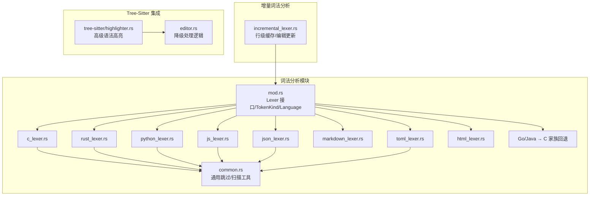
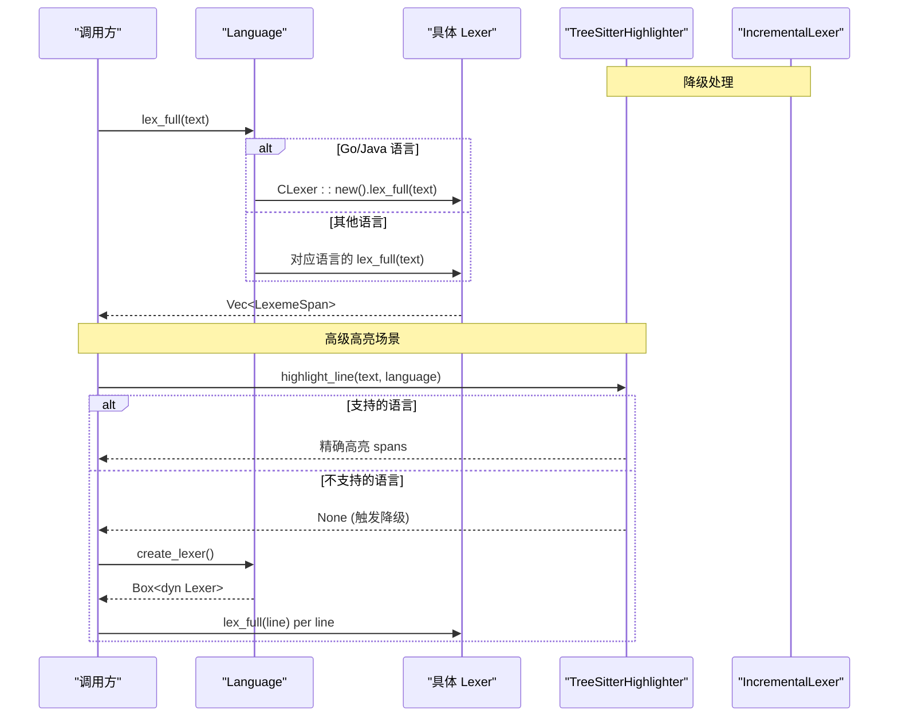
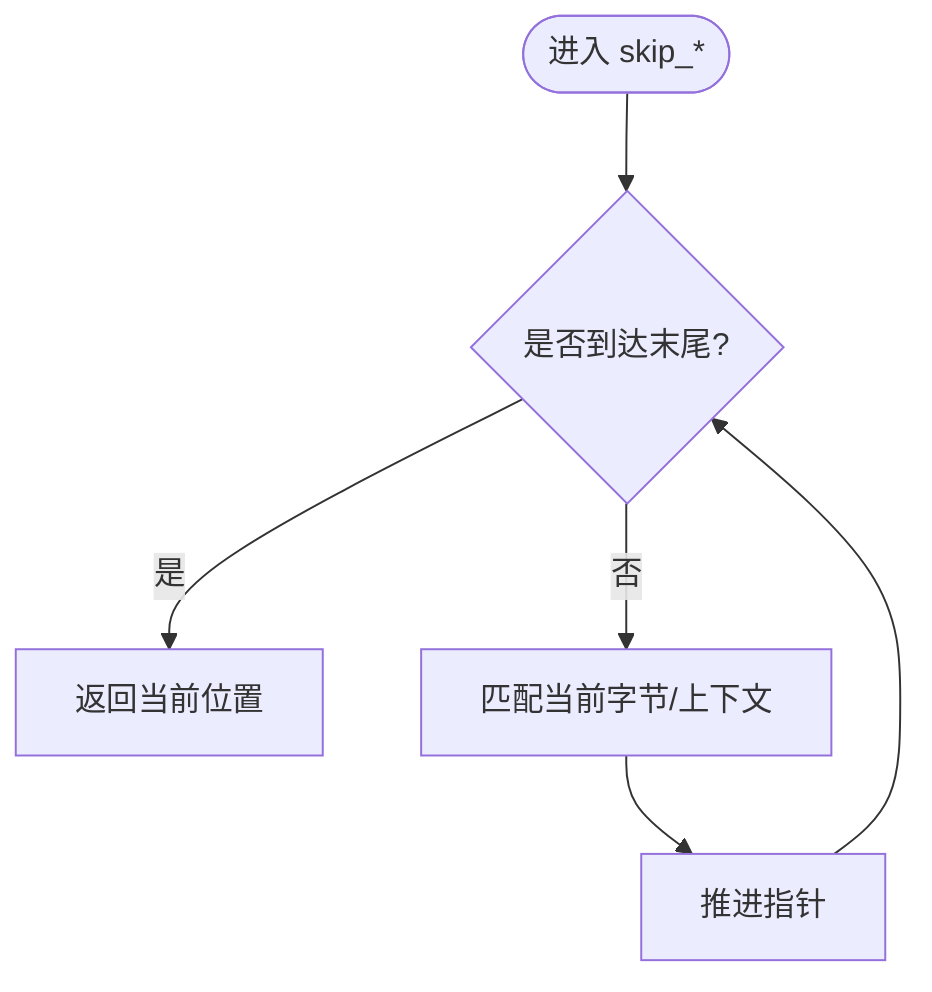
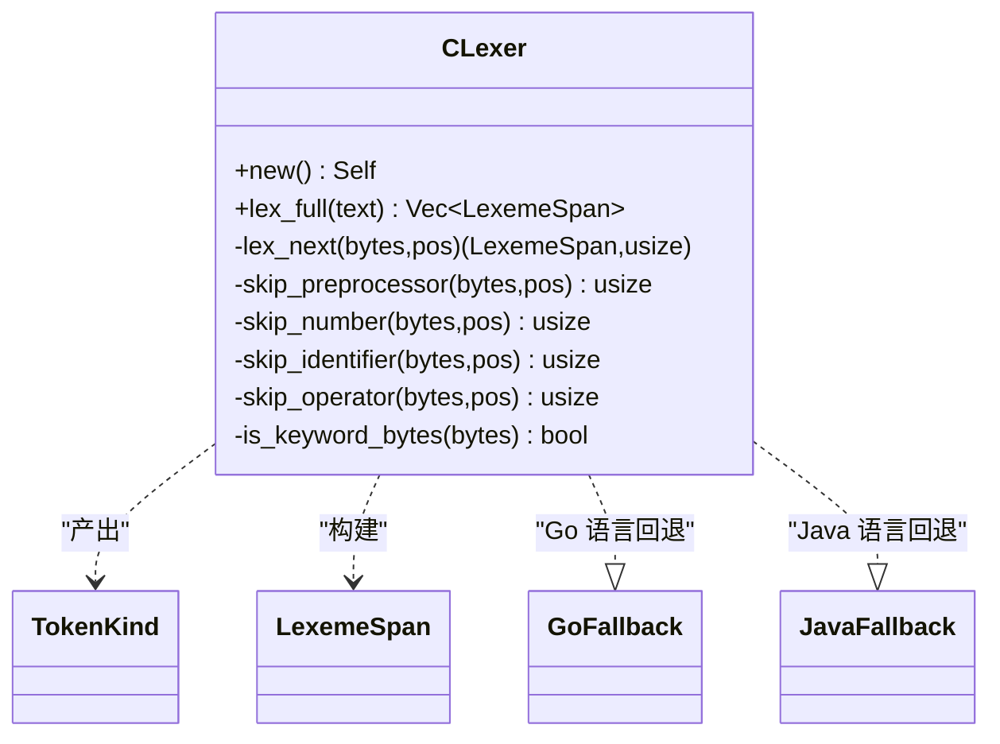
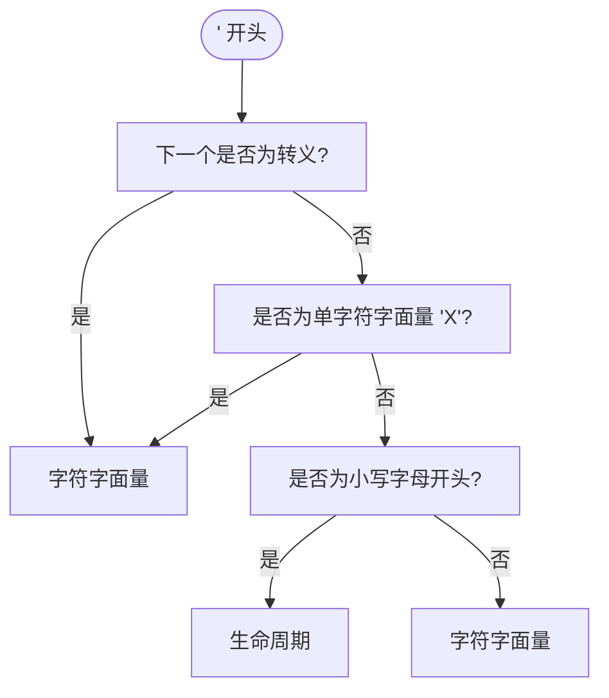
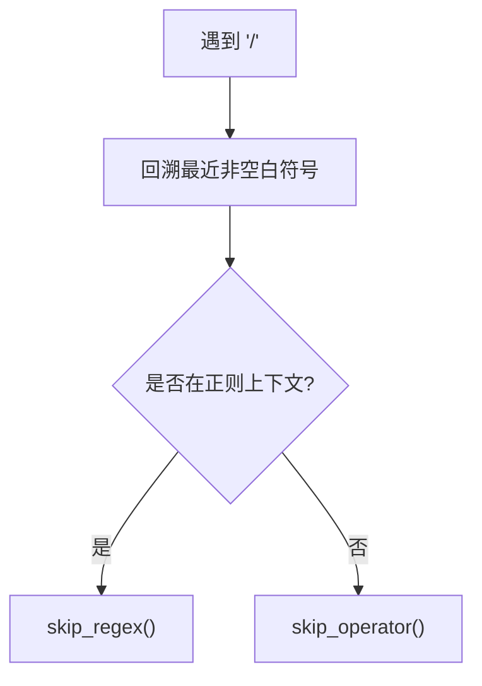
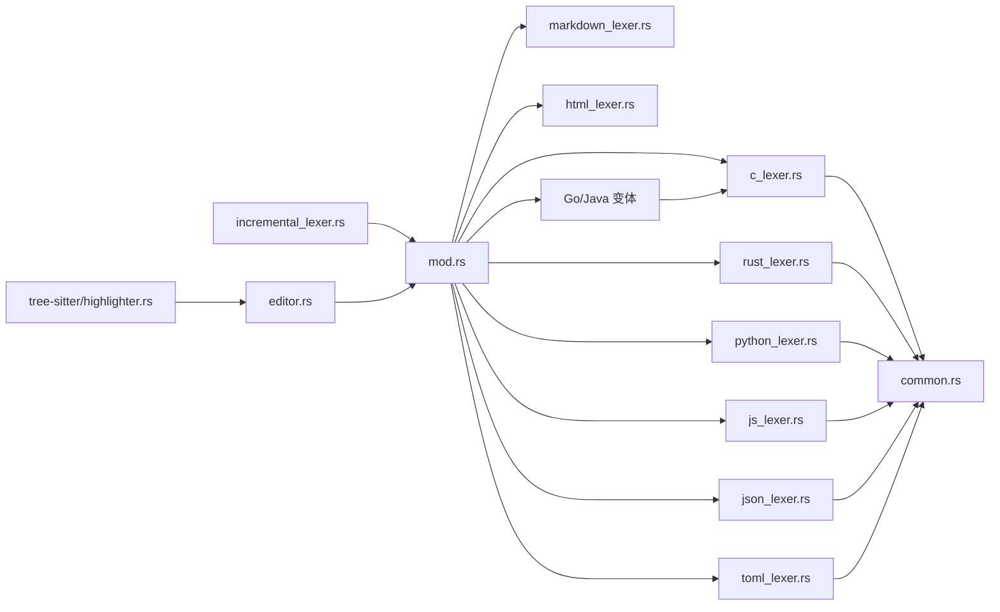

# 多语言实现

<cite>
**本文引用的文件**
- [crates/aether-core/src/lexer/mod.rs](file://crates/aether-core/src/lexer/mod.rs)
- [crates/aether-core/src/lexer/common.rs](file://crates/aether-core/src/lexer/common.rs)
- [crates/aether-core/src/lexer/c_lexer.rs](file://crates/aether-core/src/lexer/c_lexer.rs)
- [crates/aether-core/src/lexer/rust_lexer.rs](file://crates/aether-core/src/lexer/rust_lexer.rs)
- [crates/aether-core/src/lexer/python_lexer.rs](file://crates/aether-core/src/lexer/python_lexer.rs)
- [crates/aether-core/src/lexer/js_lexer.rs](file://crates/aether-core/src/lexer/js_lexer.rs)
- [crates/aether-core/src/lexer/json_lexer.rs](file://crates/aether-core/src/lexer/json_lexer.rs)
- [crates/aether-core/src/lexer/markdown_lexer.rs](file://crates/aether-core/src/lexer/markdown_lexer.rs)
- [crates/aether-core/src/lexer/toml_lexer.rs](file://crates/aether-core/src/lexer/toml_lexer.rs)
- [crates/aether-core/src/lexer/html_lexer.rs](file://crates/aether-core/src/lexer/html_lexer.rs)
- [crates/aether-core/src/incremental_lexer.rs](file://crates/aether-core/src/incremental_lexer.rs)
- [crates/aether-core/src/benchmarks.rs](file://crates/aether-core/src/benchmarks.rs)
- [crates/aether-core/benches/lexer_bench.rs](file://crates/aether-core/benches/lexer_bench.rs)
- [crates/aether-tree-sitter/src/highlighter.rs](file://crates/aether-tree-sitter/src/highlighter.rs)
- [crates/aether-win32/src/editor.rs](file://crates/aether-win32/src/editor.rs)
</cite>

## 更新摘要
**所做更改**
- 扩展 Language 枚举以支持 Go 和 Java 语言变体
- 添加文件扩展名映射（'go' 和 'java'）
- 实现 C 家族词法分析器降级回退机制
- 在 tree-sitter 不可用时提供基本语法高亮功能
- 更新编辑器集成逻辑以支持新的降级策略

## 目录
1. [简介](#简介)
2. [项目结构](#项目结构)
3. [核心组件](#核心组件)
4. [架构总览](#架构总览)
5. [详细组件分析](#详细组件分析)
6. [依赖关系分析](#依赖关系分析)
7. [性能考量与优化建议](#性能考量与优化建议)
8. [故障排查指南](#故障排查指南)
9. [结论](#结论)
10. [附录：新语言支持与测试模板](#附录新语言支持与测试模板)

## 简介
本技术文档围绕多语言词法分析器实现，系统性梳理各语言特定词法分析器的设计模式、语法特征与高亮规则，并深入解析通用工具函数 common.rs 提供的辅助能力（如空白跳过、注释/字符串/数字扫描等）。同时阐述不同语言间的共享模式与差异化实现，提供增量词法分析方案、性能调优建议以及新语言支持的开发模板与测试用例编写指南。

**更新** 新增对 Go 和 Java 语言的完整支持，包括文件扩展名映射和 C 家族词法分析器降级回退机制，确保在 tree-sitter 不可用时仍能提供基础语法高亮。

## 项目结构
词法分析子系统位于 aether-core 的 lexer 模块中，采用"统一接口 + 多语言实现"的分层组织方式：
- 公共接口与类型定义：mod.rs
- 通用工具函数：common.rs
- 语言特定实现：c_lexer.rs、rust_lexer.rs、python_lexer.rs、js_lexer.rs、json_lexer.rs、markdown_lexer.rs、toml_lexer.rs、html_lexer.rs
- 增量词法分析器：incremental_lexer.rs
- 基准与性能测试：benchmarks.rs、benches/lexer_bench.rs

**图表来源**
- [crates/aether-core/src/lexer/mod.rs:1-296](file://crates/aether-core/src/lexer/mod.rs#L1-L296)
- [crates/aether-core/src/lexer/common.rs:1-151](file://crates/aether-core/src/lexer/common.rs#L1-L151)
- [crates/aether-core/src/incremental_lexer.rs:1-301](file://crates/aether-core/src/incremental_lexer.rs#L1-L301)
- [crates/aether-tree-sitter/src/highlighter.rs:1-200](file://crates/aether-tree-sitter/src/highlighter.rs#L1-L200)
- [crates/aether-win32/src/editor.rs:5980-6179](file://crates/aether-win32/src/editor.rs#L5980-L6179)

章节来源
- [crates/aether-core/src/lexer/mod.rs:1-296](file://crates/aether-core/src/lexer/mod.rs#L1-L296)
- [crates/aether-core/src/incremental_lexer.rs:1-301](file://crates/aether-core/src/incremental_lexer.rs#L1-L301)

## 核心组件
- Lexer 接口与 Token 体系
  - 统一的 Lexer trait 暴露 lex_full(text) -> Vec<LexemeSpan> 的全量行级分析接口。
  - TokenKind 枚举覆盖关键字、标识符、字符串/字符字面量、注释、运算符、分隔符、预处理指令、属性/注解、类型名、函数名、宏、生命周期、泛型、正则表达式、格式化字符串、Markdown 标题/链接/代码/强调、JSON 键、TOML 表头、空白、换行、未知、EOF 等。
  - LexemeSpan 记录 token 的起始位置、长度、种类与扩展标志位。
- Language 分发
  - 根据文件扩展名或路径推断语言，并提供 create_lexer() 动态创建与 lex_full() 静态分发两种调用路径。
  - **新增** Go 和 Java 语言变体，使用 C 家族词法分析器作为降级回退，提供基础的高亮功能。
  - 对无独立 lexer 的语言（如 CSS）提供回退策略，复用相近语言的实现以保证基础高亮。
- 增量词法分析器
  - 按行缓存 token，基于编辑结果仅重算受影响行，显著降低大文件编辑时的开销。
  - 管理多个文件的增量 lexer，具备最大缓存数量保护。

**更新** Language 枚举现在包含 Go 和 Java 变体，并通过 C 家族词法分析器提供降级支持。

章节来源
- [crates/aether-core/src/lexer/mod.rs:1-296](file://crates/aether-core/src/lexer/mod.rs#L1-L296)
- [crates/aether-core/src/incremental_lexer.rs:1-301](file://crates/aether-core/src/incremental_lexer.rs#L1-L301)

## 架构总览
整体架构遵循"统一接口 + 多实现 + 增量缓存 + 降级回退"的模式：
- 上层通过 Language 选择具体语言词法分析器；
- 每个语言实现遵循相同的 lex_next 步进式 DFA 风格，结合 common.rs 的通用工具完成扫描；
- Go 和 Java 语言使用 C 家族词法分析器作为降级回退；
- Tree-sitter 提供高级语法高亮，当不可用时自动降级到手写 lexer；
- 增量词法分析器在编辑器交互场景下按需刷新行级 token，避免全量重析。

**图表来源**
- [crates/aether-core/src/lexer/mod.rs:144-182](file://crates/aether-core/src/lexer/mod.rs#L144-L182)
- [crates/aether-tree-sitter/src/highlighter.rs:180-200](file://crates/aether-tree-sitter/src/highlighter.rs#L180-L200)
- [crates/aether-win32/src/editor.rs:5987-6047](file://crates/aether-win32/src/editor.rs#L5987-L6047)

## 详细组件分析

### 通用工具函数 common.rs
- 功能概览
  - skip_whitespace：跳过空格、制表符、回车。
  - skip_line_comment / skip_block_comment：处理 // 与 /* */ 注释。
  - skip_quoted：安全跳过带转义的引号包围的字符串/字符字面量。
  - skip_identifier_ascii / skip_identifier_with：识别 ASCII 标识符及扩展字符集（如 $）。
  - skip_number_generic：通用数字扫描框架，以回调判定合法字符。
- 复杂度与健壮性
  - 均为 O(n) 线性扫描，边界检查完善，避免越界。
  - 为各语言 lexer 提供一致的基础行为，减少重复实现。

**图表来源**
- [crates/aether-core/src/lexer/common.rs:6-90](file://crates/aether-core/src/lexer/common.rs#L6-L90)

章节来源
- [crates/aether-core/src/lexer/common.rs:1-151](file://crates/aether-core/src/lexer/common.rs#L1-L151)

### C/C++ 词法分析器（c_lexer.rs）
- 语法特征与高亮规则
  - 支持行注释、块注释与文档注释（/** ... */），预处理指令 #include/#define 等。
  - 数字支持十进制、十六进制/二进制前缀、浮点小数与指数、后缀 u/l/f 等。
  - 运算符包含复合赋值与移位等。
  - UTF-8 未知字符按完整字符推进，避免错位。
- 关键实现要点
  - lex_next 基于首字节分派，使用 common 工具进行快速跳过。
  - is_keyword_bytes 硬编码 C 关键字集合。
  - skip_preprocessor 处理续行符 \n。
- **新增** 作为 Go 和 Java 语言的降级回退实现，提供基础的高亮功能。

**图表来源**
- [crates/aether-core/src/lexer/c_lexer.rs:1-236](file://crates/aether-core/src/lexer/c_lexer.rs#L1-L236)
- [crates/aether-core/src/lexer/c_lexer.rs:238-410](file://crates/aether-core/src/lexer/c_lexer.rs#L238-L410)

章节来源
- [crates/aether-core/src/lexer/c_lexer.rs:1-542](file://crates/aether-core/src/lexer/c_lexer.rs#L1-L542)

### Rust 词法分析器（rust_lexer.rs）
- 语法特征与高亮规则
  - 支持 /// 文档注释、嵌套块注释、属性 #[...] 与内联属性 #![...]。
  - 生命周期 'a 与字符字面量区分，避免误判。
  - 内置类型与宏名识别，提升语义高亮质量。
  - 数字支持多种进制与前缀、下划线分隔、浮点与指数。
- 关键实现要点
  - 针对 ' 开头的三种分支：转义字符、单字符字面量、生命周期。
  - 属性与嵌套注释深度计数，保证未闭合注释的安全消费。

**图表来源**
- [crates/aether-core/src/lexer/rust_lexer.rs:162-218](file://crates/aether-core/src/lexer/rust_lexer.rs#L162-L218)

章节来源
- [crates/aether-core/src/lexer/rust_lexer.rs:1-769](file://crates/aether-core/src/lexer/rust_lexer.rs#L1-L769)

### Python 词法分析器（python_lexer.rs）
- 语法特征与高亮规则
  - 支持三引号字符串与 f-string 前缀（f"..." 或 f'''...'''）。
  - 数字支持整数、浮点、虚数 j/J、科学计数法与下划线分隔。
  - 关键字与内置类型/函数识别。
- 关键实现要点
  - 三引号扫描与 f-string 前缀检测（前缀在引号之前）。
  - 操作符包括 **、//、-> 等。

章节来源
- [crates/aether-core/src/lexer/python_lexer.rs:1-545](file://crates/aether-core/src/lexer/python_lexer.rs#L1-L545)

### JavaScript/TypeScript 词法分析器（js_lexer.rs）
- 语法特征与高亮规则
  - 支持模板字符串 `${...}` 与嵌套。
  - 正则表达式上下文启发式判断（向前查找最近非空白符号）。
  - 数字支持 BigInt 后缀 n、十六进制/八进制/二进制前缀、下划线分隔。
  - 丰富的现代运算符（??、?.、**=、>>> 等）。
- 关键实现要点
  - 模板字符串递归跳过 ${...} 中的内容。
  - 正则类组 [ ] 状态机，避免将内部 / 误判为结束。

**图表来源**
- [crates/aether-core/src/lexer/js_lexer.rs:77-140](file://crates/aether-core/src/lexer/js_lexer.rs#L77-L140)

章节来源
- [crates/aether-core/src/lexer/js_lexer.rs:1-778](file://crates/aether-core/src/lexer/js_lexer.rs#L1-L778)

### JSON 词法分析器（json_lexer.rs）
- 语法特征与高亮规则
  - 键值对中的键识别为 JsonKey，值为 StringLiteral。
  - 支持 true/false/null 关键字与数字（含负号、小数、指数）。
- 关键实现要点
  - 通过 is_json_key 向后扫描空白后判断 ':'。

章节来源
- [crates/aether-core/src/lexer/json_lexer.rs:1-278](file://crates/aether-core/src/lexer/json_lexer.rs#L1-L278)

### Markdown 词法分析器（markdown_lexer.rs）
- 语法特征与高亮规则
  - 标题（# 级别）、围栏代码块与行内代码、链接 [text](url)、强调 *...* / **...** / _..._ / __...__。
  - 无序/有序列表、HTML 标签片段识别。
- 关键实现要点
  - 强调标记在未找到闭合时仅消耗开放标记，避免整行误标。
  - 普通文本扫描遇到特殊字符提前终止。

章节来源
- [crates/aether-core/src/lexer/markdown_lexer.rs:1-470](file://crates/aether-core/src/lexer/markdown_lexer.rs#L1-L470)

### TOML 词法分析器（toml_lexer.rs）
- 语法特征与高亮规则
  - 表头 [table] 与数组表头 [[array]] 识别为 TomlTable。
  - 键统一使用 Identifier（而非 JsonKey）。
  - 支持布尔、数字/日期混合扫描、双引号与单引号字符串。
- 关键实现要点
  - + / - 仅在后续跟随数字时作为数值起始，否则作为标点。

章节来源
- [crates/aether-core/src/lexer/toml_lexer.rs:1-374](file://crates/aether-core/src/lexer/toml_lexer.rs#L1-L374)

### HTML 词法分析器（html_lexer.rs）
- 语法特征与高亮规则
  - 注释 <!-- ... -->、标签 <tag attr="value">、实体引用 &amp; 等。
  - 标签名、属性名、属性值分别高亮。
- 关键实现要点
  - 自闭合标签 / 与结束 > 分别输出标点。
  - 无引号属性值与有引号属性值分别处理。

章节来源
- [crates/aether-core/src/lexer/html_lexer.rs:1-310](file://crates/aether-core/src/lexer/html_lexer.rs#L1-L310)

### Go 和 Java 语言支持（新增）
- **新增** 语言变体支持
  - Language 枚举新增 Go 和 Java 变体
  - 文件扩展名映射：'go' → Language::Go, 'java' → Language::Java
  - 使用 C 家族词法分析器作为降级回退实现
- **新增** 降级回退机制
  - 在 create_lexer() 和 lex_full() 方法中，Go 和 Java 语言都复用 CLexer
  - 提供基础的高亮功能：注释、字符串、数字、大括号、运算符等
  - 确保在 tree-sitter 不可用时仍能提供基本的语法高亮体验
- **新增** 编辑器集成
  - language_to_ts_str() 函数支持 Go 和 Java 语言映射到 tree-sitter
  - 当 tree-sitter 不支持时，自动降级到手写 lexer
  - 延迟创建 fallback lexer，仅在需要时才实例化

**更新** 现在支持完整的 Go 和 Java 语言处理，包括文件扩展名识别和智能降级策略。

章节来源
- [crates/aether-core/src/lexer/mod.rs:80-182](file://crates/aether-core/src/lexer/mod.rs#L80-L182)
- [crates/aether-win32/src/editor.rs:6989-7006](file://crates/aether-win32/src/editor.rs#L6989-L7006)

## 依赖关系分析
- 耦合与内聚
  - 各语言 lexer 均依赖 common.rs 的通用工具，保持高内聚低耦合。
  - mod.rs 集中维护 Language 到具体实现的映射，便于扩展与维护。
  - **新增** Go 和 Java 语言依赖 C 家族词法分析器作为降级回退。
- 外部依赖
  - 增量词法分析器依赖 buffer 的 EditResult 与 Language 工厂方法。
  - Tree-sitter 高亮器提供高级语法高亮，手写 lexer 作为降级方案。
- 潜在循环依赖
  - 当前结构清晰，未见循环导入。

**图表来源**
- [crates/aether-core/src/lexer/mod.rs:184-192](file://crates/aether-core/src/lexer/mod.rs#L184-L192)
- [crates/aether-core/src/incremental_lexer.rs:1-301](file://crates/aether-core/src/incremental_lexer.rs#L1-L301)
- [crates/aether-tree-sitter/src/highlighter.rs:1-200](file://crates/aether-tree-sitter/src/highlighter.rs#L1-L200)
- [crates/aether-win32/src/editor.rs:6989-7006](file://crates/aether-win32/src/editor.rs#L6989-L7006)

章节来源
- [crates/aether-core/src/lexer/mod.rs:184-192](file://crates/aether-core/src/lexer/mod.rs#L184-L192)
- [crates/aether-core/src/incremental_lexer.rs:1-301](file://crates/aether-core/src/incremental_lexer.rs#L1-L301)

## 性能考量与优化建议
- 现状与瓶颈
  - 动态分配与分发：create_lexer() 返回 Box<dyn Lexer>，每次打开文件存在堆分配与动态分发开销。
  - 逐字节扫描：skip_* 多为 while 单字节推进，未利用 SIMD/memchr/查找表批量扫描。
  - 重复 UTF-8 转换：多处 from_utf8 用于 matches! 关键词判断，可优化为字节比较。
  - 关键词线性匹配：matches!(text, "a" | "b" | ...) 本质逐个字符串比较。
  - 边界越界风险：部分跳过函数需确保 i+1<len 后再前进两步。
  - 数字解析贪婪：需防止 1..2 等被合并为一个数字。
  - UTF-8 多字节字符：应使用 utf8_char_len 按完整字符推进，避免高亮错位。
- 优化建议
  - 静态分发优先：在热点路径使用 Language::lex_full 静态分发，避免 Box 分配。
  - 预分配容量：lex_full 初始化 Vec 时预估容量，减少扩容。
  - 批量扫描：引入 memchr/SIMD 加速空白/注释/字符串跳过。
  - 关键词查找表：使用哈希或 Trie 替代线性匹配。
  - 严格边界检查：所有 i+1<len 再 i+=2 的场景前置校验。
  - 数字解析细化：按语言规范限制 . - + e E 的组合顺序与出现位置。
  - UTF-8 推进：统一使用 utf8_char_len 推进未知字符。
  - **新增** 延迟创建降级 lexer：仅在 tree-sitter 不可用且需要时才创建手写 lexer。
- 基准与验证
  - 使用 benches/lexer_bench.rs 对不同语言样本进行吞吐对比。
  - benchmarks.rs 提供增量词法分析与 SIMD 相关基准，便于回归验证。

**更新** 新增了对降级 lexer 创建的延迟优化，避免不必要的对象分配。

章节来源
- [crates/aether-core/benches/lexer_bench.rs:136-161](file://crates/aether-core/benches/lexer_bench.rs#L136-L161)
- [crates/aether-core/src/benchmarks.rs:269-276](file://crates/aether-core/src/benchmarks.rs#L269-L276)
- [crates/aether-core/src/benchmarks.rs:415-442](file://crates/aether-core/src/benchmarks.rs#L415-L442)
- [crates/aether-win32/src/editor.rs:5987-6047](file://crates/aether-win32/src/editor.rs#L5987-L6047)

## 故障排查指南
- 常见问题定位
  - 高亮错位：检查未知字符推进是否使用 utf8_char_len，避免按字节拆分中文/emoji。
  - 正则误判：JS 中正则上下文判断失败会导致 / 被当作运算符，需调整回溯逻辑。
  - 数字合并异常：确认 skip_number 对 . 与范围语法 .. 的处理。
  - 未闭合注释：Rust 块注释深度计数与未闭合兜底逻辑是否正确。
  - 属性/注解漏识别：Rust 属性 #[...] 与内联属性 #![...] 的括号深度计数。
  - **新增** Go/Java 高亮问题：确认是否正确使用了 C 家族词法分析器作为降级回退。
  - **新增** 降级逻辑问题：检查 tree-sitter 不可用时的降级路径是否正确执行。
- 调试手段
  - 使用增量词法分析器的版本与缓存统计接口定位刷新范围。
  - 运行基准与单元测试，观察 token 种类与数量是否符合预期。
  - **新增** 检查编辑器日志，确认降级逻辑的执行路径。

**更新** 新增了对 Go/Java 语言和降级逻辑的故障排查指导。

章节来源
- [crates/aether-core/src/lexer/mod.rs:223-296](file://crates/aether-core/src/lexer/mod.rs#L223-L296)
- [crates/aether-core/src/incremental_lexer.rs:195-301](file://crates/aether-core/src/incremental_lexer.rs#L195-L301)
- [crates/aether-win32/src/editor.rs:5987-6047](file://crates/aether-win32/src/editor.rs#L5987-L6047)

## 结论
该多语言词法分析器以统一接口为核心，结合通用工具与语言特定实现，兼顾了可扩展性与实用性。新增的 Go 和 Java 语言支持通过 C 家族词法分析器降级回退机制，确保了在各种环境下的可用性。增量词法分析有效提升了编辑体验，而树形-sitter 与手写 lexer 的双轨架构提供了灵活的高亮策略。未来可在静态分发、批量扫描、关键词查找与边界安全等方面进一步优化，以获得更高的性能与更稳健的行为。

**更新** 系统现在支持完整的 Go 和 Java 语言处理，具备健壮的降级机制，能够在各种环境下提供一致的编辑体验。

## 附录：新语言支持与测试模板
- 新增语言步骤
  - 在 mod.rs 的 Language 枚举中添加新语言变体，并在 from_extension/from_path/create_lexer/lex_full 中注册。
  - 新建 language_lexer.rs，实现 Lexer trait，遵循 lex_next 步进式 DFA 风格，复用 common.rs 工具。
  - 在 mod.rs 中 pub mod 声明新模块。
  - **新增** 如需降级支持，在 create_lexer() 和 lex_full() 中配置降级目标。
- 测试用例编写指南
  - 覆盖关键字、标识符、字符串/字符字面量、注释、运算符、分隔符、语言特有语法（如 f-string、模板字符串、属性、生命周期等）。
  - 边界与异常：未闭合注释/字符串、非法 UTF-8、空输入、超长行。
  - 断言 token 种类与数量，必要时断言 flags（如 Markdown 标题级别）。
  - **新增** 测试降级逻辑：验证 tree-sitter 不可用时的降级行为。
- 复杂高亮逻辑示例（路径指引）
  - 正则上下文判断与类组状态机：[js_lexer.rs:77-140](file://crates/aether-core/src/lexer/js_lexer.rs#L77-L140)、[js_lexer.rs:448-473](file://crates/aether-core/src/lexer/js_lexer.rs#L448-L473)
  - 模板字符串递归跳过：[js_lexer.rs:421-446](file://crates/aether-core/src/lexer/js_lexer.rs#L421-L446)
  - 生命周期与字符字面量区分：[rust_lexer.rs:162-218](file://crates/aether-core/src/lexer/rust_lexer.rs#L162-L218)
  - 文档注释与嵌套块注释：[rust_lexer.rs:84-104](file://crates/aether-core/src/lexer/rust_lexer.rs#L84-L104)、[rust_lexer.rs:461-481](file://crates/aether-core/src/lexer/rust_lexer.rs#L461-L481)
  - f-string 前缀检测：[python_lexer.rs:62-90](file://crates/aether-core/src/lexer/python_lexer.rs#L62-L90)
  - JSON 键识别：[json_lexer.rs:135-143](file://crates/aether-core/src/lexer/json_lexer.rs#L135-L143)
  - Markdown 强调与代码块：[markdown_lexer.rs:104-126](file://crates/aether-core/src/lexer/markdown_lexer.rs#L104-L126)、[markdown_lexer.rs:60-86](file://crates/aether-core/src/lexer/markdown_lexer.rs#L60-86)
  - TOML 表头与键：[toml_lexer.rs:61-86](file://crates/aether-core/src/lexer/toml_lexer.rs#L61-86)、[toml_lexer.rs:167-179](file://crates/aether-core/src/lexer/toml_lexer.rs#L167-L179)
  - HTML 标签与属性：[html_lexer.rs:37-178](file://crates/aether-core/src/lexer/html_lexer.rs#L37-L178)
  - **新增** Go/Java 降级支持：[mod.rs:150-153](file://crates/aether-core/src/lexer/mod.rs#L150-L153)、[mod.rs:172-173](file://crates/aether-core/src/lexer/mod.rs#L172-L173)
  - **新增** 编辑器降级逻辑：[editor.rs:5987-6047](file://crates/aether-win32/src/editor.rs#L5987-L6047)

**更新** 新增了 Go 和 Java 语言支持的完整开发指南和测试模板。