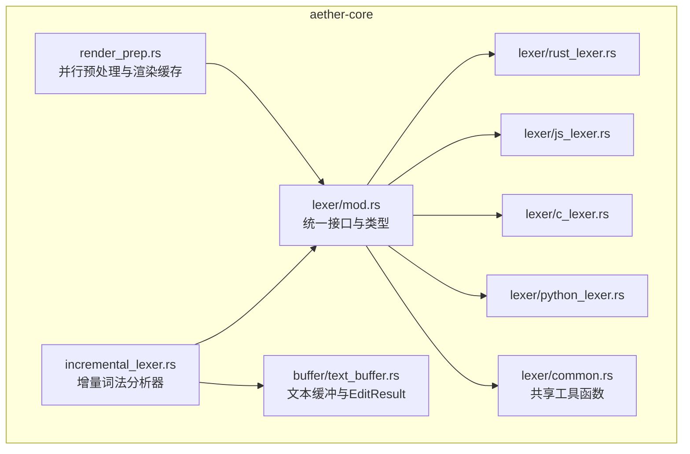
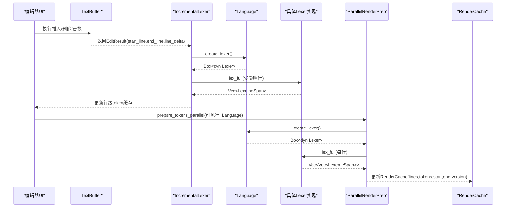
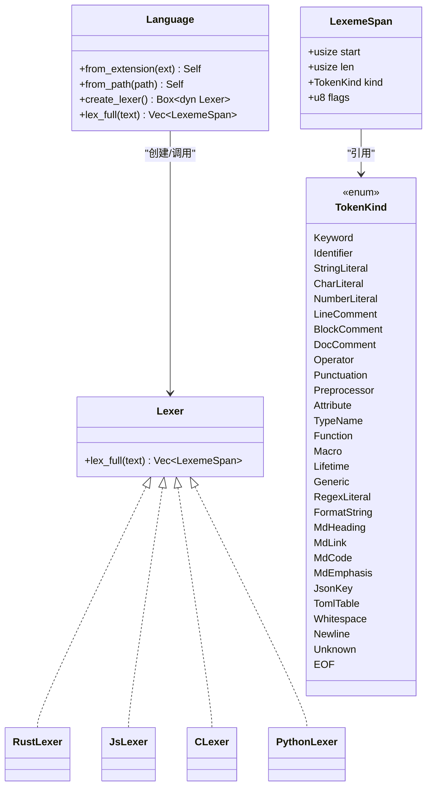
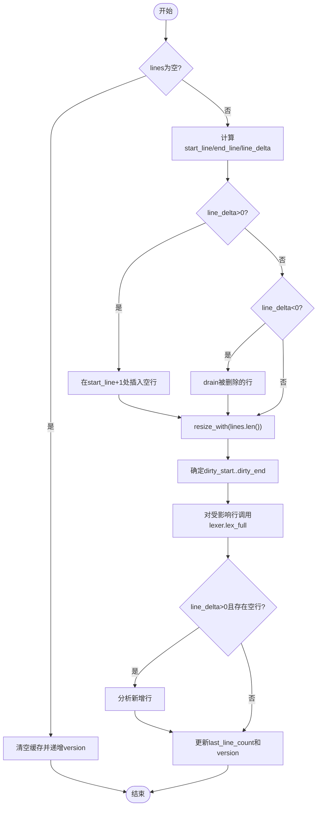
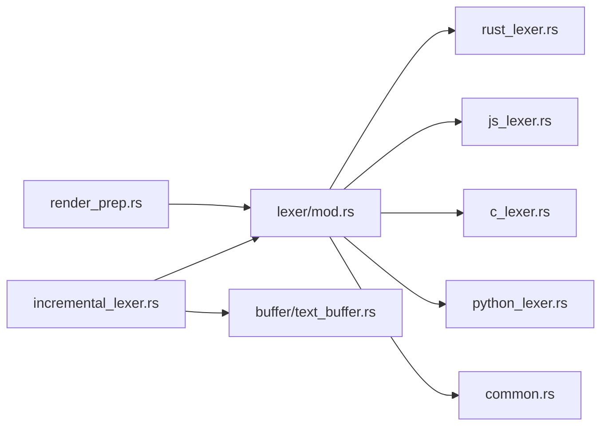

# 词法分析器框架

<cite>
**本文引用的文件**   
- [crates/aether-core/src/lexer/mod.rs](file://crates/aether-core/src/lexer/mod.rs)
- [crates/aether-core/src/incremental_lexer.rs](file://crates/aether-core/src/incremental_lexer.rs)
- [crates/aether-core/src/buffer/text_buffer.rs](file://crates/aether-core/src/buffer/text_buffer.rs)
- [crates/aether-core/src/lexer/rust_lexer.rs](file://crates/aether-core/src/lexer/rust_lexer.rs)
- [crates/aether-core/src/lexer/js_lexer.rs](file://crates/aether-core/src/lexer/js_lexer.rs)
- [crates/aether-core/src/lexer/c_lexer.rs](file://crates/aether-core/src/lexer/c_lexer.rs)
- [crates/aether-core/src/lexer/python_lexer.rs](file://crates/aether-core/src/lexer/python_lexer.rs)
- [crates/aether-core/src/lexer/common.rs](file://crates/aether-core/src/lexer/common.rs)
- [crates/aether-core/src/render_prep.rs](file://crates/aether-core/src/render_prep.rs)
- [crates/aether-core/benches/lexer_bench.rs](file://crates/aether-core/benches/lexer_bench.rs)
</cite>

## 目录
1. [简介](#简介)
2. [项目结构](#项目结构)
3. [核心组件](#核心组件)
4. [架构总览](#架构总览)
5. [详细组件分析](#详细组件分析)
6. [依赖关系分析](#依赖关系分析)
7. [性能考量](#性能考量)
8. [故障排查指南](#故障排查指南)
9. [结论](#结论)
10. [附录：新语言接入与示例](#附录新语言接入与示例)

## 简介
本技术文档面向牧羊人编辑器的词法分析器框架，系统性阐述 Lexer trait 的统一接口设计、多语言扩展机制、增量词法分析原理（变更检测、部分重分析与缓存策略）、Token 流处理、语法高亮映射与错误恢复机制。同时提供新语言支持的开发指南、性能优化技巧与调试方法，并通过具体代码路径展示如何实现自定义词法分析器。

## 项目结构
词法分析相关代码集中在 aether-core 库中，采用“统一接口 + 多实现”的模块化组织方式：
- 统一接口与类型定义位于 lexer 模块
- 各语言词法分析器按语言分文件实现
- 增量词法分析器独立于语言实现，负责行级缓存与失效更新
- 渲染预处理模块提供并行 token 预计算与可见行缓存
- 文本缓冲区抽象为增量更新提供 EditResult 等元数据

图表来源
- [crates/aether-core/src/lexer/mod.rs:1-182](file://crates/aether-core/src/lexer/mod.rs#L1-L182)
- [crates/aether-core/src/incremental_lexer.rs:1-130](file://crates/aether-core/src/incremental_lexer.rs#L1-L130)
- [crates/aether-core/src/render_prep.rs:1-67](file://crates/aether-core/src/render_prep.rs#L1-L67)
- [crates/aether-core/src/buffer/text_buffer.rs:142-171](file://crates/aether-core/src/buffer/text_buffer.rs#L142-L171)

章节来源
- [crates/aether-core/src/lexer/mod.rs:1-182](file://crates/aether-core/src/lexer/mod.rs#L1-L182)
- [crates/aether-core/src/incremental_lexer.rs:1-130](file://crates/aether-core/src/incremental_lexer.rs#L1-L130)
- [crates/aether-core/src/render_prep.rs:1-67](file://crates/aether-core/src/render_prep.rs#L1-L67)
- [crates/aether-core/src/buffer/text_buffer.rs:142-171](file://crates/aether-core/src/buffer/text_buffer.rs#L142-L171)

## 核心组件
- Lexer trait 与 TokenKind/LexemeSpan：跨语言的统一接口与数据结构
- Language 枚举与静态分发：根据扩展名或路径选择语言并创建对应 Lexer
- 增量词法分析器 IncrementalLexer：行级缓存与基于 EditResult 的部分重分析
- 增量管理器 IncrementalLexerManager：多文件缓存管理与上限保护
- 并行渲染预处理 ParallelRenderPrep：rayon 并行 token 预计算与 RenderCache 可见行缓存
- 共享工具 common：跳过空白、注释、字符串、标识符、数字等通用扫描函数

章节来源
- [crates/aether-core/src/lexer/mod.rs:1-182](file://crates/aether-core/src/lexer/mod.rs#L1-L182)
- [crates/aether-core/src/incremental_lexer.rs:1-130](file://crates/aether-core/src/incremental_lexer.rs#L1-L130)
- [crates/aether-core/src/render_prep.rs:1-67](file://crates/aether-core/src/render_prep.rs#L1-L67)
- [crates/aether-core/src/lexer/common.rs:1-151](file://crates/aether-core/src/lexer/common.rs#L1-L151)

## 架构总览
整体流程：编辑器对文本进行编辑后，通过 TextBuffer 提供的 EditResult 描述受影响行范围；IncrementalLexer 依据该范围仅重新分析受影响的行，其余行从缓存读取；渲染阶段使用 RenderCache 缓存可见行的文本与 token，避免重复计算；语言无关的 Lexer trait 保证新增语言只需实现 lex_full 即可接入。

图表来源
- [crates/aether-core/src/incremental_lexer.rs:43-101](file://crates/aether-core/src/incremental_lexer.rs#L43-L101)
- [crates/aether-core/src/lexer/mod.rs:144-182](file://crates/aether-core/src/lexer/mod.rs#L144-L182)
- [crates/aether-core/src/render_prep.rs:36-61](file://crates/aether-core/src/render_prep.rs#L36-L61)
- [crates/aether-core/src/buffer/text_buffer.rs:142-171](file://crates/aether-core/src/buffer/text_buffer.rs#L142-L171)

## 详细组件分析

### Lexer trait 与统一接口
- 统一接口：Lexer::lex_full(text) -> Vec<LexemeSpan>，单行全量分析，便于行级缓存与增量更新
- 统一 Token 类型：TokenKind 覆盖关键字、标识符、字符串、字符、数字、注释、运算符、分隔符、属性、类型名、函数名、宏、生命周期、泛型、正则、格式化字符串、Markdown 标题/链接/代码/强调、JSON 键、TOML 表头、空白、换行、未知、EOF
- 跨度结构：LexemeSpan{start,len,kind,flags}，以字节偏移记录位置与长度，flags 预留扩展位
- 语言识别：Language::from_extension/from_path 将扩展名映射到语言；Language::create_lexer 动态创建 Lexer；Language::lex_full 静态分发避免 Box 分配与动态分发开销

图表来源
- [crates/aether-core/src/lexer/mod.rs:1-182](file://crates/aether-core/src/lexer/mod.rs#L1-L182)

章节来源
- [crates/aether-core/src/lexer/mod.rs:1-182](file://crates/aether-core/src/lexer/mod.rs#L1-L182)

### 多语言支持与扩展机制
- 语言映射：Language::from_extension 支持 C/C++、Rust、Python、JS/TS、Go/Java（复用C）、JSON、Markdown、TOML、HTML、CSS（复用HTML）、PlainText、Image
- 工厂模式：Language::create_lexer 根据语言实例化对应 Lexer；Language::lex_full 直接静态分发，减少运行时开销
- 扩展点：新增语言时，在 Language 中添加分支并实现 Lexer trait 即可接入

章节来源
- [crates/aether-core/src/lexer/mod.rs:98-182](file://crates/aether-core/src/lexer/mod.rs#L98-L182)

### 增量词法分析原理
- 行级缓存：IncrementalLexer 维护 line_tokens: Vec<Vec<LexemeSpan>>，行号即索引，O(1) 访问
- 版本控制：version 自增用于失效检测
- 变更检测：update_for_edit 接收 EditResult，计算受影响行范围，调整行数（splice/drain），resize 对齐 lines 长度，仅对 dirty_start..dirty_end 重新分析
- 新增行处理：当 line_delta > 0 时，额外分析新增行
- 获取接口：get_line_tokens/get_all_tokens/version/clear/cache_stats

图表来源
- [crates/aether-core/src/incremental_lexer.rs:43-101](file://crates/aether-core/src/incremental_lexer.rs#L43-L101)
- [crates/aether-core/src/buffer/text_buffer.rs:142-171](file://crates/aether-core/src/buffer/text_buffer.rs#L142-L171)

章节来源
- [crates/aether-core/src/incremental_lexer.rs:1-130](file://crates/aether-core/src/incremental_lexer.rs#L1-L130)
- [crates/aether-core/src/buffer/text_buffer.rs:142-171](file://crates/aether-core/src/buffer/text_buffer.rs#L142-L171)

### Token 流处理与语法高亮映射
- Token 流：每个 Lexer 实现 lex_full，逐字符扫描生成 LexemeSpan 序列
- 高亮映射：上层渲染层可根据 TokenKind 映射到主题颜色/样式；LexemeSpan.flags 可携带额外标记（如是否闭合、作用域等）
- 并行预处理：ParallelRenderPrep.prepare_tokens_parallel 使用 rayon 并行 map 对可见行进行 token 预计算，小行数回退单线程
- 渲染缓存：RenderCache 缓存可见行文本与 token_lines，结合 version 判断失效

章节来源
- [crates/aether-core/src/render_prep.rs:1-125](file://crates/aether-core/src/render_prep.rs#L1-L125)
- [crates/aether-core/src/lexer/mod.rs:1-182](file://crates/aether-core/src/lexer/mod.rs#L1-L182)

### 错误恢复机制
- 未终止注释：Rust 块注释 skip_block_comment 在未闭合时将 i 推进到末尾，避免残余字节导致后续产生异常 token
- 未终止字符串：common::skip_quoted 遇到不匹配引号会吞到文本末尾，防止越界
- UTF-8 安全推进：未知字符使用 utf8_char_len 按完整字符推进，避免中文/emoji 被拆散导致高亮错位
- JS 正则上下文：JsLexer 在 / 处向前查找最近非空白字符判定是否为正则表达式上下文，避免误判

章节来源
- [crates/aether-core/src/lexer/rust_lexer.rs:461-481](file://crates/aether-core/src/lexer/rust_lexer.rs#L461-L481)
- [crates/aether-core/src/lexer/common.rs:42-55](file://crates/aether-core/src/lexer/common.rs#L42-L55)
- [crates/aether-core/src/lexer/mod.rs:223-233](file://crates/aether-core/src/lexer/mod.rs#L223-L233)
- [crates/aether-core/src/lexer/js_lexer.rs:77-140](file://crates/aether-core/src/lexer/js_lexer.rs#L77-L140)

### 具体语言实现要点
- RustLexer：支持 doc comment 区分、属性、生命周期、宏调用、嵌套块注释、数字进制前缀与后缀、范围语法防合并
- JsLexer：支持模板字符串、正则表达式、BigInt 后缀、可选链与空值合并、三字符运算符
- CLexer：支持预处理指令、doc comment、浮点/整数后缀、十六进制/二进制前缀
- PythonLexer：支持 f-string、三重引号、虚数后缀、装饰器标点

章节来源
- [crates/aether-core/src/lexer/rust_lexer.rs:1-769](file://crates/aether-core/src/lexer/rust_lexer.rs#L1-L769)
- [crates/aether-core/src/lexer/js_lexer.rs:1-778](file://crates/aether-core/src/lexer/js_lexer.rs#L1-L778)
- [crates/aether-core/src/lexer/c_lexer.rs:1-542](file://crates/aether-core/src/lexer/c_lexer.rs#L1-L542)
- [crates/aether-core/src/lexer/python_lexer.rs:1-545](file://crates/aether-core/src/lexer/python_lexer.rs#L1-L545)

## 依赖关系分析
- 耦合与内聚：
  - Lexer trait 与各语言实现解耦，内聚于各自文件
  - IncrementalLexer 依赖 Language 与 EditResult，低耦合
  - render_prep 依赖 Language 与 LexemeSpan，无状态，易测试
- 外部依赖：
  - rayon 用于并行预处理
  - 标准库集合用于管理多文件缓存
- 潜在循环依赖：当前结构无循环导入

图表来源
- [crates/aether-core/src/lexer/mod.rs:1-182](file://crates/aether-core/src/lexer/mod.rs#L1-L182)
- [crates/aether-core/src/incremental_lexer.rs:1-130](file://crates/aether-core/src/incremental_lexer.rs#L1-L130)
- [crates/aether-core/src/render_prep.rs:1-67](file://crates/aether-core/src/render_prep.rs#L1-L67)
- [crates/aether-core/src/buffer/text_buffer.rs:142-171](file://crates/aether-core/src/buffer/text_buffer.rs#L142-L171)

章节来源
- [crates/aether-core/src/lexer/mod.rs:1-182](file://crates/aether-core/src/lexer/mod.rs#L1-L182)
- [crates/aether-core/src/incremental_lexer.rs:1-130](file://crates/aether-core/src/incremental_lexer.rs#L1-L130)
- [crates/aether-core/src/render_prep.rs:1-67](file://crates/aether-core/src/render_prep.rs#L1-L67)
- [crates/aether-core/src/buffer/text_buffer.rs:142-171](file://crates/aether-core/src/buffer/text_buffer.rs#L142-L171)

## 性能考量
- 静态分发优先：Language::lex_full 直接调用具体 Lexer，避免 Box 分配与动态分发
- 行级缓存：IncrementalLexer 仅重分析受影响行，大幅降低频繁编辑时的开销
- 并行预处理：ParallelRenderPrep 对小行数回退单线程，大行数使用 rayon 并行 map，自动分块
- 内存布局：Vec 连续存储，O(1) 行访问，splice/drain 比 HashMap 重建更高效
- 基准测试：benchmarks 提供跨语言样本，衡量吞吐与时间

章节来源
- [crates/aether-core/src/lexer/mod.rs:165-182](file://crates/aether-core/src/lexer/mod.rs#L165-L182)
- [crates/aether-core/src/incremental_lexer.rs:1-130](file://crates/aether-core/src/incremental_lexer.rs#L1-L130)
- [crates/aether-core/src/render_prep.rs:36-61](file://crates/aether-core/src/render_prep.rs#L36-L61)
- [crates/aether-core/benches/lexer_bench.rs:136-162](file://crates/aether-core/benches/lexer_bench.rs#L136-L162)

## 故障排查指南
- 症状：高亮错位或崩溃
  - 检查未知字符推进逻辑是否使用 utf8_char_len
  - 确认字符串/注释跳过函数边界条件（末尾反斜杠、未闭合）
- 症状：大量文件打开后内存增长
  - 检查 IncrementalLexerManager 的 MAX_INCREMENTAL_LEXER_FILES 上限保护是否生效
- 症状：性能退化
  - 确认 RenderCache 版本失效是否正确触发
  - 评估行数阈值是否进入并行预处理
- 建议调试手段
  - 使用 cache_stats 查看缓存命中率
  - 运行 benchmarks 对比不同语言样本的性能
  - 针对特定语言添加单元测试覆盖边界情况

章节来源
- [crates/aether-core/src/incremental_lexer.rs:125-129](file://crates/aether-core/src/incremental_lexer.rs#L125-L129)
- [crates/aether-core/src/incremental_lexer.rs:139-141](file://crates/aether-core/src/incremental_lexer.rs#L139-L141)
- [crates/aether-core/src/render_prep.rs:96-125](file://crates/aether-core/src/render_prep.rs#L96-L125)
- [crates/aether-core/benches/lexer_bench.rs:136-162](file://crates/aether-core/benches/lexer_bench.rs#L136-L162)

## 结论
该词法分析器框架通过统一的 Lexer trait 与 TokenKind/LexemeSpan 实现了跨语言的高内聚、低耦合设计；增量词法分析基于 EditResult 的行级缓存与版本控制，显著提升了编辑响应性；并行预处理与渲染缓存进一步优化了渲染性能。新增语言仅需实现 lex_full 并在 Language 中注册即可无缝集成。

## 附录：新语言接入与示例
- 步骤
  - 新建语言实现文件，例如 my_lexer.rs，实现 Lexer trait 的 lex_full
  - 在 lexer/mod.rs 的 Language 枚举中添加新语言分支，并在 create_lexer/lex_full 中注册
  - 在 from_extension/from_path 中增加扩展名映射
  - 编写单元测试验证关键字、字符串、注释、数字、运算符等
- 参考实现路径
  - 统一接口与语言注册：[crates/aether-core/src/lexer/mod.rs:98-182](file://crates/aether-core/src/lexer/mod.rs#L98-L182)
  - 语言实现参考：
    - [crates/aether-core/src/lexer/rust_lexer.rs:1-769](file://crates/aether-core/src/lexer/rust_lexer.rs#L1-L769)
    - [crates/aether-core/src/lexer/js_lexer.rs:1-778](file://crates/aether-core/src/lexer/js_lexer.rs#L1-L778)
    - [crates/aether-core/src/lexer/c_lexer.rs:1-542](file://crates/aether-core/src/lexer/c_lexer.rs#L1-L542)
    - [crates/aether-core/src/lexer/python_lexer.rs:1-545](file://crates/aether-core/src/lexer/python_lexer.rs#L1-L545)
  - 共享工具函数：[crates/aether-core/src/lexer/common.rs:1-151](file://crates/aether-core/src/lexer/common.rs#L1-L151)
- 增量与渲染集成
  - 增量更新入口：[crates/aether-core/src/incremental_lexer.rs:43-101](file://crates/aether-core/src/incremental_lexer.rs#L43-L101)
  - 并行预处理与缓存：[crates/aether-core/src/render_prep.rs:36-125](file://crates/aether-core/src/render_prep.rs#L36-L125)
- 性能基准
  - 基准样例与分组：[crates/aether-core/benches/lexer_bench.rs:136-162](file://crates/aether-core/benches/lexer_bench.rs#L136-L162)