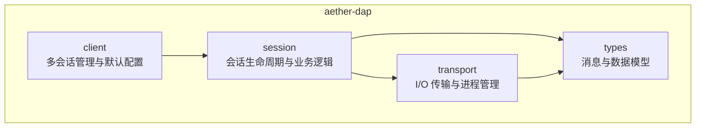
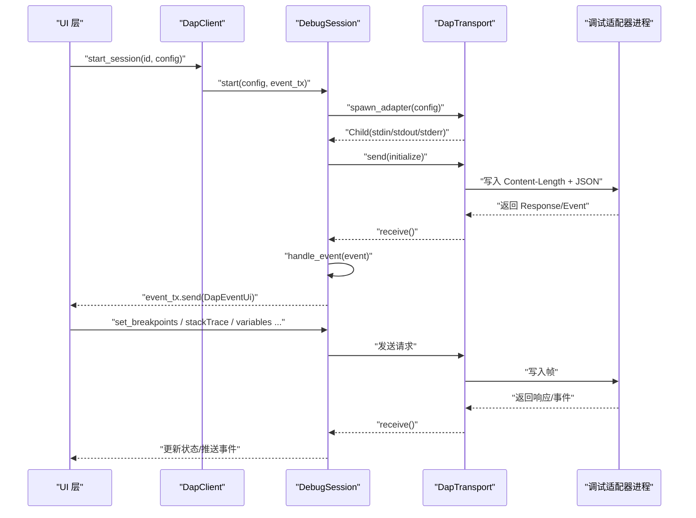
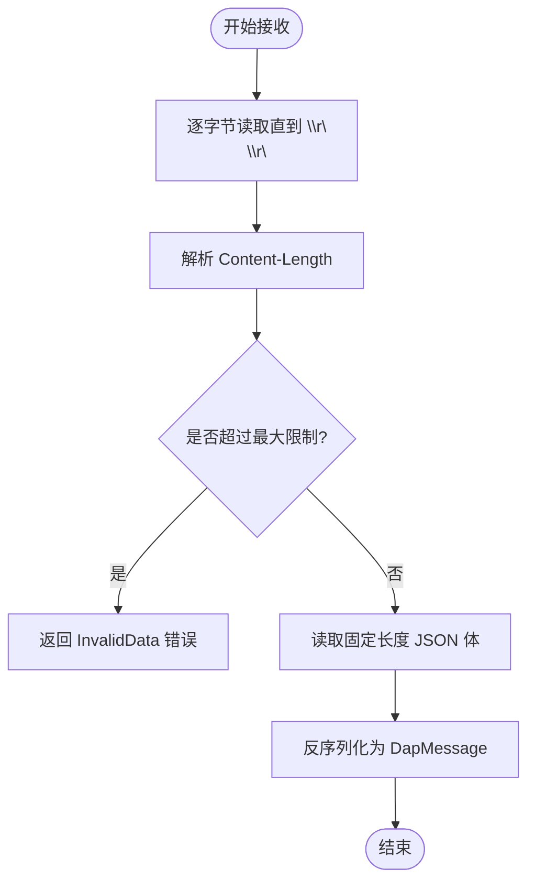
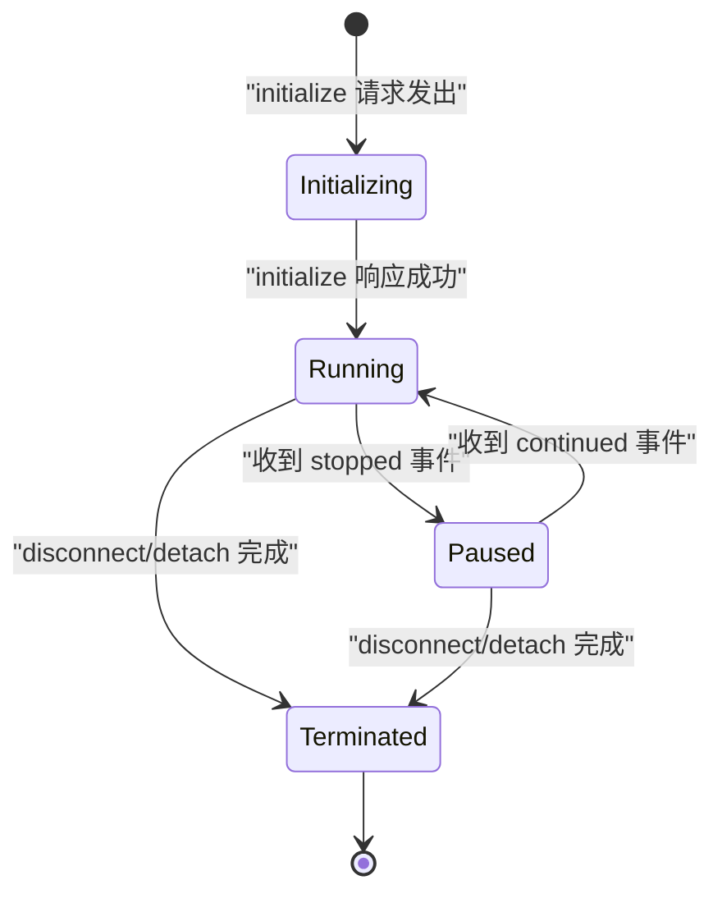
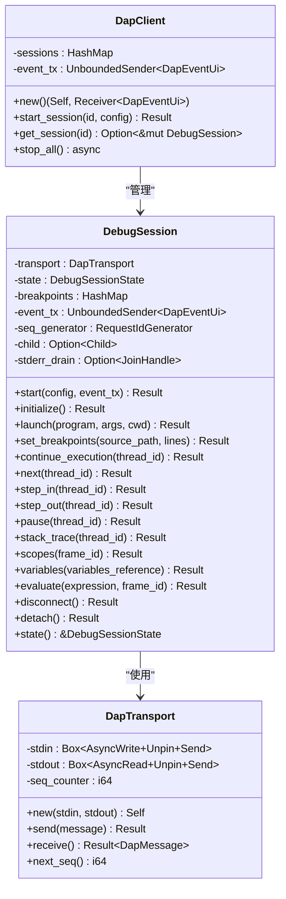
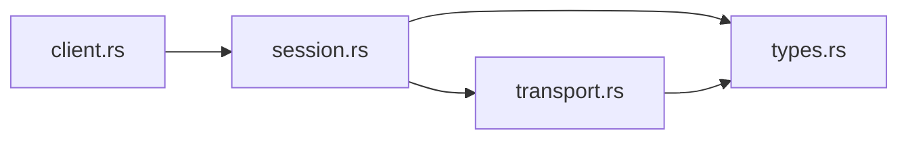

# DAP 调试适配器协议

<cite>
**本文引用的文件列表**
- [crates/aether-dap/src/lib.rs](file://crates/aether-dap/src/lib.rs)
- [crates/aether-dap/src/types.rs](file://crates/aether-dap/src/types.rs)
- [crates/aether-dap/src/transport.rs](file://crates/aether-dap/src/transport.rs)
- [crates/aether-dap/src/session.rs](file://crates/aether-dap/src/session.rs)
- [crates/aether-dap/src/client.rs](file://crates/aether-dap/src/client.rs)
- [crates/aether-dap/Cargo.toml](file://crates/aether-dap/Cargo.toml)
- [Cargo.toml](file://Cargo.toml)
- [README.md](file://README.md)
</cite>

## 目录
1. [简介](#简介)
2. [项目结构](#项目结构)
3. [核心组件](#核心组件)
4. [架构总览](#架构总览)
5. [详细组件分析](#详细组件分析)
6. [依赖关系分析](#依赖关系分析)
7. [性能与可靠性](#性能与可靠性)
8. [故障排查指南](#故障排查指南)
9. [结论](#结论)
10. [附录：配置模板与扩展开发](#附录配置模板与扩展开发)

## 简介
本文件面向“DAP 调试适配器协议”在 Aether Studio 中的客户端实现，系统性阐述通信机制、消息序列化、事件处理、会话生命周期管理、状态同步（线程、调用栈、变量作用域）、错误处理与异常恢复策略，并提供调试器配置模板、支持的调试器类型以及扩展开发指南。文档同时包含调试日志分析、性能监控建议与常见问题解决方案，帮助读者快速理解并基于现有代码进行二次开发与集成。

## 项目结构
aether-dap 模块采用分层设计：
- types：定义 DAP 消息模型、调试对象模型与会话状态等基础类型
- transport：负责标准输入输出传输层，实现 JSON-RPC 帧的编解码与进程启动
- session：封装单个调试会话的生命周期、请求-响应编排、事件分发与资源清理
- client：多会话管理与默认适配器发现

图表来源
- [crates/aether-dap/src/lib.rs:1-8](file://crates/aether-dap/src/lib.rs#L1-L8)
- [crates/aether-dap/src/types.rs:1-177](file://crates/aether-dap/src/types.rs#L1-L177)
- [crates/aether-dap/src/transport.rs:1-162](file://crates/aether-dap/src/transport.rs#L1-L162)
- [crates/aether-dap/src/session.rs:1-133](file://crates/aether-dap/src/session.rs#L1-L133)
- [crates/aether-dap/src/client.rs:1-43](file://crates/aether-dap/src/client.rs#L1-L43)

章节来源
- [crates/aether-dap/src/lib.rs:1-8](file://crates/aether-dap/src/lib.rs#L1-L8)
- [Cargo.toml:1-14](file://Cargo.toml#L1-L14)
- [README.md:29-46](file://README.md#L29-L46)

## 核心组件
- 消息与数据模型（types）
  - DapMessage：统一的消息枚举，按 type 字段分派为 Request/Response/Event
  - DapRequest/DapResponse/DapEvent：分别对应请求、响应与事件的结构体
  - Breakpoint/Source/StackFrame/Scope/Variable：调试对象模型
  - DebugSessionState：会话状态机（初始化、运行、暂停、停止、终止）
  - AdapterConfig：调试适配器进程启动配置（命令、参数、环境变量、工作目录）
  - DapEventUi：推送到 UI 的事件抽象（如 stopped/continued/output/breakpoint 验证等）

- 传输层（transport）
  - DapTransport：基于标准输入输出的 DAP 帧读写，Content-Length 头 + JSON 体
  - spawn_adapter：根据 AdapterConfig 启动外部调试适配器子进程
  - spawn_stderr_drain：后台读取 stderr，避免管道阻塞导致适配器卡死

- 会话层（session）
  - DebugSession：封装单个调试适配器的完整生命周期
  - initialize/launch：初始化与启动流程，含超时控制与事件插播处理
  - set_breakpoints/stack_trace/scopes/variables/evaluate：常用调试操作
  - continue_execution/next/step_in/step_out/pause：执行控制
  - disconnect/detach：断开或分离，确保子进程回收与僵尸进程防护
  - handle_event：事件路由与状态同步，向 UI 推送 DapEventUi

- 客户端（client）
  - DapClient：维护多个调试会话，提供 start_session/get_session/stop_all
  - default_adapter_config：按语言 ID 返回默认适配器配置（如 lldb-dap、debugpy.adapter、node-debug2-adapter）

章节来源
- [crates/aether-dap/src/types.rs:1-177](file://crates/aether-dap/src/types.rs#L1-L177)
- [crates/aether-dap/src/transport.rs:1-162](file://crates/aether-dap/src/transport.rs#L1-L162)
- [crates/aether-dap/src/session.rs:1-133](file://crates/aether-dap/src/session.rs#L1-L133)
- [crates/aether-dap/src/client.rs:1-71](file://crates/aether-dap/src/client.rs#L1-L71)

## 架构总览
下图展示了编辑器通过 aether-dap 与外部调试适配器进程的交互路径，包括进程启动、JSON-RPC 帧传输、事件驱动的状态同步与 UI 通知。

图表来源
- [crates/aether-dap/src/client.rs:24-43](file://crates/aether-dap/src/client.rs#L24-L43)
- [crates/aether-dap/src/session.rs:40-133](file://crates/aether-dap/src/session.rs#L40-L133)
- [crates/aether-dap/src/transport.rs:17-93](file://crates/aether-dap/src/transport.rs#L17-L93)
- [crates/aether-dap/src/transport.rs:118-142](file://crates/aether-dap/src/transport.rs#L118-L142)

## 详细组件分析

### 传输层：标准输入输出帧与安全性
- 帧格式：Content-Length 头 + 空行 + JSON 体；发送时先写头再写体并 flush
- 接收流程：逐字节读取直到遇到 \r\n\r\n，解析 Content-Length，校验最大长度限制，再读取固定长度的 JSON 体并反序列化为 DapMessage
- 安全与健壮性：
  - 头部长度上限保护，防止恶意超长头
  - 消息体大小上限保护，拒绝超大内容，避免 OOM
  - 反序列化失败返回 InvalidData，便于上层统一错误处理
- 进程管理：
  - spawn_adapter 使用 tokio::process::Command 启动外部调试适配器，支持 args/env/cwd
  - spawn_stderr_drain 后台持续读取 stderr，避免缓冲区满导致适配器阻塞

图表来源
- [crates/aether-dap/src/transport.rs:40-93](file://crates/aether-dap/src/transport.rs#L40-L93)
- [crates/aether-dap/src/transport.rs:118-142](file://crates/aether-dap/src/transport.rs#L118-L142)

章节来源
- [crates/aether-dap/src/transport.rs:1-162](file://crates/aether-dap/src/transport.rs#L1-L162)

### 会话层：生命周期与状态同步
- 启动与初始化
  - start：根据 AdapterConfig 启动适配器进程，创建 DapTransport，启动 stderr drain，发送 initialize 请求并等待响应，期间可处理事件
  - initialize：构造 initialize 参数，发送请求，循环接收消息，匹配 initialize 响应成功则进入 Running 状态
- 启动调试程序
  - launch：发送 launch 请求，携带 program/args/cwd，等待响应成功，期间处理事件
- 断点设置
  - set_breakpoints：发送 setBreakpoints 请求，解析 breakpoints 数组返回
- 执行控制
  - continue_execution/next/step_in/step_out/pause：通过 send_simple_request 发送简单请求，检查 success 字段
- 堆栈与作用域
  - stack_trace：获取当前线程的调用栈帧
  - scopes：获取指定帧的作用域列表
  - variables：根据 variables_reference 获取变量
- 表达式求值
  - evaluate：在指定 frameId 上下文下求值表达式
- 断开与分离
  - disconnect：发送 terminateDebuggee=true 的 disconnect，随后 finalize_child 等待或强制 kill 子进程
  - detach：发送 terminateDebuggee=false 的 disconnect，保留被调试进程但回收适配器进程
- 事件处理与状态同步
  - handle_event：将 stopped/continued/exited/terminated/output/breakpoint 等事件转换为内部状态变化与 UI 事件
  - H-11：已终止会话忽略非终止类事件，防止“复活”

图表来源
- [crates/aether-dap/src/session.rs:80-133](file://crates/aether-dap/src/session.rs#L80-L133)
- [crates/aether-dap/src/session.rs:135-198](file://crates/aether-dap/src/session.rs#L135-L198)
- [crates/aether-dap/src/session.rs:600-681](file://crates/aether-dap/src/session.rs#L600-L681)
- [crates/aether-dap/src/session.rs:487-539](file://crates/aether-dap/src/session.rs#L487-L539)

章节来源
- [crates/aether-dap/src/session.rs:1-133](file://crates/aether-dap/src/session.rs#L1-L133)
- [crates/aether-dap/src/session.rs:135-198](file://crates/aether-dap/src/session.rs#L135-L198)
- [crates/aether-dap/src/session.rs:200-485](file://crates/aether-dap/src/session.rs#L200-L485)
- [crates/aether-dap/src/session.rs:487-539](file://crates/aether-dap/src/session.rs#L487-L539)
- [crates/aether-dap/src/session.rs:599-681](file://crates/aether-dap/src/session.rs#L599-L681)

### 客户端：多会话管理与默认适配器发现
- DapClient
  - new：创建事件通道与空会话表
  - start_session：根据 id 和 AdapterConfig 启动 DebugSession 并注册到 sessions
  - get_session：按 id 获取可变会话引用
  - stop_all：遍历所有会话调用 disconnect，然后清空会话表
- 默认适配器配置
  - default_adapter_config：根据语言 ID 返回默认 command/args/env/cwd
    - rust/c/cpp → lldb-dap
    - python → debugpy.adapter
    - javascript/typescript → node + node-debug2-adapter

图表来源
- [crates/aether-dap/src/client.rs:1-43](file://crates/aether-dap/src/client.rs#L1-L43)
- [crates/aether-dap/src/session.rs:24-37](file://crates/aether-dap/src/session.rs#L24-L37)
- [crates/aether-dap/src/transport.rs:11-24](file://crates/aether-dap/src/transport.rs#L11-L24)

章节来源
- [crates/aether-dap/src/client.rs:1-71](file://crates/aether-dap/src/client.rs#L1-L71)

### 数据类型与序列化
- DapMessage 使用 tag = "type" 内部标签，避免 untagged 导致的误判
- 各结构体均实现 Serialize/Deserialize，保证与 DAP 协议的 JSON 兼容
- 测试覆盖 roundtrip 与缺失/未知 type 的错误分支

章节来源
- [crates/aether-dap/src/types.rs:1-177](file://crates/aether-dap/src/types.rs#L1-L177)

## 依赖关系分析
- 模块内依赖
  - client 依赖 session 与 types
  - session 依赖 transport 与 types
  - transport 依赖 types
- 外部依赖
  - serde/serde_json：JSON 序列化与反序列化
  - tokio：异步运行时、进程管理、IO、sync、time
  - tracing：结构化日志（可选）
  - thiserror：错误类型（可选）

图表来源
- [crates/aether-dap/src/lib.rs:1-8](file://crates/aether-dap/src/lib.rs#L1-L8)
- [crates/aether-dap/Cargo.toml:6-16](file://crates/aether-dap/Cargo.toml#L6-L16)

章节来源
- [crates/aether-dap/Cargo.toml:6-16](file://crates/aether-dap/Cargo.toml#L6-L16)

## 性能与可靠性
- 传输层
  - 头部与消息体大小限制，防止内存耗尽
  - 后台 stderr drain，避免管道阻塞导致适配器卡死
- 会话层
  - 请求超时控制：initialize 最长 60 秒，launch 最长 120 秒，其他请求默认 30 秒
  - 状态机校验：禁止对已终止会话重新 launch；忽略延迟的非终止事件
  - 资源回收：disconnect/detach 后等待子进程退出，超时强制 kill；Drop 中尝试 start_kill 防止僵尸进程
- 事件处理
  - 事件与响应解耦，允许在请求等待期间处理事件，提升用户体验
- 可扩展性
  - 通过 AdapterConfig 灵活配置不同调试器，支持多语言默认适配器

[本节为通用指导，不直接分析具体文件]

## 故障排查指南
- 常见错误与定位
  - 缺少 Content-Length 头或 JSON 非法：transport.receive 返回 InvalidData，检查适配器输出是否符合 DAP 帧格式
  - 消息体过大：超过 MAX_CONTENT_LENGTH 会被拒绝，确认适配器未输出超大变量或日志
  - 初始化/启动超时：检查 initialize/launch 响应是否及时到达，必要时调整超时时间
  - 子进程未退出：disconnect/detach 后若适配器未退出，将被强制 kill；检查适配器是否正确处理 disconnect
  - 事件丢失或顺序问题：ensure 事件在 receive 循环中被处理，避免 UI 层阻塞事件通道
- 日志与分析
  - 启用 tracing 记录关键路径（如 initialize、launch、错误分支）
  - 捕获 stderr 输出用于诊断适配器行为
- 连接中断重连
  - 当前实现未内置自动重连；可在上层检测到连接错误后重建会话（restart session）

章节来源
- [crates/aether-dap/src/transport.rs:40-93](file://crates/aether-dap/src/transport.rs#L40-L93)
- [crates/aether-dap/src/session.rs:80-133](file://crates/aether-dap/src/session.rs#L80-L133)
- [crates/aether-dap/src/session.rs:487-539](file://crates/aether-dap/src/session.rs#L487-L539)

## 结论
aether-dap 实现了符合 DAP 规范的客户端基础能力：标准 I/O 传输、JSON-RPC 帧编解码、会话生命周期管理、事件驱动的状态同步与资源回收。其模块化设计与严格的安全边界（头部/消息体限制、超时控制、僵尸进程防护）为后续扩展提供了坚实基础。结合默认适配器发现与多会话管理，开发者可以快速为多种语言添加调试支持。

[本节为总结，不直接分析具体文件]

## 附录：配置模板与扩展开发

### 调试器配置模板
- 通用 AdapterConfig 字段
  - command：调试适配器可执行文件或脚本路径
  - args：传递给适配器的命令行参数
  - env：环境变量键值对
  - program：被调试程序的入口（由 launch 传入）
  - cwd：工作目录
- 示例（按语言）
  - Rust/C/C++：command=lldb-dap
  - Python：command=debugpy.adapter
  - JavaScript/TypeScript：command=node，args=["node_modules/.bin/node-debug2-adapter"]

章节来源
- [crates/aether-dap/src/client.rs:45-71](file://crates/aether-dap/src/client.rs#L45-L71)
- [crates/aether-dap/src/types.rs:55-63](file://crates/aether-dap/src/types.rs#L55-L63)

### 支持的调试器类型
- 内置默认适配器发现函数 default_adapter_config 支持以下语言：
  - rust、c、cpp → lldb-dap
  - python → debugpy.adapter
  - javascript、typescript → node + node-debug2-adapter

章节来源
- [crates/aether-dap/src/client.rs:45-71](file://crates/aether-dap/src/client.rs#L45-L71)

### 扩展开发指南
- 新增语言支持
  - 在 default_adapter_config 中添加语言 ID 映射到对应的 command/args/env/cwd
- 自定义会话行为
  - 扩展 DebugSession 方法以支持新的 DAP 请求（如 configurationDone、threads、source、loadedSources 等）
  - 在 handle_event 中增加新事件类型的处理与 UI 事件映射
- 传输层增强
  - 如需 WebSocket 传输，可在 transport 层新增实现，保持与 DapMessage 的兼容性
- 错误处理与日志
  - 使用 tracing 记录关键路径与错误信息
  - 在上层捕获 io::Error 并转化为用户友好的提示

[本节为概念性指导，不直接分析具体文件]