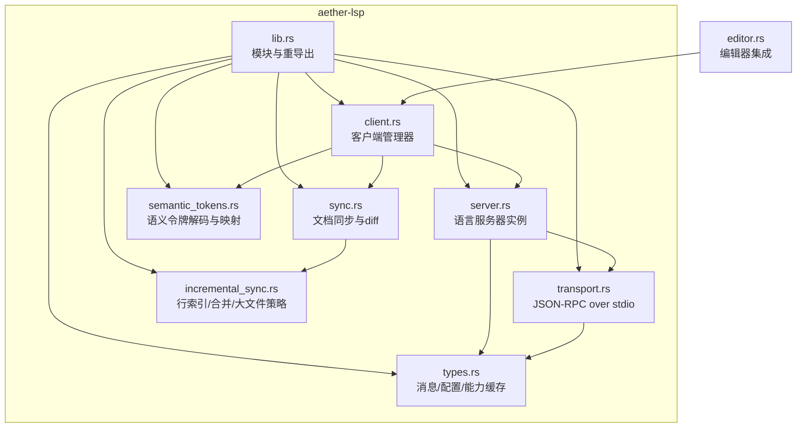
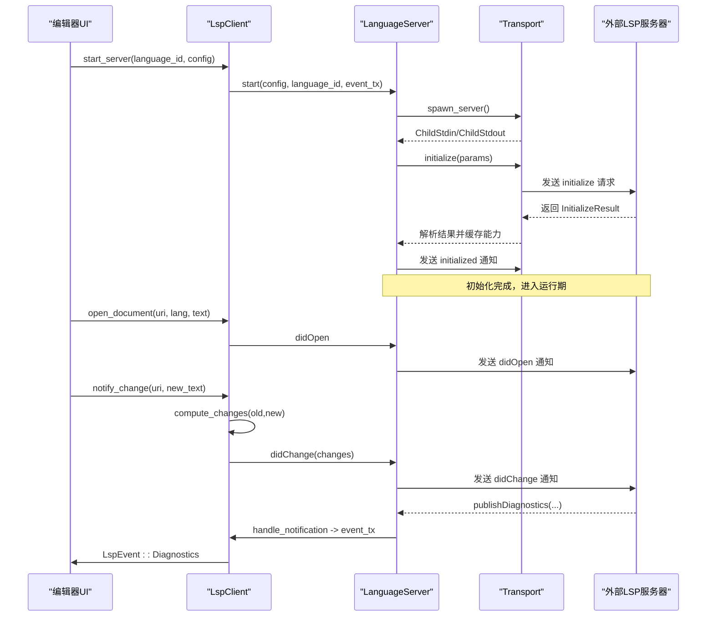
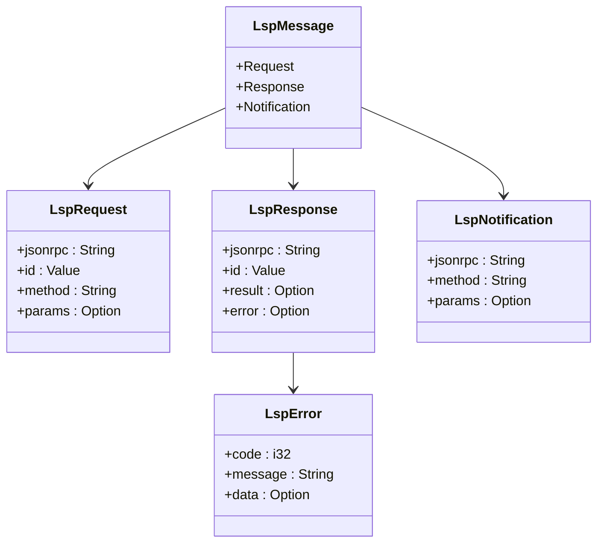
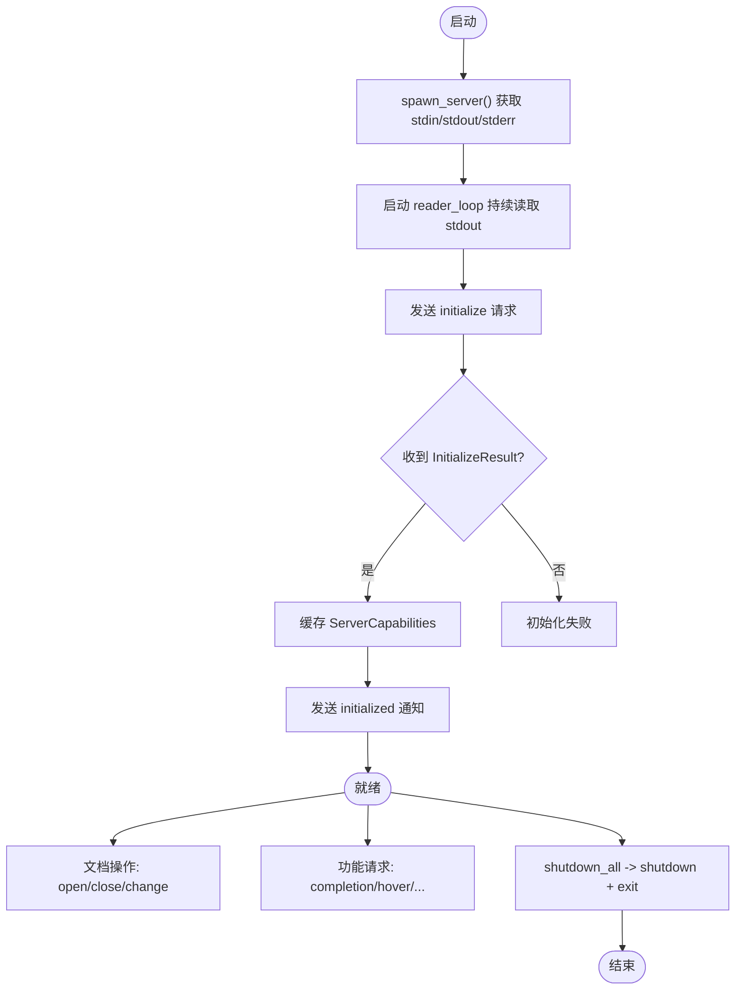
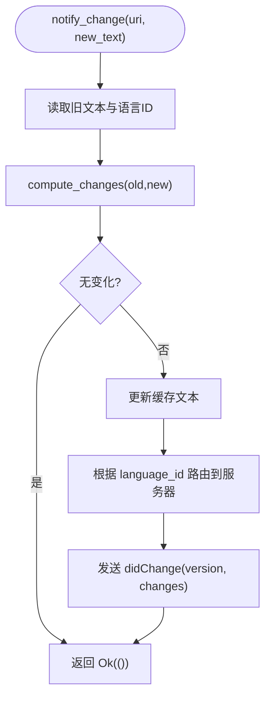
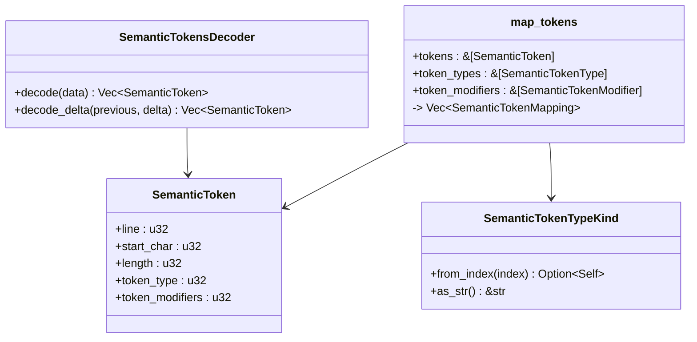
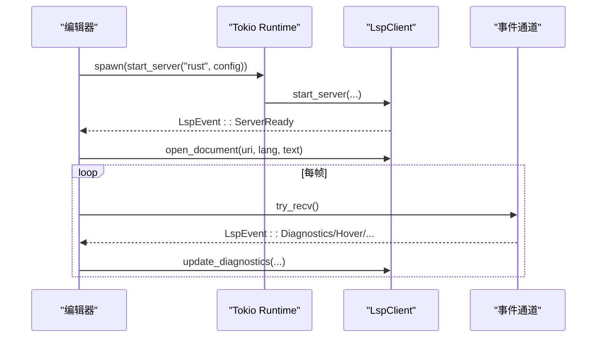
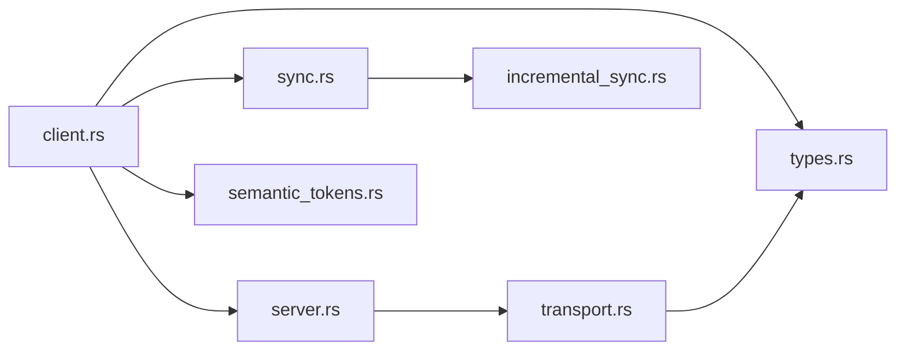

# LSP 客户端实现

<cite>
**本文引用的文件**
- [crates/aether-lsp/src/lib.rs](file://crates/aether-lsp/src/lib.rs)
- [crates/aether-lsp/src/client.rs](file://crates/aether-lsp/src/client.rs)
- [crates/aether-lsp/src/server.rs](file://crates/aether-lsp/src/server.rs)
- [crates/aether-lsp/src/transport.rs](file://crates/aether-lsp/src/transport.rs)
- [crates/aether-lsp/src/types.rs](file://crates/aether-lsp/src/types.rs)
- [crates/aether-lsp/src/sync.rs](file://crates/aether-lsp/src/sync.rs)
- [crates/aether-lsp/src/incremental_sync.rs](file://crates/aether-lsp/src/incremental_sync.rs)
- [crates/aether-lsp/src/semantic_tokens.rs](file://crates/aether-lsp/src/semantic_tokens.rs)
- [crates/aether-win32/src/editor.rs](file://crates/aether-win32/src/editor.rs)
</cite>

## 目录
1. [简介](#简介)
2. [项目结构](#项目结构)
3. [核心组件](#核心组件)
4. [架构总览](#架构总览)
5. [详细组件分析](#详细组件分析)
6. [依赖关系分析](#依赖关系分析)
7. [性能考量](#性能考量)
8. [故障排查指南](#故障排查指南)
9. [结论](#结论)
10. [附录](#附录)

## 简介
本技术文档围绕 aether-lsp 子模块，系统化阐述 LSP 客户端的实现与集成。内容覆盖：
- JSON-RPC 消息格式、请求-响应模式与通知处理
- 客户端生命周期管理（启动、能力协商、会话终止）
- 增量同步机制（文本变更检测、差异计算、高效传输）
- 语义令牌系统（类型映射、高亮渲染、性能优化）
- 错误处理策略、重试机制与连接恢复逻辑
- 配置示例、调试技巧与常见问题解决方案

## 项目结构
aether-lsp 采用按职责划分的模块化设计，核心文件如下：
- lib.rs：对外暴露模块与类型重导出
- client.rs：LSP 客户端管理器，负责多语言服务器实例路由、事件分发与诊断缓存
- server.rs：单个语言服务器的生命周期管理与协议交互
- transport.rs：JSON-RPC over stdio 的编解码与进程通信
- types.rs：JSON-RPC 消息、配置、能力缓存等基础类型
- sync.rs：文档状态与基于字节级 diff 的增量变更计算
- incremental_sync.rs：高性能行索引、编辑合并与大文件策略
- semantic_tokens.rs：语义令牌解码、类型映射与修饰符解析

图表来源
- [crates/aether-lsp/src/lib.rs:1-16](file://crates/aether-lsp/src/lib.rs#L1-L16)
- [crates/aether-lsp/src/client.rs:1-120](file://crates/aether-lsp/src/client.rs#L1-L120)
- [crates/aether-lsp/src/server.rs:1-125](file://crates/aether-lsp/src/server.rs#L1-L125)
- [crates/aether-lsp/src/transport.rs:1-120](file://crates/aether-lsp/src/transport.rs#L1-L120)
- [crates/aether-lsp/src/types.rs:1-120](file://crates/aether-lsp/src/types.rs#L1-L120)
- [crates/aether-lsp/src/sync.rs:1-120](file://crates/aether-lsp/src/sync.rs#L1-L120)
- [crates/aether-lsp/src/incremental_sync.rs:1-120](file://crates/aether-lsp/src/incremental_sync.rs#L1-L120)
- [crates/aether-lsp/src/semantic_tokens.rs:1-120](file://crates/aether-lsp/src/semantic_tokens.rs#L1-L120)
- [crates/aether-win32/src/editor.rs:6466-6527](file://crates/aether-win32/src/editor.rs#L6466-L6527)

章节来源
- [crates/aether-lsp/src/lib.rs:1-16](file://crates/aether-lsp/src/lib.rs#L1-L16)

## 核心组件
- LspClient：多语言服务器实例管理、文档打开/关闭/变更、诊断缓存、事件通道、能力查询
- LanguageServer：单语言服务器进程管理、initialize/initialized 握手、请求-响应、通知转发、优雅关闭
- Transport：JSON-RPC over stdio 编码/解码、Header 解析、最大长度限制、stderr 管道清理
- Types：LspMessage/LspRequest/LspResponse/LspNotification、ServerConfig、ServerCapabilitiesCache、RequestIdGenerator
- Sync：DocumentSync 文档状态跟踪、compute_changes 字节级 diff 与 UTF-16 位置转换
- IncrementalSync：FastLineIndex 行索引、增量变更生成、相邻编辑合并、大文件策略
- SemanticTokens：语义令牌数组解码、delta 更新应用、类型与修饰符映射

章节来源
- [crates/aether-lsp/src/client.rs:1-120](file://crates/aether-lsp/src/client.rs#L1-L120)
- [crates/aether-lsp/src/server.rs:1-125](file://crates/aether-lsp/src/server.rs#L1-L125)
- [crates/aether-lsp/src/transport.rs:1-120](file://crates/aether-lsp/src/transport.rs#L1-L120)
- [crates/aether-lsp/src/types.rs:1-120](file://crates/aether-lsp/src/types.rs#L1-L120)
- [crates/aether-lsp/src/sync.rs:1-120](file://crates/aether-lsp/src/sync.rs#L1-L120)
- [crates/aether-lsp/src/incremental_sync.rs:1-120](file://crates/aether-lsp/src/incremental_sync.rs#L1-L120)
- [crates/aether-lsp/src/semantic_tokens.rs:1-120](file://crates/aether-lsp/src/semantic_tokens.rs#L1-L120)

## 架构总览
整体架构由“编辑器 UI -> LspClient -> LanguageServer -> Transport -> 外部 LSP 服务器”构成。关键特性：
- 每个语言服务器独立进程，stdin/stdout 通过 JSON-RPC 通信
- 后台 reader task 独占 stdout，避免 send/receive 互锁
- 请求-响应通过 oneshot channel 配对；通知直接转发到 UI 层事件通道
- 文档同步使用字节级 diff + FastLineIndex 精确转换为 LSP Position（UTF-16 码元）
- 语义令牌支持完整数据与 delta 更新，提供类型与修饰符映射

图表来源
- [crates/aether-lsp/src/server.rs:68-124](file://crates/aether-lsp/src/server.rs#L68-L124)
- [crates/aether-lsp/src/server.rs:306-484](file://crates/aether-lsp/src/server.rs#L306-L484)
- [crates/aether-lsp/src/server.rs:507-590](file://crates/aether-lsp/src/server.rs#L507-L590)
- [crates/aether-lsp/src/client.rs:88-142](file://crates/aether-lsp/src/client.rs#L88-L142)
- [crates/aether-lsp/src/client.rs:217-249](file://crates/aether-lsp/src/client.rs#L217-L249)
- [crates/aether-lsp/src/transport.rs:256-301](file://crates/aether-lsp/src/transport.rs#L256-L301)

## 详细组件分析

### LSP 协议通信机制
- JSON-RPC 消息格式：遵循标准 Header + Content-Length + Content-Type + \r\n + JSON body
- 编码/解码：encode_message 将 LspMessage 序列化为 JSON，并附加头部；parse_header_buffer 在原始字节中定位 \r\n\r\n 后解析 Content-Length
- 安全限制：Header 最大 8KB，Content-Length 最大 64MB，防止恶意或异常服务器导致 OOM
- 请求-响应模式：send_request 生成唯一 id，注册 oneshot sender；receive_response 等待匹配 Response，超时则清理 pending sender
- 通知处理：reader_loop 收到 Notification 时调用 handle_notification，转发至 event_tx 推送给 UI

图表来源
- [crates/aether-lsp/src/types.rs:1-120](file://crates/aether-lsp/src/types.rs#L1-L120)
- [crates/aether-lsp/src/transport.rs:212-253](file://crates/aether-lsp/src/transport.rs#L212-L253)

章节来源
- [crates/aether-lsp/src/transport.rs:1-120](file://crates/aether-lsp/src/transport.rs#L1-L120)
- [crates/aether-lsp/src/transport.rs:212-253](file://crates/aether-lsp/src/transport.rs#L212-L253)
- [crates/aether-lsp/src/types.rs:1-120](file://crates/aether-lsp/src/types.rs#L1-L120)

### 客户端生命周期管理
- 启动流程：start_server 创建 LanguageServer，spawn stderr drain，启动 reader_loop，发送 initialize 请求，接收 InitializeResult 并缓存能力，随后发送 initialized 通知
- 能力协商：initialize 参数声明客户端能力（workspace/textDocument/semantic_tokens/inlay_hint 等），服务器返回 ServerCapabilities，客户端缓存为 ServerCapabilitiesCache
- 文档操作：open_document/close_document/change_document 对应 didOpen/didClose/didChange 通知
- 会话终止：shutdown_all 遍历所有服务器，发送 shutdown 请求与 exit 通知，等待子进程退出，必要时 kill

图表来源
- [crates/aether-lsp/src/server.rs:68-124](file://crates/aether-lsp/src/server.rs#L68-L124)
- [crates/aether-lsp/src/server.rs:306-484](file://crates/aether-lsp/src/server.rs#L306-L484)
- [crates/aether-lsp/src/server.rs:662-695](file://crates/aether-lsp/src/server.rs#L662-L695)
- [crates/aether-lsp/src/client.rs:88-112](file://crates/aether-lsp/src/client.rs#L88-L112)

章节来源
- [crates/aether-lsp/src/server.rs:68-124](file://crates/aether-lsp/src/server.rs#L68-L124)
- [crates/aether-lsp/src/server.rs:306-484](file://crates/aether-lsp/src/server.rs#L306-L484)
- [crates/aether-lsp/src/server.rs:662-695](file://crates/aether-lsp/src/server.rs#L662-L695)
- [crates/aether-lsp/src/client.rs:88-112](file://crates/aether-lsp/src/client.rs#L88-L112)

### 增量同步机制
- 文档状态跟踪：DocumentSync 维护 uri -> DocumentState（language_id/version/text）
- 变更检测：compute_changes 基于共同前缀/后缀进行字节级 diff，若变更超过原文 50% 或文件大小超阈值，回退为全文替换
- 位置转换：FastLineIndex 预计算行起始位置，O(log n) 查找行，character 按 UTF-16 码元计数，确保与 LSP 规范一致
- 批量合并：IncrementalChangeCalculator.merge_edits 仅合并真正相邻的编辑（next.start == current.end），避免丢失中间文本
- 版本管理：notify_change 内部递增版本并在发送成功后再递增（H-09），避免失败后版本失步

图表来源
- [crates/aether-lsp/src/client.rs:217-249](file://crates/aether-lsp/src/client.rs#L217-L249)
- [crates/aether-lsp/src/sync.rs:88-148](file://crates/aether-lsp/src/sync.rs#L88-L148)
- [crates/aether-lsp/src/incremental_sync.rs:96-190](file://crates/aether-lsp/src/incremental_sync.rs#L96-L190)
- [crates/aether-lsp/src/incremental_sync.rs:36-79](file://crates/aether-lsp/src/incremental_sync.rs#L36-L79)

章节来源
- [crates/aether-lsp/src/client.rs:217-249](file://crates/aether-lsp/src/client.rs#L217-L249)
- [crates/aether-lsp/src/sync.rs:88-148](file://crates/aether-lsp/src/sync.rs#L88-L148)
- [crates/aether-lsp/src/incremental_sync.rs:96-190](file://crates/aether-lsp/src/incremental_sync.rs#L96-L190)
- [crates/aether-lsp/src/incremental_sync.rs:36-79](file://crates/aether-lsp/src/incremental_sync.rs#L36-L79)

### 语义令牌系统集成
- 解码器：SemanticTokensDecoder.decode 将紧凑 uinteger 数组解码为结构化 token 列表；decode_delta 应用 edits 到现有 token 列表
- 类型映射：SemanticTokenTypeKind 覆盖 LSP 标准 22 种类型；map_tokens 将 token_type 与修饰符位集映射为渲染可用信息
- 性能优化：支持 full/range/delta 三种请求方式；delta 更新减少数据传输与解析开销；LargeFileSyncStrategy 对大文件采用延迟与全量策略

图表来源
- [crates/aether-lsp/src/semantic_tokens.rs:1-120](file://crates/aether-lsp/src/semantic_tokens.rs#L1-L120)
- [crates/aether-lsp/src/semantic_tokens.rs:223-264](file://crates/aether-lsp/src/semantic_tokens.rs#L223-L264)

章节来源
- [crates/aether-lsp/src/semantic_tokens.rs:1-120](file://crates/aether-lsp/src/semantic_tokens.rs#L1-L120)
- [crates/aether-lsp/src/semantic_tokens.rs:223-264](file://crates/aether-lsp/src/semantic_tokens.rs#L223-L264)

### 编辑器集成与事件流
- 编辑器侧在运行时异步启动语言服务器，并通过 LspClient.open_document 通知服务器
- 轮询 LspEvent，将诊断写入 LspClient 缓存与 EditorState.diagnostics，供 UI 渲染
- 默认服务器配置：default_server_config 提供 rust-analyzer/pylsp/typescript-language-server/clangd 等常见语言服务器

图表来源
- [crates/aether-win32/src/editor.rs:6466-6527](file://crates/aether-win32/src/editor.rs#L6466-L6527)
- [crates/aether-lsp/src/client.rs:27-69](file://crates/aether-lsp/src/client.rs#L27-L69)
- [crates/aether-lsp/src/client.rs:606-638](file://crates/aether-lsp/src/client.rs#L606-L638)

章节来源
- [crates/aether-win32/src/editor.rs:6466-6527](file://crates/aether-win32/src/editor.rs#L6466-L6527)
- [crates/aether-lsp/src/client.rs:27-69](file://crates/aether-lsp/src/client.rs#L27-L69)
- [crates/aether-lsp/src/client.rs:606-638](file://crates/aether-lsp/src/client.rs#L606-L638)

## 依赖关系分析
- 模块耦合：
  - client.rs 依赖 server.rs、sync.rs、types.rs、semantic_tokens.rs
  - server.rs 依赖 transport.rs、types.rs
  - transport.rs 依赖 types.rs
  - sync.rs 依赖 incremental_sync.rs
- 外部依赖：
  - lsp-types：LSP 类型定义
  - tokio：异步运行时、进程、IO、同步原语
  - serde/serde_json：序列化/反序列化
  - bytes：缓冲区操作

图表来源
- [crates/aether-lsp/src/client.rs:1-120](file://crates/aether-lsp/src/client.rs#L1-L120)
- [crates/aether-lsp/src/server.rs:1-125](file://crates/aether-lsp/src/server.rs#L1-L125)
- [crates/aether-lsp/src/transport.rs:1-120](file://crates/aether-lsp/src/transport.rs#L1-L120)
- [crates/aether-lsp/src/sync.rs:1-120](file://crates/aether-lsp/src/sync.rs#L1-L120)
- [crates/aether-lsp/src/incremental_sync.rs:1-120](file://crates/aether-lsp/src/incremental_sync.rs#L1-L120)
- [crates/aether-lsp/src/semantic_tokens.rs:1-120](file://crates/aether-lsp/src/semantic_tokens.rs#L1-L120)

章节来源
- [crates/aether-lsp/src/client.rs:1-120](file://crates/aether-lsp/src/client.rs#L1-L120)
- [crates/aether-lsp/src/server.rs:1-125](file://crates/aether-lsp/src/server.rs#L1-L125)
- [crates/aether-lsp/src/transport.rs:1-120](file://crates/aether-lsp/src/transport.rs#L1-L120)
- [crates/aether-lsp/src/sync.rs:1-120](file://crates/aether-lsp/src/sync.rs#L1-L120)
- [crates/aether-lsp/src/incremental_sync.rs:1-120](file://crates/aether-lsp/src/incremental_sync.rs#L1-L120)
- [crates/aether-lsp/src/semantic_tokens.rs:1-120](file://crates/aether-lsp/src/semantic_tokens.rs#L1-L120)

## 性能考量
- 传输层：
  - 拆分 LspWriter 与 LspReader，避免共享锁竞争
  - Header 与 Content-Length 上限保护，防止 OOM
  - stderr 后台 drain，避免子进程阻塞
- 同步层：
  - 字节级 diff + FastLineIndex 精确位置转换，减少无效通知
  - 大文件阈值与变更比例阈值回退为全文替换，降低计算成本
  - 相邻编辑合并，减少消息数量
- 语义令牌：
  - 支持 delta 更新，减少带宽与解析开销
  - 类型与修饰符映射一次性计算，便于渲染缓存

[本节为通用指导，不直接分析具体文件]

## 故障排查指南
- 服务器未启动或二进制缺失：
  - 现象：start_server 返回 io::Error
  - 排查：检查 default_server_config 与 PATH，确认命令存在且可执行
- 初始化超时：
  - 现象：receive_response 超时错误
  - 排查：增大 INITIALIZE_TIMEOUT，检查服务器日志（stderr drain 输出）
- 通知丢失：
  - 现象：publishDiagnostics 未到达 UI
  - 排查：确认 reader_loop 正常、handle_notification 已转发至 event_tx
- 版本失步：
  - 现象：服务器拒绝 didChange
  - 排查：确保 notify_change_raw 在发送成功后再递增版本（H-09）
- 内存占用过高：
  - 现象：大量语义令牌或大文件同步
  - 排查：启用 delta 更新、调整 LargeFileSyncStrategy 阈值

章节来源
- [crates/aether-lsp/src/server.rs:170-216](file://crates/aether-lsp/src/server.rs#L170-L216)
- [crates/aether-lsp/src/server.rs:295-302](file://crates/aether-lsp/src/server.rs#L295-L302)
- [crates/aether-lsp/src/client.rs:252-284](file://crates/aether-lsp/src/client.rs#L252-L284)
- [crates/aether-lsp/src/transport.rs:283-301](file://crates/aether-lsp/src/transport.rs#L283-L301)

## 结论
aether-lsp 实现了稳定高效的 LSP 客户端，具备：
- 健壮的 JSON-RPC over stdio 传输与安全限制
- 清晰的客户端生命周期与能力协商
- 精确的增量同步与高性能行索引
- 完整的语义令牌解码与映射
- 完善的错误处理与调试支持

建议在生产环境中结合编辑器 UI 的事件循环，合理设置超时与阈值，充分利用 delta 更新与合并策略，以获得最佳用户体验。

[本节为总结性内容，不直接分析具体文件]

## 附录

### 配置示例
- 默认服务器配置发现：
  - rust: rust-analyzer
  - python: pylsp
  - typescript/javascript: typescript-language-server --stdio
  - c/cpp: clangd
- 自定义配置：
  - command：指定可执行路径
  - args：传递额外参数
  - env：环境变量覆盖
  - root_uri：工作区根 URI
  - initialization_options：初始化选项

章节来源
- [crates/aether-lsp/src/client.rs:606-638](file://crates/aether-lsp/src/client.rs#L606-L638)
- [crates/aether-lsp/src/types.rs:49-62](file://crates/aether-lsp/src/types.rs#L49-L62)

### 调试技巧
- 启用 tracing：在依赖中添加 tracing 订阅，捕获关键路径日志
- 观察 stderr：后台 drain 会丢弃日志，可在开发环境重定向到文件
- 打印消息：临时在 encode_message/parse_header_buffer 处记录原始字节
- 单元测试：利用 transport 测试 roundtrip 与 EOF 行为

章节来源
- [crates/aether-lsp/Cargo.toml:1-20](file://crates/aether-lsp/Cargo.toml#L1-L20)
- [crates/aether-lsp/src/transport.rs:303-427](file://crates/aether-lsp/src/transport.rs#L303-L427)