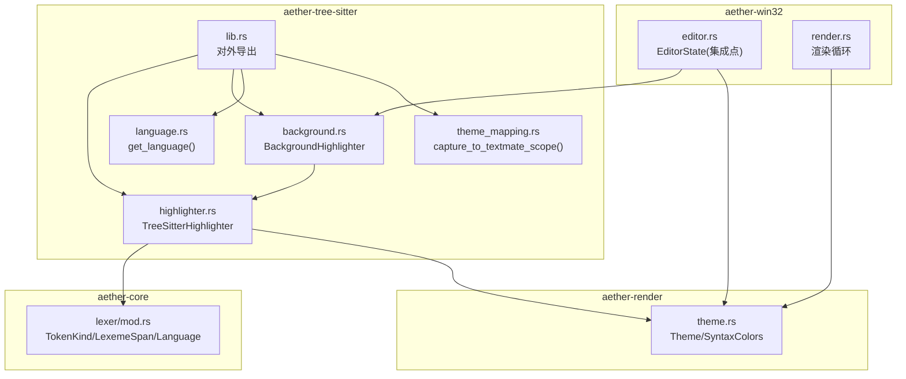
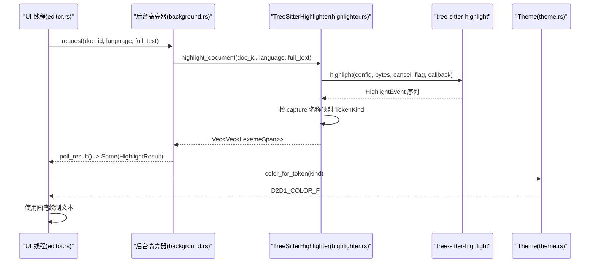
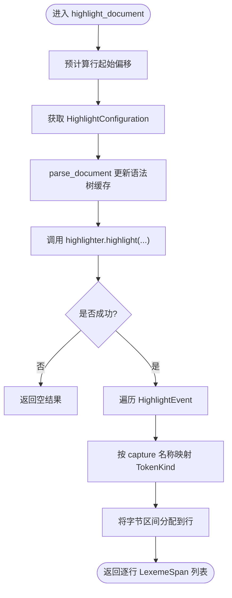
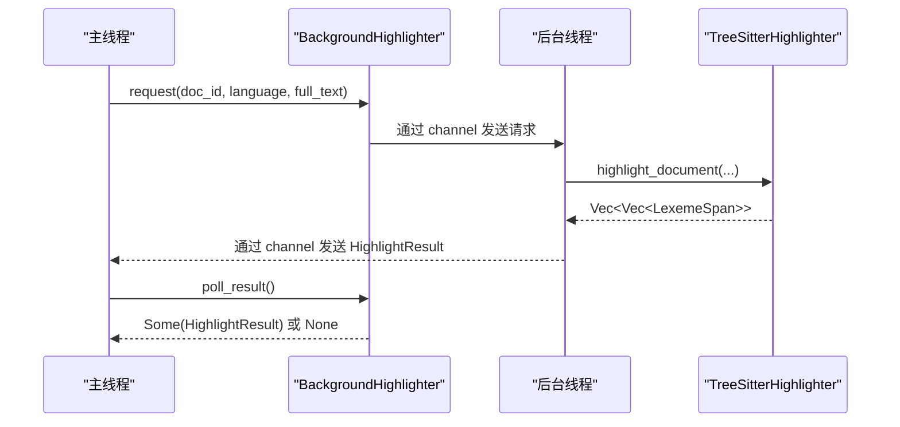
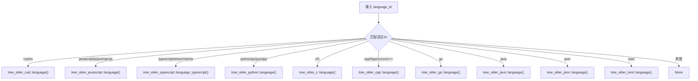
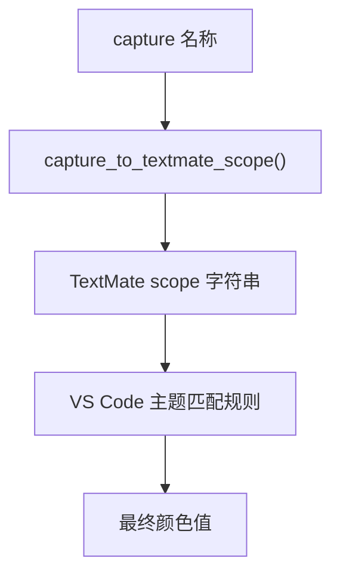
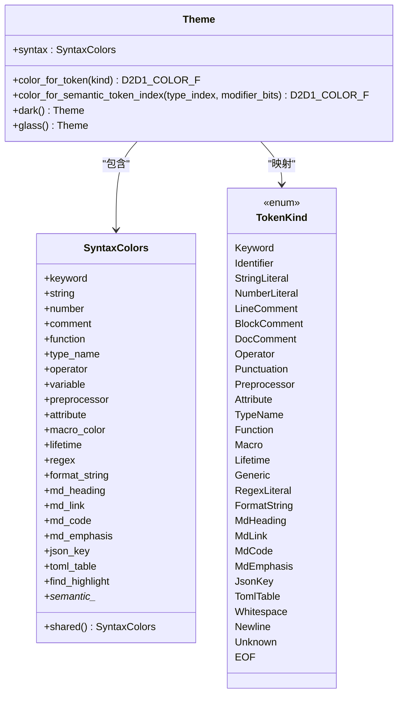
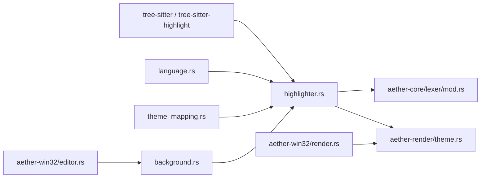

# Tree-sitter 语法解析集成

<cite>
**本文引用的文件**
- [crates/aether-tree-sitter/src/lib.rs](file://crates/aether-tree-sitter/src/lib.rs)
- [crates/aether-tree-sitter/src/highlighter.rs](file://crates/aether-tree-sitter/src/highlighter.rs)
- [crates/aether-tree-sitter/src/language.rs](file://crates/aether-tree-sitter/src/language.rs)
- [crates/aether-tree-sitter/src/theme_mapping.rs](file://crates/aether-tree-sitter/src/theme_mapping.rs)
- [crates/aether-tree-sitter/src/background.rs](file://crates/aether-tree-sitter/src/background.rs)
- [crates/aether-core/src/lexer/mod.rs](file://crates/aether-core/src/lexer/mod.rs)
- [crates/aether-render/src/theme.rs](file://crates/aether-render/src/theme.rs)
- [crates/aether-win32/src/editor.rs](file://crates/aether-win32/src/editor.rs)
- [crates/aether-win32/src/render.rs](file://crates/aether-win32/src/render.rs)
- [crates/aether-tree-sitter/Cargo.toml](file://crates/aether-tree-sitter/Cargo.toml)
</cite>

## 更新摘要
**变更内容**
- 新增 Go 语言支持：在语言识别、配置初始化和高亮处理中添加完整的 Go 语言支持
- 新增 Java 语言支持：在语言识别、配置初始化和高亮处理中添加完整的 Java 语言支持
- 扩展测试覆盖：为 Go 和 Java 语言添加单元测试验证
- 更新依赖管理：在 Cargo.toml 中添加 tree-sitter-go 和 tree-sitter-java 依赖

## 目录
1. [简介](#简介)
2. [项目结构](#项目结构)
3. [核心组件](#核心组件)
4. [架构总览](#架构总览)
5. [详细组件分析](#详细组件分析)
6. [依赖关系分析](#依赖关系分析)
7. [性能考虑](#性能考虑)
8. [故障排除指南](#故障排除指南)
9. [结论](#结论)
10. [附录](#附录)

## 简介
本技术文档围绕 Tree-sitter 语法解析器在编辑器中的集成，系统性阐述以下方面：
- AST（抽象语法树）构建过程：语法文件加载、解析器初始化与增量解析机制
- 语法高亮系统工作原理：节点类型映射、颜色主题应用与高亮缓存策略
- 多语言支持架构：语言检测、动态加载与配置管理
- 主题映射机制：Tree-sitter capture 名称到 TextMate scope 的转换
- 性能优化技巧：解析结果缓存、增量更新与内存管理
- 新语言添加指南、自定义主题配置与常见问题排查

**更新** 当前版本已支持 10 种编程语言，包括新增的 Go 和 Java 语言支持。

## 项目结构
本项目将 Tree-sitter 相关能力集中在 aether-tree-sitter crate 中，并通过 aether-core 的词法框架与 aether-render 的主题系统进行对接。UI 层位于 aether-win32，负责调度后台高亮与渲染。



**图表来源**
- [crates/aether-tree-sitter/src/lib.rs:1-10](file://crates/aether-tree-sitter/src/lib.rs#L1-L10)
- [crates/aether-tree-sitter/src/highlighter.rs:1-80](file://crates/aether-tree-sitter/src/highlighter.rs#L1-L80)
- [crates/aether-tree-sitter/src/background.rs:1-40](file://crates/aether-tree-sitter/src/background.rs#L1-L40)
- [crates/aether-tree-sitter/src/language.rs:1-25](file://crates/aether-tree-sitter/src/language.rs#L1-L25)
- [crates/aether-tree-sitter/src/theme_mapping.rs:1-30](file://crates/aether-tree-sitter/src/theme_mapping.rs#L1-L30)
- [crates/aether-core/src/lexer/mod.rs:1-80](file://crates/aether-core/src/lexer/mod.rs#L1-L80)
- [crates/aether-render/src/theme.rs:1-60](file://crates/aether-render/src/theme.rs#L1-L60)
- [crates/aether-win32/src/editor.rs:1-30](file://crates/aether-win32/src/editor.rs#L1-L30)
- [crates/aether-win32/src/render.rs:1-30](file://crates/aether-win32/src/render.rs#L1-L30)

**章节来源**
- [crates/aether-tree-sitter/src/lib.rs:1-10](file://crates/aether-tree-sitter/src/lib.rs#L1-L10)
- [crates/aether-core/src/lexer/mod.rs:1-100](file://crates/aether-core/src/lexer/mod.rs#L1-L100)
- [crates/aether-render/src/theme.rs:1-120](file://crates/aether-render/src/theme.rs#L1-L120)
- [crates/aether-win32/src/editor.rs:1-60](file://crates/aether-win32/src/editor.rs#L1-L60)
- [crates/aether-win32/src/render.rs:1-60](file://crates/aether-win32/src/render.rs#L1-L60)

## 核心组件
- TreeSitterHighlighter：封装 tree-sitter-highlight 的高亮能力，维护每文档的 Parser 与 Tree 缓存，提供单行/全文高亮接口与增量解析入口
- BackgroundHighlighter：后台线程执行高亮请求，避免阻塞 UI；主线程非阻塞轮询结果
- Language 映射：根据语言 ID 返回对应 tree-sitter Language
- Theme Mapping：将 Tree-sitter capture 名称映射为 TextMate scope，便于与 VS Code 主题生态对接
- TokenKind 与 LexemeSpan：跨语言的统一词法单元表示，供渲染层着色
- Theme/SyntaxColors：将 TokenKind 映射为具体颜色值，驱动 Direct2D 绘制

**更新** 当前支持的语言包括：Rust、JavaScript/TypeScript、Python、C/C++、Go、Java、JSON、TOML 等 10 种语言。

**章节来源**
- [crates/aether-tree-sitter/src/highlighter.rs:1-120](file://crates/aether-tree-sitter/src/highlighter.rs#L1-L120)
- [crates/aether-tree-sitter/src/background.rs:1-80](file://crates/aether-tree-sitter/src/background.rs#L1-L80)
- [crates/aether-tree-sitter/src/language.rs:1-30](file://crates/aether-tree-sitter/src/language.rs#L1-L30)
- [crates/aether-tree-sitter/src/theme_mapping.rs:1-60](file://crates/aether-tree-sitter/src/theme_mapping.rs#L1-L60)
- [crates/aether-core/src/lexer/mod.rs:1-120](file://crates/aether-core/src/lexer/mod.rs#L1-L120)
- [crates/aether-render/src/theme.rs:1-120](file://crates/aether-render/src/theme.rs#L1-L120)

## 架构总览
整体流程：UI 触发编辑事件 → 后台高亮器接收请求 → 调用 TreeSitterHighlighter 进行增量解析与高亮 → 生成 LexemeSpan 列表 → 渲染层按 TokenKind 取色并绘制。



**图表来源**
- [crates/aether-tree-sitter/src/background.rs:45-120](file://crates/aether-tree-sitter/src/background.rs#L45-L120)
- [crates/aether-tree-sitter/src/highlighter.rs:430-496](file://crates/aether-tree-sitter/src/highlighter.rs#L430-L496)
- [crates/aether-render/src/theme.rs:244-277](file://crates/aether-render/src/theme.rs#L244-L277)
- [crates/aether-win32/src/editor.rs:1-30](file://crates/aether-win32/src/editor.rs#L1-L30)

## 详细组件分析

### TreeSitterHighlighter 类图与职责
- 字段
  - highlighter：底层高亮器实例
  - 各语言 HighlightConfiguration：Rust/JS/TS/Python/C/C++/JSON/TOML/**Go/Java**
  - tree_cache：按文档 ID 缓存 (language, Tree)，用于增量解析
  - parser_cache：按文档 ID 缓存 Parser，复用解析器
- 方法
  - new/init_configs：初始化各语言配置并固定 capture 索引
  - highlight_line：单行高亮，兼容现有 Lexer 输出
  - parse_document：增量解析，更新 tree_cache
  - highlight_document：全文高亮，内部先更新语法树再高亮，返回逐行 token 列表
  - get_tree/remove_document/get_config/supprot_language：辅助查询与管理

```mermaid
classDiagram
class TreeSitterHighlighter {
-highlighter
-rust_config
-js_config
-ts_config
-python_config
-c_config
-cpp_config
-json_config
-toml_config
-go_config
-java_config
+tree_cache : HashMap<String,(String,Tree)>
+parser_cache : HashMap<String,Parser>
+new() Self
-init_configs() void
+highlight_line(text, language) Vec~LexemeSpan~
+parse_document(doc_id, language, text) Option~&Tree~
+get_tree(doc_id) Option~&Tree~
+remove_document(doc_id) void
-get_language(language) Option~Language~
-get_config(language) Option~&HighlightConfiguration~
+supports_language(language) bool
-get_config_ptr(language) *const HighlightConfiguration
+highlight_document(doc_id, language, full_text) Vec~Vec~LexemeSpan~~
}
```

**图表来源**
- [crates/aether-tree-sitter/src/highlighter.rs:1-120](file://crates/aether-tree-sitter/src/highlighter.rs#L1-L120)
- [crates/aether-tree-sitter/src/highlighter.rs:285-343](file://crates/aether-tree-sitter/src/highlighter.rs#L285-L343)
- [crates/aether-tree-sitter/src/highlighter.rs:430-496](file://crates/aether-tree-sitter/src/highlighter.rs#L430-L496)

**章节来源**
- [crates/aether-tree-sitter/src/highlighter.rs:1-120](file://crates/aether-tree-sitter/src/highlighter.rs#L1-L120)
- [crates/aether-tree-sitter/src/highlighter.rs:285-343](file://crates/aether-tree-sitter/src/highlighter.rs#L285-L343)
- [crates/aether-tree-sitter/src/highlighter.rs:430-496](file://crates/aether-tree-sitter/src/highlighter.rs#L430-L496)

### 增量解析与高亮流程
- 解析阶段
  - 若存在旧树则调用 parser.parse(text, Some(old_tree)) 实现增量更新
  - 否则全量解析
  - 将结果写入 tree_cache，限制最大条目数以避免无限增长
- 高亮阶段
  - 获取对应语言的 HighlightConfiguration
  - 遍历 HighlightEvent，按 capture 名称映射 TokenKind
  - 将字节区间分配到行，生成逐行 LexemeSpan 列表



**图表来源**
- [crates/aether-tree-sitter/src/highlighter.rs:430-496](file://crates/aether-tree-sitter/src/highlighter.rs#L430-L496)
- [crates/aether-tree-sitter/src/highlighter.rs:285-343](file://crates/aether-tree-sitter/src/highlighter.rs#L285-L343)

**章节来源**
- [crates/aether-tree-sitter/src/highlighter.rs:285-343](file://crates/aether-tree-sitter/src/highlighter.rs#L285-L343)
- [crates/aether-tree-sitter/src/highlighter.rs:430-496](file://crates/aether-tree-sitter/src/highlighter.rs#L430-L496)

### 后台高亮器 BackgroundHighlighter
- 设计要点
  - 独立线程持有专属 TreeSitterHighlighter 实例
  - 主线程通过 channel 发送请求，非阻塞轮询结果
  - pending 标志避免重复排队堆积
- 交互
  - request：发送高亮请求（doc_id, language, full_text）
  - poll_result：TryRecv 拉取最新结果，排空旧结果



**图表来源**
- [crates/aether-tree-sitter/src/background.rs:45-120](file://crates/aether-tree-sitter/src/background.rs#L45-L120)
- [crates/aether-tree-sitter/src/highlighter.rs:430-496](file://crates/aether-tree-sitter/src/highlighter.rs#L430-L496)

**章节来源**
- [crates/aether-tree-sitter/src/background.rs:1-126](file://crates/aether-tree-sitter/src/background.rs#L1-L126)

### 语言支持与检测
- get_language：根据语言 ID 返回对应的 tree-sitter Language
- **更新** 支持的语言包括 Rust、JavaScript/TypeScript、Python、C/C++、**Go、Java**、JSON、TOML 等 10 种语言
- HTML/Markdown 未在此处集成，由 aether-core 的自定义 lexer 处理



**图表来源**
- [crates/aether-tree-sitter/src/language.rs:1-25](file://crates/aether-tree-sitter/src/language.rs#L1-L25)

**章节来源**
- [crates/aether-tree-sitter/src/language.rs:1-105](file://crates/aether-tree-sitter/src/language.rs#L1-L105)

### 主题映射机制（Tree-sitter capture → TextMate scope）
- capture_to_textmate_scope：将 Tree-sitter 标准 capture 名称映射为 TextMate scope
- build_theme_mapping：构建完整映射表，便于后续扩展或调试
- 该映射桥接了 Tree-sitter 高亮系统与 VS Code 主题生态



**图表来源**
- [crates/aether-tree-sitter/src/theme_mapping.rs:1-120](file://crates/aether-tree-sitter/src/theme_mapping.rs#L1-L120)

**章节来源**
- [crates/aether-tree-sitter/src/theme_mapping.rs:1-210](file://crates/aether-tree-sitter/src/theme_mapping.rs#L1-L210)

### 词法与主题颜色映射（TokenKind → 颜色）
- TokenKind：跨语言统一的词法类别
- Theme.color_for_token：将 TokenKind 映射为 D2D1_COLOR_F
- SyntaxColors：集中定义各类别颜色，dark/glass 主题共享相同语法颜色构造



**图表来源**
- [crates/aether-core/src/lexer/mod.rs:1-120](file://crates/aether-core/src/lexer/mod.rs#L1-L120)
- [crates/aether-render/src/theme.rs:1-146](file://crates/aether-render/src/theme.rs#L1-L146)
- [crates/aether-render/src/theme.rs:244-277](file://crates/aether-render/src/theme.rs#L244-L277)

**章节来源**
- [crates/aether-core/src/lexer/mod.rs:1-120](file://crates/aether-core/src/lexer/mod.rs#L1-L120)
- [crates/aether-render/src/theme.rs:1-146](file://crates/aether-render/src/theme.rs#L1-L146)
- [crates/aether-render/src/theme.rs:244-277](file://crates/aether-render/src/theme.rs#L244-L277)

### 编辑器集成点（UI 层）
- editor.rs 引入 aether_tree_sitter::TreeSitterHighlighter，作为上层集成的入口
- render.rs 负责渲染循环与脏矩形管理，结合主题与高亮结果进行绘制

**章节来源**
- [crates/aether-win32/src/editor.rs:1-30](file://crates/aether-win32/src/editor.rs#L1-L30)
- [crates/aether-win32/src/render.rs:1-60](file://crates/aether-win32/src/render.rs#L1-L60)

## 依赖关系分析
- aether-tree-sitter 依赖 tree-sitter 与 tree-sitter-highlight 的各语言 crate
- **更新** 新增 tree-sitter-go 和 tree-sitter-java 依赖，版本统一为 0.20
- aether-tree-sitter 与 aether-core 通过 TokenKind/LexemeSpan 解耦
- aether-tree-sitter 与 aether-render 通过 TokenKind→颜色映射协作
- aether-win32 作为 UI 层协调后台高亮与渲染



**图表来源**
- [crates/aether-tree-sitter/src/highlighter.rs:1-80](file://crates/aether-tree-sitter/src/highlighter.rs#L1-L80)
- [crates/aether-tree-sitter/src/language.rs:1-25](file://crates/aether-tree-sitter/src/language.rs#L1-L25)
- [crates/aether-tree-sitter/src/theme_mapping.rs:1-60](file://crates/aether-tree-sitter/src/theme_mapping.rs#L1-L60)
- [crates/aether-tree-sitter/src/background.rs:1-40](file://crates/aether-tree-sitter/src/background.rs#L1-L40)
- [crates/aether-core/src/lexer/mod.rs:1-80](file://crates/aether-core/src/lexer/mod.rs#L1-L80)
- [crates/aether-render/src/theme.rs:1-60](file://crates/aether-render/src/theme.rs#L1-L60)
- [crates/aether-win32/src/editor.rs:1-30](file://crates/aether-win32/src/editor.rs#L1-L30)
- [crates/aether-win32/src/render.rs:1-30](file://crates/aether-win32/src/render.rs#L1-L30)

**章节来源**
- [crates/aether-tree-sitter/src/highlighter.rs:1-80](file://crates/aether-tree-sitter/src/highlighter.rs#L1-L80)
- [crates/aether-tree-sitter/src/language.rs:1-25](file://crates/aether-tree-sitter/src/language.rs#L1-L25)
- [crates/aether-tree-sitter/src/theme_mapping.rs:1-60](file://crates/aether-tree-sitter/src/theme_mapping.rs#L1-L60)
- [crates/aether-tree-sitter/src/background.rs:1-40](file://crates/aether-tree-sitter/src/background.rs#L1-L40)
- [crates/aether-core/src/lexer/mod.rs:1-80](file://crates/aether-core/src/lexer/mod.rs#L1-L80)
- [crates/aether-render/src/theme.rs:1-60](file://crates/aether-render/src/theme.rs#L1-L60)
- [crates/aether-win32/src/editor.rs:1-30](file://crates/aether-win32/src/editor.rs#L1-L30)
- [crates/aether-win32/src/render.rs:1-30](file://crates/aether-win32/src/render.rs#L1-L30)

## 性能考虑
- 增量解析
  - parse_document 基于旧树进行增量更新，减少重复解析开销
  - 当 tree_cache 达到上限时采用"全量淘汰"策略，避免长时间运行后内存膨胀
- 解析器复用
  - parser_cache 按文档 ID 缓存 Parser，避免频繁创建
- 高亮策略
  - highlight_document 一次解析全文，比逐行 highlight_line 更正确且更高效
  - 后台线程执行高亮，主线程非阻塞轮询，保证 UI 流畅
- 内存管理
  - MAX_HIGHLIGHTER_DOCS 控制文档缓存数量
  - remove_document 清理文档相关缓存

**章节来源**
- [crates/aether-tree-sitter/src/highlighter.rs:285-343](file://crates/aether-tree-sitter/src/highlighter.rs#L285-L343)
- [crates/aether-tree-sitter/src/highlighter.rs:430-496](file://crates/aether-tree-sitter/src/highlighter.rs#L430-L496)
- [crates/aether-tree-sitter/src/background.rs:79-118](file://crates/aether-tree-sitter/src/background.rs#L79-L118)

## 故障排除指南
- 不支持的语言
  - 现象：高亮结果为空
  - 原因：语言未在 get_language 或 get_config 中注册
  - 解决：在 language.rs 与 highlighter.rs 中添加语言映射与配置
- 捕获名称映射异常
  - 现象：关键字/字符串/注释等类别不正确
  - 原因：capture 名称与 capture_name_to_token_kind 映射不一致
  - 解决：核对 tree-sitter-highlight 的 capture 规范，完善映射逻辑
- 后台高亮无结果
  - 现象：poll_result 一直返回 None
  - 原因：pending 标志未重置或 channel 断开
  - 解决：检查 poll_result 的 TryRecv 分支与 pending 状态复位逻辑
- 内存持续增长
  - 现象：长时间运行后内存占用上升
  - 原因：tree_cache 未有效淘汰
  - 解决：确认 MAX_HIGHLIGHTER_DOCS 阈值与清空策略生效

**章节来源**
- [crates/aether-tree-sitter/src/language.rs:1-25](file://crates/aether-tree-sitter/src/language.rs#L1-L25)
- [crates/aether-tree-sitter/src/highlighter.rs:559-583](file://crates/aether-tree-sitter/src/highlighter.rs#L559-L583)
- [crates/aether-tree-sitter/src/background.rs:95-118](file://crates/aether-tree-sitter/src/background.rs#L95-L118)
- [crates/aether-tree-sitter/src/highlighter.rs:285-343](file://crates/aether-tree-sitter/src/highlighter.rs#L285-L343)

## 结论
本集成方案以 Tree-sitter 为核心，结合后台高亮与主题映射，实现了高效、可扩展的多语言语法高亮能力。**更新** 当前版本已支持 10 种编程语言，包括新增的 Go 和 Java 语言，显著提升了开发者的编码体验。通过增量解析、解析器复用与后台线程调度，显著提升了用户体验与性能表现。同时，清晰的模块边界与统一词法模型使得新增语言与主题定制变得简单可控。

## 附录

### 新语言添加指南
- 步骤
  - 在 language.rs 的 get_language 中添加语言 ID 到 tree-sitter Language 的映射
  - 在 highlighter.rs 的 init_configs 中为该语言创建 HighlightConfiguration，并调用 configure(HIGHLIGHT_NAMES)
  - 在 get_config 与 supports_language 中添加语言别名与判断
  - 在 highlight_line 方法中添加语言匹配分支
  - 如需扩展 capture 名称映射，完善 capture_name_to_token_kind 与 theme_mapping 的映射
  - **更新** 在 Cargo.toml 中添加相应的 tree-sitter-* 依赖
- 验证
  - 使用 highlight_line 与 highlight_document 对示例代码进行测试
  - 确保 TokenKind 映射符合预期，渲染颜色正确
  - **新增** 添加单元测试验证语言支持

**更新** 参考 Go 和 Java 的实现模式：
- 在 `init_configs` 方法中添加语言配置初始化
- 在 `get_config` 和 `get_config_ptr` 方法中添加语言映射
- 在 `highlight_line` 方法中添加语言匹配分支
- 添加相应的单元测试

**章节来源**
- [crates/aether-tree-sitter/src/language.rs:1-25](file://crates/aether-tree-sitter/src/language.rs#L1-L25)
- [crates/aether-tree-sitter/src/highlighter.rs:68-178](file://crates/aether-tree-sitter/src/highlighter.rs#L68-L178)
- [crates/aether-tree-sitter/src/highlighter.rs:345-363](file://crates/aether-tree-sitter/src/highlighter.rs#L345-L363)
- [crates/aether-tree-sitter/src/highlighter.rs:559-583](file://crates/aether-tree-sitter/src/highlighter.rs#L559-L583)
- [crates/aether-tree-sitter/src/theme_mapping.rs:122-210](file://crates/aether-tree-sitter/src/theme_mapping.rs#L122-L210)
- [crates/aether-tree-sitter/Cargo.toml:11-21](file://crates/aether-tree-sitter/Cargo.toml#L11-L21)

### 自定义主题配置
- 修改 SyntaxColors 中的颜色值，或通过 Theme::dark/glass 调整全局外观
- 语义令牌颜色可通过 color_for_semantic_token_index 进行扩展与覆盖
- 建议保持 dark/glass 共享的 SyntaxColors 构造，减少重复与维护成本

**章节来源**
- [crates/aether-render/src/theme.rs:88-146](file://crates/aether-render/src/theme.rs#L88-L146)
- [crates/aether-render/src/theme.rs:211-242](file://crates/aether-render/src/theme.rs#L211-L242)
- [crates/aether-render/src/theme.rs:244-277](file://crates/aether-render/src/theme.rs#L244-L277)

### Go 语言支持详解
**新增** Go 语言支持的具体实现：

- **语言识别**：在 `get_language` 函数中添加 `"go"` 语言 ID 映射到 `tree_sitter_go::language()`
- **配置初始化**：在 `init_configs` 方法中创建 Go 语言的 HighlightConfiguration
- **高亮处理**：在 `highlight_line`、`get_config`、`get_config_ptr` 方法中添加 Go 语言支持
- **测试覆盖**：添加 `test_highlight_line_go` 和 `test_parse_document_go` 单元测试
- **依赖管理**：在 Cargo.toml 中添加 `tree-sitter-go = "0.20"` 依赖

**章节来源**
- [crates/aether-tree-sitter/src/language.rs:16](file://crates/aether-tree-sitter/src/language.rs#L16)
- [crates/aether-tree-sitter/src/highlighter.rs:157-166](file://crates/aether-tree-sitter/src/highlighter.rs#L157-L166)
- [crates/aether-tree-sitter/src/highlighter.rs:227-231](file://crates/aether-tree-sitter/src/highlighter.rs#L227-L231)
- [crates/aether-tree-sitter/src/highlighter.rs:339](file://crates/aether-tree-sitter/src/highlighter.rs#L339)
- [crates/aether-tree-sitter/src/highlighter.rs:355](file://crates/aether-tree-sitter/src/highlighter.rs#L355)
- [crates/aether-tree-sitter/src/highlighter.rs:408-412](file://crates/aether-tree-sitter/src/highlighter.rs#L408-L412)
- [crates/aether-tree-sitter/src/highlighter.rs:691-695](file://crates/aether-tree-sitter/src/highlighter.rs#L691-L695)
- [crates/aether-tree-sitter/src/highlighter.rs:788-792](file://crates/aether-tree-sitter/src/highlighter.rs#L788-L792)
- [crates/aether-tree-sitter/Cargo.toml:20](file://crates/aether-tree-sitter/Cargo.toml#L20)

### Java 语言支持详解
**新增** Java 语言支持的具体实现：

- **语言识别**：在 `get_language` 函数中添加 `"java"` 语言 ID 映射到 `tree_sitter_java::language()`
- **配置初始化**：在 `init_configs` 方法中创建 Java 语言的 HighlightConfiguration
- **高亮处理**：在 `highlight_line`、`get_config`、`get_config_ptr` 方法中添加 Java 语言支持
- **测试覆盖**：添加 `test_highlight_line_java` 和 `test_parse_document_java` 单元测试
- **依赖管理**：在 Cargo.toml 中添加 `tree-sitter-java = "0.20"` 依赖

**章节来源**
- [crates/aether-tree-sitter/src/language.rs:17](file://crates/aether-tree-sitter/src/language.rs#L17)
- [crates/aether-tree-sitter/src/highlighter.rs:168-177](file://crates/aether-tree-sitter/src/highlighter.rs#L168-L177)
- [crates/aether-tree-sitter/src/highlighter.rs:232-236](file://crates/aether-tree-sitter/src/highlighter.rs#L232-L236)
- [crates/aether-tree-sitter/src/highlighter.rs:340](file://crates/aether-tree-sitter/src/highlighter.rs#L340)
- [crates/aether-tree-sitter/src/highlighter.rs:356](file://crates/aether-tree-sitter/src/highlighter.rs#L356)
- [crates/aether-tree-sitter/src/highlighter.rs:413-417](file://crates/aether-tree-sitter/src/highlighter.rs#L413-L417)
- [crates/aether-tree-sitter/src/highlighter.rs:697-703](file://crates/aether-tree-sitter/src/highlighter.rs#L697-L703)
- [crates/aether-tree-sitter/src/highlighter.rs:794-799](file://crates/aether-tree-sitter/src/highlighter.rs#L794-L799)
- [crates/aether-tree-sitter/Cargo.toml:21](file://crates/aether-tree-sitter/Cargo.toml#L21)