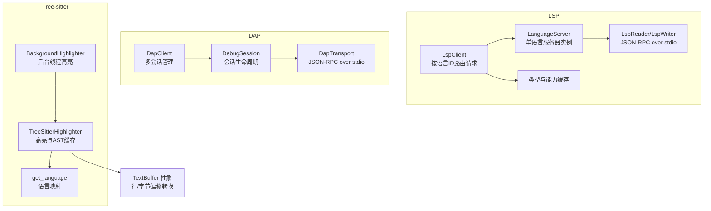
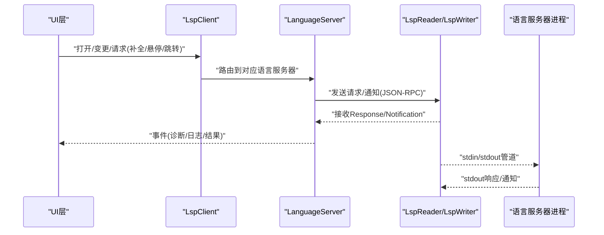
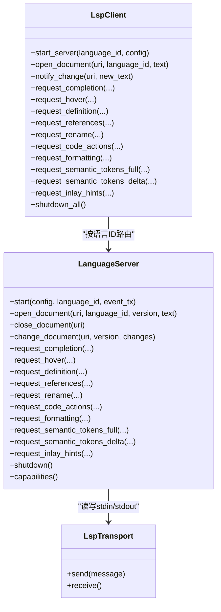
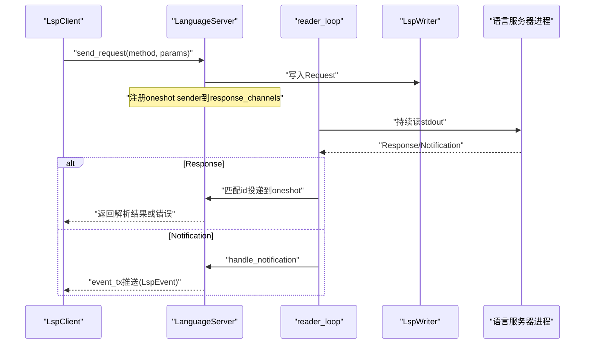
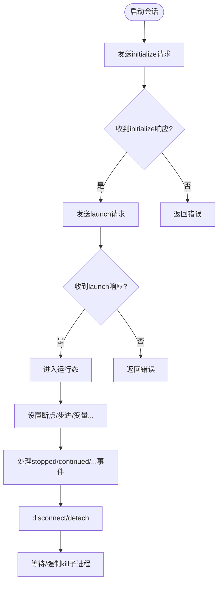
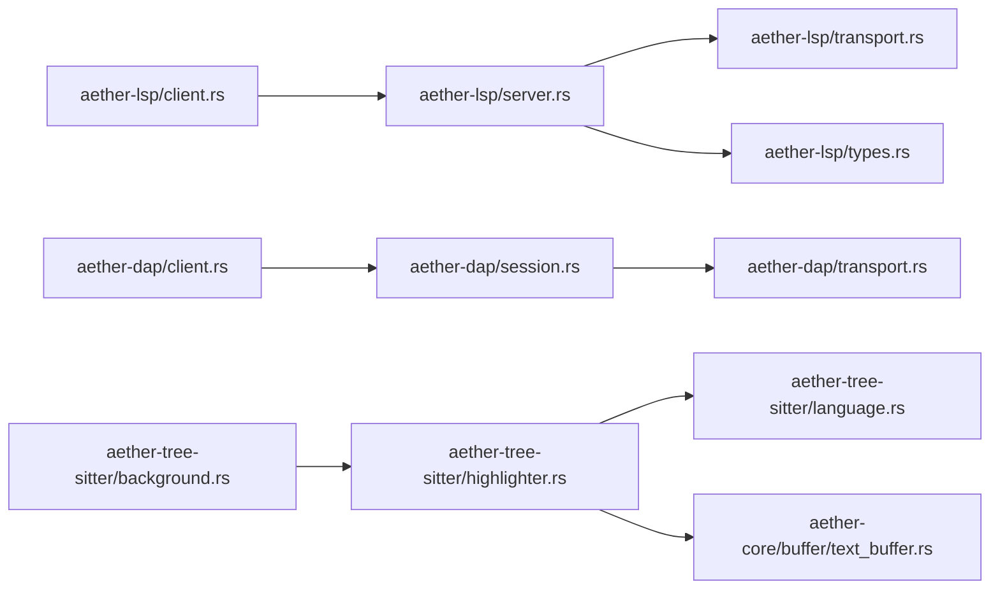

# 语言服务集成

<cite>
**本文引用的文件**
- [crates/aether-lsp/src/lib.rs](file://crates/aether-lsp/src/lib.rs)
- [crates/aether-lsp/src/client.rs](file://crates/aether-lsp/src/client.rs)
- [crates/aether-lsp/src/server.rs](file://crates/aether-lsp/src/server.rs)
- [crates/aether-lsp/src/transport.rs](file://crates/aether-lsp/src/transport.rs)
- [crates/aether-lsp/src/types.rs](file://crates/aether-lsp/src/types.rs)
- [crates/aether-dap/src/lib.rs](file://crates/aether-dap/src/lib.rs)
- [crates/aether-dap/src/client.rs](file://crates/aether-dap/src/client.rs)
- [crates/aether-dap/src/session.rs](file://crates/aether-dap/src/session.rs)
- [crates/aether-dap/src/transport.rs](file://crates/aether-dap/src/transport.rs)
- [crates/aether-tree-sitter/src/lib.rs](file://crates/aether-tree-sitter/src/lib.rs)
- [crates/aether-tree-sitter/src/highlighter.rs](file://crates/aether-tree-sitter/src/highlighter.rs)
- [crates/aether-tree-sitter/src/background.rs](file://crates/aether-tree-sitter/src/background.rs)
- [crates/aether-tree-sitter/src/language.rs](file://crates/aether-tree-sitter/src/language.rs)
- [crates/aether-core/src/buffer/text_buffer.rs](file://crates/aether-core/src/buffer/text_buffer.rs)
</cite>

## 目录
1. [简介](#简介)
2. [项目结构](#项目结构)
3. [核心组件](#核心组件)
4. [架构总览](#架构总览)
5. [详细组件分析](#详细组件分析)
6. [依赖关系分析](#依赖关系分析)
7. [性能考量](#性能考量)
8. [故障排除指南](#故障排除指南)
9. [结论](#结论)
10. [附录：配置与最佳实践](#附录配置与最佳实践)

## 简介
本文件面向牧羊人编辑器的“语言服务集成”子系统，系统性阐述 LSP 客户端、DAP 调试适配器以及 Tree-sitter 语法高亮与 AST 解析的集成方式。文档覆盖协议通信、消息路由、状态管理、生命周期、错误处理与重试机制，并提供配置指南、故障排除方法与性能优化建议，帮助读者从高层到代码级全面理解系统设计与实现。

## 项目结构
语言服务相关代码主要分布在三个 crate：
- aether-lsp：LSP 客户端、服务器进程管理、传输层与类型定义
- aether-dap：DAP 客户端、会话管理与传输层
- aether-tree-sitter：Tree-sitter 高亮器、增量解析与后台渲染支持
- aether-core：文本缓冲区抽象（为高亮和变更计算提供基础）



图表来源
- [crates/aether-lsp/src/client.rs:1-120](file://crates/aether-lsp/src/client.rs#L1-L120)
- [crates/aether-lsp/src/server.rs:1-125](file://crates/aether-lsp/src/server.rs#L1-L125)
- [crates/aether-lsp/src/transport.rs:1-120](file://crates/aether-lsp/src/transport.rs#L1-L120)
- [crates/aether-lsp/src/types.rs:1-120](file://crates/aether-lsp/src/types.rs#L1-L120)
- [crates/aether-dap/src/client.rs:1-45](file://crates/aether-dap/src/client.rs#L1-L45)
- [crates/aether-dap/src/session.rs:1-80](file://crates/aether-dap/src/session.rs#L1-L80)
- [crates/aether-dap/src/transport.rs:1-120](file://crates/aether-dap/src/transport.rs#L1-L120)
- [crates/aether-tree-sitter/src/highlighter.rs:1-120](file://crates/aether-tree-sitter/src/highlighter.rs#L1-L120)
- [crates/aether-tree-sitter/src/background.rs:1-80](file://crates/aether-tree-sitter/src/background.rs#L1-L80)
- [crates/aether-tree-sitter/src/language.rs:1-40](file://crates/aether-tree-sitter/src/language.rs#L1-L40)
- [crates/aether-core/src/buffer/text_buffer.rs:1-60](file://crates/aether-core/src/buffer/text_buffer.rs#L1-L60)

章节来源
- [crates/aether-lsp/src/lib.rs:1-16](file://crates/aether-lsp/src/lib.rs#L1-L16)
- [crates/aether-dap/src/lib.rs:1-8](file://crates/aether-dap/src/lib.rs#L1-L8)
- [crates/aether-tree-sitter/src/lib.rs:1-10](file://crates/aether-tree-sitter/src/lib.rs#L1-L10)

## 核心组件
- LSP 客户端管理器（LspClient）
  - 维护多语言服务器实例映射（语言ID -> LanguageServer），负责打开/关闭文档、变更同步、诊断缓存与事件推送。
  - 通过 DocumentSync 保存文档版本与文本，计算增量变更并发送到对应语言服务器。
- 语言服务器实例（LanguageServer）
  - 启动子进程、初始化握手、发送请求/通知、接收响应与通知、缓存能力、优雅关闭与超时控制。
  - 使用 oneshot channel 将 reader task 收到的 Response 投递给调用方；Notification 直接转发至 UI 事件通道。
- DAP 客户端与会话（DapClient / DebugSession）
  - 管理多个调试会话，封装 initialize/launch/断点/步进/变量等命令，统一超时与错误处理。
  - 维护会话状态机（Initializing/Running/Paused/Terminated），对终止后事件进行过滤。
- Tree-sitter 高亮与 AST
  - TreeSitterHighlighter 维护每文档的 Parser 与 Tree 缓存，支持整文档高亮与增量解析。
  - BackgroundHighlighter 在独立线程执行高亮，主线程非阻塞轮询结果，避免 UI 卡顿。
  - get_language 提供语言 ID 到 tree-sitter Language 的映射。

章节来源
- [crates/aether-lsp/src/client.rs:1-120](file://crates/aether-lsp/src/client.rs#L1-L120)
- [crates/aether-lsp/src/server.rs:1-125](file://crates/aether-lsp/src/server.rs#L1-L125)
- [crates/aether-dap/src/client.rs:1-45](file://crates/aether-dap/src/client.rs#L1-L45)
- [crates/aether-dap/src/session.rs:1-80](file://crates/aether-dap/src/session.rs#L1-L80)
- [crates/aether-tree-sitter/src/highlighter.rs:1-120](file://crates/aether-tree-sitter/src/highlighter.rs#L1-L120)
- [crates/aether-tree-sitter/src/background.rs:1-80](file://crates/aether-tree-sitter/src/background.rs#L1-L80)
- [crates/aether-tree-sitter/src/language.rs:1-40](file://crates/aether-tree-sitter/src/language.rs#L1-L40)

## 架构总览
下图展示编辑器与语言服务之间的交互流程：UI 触发操作，LspClient/DapClient 根据语言或会话路由到具体服务器/适配器，传输层负责 JSON-RPC over stdio 编解码，后台任务负责读取 stdout/stderr，事件回推 UI。



图表来源
- [crates/aether-lsp/src/client.rs:110-170](file://crates/aether-lsp/src/client.rs#L110-L170)
- [crates/aether-lsp/src/server.rs:60-125](file://crates/aether-lsp/src/server.rs#L60-L125)
- [crates/aether-lsp/src/transport.rs:1-120](file://crates/aether-lsp/src/transport.rs#L1-L120)

## 详细组件分析

### LSP 客户端与服务器
- 客户端职责
  - 按语言ID选择服务器实例，维护文档同步状态与诊断集合。
  - 计算增量变更（基于旧全文与新全文 diff），确保版本递增与发送成功后的原子性更新。
- 服务器职责
  - 启动子进程、initialize 握手、能力缓存、请求-响应配对、通知分发、优雅关闭。
  - 使用 reader_loop 独占 stdout，避免 send/receive 互锁；stderr 后台 drain 防止阻塞。
- 传输层
  - 遵循 JSON-RPC over stdio 帧格式：Header + Content-Length + \r\n\r\n + JSON body。
  - 限制 Header 大小与 Content-Length 上限，拒绝超大消息，避免 OOM。



图表来源
- [crates/aether-lsp/src/client.rs:1-120](file://crates/aether-lsp/src/client.rs#L1-L120)
- [crates/aether-lsp/src/server.rs:1-125](file://crates/aether-lsp/src/server.rs#L1-L125)
- [crates/aether-lsp/src/transport.rs:1-120](file://crates/aether-lsp/src/transport.rs#L1-L120)

章节来源
- [crates/aether-lsp/src/client.rs:1-120](file://crates/aether-lsp/src/client.rs#L1-L120)
- [crates/aether-lsp/src/server.rs:1-125](file://crates/aether-lsp/src/server.rs#L1-L125)
- [crates/aether-lsp/src/transport.rs:1-120](file://crates/aether-lsp/src/transport.rs#L1-L120)
- [crates/aether-lsp/src/types.rs:1-120](file://crates/aether-lsp/src/types.rs#L1-L120)

#### LSP 请求-响应时序


图表来源
- [crates/aether-lsp/src/server.rs:120-220](file://crates/aether-lsp/src/server.rs#L120-L220)
- [crates/aether-lsp/src/transport.rs:120-210](file://crates/aether-lsp/src/transport.rs#L120-L210)

### DAP 调试会话管理
- 客户端与会话
  - DapClient 管理多个会话；DebugSession 封装完整生命周期（initialize/launch/断点/步进/变量/退出）。
  - 所有请求带超时控制；失败响应明确报错；terminated 后忽略非终止事件。
- 传输层
  - 同样采用 JSON-RPC over stdio，限制头部与消息体大小，拒绝异常数据。
- 事件处理
  - stopped/continued/exited/terminated/output/breakpoint 等事件转换为 UI 事件。



图表来源
- [crates/aether-dap/src/session.rs:40-135](file://crates/aether-dap/src/session.rs#L40-L135)
- [crates/aether-dap/src/transport.rs:1-120](file://crates/aether-dap/src/transport.rs#L1-L120)

章节来源
- [crates/aether-dap/src/client.rs:1-70](file://crates/aether-dap/src/client.rs#L1-L70)
- [crates/aether-dap/src/session.rs:1-120](file://crates/aether-dap/src/session.rs#L1-L120)
- [crates/aether-dap/src/transport.rs:1-120](file://crates/aether-dap/src/transport.rs#L1-L120)

### Tree-sitter 高亮与 AST 构建
- 高亮器
  - 支持多语言 highlight query，按 capture 名称映射 TokenKind，兼容不同语言差异。
  - 整文档高亮优先于逐行高亮，保证跨行构造（块注释、三引号字符串、宏）正确性。
- AST 缓存
  - 每文档缓存 Parser 与 Tree，增量解析复用旧树，提升性能。
  - 限制文档缓存条目数，避免长时间运行内存增长。
- 后台高亮
  - 后台线程执行高亮，主线程非阻塞轮询结果，未就绪时使用上一帧缓存，避免卡顿。

```mermaid
classDiagram
class TreeSitterHighlighter {
+highlight_line(text, language) Vec<LexemeSpan>
+parse_document(doc_id, language, text) Option<&Tree>
+highlight_document(doc_id, language, full_text) Vec<Vec<LexemeSpan>>
+supports_language(language) bool
-tree_cache : HashMap<String,(String,Tree)>
-parser_cache : HashMap<String,Parser>
}
class BackgroundHighlighter {
+request(doc_id, language, full_text)
+poll_result() Option<HighlightResult>
+has_pending() bool
}
class LanguageMap {
+get_language(id) Option<Language>
}
BackgroundHighlighter --> TreeSitterHighlighter : "后台调用"
TreeSitterHighlighter --> LanguageMap : "获取Language"
```

图表来源
- [crates/aether-tree-sitter/src/highlighter.rs:1-120](file://crates/aether-tree-sitter/src/highlighter.rs#L1-L120)
- [crates/aether-tree-sitter/src/background.rs:1-80](file://crates/aether-tree-sitter/src/background.rs#L1-L80)
- [crates/aether-tree-sitter/src/language.rs:1-40](file://crates/aether-tree-sitter/src/language.rs#L1-L40)

章节来源
- [crates/aether-tree-sitter/src/highlighter.rs:1-120](file://crates/aether-tree-sitter/src/highlighter.rs#L1-L120)
- [crates/aether-tree-sitter/src/background.rs:1-80](file://crates/aether-tree-sitter/src/background.rs#L1-L80)
- [crates/aether-tree-sitter/src/language.rs:1-40](file://crates/aether-tree-sitter/src/language.rs#L1-L40)

## 依赖关系分析
- 模块耦合
  - LspClient 依赖 LanguageServer 与 DocumentSync；LanguageServer 依赖 LspReader/LspWriter 与 types。
  - DapClient 依赖 DebugSession；DebugSession 依赖 DapTransport。
  - Tree-sitter 高亮器依赖 core 的 TextBuffer 接口（用于行/列转换与文本切片）。
- 外部依赖
  - tokio 异步运行时、serde_json 序列化、tree-sitter 系列 grammar crate。
- 潜在循环依赖
  - 当前设计通过 trait 与模块边界解耦，未见明显循环依赖。



图表来源
- [crates/aether-lsp/src/client.rs:1-120](file://crates/aether-lsp/src/client.rs#L1-L120)
- [crates/aether-lsp/src/server.rs:1-125](file://crates/aether-lsp/src/server.rs#L1-L125)
- [crates/aether-lsp/src/transport.rs:1-120](file://crates/aether-lsp/src/transport.rs#L1-L120)
- [crates/aether-lsp/src/types.rs:1-120](file://crates/aether-lsp/src/types.rs#L1-L120)
- [crates/aether-dap/src/client.rs:1-45](file://crates/aether-dap/src/client.rs#L1-L45)
- [crates/aether-dap/src/session.rs:1-80](file://crates/aether-dap/src/session.rs#L1-L80)
- [crates/aether-dap/src/transport.rs:1-120](file://crates/aether-dap/src/transport.rs#L1-L120)
- [crates/aether-tree-sitter/src/highlighter.rs:1-120](file://crates/aether-tree-sitter/src/highlighter.rs#L1-L120)
- [crates/aether-tree-sitter/src/background.rs:1-80](file://crates/aether-tree-sitter/src/background.rs#L1-L80)
- [crates/aether-tree-sitter/src/language.rs:1-40](file://crates/aether-tree-sitter/src/language.rs#L1-L40)
- [crates/aether-core/src/buffer/text_buffer.rs:1-60](file://crates/aether-core/src/buffer/text_buffer.rs#L1-L60)

章节来源
- [crates/aether-lsp/src/lib.rs:1-16](file://crates/aether-lsp/src/lib.rs#L1-L16)
- [crates/aether-dap/src/lib.rs:1-8](file://crates/aether-dap/src/lib.rs#L1-L8)
- [crates/aether-tree-sitter/src/lib.rs:1-10](file://crates/aether-tree-sitter/src/lib.rs#L1-L10)

## 性能考量
- LSP 传输层
  - 限制 Header 最大长度与 Content-Length 上限，避免恶意或异常服务器导致 OOM。
  - 拆分 LspReader/LspWriter，避免共享锁竞争；reader_loop 独占 stdout，提高吞吐。
- 请求超时与资源清理
  - 默认请求超时 30s，initialize 更长；超时自动清理 pending sender，防止泄漏。
  - stderr 后台 drain 防止子进程因管道满而阻塞。
- Tree-sitter 高亮
  - 整文档高亮一次解析，比逐行更高效且更准确；Parser/Tree 缓存减少重复解析。
  - 后台线程执行高亮，主线程非阻塞轮询，避免 UI 卡顿。
- 内存控制
  - 高亮器文档缓存上限（MAX_HIGHLIGHTER_DOCS），达到上限时清空 tree_cache，保留轻量 Parser。

[本节为通用指导，不直接分析具体文件]

## 故障排除指南
- LSP 诊断不显示
  - 检查 reader_loop 是否正确转发 notification 到 event_tx；确认 handle_notification 未被丢弃。
  - 验证 transport 是否限制过大 Content-Length 导致消息被拒。
- 语言服务器无响应
  - 检查 spawn_server 是否成功启动子进程；stderr drain 是否运行。
  - 查看 initialize 超时与能力缓存是否生效。
- DAP 调试卡死
  - 确认 disconnect 后 finalize_child 是否 kill 超时未退出的适配器进程。
  - 检查 terminated 后事件过滤逻辑，避免“复活”状态。
- 高亮卡顿
  - 确认 BackgroundHighlighter 是否启用；主线程 poll_result 是否及时消费结果。
  - 检查 MAX_HIGHLIGHTER_DOCS 是否过小导致频繁清空缓存。

章节来源
- [crates/aether-lsp/src/server.rs:220-305](file://crates/aether-lsp/src/server.rs#L220-L305)
- [crates/aether-lsp/src/transport.rs:160-210](file://crates/aether-lsp/src/transport.rs#L160-L210)
- [crates/aether-dap/src/session.rs:480-540](file://crates/aether-dap/src/session.rs#L480-L540)
- [crates/aether-tree-sitter/src/highlighter.rs:280-320](file://crates/aether-tree-sitter/src/highlighter.rs#L280-L320)

## 结论
本集成方案以模块化与异步为核心，LSP 与 DAP 均通过独立的传输层与后台任务实现稳定可靠的进程间通信；Tree-sitter 高亮与 AST 解析结合缓存与后台线程，兼顾准确性与性能。通过严格的超时、错误处理与资源回收策略，系统在复杂场景下仍保持健壮性与可维护性。

[本节为总结，不直接分析具体文件]

## 附录：配置与最佳实践
- LSP 服务器发现
  - 使用 default_server_config 为常见语言提供默认命令与参数（如 rust-analyzer、pylsp、clangd、typescript-language-server）。
- DAP 适配器发现
  - 使用 default_adapter_config 为常见语言提供默认适配器（如 lldb-dap、debugpy.adapter、node-debug2-adapter）。
- 环境变量与根目录
  - ServerConfig/AdapterConfig 支持 env 与 cwd/root_uri 设置，便于在不同工作区与环境中运行。
- 能力协商
  - 客户端在 initialize 中声明支持的 capabilities（completion/hover/semantic tokens/inlay hints 等），服务器据此决定是否启用相应功能。
- 增量同步
  - 使用 notify_change 计算精确变更，避免全量重传；注意版本递增与发送成功后再递增的一致性。
- 安全与健壮性
  - 严格限制头部与消息体大小；对 EOF、超时、反序列化错误进行显式处理；stderr 后台 drain 避免阻塞。

章节来源
- [crates/aether-lsp/src/client.rs:600-640](file://crates/aether-lsp/src/client.rs#L600-L640)
- [crates/aether-dap/src/client.rs:45-72](file://crates/aether-dap/src/client.rs#L45-L72)
- [crates/aether-lsp/src/server.rs:300-485](file://crates/aether-lsp/src/server.rs#L300-L485)
- [crates/aether-lsp/src/transport.rs:210-302](file://crates/aether-lsp/src/transport.rs#L210-L302)
- [crates/aether-dap/src/transport.rs:118-163](file://crates/aether-dap/src/transport.rs#L118-L163)