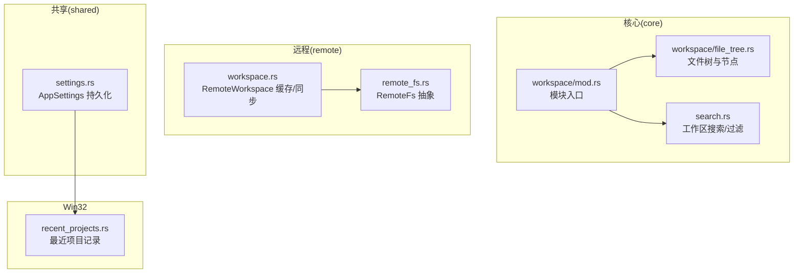
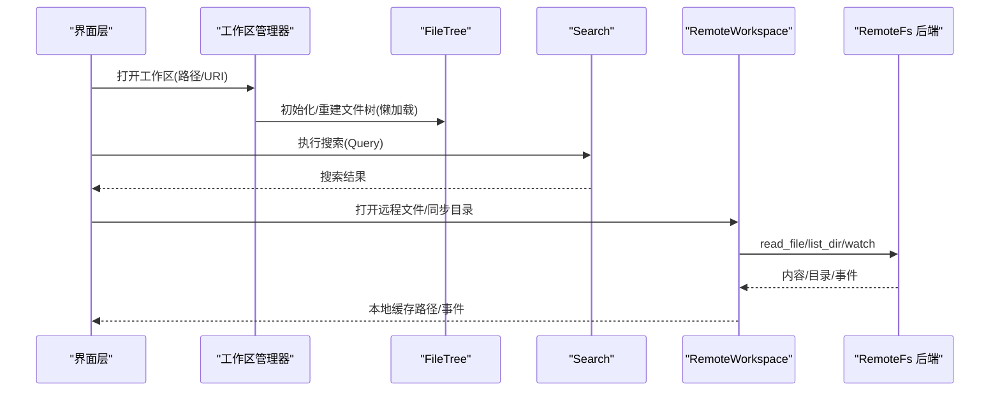
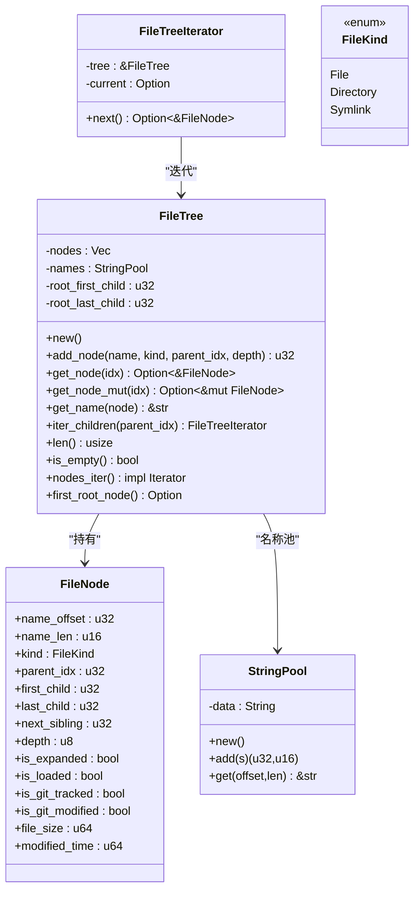
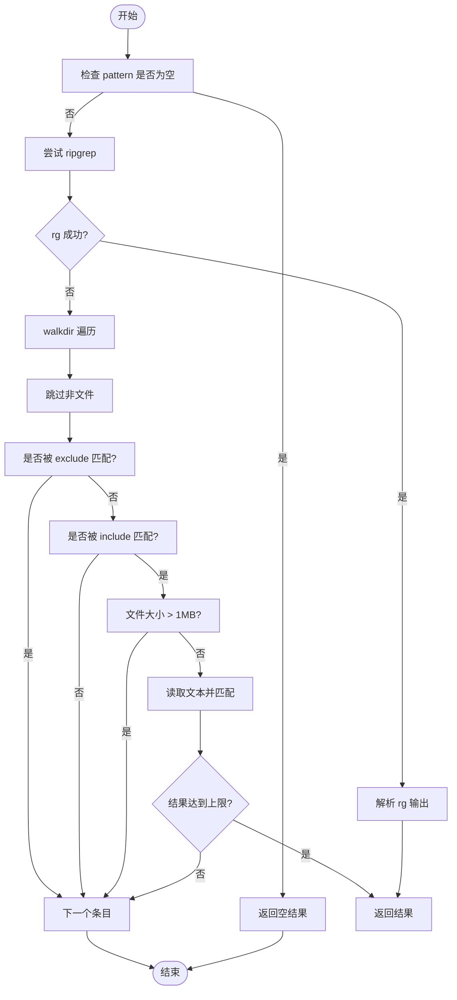
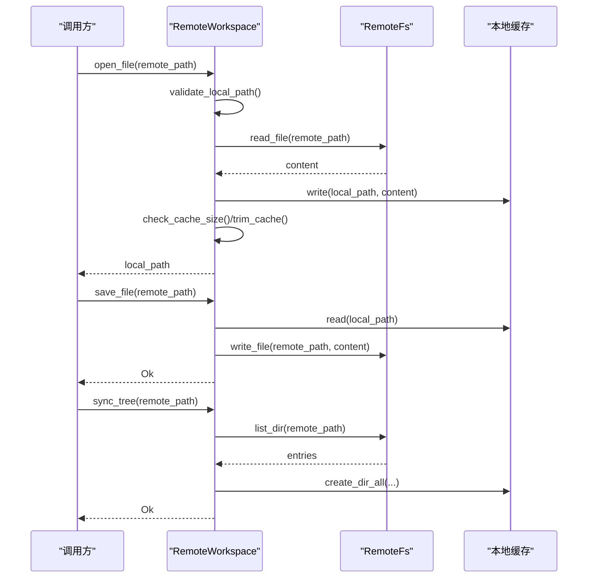
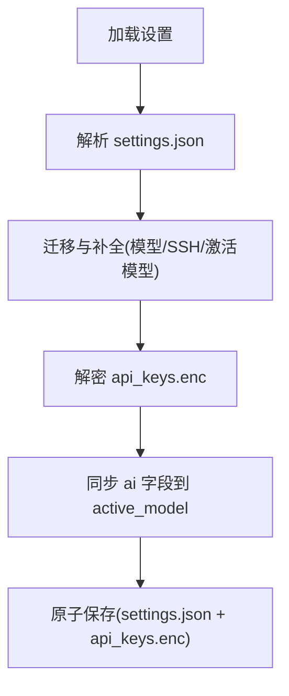
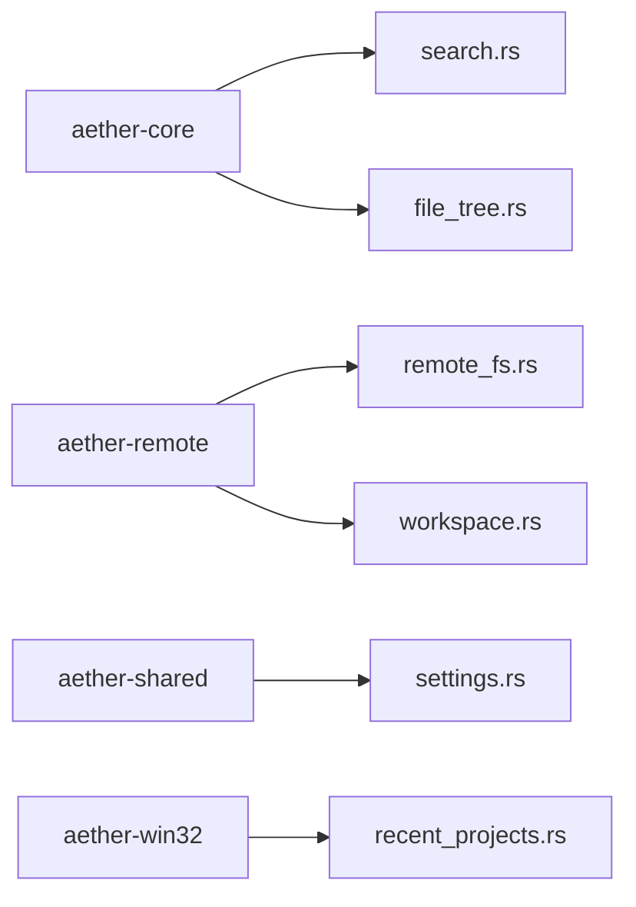

# 工作区管理

<cite>
**本文引用的文件**   
- [crates/aether-core/src/workspace/mod.rs](file://crates/aether-core/src/workspace/mod.rs)
- [crates/aether-core/src/workspace/file_tree.rs](file://crates/aether-core/src/workspace/file_tree.rs)
- [crates/aether-core/src/search.rs](file://crates/aether-core/src/search.rs)
- [crates/aether-remote/src/remote_fs.rs](file://crates/aether-remote/src/remote_fs.rs)
- [crates/aether-remote/src/workspace.rs](file://crates/aether-remote/src/workspace.rs)
- [crates/aether-shared/src/settings.rs](file://crates/aether-shared/src/settings.rs)
- [crates/aether-win32/src/recent_projects.rs](file://crates/aether-win32/src/recent_projects.rs)
</cite>

## 目录
1. [简介](#简介)
2. [项目结构](#项目结构)
3. [核心组件](#核心组件)
4. [架构总览](#架构总览)
5. [详细组件分析](#详细组件分析)
6. [依赖分析](#依赖分析)
7. [性能考虑](#性能考虑)
8. [故障排查指南](#故障排查指南)
9. [结论](#结论)
10. [附录：扩展与最佳实践](#附录扩展与最佳实践)

## 简介
本技术文档聚焦于牧羊人编辑器的工作区管理系统，围绕“工作区概念、文件树结构、文件系统监听、过滤与路径解析、构建算法（递归扫描、符号链接处理、性能优化）、配置管理（项目设置、忽略规则、元数据存储）”展开。文档同时提供面向开发者的扩展指南，包括如何扩展文件类型支持、自定义过滤器、大项目内存管理与异步加载策略等。

## 项目结构
工作区相关代码主要分布在以下模块：
- aether-core：核心数据结构与算法（文件树、搜索）
- aether-remote：远程工作区抽象与本地缓存同步
- aether-shared：应用级设置持久化（含工作区路径等）
- aether-win32：最近项目记录（辅助工作区历史）

**图表来源**
- [crates/aether-core/src/workspace/mod.rs:1-2](file://crates/aether-core/src/workspace/mod.rs#L1-L2)
- [crates/aether-core/src/workspace/file_tree.rs:1-233](file://crates/aether-core/src/workspace/file_tree.rs#L1-L233)
- [crates/aether-core/src/search.rs:1-202](file://crates/aether-core/src/search.rs#L1-L202)
- [crates/aether-remote/src/remote_fs.rs:1-46](file://crates/aether-remote/src/remote_fs.rs#L1-L46)
- [crates/aether-remote/src/workspace.rs:1-251](file://crates/aether-remote/src/workspace.rs#L1-L251)
- [crates/aether-shared/src/settings.rs:1-444](file://crates/aether-shared/src/settings.rs#L1-L444)
- [crates/aether-win32/src/recent_projects.rs:169-243](file://crates/aether-win32/src/recent_projects.rs#L169-L243)

**章节来源**
- [crates/aether-core/src/workspace/mod.rs:1-2](file://crates/aether-core/src/workspace/mod.rs#L1-L2)
- [crates/aether-core/src/workspace/file_tree.rs:1-233](file://crates/aether-core/src/workspace/file_tree.rs#L1-L233)
- [crates/aether-core/src/search.rs:1-202](file://crates/aether-core/src/search.rs#L1-L202)
- [crates/aether-remote/src/remote_fs.rs:1-46](file://crates/aether-remote/src/remote_fs.rs#L1-L46)
- [crates/aether-remote/src/workspace.rs:1-251](file://crates/aether-remote/src/workspace.rs#L1-L251)
- [crates/aether-shared/src/settings.rs:1-444](file://crates/aether-shared/src/settings.rs#L1-L444)
- [crates/aether-win32/src/recent_projects.rs:169-243](file://crates/aether-win32/src/recent_projects.rs#L169-L243)

## 核心组件
- 文件树 FileTree：紧凑内存布局的扁平存储 + 字符串池，支持 O(1) 尾插子节点、懒加载标记、Git 状态位、大小与修改时间等元数据。
- 搜索 SearchQuery：支持正则/字面量、大小写敏感、包含/排除模式，优先调用 ripgrep，回退到 walkdir。
- 远程工作区 RemoteWorkspace：统一 RemoteFs 抽象，负责本地缓存、版本跟踪、TOCTOU 防护、缓存清理与事件监听桥接。
- 应用设置 AppSettings：持久化 UI/AI/远程/自动保存等配置，含工作区路径、SSH 服务器列表等；原子写入与密钥加密存储。
- 最近项目 RecentProjectsManager：维护最近打开的项目列表，用于快速恢复工作区。

**章节来源**
- [crates/aether-core/src/workspace/file_tree.rs:1-233](file://crates/aether-core/src/workspace/file_tree.rs#L1-L233)
- [crates/aether-core/src/search.rs:1-202](file://crates/aether-core/src/search.rs#L1-L202)
- [crates/aether-remote/src/workspace.rs:1-251](file://crates/aether-remote/src/workspace.rs#L1-L251)
- [crates/aether-shared/src/settings.rs:1-444](file://crates/aether-shared/src/settings.rs#L1-L444)
- [crates/aether-win32/src/recent_projects.rs:169-243](file://crates/aether-win32/src/recent_projects.rs#L169-L243)

## 架构总览
工作区系统由“核心文件树 + 搜索过滤 + 远程缓存同步 + 设置持久化”构成。UI 层通过设置与工作区路径交互，核心层以 FileTree 表示当前工作区视图，搜索模块基于同一根目录进行内容检索，远程工作区在需要时拉取并缓存远端资源，并通过 RemoteFs 抽象暴露 watch 事件通道。

**图表来源**
- [crates/aether-core/src/workspace/file_tree.rs:78-233](file://crates/aether-core/src/workspace/file_tree.rs#L78-L233)
- [crates/aether-core/src/search.rs:47-171](file://crates/aether-core/src/search.rs#L47-L171)
- [crates/aether-remote/src/workspace.rs:58-147](file://crates/aether-remote/src/workspace.rs#L58-L147)
- [crates/aether-remote/src/remote_fs.rs:26-46](file://crates/aether-remote/src/remote_fs.rs#L26-L46)

## 详细组件分析

### 文件树 FileTree 设计
- 数据结构
  - FileTree：扁平 nodes 向量 + StringPool 名称池 + 虚拟根链表头尾指针。
  - FileNode：紧凑字段（名称偏移/长度、kind、parent/first_child/last_child/next_sibling、depth、is_expanded/is_loaded、git 状态、size/modified）。
  - StringPool：集中存储所有文件名，避免重复分配。
- 关键操作
  - add_node：O(1) 尾插，维护 first_child/last_child 与 next_sibling 链；虚拟根节点使用 root_first_child/root_last_child。
  - iter_children：按 sibling 链遍历直接子节点。
  - is_loaded：目录懒加载标记，展开前需先扫描子节点。
- 复杂度
  - 插入：O(1)
  - 遍历兄弟：O(k)（k 为兄弟数）
  - 空间：O(N + Σ|name_i|)，名称去重复用
- 安全与健壮性
  - 溢出保护：节点计数与名称长度 try_from 检查，防止静默截断导致索引错乱。
  - 别名安全：split_at_mut 避免可变引用冲突。

**图表来源**
- [crates/aether-core/src/workspace/file_tree.rs:1-233](file://crates/aether-core/src/workspace/file_tree.rs#L1-L233)

**章节来源**
- [crates/aether-core/src/workspace/file_tree.rs:1-233](file://crates/aether-core/src/workspace/file_tree.rs#L1-L233)

### 搜索与过滤机制
- 查询模型 SearchQuery：pattern、regex、case_sensitive、include/exclude 模式。
- 搜索流程
  - 优先 ripgrep：构造 rg 命令，支持 --glob 包含/排除、大小写、固定字符串/正则、行数/列数输出、最大结果限制。
  - 回退 walkdir：不跟随符号链接，跳过非文件、大小阈值、exclude/include 判断、逐行匹配。
- 过滤逻辑
  - is_excluded：相对路径包含任一 exclude 片段即排除。
  - is_included：若 include 为空则全部包含，否则任一 include 片段命中即包含。

**图表来源**
- [crates/aether-core/src/search.rs:47-171](file://crates/aether-core/src/search.rs#L47-L171)
- [crates/aether-core/src/search.rs:183-201](file://crates/aether-core/src/search.rs#L183-L201)

**章节来源**
- [crates/aether-core/src/search.rs:1-202](file://crates/aether-core/src/search.rs#L1-L202)

### 远程工作区与缓存同步
- RemoteFs 抽象：read_file/write_file/list_dir/watch/exec 等接口，统一 SSH/容器等后端。
- RemoteWorkspace
  - open_file：校验远程路径、下载至本地缓存、TOCTOU 二次 canonicalize 验证、更新版本。
  - save_file：从缓存读取并上传远程，递增版本。
  - sync_tree：列出远程目录，创建本地对应目录结构。
  - 缓存管理：MAX_CACHE_SIZE 与 CACHE_CLEANUP_RATIO，按最旧文件清理至目标大小。
  - 事件监听：转发底层 watch 通道。
- URI 解析：parse_remote_uri 支持 ssh://host/path 与 container://name/path。

**图表来源**
- [crates/aether-remote/src/workspace.rs:28-147](file://crates/aether-remote/src/workspace.rs#L28-L147)
- [crates/aether-remote/src/remote_fs.rs:26-46](file://crates/aether-remote/src/remote_fs.rs#L26-L46)

**章节来源**
- [crates/aether-remote/src/workspace.rs:1-251](file://crates/aether-remote/src/workspace.rs#L1-L251)
- [crates/aether-remote/src/remote_fs.rs:1-46](file://crates/aether-remote/src/remote_fs.rs#L1-L46)

### 工作区配置与元数据
- AppSettings
  - 包含 AI/UI/远程/自动保存等配置；UI 中 last_workspace 记录上次打开的工作区路径。
  - 原子写入：临时文件 + fsync + rename；损坏备份；密码认证迁移。
  - API 密钥：DPAPI 加密单独存储，不在 settings.json 明文出现。
- 最近项目
  - RecentProjectsManager：维护最近项目列表，JSON 序列化/反序列化，清理无效路径。

**图表来源**
- [crates/aether-shared/src/settings.rs:240-444](file://crates/aether-shared/src/settings.rs#L240-L444)
- [crates/aether-win32/src/recent_projects.rs:169-243](file://crates/aether-win32/src/recent_projects.rs#L169-L243)

**章节来源**
- [crates/aether-shared/src/settings.rs:1-444](file://crates/aether-shared/src/settings.rs#L1-L444)
- [crates/aether-win32/src/recent_projects.rs:169-243](file://crates/aether-win32/src/recent_projects.rs#L169-L243)

## 依赖分析
- 模块耦合
  - workspace/mod.rs 仅作为模块入口，导出 file_tree 与 search 能力。
  - search.rs 依赖 regex/walkdir，独立于文件系统实现。
  - remote/workspace.rs 依赖 remote_fs.rs 抽象，屏蔽具体后端差异。
  - shared/settings.rs 与 win32/recent_projects.rs 解耦，通过 JSON 持久化协作。
- 外部依赖
  - ripgrep（可选）：提升搜索性能。
  - Windows DPAPI：加密 API 密钥。
  - dirs：定位用户配置目录。

**图表来源**
- [crates/aether-core/src/workspace/mod.rs:1-2](file://crates/aether-core/src/workspace/mod.rs#L1-L2)
- [crates/aether-core/src/search.rs:1-202](file://crates/aether-core/src/search.rs#L1-L202)
- [crates/aether-core/src/workspace/file_tree.rs:1-233](file://crates/aether-core/src/workspace/file_tree.rs#L1-L233)
- [crates/aether-remote/src/remote_fs.rs:1-46](file://crates/aether-remote/src/remote_fs.rs#L1-L46)
- [crates/aether-remote/src/workspace.rs:1-251](file://crates/aether-remote/src/workspace.rs#L1-L251)
- [crates/aether-shared/src/settings.rs:1-444](file://crates/aether-shared/src/settings.rs#L1-L444)
- [crates/aether-win32/src/recent_projects.rs:169-243](file://crates/aether-win32/src/recent_projects.rs#L169-L243)

**章节来源**
- [crates/aether-core/src/workspace/mod.rs:1-2](file://crates/aether-core/src/workspace/mod.rs#L1-L2)
- [crates/aether-core/src/search.rs:1-202](file://crates/aether-core/src/search.rs#L1-L202)
- [crates/aether-core/src/workspace/file_tree.rs:1-233](file://crates/aether-core/src/workspace/file_tree.rs#L1-L233)
- [crates/aether-remote/src/remote_fs.rs:1-46](file://crates/aether-remote/src/remote_fs.rs#L1-L46)
- [crates/aether-remote/src/workspace.rs:1-251](file://crates/aether-remote/src/workspace.rs#L1-L251)
- [crates/aether-shared/src/settings.rs:1-444](file://crates/aether-shared/src/settings.rs#L1-L444)
- [crates/aether-win32/src/recent_projects.rs:169-243](file://crates/aether-win32/src/recent_projects.rs#L169-L243)

## 性能考虑
- 文件树
  - 扁平存储与字符串池减少碎片与重复分配；O(1) 尾插提升构建速度。
  - 懒加载：目录默认未加载子节点，按需展开降低初始内存占用。
- 搜索
  - 优先 ripgrep，利用原生并行与多进程优势；回退方案限制最大结果与文件大小。
  - 过滤前置：exclude/include 快速剪枝，避免不必要 I/O。
- 远程缓存
  - 缓存上限与渐进清理，避免无限增长；TOCTOU 防护确保写入安全。
- 设置持久化
  - 原子写入避免崩溃导致配置损坏；DPAPI 加密避免明文泄露。

[本节为通用性能建议，无需特定文件来源]

## 故障排查指南
- 搜索无结果
  - 检查 pattern 是否为空；确认 include/exclude 模式是否正确；确认 ripgrep 可用或回退路径正常。
- 远程文件无法打开
  - 检查远程路径是否包含非法字符；确认本地缓存目录权限；查看 TOCTOU 检测日志。
- 缓存过大
  - 观察 MAX_CACHE_SIZE 与 CACHE_CLEANUP_RATIO 行为；必要时手动清理缓存目录。
- 设置损坏
  - 查看 .json.corrupt 备份；重新生成默认设置；确认 DPAPI 解密失败时的降级行为。

**章节来源**
- [crates/aether-core/src/search.rs:47-171](file://crates/aether-core/src/search.rs#L47-L171)
- [crates/aether-remote/src/workspace.rs:28-147](file://crates/aether-remote/src/workspace.rs#L28-L147)
- [crates/aether-shared/src/settings.rs:328-417](file://crates/aether-shared/src/settings.rs#L328-L417)

## 结论
工作区管理系统以紧凑高效的文件树为核心，结合灵活的搜索过滤与安全的远程缓存同步，配合健壮的设置持久化机制，为大项目与远程场景提供了良好的可扩展性与稳定性。通过懒加载、原子写入、TOCTOU 防护与缓存清理等策略，系统在性能与安全之间取得平衡。

[本节为总结性内容，无需特定文件来源]

## 附录：扩展与最佳实践

### 扩展文件类型支持
- 在文件树节点中新增 FileKind 变体（例如 SymbolicLink 已存在），并在 UI/图标映射处适配新类型。
- 在搜索与高亮管线中注册新的语言/词法分析器，以便后续语义增强。

参考路径
- [crates/aether-core/src/workspace/file_tree.rs:45-50](file://crates/aether-core/src/workspace/file_tree.rs#L45-L50)

### 自定义文件过滤器
- 扩展 SearchQuery.include/exclude 模式，支持更复杂的 glob 或正则表达式。
- 在 is_excluded/is_included 中加入业务规则（如二进制文件、隐藏目录等）。

参考路径
- [crates/aether-core/src/search.rs:183-201](file://crates/aether-core/src/search.rs#L183-L201)

### 大项目内存管理与异步加载
- 使用 FileTree.is_loaded 标记实现目录懒加载，仅在展开时扫描子节点。
- 对超大目录可引入分片扫描与进度回调，避免主线程阻塞。

参考路径
- [crates/aether-core/src/workspace/file_tree.rs:78-158](file://crates/aether-core/src/workspace/file_tree.rs#L78-L158)

### 远程工作区扩展
- 实现 RemoteFs trait 以接入新的后端（如 SFTP、WebDAV）。
- 在 RemoteWorkspace 中扩展缓存策略（LRU、按后缀分类等）。

参考路径
- [crates/aether-remote/src/remote_fs.rs:26-46](file://crates/aether-remote/src/remote_fs.rs#L26-L46)
- [crates/aether-remote/src/workspace.rs:154-206](file://crates/aether-remote/src/workspace.rs#L154-L206)

### 配置与元数据扩展
- 在 AppSettings 中添加工作区级别配置项（如默认忽略规则、文件类型开关）。
- 将工作区元数据（如 Git 分支、提交哈希）持久化到工作区目录下的专用文件。

参考路径
- [crates/aether-shared/src/settings.rs:1-444](file://crates/aether-shared/src/settings.rs#L1-L444)