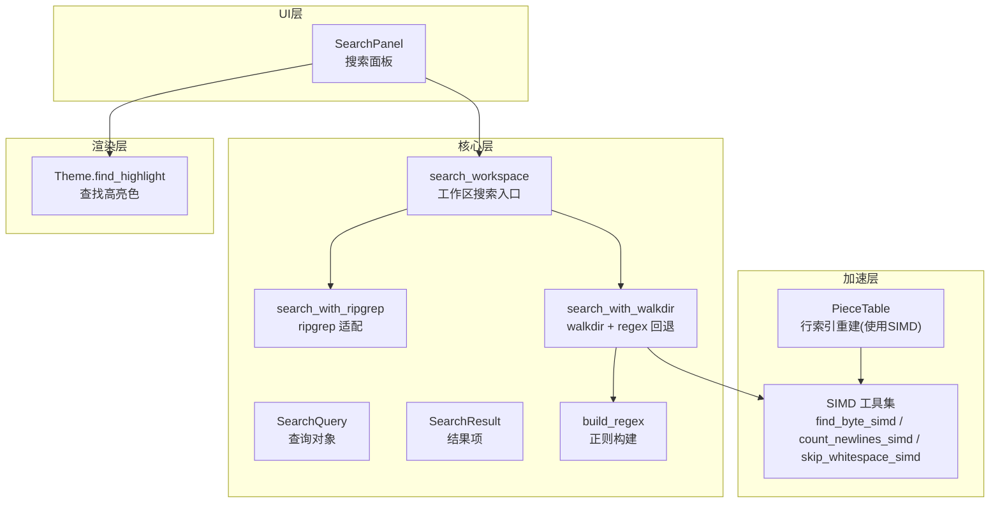
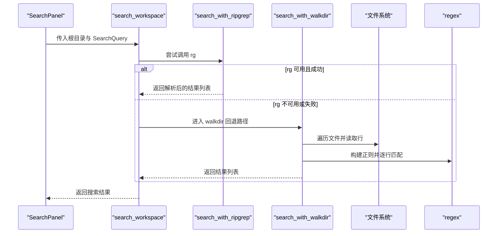
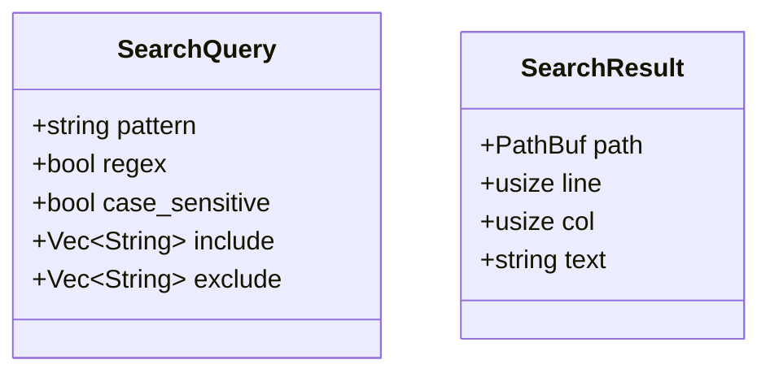
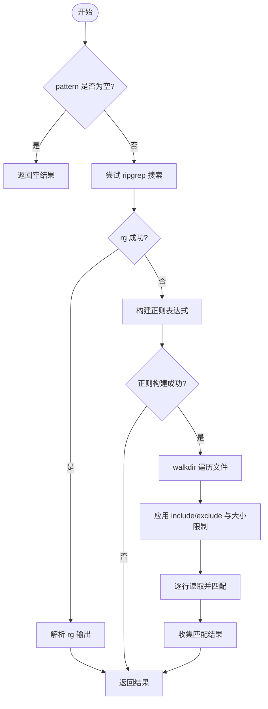
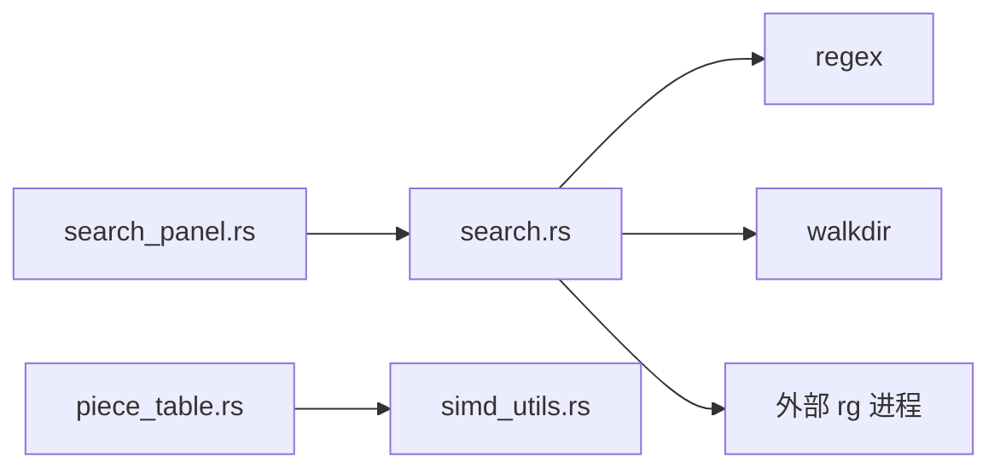

# 搜索系统

<cite>
**本文引用的文件**   
- [crates/aether-core/src/search.rs](file://crates/aether-core/src/search.rs)
- [crates/aether-win32/src/search_panel.rs](file://crates/aether-win32/src/search_panel.rs)
- [crates/aether-core/src/simd_utils.rs](file://crates/aether-core/src/simd_utils.rs)
- [crates/aether-core/src/buffer/piece_table.rs](file://crates/aether-core/src/buffer/piece_table.rs)
- [crates/aether-render/src/theme.rs](file://crates/aether-render/src/theme.rs)
</cite>

## 目录
1. [简介](#简介)
2. [项目结构](#项目结构)
3. [核心组件](#核心组件)
4. [架构总览](#架构总览)
5. [详细组件分析](#详细组件分析)
6. [依赖关系分析](#依赖关系分析)
7. [性能考量](#性能考量)
8. [故障排查指南](#故障排查指南)
9. [结论](#结论)
10. [附录](#附录)

## 简介
本技术文档聚焦牧羊人编辑器的“搜索系统”，覆盖以下关键主题：
- 文本搜索算法实现原理：正则表达式匹配、大小写敏感控制、包含/排除过滤与全文检索流程。
- SIMD 优化策略：批量字符比较与向量化字符串处理，用于加速换行符查找、字节定位、空白跳过等基础操作。
- 搜索结果数据结构：匹配位置索引（行号、列号）、结果项结构与导航支持。
- 使用示例与扩展指南：如何调用搜索 API、如何进行替换（概念性说明）、如何扩展自定义搜索算法。
- 性能与大文件处理技巧：优先调用外部高性能工具、限制文件大小与结果数量、增量更新行索引等。

## 项目结构
搜索系统由三层组成：
- 搜索内核（aether-core）：提供工作区搜索入口、正则构建、文件遍历与解析逻辑。
- 界面面板（aether-win32）：封装用户输入、状态展示与结果导航。
- 渲染主题（aether-render）：提供“查找高亮”颜色配置，供 UI 层渲染匹配片段时使用。
- 底层加速（simd_utils）：为缓冲区与搜索路径提供 SWAR/SIMD 风格的批量处理原语。
- 缓冲区（piece_table）：利用 SIMD 加速重建行索引，支撑大文件快速定位。

图表来源
- [crates/aether-win32/src/search_panel.rs:1-108](file://crates/aether-win32/src/search_panel.rs#L1-L108)
- [crates/aether-core/src/search.rs:46-171](file://crates/aether-core/src/search.rs#L46-L171)
- [crates/aether-core/src/simd_utils.rs:1-553](file://crates/aether-core/src/simd_utils.rs#L1-L553)
- [crates/aether-core/src/buffer/piece_table.rs:666-696](file://crates/aether-core/src/buffer/piece_table.rs#L666-L696)
- [crates/aether-render/src/theme.rs:100-145](file://crates/aether-render/src/theme.rs#L100-L145)

章节来源
- [crates/aether-core/src/search.rs:1-342](file://crates/aether-core/src/search.rs#L1-L342)
- [crates/aether-win32/src/search_panel.rs:1-108](file://crates/aether-win32/src/search_panel.rs#L1-L108)
- [crates/aether-core/src/simd_utils.rs:1-553](file://crates/aether-core/src/simd_utils.rs#L1-L553)
- [crates/aether-core/src/buffer/piece_table.rs:666-696](file://crates/aether-core/src/buffer/piece_table.rs#L666-L696)
- [crates/aether-render/src/theme.rs:100-145](file://crates/aether-render/src/theme.rs#L100-L145)

## 核心组件
- SearchQuery：描述一次搜索的查询条件，包括模式、是否正则、是否区分大小写、包含/排除的文件 glob 模式集合。
- SearchResult：描述一个匹配结果，包含文件路径、行号、列号以及所在行的文本内容。
- search_workspace：统一入口，优先尝试 ripgrep；不可用时回退到 walkdir + regex。
- build_regex：根据查询条件构建正则表达式，支持字面量转义与大小写选项。
- is_excluded/is_included：基于相对路径的简单包含/排除判断。
- SearchPanel：UI 侧对搜索的封装，负责输入、触发搜索、结果选择与状态显示。

章节来源
- [crates/aether-core/src/search.rs:7-43](file://crates/aether-core/src/search.rs#L7-L43)
- [crates/aether-core/src/search.rs:46-171](file://crates/aether-core/src/search.rs#L46-L171)
- [crates/aether-core/src/search.rs:172-201](file://crates/aether-core/src/search.rs#L172-L201)
- [crates/aether-win32/src/search_panel.rs:1-108](file://crates/aether-win32/src/search_panel.rs#L1-L108)

## 架构总览
搜索系统采用“外部优先 + 内部回退”的双通道设计：
- 外部通道：调用系统 ripgrep（rg），通过命令行参数传递大小写、正则、glob 过滤、最大行数/列数与文件大小限制，并解析其结构化输出。
- 内部通道：当 rg 不可用或失败时，使用 walkdir 遍历文件，按行读取并使用 regex 进行匹配，同时应用包含/排除规则与文件大小上限。

图表来源
- [crates/aether-core/src/search.rs:46-171](file://crates/aether-core/src/search.rs#L46-L171)
- [crates/aether-win32/src/search_panel.rs:57-79](file://crates/aether-win32/src/search_panel.rs#L57-L79)

## 详细组件分析

### 搜索查询与结果模型
- SearchQuery 字段说明
  - pattern：搜索模式（纯文本或正则）。
  - regex：是否将 pattern 视为正则表达式。
  - case_sensitive：是否区分大小写。
  - include/exclude：包含/排除文件的 glob 模式集合。
- SearchResult 字段说明
  - path：匹配文件路径。
  - line：匹配行号（从 1 开始）。
  - col：匹配起始列号（从 1 开始）。
  - text：整行文本内容（便于 UI 高亮上下文）。

图表来源
- [crates/aether-core/src/search.rs:7-43](file://crates/aether-core/src/search.rs#L7-L43)

章节来源
- [crates/aether-core/src/search.rs:7-43](file://crates/aether-core/src/search.rs#L7-L43)

### 正则构建与匹配流程
- 构建策略
  - 若 query.regex 为真，直接使用 pattern 作为正则。
  - 否则对 pattern 进行转义，确保字面量精确匹配。
  - 根据 case_sensitive 设置大小写不敏感标志。
- 匹配执行
  - 在 walkdir 模式下，逐行扫描并按行进行 find_iter 匹配，记录每个匹配的起始位置（转换为列号）。
  - 在 ripgrep 模式下，通过 --regexp/--fixed-strings 切换模式，并解析 rg 输出的 path:line:col:text 格式。

图表来源
- [crates/aether-core/src/search.rs:46-171](file://crates/aether-core/src/search.rs#L46-L171)
- [crates/aether-core/src/search.rs:172-182](file://crates/aether-core/src/search.rs#L172-L182)

章节来源
- [crates/aether-core/src/search.rs:172-182](file://crates/aether-core/src/search.rs#L172-L182)
- [crates/aether-core/src/search.rs:127-171](file://crates/aether-core/src/search.rs#L127-L171)
- [crates/aether-core/src/search.rs:95-126](file://crates/aether-core/src/search.rs#L95-L126)

### 包含/排除与过滤策略
- 排除规则：基于相对路径字符串包含匹配，命中即排除。
- 包含规则：若 include 为空则默认包含全部；否则只要相对路径包含任一 include 模式即纳入。
- 文件大小限制：walkdir 模式下仅处理不超过 1MB 的文件，避免大文件拖慢搜索。

章节来源
- [crates/aether-core/src/search.rs:183-201](file://crates/aether-core/src/search.rs#L183-L201)
- [crates/aether-core/src/search.rs:127-171](file://crates/aether-core/src/search.rs#L127-L171)

### 搜索结果数据结构与导航
- 结果项包含路径、行号、列号与整行文本，便于 UI 直接高亮匹配片段。
- SearchPanel 维护 selected_index，支持上下导航循环选择结果。
- 状态信息（status）用于提示当前搜索进度与结果数量。

章节来源
- [crates/aether-core/src/search.rs:37-43](file://crates/aether-core/src/search.rs#L37-L43)
- [crates/aether-win32/src/search_panel.rs:1-108](file://crates/aether-win32/src/search_panel.rs#L1-L108)

### 高亮显示与主题集成
- 主题中定义了 find_highlight 颜色，可用于渲染匹配片段的背景或前景高亮。
- UI 层可结合 SearchResult 的行/列信息与 Theme.find_highlight 完成可视化。

章节来源
- [crates/aether-render/src/theme.rs:100-145](file://crates/aether-render/src/theme.rs#L100-L145)

## 依赖关系分析
- 模块耦合
  - search_panel 依赖 aether_core::search 提供的搜索能力。
  - search 模块依赖 regex 与 walkdir，并在可用时调用外部 rg。
  - piece_table 使用 simd_utils 的 SIMD 原语加速行索引重建。
- 外部依赖
  - ripgrep（rg）：高性能全文检索工具，作为首选引擎。
  - regex：Rust 标准正则库，用于内部回退路径。
  - walkdir：递归遍历文件系统。

图表来源
- [crates/aether-win32/src/search_panel.rs:1-108](file://crates/aether-win32/src/search_panel.rs#L1-L108)
- [crates/aether-core/src/search.rs:1-342](file://crates/aether-core/src/search.rs#L1-L342)
- [crates/aether-core/src/buffer/piece_table.rs:666-696](file://crates/aether-core/src/buffer/piece_table.rs#L666-L696)
- [crates/aether-core/src/simd_utils.rs:1-553](file://crates/aether-core/src/simd_utils.rs#L1-L553)

章节来源
- [crates/aether-core/src/search.rs:1-342](file://crates/aether-core/src/search.rs#L1-L342)
- [crates/aether-win32/src/search_panel.rs:1-108](file://crates/aether-win32/src/search_panel.rs#L1-L108)
- [crates/aether-core/src/buffer/piece_table.rs:666-696](file://crates/aether-core/src/buffer/piece_table.rs#L666-L696)
- [crates/aether-core/src/simd_utils.rs:1-553](file://crates/aether-core/src/simd_utils.rs#L1-L553)

## 性能考量
- 外部引擎优先：优先调用 rg，充分利用其 C/C++ 底层优化与多线程能力。
- 结果与大小限制：
  - rg 模式限制每文件最多 50 条匹配，整体最多 500 条结果。
  - rg 模式限制单文件大小为 1M。
  - walkdir 模式同样限制单文件大小为 1M，避免内存占用过大。
- SIMD 加速：
  - 行索引重建中使用 find_byte_simd 批量查找换行符，显著降低 O(n) 扫描开销。
  - 计数换行符使用 count_newlines_simd，采用 16 字节块与 8 字节块混合策略，提升吞吐。
  - 空白跳过使用 skip_whitespace_simd，减少分支预测失败带来的性能损失。
- 增量更新：
  - 插入/删除后对行索引进行局部更新，避免全量重建，提高交互响应速度。

章节来源
- [crates/aether-core/src/search.rs:46-171](file://crates/aether-core/src/search.rs#L46-L171)
- [crates/aether-core/src/buffer/piece_table.rs:666-696](file://crates/aether-core/src/buffer/piece_table.rs#L666-L696)
- [crates/aether-core/src/simd_utils.rs:1-553](file://crates/aether-core/src/simd_utils.rs#L1-L553)

## 故障排查指南
- 正则错误
  - 现象：构建正则失败导致搜索无结果。
  - 排查：检查 query.regex 与 pattern 的合法性；确认大小写敏感设置是否符合预期。
  - 参考：[crates/aether-core/src/search.rs:172-182](file://crates/aether-core/src/search.rs#L172-L182)
- rg 不可用或失败
  - 现象：无法调用 rg 或返回非零退出码。
  - 排查：确认 rg 已安装且在 PATH 中；检查命令参数是否正确；查看输出解析逻辑。
  - 参考：[crates/aether-core/src/search.rs:60-94](file://crates/aether-core/src/search.rs#L60-L94), [crates/aether-core/src/search.rs:95-126](file://crates/aether-core/src/search.rs#L95-L126)
- 结果过多或过少
  - 现象：结果被截断或未命中。
  - 排查：检查 include/exclude 规则与文件大小限制；确认 pattern 是否过于严格。
  - 参考：[crates/aether-core/src/search.rs:127-171](file://crates/aether-core/src/search.rs#L127-L171), [crates/aether-core/src/search.rs:183-201](file://crates/aether-core/src/search.rs#L183-L201)
- 高亮异常
  - 现象：匹配片段未正确高亮。
  - 排查：确认 UI 层是否正确读取 SearchResult 的 line/col 并使用 Theme.find_highlight 渲染。
  - 参考：[crates/aether-render/src/theme.rs:100-145](file://crates/aether-render/src/theme.rs#L100-L145)

章节来源
- [crates/aether-core/src/search.rs:60-126](file://crates/aether-core/src/search.rs#L60-L126)
- [crates/aether-core/src/search.rs:127-201](file://crates/aether-core/src/search.rs#L127-L201)
- [crates/aether-render/src/theme.rs:100-145](file://crates/aether-render/src/theme.rs#L100-L145)

## 结论
搜索系统以“外部优先 + 内部回退”为核心策略，在保证易用性的同时兼顾性能与可扩展性。通过 SIMD 加速的基础原语与行索引的增量更新机制，系统在大规模代码库与大文件场景下仍能提供流畅体验。未来可在模糊搜索、语义感知匹配等方面进一步扩展。

## 附录

### 使用示例（API 调用与替换概念）
- 基本查找
  - 构造 SearchQuery，设置 pattern、regex、case_sensitive 与 include/exclude。
  - 调用 search_workspace(root_dir, &query)，获取 Vec<SearchResult>。
  - 在 UI 层遍历结果，使用 Theme.find_highlight 进行高亮。
- 替换（概念性说明）
  - 当前搜索模块未提供替换 API。如需替换，可在 UI 层基于 SearchResult 的行/列信息定位缓冲区位置，调用缓冲区的插入/删除接口完成修改，随后刷新行索引与视图。
- 导航支持
  - 使用 SearchPanel 的 select_next/select_prev 在结果间循环导航，selected_result 获取当前选中项。

章节来源
- [crates/aether-core/src/search.rs:46-171](file://crates/aether-core/src/search.rs#L46-L171)
- [crates/aether-win32/src/search_panel.rs:57-96](file://crates/aether-win32/src/search_panel.rs#L57-L96)
- [crates/aether-render/src/theme.rs:100-145](file://crates/aether-render/src/theme.rs#L100-L145)

### 自定义搜索算法扩展指南
- 扩展点建议
  - 新增搜索后端：在 search_workspace 中增加新的后端（如基于 tree-sitter 的语义搜索），并通过特征开关或配置选择启用。
  - 增强过滤策略：改进 is_excluded/is_included 为更严格的 glob 匹配（例如使用 globset 库），支持 .gitignore 风格规则。
  - 增量结果流：将 Vec<SearchResult> 改为迭代器或异步流，支持分页与实时增量更新。
- 性能注意事项
  - 保持外部引擎优先策略，仅在必要时回退到内部实现。
  - 对热点路径引入 SIMD 原语（如 find_byte_simd、count_newlines_simd）以减少 CPU 开销。
  - 合理设置结果上限与文件大小限制，避免 UI 卡顿。

章节来源
- [crates/aether-core/src/search.rs:46-171](file://crates/aether-core/src/search.rs#L46-L171)
- [crates/aether-core/src/simd_utils.rs:1-553](file://crates/aether-core/src/simd_utils.rs#L1-L553)