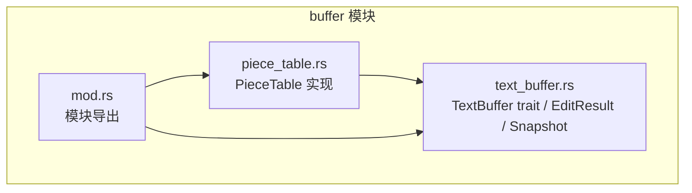
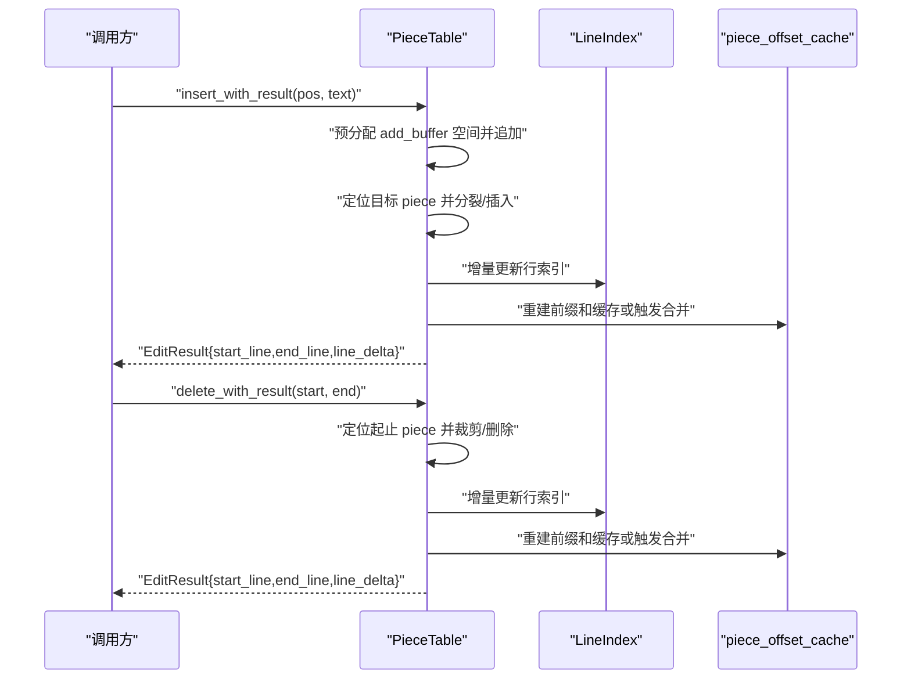
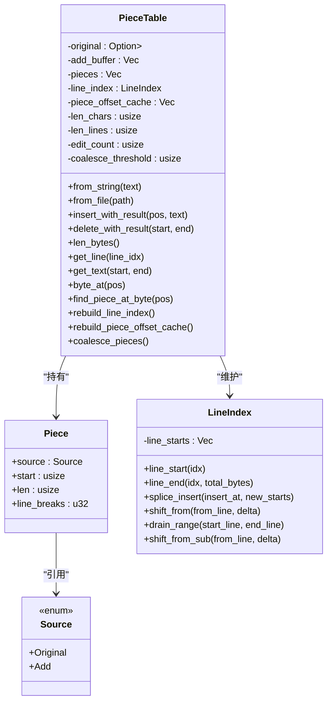
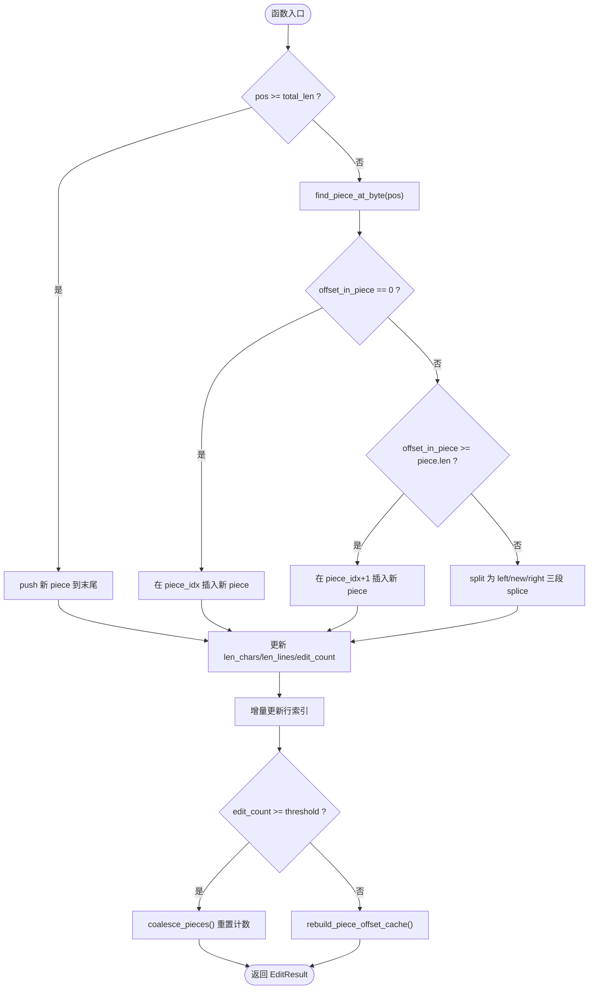
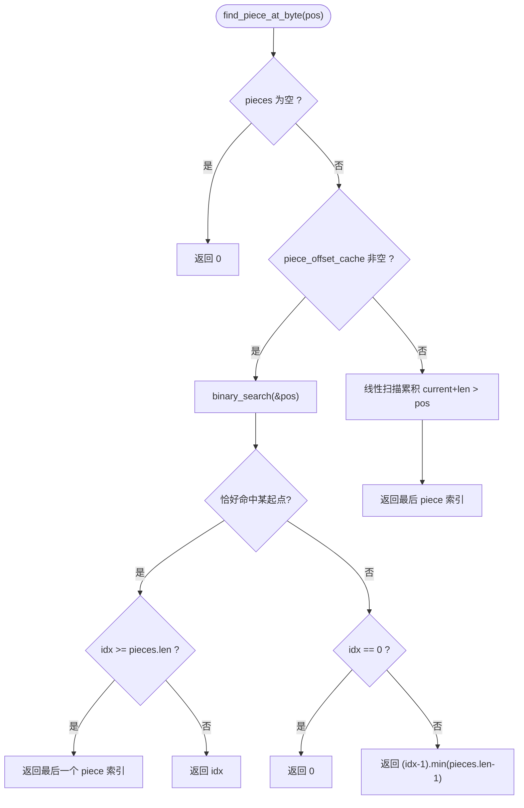

# Piece Table 核心实现

<cite>
**本文引用的文件**
- [crates/aether-core/src/buffer/piece_table.rs](file://crates/aether-core/src/buffer/piece_table.rs)
- [crates/aether-core/src/buffer/text_buffer.rs](file://crates/aether-core/src/buffer/text_buffer.rs)
- [crates/aether-core/src/buffer/mod.rs](file://crates/aether-core/src/buffer/mod.rs)
</cite>

## 目录
1. [简介](#简介)
2. [项目结构](#项目结构)
3. [核心组件](#核心组件)
4. [架构总览](#架构总览)
5. [详细组件分析](#详细组件分析)
6. [依赖关系分析](#依赖关系分析)
7. [性能考量](#性能考量)
8. [故障排查指南](#故障排查指南)
9. [结论](#结论)
10. [附录](#附录)

## 简介
本文件围绕 Piece Table 的核心实现进行深入技术文档化，重点覆盖：
- 内存布局与数据结构：原始文件内存映射（Mmap）、追加缓冲区（add_buffer）和片段表（pieces）的管理机制。
- O(1) 插入/删除算法的实现细节：片段分裂、合并策略与边界处理。
- piece_offset_cache 前缀和优化技术，以及 find_piece_at_byte 的二分查找实现。
- insert_with_result 与 delete_with_result 的完整流程与 EditResult 返回值含义及使用场景。
- 面向高级开发者的内存管理最佳实践与性能调优建议，包括 coalesce_threshold 阈值设置与碎片合并策略。

## 项目结构
Piece Table 位于 aether-core 的 buffer 模块中，对外通过 TextBuffer trait 暴露统一接口，并提供不可变快照用于并发读取。

图表来源
- [crates/aether-core/src/buffer/piece_table.rs:1-34](file://crates/aether-core/src/buffer/piece_table.rs#L1-L34)
- [crates/aether-core/src/buffer/text_buffer.rs:1-49](file://crates/aether-core/src/buffer/text_buffer.rs#L1-L49)
- [crates/aether-core/src/buffer/mod.rs:1-9](file://crates/aether-core/src/buffer/mod.rs#L1-L9)

章节来源
- [crates/aether-core/src/buffer/mod.rs:1-9](file://crates/aether-core/src/buffer/mod.rs#L1-L9)

## 核心组件
- PieceTable：高性能文本缓冲区，支持 O(1) 插入/删除、零拷贝大文件打开。
- Piece：一个连续字节片段，指向 original 或 add_buffer。
- Source：枚举，标识片段来源是 Original 还是 Add。
- LineIndex：行索引，维护每行的起始全局字节偏移，支持 O(1) 行号到字节偏移转换。
- EditResult：编辑结果，包含受影响行范围与行数变化，用于上层行级缓存失效计算。
- TextBufferSnapshot：不可变快照，允许后台线程安全读取。

章节来源
- [crates/aether-core/src/buffer/piece_table.rs:11-56](file://crates/aether-core/src/buffer/piece_table.rs#L11-L56)
- [crates/aether-core/src/buffer/text_buffer.rs:142-171](file://crates/aether-core/src/buffer/text_buffer.rs#L142-L171)
- [crates/aether-core/src/buffer/text_buffer.rs:51-59](file://crates/aether-core/src/buffer/text_buffer.rs#L51-L59)

## 架构总览
整体数据流与关键路径如下：
- 构造：从字符串或文件创建；从文件时采用 memmap2 进行内存映射，避免全量加载。
- 写入：insert_with_result 将新内容追加到 add_buffer，并更新 pieces、行索引与前缀和缓存。
- 删除：delete_with_result 调整 pieces 范围，必要时分裂片段，更新行索引与前缀和缓存。
- 读取：get_line/get_text 优先尝试单 piece 零拷贝，否则回退拼接；byte_to_line_col 使用行索引二分查找。
- 快照：create_snapshot 克隆 Arc<Mmap> 共享原始映射，避免大文件拷贝。

图表来源
- [crates/aether-core/src/buffer/piece_table.rs:171-282](file://crates/aether-core/src/buffer/piece_table.rs#L171-L282)
- [crates/aether-core/src/buffer/piece_table.rs:290-408](file://crates/aether-core/src/buffer/piece_table.rs#L290-L408)
- [crates/aether-core/src/buffer/piece_table.rs:666-710](file://crates/aether-core/src/buffer/piece_table.rs#L666-L710)

## 详细组件分析

### 数据结构与内存布局
- original: Option<Arc<Mmap>>，只读，Arc 共享避免快照拷贝。
- add_buffer: Vec<u8>，只追加不删除，减少移动开销。
- pieces: Vec<Piece>，有序片段表，每个 Piece 记录 source/start/len/line_breaks。
- line_index: LineIndex，维护 line_starts 向量，支持 O(1) 行号到字节偏移。
- piece_offset_cache: Vec<usize>，前缀和缓存，O(1) 获取任意 piece 的起始字节偏移，末尾哨兵为总字节数。
- len_chars/len_lines/edit_count/coalesce_threshold：元数据与合并阈值控制。

图表来源
- [crates/aether-core/src/buffer/piece_table.rs:11-56](file://crates/aether-core/src/buffer/piece_table.rs#L11-L56)
- [crates/aether-core/src/buffer/piece_table.rs:51-115](file://crates/aether-core/src/buffer/piece_table.rs#L51-L115)

章节来源
- [crates/aether-core/src/buffer/piece_table.rs:11-56](file://crates/aether-core/src/buffer/piece_table.rs#L11-L56)
- [crates/aether-core/src/buffer/piece_table.rs:51-115](file://crates/aether-core/src/buffer/piece_table.rs#L51-L115)

### O(1) 插入/删除算法与边界处理
- 插入 insert_with_result：
  - 预分配 add_buffer 空间，追加新文本。
  - 若 pos >= total_len，直接 push 新 piece。
  - 否则定位目标 piece，按 offset_in_piece 是否为 0、等于 piece.len 或在中间三种情况分别处理：在边界处插入新 piece，或在中间分裂为 left/new/right 三段。
  - 更新 len_chars/len_lines/edit_count，增量更新行索引，根据 edit_count 决定是否合并碎片或重建前缀和缓存。
- 删除 delete_with_result：
  - 钳位 end 防止越界。
  - 定位 start/end 所在 piece 及局部偏移，分同 piece 与跨多个 piece 两种情况处理：裁剪两端保留剩余部分或删除整段。
  - 重新计算 len_chars/len_lines，增量更新行索引，合并或重建缓存。
- 边界保护：
  - 空表插入分支特殊处理，避免 find_piece_at_byte -> pieces[0] 越界。
  - 删除区间钳位与“幽灵行起点”修复，确保行索引一致性。

图表来源
- [crates/aether-core/src/buffer/piece_table.rs:171-282](file://crates/aether-core/src/buffer/piece_table.rs#L171-L282)

章节来源
- [crates/aether-core/src/buffer/piece_table.rs:171-282](file://crates/aether-core/src/buffer/piece_table.rs#L171-L282)
- [crates/aether-core/src/buffer/piece_table.rs:290-408](file://crates/aether-core/src/buffer/piece_table.rs#L290-L408)

### piece_offset_cache 前缀和优化与 find_piece_at_byte
- piece_offset_cache[i] 表示第 i 个 piece 的起始字节偏移，末尾元素为总字节数。
- byte_offset_of_piece 通过该缓存 O(1) 获取偏移；未构建时回退线性求和。
- find_piece_at_byte 优先使用前缀和缓存做二分查找，定位包含 pos 的 piece；未构建时回退线性扫描。
- get_text_bytes 利用二分查找快速定位起始 piece，若整个 [start, end) 落在单个 piece 内则零拷贝返回切片，否则回退拼接。

图表来源
- [crates/aether-core/src/buffer/piece_table.rs:604-641](file://crates/aether-core/src/buffer/piece_table.rs#L604-L641)
- [crates/aether-core/src/buffer/piece_table.rs:644-652](file://crates/aether-core/src/buffer/piece_table.rs#L644-L652)
- [crates/aether-core/src/buffer/piece_table.rs:444-461](file://crates/aether-core/src/buffer/piece_table.rs#L444-L461)

章节来源
- [crates/aether-core/src/buffer/piece_table.rs:604-641](file://crates/aether-core/src/buffer/piece_table.rs#L604-L641)
- [crates/aether-core/src/buffer/piece_table.rs:644-652](file://crates/aether-core/src/buffer/piece_table.rs#L644-L652)
- [crates/aether-core/src/buffer/piece_table.rs:444-461](file://crates/aether-core/src/buffer/piece_table.rs#L444-L461)

### EditResult 返回值含义与使用场景
- start_line：受影响的起始行号（包含）。
- end_line：受影响的结束行号（包含），内部会钳位保证 end_line >= start_line。
- line_delta：行数变化（正值增加，负值减少）。
- 典型用法：上层基于 EditResult 精确标记需要失效的行级缓存区域，避免全量重算。

章节来源
- [crates/aether-core/src/buffer/text_buffer.rs:142-171](file://crates/aether-core/src/buffer/text_buffer.rs#L142-L171)
- [crates/aether-core/src/buffer/piece_table.rs:171-282](file://crates/aether-core/src/buffer/piece_table.rs#L171-L282)
- [crates/aether-core/src/buffer/piece_table.rs:290-408](file://crates/aether-core/src/buffer/piece_table.rs#L290-L408)

### insert_with_result 与 delete_with_result 完整流程示例
- insert_with_result 流程要点：
  - 预分配 add_buffer 容量，追加新文本。
  - 空表或尾部插入直接 push 新 piece。
  - 中间插入需分裂当前 piece 为 left/new/right 三段，splice 替换。
  - 更新元数据与行索引，按阈值决定合并或重建前缀和缓存。
  - 返回 EditResult，包含受影响行范围与行数变化。
- delete_with_result 流程要点：
  - 钳位 end 防止越界。
  - 定位起止 piece 与局部偏移，分同 piece 与跨多 piece 处理。
  - 裁剪两端保留剩余部分或删除整段，必要时 splice 替换。
  - 重新计算 len_chars/len_lines，增量更新行索引，按阈值合并或重建缓存。
  - 返回 EditResult，包含受影响行范围与行数变化。

章节来源
- [crates/aether-core/src/buffer/piece_table.rs:171-282](file://crates/aether-core/src/buffer/piece_table.rs#L171-L282)
- [crates/aether-core/src/buffer/piece_table.rs:290-408](file://crates/aether-core/src/buffer/piece_table.rs#L290-L408)

### 行索引与字节/行列转换
- rebuild_line_index：遍历所有 piece，使用 SIMD 加速换行符查找，构建 line_starts。
- update_line_index_for_insert/update_line_index_for_delete：增量更新行索引，避免全量重建。
- line_col_to_byte/byte_to_line_col：基于 line_index 的 O(1)/O(log n) 转换，处理 CRLF 与末尾光标合法性。

章节来源
- [crates/aether-core/src/buffer/piece_table.rs:666-710](file://crates/aether-core/src/buffer/piece_table.rs#L666-L710)
- [crates/aether-core/src/buffer/piece_table.rs:714-780](file://crates/aether-core/src/buffer/piece_table.rs#L714-L780)
- [crates/aether-core/src/buffer/piece_table.rs:1212-1266](file://crates/aether-core/src/buffer/piece_table.rs#L1212-L1266)

### 快照与状态保存/恢复
- create_snapshot：克隆 Arc<Mmap> 共享原始映射，避免大文件拷贝；add_buffer 仍为克隆（可后续优化为 Arc<Vec<u8>>）。
- save_state/restore_state：序列化 piece 元数据，反序列化时严格校验字段与边界，失败则放弃恢复，保持当前状态。

章节来源
- [crates/aether-core/src/buffer/piece_table.rs:1268-1308](file://crates/aether-core/src/buffer/piece_table.rs#L1268-L1308)
- [crates/aether-core/src/buffer/piece_table.rs:1314-1467](file://crates/aether-core/src/buffer/piece_table.rs#L1314-L1467)

## 依赖关系分析
- 外部依赖：memmap2::Mmap 用于零拷贝大文件映射。
- 内部依赖：
  - piece_table.rs 依赖 text_buffer.rs 中的 TextBuffer、EditResult、TextBufferSnapshot。
  - mod.rs 导出公共类型，供上层使用。

图表来源
- [crates/aether-core/src/buffer/piece_table.rs:1-9](file://crates/aether-core/src/buffer/piece_table.rs#L1-L9)
- [crates/aether-core/src/buffer/mod.rs:1-9](file://crates/aether-core/src/buffer/mod.rs#L1-L9)

章节来源
- [crates/aether-core/src/buffer/piece_table.rs:1-9](file://crates/aether-core/src/buffer/piece_table.rs#L1-L9)
- [crates/aether-core/src/buffer/mod.rs:1-9](file://crates/aether-core/src/buffer/mod.rs#L1-L9)

## 性能考量
- 插入/删除复杂度：
  - 插入/删除对 pieces 的修改主要为 splice/insert/remove，时间复杂度与相邻片段数量相关；由于仅操作少量片段，整体接近 O(1)。
  - 行索引增量更新避免全量重建，显著降低频繁编辑时的开销。
- 前缀和缓存：
  - piece_offset_cache 使 byte_offset_of_piece 与 find_piece_at_byte 达到 O(1)/O(log n)，避免线性扫描带来的退化。
- 合并策略：
  - coalesce_pieces 仅合并相邻且连续的 Add 片段，减少碎片数量，提升后续查找与读取性能。
  - coalesce_threshold 控制合并触发频率，平衡碎片增长与合并成本。
- 零拷贝路径：
  - get_line_bytes 在单 piece 命中时直接返回 &[u8]，避免 String 分配与 UTF-8 lossy 转换。
  - write_to 直接写出各 piece 的 &[u8]，避免中间 String 拼接。
- 建议：
  - 合理设置 coalesce_threshold：高频小片段插入场景可适当降低阈值以减少碎片；大文件读取密集场景可提高阈值以降低合并开销。
  - 考虑将 add_buffer 改为 Arc<Vec<u8>> 以实现真正零拷贝快照，进一步降低 create_snapshot 的复制成本。
  - 对于超长行或跨 piece 读取，尽量使用 get_line_bytes 的单 piece 路径，避免不必要的拼接。

章节来源
- [crates/aether-core/src/buffer/piece_table.rs:1484-1516](file://crates/aether-core/src/buffer/piece_table.rs#L1484-L1516)
- [crates/aether-core/src/buffer/piece_table.rs:444-461](file://crates/aether-core/src/buffer/piece_table.rs#L444-L461)
- [crates/aether-core/src/buffer/piece_table.rs:499-514](file://crates/aether-core/src/buffer/piece_table.rs#L499-L514)
- [crates/aether-core/src/buffer/piece_table.rs:1268-1279](file://crates/aether-core/src/buffer/piece_table.rs#L1268-L1279)

## 故障排查指南
- 常见错误与防护：
  - 删除区间越界：delete_with_result 对 end 进行钳位，防止超出缓冲区长度导致数据损坏。
  - 幽灵行起点：update_line_index_for_delete 修正了边界条件，避免残留无效行起点。
  - 状态恢复失败：restore_state_checked 对 pieces_data 长度、source/start/len/line_breaks 与 add_buffer_len 进行严格校验，失败则放弃恢复。
- 调试建议：
  - 检查 EditResult 的 line_delta 是否与预期一致，确认行索引增量更新是否正确。
  - 验证 piece_offset_cache 是否及时重建，确保 find_piece_at_byte 的二分查找路径生效。
  - 监控 coalesce_pieces 触发频率与碎片数量，评估阈值设置是否合理。

章节来源
- [crates/aether-core/src/buffer/piece_table.rs:290-408](file://crates/aether-core/src/buffer/piece_table.rs#L290-L408)
- [crates/aether-core/src/buffer/piece_table.rs:748-780](file://crates/aether-core/src/buffer/piece_table.rs#L748-L780)
- [crates/aether-core/src/buffer/piece_table.rs:1314-1467](file://crates/aether-core/src/buffer/piece_table.rs#L1314-L1467)

## 结论
Piece Table 通过内存映射、追加缓冲与片段表的高效组合，实现了高性能的文本编辑能力。前缀和缓存与行索引的增量更新进一步优化了查找与渲染性能。合理的合并阈值与碎片管理策略可在不同工作负载下取得良好平衡。建议在后续迭代中将 add_buffer 也改为 Arc 引用，以达成真正的零拷贝快照，进一步提升并发读取性能。

## 附录
- 术语说明：
  - 片段（Piece）：一段连续的字节序列，来源于 original 或 add_buffer。
  - 前缀和缓存（piece_offset_cache）：记录每个 piece 的起始字节偏移，便于快速定位。
  - 行索引（LineIndex）：维护每行的起始全局字节偏移，支持高效行列转换。
- 参考实现位置：
  - 插入/删除主流程：见 insert_with_result 与 delete_with_result 对应代码段。
  - 行索引与缓存重建：见 rebuild_line_index 与 rebuild_piece_offset_cache。
  - 合并策略：见 coalesce_pieces。

章节来源
- [crates/aether-core/src/buffer/piece_table.rs:171-282](file://crates/aether-core/src/buffer/piece_table.rs#L171-L282)
- [crates/aether-core/src/buffer/piece_table.rs:290-408](file://crates/aether-core/src/buffer/piece_table.rs#L290-L408)
- [crates/aether-core/src/buffer/piece_table.rs:666-710](file://crates/aether-core/src/buffer/piece_table.rs#L666-L710)
- [crates/aether-core/src/buffer/piece_table.rs:1484-1516](file://crates/aether-core/src/buffer/piece_table.rs#L1484-L1516)