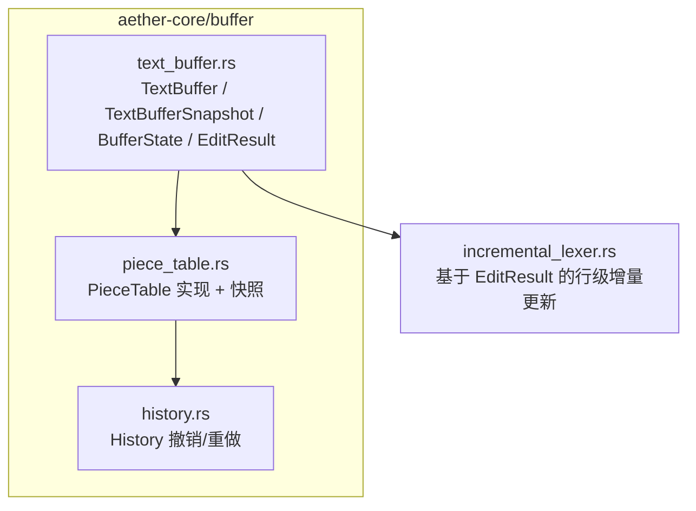
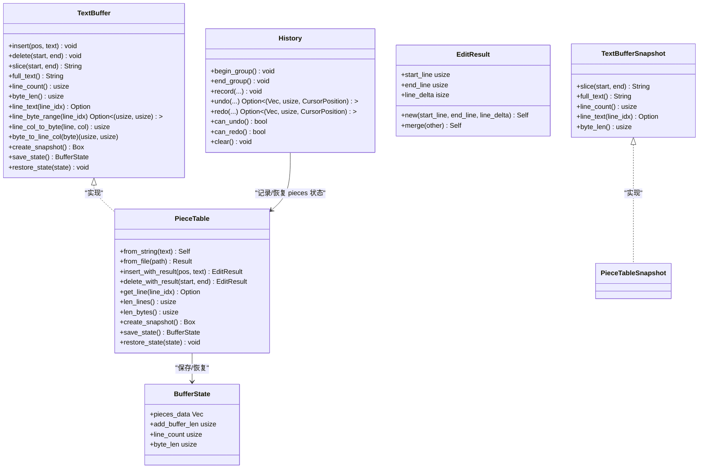
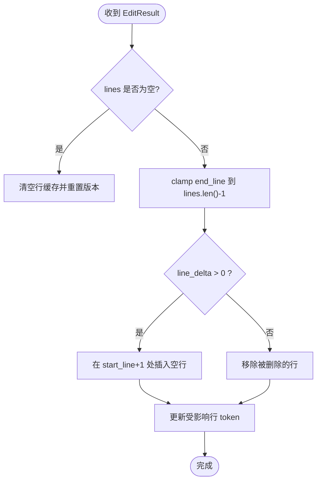
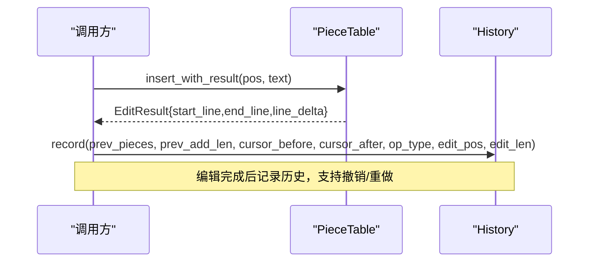
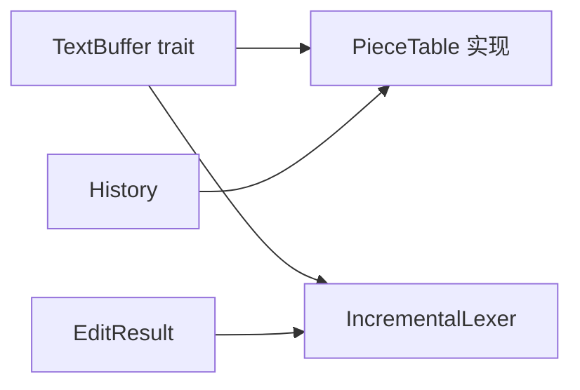

# TextBuffer 接口抽象

<cite>
**本文引用的文件**
- [crates/aether-core/src/buffer/text_buffer.rs](file://crates/aether-core/src/buffer/text_buffer.rs)
- [crates/aether-core/src/buffer/piece_table.rs](file://crates/aether-core/src/buffer/piece_table.rs)
- [crates/aether-core/src/buffer/history.rs](file://crates/aether-core/src/buffer/history.rs)
- [crates/aether-core/src/incremental_lexer.rs](file://crates/aether-core/src/incremental_lexer.rs)
</cite>

## 目录
1. [简介](#简介)
2. [项目结构](#项目结构)
3. [核心组件](#核心组件)
4. [架构总览](#架构总览)
5. [详细组件分析](#详细组件分析)
6. [依赖关系分析](#依赖关系分析)
7. [性能考量](#性能考量)
8. [故障排查指南](#故障排查指南)
9. [结论](#结论)
10. [附录：扩展与插件开发指南](#附录扩展与插件开发指南)

## 简介
本技术文档围绕 TextBuffer 接口抽象层展开，目标是帮助读者理解统一文本缓冲接口的设计理念、状态管理与快照机制，并掌握 EditResult 的语义与使用方式。文档同时给出自定义适配器的实现思路、与 PieceTable 的具体集成方式，以及为插件开发者提供的扩展指南（新增操作与事件通知）。

## 项目结构
TextBuffer 相关代码集中在 aether-core 的 buffer 模块中，包含 trait 定义、PieceTable 实现、历史管理（Undo/Redo）等。上层增量语法分析器通过 EditResult 进行行级缓存失效更新。

图表来源
- [crates/aether-core/src/buffer/text_buffer.rs:1-49](file://crates/aether-core/src/buffer/text_buffer.rs#L1-L49)
- [crates/aether-core/src/buffer/piece_table.rs:1178-1308](file://crates/aether-core/src/buffer/piece_table.rs#L1178-L1308)
- [crates/aether-core/src/buffer/history.rs:1-100](file://crates/aether-core/src/buffer/history.rs#L1-L100)
- [crates/aether-core/src/incremental_lexer.rs:39-68](file://crates/aether-core/src/incremental_lexer.rs#L39-L68)

章节来源
- [crates/aether-core/src/buffer/mod.rs:1-9](file://crates/aether-core/src/buffer/mod.rs#L1-L9)

## 核心组件
- TextBuffer trait：统一的文本编辑与查询接口，屏蔽底层数据结构差异（如 PieceTable/Rope），所有偏移以字节为单位，行号从 0 开始，支持不可变快照用于后台线程安全访问。
- TextBufferSnapshot trait：只读视图，允许无锁读取缓冲区内容。
- BufferState：轻量元数据快照，用于 Undo/Redo 的状态保存与恢复。
- EditResult：描述一次编辑对行范围的影响及行数变化，供行级缓存失效精确计算。
- Cursor/Selection/MultiCursorState：光标与选择区域模型，辅助编辑器交互。

章节来源
- [crates/aether-core/src/buffer/text_buffer.rs:1-171](file://crates/aether-core/src/buffer/text_buffer.rs#L1-L171)

## 架构总览
TextBuffer 作为稳定契约，向上暴露一致的 API；PieceTable 提供高性能实现；History 在外部维护撤销/重做栈；增量语法分析器消费 EditResult 进行局部刷新。

图表来源
- [crates/aether-core/src/buffer/text_buffer.rs:1-171](file://crates/aether-core/src/buffer/text_buffer.rs#L1-L171)
- [crates/aether-core/src/buffer/piece_table.rs:1178-1308](file://crates/aether-core/src/buffer/piece_table.rs#L1178-L1308)
- [crates/aether-core/src/buffer/piece_table.rs:1062-1177](file://crates/aether-core/src/buffer/piece_table.rs#L1062-L1177)
- [crates/aether-core/src/buffer/history.rs:1-100](file://crates/aether-core/src/buffer/history.rs#L1-L100)

## 详细组件分析

### TextBuffer trait 设计原则与方法约定
- 设计原则
  - 所有位置参数均为字节偏移（非字符索引），避免 UTF-8 边界处理歧义。
  - 行号从 0 开始，便于与 UI 和 LSP 协议对齐。
  - 支持不可变快照，确保后台线程可安全读取而不加锁。
- 核心方法语义与返回规范
  - insert/delete：修改缓冲区内容，不返回值；调用方应自行记录 EditResult（或调用带结果的内部方法后转换）。
  - slice/full_text：返回指定范围或全部文本字符串。
  - line_count/byte_len：返回当前缓冲区的行数与字节长度。
  - line_text：返回指定行的文本（不含换行符），不存在时返回 None。
  - line_byte_range：返回指定行的字节范围 [start, end)，不存在时返回 None。
  - line_col_to_byte/byte_to_line_col：行列与字节偏移的双向转换。
  - create_snapshot：创建只读快照，用于后台线程读取。
  - save_state/restore_state：保存/恢复 BufferState，用于 Undo/Redo。

章节来源
- [crates/aether-core/src/buffer/text_buffer.rs:1-49](file://crates/aether-core/src/buffer/text_buffer.rs#L1-L49)

### TextBufferSnapshot 快照机制
- 目的：提供只读视图，避免并发读写冲突，提升渲染/搜索等后台任务性能。
- 行为：与 TextBuffer 的读取接口一致，但仅支持读取。
- 实现要点（PieceTableSnapshot）：共享 Arc<Mmap> 与 add_buffer 引用，避免大文件拷贝；按 piece 列表拼接文本。

章节来源
- [crates/aether-core/src/buffer/text_buffer.rs:51-59](file://crates/aether-core/src/buffer/text_buffer.rs#L51-L59)
- [crates/aether-core/src/buffer/piece_table.rs:1062-1177](file://crates/aether-core/src/buffer/piece_table.rs#L1062-L1177)

### BufferState 状态管理
- 用途：轻量元数据快照，不包含实际文本内容，仅序列化 Piece 元数据与关键统计信息。
- 字段说明
  - pieces_data：序列化的 Piece 元数据（source/start/len/line_breaks）。
  - add_buffer_len：追加缓冲长度（只增不减）。
  - line_count/byte_len：行数和字节长度。
- 生命周期：在编辑前保存，在撤销/重做时恢复。

章节来源
- [crates/aether-core/src/buffer/text_buffer.rs:61-81](file://crates/aether-core/src/buffer/text_buffer.rs#L61-L81)
- [crates/aether-core/src/buffer/piece_table.rs:1281-1308](file://crates/aether-core/src/buffer/piece_table.rs#L1281-L1308)

### EditResult 结构与受影响行范围计算
- 设计目的：精确描述一次编辑对行范围的影响，驱动行级缓存失效与增量更新。
- 字段
  - start_line：受影响的起始行号（包含）。
  - end_line：受影响的结束行号（包含，且保证 >= start_line）。
  - line_delta：行数变化（正表示增加，负表示减少）。
- 合并策略：merge 将两个结果合并为最小包围区间，并累加行数变化。
- 典型用法：增量语法分析器根据 EditResult 调整行 token 列表。

图表来源
- [crates/aether-core/src/incremental_lexer.rs:39-68](file://crates/aether-core/src/incremental_lexer.rs#L39-L68)

章节来源
- [crates/aether-core/src/buffer/text_buffer.rs:142-171](file://crates/aether-core/src/buffer/text_buffer.rs#L142-L171)
- [crates/aether-core/src/incremental_lexer.rs:39-68](file://crates/aether-core/src/incremental_lexer.rs#L39-L68)

### PieceTable 与 TextBuffer 集成
- 实现覆盖：PieceTable 实现了 TextBuffer 的所有方法，包括插入、删除、切片、行操作、行列转换、快照、状态保存/恢复。
- 关键优化
  - 行索引：维护每行起始字节位置，O(1) 获取行范围。
  - 零拷贝路径：单 piece 命中时直接返回字节切片，跨 piece 回退拼接。
  - 前缀和缓存：加速定位 piece 与计算总字节数。
  - 自动合并：达到阈值后合并碎片，降低碎片数量。
- 状态恢复：严格校验反序列化数据，防止越界或损坏导致崩溃。

图表来源
- [crates/aether-core/src/buffer/piece_table.rs:170-282](file://crates/aether-core/src/buffer/piece_table.rs#L170-L282)
- [crates/aether-core/src/buffer/history.rs:101-200](file://crates/aether-core/src/buffer/history.rs#L101-L200)

章节来源
- [crates/aether-core/src/buffer/piece_table.rs:1178-1308](file://crates/aether-core/src/buffer/piece_table.rs#L1178-L1308)
- [crates/aether-core/src/buffer/piece_table.rs:170-282](file://crates/aether-core/src/buffer/piece_table.rs#L170-L282)
- [crates/aether-core/src/buffer/piece_table.rs:289-409](file://crates/aether-core/src/buffer/piece_table.rs#L289-L409)

### 多光标与选择区模型
- Cursor：行号与列号（字节列）。
- Selection：起止光标，支持规范化（确保 start <= end）。
- MultiCursorState：多光标集合，主光标钳位保护，支持列选择模式。

章节来源
- [crates/aether-core/src/buffer/text_buffer.rs:83-171](file://crates/aether-core/src/buffer/text_buffer.rs#L83-L171)

## 依赖关系分析
- TextBuffer 与 PieceTable：解耦契约与实现，便于替换底层数据结构。
- History 与 PieceTable：通过保存/恢复 pieces 元数据实现高效撤销/重做。
- IncrementalLexer 与 EditResult：基于 EditResult 进行行级增量更新，避免全量重建。

图表来源
- [crates/aether-core/src/buffer/text_buffer.rs:1-49](file://crates/aether-core/src/buffer/text_buffer.rs#L1-L49)
- [crates/aether-core/src/buffer/piece_table.rs:1178-1308](file://crates/aether-core/src/buffer/piece_table.rs#L1178-L1308)
- [crates/aether-core/src/buffer/history.rs:1-100](file://crates/aether-core/src/buffer/history.rs#L1-L100)
- [crates/aether-core/src/incremental_lexer.rs:39-68](file://crates/aether-core/src/incremental_lexer.rs#L39-L68)

章节来源
- [crates/aether-core/src/buffer/mod.rs:1-9](file://crates/aether-core/src/buffer/mod.rs#L1-L9)

## 性能考量
- 行索引与二分查找：利用 LineIndex 与前缀和缓存，O(1)/O(log n) 定位行与 piece。
- 零拷贝路径：单 piece 命中时直接返回字节切片，减少分配与拷贝。
- 自动合并碎片：控制碎片数量，平衡内存与性能。
- 快照零拷贝：共享 Arc<Mmap>，避免大文件全量复制。

[本节为通用性能讨论，无需具体文件引用]

## 故障排查指南
- 行索引一致性：删除跨行文本后，需确保行索引与重建结果一致。可通过对比重建后的 get_line 验证。
- 状态恢复校验：restore_state_checked 会严格校验 pieces_data 长度、source 值、start/len 边界与 add_buffer_len 单调性，任何异常都会放弃恢复。
- 末尾光标合法性：byte_to_line_col 在缓冲区末尾之后仍返回合法位置，不应 clamp 到上一行。

章节来源
- [crates/aether-core/src/buffer/piece_table.rs:843-868](file://crates/aether-core/src/buffer/piece_table.rs#L843-L868)
- [crates/aether-core/src/buffer/piece_table.rs:1310-1377](file://crates/aether-core/src/buffer/piece_table.rs#L1310-L1377)
- [crates/aether-core/src/buffer/piece_table.rs:1249-1266](file://crates/aether-core/src/buffer/piece_table.rs#L1249-L1266)

## 结论
TextBuffer 抽象层提供了稳定、高效的文本编辑接口，结合 PieceTable 的高性能实现与 History 的撤销/重做能力，满足大型文档编辑需求。EditResult 使行级增量更新成为可能，显著提升了整体性能。通过快照机制，后台线程可安全读取缓冲区内容，避免锁竞争。

[本节为总结性内容，无需具体文件引用]

## 附录：扩展与插件开发指南

### 自定义 TextBuffer 适配器
- 目标：在不改动上层逻辑的前提下，替换或扩展文本存储与编辑行为。
- 步骤
  - 实现 TextBuffer trait：覆盖 insert/delete/slice/full_text/line_* 等方法，遵循字节偏移与行号从 0 开始的约定。
  - 实现 TextBufferSnapshot：提供只读视图，确保线程安全。
  - 实现 save_state/restore_state：序列化必要的元数据（例如 pieces 或 Rope 节点），并在恢复时校验边界。
  - 可选：提供带结果的编辑方法（如 insert_with_result/delete_with_result），以便上层生成 EditResult。
- 参考路径
  - Trait 定义与类型：[crates/aether-core/src/buffer/text_buffer.rs:1-171](file://crates/aether-core/src/buffer/text_buffer.rs#L1-L171)
  - 现有实现参考：[crates/aether-core/src/buffer/piece_table.rs:1178-1308](file://crates/aether-core/src/buffer/piece_table.rs#L1178-L1308)

### 与 PieceTable 的具体集成方式
- 使用 insert_with_result/delete_with_result 获取 EditResult，传递给增量语法分析器或 UI 行缓存失效逻辑。
- 使用 create_snapshot 创建只读视图，供后台任务（高亮、搜索）使用。
- 使用 save_state/restore_state 配合 History 实现撤销/重做。

章节来源
- [crates/aether-core/src/buffer/piece_table.rs:170-282](file://crates/aether-core/src/buffer/piece_table.rs#L170-L282)
- [crates/aether-core/src/buffer/piece_table.rs:289-409](file://crates/aether-core/src/buffer/piece_table.rs#L289-L409)
- [crates/aether-core/src/buffer/piece_table.rs:1268-1308](file://crates/aether-core/src/buffer/piece_table.rs#L1268-L1308)

### 添加新的文本操作方法
- 建议在 trait 中新增方法，保持向后兼容（可为默认实现或保留旧接口）。
- 若新方法影响行范围，应返回 EditResult 或类似结构，供上层增量更新。
- 示例流程
  - 在 TextBuffer 中添加方法签名。
  - 在 PieceTable 中实现该方法，必要时返回 EditResult。
  - 在 History 中考虑是否纳入撤销/重做记录。
  - 在增量语法分析器中消费 EditResult 进行行级更新。

章节来源
- [crates/aether-core/src/buffer/text_buffer.rs:1-49](file://crates/aether-core/src/buffer/text_buffer.rs#L1-L49)
- [crates/aether-core/src/incremental_lexer.rs:39-68](file://crates/aether-core/src/incremental_lexer.rs#L39-L68)

### 事件通知机制建议
- 当前仓库未提供内置事件总线，可在上层封装一个简单的事件通道（如回调或消息队列）。
- 触发时机
  - 编辑完成：携带 EditResult 与时间戳。
  - 状态切换：如进入/退出撤销组。
  - 快照创建：供后台任务订阅。
- 注意：事件处理器应避免阻塞主编辑路径，必要时异步派发。

[本节为概念性指导，无需具体文件引用]