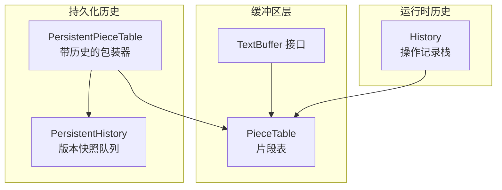
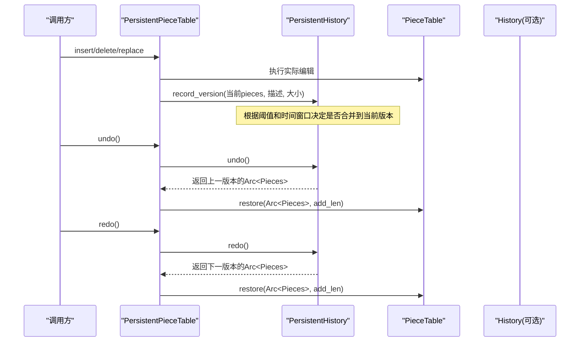
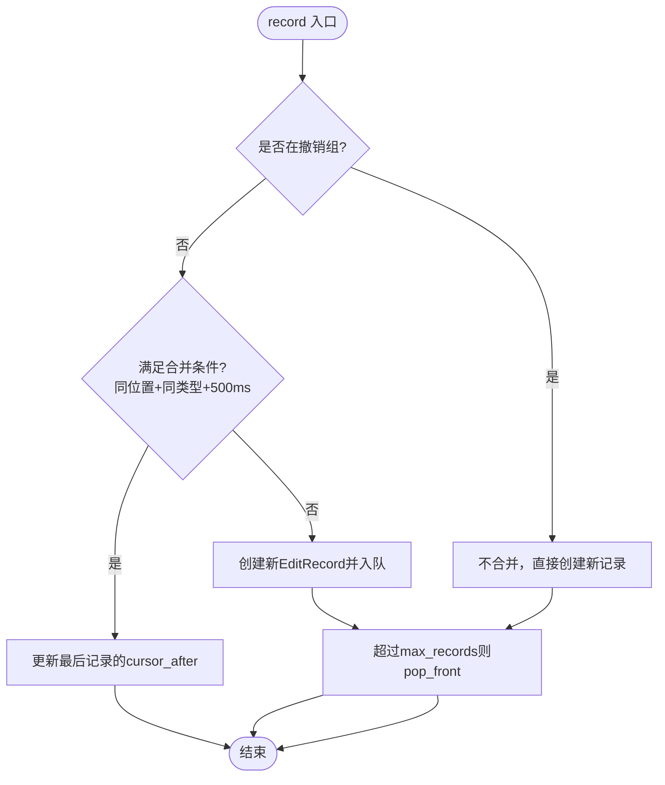
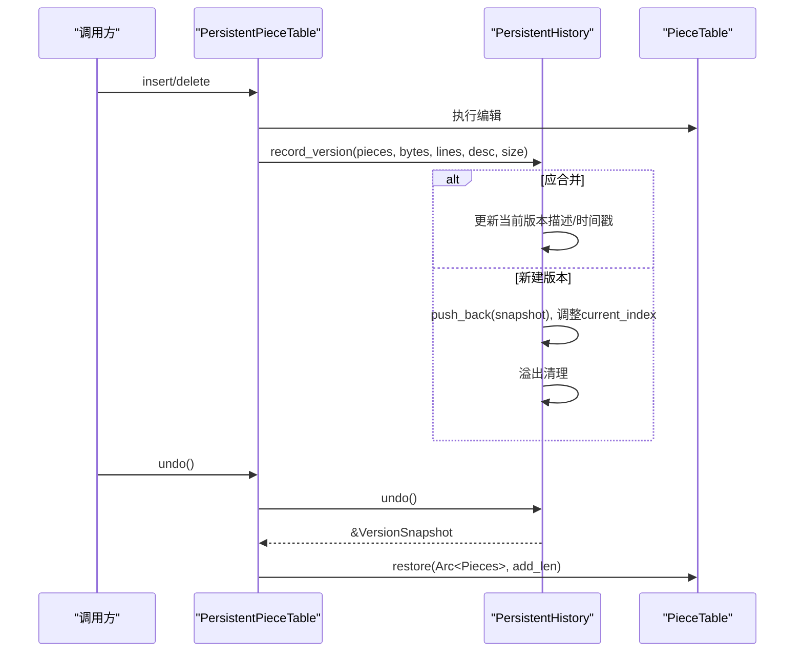
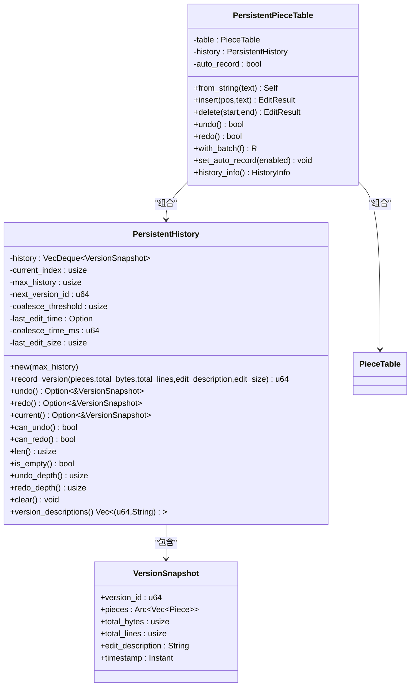
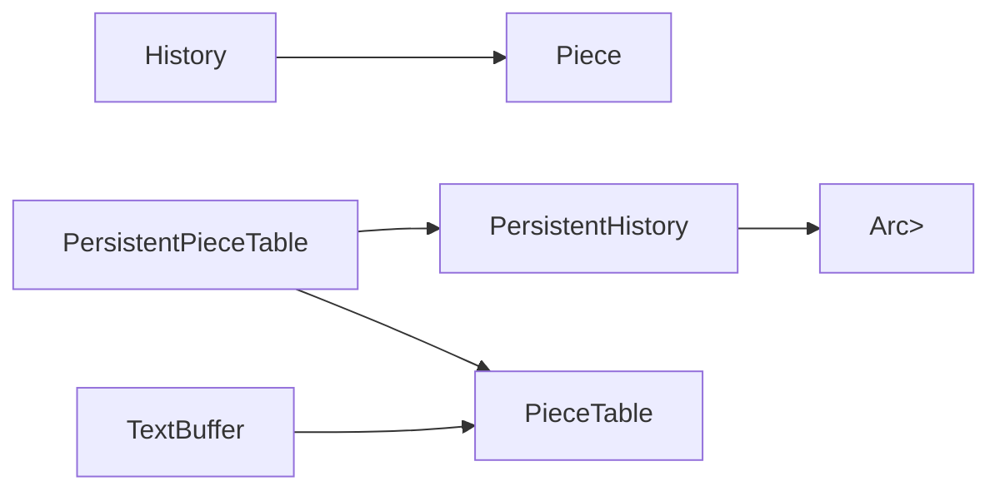

# 历史记录管理

<cite>
**本文引用的文件**
- [history.rs](file://crates/aether-core/src/buffer/history.rs)
- [persistent_history.rs](file://crates/aether-core/src/persistent_history.rs)
- [piece_table.rs](file://crates/aether-core/src/buffer/piece_table.rs)
- [text_buffer.rs](file://crates/aether-core/src/buffer/text_buffer.rs)
</cite>

## 目录
1. [简介](#简介)
2. [项目结构](#项目结构)
3. [核心组件](#核心组件)
4. [架构总览](#架构总览)
5. [详细组件分析](#详细组件分析)
6. [依赖关系分析](#依赖关系分析)
7. [性能考量](#性能考量)
8. [故障排查指南](#故障排查指南)
9. [结论](#结论)
10. [附录：使用示例与最佳实践](#附录使用示例与最佳实践)

## 简介
本技术文档聚焦于撤销/重做历史记录管理系统，覆盖以下关键主题：
- 历史栈的数据结构设计，包括操作类型定义与状态快照管理机制
- 撤销/重做的实现算法，含操作逆运算策略与内存占用控制方案
- 历史记录的持久化机制，含增量保存与合并（压缩）策略
- 具体使用方式与边界处理说明
- 面向高级开发者的性能优化建议，包括大小限制、内存清理与并发安全保证

## 项目结构
本项目在 aether-core 中实现了两套历史系统：
- 基于 Piece Table 的轻量级运行时历史（用于快速撤销/重做）
- 基于版本快照的持久化历史（用于跨会话或更高层的版本回溯）



图表来源
- [piece_table.rs:1-200](file://crates/aether-core/src/buffer/piece_table.rs#L1-L200)
- [text_buffer.rs:1-100](file://crates/aether-core/src/buffer/text_buffer.rs#L1-L100)
- [history.rs:1-120](file://crates/aether-core/src/buffer/history.rs#L1-L120)
- [persistent_history.rs:1-120](file://crates/aether-core/src/persistent_history.rs#L1-L120)

章节来源
- [history.rs:1-120](file://crates/aether-core/src/buffer/history.rs#L1-L120)
- [persistent_history.rs:1-120](file://crates/aether-core/src/persistent_history.rs#L1-L120)
- [piece_table.rs:1-200](file://crates/aether-core/src/buffer/piece_table.rs#L1-L200)
- [text_buffer.rs:1-100](file://crates/aether-core/src/buffer/text_buffer.rs#L1-L100)

## 核心组件
- History：基于 VecDeque 的操作记录栈，支持插入/删除/替换三类操作的合并与撤销组。通过保存“编辑前”的 pieces 元数据与光标位置，实现 O(1) 级别的撤销/重做恢复。
- PersistentHistory：基于 Arc<Vec<Piece>> 的版本快照队列，提供时间/大小维度的合并策略，并维护当前版本索引以支持撤销/重做。
- PersistentPieceTable：对 PieceTable 的包装，自动记录历史并提供批量操作语义。
- TextBuffer/PieceTable：底层文本数据结构，提供高效的插入/删除与行索引维护。

章节来源
- [history.rs:1-120](file://crates/aether-core/src/buffer/history.rs#L1-L120)
- [persistent_history.rs:1-120](file://crates/aether-core/src/persistent_history.rs#L1-L120)
- [text_buffer.rs:1-100](file://crates/aether-core/src/buffer/text_buffer.rs#L1-L100)
- [piece_table.rs:1-200](file://crates/aether-core/src/buffer/piece_table.rs#L1-L200)

## 架构总览
下图展示了运行时历史与持久化历史如何协同工作，以及它们与 PieceTable 的关系。



图表来源
- [persistent_history.rs:240-376](file://crates/aether-core/src/persistent_history.rs#L240-L376)
- [piece_table.rs:117-200](file://crates/aether-core/src/buffer/piece_table.rs#L117-L200)

章节来源
- [persistent_history.rs:240-376](file://crates/aether-core/src/persistent_history.rs#L240-L376)
- [piece_table.rs:117-200](file://crates/aether-core/src/buffer/piece_table.rs#L117-L200)

## 详细组件分析

### 运行时历史：History（操作记录栈）
- 数据结构
  - undos/redos：VecDeque<EditRecord>，分别表示可撤销与可重做的记录队列
  - EditRecord：保存编辑前的 pieces 列表、add_buffer 长度、光标前后位置、操作类型、是否属于撤销组、时间戳等
  - OpType：Insert/Delete/Replace
  - MergeState：Idle/Inserting/Deleting/GroupStart/Grouping，用于连续输入合并与撤销组控制
- 合并策略
  - 同一位置的连续插入/删除在 500ms 内会合并为一条记录，减少历史膨胀
  - Replace 不合并
  - 撤销组 begin_group/end_group 之间不合并，且一次 undo 将整组撤销
- 撤销/重做算法
  - undo：弹出最后一条记录；若该记录是组成员但非组首，则继续弹出直到组首，并将当前状态作为单条汇总记录推入 redo 栈
  - redo：从 redo 栈弹出一条记录，将其推入 undos 栈，并恢复对应状态
- 内存与容量控制
  - max_records 默认 10000，超出时从队头淘汰旧记录（O(1) pop_front）
  - 新操作会清空 redo 栈，避免不一致
- 复杂度
  - record/undo/redo 均为均摊 O(1)，合并判断为常数时间
  - 空间复杂度取决于历史长度与每份 EditRecord 的 prev_pieces 引用量（Arc 共享）



图表来源
- [history.rs:101-200](file://crates/aether-core/src/buffer/history.rs#L101-L200)

章节来源
- [history.rs:1-333](file://crates/aether-core/src/buffer/history.rs#L1-L333)

#### 类图（运行时历史）
```mermaid
classDiagram
class History {
+new()
+begin_group()
+end_group()
+record(before_pieces, before_add_len, cursor_before, cursor_after, op_type, edit_pos, edit_len)
+undo(current_pieces, current_add_len, current_cursor) Option<(Vec<Piece>, usize, CursorPosition)>
+redo(current_pieces, current_add_len, current_cursor) Option<(Vec<Piece>, usize, CursorPosition)>
+can_undo() bool
+can_redo() bool
+clear() void
-undos : VecDeque~EditRecord~
-redos : VecDeque~EditRecord~
-merge_state : MergeState
-max_records : usize
}
class EditRecord {
+prev_pieces : Vec~Piece~
+prev_add_len : usize
+cursor_before : CursorPosition
+cursor_after : CursorPosition
+op_type : OpType
+in_group : bool
+group_start : bool
+timestamp : Instant
}
class OpType {
<<enum>>
Insert
Delete
Replace
}
class MergeState {
<<enum>>
Idle
Inserting{last_time,last_pos}
Deleting{last_time,last_pos}
GroupStart
Grouping{first_time,first_pos}
}
class CursorPosition {
+line : usize
+column : usize
+new(line,column)
}
History --> EditRecord : "包含"
EditRecord --> OpType : "引用"
History --> MergeState : "状态机"
EditRecord --> CursorPosition : "引用"
```

图表来源
- [history.rs:1-120](file://crates/aether-core/src/buffer/history.rs#L1-L120)

### 持久化历史：PersistentHistory 与 PersistentPieceTable
- 数据结构
  - VersionSnapshot：包含 version_id、Arc<Vec<Piece>>、total_bytes、total_lines、edit_description、timestamp
  - PersistentHistory：维护环形缓冲 history、current_index、max_history、next_version_id、合并阈值与时间窗口
  - PersistentPieceTable：包装 PieceTable，自动记录历史并提供 with_batch 批量操作
- 合并（压缩）策略
  - 当本次编辑大小小于阈值且距离上次编辑时间在窗口内，尝试合并到当前版本（更新描述与时间戳）
  - 大编辑或不满足条件时创建新版本
- 溢出与容量控制
  - 当历史超过 max_history：
    - 若 current_index 在最前端且长度大于 2，优先删除中间旧版本，保留最旧当前版本与最新新条目，避免索引跳变
    - 否则 pop_front 并调整 current_index
- 撤销/重做
  - undo/redo 仅移动 current_index，返回对应 VersionSnapshot
  - PersistentPieceTable.undo/redo 从 Arc 克隆 pieces 并调用 table.restore 恢复
- 复杂度
  - record_version：均摊 O(1)（合并）或 O(1) 追加（新建），溢出清理可能触发少量删除
  - undo/redo：O(1)
  - 空间：每个版本仅持有 Arc<Vec<Piece>> 引用，add_buffer 只增不减，历史间共享



图表来源
- [persistent_history.rs:66-136](file://crates/aether-core/src/persistent_history.rs#L66-L136)
- [persistent_history.rs:298-340](file://crates/aether-core/src/persistent_history.rs#L298-L340)
- [piece_table.rs:117-200](file://crates/aether-core/src/buffer/piece_table.rs#L117-L200)

章节来源
- [persistent_history.rs:1-238](file://crates/aether-core/src/persistent_history.rs#L1-L238)
- [persistent_history.rs:240-376](file://crates/aether-core/src/persistent_history.rs#L240-L376)
- [piece_table.rs:117-200](file://crates/aether-core/src/buffer/piece_table.rs#L117-L200)

#### 类图（持久化历史）


图表来源
- [persistent_history.rs:1-120](file://crates/aether-core/src/persistent_history.rs#L1-L120)
- [persistent_history.rs:240-376](file://crates/aether-core/src/persistent_history.rs#L240-L376)

### 操作类型与逆运算策略
- 操作类型
  - Insert：在指定位置插入文本
  - Delete：删除指定字节范围
  - Replace：替换指定范围文本
- 逆运算策略
  - 运行时历史：通过保存“编辑前”的完整 pieces 元数据，撤销时直接恢复该状态；重做时将当前状态保存到 redo 栈并恢复“编辑后”状态
  - 持久化历史：通过 Arc<Vec<Piece>> 指向不同版本的片段表，撤销/重做即切换当前版本指针，无需计算逐字符逆操作
- 光标与选择
  - 运行时历史同时记录光标前后位置，确保撤销/重做后光标正确还原
  - 持久化历史未显式记录光标，需上层在恢复版本后重新计算或缓存光标

章节来源
- [history.rs:50-76](file://crates/aether-core/src/buffer/history.rs#L50-L76)
- [history.rs:202-312](file://crates/aether-core/src/buffer/history.rs#L202-L312)
- [persistent_history.rs:157-175](file://crates/aether-core/src/persistent_history.rs#L157-L175)

## 依赖关系分析
- History 依赖 PieceTable 的 Piece 结构，但不直接耦合其内部实现细节
- PersistentHistory 依赖 Arc<Vec<Piece>> 进行零拷贝共享，降低内存开销
- PersistentPieceTable 组合了 PieceTable 与 PersistentHistory，提供统一 API
- TextBuffer 接口定义了缓冲区通用能力，便于上层解耦



图表来源
- [history.rs:1-40](file://crates/aether-core/src/buffer/history.rs#L1-L40)
- [persistent_history.rs:1-50](file://crates/aether-core/src/persistent_history.rs#L1-L50)
- [text_buffer.rs:1-50](file://crates/aether-core/src/buffer/text_buffer.rs#L1-L50)

章节来源
- [history.rs:1-40](file://crates/aether-core/src/buffer/history.rs#L1-L40)
- [persistent_history.rs:1-50](file://crates/aether-core/src/persistent_history.rs#L1-L50)
- [text_buffer.rs:1-50](file://crates/aether-core/src/buffer/text_buffer.rs#L1-L50)

## 性能考量
- 时间复杂度
  - History.record/undo/redo：均摊 O(1)
  - PersistentHistory.record_version：均摊 O(1)，溢出清理可能触发少量删除
  - undo/redo：O(1)
- 空间复杂度
  - History：每条记录保存一份 Vec<Piece> 的引用（Arc 共享），内存随历史长度线性增长
  - PersistentHistory：每个版本仅持有 Arc<Vec<Piece>> 引用，add_buffer 只增不减，历史间共享
- 合并与压缩
  - 运行时历史：500ms 同位置连续插入/删除合并，减少记录数量
  - 持久化历史：按编辑大小阈值与时间窗口合并，避免频繁创建新版本
- 容量控制
  - History.max_records 默认 10000，超出时从队头淘汰
  - PersistentHistory.max_history 可配置，溢出时优先保留当前版本附近的历史，避免索引跳变
- 并发安全
  - TextBuffer 接口要求 Send + Sync，适合多线程访问
  - Arc 的使用确保多版本共享数据的安全性与高效性
- 优化建议
  - 合理设置合并阈值与时间窗口，平衡用户体验与内存占用
  - 对大批量编辑使用 with_batch 或撤销组，减少历史条目
  - 定期清理长时间未使用的历史（如应用退出或切换文件时）
  - 监控 add_buffer 增长，必要时触发碎片合并或重建索引

[本节为通用性能讨论，不直接分析具体代码文件]

## 故障排查指南
- 常见问题
  - 撤销后光标位置异常：检查运行时历史是否正确记录光标前后位置
  - 重做栈被意外清空：确认新操作是否调用了 record，导致 redo 栈清空
  - 历史过多导致内存压力：检查 max_records/max_history 配置与合并策略
  - 批量操作产生过多历史：使用 with_batch 或撤销组包裹批量编辑
- 定位方法
  - 打印 History.can_undo/can_redo 与 PersistentHistory.history_info 的状态
  - 观察合并行为是否符合预期（时间窗口与大小阈值）
  - 验证溢出清理逻辑是否保持 current_index 稳定

章节来源
- [history.rs:313-327](file://crates/aether-core/src/buffer/history.rs#L313-L327)
- [persistent_history.rs:182-231](file://crates/aether-core/src/persistent_history.rs#L182-L231)

## 结论
本系统通过两层历史设计兼顾了高性能与可追溯性：
- 运行时历史提供低延迟的撤销/重做体验，并通过合并与撤销组提升可用性
- 持久化历史利用 Arc 共享与版本快照，实现高效的增量保存与回溯
- 合理的合并策略与容量控制有效抑制内存增长，保障大规模编辑场景下的稳定性

[本节为总结性内容，不直接分析具体代码文件]

## 附录：使用示例与最佳实践

### 使用 PersistentPieceTable 进行编辑与撤销/重做
- 初始化
  - 使用 from_string 创建实例，自动记录初始版本
- 插入/删除
  - insert/delete 会自动记录历史，描述包含操作摘要
- 撤销/重做
  - undo/redo 返回布尔值，指示是否成功
- 批量操作
  - with_batch 包裹多个编辑，结束后仅记录一次历史
- 查询历史信息
  - history_info 提供可撤销/重做状态与深度信息

章节来源
- [persistent_history.rs:252-376](file://crates/aether-core/src/persistent_history.rs#L252-L376)

### 使用 History 进行细粒度操作追踪
- 开始撤销组
  - begin_group 标记组开始，组内记录不合并
- 记录操作
  - record 传入编辑前的 pieces、光标位置、操作类型与编辑位置/长度
- 撤销/重做
  - undo/redo 返回恢复所需的 pieces、add_buffer 长度与光标位置
- 清理与限制
  - clear 清空历史；max_records 控制最大记录数

章节来源
- [history.rs:88-200](file://crates/aether-core/src/buffer/history.rs#L88-L200)
- [history.rs:202-327](file://crates/aether-core/src/buffer/history.rs#L202-L327)

### 边界处理与触发条件
- 空历史
  - can_undo/can_redo 返回 false，避免无效操作
- 溢出清理
  - 正常溢出时保留可撤销能力；最小容量时不应 panic，且保留最新版本
- 撤销组
  - 组内记录不合并；一次 undo 撤销整个组，redo 恢复整个组

章节来源
- [persistent_history.rs:482-511](file://crates/aether-core/src/persistent_history.rs#L482-L511)
- [history.rs:585-680](file://crates/aether-core/src/buffer/history.rs#L585-L680)