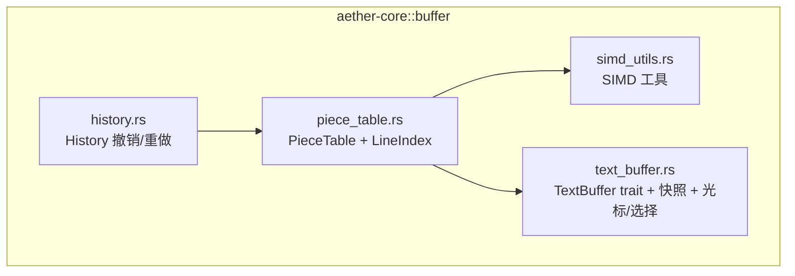
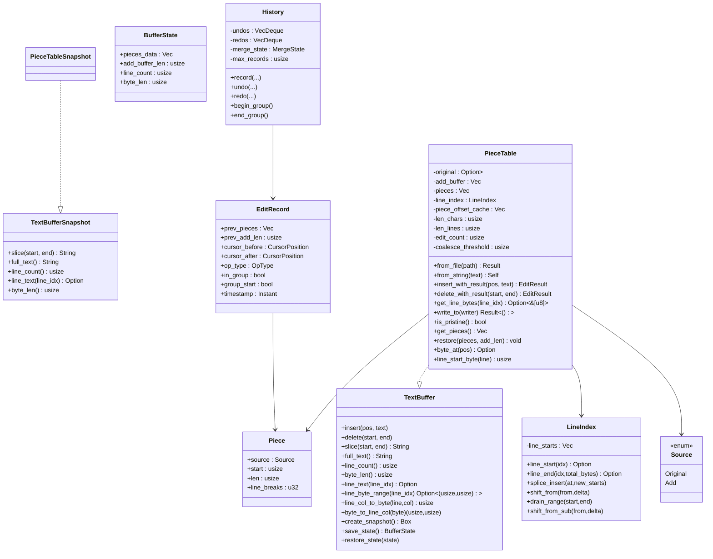
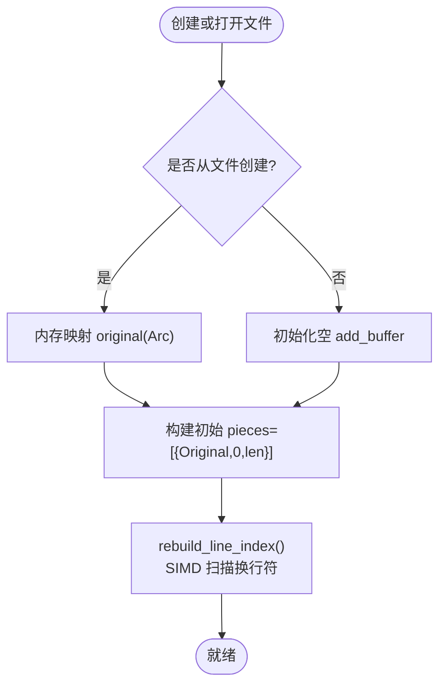
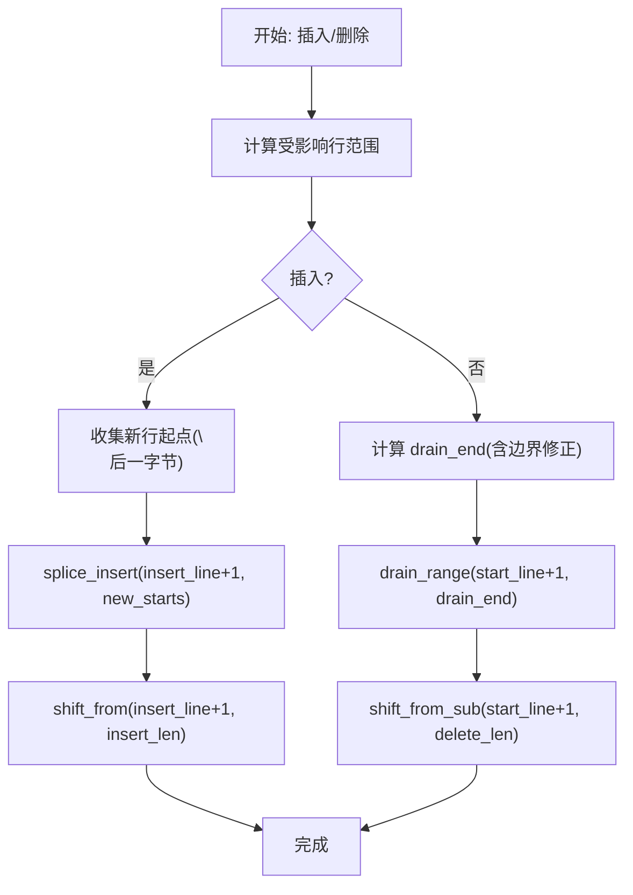
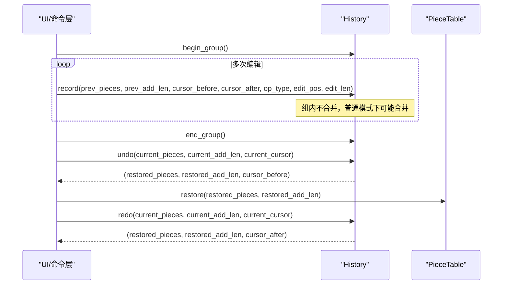
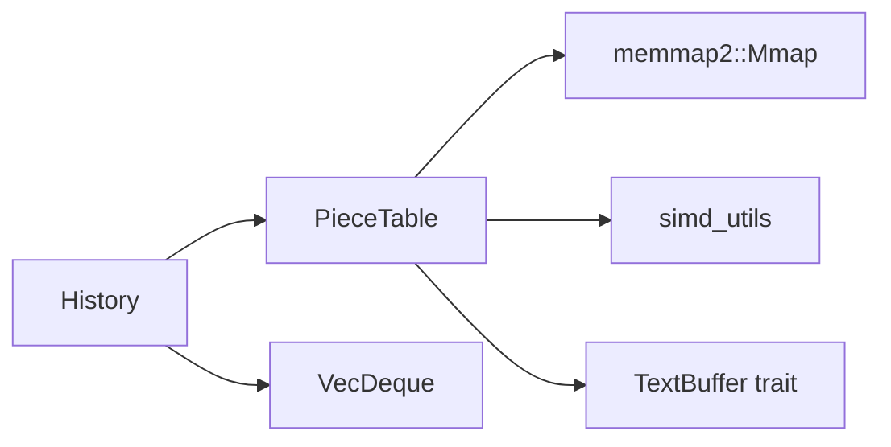

# 文本缓冲区系统

<cite>
**本文引用的文件**   
- [crates/aether-core/src/buffer/piece_table.rs](file://crates/aether-core/src/buffer/piece_table.rs)
- [crates/aether-core/src/buffer/text_buffer.rs](file://crates/aether-core/src/buffer/text_buffer.rs)
- [crates/aether-core/src/buffer/history.rs](file://crates/aether-core/src/buffer/history.rs)
- [crates/aether-core/src/simd_utils.rs](file://crates/aether-core/src/simd_utils.rs)
</cite>

## 目录
1. [简介](#简介)
2. [项目结构](#项目结构)
3. [核心组件](#核心组件)
4. [架构总览](#架构总览)
5. [详细组件分析](#详细组件分析)
6. [依赖关系分析](#依赖关系分析)
7. [性能考量](#性能考量)
8. [故障排查指南](#故障排查指南)
9. [结论](#结论)
10. [附录：API 使用与复杂度速查](#附录api-使用与复杂度速查)

## 简介
本技术文档聚焦牧羊人编辑器的文本缓冲区子系统，围绕 Piece Table 数据结构展开，系统性阐述其内存映射、追加缓冲区和片段表管理机制；深入解析 O(1) 插入/删除算法的实现细节、行索引的增量更新策略与性能优化；并说明撤销/重做历史栈的设计模式（状态快照管理、合并窗口、撤销组）与内存占用控制。文末提供基于 TextBuffer trait 的使用示例路径与关键方法的时间/空间复杂度分析，为高级开发者给出内存管理与性能调优建议。

## 项目结构
文本缓冲区相关代码位于 aether-core 的 buffer 模块中，核心文件包括：
- piece_table.rs：Piece Table 实现、行索引、零拷贝读取、写入、快照等
- text_buffer.rs：TextBuffer trait、快照接口、光标/选择/多光标、编辑结果等
- history.rs：基于 Piece Table 元数据快照的 Undo/Redo 历史栈
- simd_utils.rs：SIMD 加速工具（换行计数、字节查找、空白跳过等）



图表来源
- [crates/aether-core/src/buffer/piece_table.rs:1-120](file://crates/aether-core/src/buffer/piece_table.rs#L1-L120)
- [crates/aether-core/src/buffer/text_buffer.rs:1-60](file://crates/aether-core/src/buffer/text_buffer.rs#L1-L60)
- [crates/aether-core/src/buffer/history.rs:1-80](file://crates/aether-core/src/buffer/history.rs#L1-L80)
- [crates/aether-core/src/simd_utils.rs:1-20](file://crates/aether-core/src/simd_utils.rs#L1-L20)

章节来源
- [crates/aether-core/src/buffer/piece_table.rs:1-120](file://crates/aether-core/src/buffer/piece_table.rs#L1-L120)
- [crates/aether-core/src/buffer/text_buffer.rs:1-60](file://crates/aether-core/src/buffer/text_buffer.rs#L1-L60)
- [crates/aether-core/src/buffer/history.rs:1-80](file://crates/aether-core/src/buffer/history.rs#L1-L80)
- [crates/aether-core/src/simd_utils.rs:1-20](file://crates/aether-core/src/simd_utils.rs#L1-L20)

## 核心组件
- PieceTable：高性能文本缓冲区，支持 O(1) 插入/删除、零拷贝大文件打开、行索引与偏移前缀和缓存、碎片合并与增量重建。
- TextBuffer trait：抽象文本编辑操作，屏蔽底层数据结构差异，提供统一 API 与不可变快照能力。
- History：基于 Piece 元数据快照的高效撤销/重做，支持连续输入合并与撤销组。
- SIMD 工具：在稳定 Rust 下通过 SWAR 批量处理提升换行计数、字节查找、空白跳过等性能。

章节来源
- [crates/aether-core/src/buffer/piece_table.rs:11-34](file://crates/aether-core/src/buffer/piece_table.rs#L11-L34)
- [crates/aether-core/src/buffer/text_buffer.rs:1-49](file://crates/aether-core/src/buffer/text_buffer.rs#L1-L49)
- [crates/aether-core/src/buffer/history.rs:6-16](file://crates/aether-core/src/buffer/history.rs#L6-L16)
- [crates/aether-core/src/simd_utils.rs:6-12](file://crates/aether-core/src/simd_utils.rs#L6-L12)

## 架构总览
整体采用“Trait 抽象 + 具体实现 + 历史栈”的分层设计：
- 上层通过 TextBuffer trait 进行文本操作，不关心底层是 PieceTable 还是其他结构。
- PieceTable 负责高效存储与访问，维护 original（内存映射）、add_buffer（只追加）、pieces（有序片段表）、line_index（行起始偏移）、piece_offset_cache（偏移前缀和）。
- History 记录每次编辑前的 pieces 元数据快照与光标位置，支持合并窗口与撤销组，避免保存完整文本，降低内存占用。



图表来源
- [crates/aether-core/src/buffer/text_buffer.rs:1-60](file://crates/aether-core/src/buffer/text_buffer.rs#L1-L60)
- [crates/aether-core/src/buffer/piece_table.rs:11-120](file://crates/aether-core/src/buffer/piece_table.rs#L11-L120)
- [crates/aether-core/src/buffer/piece_table.rs:51-115](file://crates/aether-core/src/buffer/piece_table.rs#L51-L115)
- [crates/aether-core/src/buffer/history.rs:18-76](file://crates/aether-core/src/buffer/history.rs#L18-L76)
- [crates/aether-core/src/buffer/text_buffer.rs:61-81](file://crates/aether-core/src/buffer/text_buffer.rs#L61-L81)

## 详细组件分析

### Piece Table 数据结构与内存模型
- 原始文件内存映射：original 字段持有 Arc<Mmap>，打开大文件时零拷贝，共享引用计数，避免全量加载到堆。
- 追加缓冲区：add_buffer 仅追加不收缩，所有新内容写入尾部，减少移动成本。
- 片段表：pieces 有序维护每个片段的 source/start/len/line_breaks，支持跨两个 buffer 的拼接视图。
- 行索引：LineIndex 维护每行起始的全局字节偏移，支持 O(1) 行号→字节偏移转换。
- 偏移前缀和缓存：piece_offset_cache[i] 表示第 i 个 piece 的起始字节偏移，末尾哨兵为总字节数，使 find_piece_at_byte 与 byte_offset_of_piece 达到 O(log n)/O(1)。



图表来源
- [crates/aether-core/src/buffer/piece_table.rs:143-168](file://crates/aether-core/src/buffer/piece_table.rs#L143-L168)
- [crates/aether-core/src/buffer/piece_table.rs:666-696](file://crates/aether-core/src/buffer/piece_table.rs#L666-L696)
- [crates/aether-core/src/simd_utils.rs:11-82](file://crates/aether-core/src/simd_utils.rs#L11-L82)

章节来源
- [crates/aether-core/src/buffer/piece_table.rs:11-34](file://crates/aether-core/src/buffer/piece_table.rs#L11-L34)
- [crates/aether-core/src/buffer/piece_table.rs:143-168](file://crates/aether-core/src/buffer/piece_table.rs#L143-L168)
- [crates/aether-core/src/buffer/piece_table.rs:666-710](file://crates/aether-core/src/buffer/piece_table.rs#L666-L710)

### O(1) 插入/删除算法实现细节
- 插入 insert_with_result：
  - 将待插文本复制到 add_buffer 尾部，计算新增换行数。
  - 若 pos 在末尾或表为空，直接 push 新 piece；否则定位包含 pos 的 piece，按 offset_in_piece 情况决定插入新 piece 或拆分原 piece 为 left/new/right。
  - 更新 len_chars/len_lines/edit_count，增量更新行索引，必要时触发 coalesce_pieces 合并相邻同源连续片段，或重建偏移前缀和缓存。
- 删除 delete_with_result：
  - 边界钳位防止越界；定位 start/end 所在 piece 及局部偏移。
  - 单 piece 内删除：根据是否整段删除或部分删除，调整 start/len 或拆分为左右两段。
  - 跨多个 piece 删除：保留首尾未删部分，中间全部移除。
  - 重新计算 len_chars/len_lines，增量更新行索引，必要时合并碎片或重建缓存。

```mermaid
sequenceDiagram
participant Caller as "调用方"
participant PT as "PieceTable"
participant LI as "LineIndex"
participant Cache as "piece_offset_cache"
Caller->>PT : insert_with_result(pos, text)
PT->>PT : 预分配 add_buffer 容量
PT->>PT : extend_from_slice(text_bytes)
PT->>PT : count_line_breaks(text_bytes)
alt pos >= total_len 或 pieces 为空
PT->>PT : push 新 Piece(Source : : Add,...)
else 定位目标 piece
PT->>PT : find_piece_at_byte(pos)
PT->>PT : 计算 offset_in_piece
alt 边界插入
PT->>PT : insert 新 Piece
else 中间插入
PT->>PT : 拆分 left/new/right 并 splice
end
end
PT->>PT : len_chars += insert_len; len_lines += line_breaks
PT->>LI : update_line_index_for_insert(pos, text)
alt edit_count >= threshold
PT->>PT : coalesce_pieces()
PT->>Cache : rebuild_piece_offset_cache()
else
PT->>Cache : rebuild_piece_offset_cache()
end
PT-->>Caller : EditResult(start_line,end_line,line_delta)
```

图表来源
- [crates/aether-core/src/buffer/piece_table.rs:170-282](file://crates/aether-core/src/buffer/piece_table.rs#L170-L282)
- [crates/aether-core/src/buffer/piece_table.rs:712-744](file://crates/aether-core/src/buffer/piece_table.rs#L712-L744)
- [crates/aether-core/src/buffer/piece_table.rs:1483-1516](file://crates/aether-core/src/buffer/piece_table.rs#L1483-L1516)

章节来源
- [crates/aether-core/src/buffer/piece_table.rs:170-282](file://crates/aether-core/src/buffer/piece_table.rs#L170-L282)
- [crates/aether-core/src/buffer/piece_table.rs:289-408](file://crates/aether-core/src/buffer/piece_table.rs#L289-L408)
- [crates/aether-core/src/buffer/piece_table.rs:712-780](file://crates/aether-core/src/buffer/piece_table.rs#L712-L780)
- [crates/aether-core/src/buffer/piece_table.rs:1483-1516](file://crates/aether-core/src/buffer/piece_table.rs#L1483-L1516)

### 行索引的增量更新策略
- 行索引 LineIndex 维护 line_starts 向量，支持：
  - splice_insert：在指定位置原地插入新行起点，避免前半部分复制。
  - shift_from/shift_from_sub：对后缀区间整体加/减 delta，用于插入/删除后的行偏移调整。
  - drain_range：删除某行范围起点。
- 插入后 update_line_index_for_insert：
  - 收集插入文本产生的新行起点（每个 '\n' 后一个字节），在 insert_line+1 处 splice 插入。
  - 对后续行起点整体加上插入长度。
- 删除后 update_line_index_for_delete：
  - 确定需要删除的行范围 [start_line+1, drain_end)，其中 drain_end 考虑 end_line 行的起点是否 <= end。
  - 先 drain_range 删除，再对后续行起点整体减去删除长度。



图表来源
- [crates/aether-core/src/buffer/piece_table.rs:712-780](file://crates/aether-core/src/buffer/piece_table.rs#L712-L780)
- [crates/aether-core/src/buffer/piece_table.rs:78-115](file://crates/aether-core/src/buffer/piece_table.rs#L78-L115)

章节来源
- [crates/aether-core/src/buffer/piece_table.rs:712-780](file://crates/aether-core/src/buffer/piece_table.rs#L712-L780)
- [crates/aether-core/src/buffer/piece_table.rs:78-115](file://crates/aether-core/src/buffer/piece_table.rs#L78-L115)

### 零拷贝读取与写入
- get_line_bytes：优先尝试单 piece 命中返回 &[u8] 切片，跨 piece 则回退到 get_text 拼接。
- write_to：遍历 pieces 直接写出对应 buffer 切片，避免中间 String 分配，适合保存未编辑文件或流式输出。
- is_pristine：判断是否仅引用 original，可用于保存时走零拷贝路径。

章节来源
- [crates/aether-core/src/buffer/piece_table.rs:430-514](file://crates/aether-core/src/buffer/piece_table.rs#L430-L514)

### 撤销/重做历史栈设计
- 记录策略：
  - EditRecord 保存 prev_pieces（完整副本）、prev_add_len、光标前后位置、操作类型、时间戳、是否在组内等。
  - record 支持合并窗口：同一位置快速连续 Insert/Delete 在 500ms 内合并为一条记录，减少历史记录膨胀。
  - 撤销组：begin_group/end_group 之间记录不合并，撤销时一次性恢复组首状态，redo 也作为单条汇总记录。
- 内存控制：
  - max_records 限制最大记录数，超出时 pop_front 淘汰旧记录，使用 VecDeque 保证 O(1) 淘汰。
  - 新操作会清空 redo 栈，保持一致性。
- undo/redo：
  - undo 弹出记录，若组成员非组首则继续弹出直到组首，并将当前状态以组首形式推入 redo。
  - redo 弹出记录，将当前状态推入 undos。



图表来源
- [crates/aether-core/src/buffer/history.rs:88-99](file://crates/aether-core/src/buffer/history.rs#L88-L99)
- [crates/aether-core/src/buffer/history.rs:104-200](file://crates/aether-core/src/buffer/history.rs#L104-L200)
- [crates/aether-core/src/buffer/history.rs:206-312](file://crates/aether-core/src/buffer/history.rs#L206-L312)
- [crates/aether-core/src/buffer/piece_table.rs:532-545](file://crates/aether-core/src/buffer/piece_table.rs#L532-L545)

章节来源
- [crates/aether-core/src/buffer/history.rs:8-16](file://crates/aether-core/src/buffer/history.rs#L8-L16)
- [crates/aether-core/src/buffer/history.rs:104-200](file://crates/aether-core/src/buffer/history.rs#L104-L200)
- [crates/aether-core/src/buffer/history.rs:206-312](file://crates/aether-core/src/buffer/history.rs#L206-L312)
- [crates/aether-core/src/buffer/piece_table.rs:532-545](file://crates/aether-core/src/buffer/piece_table.rs#L532-L545)

### TextBuffer trait 使用示例与复杂度
- 基本操作：
  - 插入：trait.insert(pos, text) → 内部调用 PieceTable.insert_with_result。
  - 删除：trait.delete(start, end) → 内部调用 PieceTable.delete_with_result。
  - 读取：trait.slice/full_text/line_text/line_byte_range 等。
  - 坐标转换：line_col_to_byte/byte_to_line_col。
  - 快照：create_snapshot 返回不可变快照，后台线程安全读取。
  - 状态持久化：save_state/restore_state 用于 Undo/Redo 或持久化。
- 复杂度概览：
  - insert/delete：均摊 O(1) 片段操作 + O(K+N) 行索引增量更新（K为新行数，N为受影响的行数量），总体接近 O(1) 对文本主体，行索引更新与碎片合并为次要开销。
  - 行索引查找：O(1)（line_index.line_start）。
  - 字节→行号：O(log n)（binary_search on line_starts）。
  - 获取行文本：优先零拷贝 O(1) 切片，跨 piece 回退 O(m) 拼接（m 为跨越的片段数）。
  - 快照创建：轻量级克隆（Arc 引用计数 + 小对象 clone），远小于全量文本拷贝。

章节来源
- [crates/aether-core/src/buffer/text_buffer.rs:1-49](file://crates/aether-core/src/buffer/text_buffer.rs#L1-L49)
- [crates/aether-core/src/buffer/piece_table.rs:1179-1308](file://crates/aether-core/src/buffer/piece_table.rs#L1179-L1308)
- [crates/aether-core/src/buffer/piece_table.rs:1249-1266](file://crates/aether-core/src/buffer/piece_table.rs#L1249-L1266)
- [crates/aether-core/src/buffer/piece_table.rs:430-489](file://crates/aether-core/src/buffer/piece_table.rs#L430-L489)

## 依赖关系分析
- PieceTable 依赖：
  - memmap2::Mmap：用于 original 的内存映射。
  - simd_utils：换行计数与字节查找加速。
  - text_buffer：实现 TextBuffer trait 并提供快照。
- History 依赖：
  - Piece 元数据：保存/恢复 pieces 列表与 add_buffer 长度。
  - VecDeque：高效队列，支持 O(1) 淘汰与双端操作。
- TextBuffer trait：
  - 定义统一接口，供上层 UI/LSP/渲染等模块解耦使用。



图表来源
- [crates/aether-core/src/buffer/piece_table.rs:1-10](file://crates/aether-core/src/buffer/piece_table.rs#L1-L10)
- [crates/aether-core/src/buffer/history.rs:1-5](file://crates/aether-core/src/buffer/history.rs#L1-L5)
- [crates/aether-core/src/buffer/text_buffer.rs:1-49](file://crates/aether-core/src/buffer/text_buffer.rs#L1-L49)

章节来源
- [crates/aether-core/src/buffer/piece_table.rs:1-10](file://crates/aether-core/src/buffer/piece_table.rs#L1-L10)
- [crates/aether-core/src/buffer/history.rs:1-5](file://crates/aether-core/src/buffer/history.rs#L1-L5)
- [crates/aether-core/src/buffer/text_buffer.rs:1-49](file://crates/aether-core/src/buffer/text_buffer.rs#L1-L49)

## 性能考量
- 零拷贝优势：
  - 大文件打开：original 使用 Arc<Mmap>，避免全量加载。
  - 保存未编辑文件：is_pristine 为真时可直接 write_to 写出 mmap 切片。
- 行索引与偏移缓存：
  - rebuild_line_index 使用 SIMD 加速换行符查找，显著降低重建成本。
  - piece_offset_cache 使 find_piece_at_byte 与 byte_offset_of_piece 达到 O(log n)/O(1)。
- 碎片合并：
  - coalesce_threshold 控制合并频率，减少频繁碎片导致的检索退化。
- 历史栈内存控制：
  - max_records 限制记录数，pop_front 淘汰旧记录，避免无限增长。
  - 合并窗口与撤销组减少冗余记录，降低内存压力。
- 并发与快照：
  - create_snapshot 返回不可变快照，后台线程安全读取，避免锁竞争。

章节来源
- [crates/aether-core/src/buffer/piece_table.rs:143-168](file://crates/aether-core/src/buffer/piece_table.rs#L143-L168)
- [crates/aether-core/src/buffer/piece_table.rs:666-710](file://crates/aether-core/src/buffer/piece_table.rs#L666-L710)
- [crates/aether-core/src/buffer/piece_table.rs:1483-1516](file://crates/aether-core/src/buffer/piece_table.rs#L1483-L1516)
- [crates/aether-core/src/buffer/history.rs:173-177](file://crates/aether-core/src/buffer/history.rs#L173-L177)
- [crates/aether-core/src/buffer/piece_table.rs:1268-1279](file://crates/aether-core/src/buffer/piece_table.rs#L1268-L1279)

## 故障排查指南
- 行索引一致性：
  - 删除跨行文本后，确保行索引与重建一致；测试用例验证了删除后行内容与行数正确性。
- 边界保护：
  - delete_with_result 对 end 进行边界钳位，防止越界导致数据损坏。
  - byte_at 对空表与越界返回 None，避免 panic。
- 状态恢复校验：
  - restore_state_checked 对反序列化 pieces 进行严格校验（source/start/len/line_breaks 合法性、边界检查、溢出检测），失败时放弃恢复，保留当前状态。
- 撤销组行为：
  - 组内记录不合并，撤销时一次性恢复组首状态，redo 为单条汇总记录。

章节来源
- [crates/aether-core/src/buffer/piece_table.rs:289-408](file://crates/aether-core/src/buffer/piece_table.rs#L289-L408)
- [crates/aether-core/src/buffer/piece_table.rs:577-599](file://crates/aether-core/src/buffer/piece_table.rs#L577-L599)
- [crates/aether-core/src/buffer/piece_table.rs:1310-1467](file://crates/aether-core/src/buffer/piece_table.rs#L1310-L1467)
- [crates/aether-core/src/buffer/history.rs:585-680](file://crates/aether-core/src/buffer/history.rs#L585-L680)

## 结论
该文本缓冲区系统以 Piece Table 为核心，结合内存映射、追加缓冲区、行索引与偏移前缀和缓存，实现了高效的 O(1) 插入/删除与零拷贝读写。撤销/重做历史栈通过元数据快照、合并窗口与撤销组机制，在保证用户体验的同时有效控制内存占用。配合 SIMD 加速工具，系统在大规模文本场景下具备良好性能表现。对于高级开发者，建议关注碎片合并阈值、行索引重建时机、快照大小与并发访问策略，以获得更优的性能与稳定性。

## 附录：API 使用与复杂度速查
- 常用 API（基于 TextBuffer trait）：
  - insert(pos, text)：插入文本，均摊 O(1) 片段操作 + 行索引增量更新。
  - delete(start, end)：删除范围，均摊 O(1) 片段操作 + 行索引增量更新。
  - slice/full_text/line_text/line_byte_range：读取文本，优先零拷贝，跨 piece 回退拼接。
  - line_col_to_byte/byte_to_line_col：行列↔字节偏移转换，O(1)/O(log n)。
  - create_snapshot：创建不可变快照，轻量级克隆。
  - save_state/restore_state：状态持久化与恢复，带严格校验。
- 复杂度参考：
  - 插入/删除：均摊 O(1) 片段操作；行索引更新 O(K+N)；碎片合并按需触发。
  - 行索引查找：O(1)。
  - 字节→行号：O(log n)。
  - 读取行文本：优先 O(1) 零拷贝，跨 piece 时 O(m) 拼接。
  - 快照创建：远小于全量文本拷贝，适合后台线程。

章节来源
- [crates/aether-core/src/buffer/text_buffer.rs:1-49](file://crates/aether-core/src/buffer/text_buffer.rs#L1-L49)
- [crates/aether-core/src/buffer/piece_table.rs:1179-1308](file://crates/aether-core/src/buffer/piece_table.rs#L1179-L1308)
- [crates/aether-core/src/buffer/piece_table.rs:1249-1266](file://crates/aether-core/src/buffer/piece_table.rs#L1249-L1266)
- [crates/aether-core/src/buffer/piece_table.rs:430-489](file://crates/aether-core/src/buffer/piece_table.rs#L430-L489)