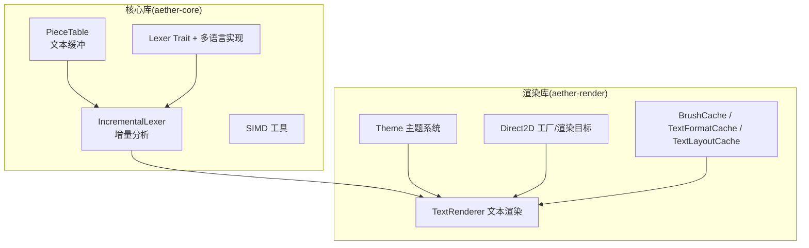
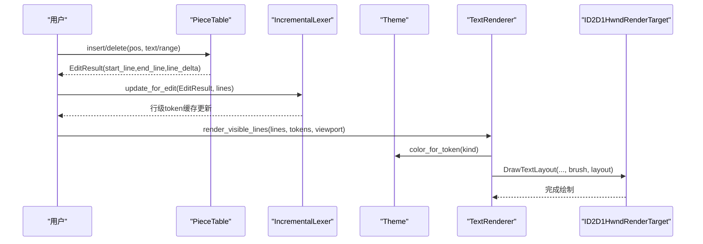
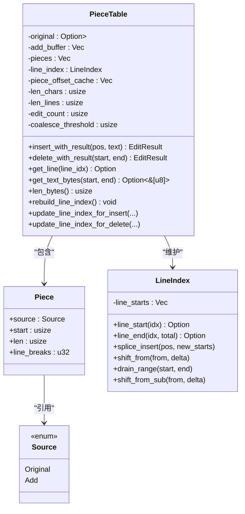
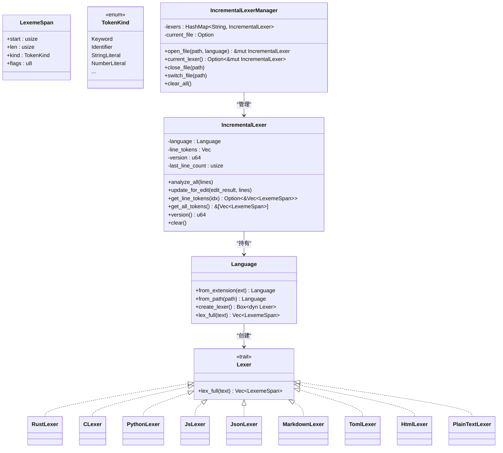
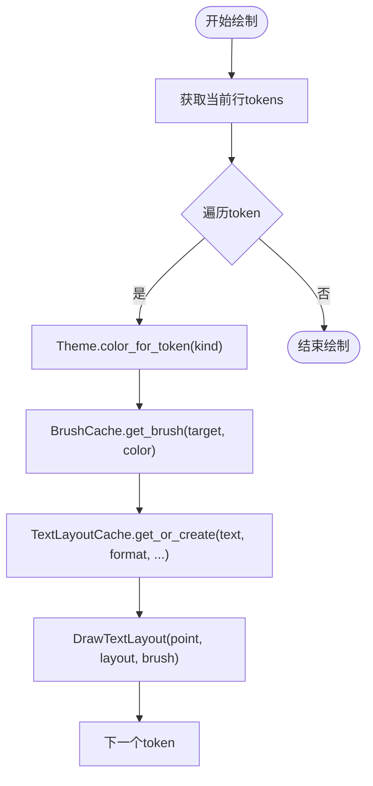
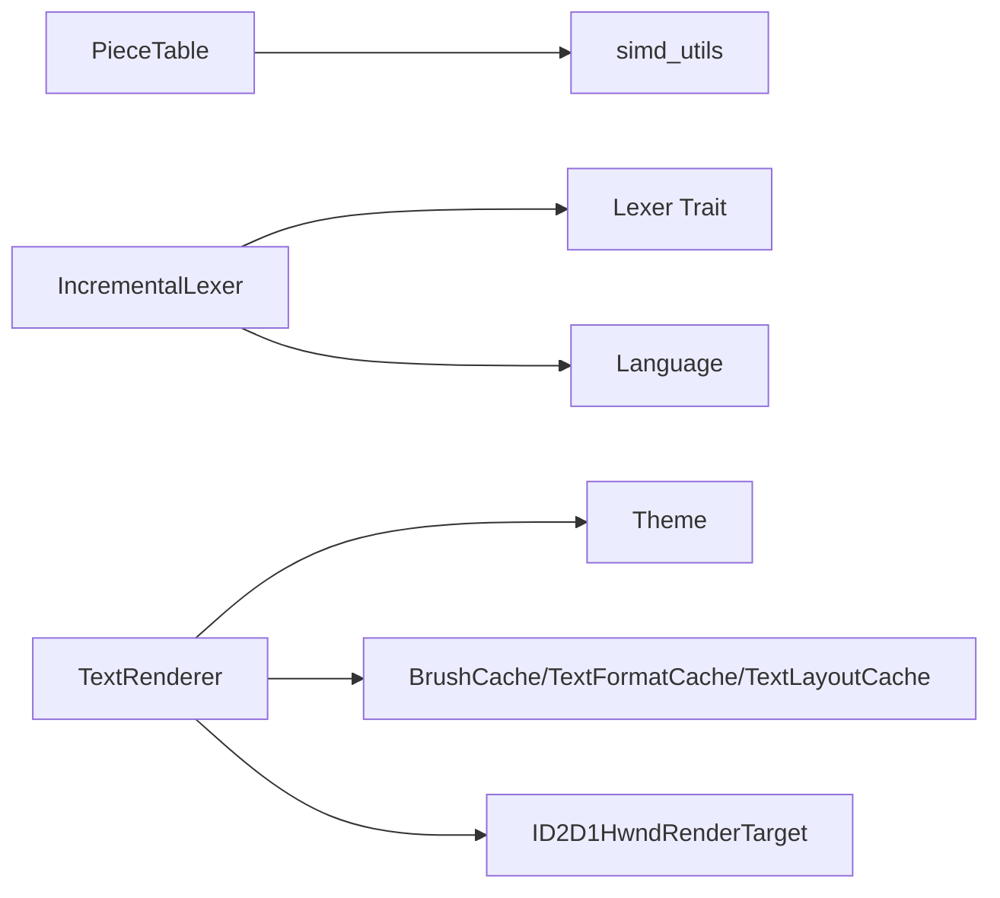

# 核心组件

<cite>
**本文引用的文件**   
- [crates/aether-core/src/buffer/piece_table.rs](file://crates/aether-core/src/buffer/piece_table.rs)
- [crates/aether-core/src/buffer/text_buffer.rs](file://crates/aether-core/src/buffer/text_buffer.rs)
- [crates/aether-core/src/lexer/mod.rs](file://crates/aether-core/src/lexer/mod.rs)
- [crates/aether-core/src/incremental_lexer.rs](file://crates/aether-core/src/incremental_lexer.rs)
- [crates/aether-core/src/simd_utils.rs](file://crates/aether-core/src/simd_utils.rs)
- [crates/aether-render/src/d2d/mod.rs](file://crates/aether-render/src/d2d/mod.rs)
- [crates/aether-render/src/d2d/brush_cache.rs](file://crates/aether-render/src/d2d/brush_cache.rs)
- [crates/aether-render/src/d2d/text.rs](file://crates/aether-render/src/d2d/text.rs)
- [crates/aether-render/src/theme.rs](file://crates/aether-render/src/theme.rs)
</cite>

## 目录
1. [简介](#简介)
2. [项目结构](#项目结构)
3. [核心组件](#核心组件)
4. [架构总览](#架构总览)
5. [详细组件分析](#详细组件分析)
6. [依赖关系分析](#依赖关系分析)
7. [性能考量](#性能考量)
8. [故障排查指南](#故障排查指南)
9. [结论](#结论)
10. [附录：使用示例与最佳实践](#附录使用示例与最佳实践)

## 简介
本技术文档聚焦牧羊人编辑器的三大核心子系统：Piece Table 文本缓冲、词法分析器框架（含增量分析）、以及 Direct2D 渲染管线。文档从系统架构、数据流、处理逻辑、集成点、错误处理与性能特性等维度展开，并提供面向高级开发者的优化建议与代码级图示。

## 项目结构
- aether-core：提供文本缓冲（PieceTable）、词法分析接口与增量分析、SIMD 工具等核心能力。
- aether-render：封装 Direct2D/DirectWrite 渲染能力，包括画刷/格式/布局缓存、主题系统与文本渲染。

图表来源
- [crates/aether-core/src/buffer/piece_table.rs:1-120](file://crates/aether-core/src/buffer/piece_table.rs#L1-L120)
- [crates/aether-core/src/lexer/mod.rs:1-182](file://crates/aether-core/src/lexer/mod.rs#L1-L182)
- [crates/aether-core/src/incremental_lexer.rs:1-130](file://crates/aether-core/src/incremental_lexer.rs#L1-L130)
- [crates/aether-render/src/d2d/text.rs:14-270](file://crates/aether-render/src/d2d/text.rs#L14-L270)
- [crates/aether-render/src/theme.rs:8-277](file://crates/aether-render/src/theme.rs#L8-L277)

章节来源
- [crates/aether-core/src/lib.rs:1-12](file://crates/aether-core/src/lib.rs#L1-L12)

## 核心组件
- Piece Table：以“原始只读映射 + 追加缓冲区”的双缓冲模型，配合有序片段表与行索引前缀和，实现 O(1) 插入/删除、O(log n) 定位、零拷贝读取。
- Lexer 框架：统一 Lexer trait 与 TokenKind/LexemeSpan 跨语言抽象；Language 枚举负责扩展名到语言的映射与静态分发创建具体 lexer。
- 增量词法分析：按行缓存 token，基于 EditResult 精确失效并仅重算受影响行，避免全量重析。
- Direct2D 渲染管线：工厂与渲染目标管理、画刷/文本格式/布局缓存、主题颜色映射、视口裁剪与逐行绘制。

章节来源
- [crates/aether-core/src/buffer/piece_table.rs:11-168](file://crates/aether-core/src/buffer/piece_table.rs#L11-L168)
- [crates/aether-core/src/lexer/mod.rs:1-182](file://crates/aether-core/src/lexer/mod.rs#L1-L182)
- [crates/aether-core/src/incremental_lexer.rs:1-130](file://crates/aether-core/src/incremental_lexer.rs#L1-L130)
- [crates/aether-render/src/d2d/brush_cache.rs:25-106](file://crates/aether-render/src/d2d/brush_cache.rs#L25-L106)
- [crates/aether-render/src/d2d/text.rs:14-270](file://crates/aether-render/src/d2d/text.rs#L14-L270)
- [crates/aether-render/src/theme.rs:8-277](file://crates/aether-render/src/theme.rs#L8-L277)

## 架构总览
下图展示从编辑输入到高亮渲染的端到端流程：编辑触发 PieceTable 变更 → 产生 EditResult → 增量 Lexer 更新受影响的行 token → 渲染管线根据主题与缓存绘制可见区域。

图表来源
- [crates/aether-core/src/buffer/piece_table.rs:170-282](file://crates/aether-core/src/buffer/piece_table.rs#L170-L282)
- [crates/aether-core/src/incremental_lexer.rs:36-101](file://crates/aether-core/src/incremental_lexer.rs#L36-L101)
- [crates/aether-render/src/d2d/text.rs:189-221](file://crates/aether-render/src/d2d/text.rs#L189-L221)
- [crates/aether-render/src/theme.rs:244-277](file://crates/aether-render/src/theme.rs#L244-L277)

## 详细组件分析

### Piece Table 文本缓冲
- 数据结构
  - 双缓冲：original（内存映射只读）+ add_buffer（只追加）。
  - pieces：有序片段列表，每个片段指向 original 或 add_buffer 的连续字节区间，并缓存换行计数。
  - line_index：每行起始的全局字节偏移，支持 O(1) 行号→字节范围转换。
  - piece_offset_cache：piece 起始字节偏移的前缀和，末尾为总字节数，用于 O(log n) 定位与 O(1) 总长度查询。
- 关键操作
  - 插入/删除：在 add_buffer 写入新内容，通过 splice 调整 pieces；维护 len_chars/len_lines/edit_count；阈值触发 coalesce_pieces 合并碎片。
  - 行索引增量更新：insert 时 shift_from + splice_insert；delete 时 drain_range + shift_from_sub。
  - 零拷贝读取：get_text_bytes 优先单 piece 命中返回切片；跨 piece 回退拼接。
  - 大文件打开：from_file 使用 memmap2 进行零拷贝映射。
- 复杂度与内存
  - 插入/删除：pieces 数组 splice 平均 O(n)，但 edit_count 阈值合并控制碎片数量；行索引增量为 O(k+n_tail)。
  - 定位：find_piece_at_byte 使用前缀和二分 O(log n)。
  - 行号↔字节：line_index 提供 O(1) 访问。
  - 内存：original 由 Arc<Mmap> 共享，add_buffer 只增长；edit_count 阈值合并减少碎片带来的元数据开销。
- 错误与边界
  - delete_with_result 对 end 做边界钳位，防止越界损坏。
  - get_text_bytes 跨 piece 返回 None，调用方需回退拼接，避免静默空串。
  - write_to 校验 piece start+len 不溢出且不越界。

图表来源
- [crates/aether-core/src/buffer/piece_table.rs:11-168](file://crates/aether-core/src/buffer/piece_table.rs#L11-L168)
- [crates/aether-core/src/buffer/piece_table.rs:51-115](file://crates/aether-core/src/buffer/piece_table.rs#L51-L115)

章节来源
- [crates/aether-core/src/buffer/piece_table.rs:11-168](file://crates/aether-core/src/buffer/piece_table.rs#L11-L168)
- [crates/aether-core/src/buffer/piece_table.rs:170-282](file://crates/aether-core/src/buffer/piece_table.rs#L170-L282)
- [crates/aether-core/src/buffer/piece_table.rs:289-413](file://crates/aether-core/src/buffer/piece_table.rs#L289-L413)
- [crates/aether-core/src/buffer/piece_table.rs:430-490](file://crates/aether-core/src/buffer/piece_table.rs#L430-L490)
- [crates/aether-core/src/buffer/piece_table.rs:547-575](file://crates/aether-core/src/buffer/piece_table.rs#L547-L575)
- [crates/aether-core/src/buffer/piece_table.rs:601-652](file://crates/aether-core/src/buffer/piece_table.rs#L601-L652)
- [crates/aether-core/src/buffer/piece_table.rs:666-710](file://crates/aether-core/src/buffer/piece_table.rs#L666-L710)
- [crates/aether-core/src/buffer/piece_table.rs:712-781](file://crates/aether-core/src/buffer/piece_table.rs#L712-L781)

### 词法分析器框架与多语言支持
- 设计模式
  - Lexer trait：定义 lex_full(text) -> Vec<LexemeSpan> 的统一接口。
  - TokenKind/LexemeSpan：跨语言统一的 token 类型与跨度描述。
  - Language：按扩展名映射到具体语言，create_lexer 动态创建 Box<dyn Lexer>，lex_full 静态分发避免动态分发开销。
- 多语言机制
  - 内置 C/Rust/Python/JS/TS/JSON/Markdown/TOML/HTML/CSS/PlainText/Image 等语言。
  - 未知扩展名归入 PlainText，保证任何文本可被查看。
- 增量分析
  - IncrementalLexer：按行缓存 token，analyze_all 全量初始化；update_for_edit 基于 EditResult 精准失效并重算受影响行。
  - IncrementalLexerManager：多文件管理器，带最大缓存上限保护，避免长时间运行后无界增长。

图表来源
- [crates/aether-core/src/lexer/mod.rs:1-182](file://crates/aether-core/src/lexer/mod.rs#L1-L182)
- [crates/aether-core/src/incremental_lexer.rs:1-193](file://crates/aether-core/src/incremental_lexer.rs#L1-L193)

章节来源
- [crates/aether-core/src/lexer/mod.rs:1-182](file://crates/aether-core/src/lexer/mod.rs#L1-L182)
- [crates/aether-core/src/incremental_lexer.rs:1-130](file://crates/aether-core/src/incremental_lexer.rs#L1-L130)
- [crates/aether-core/src/incremental_lexer.rs:131-193](file://crates/aether-core/src/incremental_lexer.rs#L131-L193)

### Direct2D 渲染管线
- 渲染上下文管理
  - D2DFactory：创建 ID2D1Factory1。
  - RenderTarget：封装 ID2D1HwndRenderTarget，提供 begin_draw/end_draw/clear/resize/set_dpi/push_clip/pop_clip 等方法，支持多矩形裁剪。
- 主题系统
  - Theme：定义 UI 颜色与语法颜色集合，提供 dark/glass 两种主题，支持语义 token 颜色映射。
  - SyntaxColors：集中管理关键字、字符串、注释、函数、类型、操作符等颜色。
- 缓存策略
  - BrushCache：预存常用颜色画笔（小数组线性扫描），未命中回退 HashMap，超出上限清空重建。
  - TextFormatCache：预存常用文本格式（code/line_number/center），未命中回退 HashMap，超出上限清空重建。
  - TextLayoutCache：缓存 IDWriteTextLayout，字体大小变化时自动清空，超出上限清空重建。
- 文本渲染
  - TextRenderer：维护 DirectWrite 工厂与文本格式，计算字符宽度与行高，按 token 分段绘制，支持 DPI 缩放与基础字体大小设置。

图表来源
- [crates/aether-render/src/d2d/text.rs:138-187](file://crates/aether-render/src/d2d/text.rs#L138-L187)
- [crates/aether-render/src/d2d/brush_cache.rs:68-99](file://crates/aether-render/src/d2d/brush_cache.rs#L68-L99)
- [crates/aether-render/src/d2d/brush_cache.rs:379-447](file://crates/aether-render/src/d2d/brush_cache.rs#L379-L447)
- [crates/aether-render/src/theme.rs:244-277](file://crates/aether-render/src/theme.rs#L244-L277)

章节来源
- [crates/aether-render/src/d2d/factory.rs:14-142](file://crates/aether-render/src/d2d/factory.rs#L14-L142)
- [crates/aether-render/src/d2d/brush_cache.rs:25-106](file://crates/aether-render/src/d2d/brush_cache.rs#L25-L106)
- [crates/aether-render/src/d2d/brush_cache.rs:108-314](file://crates/aether-render/src/d2d/brush_cache.rs#L108-L314)
- [crates/aether-render/src/d2d/brush_cache.rs:379-477](file://crates/aether-render/src/d2d/brush_cache.rs#L379-L477)
- [crates/aether-render/src/d2d/text.rs:14-270](file://crates/aether-render/src/d2d/text.rs#L14-L270)
- [crates/aether-render/src/theme.rs:8-277](file://crates/aether-render/src/theme.rs#L8-L277)

## 依赖关系分析
- PieceTable 依赖 simd_utils 加速换行查找与前缀匹配，提升行索引重建与范围统计性能。
- IncrementalLexer 依赖 Lexer trait 与 Language 静态分发，结合 EditResult 实现行级增量更新。
- 渲染层依赖 theme 的颜色映射与 d2d 缓存对象，降低 COM 对象创建与重复布局开销。

图表来源
- [crates/aether-core/src/buffer/piece_table.rs:666-696](file://crates/aether-core/src/buffer/piece_table.rs#L666-L696)
- [crates/aether-core/src/simd_utils.rs:1-82](file://crates/aether-core/src/simd_utils.rs#L1-L82)
- [crates/aether-core/src/lexer/mod.rs:144-182](file://crates/aether-core/src/lexer/mod.rs#L144-L182)
- [crates/aether-render/src/d2d/text.rs:14-270](file://crates/aether-render/src/d2d/text.rs#L14-L270)
- [crates/aether-render/src/theme.rs:244-277](file://crates/aether-render/src/theme.rs#L244-L277)

章节来源
- [crates/aether-core/src/simd_utils.rs:1-82](file://crates/aether-core/src/simd_utils.rs#L1-L82)
- [crates/aether-core/src/lexer/mod.rs:144-182](file://crates/aether-core/src/lexer/mod.rs#L144-L182)
- [crates/aether-render/src/d2d/text.rs:14-270](file://crates/aether-render/src/d2d/text.rs#L14-L270)

## 性能考量
- Piece Table
  - 插入/删除：均摊 O(n)（pieces 数组移动），通过 edit_count 阈值合并碎片，控制碎片规模。
  - 定位：find_piece_at_byte 使用 piece_offset_cache 二分 O(log n)；未构建缓存时回退线性 O(n)。
  - 行索引：增量更新避免全量重建；行号→字节范围 O(1)。
  - 零拷贝：get_text_bytes 单 piece 命中直接返回切片；write_to 直接写出各 piece 避免中间分配。
- 词法分析
  - 增量更新：仅重算受影响行，避免全量解析；Vec 存储行 token 提供 O(1) 访问与连续内存布局。
  - 静态分发：Language.lex_full 避免 Box 分配与虚调用开销。
- 渲染
  - 画刷/格式/布局缓存：预存常用项 + HashMap 回退 + 上限清理，显著降低 COM 对象创建与布局计算成本。
  - 视口裁剪：仅绘制可见行，减少绘制量。
  - DPI 缩放：按需重建文本格式与测量值，避免频繁重建。

章节来源
- [crates/aether-core/src/buffer/piece_table.rs:420-461](file://crates/aether-core/src/buffer/piece_table.rs#L420-L461)
- [crates/aether-core/src/buffer/piece_table.rs:601-652](file://crates/aether-core/src/buffer/piece_table.rs#L601-L652)
- [crates/aether-core/src/incremental_lexer.rs:28-101](file://crates/aether-core/src/incremental_lexer.rs#L28-L101)
- [crates/aether-render/src/d2d/brush_cache.rs:68-99](file://crates/aether-render/src/d2d/brush_cache.rs#L68-L99)
- [crates/aether-render/src/d2d/text.rs:189-221](file://crates/aether-render/src/d2d/text.rs#L189-L221)

## 故障排查指南
- 行索引异常
  - 现象：行号与字节偏移不一致，出现幽灵行起点。
  - 排查：检查 update_line_index_for_delete 的边界条件（如 H-02 注释提到的 ls <= end 修正）。
- 跨 piece 读取为空
  - 现象：get_line/get_text_bytes 返回空或 None。
  - 排查：确认是否跨 piece 命中，必要时回退到 get_text 拼接路径。
- 渲染错位
  - 现象：光标/点击位置与文本实际渲染位置偏差。
  - 排查：确保 TextLayout 创建不带 null 终止符，且与 measure_monospace_width 保持一致。
- 画刷/布局缓存泄漏
  - 现象：长时间运行后内存增长。
  - 排查：确认超过 MAX_*_CACHE_ENTRIES 时执行清空重建策略。

章节来源
- [crates/aether-core/src/buffer/piece_table.rs:746-781](file://crates/aether-core/src/buffer/piece_table.rs#L746-L781)
- [crates/aether-core/src/buffer/piece_table.rs:430-490](file://crates/aether-core/src/buffer/piece_table.rs#L430-L490)
- [crates/aether-render/src/d2d/brush_cache.rs:379-447](file://crates/aether-render/src/d2d/brush_cache.rs#L379-L447)

## 结论
Piece Table 通过双缓冲与片段表、行索引与前缀和缓存实现了高效的文本编辑与读取；Lexer 框架以统一接口与静态分发支撑多语言高亮；增量分析将解析成本降至受影响行级别；Direct2D 渲染管线借助丰富的缓存与主题系统，在保证视觉质量的同时最大化性能。整体架构清晰、可扩展性强，适合大规模代码库与高频编辑场景。

## 附录：使用示例与最佳实践
- 使用 Piece Table
  - 从文件加载：使用 from_file 打开大文件，利用内存映射零拷贝。
  - 插入/删除：调用 insert_with_result/delete_with_result，获取 EditResult 用于后续增量更新。
  - 读取行：优先 get_line_bytes 零拷贝路径，失败再回退 get_text。
  - 保存：is_pristine 判断可直接写 mmap；否则 write_to 顺序写出各 piece。
- 使用增量词法分析
  - 首次打开：analyze_all(lines) 全量解析。
  - 编辑后：update_for_edit(&EditResult, &lines) 仅重算受影响行。
  - 多文件：使用 IncrementalLexerManager.open_file/close_file/switch_file 管理多个文件的 lexer。
- 使用渲染管线
  - 初始化：创建 D2DFactory 与 RenderTarget，设置 DPI。
  - 主题：选择 Theme::dark 或 Theme::glass，并通过 Theme.color_for_token 获取颜色。
  - 缓存：初始化 BrushCache.init_common_brushes、TextFormatCache.init_common_formats；使用 TextLayoutCache 复用布局。
  - 绘制：TextRenderer.render_visible_lines 按视口绘制可见行。

章节来源
- [crates/aether-core/src/buffer/piece_table.rs:143-168](file://crates/aether-core/src/buffer/piece_table.rs#L143-L168)
- [crates/aether-core/src/buffer/piece_table.rs:170-282](file://crates/aether-core/src/buffer/piece_table.rs#L170-L282)
- [crates/aether-core/src/buffer/piece_table.rs:496-520](file://crates/aether-core/src/buffer/piece_table.rs#L496-L520)
- [crates/aether-core/src/incremental_lexer.rs:28-101](file://crates/aether-core/src/incremental_lexer.rs#L28-L101)
- [crates/aether-core/src/incremental_lexer.rs:151-187](file://crates/aether-core/src/incremental_lexer.rs#L151-L187)
- [crates/aether-render/src/d2d/brush_cache.rs:51-66](file://crates/aether-render/src/d2d/brush_cache.rs#L51-L66)
- [crates/aether-render/src/d2d/brush_cache.rs:141-194](file://crates/aether-render/src/d2d/brush_cache.rs#L141-L194)
- [crates/aether-render/src/d2d/text.rs:189-221](file://crates/aether-render/src/d2d/text.rs#L189-L221)