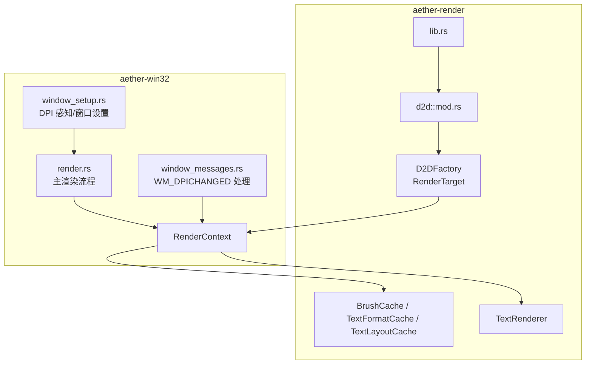
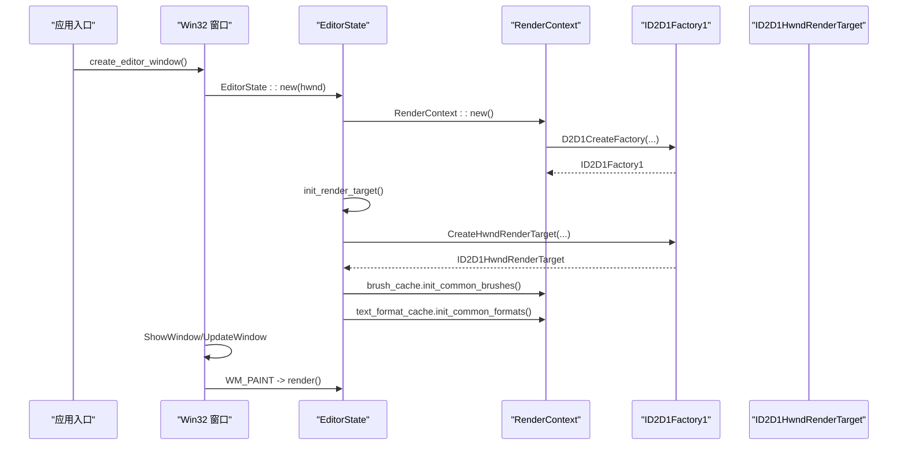
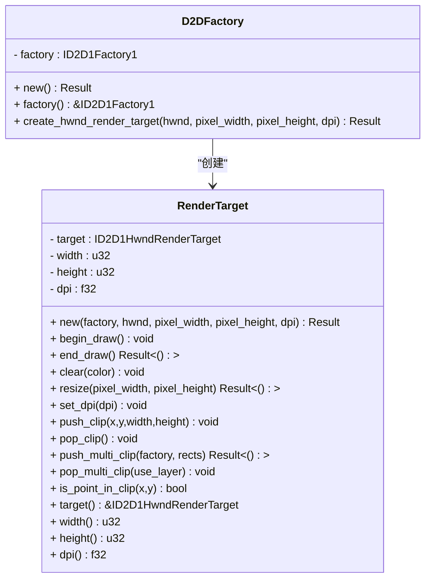
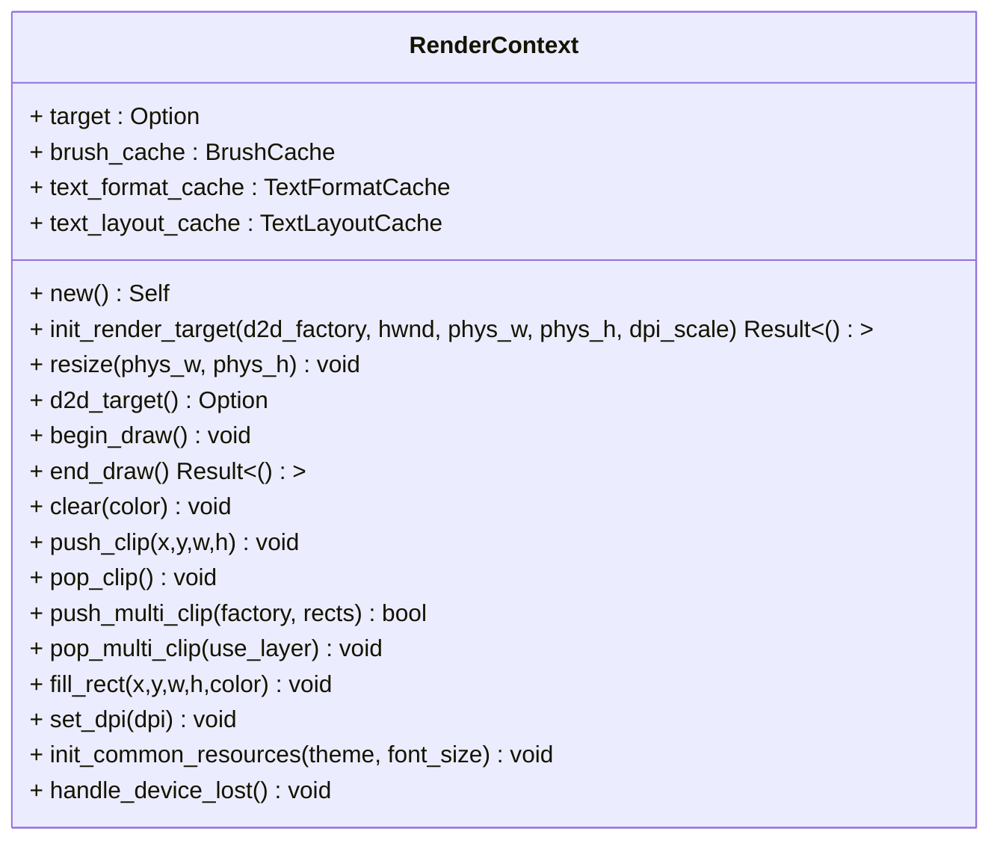
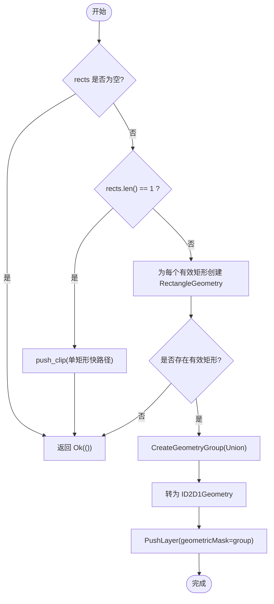
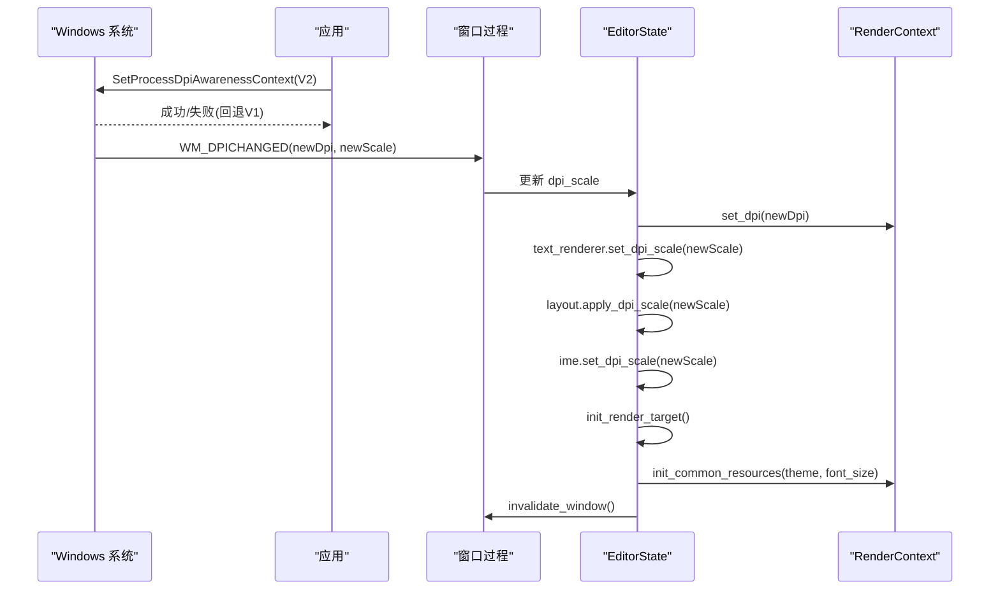
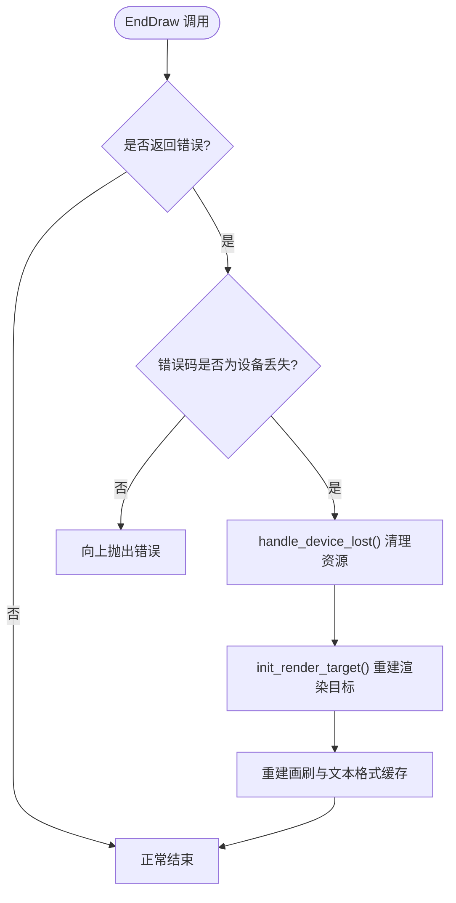
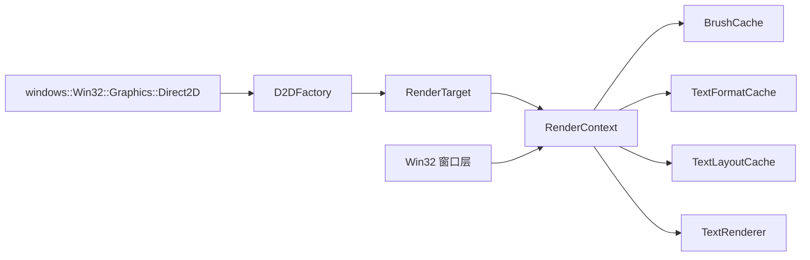

# Direct2D 工厂模式

<cite>
**本文引用的文件**   
- [factory.rs](file://crates/aether-render/src/d2d/factory.rs)
- [mod.rs](file://crates/aether-render/src/d2d/mod.rs)
- [lib.rs](file://crates/aether-render/src/lib.rs)
- [render_context.rs](file://crates/aether-win32/src/render_context.rs)
- [brush_cache.rs](file://crates/aether-render/src/d2d/brush_cache.rs)
- [text.rs](file://crates/aether-render/src/d2d/text.rs)
- [render.rs](file://crates/aether-win32/src/render.rs)
- [window_setup.rs](file://crates/aether-win32/src/window/window_setup.rs)
- [window_messages.rs](file://crates/aether-win32/src/window/window_messages.rs)
</cite>

## 目录
1. [简介](#简介)
2. [项目结构](#项目结构)
3. [核心组件](#核心组件)
4. [架构总览](#架构总览)
5. [详细组件分析](#详细组件分析)
6. [依赖关系分析](#依赖关系分析)
7. [性能考量](#性能考量)
8. [故障排查指南](#故障排查指南)
9. [结论](#结论)
10. [附录](#附录)

## 简介
本技术文档围绕 Direct2D 工厂模式在该 Rust 项目中的实现，系统性阐述图形对象工厂的设计原理与资源生命周期管理。重点覆盖：
- ID2D1Factory、ID2D1HwndRenderTarget 等核心对象的创建与管理
- 资源初始化、引用计数与自动清理策略（Rust RAII + COM 引用计数）
- 与 Win32 窗口的集成方式（窗口句柄绑定、设备上下文管理与 DPI 感知处理）
- 多矩形裁剪优化与脏区域渲染流程
- 错误处理与异常安全机制
- 面向开发者的最佳实践与性能优化建议

## 项目结构
Direct2D 相关代码主要分布在两个 crate：
- aether-render：封装 Direct2D/DirectWrite 的工厂、渲染目标、画刷与文本缓存等通用能力
- aether-win32：Win32 窗口层，负责窗口创建、消息循环、DPI 感知、与渲染层的集成

图表来源
- [factory.rs:1-120](file://crates/aether-render/src/d2d/factory.rs#L1-L120)
- [render_context.rs:1-120](file://crates/aether-win32/src/render_context.rs#L1-L120)
- [brush_cache.rs:1-120](file://crates/aether-render/src/d2d/brush_cache.rs#L1-L120)
- [text.rs:1-80](file://crates/aether-render/src/d2d/text.rs#L1-L80)
- [window_setup.rs:17-30](file://crates/aether-win32/src/window/window_setup.rs#L17-L30)
- [window_messages.rs:362-393](file://crates/aether-win32/src/window/window_messages.rs#L362-L393)
- [render.rs:62-140](file://crates/aether-win32/src/render.rs#L62-L140)

章节来源
- [mod.rs:1-5](file://crates/aether-render/src/d2d/mod.rs#L1-L5)
- [lib.rs:1-4](file://crates/aether-render/src/lib.rs#L1-L4)

## 核心组件
- D2DFactory：封装 ID2D1Factory1 的创建与 HWND 渲染目标的构建
- RenderTarget：封装 ID2D1HwndRenderTarget，提供 begin/end draw、clear、resize、DPI 更新、裁剪等接口
- RenderContext：将渲染目标、画刷缓存、文本格式缓存聚合为统一上下文，屏蔽借用冲突并简化调用
- BrushCache / TextFormatCache / TextLayoutCache：避免每帧重复创建 COM 对象，显著降低分配开销
- TextRenderer：基于 DirectWrite 的文本测量与绘制，支持 DPI 缩放与字体大小动态调整
- Win32 集成：窗口 DPI 感知设置、WM_DPICHANGED 事件处理、设备丢失恢复

章节来源
- [factory.rs:14-120](file://crates/aether-render/src/d2d/factory.rs#L14-L120)
- [render_context.rs:6-120](file://crates/aether-win32/src/render_context.rs#L6-L120)
- [brush_cache.rs:25-106](file://crates/aether-render/src/d2d/brush_cache.rs#L25-L106)
- [brush_cache.rs:108-270](file://crates/aether-render/src/d2d/brush_cache.rs#L108-L270)
- [text.rs:14-132](file://crates/aether-render/src/d2d/text.rs#L14-L132)
- [window_setup.rs:17-30](file://crates/aether-win32/src/window/window_setup.rs#L17-L30)
- [window_messages.rs:362-393](file://crates/aether-win32/src/window/window_messages.rs#L362-L393)

## 架构总览
下图展示了从窗口创建到首次渲染的关键序列，包括工厂与渲染目标的生命周期以及常见资源的预初始化。

图表来源
- [render.rs:62-140](file://crates/aether-win32/src/render.rs#L62-L140)
- [render_context.rs:21-46](file://crates/aether-win32/src/render_context.rs#L21-L46)
- [factory.rs:19-62](file://crates/aether-render/src/d2d/factory.rs#L19-L62)

## 详细组件分析

### D2DFactory 与 RenderTarget 类图

图表来源
- [factory.rs:14-120](file://crates/aether-render/src/d2d/factory.rs#L14-L120)

章节来源
- [factory.rs:14-120](file://crates/aether-render/src/d2d/factory.rs#L14-L120)

### 渲染上下文 RenderContext 的职责
- 统一管理 ID2D1HwndRenderTarget、BrushCache、TextFormatCache、TextLayoutCache
- 提供 begin_draw/end_draw/clear/resize/set_dpi/push/pop 裁剪等便捷方法
- 处理设备丢失后的资源清理与重建协调

图表来源
- [render_context.rs:6-226](file://crates/aether-win32/src/render_context.rs#L6-L226)

章节来源
- [render_context.rs:6-226](file://crates/aether-win32/src/render_context.rs#L6-L226)

### 多矩形裁剪算法流程
该流程用于在脏矩形场景下尽可能减少重绘面积，避免合并为单一包围盒导致的过度重绘。

图表来源
- [factory.rs:172-248](file://crates/aether-render/src/d2d/factory.rs#L172-L248)

章节来源
- [factory.rs:172-248](file://crates/aether-render/src/d2d/factory.rs#L172-L248)

### Win32 集成与 DPI 感知
- 进程级 DPI 感知：优先使用 Per-Monitor V2，失败回退至 Per-Monitor
- WM_DPICHANGED 处理：更新 DPI 缩放因子、重建渲染目标、重建文本格式与画刷缓存、触发重绘
- 窗口尺寸与布局：根据 DPI 计算初始窗口大小，持久化窗口状态并在启动时恢复

图表来源
- [window_setup.rs:17-30](file://crates/aether-win32/src/window/window_setup.rs#L17-L30)
- [window_messages.rs:362-393](file://crates/aether-win32/src/window/window_messages.rs#L362-L393)
- [render_context.rs:182-217](file://crates/aether-win32/src/render_context.rs#L182-L217)

章节来源
- [window_setup.rs:17-30](file://crates/aether-win32/src/window/window_setup.rs#L17-L30)
- [window_messages.rs:362-393](file://crates/aether-win32/src/window/window_messages.rs#L362-L393)

### 设备丢失与异常安全
- EndDraw 返回特定错误码时判定设备丢失，执行资源清理与重建
- 清理 IconCache 等依赖 GPU 资源的缓存，确保下次绘制能正确重建几何对象
- 重新初始化常用画刷与文本格式，保证渲染一致性

图表来源
- [render.rs:704-746](file://crates/aether-win32/src/render.rs#L704-L746)
- [render_context.rs:219-225](file://crates/aether-win32/src/render_context.rs#L219-L225)

章节来源
- [render.rs:704-746](file://crates/aether-win32/src/render.rs#L704-L746)
- [render_context.rs:219-225](file://crates/aether-win32/src/render_context.rs#L219-L225)

### 文本渲染器与 DPI 缩放
- 通过 DirectWrite 实测等宽字体字符宽度，替代硬编码估算
- DPI 变化或字体大小变化时重建文本格式，同步更新行高与字符宽度
- 提供文本测量与位置查询工具，辅助 UI 交互与自适应布局

章节来源
- [text.rs:24-132](file://crates/aether-render/src/d2d/text.rs#L24-L132)
- [text.rs:316-374](file://crates/aether-render/src/d2d/text.rs#L316-L374)

## 依赖关系分析
- D2DFactory 依赖 windows-rs 提供的 Direct2D 类型与工厂函数
- RenderTarget 依赖 ID2D1HwndRenderTarget 进行绘制与裁剪
- RenderContext 组合多个缓存对象，屏蔽底层 COM 对象创建细节
- Win32 窗口层通过消息循环驱动渲染，处理 DPI 变化和设备丢失

图表来源
- [factory.rs:1-12](file://crates/aether-render/src/d2d/factory.rs#L1-L12)
- [render_context.rs:1-19](file://crates/aether-win32/src/render_context.rs#L1-L19)
- [brush_cache.rs:1-14](file://crates/aether-render/src/d2d/brush_cache.rs#L1-L14)
- [text.rs:1-10](file://crates/aether-render/src/d2d/text.rs#L1-L10)

章节来源
- [factory.rs:1-12](file://crates/aether-render/src/d2d/factory.rs#L1-L12)
- [render_context.rs:1-19](file://crates/aether-win32/src/render_context.rs#L1-L19)
- [brush_cache.rs:1-14](file://crates/aether-render/src/d2d/brush_cache.rs#L1-L14)
- [text.rs:1-10](file://crates/aether-render/src/d2d/text.rs#L1-L10)

## 性能考量
- 画刷与文本格式缓存：预存常用项，命中率高时线性扫描优于 HashMap；超出上限时清空回退缓存，避免无界增长
- 多矩形裁剪：使用 GeometryGroup Union + PushLayer 精确裁剪，避免合并为包围盒导致重绘面积膨胀
- 脏区域渲染：仅在必要时标记脏区域，跳过无变化的全窗口重绘
- 文本布局缓存：复用 IDWriteTextLayout，减少频繁创建 COM 对象的开销
- DPI 切换后重建必要资源，避免旧资源与新 DPI 不匹配导致的渲染不一致

章节来源
- [brush_cache.rs:25-106](file://crates/aether-render/src/d2d/brush_cache.rs#L25-L106)
- [brush_cache.rs:108-270](file://crates/aether-render/src/d2d/brush_cache.rs#L108-L270)
- [brush_cache.rs:376-477](file://crates/aether-render/src/d2d/brush_cache.rs#L376-L477)
- [factory.rs:172-248](file://crates/aether-render/src/d2d/factory.rs#L172-L248)
- [render.rs:394-410](file://crates/aether-win32/src/render.rs#L394-L410)

## 故障排查指南
- 设备丢失（D2DERR_RECREATE_TARGET）：检查 EndDraw 返回值，确认已调用 handle_device_lost 并重建渲染目标与缓存
- DPI 变化后渲染异常：确认 WM_DPICHANGED 中更新了 dpi_scale、重建了渲染目标与缓存，并触发了重绘
- 多矩形裁剪无效：检查 rects 列表是否包含有效矩形，确认 push_multi_clip 与 pop_multi_clip 配对且 use_layer 标志一致
- 文本显示错位：确认 TextLayout 创建时不带 null 终止符，与测量逻辑保持一致

章节来源
- [render.rs:704-746](file://crates/aether-win32/src/render.rs#L704-L746)
- [window_messages.rs:362-393](file://crates/aether-win32/src/window/window_messages.rs#L362-L393)
- [factory.rs:172-248](file://crates/aether-render/src/d2d/factory.rs#L172-L248)
- [brush_cache.rs:428-442](file://crates/aether-render/src/d2d/brush_cache.rs#L428-L442)

## 结论
本项目通过 D2DFactory 与 RenderTarget 抽象出 Direct2D 工厂模式的核心能力，结合 RenderContext 对资源进行集中管理，实现了高效的图形对象生命周期控制。配合多矩形裁剪、脏区域渲染与丰富的缓存策略，系统在复杂 UI 场景下仍保持良好性能。Win32 集成方面，完善的 DPI 感知与设备丢失恢复机制确保了跨显示器与动态环境下的稳定性。

## 附录
- 最佳实践
  - 始终通过 D2DFactory 创建 ID2D1HwndRenderTarget，避免直接调用底层 API
  - 在 DPI 变化时重建渲染目标与相关缓存，避免资源与 DPI 不匹配
  - 使用多矩形裁剪而非简单包围盒，减少不必要的重绘
  - 合理设置缓存上限，防止内存无界增长
  - 在 EndDraw 错误分支中检测设备丢失并执行完整恢复流程

[本节为概念性总结，无需列出具体文件来源]