# Direct2D 渲染抽象层

<cite>
**本文引用的文件**
- [crates/aether-render/src/lib.rs](file://crates/aether-render/src/lib.rs)
- [crates/aether-render/src/d2d/mod.rs](file://crates/aether-render/src/d2d/mod.rs)
- [crates/aether-render/src/d2d/factory.rs](file://crates/aether-render/src/d2d/factory.rs)
- [crates/aether-render/src/d2d/brush_cache.rs](file://crates/aether-render/src/d2d/brush_cache.rs)
- [crates/aether-render/src/d2d/text.rs](file://crates/aether-render/src/d2d/text.rs)
- [crates/aether-render/src/d2d/glass.rs](file://crates/aether-render/src/d2d/glass.rs)
- [crates/aether-render/src/theme.rs](file://crates/aether-render/src/theme.rs)
- [crates/aether-win32/src/render_context.rs](file://crates/aether-win32/src/render_context.rs)
- [crates/aether-win32/src/render.rs](file://crates/aether-win32/src/render.rs)
- [crates/aether-win32/src/window/window_messages.rs](file://crates/aether-win32/src/window/window_messages.rs)
- [crates/aether-win32/src/dirty_rect.rs](file://crates/aether-win32/src/dirty_rect.rs)
</cite>

## 目录
1. [简介](#简介)
2. [项目结构](#项目结构)
3. [核心组件](#核心组件)
4. [架构总览](#架构总览)
5. [详细组件分析](#详细组件分析)
6. [依赖关系分析](#依赖关系分析)
7. [性能考量](#性能考量)
8. [故障排查指南](#故障排查指南)
9. [结论](#结论)
10. [附录](#附录)

## 简介
本技术文档聚焦于 Direct2D/DirectWrite 渲染抽象层的设计与实现，涵盖图形工厂模式、绘制对象生命周期管理、资源缓存策略（画刷与文本格式/布局）、高级文本渲染特性（字体处理、抗锯齿、Unicode）、玻璃效果（Glass）的视觉增强方案，以及与 Win32 窗口集成和消息处理的协作方式。同时提供高性能渲染最佳实践与调试技巧，帮助开发者快速构建自定义绘制组件并稳定运行在高 DPI、设备丢失等复杂场景下。

## 项目结构
渲染抽象层位于 aether-render 库中，按功能模块组织：
- d2d 子模块封装 Direct2D/DirectWrite 的核心能力：工厂与渲染目标、画刷与文本缓存、文本渲染器、玻璃效果工具。
- theme 模块定义主题与语法高亮颜色，供渲染管线使用。
- aether-win32 负责与 Win32 窗口系统集成，包括渲染上下文、脏矩形追踪、消息处理与主渲染循环。

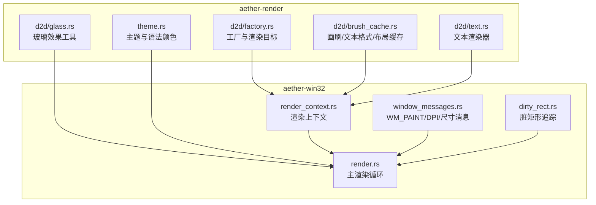

图表来源
- [crates/aether-render/src/d2d/factory.rs:1-120](file://crates/aether-render/src/d2d/factory.rs#L1-L120)
- [crates/aether-render/src/d2d/brush_cache.rs:1-120](file://crates/aether-render/src/d2d/brush_cache.rs#L1-L120)
- [crates/aether-render/src/d2d/text.rs:1-60](file://crates/aether-render/src/d2d/text.rs#L1-L60)
- [crates/aether-render/src/d2d/glass.rs:1-60](file://crates/aether-render/src/d2d/glass.rs#L1-L60)
- [crates/aether-render/src/theme.rs:1-60](file://crates/aether-render/src/theme.rs#L1-L60)
- [crates/aether-win32/src/render_context.rs:1-60](file://crates/aether-win32/src/render_context.rs#L1-L60)
- [crates/aether-win32/src/render.rs:60-140](file://crates/aether-win32/src/render.rs#L60-L140)
- [crates/aether-win32/src/window/window_messages.rs:478-514](file://crates/aether-win32/src/window/window_messages.rs#L478-L514)
- [crates/aether-win32/src/dirty_rect.rs:1-120](file://crates/aether-win32/src/dirty_rect.rs#L1-L120)

章节来源
- [crates/aether-render/src/lib.rs:1-4](file://crates/aether-render/src/lib.rs#L1-L4)
- [crates/aether-render/src/d2d/mod.rs:1-5](file://crates/aether-render/src/d2d/mod.rs#L1-L5)

## 核心组件
- 图形工厂与渲染目标：单线程工厂创建 HWND 渲染目标，支持 DPI 更新、多矩形裁剪、Resize 与 Begin/EndDraw 生命周期控制。
- 画刷缓存系统：预存常用颜色画笔 + HashMap 回退，避免每帧创建 COM 对象；包含内存上限与失效清理策略。
- 文本格式与布局缓存：预置常用 TextFormat，TextLayout 缓存复用相同文本布局，减少 COM 分配与测量开销。
- 文本渲染器：基于 DirectWrite 的等宽字体度量、DPI 缩放、行高与字符宽度计算，以及可见区域增量渲染。
- 玻璃效果工具：半透明面板、柔和边框、光晕选择与阴影绘制，配合 BrushCache 提升性能。
- 渲染上下文：统一封装 RenderTarget、BrushCache、TextFormatCache、TextLayoutCache，并提供多矩形裁剪与设备丢失恢复。
- 脏矩形追踪：按 UI 区域类型标记变化，合并重叠区域，推断最小重绘命令，避免全量重绘。
- Win32 集成：WM_PAINT 触发渲染、WM_SIZE/WM_DPICHANGED 调整渲染目标与 DPI、错误捕获与优雅降级。

章节来源
- [crates/aether-render/src/d2d/factory.rs:14-120](file://crates/aether-render/src/d2d/factory.rs#L14-L120)
- [crates/aether-render/src/d2d/brush_cache.rs:25-106](file://crates/aether-render/src/d2d/brush_cache.rs#L25-L106)
- [crates/aether-render/src/d2d/brush_cache.rs:108-314](file://crates/aether-render/src/d2d/brush_cache.rs#L108-L314)
- [crates/aether-render/src/d2d/text.rs:14-102](file://crates/aether-render/src/d2d/text.rs#L14-L102)
- [crates/aether-render/src/d2d/glass.rs:12-154](file://crates/aether-render/src/d2d/glass.rs#L12-L154)
- [crates/aether-win32/src/render_context.rs:6-118](file://crates/aether-win32/src/render_context.rs#L6-L118)
- [crates/aether-win32/src/dirty_rect.rs:87-162](file://crates/aether-win32/src/dirty_rect.rs#L87-L162)
- [crates/aether-win32/src/window/window_messages.rs:478-514](file://crates/aether-win32/src/window/window_messages.rs#L478-L514)

## 架构总览
渲染流程从 Win32 消息循环进入 WM_PAINT，调用 EditorState::render()，内部通过 RenderContext 管理 Direct2D 渲染目标与各类缓存，结合 DirtyRectTracker 进行局部裁剪与增量绘制，最终 EndDraw 提交到 GPU。

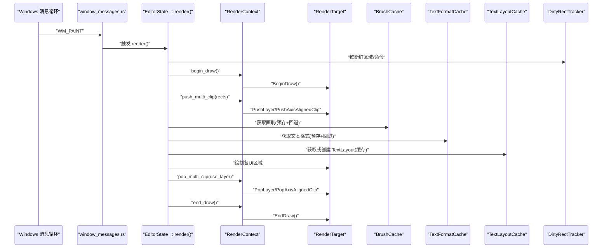

图表来源
- [crates/aether-win32/src/window/window_messages.rs:478-514](file://crates/aether-win32/src/window/window_messages.rs#L478-L514)
- [crates/aether-win32/src/render.rs:385-410](file://crates/aether-win32/src/render.rs#L385-L410)
- [crates/aether-win32/src/render_context.rs:65-118](file://crates/aether-win32/src/render_context.rs#L65-L118)
- [crates/aether-render/src/d2d/brush_cache.rs:71-99](file://crates/aether-render/src/d2d/brush_cache.rs#L71-L99)
- [crates/aether-render/src/d2d/brush_cache.rs:229-269](file://crates/aether-render/src/d2d/brush_cache.rs#L229-L269)
- [crates/aether-render/src/d2d/brush_cache.rs:405-442](file://crates/aether-render/src/d2d/brush_cache.rs#L405-L442)
- [crates/aether-render/src/d2d/factory.rs:90-98](file://crates/aether-render/src/d2d/factory.rs#L90-L98)

## 详细组件分析

### 图形工厂与渲染目标（D2DFactory / RenderTarget）
- 工厂模式：单线程 ID2D1Factory1 实例，用于创建 HWND 渲染目标。
- 渲染目标：封装 BeginDraw/EndDraw/Clear/Resize/SetDpi，支持轴对齐裁剪与多矩形几何裁剪（Union GeometryGroup + PushLayer）。
- 多矩形裁剪：当 rects 为空或仅一个时走快路径；多个矩形则创建 RectangleGeometry 列表，组合为 GeometryGroup，并通过 Layer 的 geometricMask 精确裁剪，避免包围盒膨胀。

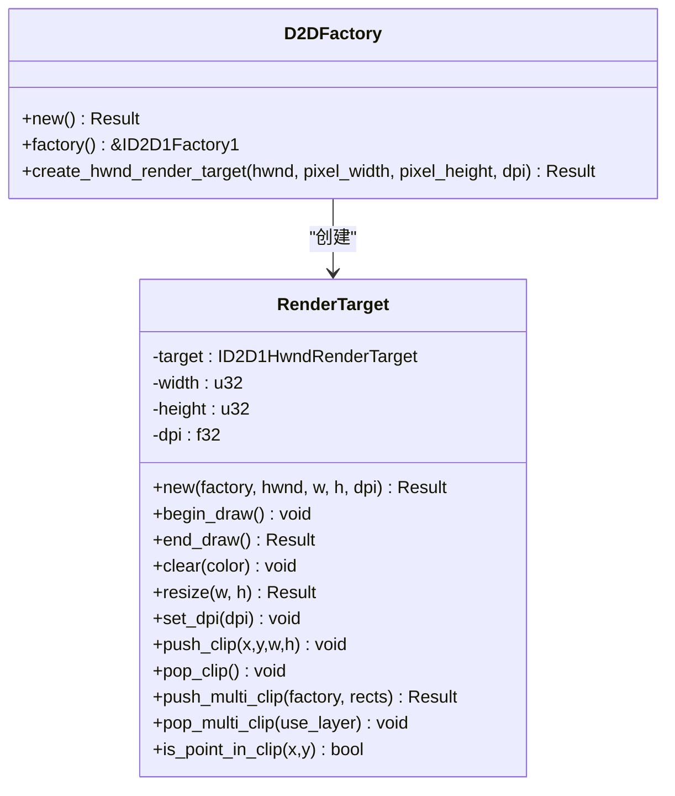

图表来源
- [crates/aether-render/src/d2d/factory.rs:14-120](file://crates/aether-render/src/d2d/factory.rs#L14-L120)
- [crates/aether-render/src/d2d/factory.rs:172-271](file://crates/aether-render/src/d2d/factory.rs#L172-L271)

章节来源
- [crates/aether-render/src/d2d/factory.rs:14-120](file://crates/aether-render/src/d2d/factory.rs#L14-L120)
- [crates/aether-render/src/d2d/factory.rs:172-271](file://crates/aether-render/src/d2d/factory.rs#L172-L271)

### 画刷缓存系统（BrushCache）
- 设计目标：避免每帧创建 ID2D1SolidColorBrush，降低 COM 对象分配与销毁开销。
- 预存槽位：常用颜色直接命中小数组线性扫描，命中率极高时比 HashMap 更快。
- 回退策略：未命中则查 HashMap，超过最大条目数时清空重建，防止无界增长。
- 失效机制：设备丢失时 clear() 清空所有缓存；DPI 变化后重新初始化常用画刷。

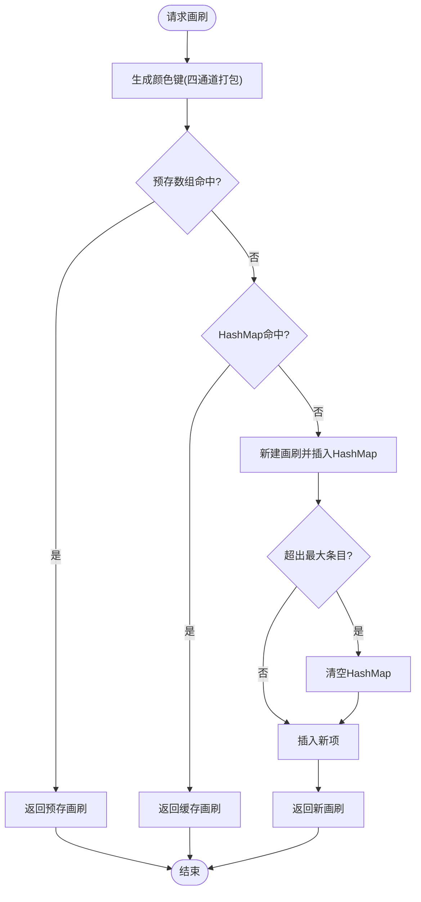

图表来源
- [crates/aether-render/src/d2d/brush_cache.rs:71-99](file://crates/aether-render/src/d2d/brush_cache.rs#L71-L99)
- [crates/aether-render/src/d2d/brush_cache.rs:479-487](file://crates/aether-render/src/d2d/brush_cache.rs#L479-L487)

章节来源
- [crates/aether-render/src/d2d/brush_cache.rs:25-106](file://crates/aether-render/src/d2d/brush_cache.rs#L25-L106)
- [crates/aether-render/src/d2d/brush_cache.rs:479-487](file://crates/aether-render/src/d2d/brush_cache.rs#L479-L487)

### 文本格式与布局缓存（TextFormatCache / TextLayoutCache）
- TextFormatCache：预置三种常用格式（代码左对齐、行号右对齐、居中），其余通过 HashMap 回退；key 将 font_size 缩放为整数避免浮点精度问题。
- TextLayoutCache：对相同文本内容复用 IDWriteTextLayout，避免重复创建与测量；字体大小变化时自动清空缓存；支持带省略号的单行布局。
- Unicode 支持：UTF-16 编码输入，DirectWrite 原生支持 Unicode 字形与度量。

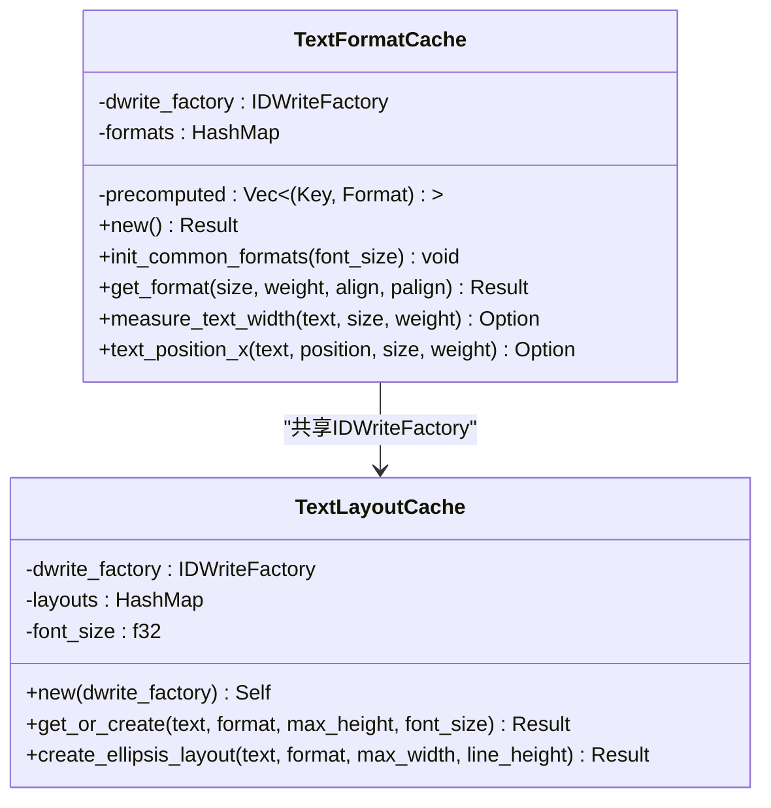

图表来源
- [crates/aether-render/src/d2d/brush_cache.rs:108-314](file://crates/aether-render/src/d2d/brush_cache.rs#L108-L314)
- [crates/aether-render/src/d2d/brush_cache.rs:376-477](file://crates/aether-render/src/d2d/brush_cache.rs#L376-L477)

章节来源
- [crates/aether-render/src/d2d/brush_cache.rs:108-314](file://crates/aether-render/src/d2d/brush_cache.rs#L108-L314)
- [crates/aether-render/src/d2d/brush_cache.rs:376-477](file://crates/aether-render/src/d2d/brush_cache.rs#L376-L477)

### 文本渲染器（TextRenderer）
- 字体与度量：默认 Consolas，中文语言环境 zh-CN；使用 DirectWrite 实测等宽字符推进宽度，替代硬编码比例。
- DPI 缩放：根据 DPI 动态重建 TextFormat，并重新测量字符宽度与行高。
- 可见区域渲染：根据滚动与视口计算可见行范围，逐行绘制 token 着色文本。

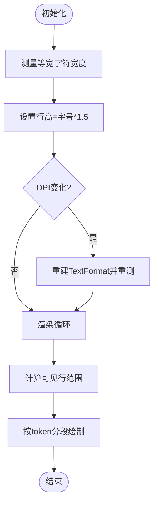

图表来源
- [crates/aether-render/src/d2d/text.rs:24-102](file://crates/aether-render/src/d2d/text.rs#L24-L102)
- [crates/aether-render/src/d2d/text.rs:138-221](file://crates/aether-render/src/d2d/text.rs#L138-L221)

章节来源
- [crates/aether-render/src/d2d/text.rs:24-102](file://crates/aether-render/src/d2d/text.rs#L24-L102)
- [crates/aether-render/src/d2d/text.rs:138-221](file://crates/aether-render/src/d2d/text.rs#L138-L221)

### 玻璃效果（Glass）
- 半透明面板：背景填充 + 可选柔和边框（上下左右四条细矩形）。
- 光晕选择：外层更大矩形低透明度叠加，内层原矩形高透明度叠加，模拟发光效果。
- 阴影与圆角模拟：底部渐变阴影条与顶部高光条，营造层次与质感。
- 与 BrushCache 集成：所有颜色均通过缓存获取，避免重复创建。

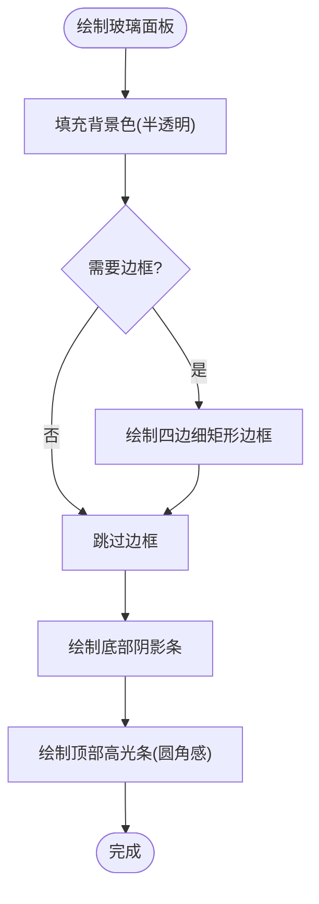

图表来源
- [crates/aether-render/src/d2d/glass.rs:12-154](file://crates/aether-render/src/d2d/glass.rs#L12-L154)

章节来源
- [crates/aether-render/src/d2d/glass.rs:12-154](file://crates/aether-render/src/d2d/glass.rs#L12-L154)

### 渲染上下文与多矩形裁剪（RenderContext）
- 职责：封装 RenderTarget、BrushCache、TextFormatCache、TextLayoutCache，提供 begin/end_draw、clear、fill_rect、push/pop_clip 等便捷方法。
- 多矩形裁剪：当 rects 数量 > 1 且失败时回退为包围盒 AxisAlignedClip；成功时使用 PushLayer + geometryMask 精确裁剪。
- 设备丢失恢复：handle_device_lost 清空所有资源，上层在 EndDraw 错误码检测后重建渲染目标并重新初始化缓存。

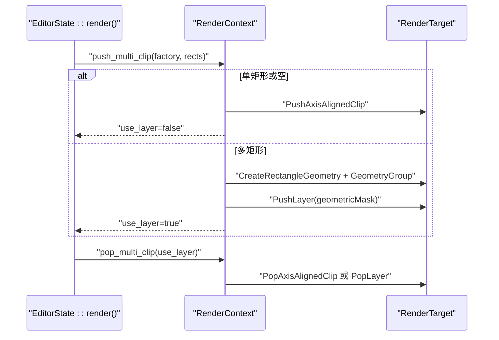

图表来源
- [crates/aether-win32/src/render_context.rs:107-155](file://crates/aether-win32/src/render_context.rs#L107-L155)
- [crates/aether-render/src/d2d/factory.rs:172-271](file://crates/aether-render/src/d2d/factory.rs#L172-L271)

章节来源
- [crates/aether-win32/src/render_context.rs:6-118](file://crates/aether-win32/src/render_context.rs#L6-L118)
- [crates/aether-win32/src/render_context.rs:107-155](file://crates/aether-win32/src/render_context.rs#L107-L155)

### 脏矩形追踪与渲染命令推断（DirtyRectTracker）
- 区域类型：标题栏、菜单栏、活动栏、侧边栏、编辑器内容、标签栏、状态栏、右侧面板、底部面板、对话框、全窗口。
- 合并策略：同类型相交矩形合并，数量超过阈值时合并全部或降级为全窗口重绘。
- 渲染命令：根据状态变化推断最小重绘范围（如仅编辑器、仅侧边栏、全量等），无变化时跳过渲染。

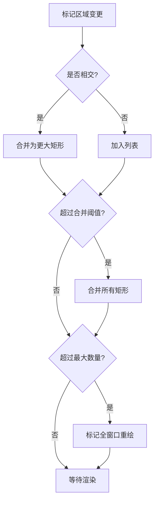

图表来源
- [crates/aether-win32/src/dirty_rect.rs:120-162](file://crates/aether-win32/src/dirty_rect.rs#L120-L162)
- [crates/aether-win32/src/dirty_rect.rs:368-426](file://crates/aether-win32/src/dirty_rect.rs#L368-L426)

章节来源
- [crates/aether-win32/src/dirty_rect.rs:87-162](file://crates/aether-win32/src/dirty_rect.rs#L87-L162)
- [crates/aether-win32/src/dirty_rect.rs:368-426](file://crates/aether-win32/src/dirty_rect.rs#L368-L426)

### Win32 窗口集成与消息处理
- WM_PAINT：确保有脏区域才渲染；catch_unwind 捕获 D2D 资源创建 panic，优雅降级。
- WM_SIZE：非最小化时更新窗口尺寸并触发重绘。
- WM_DPICHANGED：更新 DPI 缩放因子、重建渲染目标、重置文本格式与画刷缓存，保持 UI 一致性。
- WM_NCHITTEST/WM_SETCURSOR：无边框窗口自定义拖拽与光标类型。

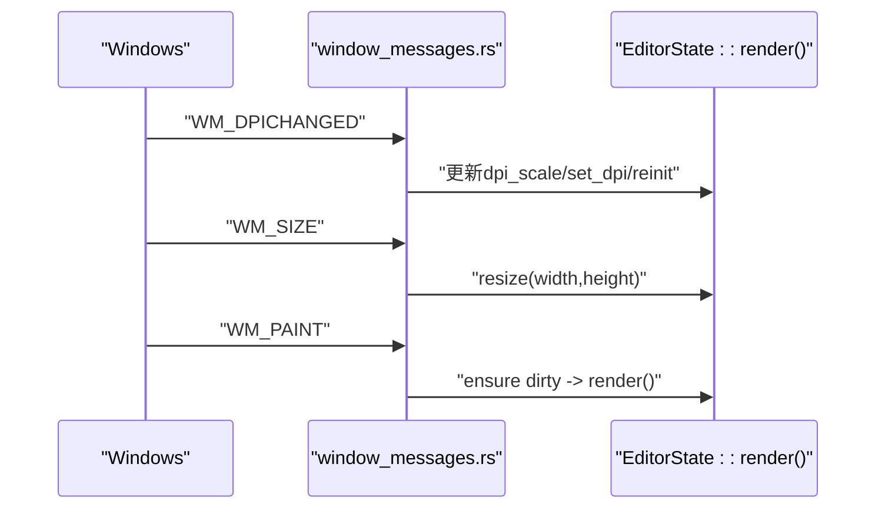

图表来源
- [crates/aether-win32/src/window/window_messages.rs:345-394](file://crates/aether-win32/src/window/window_messages.rs#L345-L394)
- [crates/aether-win32/src/window/window_messages.rs:320-343](file://crates/aether-win32/src/window/window_messages.rs#L320-L343)
- [crates/aether-win32/src/window/window_messages.rs:478-514](file://crates/aether-win32/src/window/window_messages.rs#L478-L514)

章节来源
- [crates/aether-win32/src/window/window_messages.rs:345-394](file://crates/aether-win32/src/window/window_messages.rs#L345-L394)
- [crates/aether-win32/src/window/window_messages.rs:320-343](file://crates/aether-win32/src/window/window_messages.rs#L320-L343)
- [crates/aether-win32/src/window/window_messages.rs:478-514](file://crates/aether-win32/src/window/window_messages.rs#L478-L514)

## 依赖关系分析
- aether-render 模块对外暴露 d2d、theme、vscode_theme；d2d 内部模块相互依赖：factory 被 render_context 使用，brush_cache 被 glass 与 text 使用。
- aether-win32 通过 render_context 聚合渲染资源，并在 render.rs 中编排 UI 各区域的绘制顺序与脏区域裁剪。
- 主题与语法颜色由 theme.rs 提供，供渲染器与玻璃效果使用。

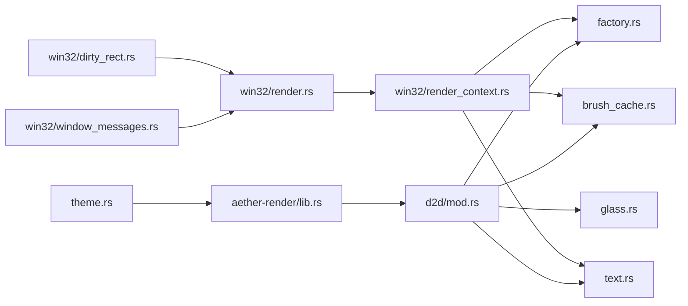

图表来源
- [crates/aether-render/src/lib.rs:1-4](file://crates/aether-render/src/lib.rs#L1-L4)
- [crates/aether-render/src/d2d/mod.rs:1-5](file://crates/aether-render/src/d2d/mod.rs#L1-L5)
- [crates/aether-win32/src/render_context.rs:1-31](file://crates/aether-win32/src/render_context.rs#L1-L31)
- [crates/aether-win32/src/render.rs:1-20](file://crates/aether-win32/src/render.rs#L1-L20)
- [crates/aether-win32/src/window/window_messages.rs:1-20](file://crates/aether-win32/src/window/window_messages.rs#L1-L20)
- [crates/aether-win32/src/dirty_rect.rs:1-35](file://crates/aether-win32/src/dirty_rect.rs#L1-L35)

章节来源
- [crates/aether-render/src/lib.rs:1-4](file://crates/aether-render/src/lib.rs#L1-L4)
- [crates/aether-render/src/d2d/mod.rs:1-5](file://crates/aether-render/src/d2d/mod.rs#L1-L5)
- [crates/aether-win32/src/render_context.rs:1-31](file://crates/aether-win32/src/render_context.rs#L1-L31)
- [crates/aether-win32/src/render.rs:1-20](file://crates/aether-win32/src/render.rs#L1-L20)
- [crates/aether-win32/src/window/window_messages.rs:1-20](file://crates/aether-win32/src/window/window_messages.rs#L1-L20)
- [crates/aether-win32/src/dirty_rect.rs:1-35](file://crates/aether-win32/src/dirty_rect.rs#L1-L35)

## 性能考量
- 画刷与文本缓存：预存常用资源，避免频繁 COM 对象创建；超出容量时清空回退缓存，防止内存无界增长。
- 多矩形裁剪：使用几何组与图层 mask 精确裁剪，避免包围盒导致的过度重绘。
- 文本布局缓存：相同文本复用 TextLayout，显著减少测量与绘制成本。
- 脏矩形优化：按区域类型标记与合并，推断最小重绘命令，无变化时跳过渲染。
- DPI 与设备丢失：及时重建渲染目标与缓存，保证一致性与稳定性。

[本节为通用指导，不直接分析具体文件]

## 故障排查指南
- 设备丢失（D2DERR_RECREATE_TARGET）：在 EndDraw 错误码检测后重建渲染目标，并清理 IconCache 与画刷/文本缓存，重新初始化常用资源。
- 渲染 Panic：WM_PAINT 中使用 catch_unwind 捕获 panic，记录诊断信息并优雅跳过本次绘制，避免崩溃传播。
- DPI 切换异常：确保 set_dpi 后重建渲染目标与缓存，避免旧字体大小导致渲染不一致。
- 脏矩形缺失：WM_PAINT 若内部脏区为空，强制标记全窗口重绘，避免上一帧残留。

章节来源
- [crates/aether-win32/src/render.rs:704-746](file://crates/aether-win32/src/render.rs#L704-L746)
- [crates/aether-win32/src/window/window_messages.rs:478-514](file://crates/aether-win32/src/window/window_messages.rs#L478-L514)
- [crates/aether-win32/src/window/window_messages.rs:345-394](file://crates/aether-win32/src/window/window_messages.rs#L345-L394)

## 结论
该渲染抽象层通过工厂模式与多层缓存体系，有效降低了 Direct2D/DirectWrite 的资源创建开销，并结合脏矩形与多矩形裁剪实现了高效的增量渲染。玻璃效果工具提供了现代 UI 所需的视觉增强能力。Win32 集成层确保了在不同 DPI 和设备丢失场景下的鲁棒性。遵循本文的最佳实践与调试技巧，可显著提升编辑器渲染性能与用户体验。

[本节为总结，不直接分析具体文件]

## 附录

### 自定义绘制组件示例（步骤说明）
- 初始化渲染上下文：创建 RenderContext，初始化 D2DFactory 与 RenderTarget，预初始化常用画刷与文本格式。
- 开始绘制：调用 begin_draw，根据脏矩形设置 push_multi_clip。
- 绘制组件：使用 BrushCache 获取画刷，使用 TextFormatCache/TextLayoutCache 获取文本格式与布局，调用 RenderTarget 绘制矩形、文本等。
- 结束绘制：调用 pop_multi_clip 与 end_draw，检查错误码处理设备丢失。
- 参考路径：
  - [crates/aether-win32/src/render_context.rs:33-46](file://crates/aether-win32/src/render_context.rs#L33-L46)
  - [crates/aether-win32/src/render.rs:385-410](file://crates/aether-win32/src/render.rs#L385-L410)
  - [crates/aether-render/src/d2d/brush_cache.rs:71-99](file://crates/aether-render/src/d2d/brush_cache.rs#L71-L99)
  - [crates/aether-render/src/d2d/brush_cache.rs:229-269](file://crates/aether-render/src/d2d/brush_cache.rs#L229-L269)
  - [crates/aether-render/src/d2d/brush_cache.rs:405-442](file://crates/aether-render/src/d2d/brush_cache.rs#L405-L442)

### 与 Win32 窗口的集成要点
- WM_PAINT：确保脏区域存在，调用 EditorState::render()。
- WM_SIZE：更新尺寸并触发重绘。
- WM_DPICHANGED：更新 DPI 缩放、重建渲染目标与缓存。
- 无边框窗口：自定义 NCHITTEST 与 SETCURSOR 行为。
- 参考路径：
  - [crates/aether-win32/src/window/window_messages.rs:320-343](file://crates/aether-win32/src/window/window_messages.rs#L320-L343)
  - [crates/aether-win32/src/window/window_messages.rs:345-394](file://crates/aether-win32/src/window/window_messages.rs#L345-L394)
  - [crates/aether-win32/src/window/window_messages.rs:478-514](file://crates/aether-win32/src/window/window_messages.rs#L478-L514)