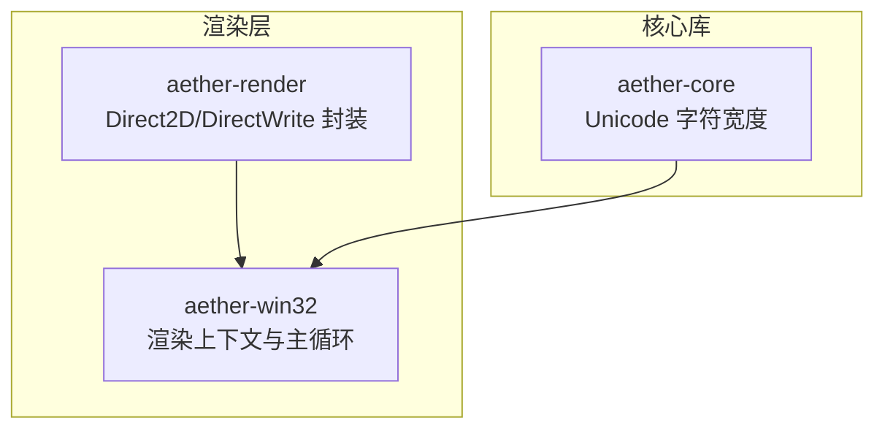
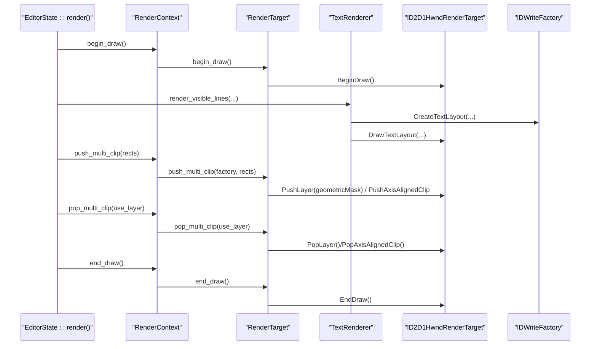
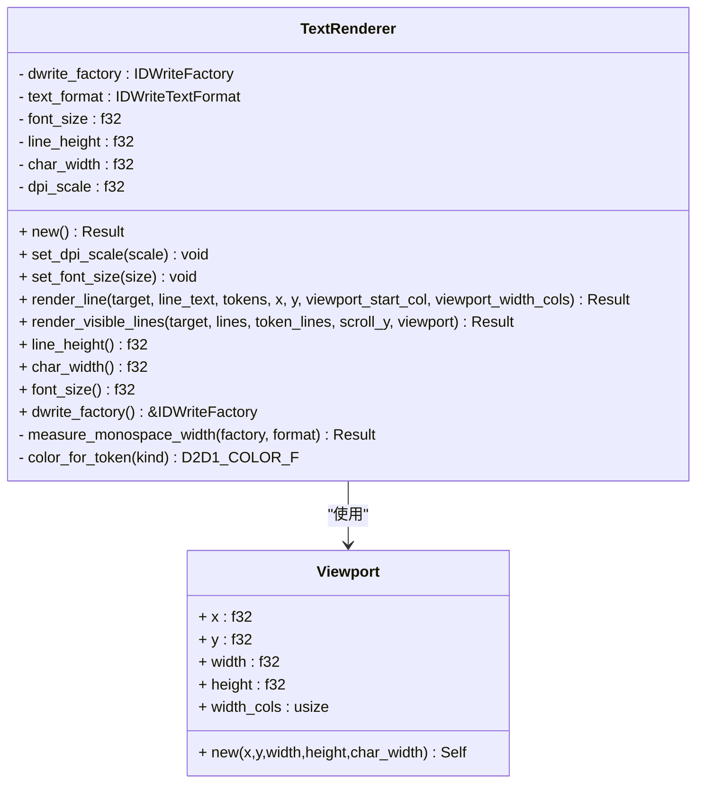
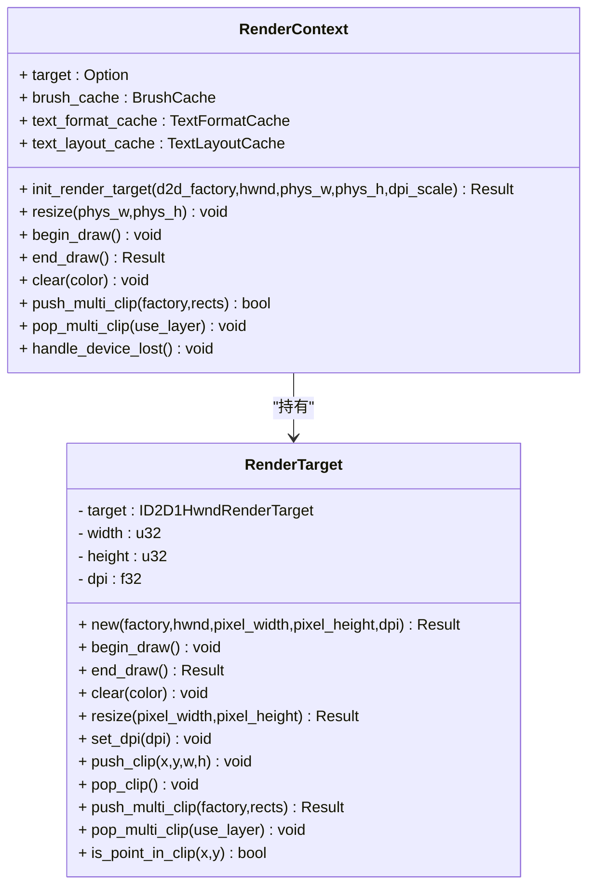
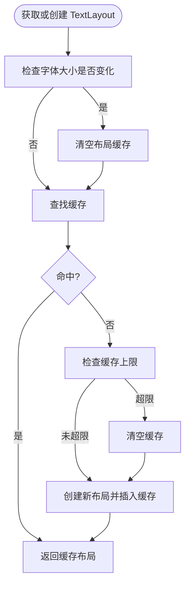
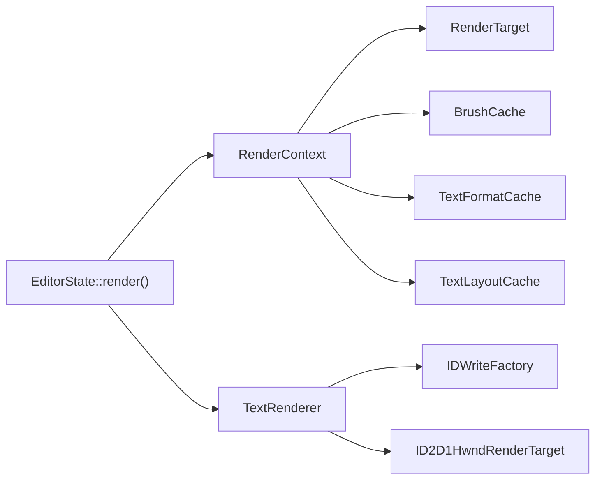

# 文本渲染引擎

<cite>
**本文引用的文件**
- [crates/aether-render/src/d2d/text.rs](file://crates/aether-render/src/d2d/text.rs)
- [crates/aether-render/src/d2d/factory.rs](file://crates/aether-render/src/d2d/factory.rs)
- [crates/aether-render/src/d2d/brush_cache.rs](file://crates/aether-render/src/d2d/brush_cache.rs)
- [crates/aether-win32/src/render_context.rs](file://crates/aether-win32/src/render_context.rs)
- [crates/aether-core/src/char_width.rs](file://crates/aether-core/src/char_width.rs)
- [crates/aether-win32/src/render.rs](file://crates/aether-win32/src/render.rs)
</cite>

## 目录
1. [简介](#简介)
2. [项目结构](#项目结构)
3. [核心组件](#核心组件)
4. [架构总览](#架构总览)
5. [详细组件分析](#详细组件分析)
6. [依赖关系分析](#依赖关系分析)
7. [性能考虑](#性能考虑)
8. [故障排查指南](#故障排查指南)
9. [结论](#结论)
10. [附录](#附录)

## 简介
本技术文档聚焦于基于 DirectWrite/Direct2D 的文本渲染子系统，覆盖字体加载、文本布局与高亮显示、Unicode 文本处理（编码转换、双向文本与复杂脚本）、抗锯齿与子像素渲染（ClearType）及 DPI 自适应。同时提供自定义文本样式实现思路、文本测量与换行策略、滚动优化方案，以及高性能渲染最佳实践与调试技巧。

## 项目结构
文本渲染相关代码主要分布在以下模块：
- aether-render: 封装 Direct2D/DirectWrite 的工厂、画刷缓存、文本格式缓存、TextLayout 缓存与文本渲染器
- aether-win32: 编辑器主渲染流程、渲染上下文管理、脏矩形裁剪与多矩形并集裁剪
- aether-core: Unicode East Asian Width 字符宽度计算，用于等宽布局与光标定位

图表来源
- [crates/aether-render/src/d2d/text.rs](file://crates/aether-render/src/d2d/text.rs)
- [crates/aether-render/src/d2d/factory.rs](file://crates/aether-render/src/d2d/factory.rs)
- [crates/aether-render/src/d2d/brush_cache.rs](file://crates/aether-render/src/d2d/brush_cache.rs)
- [crates/aether-win32/src/render_context.rs](file://crates/aether-win32/src/render_context.rs)
- [crates/aether-core/src/char_width.rs](file://crates/aether-core/src/char_width.rs)
- [crates/aether-win32/src/render.rs](file://crates/aether-win32/src/render.rs)

章节来源
- [crates/aether-render/src/d2d/text.rs](file://crates/aether-render/src/d2d/text.rs)
- [crates/aether-render/src/d2d/factory.rs](file://crates/aether-render/src/d2d/factory.rs)
- [crates/aether-render/src/d2d/brush_cache.rs](file://crates/aether-render/src/d2d/brush_cache.rs)
- [crates/aether-win32/src/render_context.rs](file://crates/aether-win32/src/render_context.rs)
- [crates/aether-core/src/char_width.rs](file://crates/aether-core/src/char_width.rs)
- [crates/aether-win32/src/render.rs](file://crates/aether-win32/src/render.rs)

## 核心组件
- TextRenderer：封装 DirectWrite 工厂与文本格式，负责单行渲染、可见区域批量渲染、DPI/字号缩放与等宽字符宽度测量
- RenderTarget：封装 ID2D1HwndRenderTarget，支持 BeginDraw/EndDraw、Resize、SetDpi、轴对齐裁剪与多矩形并集裁剪
- BrushCache/TextFormatCache/TextLayoutCache：避免每帧创建 COM 对象，显著降低分配开销
- RenderContext：聚合渲染目标与各类缓存，统一设备丢失恢复与资源初始化
- char_width：Unicode East Asian Width 精简实现，提供字符/字符串显示宽度计算

章节来源
- [crates/aether-render/src/d2d/text.rs](file://crates/aether-render/src/d2d/text.rs)
- [crates/aether-render/src/d2d/factory.rs](file://crates/aether-render/src/d2d/factory.rs)
- [crates/aether-render/src/d2d/brush_cache.rs](file://crates/aether-render/src/d2d/brush_cache.rs)
- [crates/aether-win32/src/render_context.rs](file://crates/aether-win32/src/render_context.rs)
- [crates/aether-core/src/char_width.rs](file://crates/aether-core/src/char_width.rs)

## 架构总览
下图展示了从应用主渲染到 DirectWrite/Direct2D 的关键调用路径与数据流。

图表来源
- [crates/aether-win32/src/render.rs](file://crates/aether-win32/src/render.rs)
- [crates/aether-win32/src/render_context.rs](file://crates/aether-win32/src/render_context.rs)
- [crates/aether-render/src/d2d/factory.rs](file://crates/aether-render/src/d2d/factory.rs)
- [crates/aether-render/src/d2d/text.rs](file://crates/aether-render/src/d2d/text.rs)

## 详细组件分析

### TextRenderer：DirectWrite 封装与文本渲染
- 字体加载与格式
  - 使用共享工厂创建 IDWriteFactory
  - 通过 CreateTextFormat 指定字体族、权重、样式、拉伸、字号与语言环境
  - 设置文本对齐与段落对齐
- 等宽字符宽度测量
  - 使用 IDWriteTextLayout 对单字符进行布局并读取度量信息，得到精确推进宽度
- DPI 与字号缩放
  - set_dpi_scale：按新 DPI 重建文本格式并重测字符宽度与行高
  - set_font_size：限制合理范围后重建格式并重测
- 行渲染与高亮
  - render_line：根据 token 类型映射颜色，为每个 token 创建 TextLayout 并绘制
  - render_visible_lines：基于视口与行高计算可见行范围，增量渲染
- 视图口
  - Viewport：包含逻辑坐标与列数，便于按列计算可视宽度

图表来源
- [crates/aether-render/src/d2d/text.rs](file://crates/aether-render/src/d2d/text.rs)

章节来源
- [crates/aether-render/src/d2d/text.rs](file://crates/aether-render/src/d2d/text.rs)

### 渲染上下文与目标：RenderTarget 与 RenderContext
- RenderTarget
  - 创建 HWND 渲染目标，设置硬件加速与 DPI
  - 支持 Resize、BeginDraw/EndDraw、Clear、SetDpi
  - 轴对齐裁剪与多矩形并集裁剪（PushLayer + GeometryGroup Union）
- RenderContext
  - 聚合 RenderTarget、BrushCache、TextFormatCache、TextLayoutCache
  - 提供 push_multi_clip/pop_multi_clip 的统一入口与回退策略
  - 设备丢失时清理并重建资源

图表来源
- [crates/aether-render/src/d2d/factory.rs](file://crates/aether-render/src/d2d/factory.rs)
- [crates/aether-win32/src/render_context.rs](file://crates/aether-win32/src/render_context.rs)

章节来源
- [crates/aether-render/src/d2d/factory.rs](file://crates/aether-render/src/d2d/factory.rs)
- [crates/aether-win32/src/render_context.rs](file://crates/aether-win32/src/render_context.rs)

### 缓存体系：BrushCache、TextFormatCache、TextLayoutCache
- BrushCache
  - 预存常用画笔槽位，未命中回退 HashMap；超过上限时清空回退缓存
- TextFormatCache
  - 预存常用文本格式（左对齐/右对齐/居中），键由字号、字重、对齐方式组成
  - 提供测量文本宽度与位置的工具方法
- TextLayoutCache
  - 缓存 IDWriteTextLayout，避免重复创建 COM 对象
  - 字体大小变化时自动清空缓存；最大条目数超限则整体清空

图表来源
- [crates/aether-render/src/d2d/brush_cache.rs](file://crates/aether-render/src/d2d/brush_cache.rs)

章节来源
- [crates/aether-render/src/d2d/brush_cache.rs](file://crates/aether-render/src/d2d/brush_cache.rs)

### Unicode 文本处理机制
- 字符编码转换
  - 文本以 UTF-8 存储，创建 TextLayout 前转换为 UTF-16（Vec<u16>）
- 双向文本与复杂脚本
  - 默认文本方向为从左到右，段落对齐为顶部；如需复杂脚本与双向文本，可在 TextFormat 中配置相应属性（当前实现未显式启用）
- 字符宽度与布局
  - 等宽字体下使用 DirectWrite 实测单字符推进宽度，保证光标与点击位置一致
  - 非等宽场景可使用 char_width 提供的 East Asian Width 估算宽度，辅助 UI 布局与选择框计算

章节来源
- [crates/aether-render/src/d2d/text.rs](file://crates/aether-render/src/d2d/text.rs)
- [crates/aether-core/src/char_width.rs](file://crates/aether-core/src/char_width.rs)

### 抗锯齿与子像素渲染（ClearType）与 DPI 自适应
- 抗锯齿模式
  - 轴对齐裁剪使用逐元抗锯齿模式，提升边缘质量
- ClearType 与子像素
  - DirectWrite 默认启用 ClearType；可通过文本格式与渲染目标配置进一步控制（当前实现保持默认）
- DPI 自适应
  - RenderTarget.SetDpi 更新渲染目标 DPI
  - TextRenderer.set_dpi_scale 重建文本格式并重测字符宽度与行高
  - 窗口尺寸变化时通过 RenderTarget.Resize 同步物理像素

章节来源
- [crates/aether-render/src/d2d/factory.rs](file://crates/aether-render/src/d2d/factory.rs)
- [crates/aether-render/src/d2d/text.rs](file://crates/aether-render/src/d2d/text.rs)
- [crates/aether-win32/src/render_context.rs](file://crates/aether-win32/src/render_context.rs)

### 文本测量、换行与滚动优化
- 文本测量
  - TextLayout.GetMetrics 获取宽度与高度
  - TextFormatCache.measure_text_width 与 text_position_x 提供测量与光标位置查询
- 换行策略
  - 代码编辑区通常禁用自动换行（maxWidth 设为极大值），确保单行布局稳定
  - 需要换行的场景（如菜单项）可设置合适的 maxWidth 与 WordWrapping
- 滚动优化
  - 基于行高与滚动偏移计算可见行范围，仅渲染可见区域
  - 脏矩形与多矩形并集裁剪减少重绘面积

章节来源
- [crates/aether-render/src/d2d/brush_cache.rs](file://crates/aether-render/src/d2d/brush_cache.rs)
- [crates/aether-render/src/d2d/text.rs](file://crates/aether-render/src/d2d/text.rs)
- [crates/aether-win32/src/render.rs](file://crates/aether-win32/src/render.rs)

### 自定义文本样式实现示例（步骤说明）
- 定义样式参数：字体族、字号、字重、对齐方式、段落对齐、语言环境
- 通过 TextFormatCache.get_format 获取或创建 IDWriteTextFormat
- 将文本转为 UTF-16，使用 TextLayoutCache.get_or_create 获取布局
- 使用 SolidColorBrush 绘制背景与前景色
- 若需省略号截断，使用 create_ellipsis_layout 并设置 Trimming 与 NoWrap

章节来源
- [crates/aether-render/src/d2d/brush_cache.rs](file://crates/aether-render/src/d2d/brush_cache.rs)
- [crates/aether-render/src/d2d/text.rs](file://crates/aether-render/src/d2d/text.rs)

## 依赖关系分析
- 组件耦合
  - TextRenderer 依赖 IDWriteFactory 与 IDWriteTextFormat，并通过 ID2D1HwndRenderTarget 绘制
  - RenderContext 聚合多个缓存与渲染目标，屏蔽底层细节
  - 主渲染流程在 EditorState::render 中协调脏矩形、裁剪与绘制顺序
- 外部依赖
  - Direct2D 硬件渲染目标与几何组
  - DirectWrite 文本工厂、格式与布局对象

图表来源
- [crates/aether-win32/src/render.rs](file://crates/aether-win32/src/render.rs)
- [crates/aether-win32/src/render_context.rs](file://crates/aether-win32/src/render_context.rs)
- [crates/aether-render/src/d2d/text.rs](file://crates/aether-render/src/d2d/text.rs)
- [crates/aether-render/src/d2d/factory.rs](file://crates/aether-render/src/d2d/factory.rs)
- [crates/aether-render/src/d2d/brush_cache.rs](file://crates/aether-render/src/d2d/brush_cache.rs)

章节来源
- [crates/aether-win32/src/render.rs](file://crates/aether-win32/src/render.rs)
- [crates/aether-win32/src/render_context.rs](file://crates/aether-win32/src/render_context.rs)
- [crates/aether-render/src/d2d/text.rs](file://crates/aether-render/src/d2d/text.rs)
- [crates/aether-render/src/d2d/factory.rs](file://crates/aether-render/src/d2d/factory.rs)
- [crates/aether-render/src/d2d/brush_cache.rs](file://crates/aether-render/src/d2d/brush_cache.rs)

## 性能考虑
- 避免频繁创建 COM 对象
  - 使用 BrushCache/TextFormatCache/TextLayoutCache 复用对象，降低分配与销毁成本
- 精准裁剪与局部重绘
  - 使用多矩形并集裁剪，避免合并包围盒导致的过度重绘
- 可见区域渲染
  - 基于行高与滚动偏移计算可见行范围，跳过不可见区域
- 设备丢失恢复
  - 捕获 EndDraw 错误码，重建渲染目标并重新初始化缓存

[本节为通用指导，不直接分析具体文件]

## 故障排查指南
- 设备丢失（D2DERR_RECREATE_TARGET）
  - 现象：EndDraw 返回特定错误码
  - 处理：清理所有资源，重建渲染目标与缓存，必要时重置图标几何
- 文本错位或光标偏差
  - 原因：TextLayout 创建时附加了 null 终止符导致额外推进宽度
  - 处理：确保传入的 UTF-16 切片不含 U+0000，与 measure_monospace_width 保持一致
- 高 DPI 下字体模糊或布局异常
  - 处理：调用 RenderTarget.SetDpi 与 TextRenderer.set_dpi_scale，重建文本格式并重测度量

章节来源
- [crates/aether-win32/src/render.rs](file://crates/aether-win32/src/render.rs)
- [crates/aether-render/src/d2d/brush_cache.rs](file://crates/aether-render/src/d2d/brush_cache.rs)
- [crates/aether-render/src/d2d/text.rs](file://crates/aether-render/src/d2d/text.rs)

## 结论
该文本渲染引擎通过 DirectWrite/Direct2D 的高性能 API 实现了稳定的等宽文本渲染、语法高亮与精细的 DPI 适配。借助多级缓存与多矩形并集裁剪，系统在大量文本与频繁交互场景下仍保持良好性能。未来可进一步增强双向文本与复杂脚本支持，并在更多 UI 元素中复用 TextLayout 缓存以提升整体效率。

[本节为总结性内容，不直接分析具体文件]

## 附录
- 关键实现路径参考
  - 文本渲染主流程：[crates/aether-win32/src/render.rs](file://crates/aether-win32/src/render.rs)
  - 渲染上下文与裁剪：[crates/aether-win32/src/render_context.rs](file://crates/aether-win32/src/render_context.rs)
  - Direct2D 工厂与渲染目标：[crates/aether-render/src/d2d/factory.rs](file://crates/aether-render/src/d2d/factory.rs)
  - 文本渲染器与视口：[crates/aether-render/src/d2d/text.rs](file://crates/aether-render/src/d2d/text.rs)
  - 缓存体系（画刷/文本格式/布局）：[crates/aether-render/src/d2d/brush_cache.rs](file://crates/aether-render/src/d2d/brush_cache.rs)
  - Unicode 字符宽度：[crates/aether-core/src/char_width.rs](file://crates/aether-core/src/char_width.rs)