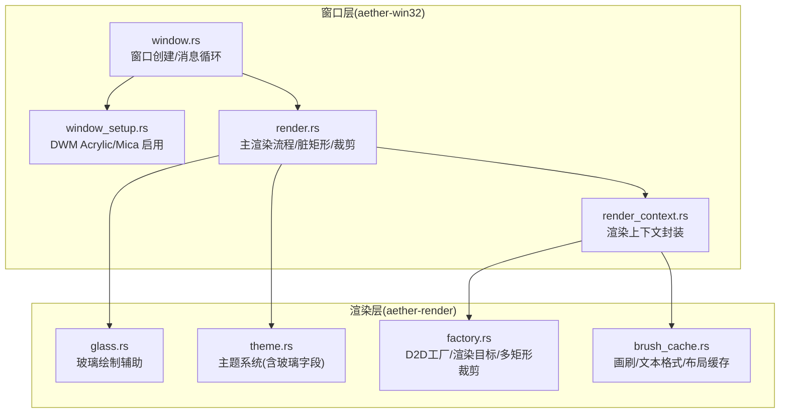
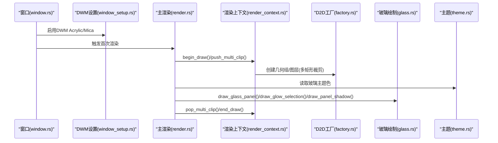
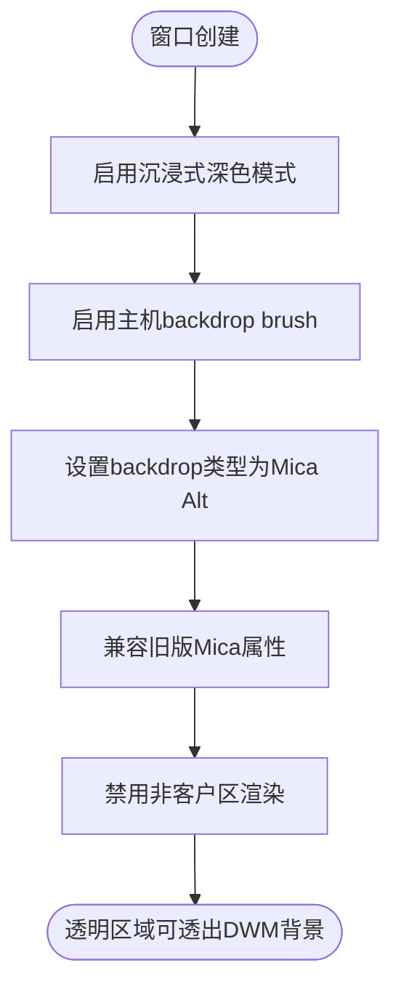
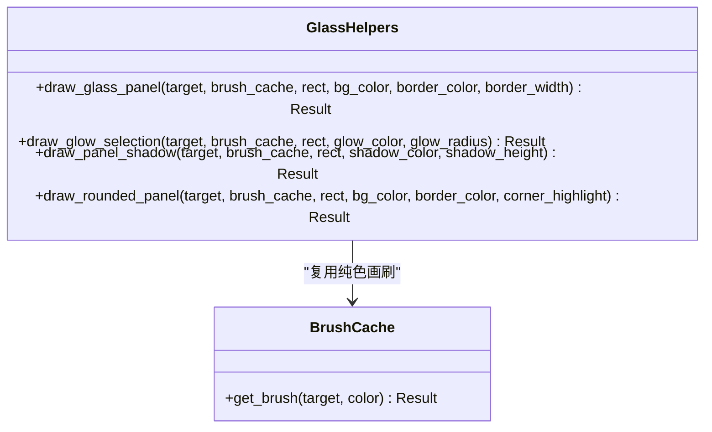
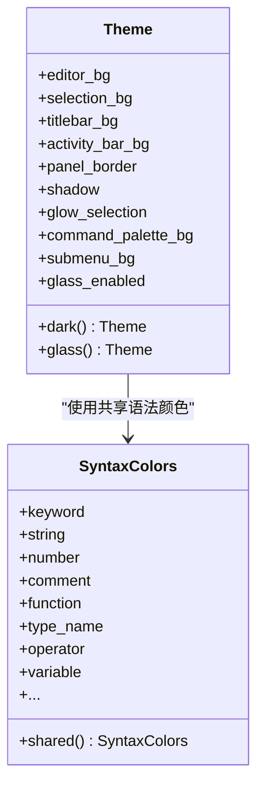
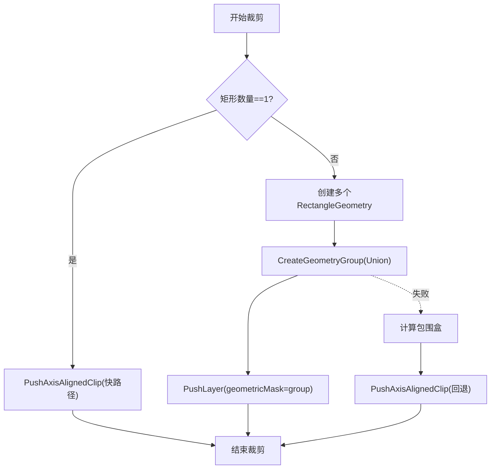
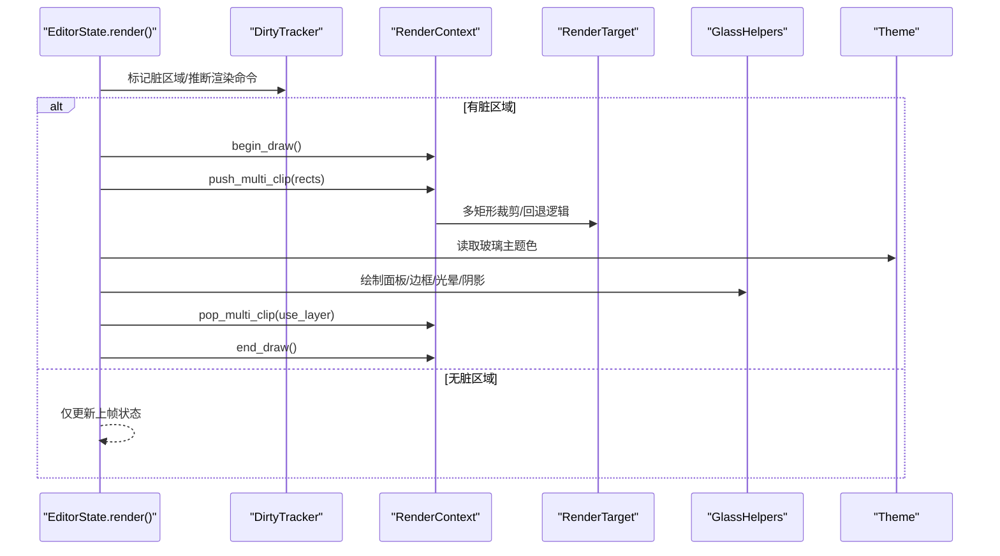
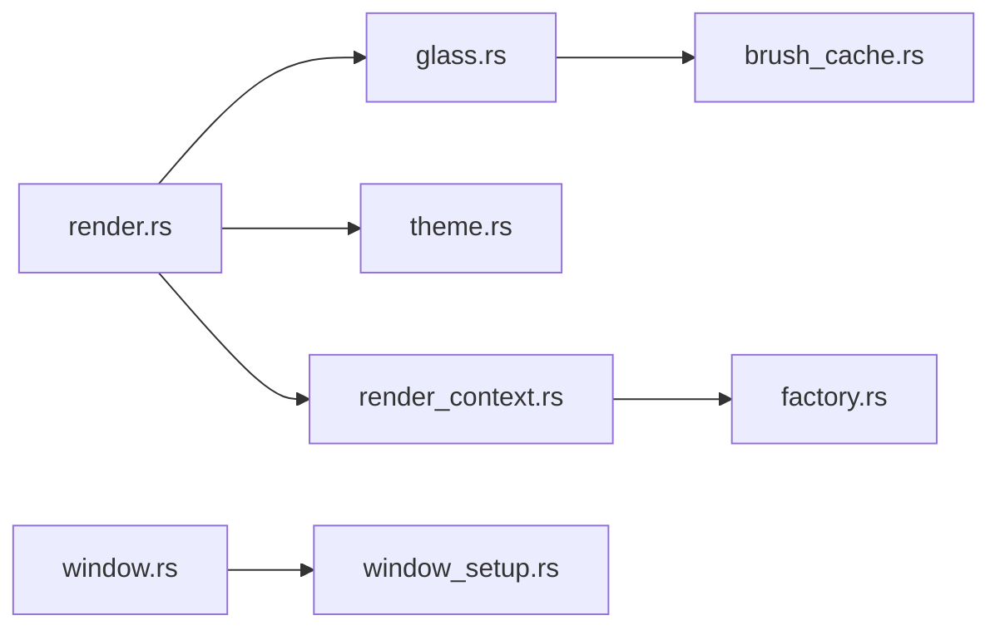

# 玻璃效果系统

<cite>
**本文引用的文件**   
- [crates/aether-render/src/d2d/glass.rs](file://crates/aether-render/src/d2d/glass.rs)
- [crates/aether-render/src/theme.rs](file://crates/aether-render/src/theme.rs)
- [crates/aether-render/src/d2d/factory.rs](file://crates/aether-render/src/d2d/factory.rs)
- [crates/aether-render/src/d2d/brush_cache.rs](file://crates/aether-render/src/d2d/brush_cache.rs)
- [crates/aether-win32/src/render_context.rs](file://crates/aether-win32/src/render_context.rs)
- [crates/aether-win32/src/render.rs](file://crates/aether-win32/src/render.rs)
- [crates/aether-win32/src/window/window_setup.rs](file://crates/aether-win32/src/window/window_setup.rs)
- [crates/aether-win32/src/window.rs](file://crates/aether-win32/src/window.rs)
</cite>

## 目录
1. [简介](#简介)
2. [项目结构](#项目结构)
3. [核心组件](#核心组件)
4. [架构总览](#架构总览)
5. [详细组件分析](#详细组件分析)
6. [依赖关系分析](#依赖关系分析)
7. [性能考量](#性能考量)
8. [故障排查指南](#故障排查指南)
9. [结论](#结论)
10. [附录：开发指南与兼容性处理](#附录开发指南与兼容性处理)

## 简介
本技术文档聚焦于“玻璃效果系统”的实现与使用，覆盖以下方面：
- Windows DWM 透明区域设置与背景模糊（Acrylic/Mica）的启用方式
- 基于 Direct2D 的半透明面板、柔和边框、光晕选择与阴影等高级视觉效果
- 透明度渐变、边框光晕与阴影效果的实现思路
- 性能优化策略：重绘区域裁剪、硬件加速利用与内存管理
- 自定义玻璃效果组件的创建方法、主题系统集成与动态切换
- 开发者视觉增强功能指南与兼容性处理方案

## 项目结构
本项目采用多 Crate 模块化组织。与玻璃效果直接相关的模块主要分布在渲染层与窗口层：
- aether-render：Direct2D/DirectWrite 渲染抽象、主题系统与画刷/文本格式缓存
- aether-win32：Windows 原生 UI 层，包含窗口创建、DWM 属性设置、渲染上下文与主渲染循环

图表来源
- [crates/aether-render/src/d2d/glass.rs:1-161](file://crates/aether-render/src/d2d/glass.rs#L1-L161)
- [crates/aether-render/src/theme.rs:1-210](file://crates/aether-render/src/theme.rs#L1-L210)
- [crates/aether-render/src/d2d/factory.rs:164-271](file://crates/aether-render/src/d2d/factory.rs#L164-L271)
- [crates/aether-render/src/d2d/brush_cache.rs:1-106](file://crates/aether-render/src/d2d/brush_cache.rs#L1-L106)
- [crates/aether-win32/src/window/window_setup.rs:32-86](file://crates/aether-win32/src/window/window_setup.rs#L32-L86)
- [crates/aether-win32/src/render_context.rs:102-155](file://crates/aether-win32/src/render_context.rs#L102-L155)
- [crates/aether-win32/src/render.rs:394-410](file://crates/aether-win32/src/render.rs#L394-L410)
- [crates/aether-win32/src/window.rs:233-234](file://crates/aether-win32/src/window.rs#L233-L234)

章节来源
- [crates/aether-render/src/d2d/glass.rs:1-161](file://crates/aether-render/src/d2d/glass.rs#L1-L161)
- [crates/aether-render/src/theme.rs:1-210](file://crates/aether-render/src/theme.rs#L1-L210)
- [crates/aether-render/src/d2d/factory.rs:164-271](file://crates/aether-render/src/d2d/factory.rs#L164-L271)
- [crates/aether-render/src/d2d/brush_cache.rs:1-106](file://crates/aether-render/src/d2d/brush_cache.rs#L1-L106)
- [crates/aether-win32/src/window/window_setup.rs:32-86](file://crates/aether-win32/src/window/window_setup.rs#L32-L86)
- [crates/aether-win32/src/render_context.rs:102-155](file://crates/aether-win32/src/render_context.rs#L102-L155)
- [crates/aether-win32/src/render.rs:394-410](file://crates/aether-win32/src/render.rs#L394-L410)
- [crates/aether-win32/src/window.rs:233-234](file://crates/aether-win32/src/window.rs#L233-L234)

## 核心组件
- 玻璃绘制辅助（glass.rs）
  - 提供半透明面板填充、四边软边框、光晕选择、面板阴影、圆角高光模拟等函数，统一通过 BrushCache 获取纯色画刷，减少 COM 对象分配。
- 主题系统（theme.rs）
  - 在 Theme 中新增玻璃相关颜色字段（标题栏、活动栏、面板边框、阴影、选择光晕、命令面板/子菜单背景），并提供 glass() 构造器以启用玻璃模式。
- 渲染目标与多矩形裁剪（factory.rs）
  - 提供硬件加速渲染目标、单矩形轴对齐裁剪与多矩形并集裁剪（PushLayer + GeometryGroup Union）。
- 资源缓存（brush_cache.rs）
  - 预存常用画刷与文本格式，超出上限时回退清空，避免无界增长；支持设备丢失后清理重建。
- 渲染上下文（render_context.rs）
  - 封装 D2D 渲染目标、画刷/文本格式/布局缓存，提供 push_multi_clip/pop_multi_clip 接口，并在失败时回退到包围盒裁剪。
- 主渲染流程（render.rs）
  - 脏矩形推断与裁剪、全窗口清除、欢迎页/编辑器/面板分层绘制、弹出裁剪区域、设备丢失恢复。
- DWM 背景模糊（window_setup.rs）
  - 启用沉浸式深色模式、主机 backdrop brush、Mica Alt 类型、兼容旧 Mica 属性，禁用非客户区渲染以允许透明区域透出。

章节来源
- [crates/aether-render/src/d2d/glass.rs:12-154](file://crates/aether-render/src/d2d/glass.rs#L12-L154)
- [crates/aether-render/src/theme.rs:8-210](file://crates/aether-render/src/theme.rs#L8-L210)
- [crates/aether-render/src/d2d/factory.rs:164-271](file://crates/aether-render/src/d2d/factory.rs#L164-L271)
- [crates/aether-render/src/d2d/brush_cache.rs:1-106](file://crates/aether-render/src/d2d/brush_cache.rs#L1-L106)
- [crates/aether-win32/src/render_context.rs:102-155](file://crates/aether-win32/src/render_context.rs#L102-L155)
- [crates/aether-win32/src/render.rs:394-410](file://crates/aether-win32/src/render.rs#L394-L410)
- [crates/aether-win32/src/window/window_setup.rs:32-86](file://crates/aether-win32/src/window/window_setup.rs#L32-L86)

## 架构总览
下图展示从窗口创建到玻璃效果渲染的关键路径：窗口创建时启用 DWM 背景模糊，随后进入渲染循环，根据脏矩形进行局部裁剪，调用玻璃绘制辅助完成面板、边框、光晕与阴影绘制。

图表来源
- [crates/aether-win32/src/window.rs:233-234](file://crates/aether-win32/src/window.rs#L233-L234)
- [crates/aether-win32/src/window/window_setup.rs:32-86](file://crates/aether-win32/src/window/window_setup.rs#L32-L86)
- [crates/aether-win32/src/render.rs:394-410](file://crates/aether-win32/src/render.rs#L394-L410)
- [crates/aether-win32/src/render_context.rs:102-155](file://crates/aether-win32/src/render_context.rs#L102-L155)
- [crates/aether-render/src/d2d/factory.rs:164-271](file://crates/aether-render/src/d2d/factory.rs#L164-L271)
- [crates/aether-render/src/d2d/glass.rs:12-154](file://crates/aether-render/src/d2d/glass.rs#L12-L154)
- [crates/aether-render/src/theme.rs:176-210](file://crates/aether-render/src/theme.rs#L176-L210)

## 详细组件分析

### DWM 透明区域与背景模糊（Acrylic/Mica）
- 启用沉浸式深色模式
- 启用主机 backdrop brush（Acrylic/Mica）
- 设置系统 backdrop 类型为 Mica Alt，使标题栏与客户区均可透出
- 兼容旧版 Mica 属性
- 禁用非客户区渲染，确保透明 clear 区域能透出 DWM 背景

图表来源
- [crates/aether-win32/src/window/window_setup.rs:32-86](file://crates/aether-win32/src/window/window_setup.rs#L32-L86)

章节来源
- [crates/aether-win32/src/window/window_setup.rs:32-86](file://crates/aether-win32/src/window/window_setup.rs#L32-L86)

### 玻璃绘制辅助（glass.rs）
- draw_glass_panel：填充半透明背景，可选四边软边框
- draw_glow_selection：外层低透明度+内层高透明度叠加，模拟光晕选择
- draw_panel_shadow：在面板底部绘制渐变阴影条带
- draw_rounded_panel：顶部细边框+角落高光，模拟圆角面板

图表来源
- [crates/aether-render/src/d2d/glass.rs:12-154](file://crates/aether-render/src/d2d/glass.rs#L12-L154)
- [crates/aether-render/src/d2d/brush_cache.rs:68-99](file://crates/aether-render/src/d2d/brush_cache.rs#L68-L99)

章节来源
- [crates/aether-render/src/d2d/glass.rs:12-154](file://crates/aether-render/src/d2d/glass.rs#L12-L154)

### 主题系统与玻璃字段（theme.rs）
- Theme 新增玻璃相关字段：titlebar_bg、activity_bar_bg、panel_border、shadow、glow_selection、command_palette_bg、submenu_bg、glass_enabled
- dark() 与 glass() 两种构造：glass() 将关键元素设置为半透明，提升通透感
- SyntaxColors::shared() 共享语法高亮颜色，消除重复代码

图表来源
- [crates/aether-render/src/theme.rs:8-210](file://crates/aether-render/src/theme.rs#L8-L210)

章节来源
- [crates/aether-render/src/theme.rs:8-210](file://crates/aether-render/src/theme.rs#L8-L210)

### 多矩形裁剪与硬件加速（factory.rs / render_context.rs）
- 单矩形快路径：PushAxisAlignedClip
- 多矩形并集：CreateRectangleGeometry → CreateGeometryGroup(D2D1_FILL_MODE_ALTERNATE) → PushLayer(geometricMask=group)
- 失败回退：计算所有矩形的包围盒，回退为单一轴对齐裁剪
- 硬件加速：渲染目标类型设为硬件，DPI 感知与缩放正确传递

图表来源
- [crates/aether-render/src/d2d/factory.rs:164-271](file://crates/aether-render/src/d2d/factory.rs#L164-L271)
- [crates/aether-win32/src/render_context.rs:102-155](file://crates/aether-win32/src/render_context.rs#L102-L155)

章节来源
- [crates/aether-render/src/d2d/factory.rs:164-271](file://crates/aether-render/src/d2d/factory.rs#L164-L271)
- [crates/aether-win32/src/render_context.rs:102-155](file://crates/aether-win32/src/render_context.rs#L102-L155)

### 主渲染流程中的玻璃效果集成（render.rs）
- 每帧开始：清理命中区域、轮询后台任务、更新脏矩形
- 初始化渲染目标与常用画刷/文本格式
- 脏矩形推断与多矩形裁剪
- 全窗口清除或局部背景填充（欢迎页特殊处理）
- 分层绘制：标题栏→菜单栏→活动栏→侧边栏→标签栏→编辑器/欢迎页→右侧面板→底部面板→状态栏→子菜单→命令面板→对话框→用户菜单→上下文菜单
- 结束绘制：弹出裁剪、处理设备丢失、更新上一帧状态

图表来源
- [crates/aether-win32/src/render.rs:394-410](file://crates/aether-win32/src/render.rs#L394-L410)
- [crates/aether-win32/src/render.rs:412-474](file://crates/aether-win32/src/render.rs#L412-L474)
- [crates/aether-win32/src/render.rs:482-698](file://crates/aether-win32/src/render.rs#L482-L698)
- [crates/aether-win32/src/render.rs:698-746](file://crates/aether-win32/src/render.rs#L698-L746)
- [crates/aether-render/src/d2d/glass.rs:12-154](file://crates/aether-render/src/d2d/glass.rs#L12-L154)
- [crates/aether-render/src/theme.rs:176-210](file://crates/aether-render/src/theme.rs#L176-L210)

章节来源
- [crates/aether-win32/src/render.rs:394-410](file://crates/aether-win32/src/render.rs#L394-L410)
- [crates/aether-win32/src/render.rs:412-474](file://crates/aether-win32/src/render.rs#L412-L474)
- [crates/aether-win32/src/render.rs:482-698](file://crates/aether-win32/src/render.rs#L482-L698)
- [crates/aether-win32/src/render.rs:698-746](file://crates/aether-win32/src/render.rs#L698-L746)

## 依赖关系分析
- 玻璃绘制辅助依赖 BrushCache 获取纯色画刷，降低 COM 对象创建开销
- 渲染上下文封装了 D2D 工厂与渲染目标，向上暴露裁剪与绘制接口
- 主渲染流程依赖主题系统提供的玻璃颜色字段，驱动各面板的半透明渲染
- 窗口层在创建时启用 DWM 背景模糊，使透明 clear 区域透出系统背景

图表来源
- [crates/aether-render/src/d2d/glass.rs:12-154](file://crates/aether-render/src/d2d/glass.rs#L12-L154)
- [crates/aether-render/src/d2d/brush_cache.rs:68-99](file://crates/aether-render/src/d2d/brush_cache.rs#L68-L99)
- [crates/aether-win32/src/render.rs:394-410](file://crates/aether-win32/src/render.rs#L394-L410)
- [crates/aether-render/src/theme.rs:176-210](file://crates/aether-render/src/theme.rs#L176-L210)
- [crates/aether-win32/src/render_context.rs:102-155](file://crates/aether-win32/src/render_context.rs#L102-L155)
- [crates/aether-render/src/d2d/factory.rs:164-271](file://crates/aether-render/src/d2d/factory.rs#L164-L271)
- [crates/aether-win32/src/window.rs:233-234](file://crates/aether-win32/src/window.rs#L233-L234)
- [crates/aether-win32/src/window/window_setup.rs:32-86](file://crates/aether-win32/src/window/window_setup.rs#L32-L86)

章节来源
- [crates/aether-render/src/d2d/glass.rs:12-154](file://crates/aether-render/src/d2d/glass.rs#L12-L154)
- [crates/aether-render/src/d2d/brush_cache.rs:68-99](file://crates/aether-render/src/d2d/brush_cache.rs#L68-L99)
- [crates/aether-win32/src/render.rs:394-410](file://crates/aether-win32/src/render.rs#L394-L410)
- [crates/aether-render/src/theme.rs:176-210](file://crates/aether-render/src/theme.rs#L176-L210)
- [crates/aether-win32/src/render_context.rs:102-155](file://crates/aether-win32/src/render_context.rs#L102-L155)
- [crates/aether-render/src/d2d/factory.rs:164-271](file://crates/aether-render/src/d2d/factory.rs#L164-L271)
- [crates/aether-win32/src/window.rs:233-234](file://crates/aether-win32/src/window.rs#L233-L234)
- [crates/aether-win32/src/window/window_setup.rs:32-86](file://crates/aether-win32/src/window/window_setup.rs#L32-L86)

## 性能考量
- 重绘区域裁剪
  - 使用 DirtyTracker 推断最小变化区域，结合多矩形并集裁剪，避免合并为单一包围盒导致的过度重绘
  - 单矩形走快路径，多矩形走 Layer+GeometryGroup 路径，失败回退到包围盒裁剪
- 硬件加速利用
  - 渲染目标类型设为硬件，DPI 感知与缩放正确传递，减少 CPU 负担
- 内存管理与缓存
  - 画刷与文本格式预存常用项，未命中时回退 HashMap，超过最大条目数时清空重建，避免无界增长
  - TextLayout 缓存高频文本布局，字体大小变化时自动清空
  - 设备丢失时统一清理并重建资源

章节来源
- [crates/aether-win32/src/render.rs:394-410](file://crates/aether-win32/src/render.rs#L394-L410)
- [crates/aether-render/src/d2d/factory.rs:164-271](file://crates/aether-render/src/d2d/factory.rs#L164-L271)
- [crates/aether-render/src/d2d/brush_cache.rs:1-106](file://crates/aether-render/src/d2d/brush_cache.rs#L1-L106)
- [crates/aether-render/src/d2d/brush_cache.rs:376-477](file://crates/aether-render/src/d2d/brush_cache.rs#L376-L477)
- [crates/aether-win32/src/render_context.rs:219-225](file://crates/aether-win32/src/render_context.rs#L219-L225)

## 故障排查指南
- 设备丢失（D2DERR_RECREATE_TARGET）
  - 现象：EndDraw 返回特定错误码
  - 处理：清理图标缓存、重建渲染目标、重新初始化常用画刷与文本格式
- 透明区域显示黑色空洞
  - 原因：欢迎页状态下局部裁剪导致某些面板未被覆盖
  - 处理：手动填充活动栏/侧边栏/右侧面板/底部面板的背景色
- 多矩形裁剪失败
  - 现象：GeometryGroup/Layer 创建失败
  - 处理：回退为包围盒裁剪，保证渲染不中断

章节来源
- [crates/aether-win32/src/render.rs:704-746](file://crates/aether-win32/src/render.rs#L704-L746)
- [crates/aether-win32/src/render.rs:412-474](file://crates/aether-win32/src/render.rs#L412-L474)
- [crates/aether-win32/src/render_context.rs:122-148](file://crates/aether-win32/src/render_context.rs#L122-L148)

## 结论
玻璃效果系统通过 DWM 背景模糊与 Direct2D 半透明绘制相结合，实现了现代编辑器的通透视觉体验。借助多矩形裁剪、硬件加速与完善的缓存机制，系统在保持高性能的同时提供了丰富的视觉效果。主题系统的玻璃字段与绘制辅助函数使得自定义玻璃组件易于扩展，且具备良好兼容性。

## 附录：开发指南与兼容性处理

### 如何创建自定义玻璃效果组件
- 步骤概览
  - 准备主题颜色：在 Theme.glass() 中配置 panel_border、shadow、glow_selection 等字段
  - 在渲染流程中按层级绘制：先绘制背景，再绘制边框与阴影，最后叠加光晕
  - 使用 BrushCache 获取纯色画刷，避免频繁创建 COM 对象
  - 使用多矩形裁剪减少重绘面积
- 参考路径
  - 主题字段定义与 glass() 构造：[crates/aether-render/src/theme.rs:176-210](file://crates/aether-render/src/theme.rs#L176-L210)
  - 玻璃绘制辅助函数：[crates/aether-render/src/d2d/glass.rs:12-154](file://crates/aether-render/src/d2d/glass.rs#L12-L154)
  - 多矩形裁剪入口：[crates/aether-win32/src/render_context.rs:102-155](file://crates/aether-win32/src/render_context.rs#L102-L155)

### 与主题系统的集成与动态切换
- 默认主题即为 glass()，可通过 Theme.dark() 切换为不透明主题
- 运行时切换主题需重建渲染目标与常用资源（画刷/文本格式）
- 参考路径
  - 主题默认值与测试用例：[crates/aether-render/src/theme.rs:279-313](file://crates/aether-render/src/theme.rs#L279-L313)
  - 设备丢失后重建资源：[crates/aether-win32/src/render.rs:704-746](file://crates/aether-win32/src/render.rs#L704-L746)

### 兼容性处理方案
- Windows 11 22H2+ 优先使用 Mica Alt，旧版本回退到兼容属性
- 非客户区渲染禁用以确保透明区域透出
- 多矩形裁剪失败时回退为包围盒裁剪
- 参考路径
  - DWM 设置与回退：[crates/aether-win32/src/window/window_setup.rs:32-86](file://crates/aether-win32/src/window/window_setup.rs#L32-L86)
  - 裁剪回退逻辑：[crates/aether-win32/src/render_context.rs:122-148](file://crates/aether-win32/src/render_context.rs#L122-L148)