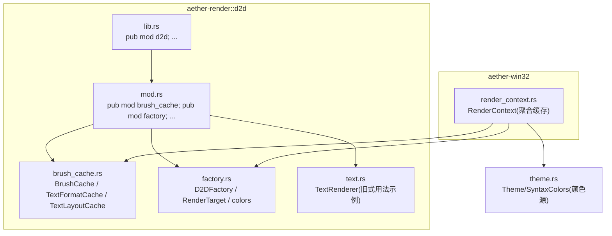
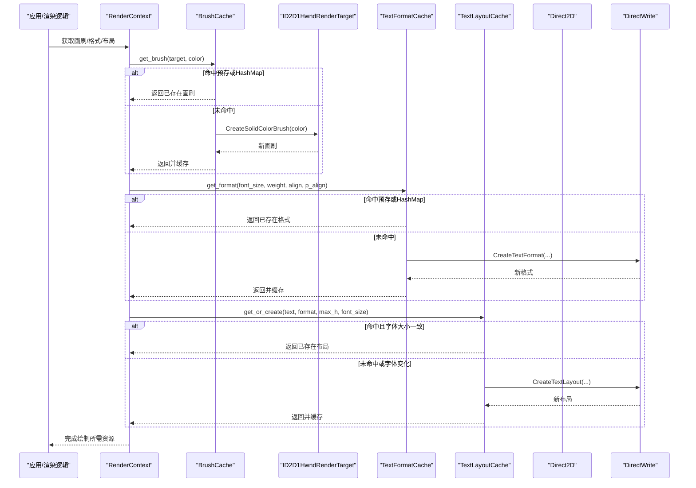
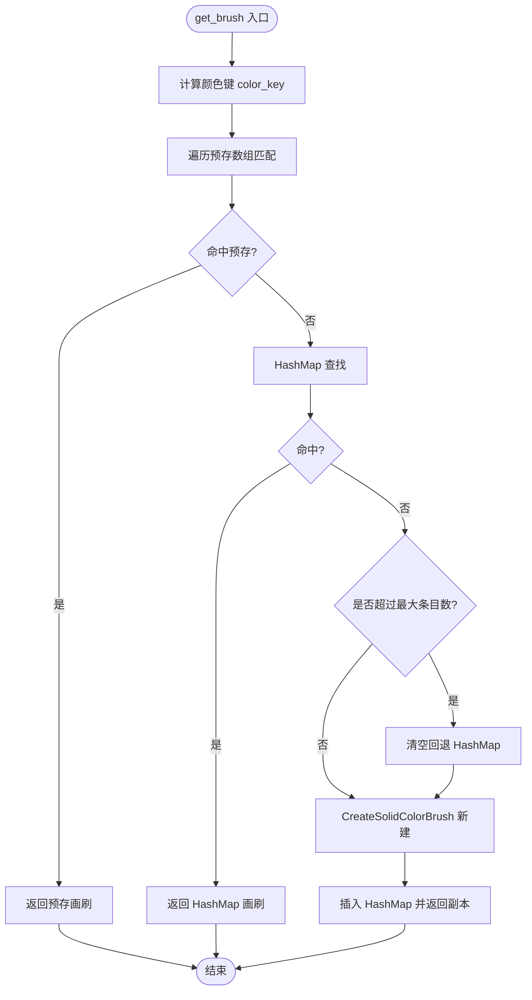
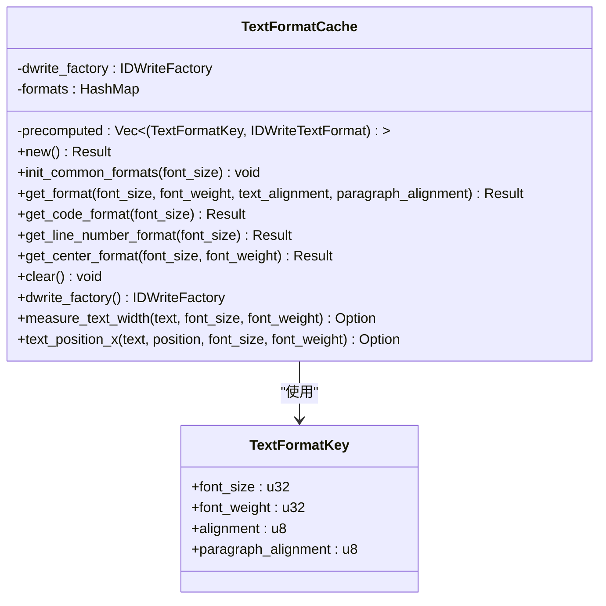
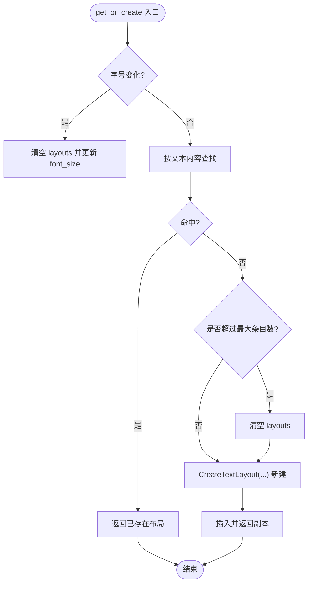
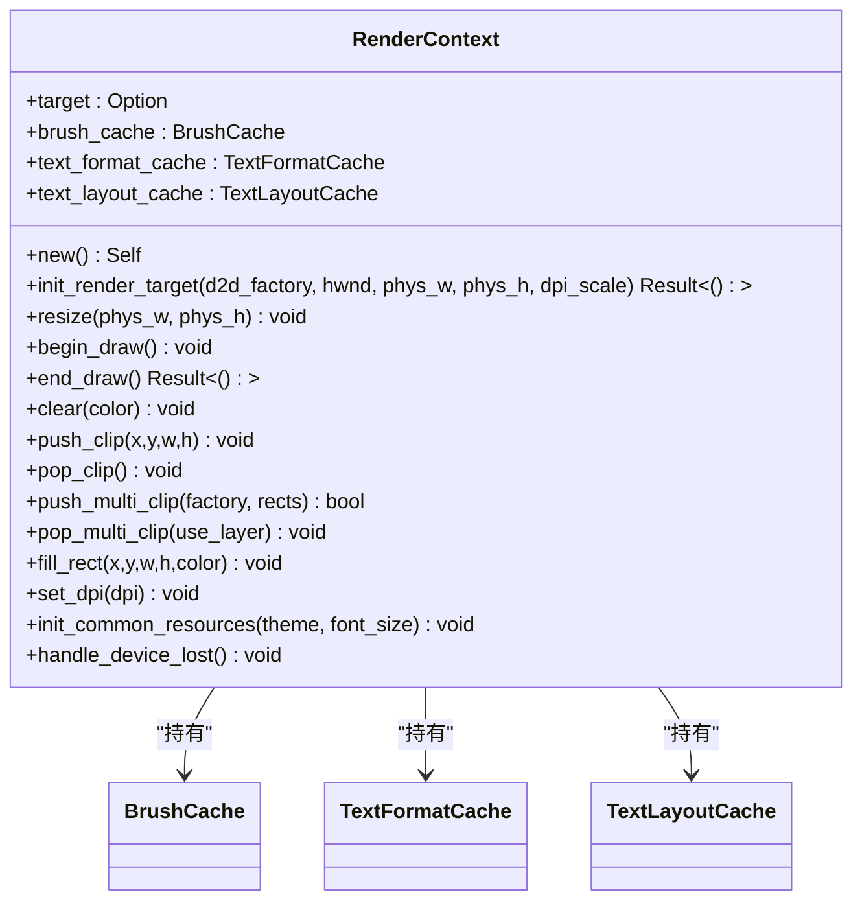
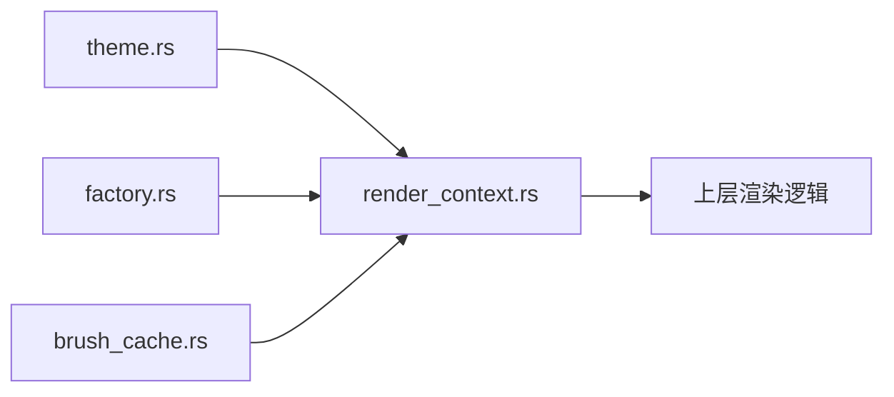

# 画刷缓存系统

<cite>
**本文引用的文件**   
- [brush_cache.rs](file://crates/aether-render/src/d2d/brush_cache.rs)
- [factory.rs](file://crates/aether-render/src/d2d/factory.rs)
- [text.rs](file://crates/aether-render/src/d2d/text.rs)
- [mod.rs](file://crates/aether-render/src/d2d/mod.rs)
- [lib.rs](file://crates/aether-render/src/lib.rs)
- [render_context.rs](file://crates/aether-win32/src/render_context.rs)
- [theme.rs](file://crates/aether-render/src/theme.rs)
</cite>

## 目录
1. [简介](#简介)
2. [项目结构](#项目结构)
3. [核心组件](#核心组件)
4. [架构总览](#架构总览)
5. [详细组件分析](#详细组件分析)
6. [依赖关系分析](#依赖关系分析)
7. [性能考量](#性能考量)
8. [故障排查指南](#故障排查指南)
9. [结论](#结论)
10. [附录](#附录)

## 简介
本技术文档聚焦于画刷缓存系统，围绕颜色画刷、文本格式与文本布局的缓存策略展开。系统通过“预存常用项 + 回退哈希表”的双层缓存设计，显著降低 Direct2D/DirectWrite COM 对象创建开销；同时提供容量上限与设备丢失时的清理机制，保障内存稳定与渲染正确性。文档还给出高效使用示例路径、内存监控与调优建议，以及最佳实践与常见问题解决方案。

## 项目结构
该缓存系统位于 aether-render 库的 d2d 子模块中，并通过 aether-win32 的渲染上下文对外暴露。关键组织方式如下：
- d2d/brush_cache.rs：实现颜色画刷缓存 BrushCache、文本格式缓存 TextFormatCache、文本布局缓存 TextLayoutCache。
- d2d/factory.rs：Direct2D 工厂与渲染目标封装，并提供主题色常量。
- d2d/text.rs：文本渲染器（用于演示旧式每 token 创建画刷/布局的方式，便于对比优化）。
- d2d/mod.rs：导出 d2d 子模块。
- render_context.rs：将 BrushCache、TextFormatCache、TextLayoutCache 统一纳入 RenderContext，提供初始化与设备丢失处理。
- theme.rs：主题定义与语法高亮颜色集合，供预初始化常用画刷使用。

图表来源
- [mod.rs:1-5](file://crates/aether-render/src/d2d/mod.rs#L1-L5)
- [lib.rs:1-4](file://crates/aether-render/src/lib.rs#L1-L4)
- [brush_cache.rs:1-107](file://crates/aether-render/src/d2d/brush_cache.rs#L1-L107)
- [factory.rs:1-63](file://crates/aether-render/src/d2d/factory.rs#L1-L63)
- [text.rs:1-57](file://crates/aether-render/src/d2d/text.rs#L1-L57)
- [render_context.rs:1-31](file://crates/aether-win32/src/render_context.rs#L1-L31)
- [theme.rs:1-31](file://crates/aether-render/src/theme.rs#L1-L31)

章节来源
- [mod.rs:1-5](file://crates/aether-render/src/d2d/mod.rs#L1-L5)
- [lib.rs:1-4](file://crates/aether-render/src/lib.rs#L1-L4)
- [brush_cache.rs:1-107](file://crates/aether-render/src/d2d/brush_cache.rs#L1-L107)
- [factory.rs:1-63](file://crates/aether-render/src/d2d/factory.rs#L1-L63)
- [text.rs:1-57](file://crates/aether-render/src/d2d/text.rs#L1-L57)
- [render_context.rs:1-31](file://crates/aether-win32/src/render_context.rs#L1-L31)
- [theme.rs:1-31](file://crates/aether-render/src/theme.rs#L1-L31)

## 核心组件
- BrushCache：颜色画刷缓存，采用“预存数组 + HashMap 回退”，避免频繁创建 ID2D1SolidColorBrush。
- TextFormatCache：文本格式缓存，预置常见对齐/权重组合，减少 IDWriteTextFormat 创建。
- TextLayoutCache：文本布局缓存，复用 IDWriteTextLayout，避免重复布局计算与 COM 分配。
- RenderContext：聚合上述缓存，提供统一的初始化、清理与绘制入口。

章节来源
- [brush_cache.rs:25-106](file://crates/aether-render/src/d2d/brush_cache.rs#L25-L106)
- [brush_cache.rs:108-314](file://crates/aether-render/src/d2d/brush_cache.rs#L108-L314)
- [brush_cache.rs:376-477](file://crates/aether-render/src/d2d/brush_cache.rs#L376-L477)
- [render_context.rs:10-31](file://crates/aether-win32/src/render_context.rs#L10-L31)

## 架构总览
下图展示从应用侧到 Direct2D/DirectWrite 的调用链与缓存命中路径。

图表来源
- [render_context.rs:158-180](file://crates/aether-win32/src/render_context.rs#L158-L180)
- [brush_cache.rs:68-99](file://crates/aether-render/src/d2d/brush_cache.rs#L68-L99)
- [brush_cache.rs:229-269](file://crates/aether-render/src/d2d/brush_cache.rs#L229-L269)
- [brush_cache.rs:405-442](file://crates/aether-render/src/d2d/brush_cache.rs#L405-L442)

## 详细组件分析

### BrushCache：颜色画刷缓存
- 数据结构
  - precomputed：小容量 Vec<(u32, ID2D1SolidColorBrush)>，线性扫描，适合高频命中场景。
  - brushes：HashMap<u32, ID2D1SolidColorBrush>，容纳不常用颜色。
- 键生成
  - color_key：将 RGBA 浮点分量四舍五入后打包为 u32，避免浮点精度导致的键不一致。
- 查找顺序
  - 预存数组 → HashMap → 新建并插入 HashMap。
- 失效与容量控制
  - MAX_BRUSH_CACHE_ENTRIES：当 HashMap 条目数达到上限时清空整个回退缓存，作为简单 LRU 替代方案，防止无界增长。
  - clear：设备丢失时清空所有缓存。
- 复杂度
  - 预存数组：O(k)，k 通常 ≤ 16。
  - HashMap：平均 O(1)。
- 错误处理
  - 新建画刷失败时向上抛出 Result 错误，调用方需处理。

图表来源
- [brush_cache.rs:68-99](file://crates/aether-render/src/d2d/brush_cache.rs#L68-L99)
- [brush_cache.rs:479-487](file://crates/aether-render/src/d2d/brush_cache.rs#L479-L487)

章节来源
- [brush_cache.rs:25-106](file://crates/aether-render/src/d2d/brush_cache.rs#L25-L106)
- [brush_cache.rs:479-487](file://crates/aether-render/src/d2d/brush_cache.rs#L479-L487)

### TextFormatCache：文本格式缓存
- 数据结构
  - precomputed：预置 code/line_number/center 等常用格式。
  - formats：HashMap<TextFormatKey, IDWriteTextFormat>。
- 键生成
  - TextFormatKey：包含缩放后的整数字号、字重、文本对齐、段落对齐，避免浮点误差。
- 查找顺序
  - 预存数组 → HashMap → 新建并插入 HashMap。
- 失效与容量控制
  - MAX_TEXT_FORMAT_CACHE_ENTRIES：达到上限时清空回退缓存。
  - clear：设备丢失或需要重建时清空。
- 辅助方法
  - get_code_format/get_line_number_format/get_center_format：便捷接口。
  - measure_text_width/text_position_x：基于临时 TextLayout 进行测量与光标定位。

图表来源
- [brush_cache.rs:108-314](file://crates/aether-render/src/d2d/brush_cache.rs#L108-L314)

章节来源
- [brush_cache.rs:108-314](file://crates/aether-render/src/d2d/brush_cache.rs#L108-L314)

### TextLayoutCache：文本布局缓存
- 数据结构
  - layouts：HashMap<String, IDWriteTextLayout>，按文本内容复用布局。
  - font_size：记录当前缓存对应的字号，变化时自动清空。
- 失效与容量控制
  - 字号变化阈值 > 0.01 时清空缓存。
  - MAX_TEXT_LAYOUT_CACHE_ENTRIES：达到上限时清空回退缓存。
- 特殊能力
  - create_ellipsis_layout：为单行可变宽度场景创建带省略号的布局，不参与共享缓存。

图表来源
- [brush_cache.rs:405-442](file://crates/aether-render/src/d2d/brush_cache.rs#L405-L442)
- [brush_cache.rs:449-476](file://crates/aether-render/src/d2d/brush_cache.rs#L449-L476)

章节来源
- [brush_cache.rs:376-477](file://crates/aether-render/src/d2d/brush_cache.rs#L376-L477)

### RenderContext：缓存聚合与生命周期管理
- 职责
  - 统一管理 BrushCache、TextFormatCache、TextLayoutCache。
  - 提供 init_common_resources：在渲染目标就绪后预初始化常用画刷与文本格式。
  - handle_device_lost：设备丢失时清空所有资源并重建。
- 典型用法
  - fill_rect：内部通过 brush_cache.get_brush 复用画刷填充矩形。

图表来源
- [render_context.rs:10-31](file://crates/aether-win32/src/render_context.rs#L10-L31)
- [render_context.rs:189-217](file://crates/aether-win32/src/render_context.rs#L189-L217)
- [render_context.rs:219-225](file://crates/aether-win32/src/render_context.rs#L219-L225)

章节来源
- [render_context.rs:10-31](file://crates/aether-win32/src/render_context.rs#L10-L31)
- [render_context.rs:189-217](file://crates/aether-win32/src/render_context.rs#L189-L217)
- [render_context.rs:219-225](file://crates/aether-win32/src/render_context.rs#L219-L225)

## 依赖关系分析
- 外部依赖
  - windows crate：Direct2D/DirectWrite 类型与 API。
- 内部依赖
  - aether-render::d2d::factory：提供 D2D 工厂、渲染目标与主题色常量。
  - aether-render::theme：主题与语法高亮颜色，用于预初始化常用画刷。
  - aether-win32::render_context：将缓存整合进渲染管线。

图表来源
- [render_context.rs:1-31](file://crates/aether-win32/src/render_context.rs#L1-31)
- [theme.rs:1-31](file://crates/aether-render/src/theme.rs#L1-L31)
- [factory.rs:1-63](file://crates/aether-render/src/d2d/factory.rs#L1-L63)
- [brush_cache.rs:1-107](file://crates/aether-render/src/d2d/brush_cache.rs#L1-L107)

章节来源
- [render_context.rs:1-31](file://crates/aether-win32/src/render_context.rs#L1-31)
- [theme.rs:1-31](file://crates/aether-render/src/theme.rs#L1-L31)
- [factory.rs:1-63](file://crates/aether-render/src/d2d/factory.rs#L1-L63)
- [brush_cache.rs:1-107](file://crates/aether-render/src/d2d/brush_cache.rs#L1-L107)

## 性能考量
- 预存加速
  - 预存常用颜色与文本格式，使大多数请求在 O(k) 线性扫描内命中，避免 HashMap 开销。
- 容量上限与批量淘汰
  - 对回退 HashMap 设置最大条目数，超限则整体清空，避免长期增长导致内存膨胀。
- 设备丢失恢复
  - 在设备丢失时统一清空缓存，确保后续重建流程正确。
- 布局复用
  - TextLayoutCache 针对相同文本内容复用布局，显著减少 COM 对象创建与布局计算。
- 对比旧式用法
  - 旧式 TextRenderer 在每 token 处直接创建画刷与布局，缓存化后可大幅降低分配与跨边界调用成本。

[本节为通用性能讨论，无需特定文件引用]

## 故障排查指南
- 症状：设备切换或 DPI 变化后出现渲染异常或崩溃
  - 检查是否在 handle_device_lost 中清空了所有缓存，并在 init_common_resources 中重新预初始化。
- 症状：内存持续增长
  - 确认回退 HashMap 的最大条目限制是否生效；必要时调整 MAX_*_CACHE_ENTRIES。
- 症状：文本位置/宽度测量偏差
  - 注意 TextLayout 创建时不包含 null 终止符，需与测量函数保持一致；字号变化会触发缓存清空。
- 症状：画刷颜色不一致
  - 确认 color_key 使用了 round 以避免浮点精度问题；传入颜色应来自主题常量或标准化构造。

章节来源
- [render_context.rs:219-225](file://crates/aether-win32/src/render_context.rs#L219-L225)
- [brush_cache.rs:479-487](file://crates/aether-render/src/d2d/brush_cache.rs#L479-L487)
- [brush_cache.rs:405-442](file://crates/aether-render/src/d2d/brush_cache.rs#L405-L442)

## 结论
画刷缓存系统通过“预存 + 回退哈希表”的策略，在保证命中率的同时控制了内存占用；配合设备丢失清理与容量上限，实现了稳健的高性能渲染。对于文本相关资源，进一步引入 TextFormatCache 与 TextLayoutCache，形成完整的资源复用体系。遵循本文的最佳实践与调优建议，可显著提升编辑器渲染帧率与稳定性。

[本节为总结性内容，无需特定文件引用]

## 附录

### 高效使用示例（代码片段路径）
- 获取颜色画刷
  - [brush_cache.rs:68-99](file://crates/aether-render/src/d2d/brush_cache.rs#L68-L99)
- 预初始化常用画刷与文本格式
  - [render_context.rs:189-217](file://crates/aether-win32/src/render_context.rs#L189-L217)
- 填充矩形区域（内部复用画刷）
  - [render_context.rs:158-180](file://crates/aether-win32/src/render_context.rs#L158-L180)
- 获取文本格式（便捷接口）
  - [brush_cache.rs:271-303](file://crates/aether-render/src/d2d/brush_cache.rs#L271-L303)
- 获取或创建文本布局
  - [brush_cache.rs:405-442](file://crates/aether-render/src/d2d/brush_cache.rs#L405-L442)
- 旧式用法对比（每 token 创建画刷/布局）
  - [text.rs:138-187](file://crates/aether-render/src/d2d/text.rs#L138-L187)

### 内存占用监控与调优技巧
- 监控指标
  - 观察 BrushCache.brushes.len()、TextFormatCache.formats.len()、TextLayoutCache.layouts.len() 的变化趋势。
- 调优建议
  - 合理设置 MAX_*_CACHE_ENTRIES，平衡命中率与内存占用。
  - 将最常用颜色放入 init_common_brushes 列表，提升预存命中率。
  - 在字号变化时及时清空 TextLayoutCache，避免无效复用。
  - 设备丢失后立即执行 handle_device_lost，随后重建资源。

[本节为通用指导，无需特定文件引用]

### 最佳实践与常见问题
- 最佳实践
  - 始终通过 RenderContext.init_common_resources 预初始化常用资源。
  - 使用主题常量或 color_f 构造颜色，避免浮点误差。
  - 优先使用 TextLayoutCache 复用布局，减少布局计算。
- 常见问题
  - 多矩形裁剪失败时回退到包围盒裁剪，确保 pop_multi_clip 使用正确的弹出方式。
  - 文本测量与布局创建需保持编码与参数一致，避免偏移。

章节来源
- [render_context.rs:107-155](file://crates/aether-win32/src/render_context.rs#L107-L155)
- [brush_cache.rs:405-442](file://crates/aether-render/src/d2d/brush_cache.rs#L405-L442)
- [brush_cache.rs:479-487](file://crates/aether-render/src/d2d/brush_cache.rs#L479-L487)