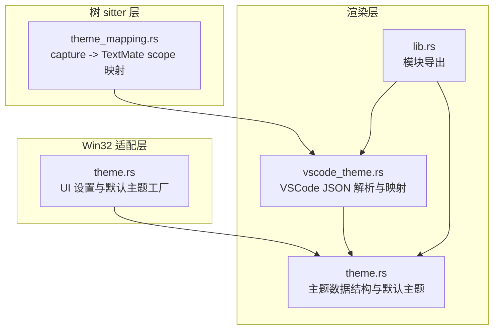
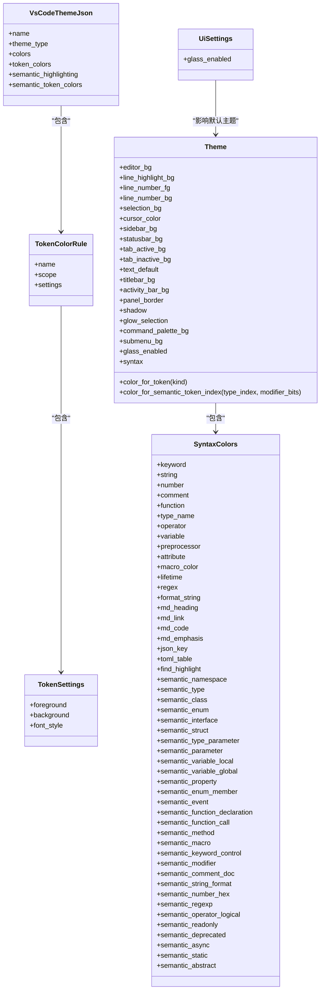
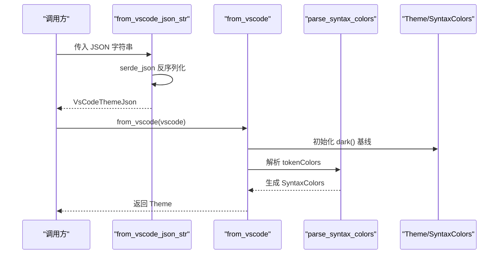
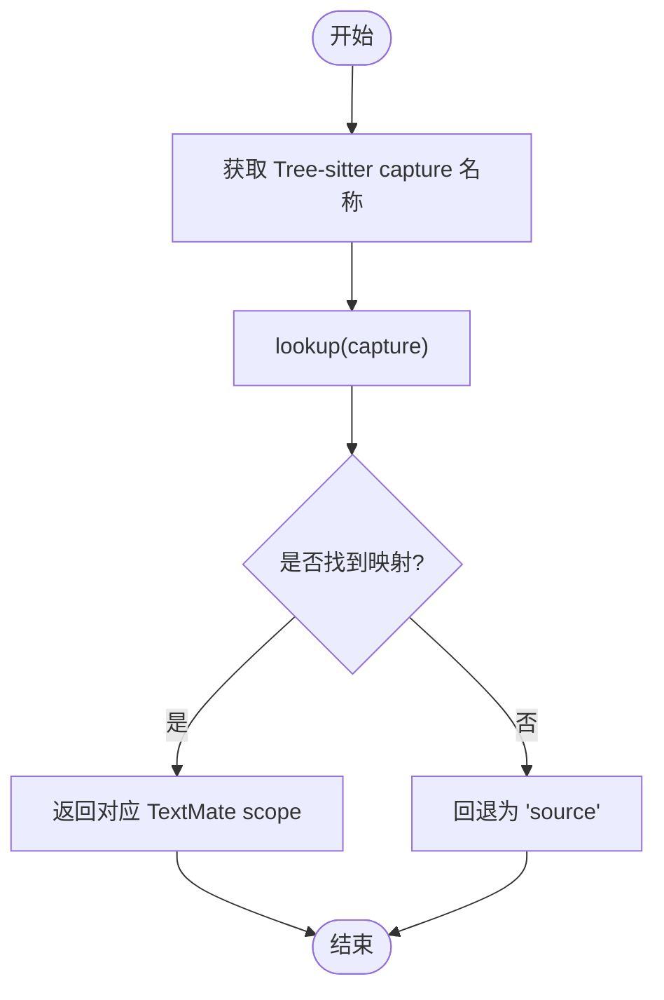
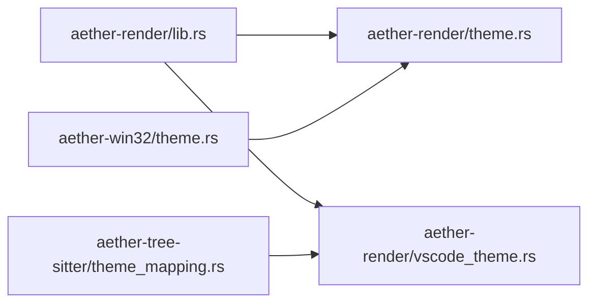

# 主题系统

<cite>
**本文引用的文件**   
- [crates/aether-render/src/theme.rs](file://crates/aether-render/src/theme.rs)
- [crates/aether-render/src/vscode_theme.rs](file://crates/aether-render/src/vscode_theme.rs)
- [crates/aether-tree-sitter/src/theme_mapping.rs](file://crates/aether-tree-sitter/src/theme_mapping.rs)
- [crates/aether-win32/src/theme.rs](file://crates/aether-win32/src/theme.rs)
- [crates/aether-render/src/lib.rs](file://crates/aether-render/src/lib.rs)
</cite>

## 目录
1. [简介](#简介)
2. [项目结构](#项目结构)
3. [核心组件](#核心组件)
4. [架构总览](#架构总览)
5. [详细组件分析](#详细组件分析)
6. [依赖关系分析](#依赖关系分析)
7. [性能考量](#性能考量)
8. [故障排查指南](#故障排查指南)
9. [结论](#结论)
10. [附录](#附录)

## 简介
本技术文档围绕“主题系统”展开，系统性阐述颜色管理、样式继承机制与动态主题切换流程；深入解析 VSCode 主题格式的解析与映射逻辑（含语法高亮颜色转换规则）；说明主题配置的数据结构定义（颜色变量、字体设置与界面元素样式）；并给出主题加载与热重载机制的设计建议与实现要点。同时提供创建自定义主题的示例路径与扩展点说明，为 UI 开发者提供定制指南与最佳实践。

## 项目结构
主题系统主要分布在渲染层与 Win32 适配层：
- aether-render：主题数据模型、VSCode 主题解析、Token/语义令牌到颜色的映射入口
- aether-tree-sitter：Tree-sitter capture 名称到 TextMate scope 的映射表（桥接 Tree-sitter 与 VSCode 主题生态）
- aether-win32：UI 设置与默认主题获取（玻璃/深色）

图表来源
- [crates/aether-render/src/theme.rs:1-485](file://crates/aether-render/src/theme.rs#L1-L485)
- [crates/aether-render/src/vscode_theme.rs:1-620](file://crates/aether-render/src/vscode_theme.rs#L1-L620)
- [crates/aether-tree-sitter/src/theme_mapping.rs:1-524](file://crates/aether-tree-sitter/src/theme_mapping.rs#L1-L524)
- [crates/aether-win32/src/theme.rs:1-26](file://crates/aether-win32/src/theme.rs#L1-L26)
- [crates/aether-render/src/lib.rs:1-4](file://crates/aether-render/src/lib.rs#L1-L4)

章节来源
- [crates/aether-render/src/lib.rs:1-4](file://crates/aether-render/src/lib.rs#L1-L4)

## 核心组件
- 主题数据模型与默认主题
  - Theme：包含编辑器背景、行号、选择区、光标、侧边栏、状态栏、标签页、文本默认色、毛玻璃效果相关字段以及语法高亮颜色集合 SyntaxColors。
  - SyntaxColors：关键字、字符串、数字、注释、函数、类型名、操作符、变量、预处理、属性、宏、生命周期、正则、格式化字符串、Markdown 标题/链接/代码/强调、JSON 键、TOML 表、查找高亮、语义令牌颜色等。
  - 默认主题：glass() 为默认，dark() 为不透明回退；Default 实现返回 glass。
  - Token 与语义令牌颜色查询：color_for_token 与 color_for_semantic_token_index。

- VSCode 主题解析与映射
  - VsCodeThemeJson：name、type、colors、tokenColors、semanticHighlighting、semanticTokenColors。
  - TokenColorRule/TokenScope/TokenSettings：支持单/多 scope 与前景/背景/字体样式。
  - from_vscode_json/from_vscode_json_str/from_vscode：从文件或字符串解析并构建 Theme。
  - parse_syntax_colors：将 tokenColors 中的 TextMate scope 映射到 SyntaxColors。
  - parse_hex_color：支持 #RGB/#RRGGBB/#RRGGBBAA 格式。

- Tree-sitter 到 TextMate scope 映射
  - capture_to_textmate_scope：将 Tree-sitter capture 名称映射为 TextMate scope。
  - build_theme_mapping：构建完整映射表，供高亮管线使用。

- Win32 适配
  - UiSettings：玻璃效果开关。
  - glass_theme/dark_theme：便捷获取默认主题实例。

章节来源
- [crates/aether-render/src/theme.rs:1-485](file://crates/aether-render/src/theme.rs#L1-L485)
- [crates/aether-render/src/vscode_theme.rs:1-620](file://crates/aether-render/src/vscode_theme.rs#L1-L620)
- [crates/aether-tree-sitter/src/theme_mapping.rs:1-524](file://crates/aether-tree-sitter/src/theme_mapping.rs#L1-L524)
- [crates/aether-win32/src/theme.rs:1-26](file://crates/aether-win32/src/theme.rs#L1-L26)

## 架构总览
主题系统采用“数据模型 + 解析器 + 映射桥接”的分层设计：
- 数据模型层（Theme/SyntaxColors）：承载所有 UI 与语法高亮颜色。
- 解析层（VSCode 主题 JSON）：将外部主题转换为内部模型。
- 映射桥接层（Tree-sitter -> TextMate）：确保 Tree-sitter 捕获结果能被 VSCode 主题规则匹配。
- 适配层（Win32）：暴露默认主题与 UI 设置。

图表来源
- [crates/aether-render/src/theme.rs:1-485](file://crates/aether-render/src/theme.rs#L1-L485)
- [crates/aether-render/src/vscode_theme.rs:1-620](file://crates/aether-render/src/vscode_theme.rs#L1-L620)
- [crates/aether-win32/src/theme.rs:1-26](file://crates/aether-win32/src/theme.rs#L1-L26)

## 详细组件分析

### 主题数据模型与默认主题
- 主题字段覆盖编辑器区域、行号、选择区、光标、侧边栏、状态栏、标签页、文本默认色，以及毛玻璃效果所需的标题栏、活动栏、面板边框、阴影、选择光晕、命令面板与子菜单背景。
- 默认主题策略：
  - glass()：半透明面板、柔和边框、选择光晕，适合现代 UI。
  - dark()：不透明回退，兼容不支持或禁用毛玻璃的场景。
  - Default 实现返回 glass，保证开箱即用。
- 颜色查询 API：
  - color_for_token：根据词法 TokenKind 返回对应语法颜色。
  - color_for_semantic_token_index：根据语义令牌索引返回颜色，避免循环依赖。

章节来源
- [crates/aether-render/src/theme.rs:1-485](file://crates/aether-render/src/theme.rs#L1-L485)

### VSCode 主题解析与映射
- 支持的 VSCode 主题字段：
  - colors：UI 颜色键值对（如 editor.background、editor.foreground、editor.selectionBackground、editorCursor.foreground、editorLineNumber.foreground、editor.lineHighlightBackground、sideBar.background、statusBar.background、tab.activeBackground、tab.inactiveBackground）。
  - tokenColors：TextMate scope 到前景色的映射，用于语法高亮。
  - semanticHighlighting/semanticTokenColors：语义高亮开关与颜色（当前解析器以 tokenColors 为主，语义令牌通过 Theme::color_for_semantic_token_index 在渲染时应用）。
- 解析流程：
  - from_vscode_json/from_vscode_json_str：读取文件/字符串，反序列化为 VsCodeThemeJson。
  - from_vscode：基于 dark() 作为基线，逐项覆盖 UI 颜色；调用 parse_syntax_colors 生成 SyntaxColors。
  - parse_syntax_colors：遍历 tokenColors，按 scope 匹配关键字、字符串、注释、常量、函数、类型、变量、Markdown 元素等，更新 SyntaxColors。
  - parse_hex_color：支持 #RGB/#RRGGBB/#RRGGBBAA，非法颜色保持默认值。

图表来源
- [crates/aether-render/src/vscode_theme.rs:103-176](file://crates/aether-render/src/vscode_theme.rs#L103-L176)
- [crates/aether-render/src/vscode_theme.rs:179-234](file://crates/aether-render/src/vscode_theme.rs#L179-L234)
- [crates/aether-render/src/vscode_theme.rs:236-281](file://crates/aether-render/src/vscode_theme.rs#L236-L281)

章节来源
- [crates/aether-render/src/vscode_theme.rs:1-620](file://crates/aether-render/src/vscode_theme.rs#L1-L620)

### Tree-sitter 到 TextMate scope 映射
- 目的：将 Tree-sitter 的 capture 名称映射为 VSCode 主题可识别的 TextMate scope，从而复用现有主题生态。
- 关键函数：
  - capture_to_textmate_scope：逐类映射（变量、常量、模块/命名空间、类型、类/接口/枚举/结构体、函数/方法、属性、关键字、运算符、注释、字符串、数字、标签/属性、标点、标签/生命周期、宏、包含、异常等），未知 capture 回退为 source。
  - build_theme_mapping：批量构建映射表，便于高亮管线快速查找。

图表来源
- [crates/aether-tree-sitter/src/theme_mapping.rs:6-120](file://crates/aether-tree-sitter/src/theme_mapping.rs#L6-L120)
- [crates/aether-tree-sitter/src/theme_mapping.rs:122-210](file://crates/aether-tree-sitter/src/theme_mapping.rs#L122-L210)

章节来源
- [crates/aether-tree-sitter/src/theme_mapping.rs:1-524](file://crates/aether-tree-sitter/src/theme_mapping.rs#L1-L524)

### Win32 适配与默认主题
- UiSettings：控制玻璃效果开关（默认启用）。
- glass_theme/dark_theme：便捷获取默认主题实例，供 UI 初始化使用。

章节来源
- [crates/aether-win32/src/theme.rs:1-26](file://crates/aether-win32/src/theme.rs#L1-L26)

## 依赖关系分析
- 模块导出：aether_render 通过 lib.rs 暴露 theme 与 vscode_theme 模块。
- 运行时依赖：
  - Windows Direct2D 颜色类型 D2D1_COLOR_F。
  - serde/serde_json 用于 VSCode 主题 JSON 的反序列化。
  - aether_core::lexer::TokenKind 用于词法 Token 到颜色的映射。
- 跨层依赖：
  - aether_win32 依赖 aether_render::theme 获取默认主题。
  - aether_tree_sitter 提供 capture->TextMate 映射，供高亮管线与主题解析协同工作。

图表来源
- [crates/aether-render/src/lib.rs:1-4](file://crates/aether-render/src/lib.rs#L1-L4)
- [crates/aether-render/src/theme.rs:1-485](file://crates/aether-render/src/theme.rs#L1-L485)
- [crates/aether-render/src/vscode_theme.rs:1-620](file://crates/aether-render/src/vscode_theme.rs#L1-L620)
- [crates/aether-tree-sitter/src/theme_mapping.rs:1-524](file://crates/aether-tree-sitter/src/theme_mapping.rs#L1-L524)
- [crates/aether-win32/src/theme.rs:1-26](file://crates/aether-win32/src/theme.rs#L1-L26)

章节来源
- [crates/aether-render/src/lib.rs:1-4](file://crates/aether-render/src/lib.rs#L1-L4)

## 性能考量
- 主题对象为 Copy 类型（Theme/SyntaxColors），复制开销极低，适合频繁传递与替换。
- 颜色解析与映射：
  - parse_hex_color 仅处理短字符串，时间复杂度 O(1)。
  - parse_syntax_colors 遍历 tokenColors 规则，复杂度 O(N)，N 为规则数量；可通过缓存已解析的 SyntaxColors 减少重复计算。
- 语义令牌颜色查询：
  - color_for_semantic_token_index 为常数时间查表（match 分支），无额外分配。
- 建议优化：
  - 对大型主题文件，可在加载阶段预计算并缓存 SyntaxColors 与 UI 颜色映射。
  - 若 tokenColors 规则较多，可建立 scope->field 的哈希索引，加速匹配。

[本节为通用性能讨论，无需列出具体文件来源]

## 故障排查指南
- 常见错误类型：
  - IO 错误：主题文件不存在或权限不足。
  - 解析错误：JSON 格式不正确。
  - 颜色无效：十六进制颜色格式不符合 #RGB/#RRGGBB/#RRGGBBAA。
- 行为特性：
  - 当颜色解析失败时，保持默认值（dark 基线），不会崩溃。
  - 未知 scope 或无 foreground 的规则会被跳过。
- 调试建议：
  - 检查 VSCode 主题 JSON 的 colors 键名是否与解析器支持的一致。
  - 确认 tokenColors 中 scope 是否为标准 TextMate scope。
  - 使用单元测试断言验证颜色解析结果是否符合预期。

章节来源
- [crates/aether-render/src/vscode_theme.rs:83-101](file://crates/aether-render/src/vscode_theme.rs#L83-L101)
- [crates/aether-render/src/vscode_theme.rs:236-281](file://crates/aether-render/src/vscode_theme.rs#L236-L281)
- [crates/aether-render/src/vscode_theme.rs:507-554](file://crates/aether-render/src/vscode_theme.rs#L507-L554)

## 结论
主题系统以清晰的数据模型与解析器为核心，结合 Tree-sitter 到 TextMate 的映射桥接，实现了与 VSCode 主题生态的良好兼容。默认主题提供玻璃与深色两种风格，满足现代 UI 与兼容性需求。通过合理的错误处理与默认回退机制，系统在健壮性与易用性之间取得平衡。后续可扩展语义令牌颜色映射、字体样式与更多 UI 元素样式，进一步提升主题的可定制性。

[本节为总结性内容，无需列出具体文件来源]

## 附录

### 主题配置数据结构定义
- 主题根对象（VsCodeThemeJson）
  - name：主题名称
  - type：主题类型（dark/light/hc）
  - colors：UI 颜色映射（键名为 VSCode 标准键）
  - tokenColors：语法高亮规则列表
  - semanticHighlighting：是否启用语义高亮
  - semanticTokenColors：语义令牌颜色映射（当前由渲染层通过索引查询）
- TokenColorRule
  - name：规则名称
  - scope：单个或数组形式的 TextMate scope
  - settings：前景色、背景色、字体样式
- TokenSettings
  - foreground：十六进制颜色字符串
  - background：十六进制颜色字符串
  - font_style：bold/italic/underline

章节来源
- [crates/aether-render/src/vscode_theme.rs:12-81](file://crates/aether-render/src/vscode_theme.rs#L12-L81)

### 颜色变量与界面元素样式
- 编辑器区域：editor_bg、line_highlight_bg、text_default、selection_bg、cursor_color
- 行号：line_number_fg、line_number_bg
- 侧边栏与状态栏：sidebar_bg、statusbar_bg
- 标签页：tab_active_bg、tab_inactive_bg
- 毛玻璃效果：titlebar_bg、activity_bar_bg、panel_border、shadow、glow_selection、command_palette_bg、submenu_bg、glass_enabled
- 语法高亮：SyntaxColors 下各字段（关键字、字符串、数字、注释、函数、类型名、操作符、变量、预处理、属性、宏、生命周期、正则、格式化字符串、Markdown、JSON/TOML、查找高亮、语义令牌颜色）

章节来源
- [crates/aether-render/src/theme.rs:8-86](file://crates/aether-render/src/theme.rs#L8-L86)

### 动态主题切换流程（建议实现）
- 监听主题配置文件变更（文件系统事件或定时轮询）
- 解析新主题 JSON 并构建 Theme
- 校验颜色与规则有效性，失败则回退到上一版本或默认主题
- 通知 UI 层刷新（重绘编辑器、侧边栏、状态栏等）
- 可选：实时预览（在用户编辑主题时即时渲染预览窗口）

[本节为概念性流程，无需列出具体文件来源]

### 创建自定义主题示例（步骤与参考路径）
- 准备 VSCode 主题 JSON 文件，至少包含 colors 与 tokenColors
- 使用 from_vscode_json 或 from_vscode_json_str 加载主题
- 根据需要覆盖 UI 颜色与语法高亮颜色
- 将生成的 Theme 注入 UI 层进行渲染

参考路径
- [crates/aether-render/src/vscode_theme.rs:103-176](file://crates/aether-render/src/vscode_theme.rs#L103-L176)
- [crates/aether-render/src/vscode_theme.rs:179-234](file://crates/aether-render/src/vscode_theme.rs#L179-L234)
- [crates/aether-render/src/vscode_theme.rs:236-281](file://crates/aether-render/src/vscode_theme.rs#L236-L281)

### 主题扩展点与 API 接口
- 主题加载 API：
  - Theme::from_vscode_json(path)
  - Theme::from_vscode_json_str(json)
  - Theme::from_vscode(vscode)
- 颜色查询 API：
  - Theme::color_for_token(kind)
  - Theme::color_for_semantic_token_index(type_index, modifier_bits)
- 默认主题工厂：
  - UiSettings.glass_enabled
  - glass_theme()/dark_theme()

章节来源
- [crates/aether-render/src/vscode_theme.rs:103-176](file://crates/aether-render/src/vscode_theme.rs#L103-L176)
- [crates/aether-render/src/theme.rs:211-277](file://crates/aether-render/src/theme.rs#L211-L277)
- [crates/aether-win32/src/theme.rs:17-25](file://crates/aether-win32/src/theme.rs#L17-L25)

### UI 开发者定制指南与最佳实践
- 优先使用 glass() 作为默认主题，在禁用毛玻璃时回退到 dark()
- 遵循 VSCode 主题键名规范，确保 colors 与 tokenColors 正确映射
- 对于复杂主题，预计算并缓存 SyntaxColors，避免重复解析
- 使用语义令牌颜色查询 API 提升高亮准确性
- 在主题切换时最小化重绘范围，仅刷新受影响区域

[本节为通用指导，无需列出具体文件来源]